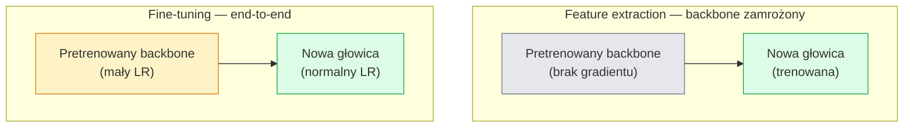

# Transfer Learning i fine-tuning

> Ktoś inny spędził milion godzin GPU, ucząc sieć, jak wyglądają krawędzie, tekstury i części obiektów. Powinieneś pożyczyć te cechy, zanim wytrenujesz własną sieć od zera.

**Typ:** Build
**Języki:** Python
**Wymagania wstępne:** Faza 4 Lekcja 03 (CNN), Faza 4 Lekcja 04 (Klasyfikacja obrazów)
**Czas:** ~75 minut

## Cele nauki

- Odróżnienie feature extraction od fine-tuningu i wybór właściwego podejścia na podstawie rozmiaru zbioru danych, odległości domenowej i budżetu obliczeniowego
- Wczytanie pretrenowanego backbone'u, zamiana jego głowicy klasyfikacyjnej i wytrenowanie samej głowicy do działającego baseline'u w mniej niż 20 liniach kodu
- Progresywne odmrażanie warstw z dyskryminacyjnymi learning rate'ami, tak aby wczesne, ogólne cechy otrzymywały mniejsze aktualizacje niż późne, specyficzne dla zadania
- Diagnozowanie trzech typowych awarii: dryfu cech (feature drift) spowodowanego za wysokim LR na odmrożonych blokach, zapadnięcia statystyk BN na małych zbiorach danych oraz katastroficznego zapominania

## Problem

Trenowanie ResNet-50 na ImageNet kosztuje około 2000 godzin GPU. Bardzo niewiele zespołów ma taki budżet na każde zadanie, które wdraża. To, co praktycznie każdy zespół faktycznie wdraża, to pretrenowany backbone z nową głowicą wytrenowaną na kilkuset lub kilku tysiącach obrazów specyficznych dla zadania.

To nie jest skrót na łatwą ścieżkę. Pierwszy blok konwolucyjny każdej sieci CNN trenowanej na ImageNet uczy się krawędzi i filtrów przypominających filtry Gabora. Kolejne kilka bloków uczy się tekstur i prostych motywów. Środkowe bloki uczą się części obiektów. Końcowe bloki uczą się kombinacji, które zaczynają przypominać 1000 kategorii ImageNet. Pierwsze 90% tej hierarchii przenosi się praktycznie bez zmian na obrazowanie medyczne, inspekcję przemysłową, dane satelitarne i wszystkie inne zadania związane z wizją — bo natura ma ograniczone słownictwo krawędzi i tekstur. Ostatnie 10% to to, co faktycznie trenujesz.

Prawidłowe wykonanie transferu wiąże się z trzema błędami, które na ciebie czekają: zniszczenie pretrenowanych cech przy zbyt wysokim learning rate, zagłodzenie modelu informacją przez zamrożenie zbyt wielu warstw oraz dopuszczenie do dryfu uśrednianych statystyk BatchNorm w stronę małego zbioru danych, na którym reszta sieci nigdy się nie uczyła. Ta lekcja przechodzi przez każdy z nich celowo.

## Koncepcja

### Feature extraction vs fine-tuning

Dwa reżimy, wybierane na podstawie tego, jak bardzo ufasz pretrenowanym cechom i jak dużo masz danych.



Zasady ogólne:

| Rozmiar zbioru danych | Odległość domenowa | Przepis |
|--------------|-----------------|--------|
| < 1k obrazów | bliska ImageNet | Zamroź backbone, trenuj tylko głowicę |
| 1k-10k | bliska | Zamroź pierwsze 2-3 etapy, dotrenuj resztę |
| 10k-100k | dowolna | Fine-tuning end-to-end z dyskryminacyjnym LR |
| 100k+ | daleka | Dotrenuj wszystko; rozważ trenowanie od zera, jeśli domena jest wystarczająco daleka |

"Bliska ImageNet" oznacza w przybliżeniu naturalne zdjęcia RGB z zawartością przypominającą obiekty. Tomografia medyczna, zdjęcia satelitarne z lotu ptaka i mikroskopia to dalekie domeny — cechy wciąż pomagają, ale trzeba pozwolić na adaptację większej liczby warstw.

### Czemu zamrażanie działa w ogóle

Cechy ImageNet, których uczy się CNN, nie są wyspecjalizowane w 1000 kategorii. Są wyspecjalizowane w statystyce naturalnych obrazów: krawędziach o określonych orientacjach, teksturach, wzorcach kontrastu, prymitywach kształtu. Te statystyki są stabilne w prawie każdej domenie wizualnej, jaką człowiek potrafi nazwać. Dlatego model wytrenowany na ImageNet i ewaluowany zero-shot na CIFAR-10 z zaledwie nową głowicą liniową (bez fine-tuningu backbone'u) osiąga ponad 80% dokładności. Głowica uczy się, które z już nauczonych cech ważyć dla tego zadania.

### Dyskryminacyjne learning rate'y

Kiedy odmrażasz warstwy, wczesne warstwy powinny trenować się wolniej niż późne. Wczesne warstwy kodują ogólne cechy, które chcesz zachować; późne warstwy kodują strukturę specyficzną dla zadania, którą musisz znacząco zmienić.

```
Typowy przepis:

  etap 0 (stem + pierwsza grupa): lr = base_lr / 100    (w większości stały)
  etap 1:                         lr = base_lr / 10
  etap 2:                         lr = base_lr / 3
  etap 3 (ostatnia grupa backbone'u): lr = base_lr
  głowica:                        lr = base_lr  (lub nieco wyższy)
```

W PyTorchu to po prostu lista grup parametrów przekazana do optymalizatora. Jeden model, pięć learning rate'ów, zero dodatkowego kodu.

### Problem BatchNorm

Warstwy BN przechowują bufory `running_mean` i `running_var`, które zostały obliczone na ImageNet. Jeśli twoje zadanie ma inny rozkład pikseli — inne oświetlenie, inny sensor, inną przestrzeń kolorów — te bufory są błędne. Trzy opcje w kolejności preferencji:

1. **Fine-tuning z BN w trybie train.** Niech BN aktualizuje swoje statystyki bieżące razem z resztą sieci. Domyślny wybór, gdy zbiór danych dla zadania jest średniej wielkości (>= 5k przykładów).
2. **Zamrożenie BN w trybie eval.** Zachowaj statystyki ImageNet i trenuj tylko wagi. Właściwe, gdy zbiór danych jest tak mały, że średnia bieżąca BN byłaby zaszumiona.
3. **Zamiana BN na GroupNorm.** Całkowicie usuwa problem średniej bieżącej. Używane w backbone'ach do detekcji i segmentacji, gdzie rozmiar batcha na GPU jest mały.

Pomyłka w tym miejscu po cichu obniża dokładność o 5-15%.

### Projektowanie głowicy

Głowica klasyfikacyjna to 1-3 warstwy liniowe plus opcjonalny dropout. Każdy backbone z torchvision ma domyślną głowicę, którą zastępujesz:

```
backbone.fc = nn.Linear(backbone.fc.in_features, num_classes)          # ResNet
backbone.classifier[1] = nn.Linear(..., num_classes)                    # EfficientNet, MobileNet
backbone.heads.head = nn.Linear(..., num_classes)                       # torchvision ViT
```

Dla małych zbiorów danych zwykle wystarczy jedna warstwa liniowa. Dodanie warstwy skrytej (Linear -> ReLU -> Dropout -> Linear) pomaga, gdy rozkład zadania jest dalszy od rozkładu treningowego backbone'u.

### Layer-wise LR decay

Bardziej gładka wersja dyskryminacyjnego LR używana w nowoczesnych fine-tune'ach (BEiT, DINOv2, fine-tuny ViT-B). Zamiast grupować warstwy w etapy, każdej warstwie przypisuje się nieco mniejszy LR niż warstwie powyżej:

```
lr_layer_k = base_lr * decay^(L - k)
```

Z decay = 0.75 i L = 12 blokami transformera, pierwszy blok trenuje się z LR równym `0.75^11 ≈ 0.04x` LR głowicy. Ma większe znaczenie w fine-tune'ach transformerów niż w CNN, gdzie LR grupowany etapowo zwykle wystarcza.

### Co ewaluować

Przebiegi transfer learningu wymagają dwóch liczb, których nie śledziłbyś przy treningu od zera:

- **Dokładność tylko-pretrenowana (pretrained-only)** — dokładność głowicy z zamrożonym backbone'em. To twoja podłoga.
- **Dokładność po fine-tuningu** — ten sam model po treningu end-to-end. To twój sufit.

Jeśli wersja po fine-tuningu jest gorsza niż tylko-pretrenowana, masz błąd learning rate'u lub BN. Zawsze wypisuj obie wartości.

## Zbuduj to

### Krok 1: Wczytaj pretrenowany backbone i sprawdź go

```python
import torch
import torch.nn as nn
from torchvision.models import resnet18, ResNet18_Weights

backbone = resnet18(weights=ResNet18_Weights.IMAGENET1K_V1)
print(backbone)
print()
print("classifier head:", backbone.fc)
print("feature dim:", backbone.fc.in_features)
```

`ResNet18` ma cztery etapy (`layer1..layer4`) plus stem i głowicę `fc`. Każdy backbone klasyfikacyjny z torchvision ma analogiczną strukturę.

### Krok 2: Feature extraction — zamroź wszystko, zastąp głowicę

```python
def make_feature_extractor(num_classes=10):
    model = resnet18(weights=ResNet18_Weights.IMAGENET1K_V1)
    for p in model.parameters():
        p.requires_grad = False
    model.fc = nn.Linear(model.fc.in_features, num_classes)
    return model

model = make_feature_extractor(num_classes=10)
trainable = sum(p.numel() for p in model.parameters() if p.requires_grad)
frozen = sum(p.numel() for p in model.parameters() if not p.requires_grad)
print(f"trainable: {trainable:>10,}")
print(f"frozen:    {frozen:>10,}")
```

Tylko `model.fc` jest trenowalne. Backbone jest zamrożonym ekstraktorem cech.

### Krok 3: Fine-tuning dyskryminacyjny

Funkcja pomocnicza, która buduje grupy parametrów z learning rate'ami specyficznymi dla etapu.

```python
def discriminative_param_groups(model, base_lr=1e-3, decay=0.3):
    stages = [
        ["conv1", "bn1"],
        ["layer1"],
        ["layer2"],
        ["layer3"],
        ["layer4"],
        ["fc"],
    ]
    groups = []
    for i, names in enumerate(stages):
        lr = base_lr * (decay ** (len(stages) - 1 - i))
        params = [p for n, p in model.named_parameters()
                  if any(n.startswith(k) for k in names)]
        if params:
            groups.append({"params": params, "lr": lr, "name": "_".join(names)})
    return groups

model = resnet18(weights=ResNet18_Weights.IMAGENET1K_V1)
model.fc = nn.Linear(model.fc.in_features, 10)
for p in model.parameters():
    p.requires_grad = True

groups = discriminative_param_groups(model)
for g in groups:
    print(f"{g['name']:>10s}  lr={g['lr']:.2e}  params={sum(p.numel() for p in g['params']):>8,}")
```

`decay=0.3` oznacza, że każdy etap trenuje się z 30% szybkości kolejnego etapu. `fc` otrzymuje `base_lr`, `layer4` otrzymuje `0.3 * base_lr`, `conv1` otrzymuje `0.3^5 * base_lr ≈ 0.00243 * base_lr`. Brzmi ekstremalnie; empirycznie działa.

### Krok 4: Obsługa BatchNorm

Funkcja pomocnicza zamrażająca statystyki bieżące BN bez zamrażania jego wag.

```python
def freeze_bn_stats(model):
    for m in model.modules():
        if isinstance(m, (nn.BatchNorm1d, nn.BatchNorm2d, nn.BatchNorm3d)):
            m.eval()
            for p in m.parameters():
                p.requires_grad = False
    return model
```

Wywołaj ją po ustawieniu `model.train()` na początku każdej epoki. `model.train()` przełącza wszystko w tryb treningowy; ta funkcja odwraca to tylko dla warstw BN.

### Krok 5: Minimalna pętla fine-tuningu end-to-end

```python
from torch.optim import SGD
from torch.utils.data import DataLoader
from torch.optim.lr_scheduler import CosineAnnealingLR
import torch.nn.functional as F

def fine_tune(model, train_loader, val_loader, device, epochs=5, base_lr=1e-3, freeze_bn=False):
    model = model.to(device)
    groups = discriminative_param_groups(model, base_lr=base_lr)
    optimizer = SGD(groups, momentum=0.9, weight_decay=1e-4, nesterov=True)
    scheduler = CosineAnnealingLR(optimizer, T_max=epochs)

    for epoch in range(epochs):
        model.train()
        if freeze_bn:
            freeze_bn_stats(model)
        tr_loss, tr_correct, tr_total = 0.0, 0, 0
        for x, y in train_loader:
            x, y = x.to(device), y.to(device)
            logits = model(x)
            loss = F.cross_entropy(logits, y, label_smoothing=0.1)
            optimizer.zero_grad()
            loss.backward()
            optimizer.step()
            tr_loss += loss.item() * x.size(0)
            tr_total += x.size(0)
            tr_correct += (logits.argmax(-1) == y).sum().item()
        scheduler.step()

        model.eval()
        va_total, va_correct = 0, 0
        with torch.no_grad():
            for x, y in val_loader:
                x, y = x.to(device), y.to(device)
                pred = model(x).argmax(-1)
                va_total += x.size(0)
                va_correct += (pred == y).sum().item()
        print(f"epoch {epoch}  train {tr_loss/tr_total:.3f}/{tr_correct/tr_total:.3f}  "
              f"val {va_correct/va_total:.3f}")
    return model
```

Pięć epok z powyższym przepisem na CIFAR-10 przeprowadza `ResNet18-IMAGENET1K_V1` z ~70% dokładności zero-shot linear-probe do ~93% dokładności po fine-tuningu. Sama głowica zatrzymałaby się na poziomie ~86% bez dotykania backbone'u.

### Krok 6: Progresywne odmrażanie

Harmonogram, który odmraża jeden etap na epokę, od końca w stronę początku. Łagodzi dryf cech kosztem kilku dodatkowych epok.

```python
def progressive_unfreeze_schedule(model):
    stages = ["layer4", "layer3", "layer2", "layer1"]
    yielded = set()

    def start():
        for p in model.parameters():
            p.requires_grad = False
        for p in model.fc.parameters():
            p.requires_grad = True

    def unfreeze(epoch):
        if epoch < len(stages):
            name = stages[epoch]
            yielded.add(name)
            for n, p in model.named_parameters():
                if n.startswith(name):
                    p.requires_grad = True
            return name
        return None

    return start, unfreeze
```

Wywołaj `start()` raz przed pierwszą epoką. Wywołuj `unfreeze(epoch)` na początku każdej epoki. Przebuduj optymalizator każdorazowo, gdy zmienia się zbiór trenowalnych parametrów, w przeciwnym razie zamrożone parametry wciąż przechowują zbuforowane momenty, które wprowadzają go w błąd.

## Wykorzystaj to

Dla większości realnych zadań `torchvision.models` + trzy linie wystarczą. Powyższe, cięższe mechanizmy mają znaczenie, gdy napotkasz problemy, których domyślne ustawienia biblioteki nie naprawią.

```python
from torchvision.models import resnet50, ResNet50_Weights

model = resnet50(weights=ResNet50_Weights.IMAGENET1K_V2)
model.fc = nn.Linear(model.fc.in_features, num_classes)
optimizer = torch.optim.AdamW(model.parameters(), lr=1e-4, weight_decay=1e-4)
```

Dwa inne domyślne podejścia klasy produkcyjnej:

- `timm` udostępnia ~800 pretrenowanych backbone'ów wizyjnych z konsekwentnym API (`timm.create_model("resnet50", pretrained=True, num_classes=10)`). Dla każdego fine-tune'u wykraczającego poza zoo torchvision jest to standard.
- Dla transformerów `transformers.AutoModelForImageClassification.from_pretrained(name, num_labels=N)` daje ci ViT / BEiT / DeiT z taką samą semantyką wczytywania jak modele tekstowe.

## Wypchnij to

Ta lekcja produkuje:

- `outputs/prompt-fine-tune-planner.md` — prompt, który wybiera między feature extraction, progresywnym a end-to-end fine-tuningiem na podstawie rozmiaru zbioru danych, odległości domenowej i budżetu obliczeniowego.
- `outputs/skill-freeze-inspector.md` — skill, który dla podanego modelu PyTorch raportuje, które parametry są trenowalne, które warstwy BatchNorm są w trybie eval, i czy optymalizator faktycznie otrzymuje trenowalne parametry.

## Ćwiczenia

1. **(Łatwe)** Wytrenuj `ResNet18` jako linear probe (backbone zamrożony) oraz jako pełny fine-tuning na tym samym syntetycznym zbiorze CIFAR. Zaraportuj obie dokładności obok siebie. Wyjaśnij, która różnica mówi ci, że cechy przenoszą się dobrze, a która że nie.
2. **(Średnie)** Wprowadź błąd celowo: ustaw `base_lr = 1e-1` na etapie backbone'u zamiast na głowicy. Pokaż, jak strata treningowa eksploduje, a następnie napraw sytuację, stosując funkcję pomocniczą `discriminative_param_groups`. Zapisz LR, przy którym każdy etap zaczyna się rozjeżdżać (divergencja).
3. **(Trudne)** Weź zbiór danych obrazowania medycznego (np. CheXpert-small, PatchCamelyon lub HAM10000) i porównaj trzy reżimy: (a) zamrożony backbone pretrenowany na ImageNet + liniowa głowica; (b) fine-tuning end-to-end backbone'u pretrenowanego na ImageNet; (c) trening od zera. Zaraportuj dokładność i koszt obliczeniowy dla każdego z nich. Przy jakim rozmiarze zbioru danych trening od zera staje się konkurencyjny?

## Kluczowe terminy

| Termin | Co się mówi | Co to faktycznie znaczy |
|------|----------------|----------------------|
| Feature extraction | "Zamroź i trenuj głowicę" | Parametry backbone'u zamrożone, gradient otrzymuje tylko nowa głowica klasyfikacyjna |
| Fine-tuning | "Dotrenuj end-to-end" | Wszystkie parametry trenowalne, zwykle z dużo mniejszym LR niż trening od zera |
| Dyskryminacyjny LR | "Mniejszy LR dla wczesnych warstw" | Grupy parametrów optymalizatora, w których LR wczesnego etapu jest ułamkiem LR późnego etapu |
| Layer-wise LR decay | "Gładki gradient LR" | LR dla każdej warstwy pomnożony przez decay^(L - k); powszechne w fine-tune'ach transformerów |
| Catastrophic forgetting (katastroficzne zapominanie) | "Model zgubił ImageNet" | Za wysoki LR nadpisuje pretrenowane cechy zanim zostanie nauczony sygnał z nowego zadania |
| Dryf statystyk BN | "Running mean jest błędny" | running_mean/var BatchNorm obliczone na innym rozkładzie niż bieżące zadanie, co po cichu szkodzi dokładności |
| Linear probe | "Zamrożony backbone + liniowa głowica" | Ewaluacja pretrenowanych cech — dokładność najlepszego klasyfikatora liniowego na zamrożonej reprezentacji |
| Catastrophic collapse (katastroficzne zapadnięcie) | "Wszystko przewiduje jedną klasę" | Pojawia się, gdy fine-tuning odbywa się z LR wystarczająco wysokim, aby zniszczyć cechy, zanim gradienty z głowicy zdążą się ustabilizować |

## Dalsze materiały

- [How transferable are features in deep neural networks? (Yosinski et al., 2014)](https://arxiv.org/abs/1411.1792) — praca, która skwantyfikowała przenoszalność cech między warstwami
- [Universal Language Model Fine-tuning (ULMFiT, Howard & Ruder, 2018)](https://arxiv.org/abs/1801.06146) — oryginalny przepis na dyskryminacyjny LR / progresywne odmrażanie; idee przenoszą się bezpośrednio na wizję
- [timm documentation](https://huggingface.co/docs/timm) — punkt odniesienia dla nowoczesnych backbone'ów wizyjnych i dokładnych domyślnych ustawień fine-tuningu, z którymi zostały wytrenowane
- [A Simple Framework for Linear-Probe Evaluation (Kornblith et al., 2019)](https://arxiv.org/abs/1805.08974) — czemu dokładność linear-probe ma znaczenie i jak ją prawidłowo raportować
