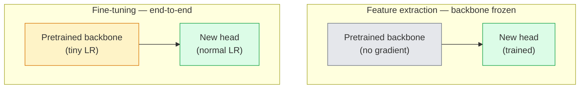

# Przenieś naukę i dostrajanie

> Ktoś inny spędził milion godzin na GPU, ucząc sieć, jak wyglądają krawędzie, tekstury i części obiektów. Powinieneś pożyczyć te funkcje przed szkoleniem własnych.

**Typ:** Kompilacja
**Języki:** Python
**Wymagania wstępne:** Faza 4, lekcja 03 (CNN), Faza 4, lekcja 04 (klasyfikacja obrazów)
**Czas:** ~75 minut

## Cele nauczania

- Odróżnij ekstrakcję funkcji od dostrajania i wybierz właściwą na podstawie rozmiaru zestawu danych, odległości domeny i budżetu obliczeniowego
- Załaduj wstępnie wytrenowany szkielet, wymień jego głowę klasyfikatora i wytrenuj tylko głowę do roboczej linii bazowej w mniej niż 20 liniach
- Stopniowo odmrażaj warstwy z dyskryminacyjnym współczynnikiem uczenia się, tak aby wczesne funkcje ogólne otrzymywały mniejsze aktualizacje niż późne funkcje specyficzne dla zadania
- Zdiagnozuj trzy typowe awarie: dryf funkcji ze zbyt wysokiego LR na niezamrożonych blokach, załamanie statystyk BN na małych zbiorach danych i katastrofalne zapominanie

## Problem

Szkolenie ResNet-50 w ImageNet kosztuje około 2000 godzin pracy procesora graficznego. Bardzo niewiele zespołów dysponuje takim budżetem na każde zadanie, które wysyła. Prawie każdy zespół tak naprawdę dostarcza wstępnie przeszkolony szkielet z nową głową przeszkoloną na kilkuset lub kilku tysiącach obrazów specyficznych dla danego zadania.

To nie jest skrót. Pierwszy blok konwersji dowolnego CNN przeszkolonego przez ImageNet uczy się krawędzi i filtrów podobnych do Gabora. Kolejne kilka bloków uczy się tekstur i prostych motywów. Środkowe bloki uczą się części obiektu. Ostatnie bloki uczą się kombinacji, które zaczynają wyglądać jak 1000 kategorii ImageNet. Pierwsze 90% tej hierarchii przenosi się niemal w niezmienionej postaci do obrazowania medycznego, inspekcji przemysłowych, danych satelitarnych i wszystkich innych zadań związanych z widzeniem – ponieważ natura ma ograniczone słownictwo dotyczące krawędzi i tekstur. Ostatnie 10% to to, co faktycznie trenujesz.

Prawidłowe wykonanie transferu wiąże się z trzema błędami: niszczeniem wstępnie wyszkolonych funkcji ze zbyt dużą szybkością uczenia się, głodzeniem modelu informacji przez zamrożenie zbyt dużej ilości informacji oraz pozwalaniem, aby bieżące statystyki BatchNorm dryfowały w stronę małego zbioru danych, z którego reszta sieci nigdy się nie nauczyła. Ta lekcja prowadzi każdego z nich celowo.

## Koncepcja

### Ekstrakcja funkcji a dostrajanie

Dwa tryby wybrane na podstawie tego, jak bardzo ufasz wstępnie wytrenowanym funkcjom i ile masz danych.



Praktyczne zasady:

| Rozmiar zbioru danych | Odległość domeny | Przepis |
|-------------|--------------------------------|------------|
| < 1 tys. obrazów | blisko ImageNet | Zamroź kręgosłup, tylko główka pociągu |
| 1k-10k | zamknij | Zamroź pierwsze 2-3 etapy, dopracuj resztę |
| 10 tys.-100 tys. | dowolny | Dostosuj kompleksowo za pomocą dyskryminacyjnego LR |
| 100 tys.+ | daleko | Dostosuj wszystko; rozważ szkolenie od podstaw, jeśli domena jest wystarczająco odległa |

„Blisko ImageNet” oznacza w przybliżeniu naturalne zdjęcia RGB z treścią przypominającą obiekt. Medyczna tomografia komputerowa, zdjęcia satelitarne z góry i mikroskopia to odległe domeny — funkcje nadal są pomocne, ale konieczne będzie dostosowanie większej liczby warstw.

### Dlaczego zamrażanie w ogóle działa

Jak dowiaduje się CNN, funkcje ImageNet nie są wyspecjalizowane w 1000 kategoriach. Specjalizują się w statystyce obrazów naturalnych: krawędziach o określonych orientacjach, teksturach, wzorach kontrastowych, prymitywach kształtów. Statystyki te są stabilne w niemal każdej dziedzinie wizualnej, którą człowiek może nazwać. Dlatego model wyszkolony w ImageNet i oceniony zerowo na CIFAR-10 z samą nową głowicą liniową (bez precyzyjnego dostrojenia szkieletu) osiąga dokładność ponad 80%. Głowa uczy się, które z poznanych już cech wyważyć do tego zadania.

### Dyskryminacyjne współczynniki uczenia się

Kiedy odmrozisz, wczesne warstwy powinny trenować wolniej niż późne warstwy. Wczesne warstwy kodują ogólne funkcje, które chcesz zachować; późne warstwy kodują strukturę specyficzną dla zadania, którą trzeba często przenosić.

```
Typical recipe:

  stage 0 (stem + first group): lr = base_lr / 100    (mostly fixed)
  stage 1:                       lr = base_lr / 10
  stage 2:                       lr = base_lr / 3
  stage 3 (last backbone group): lr = base_lr
  head:                          lr = base_lr  (or slightly higher)
```

W PyTorch jest to po prostu lista grup parametrów przekazywana do optymalizatora. Jeden model, pięć szybkości uczenia się, zero dodatkowego kodu.

### Problem BatchNorm

Warstwy BN zawierają bufory `running_mean` i `running_var`, które zostały obliczone w ImageNet. Jeśli Twoje zadanie ma inny rozkład pikseli — inne oświetlenie, inny czujnik, inną przestrzeń kolorów — te bufory są nieprawidłowe. Trzy opcje w kolejności preferencji:

1. **Dostosuj BN w trybie pociągu.** Pozwól BN aktualizować swoje statystyki działania wraz ze wszystkim innym. Domyślny wybór, gdy zbiór danych zadania jest średniej wielkości (>= 5 tys. przykładów).
2. **Zamroź BN w trybie eval.** Zachowaj statystyki ImageNet i trenuj tylko z ciężarkami. Popraw, jeśli Twój zbiór danych jest na tyle mały, że średnia ruchoma BN byłaby zaszumiona.
3. **Zastąp BN przez GroupNorm.** Całkowicie usuwa problem średniej ruchomej. Używany w szkieletach wykrywania i segmentacji, gdzie wielkość partii na procesor graficzny jest niewielka.

Zrobienie tego źle powoduje ciche zmniejszenie celności czołgów o 5-15%.

### Projekt głowy

Głowica klasyfikatora składa się z 1-3 warstw liniowych plus opcjonalny dropout. Każdy szkielet Torchvision ma domyślną głowicę, którą możesz wymienić:

```
backbone.fc = nn.Linear(backbone.fc.in_features, num_classes)          # ResNet
backbone.classifier[1] = nn.Linear(..., num_classes)                    # EfficientNet, MobileNet
backbone.heads.head = nn.Linear(..., num_classes)                       # torchvision ViT
```

W przypadku małych zbiorów danych zwykle wystarcza pojedyncza warstwa liniowa. Dodanie warstwy ukrytej (Linear -> ReLU -> Dropout -> Linear) pomaga, gdy dystrybucja zadań jest dalej od dystrybucji szkoleniowej szkieletu.

### Warstwowy zanik LR

Płynniejsza wersja dyskryminacyjnego LR stosowana w nowoczesnym dostrajaniu (dostrajanie BEiT, DINOv2, ViT-B). Zamiast grupować warstwy w etapy, nadaj każdej warstwie nieco mniejszy LR niż warstwa znajdująca się nad nią:

```
lr_layer_k = base_lr * decay^(L - k)
```

Przy zaniku = 0,75 i L = 12 bloków transformatorowych, pierwszy blok pociągów znajduje się w `0.75^11 ≈ 0.04x` LR głowicy. Ma większe znaczenie w przypadku dostrojenia transformatora niż w przypadku CNN, gdzie zwykle wystarczą LR zgrupowane na scenach.

### Co ocenić

Przebiegi uczenia się transferu wymagają dwóch liczb, których nie można śledzić w trybie podstawowym:

- **Dokładność tylko wstępnie wytrenowana** — dokładność głowy przy zamrożonym kręgosłupie. To jest twoje piętro.
- **Dopracowana dokładność** — ten sam model po kompleksowym szkoleniu. To jest twój sufit.

Jeśli dostrojenie jest mniejsze niż tylko wstępne przeszkolenie, występuje błąd szybkości uczenia się lub błąd BN. Zawsze drukuj oba.

## Zbuduj to

### Krok 1: Załaduj wstępnie wytrenowany szkielet i sprawdź go

```python
import torch
import torch.nn as nn
from torchvision.models import resnet18, ResNet18_Weights

backbone = resnet18(weights=ResNet18_Weights.IMAGENET1K_V1)
print(backbone)
print()
print("classifier head:", backbone.fc)
print("feature dim:", backbone.fc.in_features)
```

`ResNet18` ma cztery etapy (`layer1..layer4`) plus rdzeń i `fc`. Każdy szkielet klasyfikacji Torchvision ma analogiczną strukturę.

### Krok 2: Ekstrakcja cech — zamroź wszystko, wymień głowicę

```python
def make_feature_extractor(num_classes=10):
    model = resnet18(weights=ResNet18_Weights.IMAGENET1K_V1)
    for p in model.parameters():
        p.requires_grad = False
    model.fc = nn.Linear(model.fc.in_features, num_classes)
    return model

model = make_feature_extractor(num_classes=10)
trainable = sum(p.numel() for p in model.parameters() if p.requires_grad)
frozen = sum(p.numel() for p in model.parameters() if not p.requires_grad)
print(f"trainable: {trainable:>10,}")
print(f"frozen:    {frozen:>10,}")
```

Można trenować tylko `model.fc`. Podstawą jest zamrożony ekstraktor funkcji.

### Krok 3: Dostrajanie dyskryminacyjne

Narzędzie, które tworzy grupy parametrów z szybkością uczenia się charakterystyczną dla danego etapu.

```python
def discriminative_param_groups(model, base_lr=1e-3, decay=0.3):
    stages = [
        ["conv1", "bn1"],
        ["layer1"],
        ["layer2"],
        ["layer3"],
        ["layer4"],
        ["fc"],
    ]
    groups = []
    for i, names in enumerate(stages):
        lr = base_lr * (decay ** (len(stages) - 1 - i))
        params = [p for n, p in model.named_parameters()
                  if any(n.startswith(k) for k in names)]
        if params:
            groups.append({"params": params, "lr": lr, "name": "_".join(names)})
    return groups

model = resnet18(weights=ResNet18_Weights.IMAGENET1K_V1)
model.fc = nn.Linear(model.fc.in_features, 10)
for p in model.parameters():
    p.requires_grad = True

groups = discriminative_param_groups(model)
for g in groups:
    print(f"{g['name']:>10s}  lr={g['lr']:.2e}  params={sum(p.numel() for p in g['params']):>8,}")
```

`decay=0.3` oznacza, że każdy etap jest trenowany z szybkością 30% szybkości następnego. `fc` pobiera `base_lr`, `layer4` pobiera `0.3 * base_lr`, `conv1` pobiera `0.3^5 * base_lr ≈ 0.00243 * base_lr`. Ekstremalne brzmienie; empirycznie to działa.

### Krok 4: Obsługa BatchNorm

Pomocnik do zamrożenia statystyk biegu BN bez zamrażania jego ciężarów.

```python
def freeze_bn_stats(model):
    for m in model.modules():
        if isinstance(m, (nn.BatchNorm1d, nn.BatchNorm2d, nn.BatchNorm3d)):
            m.eval()
            for p in m.parameters():
                p.requires_grad = False
    return model
```

Wywołaj to po ustawieniu `model.train()` na początku każdej epoki. `model.train()` przełącza wszystko do trybu uczenia; odwraca to sytuację tylko dla warstw BN.

### Krok 5: Minimalna, kompleksowa pętla dostrajająca

```python
from torch.optim import SGD
from torch.utils.data import DataLoader
from torch.optim.lr_scheduler import CosineAnnealingLR
import torch.nn.functional as F

def fine_tune(model, train_loader, val_loader, device, epochs=5, base_lr=1e-3, freeze_bn=False):
    model = model.to(device)
    groups = discriminative_param_groups(model, base_lr=base_lr)
    optimizer = SGD(groups, momentum=0.9, weight_decay=1e-4, nesterov=True)
    scheduler = CosineAnnealingLR(optimizer, T_max=epochs)

    for epoch in range(epochs):
        model.train()
        if freeze_bn:
            freeze_bn_stats(model)
        tr_loss, tr_correct, tr_total = 0.0, 0, 0
        for x, y in train_loader:
            x, y = x.to(device), y.to(device)
            logits = model(x)
            loss = F.cross_entropy(logits, y, label_smoothing=0.1)
            optimizer.zero_grad()
            loss.backward()
            optimizer.step()
            tr_loss += loss.item() * x.size(0)
            tr_total += x.size(0)
            tr_correct += (logits.argmax(-1) == y).sum().item()
        scheduler.step()

        model.eval()
        va_total, va_correct = 0, 0
        with torch.no_grad():
            for x, y in val_loader:
                x, y = x.to(device), y.to(device)
                pred = model(x).argmax(-1)
                va_total += x.size(0)
                va_correct += (pred == y).sum().item()
        print(f"epoch {epoch}  train {tr_loss/tr_total:.3f}/{tr_correct/tr_total:.3f}  "
              f"val {va_correct/va_total:.3f}")
    return model
```

Pięć epok z powyższą recepturą na CIFAR-10 zapewnia `ResNet18-IMAGENET1K_V1` od ~70% dokładności sondy liniowej z zerowym strzałem do ~93% dokładności precyzyjnie dostrojonej. Sama głowa ustabilizuje się na poziomie około 86%, nie dotykając w ogóle kręgosłupa.

### Krok 6: Stopniowe odmrażanie

Harmonogram, który odmraża jeden etap w epoce od końca do początku. Łagodzi dryf funkcji kosztem kilku dodatkowych epok.

```python
def progressive_unfreeze_schedule(model):
    stages = ["layer4", "layer3", "layer2", "layer1"]
    yielded = set()

    def start():
        for p in model.parameters():
            p.requires_grad = False
        for p in model.fc.parameters():
            p.requires_grad = True

    def unfreeze(epoch):
        if epoch < len(stages):
            name = stages[epoch]
            yielded.add(name)
            for n, p in model.named_parameters():
                if n.startswith(name):
                    p.requires_grad = True
            return name
        return None

    return start, unfreeze
```

Wywołaj `start()` raz przed pierwszą epoką. Wywołaj `unfreeze(epoch)` na początku każdej epoki. Odbuduj optymalizator za każdym razem, gdy zmieni się zestaw możliwych do wyszkolenia parametrów, w przeciwnym razie zamrożone parametry nadal przechowują buforowane momenty, które je mylą.

## Użyj tego

W przypadku większości rzeczywistych zadań wystarczą `torchvision.models` + trzy linie. Cięższe maszyny powyżej mają znaczenie, gdy napotkasz problemy, których domyślne biblioteki nie mogą rozwiązać.

```python
from torchvision.models import resnet50, ResNet50_Weights

model = resnet50(weights=ResNet50_Weights.IMAGENET1K_V2)
model.fc = nn.Linear(model.fc.in_features, num_classes)
optimizer = torch.optim.AdamW(model.parameters(), lr=1e-4, weight_decay=1e-4)
```

Dwa inne ustawienia domyślne klasy produkcyjnej:

- `timm` dostarcza około 800 wstępnie przeszkolonych szkieletów wizyjnych ze spójnym interfejsem API (`timm.create_model("resnet50", pretrained=True, num_classes=10)`). Jest to standard w przypadku każdego dostrojenia wykraczającego poza zoo Torchvision.
- W przypadku transformatorów `transformers.AutoModelForImageClassification.from_pretrained(name, num_labels=N)` zapewnia ViT / BEiT / DeiT z taką samą semantyką ładowania jak modele tekstowe.

## Wyślij to

Ta lekcja daje:

- `outputs/prompt-fine-tune-planner.md` — monit, który wybiera wyodrębnianie cech, progresywne lub kompleksowe dostrajanie w oparciu o rozmiar zbioru danych, odległość domeny i budżet obliczeniowy.
- `outputs/skill-freeze-inspector.md` — umiejętność, która w przypadku modelu PyTorch informuje, które parametry można wytrenować, które warstwy BatchNorm są w trybie eval i czy optymalizator faktycznie otrzymuje parametry, które można wytrenować.

## Ćwiczenia

1. **(Łatwe)** Trenuj `ResNet18` jako sondę liniową (szkielet zamrożony) i jako pełne dostrojenie na tym samym syntetycznym zestawie danych CIFAR. Podaj obie dokładności obok siebie. Wyjaśnij, która luka mówi, że funkcje są przenoszone dobrze, a która nie.
2. **(Średni)** Celowo wprowadź błąd: ustaw `base_lr = 1e-1` na scenie szkieletowej zamiast na głowie. Pokaż eksplozję straty treningowej, a następnie regenerację, stosując pomocnika `discriminative_param_groups`. Zapisz LR, przy którym każdy etap zaczyna się rozchodzić.
3. **(Trudny)** Weź zestaw danych obrazowania medycznego (np. CheXpert-small, PatchCamelyon lub HAM10000) i porównaj trzy reżimy: (a) zamrożony szkielet wstępnie wyszkolony w ImageNet + głowica liniowa; (b) Wstępnie wyszkolony przez ImageNet kompleksowy dostrojenie; c) trening podstawowy. Raportuj dokładność i obliczaj koszty dla każdego z nich. Przy jakim rozmiarze zbioru danych trening podstawowy staje się konkurencyjny?

## Kluczowe terminy

| Termin | Co ludzie mówią | Co to właściwie oznacza |
|------|----------------|----------------------|
| Ekstrakcja cech | „Zamroź i trenuj głowę” | Parametry szkieletu zamrożone, tylko nowa głowa klasyfikatora otrzymuje gradient |
| Dostrajanie | „Przekwalifikuj się od początku do końca” | Wszystkie parametry można trenować, zwykle przy znacznie mniejszym LR niż w przypadku treningu podstawowego |
| Dyskryminacyjny LR | „Mniejszy LR dla wczesnych warstw” | Grupy parametrów optymalizatora, w których LR na wczesnym etapie stanowi ułamek LR na późnym etapie |
| Warstwowy rozpad LR | „Gładki gradient LR” | LR na warstwę pomnożony przez rozpad^(L - k); powszechne w dostrojeniach transformatorów |
| Katastrofalne zapomnienie | „Modelka straciła ImageNet” | Zbyt wysoki LR nadpisuje wstępnie wytrenowane funkcje przed nauczeniem się nowego sygnału zadania |
| Dryft statystyk BN | „Średnia biegania jest zła” | BatchNorm running_mean/var obliczono dla innej dystrybucji niż bieżące zadanie, po cichu pogarszając dokładność |
| Sonda liniowa | „Zamrożony kręgosłup + głowica liniowa” | Ocena wstępnie wytrenowanych cech — dokładność najlepszego klasyfikatora liniowego na wierzchu zamrożonej reprezentacji |
| Katastrofalny upadek | „Wszystko przepowiada jedną klasę” | Dzieje się tak podczas dostrajania z LR wystarczająco wysokim, aby zniszczyć cechy, zanim gradienty z głowy ustabilizują się |

## Dalsze czytanie

- [Jak możliwe jest przenoszenie funkcji w głębokich sieciach neuronowych? (Yosinski et al., 2014)](https://arxiv.org/abs/1411.1792) — artykuł, w którym określono ilościowo możliwość przenoszenia cech między warstwami
- [Dostrajanie modelu języka uniwersalnego (ULMFiT, Howard & Ruder, 2018)](https://arxiv.org/abs/1801.06146) — oryginalny przepis na dyskryminacyjny LR / progresywne odmrażanie; pomysły przenoszą się bezpośrednio na wizję
– [dokumentacja Timma](https://huggingface.co/docs/timm) — odniesienie do współczesnych szkieletów wzroku i dokładnych ustawień domyślnych, z którymi zostali przeszkoleni
- [A Simple Framework for Linear-Probe Evaluation (Kornblith et al., 2019)](https://arxiv.org/abs/1805.08974) — dlaczego dokładność sondy liniowej ma znaczenie i jak ją poprawnie raportować