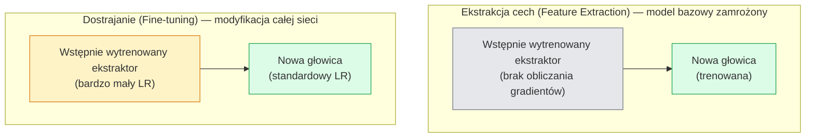

# Uczenie transferowe i dostrajanie (Transfer Learning & Fine-tuning)

> Ktoś inny poświęcił tysiące godzin pracy procesorów GPU, ucząc sieć rozpoznawania krawędzi, tekstur i kształtów obiektów. Zanim zaczniesz trenować własny model od zera, warto zaimportować te gotowe reprezentacje cech.

**Typ:** Teoria + Praktyka  
**Języki:** Python, PyTorch  
**Wymagania wstępne:** Faza 4 Lekcja 03 (CNN), Faza 4 Lekcja 04 (Klasyfikacja obrazów)  
**Czas:** ~75 minut  

## Cele kształcenia

- Rozróżnienie ekstrakcji cech (feature extraction) od pełnego dostrajania (fine-tuning) i wybór odpowiedniej strategii na podstawie rozmiaru zbioru danych, podobieństwa domen (domain distance) oraz budżetu obliczeniowego.
- Zaimportowanie wstępnie wytrenowanego modelu bazowego (backbone), modyfikacja jego głowicy klasyfikacyjnej i wytrenowanie nowej głowicy (w niespełna 20 linijkach kodu).
- Wdrożenie zróżnicowanych współczynników uczenia się (discriminative learning rates) w celu stopniowego odmrażania warstw, aby początkowe, ogólne cechy podlegały mniejszym aktualizacjom niż późniejsze warstwy specyficzne dla zadania.
- Diagnozowanie trzech typowych problemów: niszczenia wyuczonych cech (feature drift) przez zbyt wysoki LR w niezamrożonych blokach, zaburzeń statystyk warstw BatchNorm na małych zbiorach danych oraz zjawiska katastrofalnego zapominania (catastrophic forgetting).

## Problem

Wytrenowanie modelu ResNet-50 na zbiorze ImageNet od zera wymaga około 2000 godzin pracy procesorów GPU. Niewiele zespołów inżynierskich dysponuje takim budżetem. W praktyce komercyjnej niemal zawsze wdraża się wstępnie wytrenowany model bazowy z nową głowicą klasyfikacyjną, dostrojoną na kilkuset lub kilku tysiącach obrazów specyficznych dla nowego zadania.

Nie jest to jedynie droga na skróty. Pierwsze bloki konwolucyjne dowolnej sieci CNN wytrenowanej na ImageNet uczą się wykrywania krawędzi i filtrów podobnych do filtrów Gabora. Kolejne bloki rozpoznają proste tekstury i motywy geometryczne. Środkowe bloki uczą się kształtów części obiektów, a dopiero ostatnie warstwy mapują te kombinacje na 1000 specyficznych klas ImageNet. Pierwsze 90% tej hierarchii cech przenosi się niemal w niezmienionej postaci do obrazowania medycznego, inspekcji przemysłowych czy analizy zdjęć satelitarnych – natura operuje bowiem ograniczonym zestawem podstawowych krawędzi i tekstur. Rzeczywistego treningu wymaga jedynie ostatnie 10% sieci.

Poprawne przeprowadzenie tego procesu wymaga uniknięcia trzech poważnych błędów: zniszczenia wcześniej wyuczonych cech przez zbyt wysoki współczynnik uczenia się, ograniczenia pojemności modelu przez nadmierne zamrożenie warstw oraz dopuszczenia do rozregulowania statystyk BatchNorm na małych zbiorach danych. W tej lekcji przeanalizujesz każdy z tych problemów w praktyce.

## Koncepcja

### Ekstrakcja cech (Feature Extraction) a dostrajanie (Fine-tuning)

Oba tryby dobiera się na podstawie wielkości zbioru danych oraz stopnia podobieństwa nowej domeny do ImageNet.



Zasady doboru strategii:

| Rozmiar zbioru danych | Podobieństwo domeny | Strategia postępowania |
| :--- | :--- | :--- |
| **< 1k obrazów** | Bliska (podobna do ImageNet) | Zamroź model bazowy, trenuj wyłącznie nową głowicę |
| **1k - 10k** | Bliska | Zamroź pierwsze 2-3 bloki (stages), dostrajaj pozostałe warstwy |
| **10k - 100k** | Dowolna | Pełne dostrajanie (end-to-end) ze zróżnicowanym LR |
| **> 100k** | Daleka (np. medyczna, satelitarna) | Pełne dostrajanie; rozważ trening od zera, jeśli domena jest skrajnie specyficzna |

Domeny bliskie ImageNet to naturalne zdjęcia obiektów w formacie RGB. Obrazy z tomografii komputerowej, mikroskopowe czy zdjęcia satelitarne to domeny dalekie – wyuczone cechy wciąż będą pomocne, ale konieczne będzie dostrojenie większej liczby głębszych warstw.

### Dlaczego zamrażanie warstw działa

Cechy wyuczone na ImageNet nie są przydatne wyłącznie dla 1000 klas z tego zbioru. Kodują one ogólne statystyki obrazu naturalnego: krawędzie pod różnymi kątami, kontrasty czy tekstury. Właściwości te są uniwersalne dla niemal każdej domeny wizualnej. Dlatego model z wczytanymi wagami ImageNet i nową głowicą liniową (bez modyfikacji ekstraktora) osiąga ponad 80% dokładności na CIFAR-10. Głowica uczy się po prostu, jak optymalnie połączyć istniejące już reprezentacje cech na potrzeby nowego zadania.

### Zróżnicowane współczynniki uczenia się (Discriminative Learning Rates)

Podczas pełnego dostrajania początkowe warstwy sieci powinny być modyfikowane wolniej niż warstwy końcowe. Warstwy początkowe kodują ogólne cechy, które chcemy zachować, natomiast warstwy końcowe odpowiadają za specyficzną strukturę klasyfikowanych obiektów.

Praktyczny podział LR dla grup parametrów:
- **Blok początkowy (Stem) i grupa 1**: $LR = \text{base\_lr} / 100$ (prawie zamrożone)
- **Grupa 2**: $LR = \text{base\_lr} / 10$
- **Grupa 3**: $LR = \text{base\_lr} / 3$
- **Grupa 4 (ostatnia grupa ekstraktora)**: $LR = \text{base\_lr}$
- **Głowica klasyfikacyjna (Head)**: $LR = \text{base\_lr}$ (lub nieco więcej)

W PyTorch realizuje się to poprzez przekazanie listy słowników z grupami parametrów bezpośrednio do konstruktora optymalizatora.

### Problem warstw BatchNorm w uczeniu transferowym

Warstwy BatchNorm przechowują średnie ruchome (`running_mean`) i wariancję (`running_var`) obliczone na zbiorze ImageNet. Jeśli Twoje nowe zadanie ma inny rozkład kolorów czy warunki oświetleniowe, wartości te będą niepoprawne. Rozwiązania tego problemu (w kolejności od najbardziej zalecanych):

1. **Aktualizacja statystyk BN (BatchNorm w trybie treningowym)**: Pozwól warstwom BN na bieżąco aktualizować swoje średnie ruchome w czasie dostrajania. Opcja optymalna przy średnich i dużych zbiorach danych ($\ge$ 5k przykładów).
2. **Zamrożenie statystyk BN (BatchNorm w trybie eval)**: Zablokuj aktualizację średnich ruchomych i korzystaj ze statystyk wyznaczonych na ImageNet, trenując wyłącznie wagi (gamma i beta). Rozwiązanie zalecane przy małych zbiorach danych, gdzie statystyki małych partii wprowadzałyby zbyt dużo szumu.
3. **Zastąpienie BatchNorm przez GroupNorm**: Normalizacja grupowa nie wymaga wyliczania średnich ruchomych dla zbioru, co całkowicie eliminuje ten problem. Rozwiązanie popularne w zadaniach detekcji i segmentacji, gdzie rozmiary partii na GPU są bardzo małe.

Błędna konfiguracja warstw BatchNorm w procesie dostrajania może prowadzić do cichego spadku dokładności modelu o 5-15%.

### Projektowanie głowicy klasyfikacyjnej (Head)

Głowica klasyfikatora składa się zazwyczaj z 1–3 warstw liniowych oddzielonych funkcją aktywacji i warstwami Dropout. W modelach z biblioteki torchvision głowicę zastępuje się następująco:

```python
model.fc = nn.Linear(model.fc.in_features, num_classes)          # ResNet
model.classifier[1] = nn.Linear(..., num_classes)                # EfficientNet, MobileNet
model.heads.head = nn.Linear(..., num_classes)                   # torchvision ViT
```

W przypadku małych zbiorów danych pojedyncza warstwa liniowa jest w pełni wystarczająca. Wdrożenie głębszej głowicy (`Linear -> ReLU -> Dropout -> Linear`) ma sens, gdy domena nowego zadania mocno różni się od zbioru ImageNet.

### Warstwowy spadek LR (Layer-wise LR Decay)

Płynna wersja zróżnicowanego LR stosowana w nowszych architekturach (np. ViT, BEiT, DINOv2). Zamiast grupować warstwy na bloki, współczynnik uczenia się dla każdej warstwy jest skalowany za pomocą wykładniczego spadku:

$$LR_{\text{layer } k} = LR_{\text{base}} \cdot \text{decay}^{(L - k)}$$

Gdy parametr $\text{decay} = 0.75$, a sieć posiada $L = 12$ bloków Transformera, pierwszy blok uczy się z krokiem równym zaledwie $0.75^{11} \approx 0.04 \times LR_{\text{base}}$ przypisanego do głowicy. Metoda ta jest kluczowa dla stabilnego dostrajania Transformerów wizyjnych.

### Metryki oceny w uczeniu transferowym

Proces wdrożenia uczenia transferowego wymaga monitorowania dwóch punktów referencyjnych:
- **Dokładność sondy liniowej (Linear Probe accuracy)**: skuteczność modelu z zamrożonym ekstraktorem cech. Stanowi dolną granicę możliwości sieci (baseline).
- **Dokładność po dostrojeniu (Fine-tuned accuracy)**: skuteczność modelu po pełnym treningu (end-to-end). Jest to górna granica możliwości sieci.

Jeśli dokładność po pełnym dostrojeniu jest niższa niż po samej ekstrakcji cech, w konfiguracji występuje błąd (np. za wysoki LR niszczący wagi lub nieprawidłowe statystyki BatchNorm).

## Implementacja krok po kroku

### Krok 1: Wczytanie modelu bazowego

```python
import torch
import torch.nn as nn
from torchvision.models import resnet18, ResNet18_Weights

backbone = resnet18(weights=ResNet18_Weights.IMAGENET1K_V1)
print("Domyślna głowica:", backbone.fc)
print("Wymiar cech wejściowych:", backbone.fc.in_features)
```

### Krok 2: Konfiguracja Feature Extractora (zamrożenie wag)

```python
def make_feature_extractor(num_classes=10):
    model = resnet18(weights=ResNet18_Weights.IMAGENET1K_V1)
    for p in model.parameters():
        p.requires_grad = False
    model.fc = nn.Linear(model.fc.in_features, num_classes)
    return model

model = make_feature_extractor(num_classes=10)
trainable = sum(p.numel() for p in model.parameters() if p.requires_grad)
frozen = sum(p.numel() for p in model.parameters() if not p.requires_grad)
print(f"Parametry trenowalne (trainable): {trainable:>10,}")
print(f"Parametry zamrożone (frozen):    {frozen:>10,}")
```

### Krok 3: Konfiguracja zróżnicowanych współczynników uczenia się (Discriminative LR)

Napiszemy funkcję grupującą parametry warstw i przypisującą im zróżnicowane współczynniki LR.

```python
def discriminative_param_groups(model, base_lr=1e-3, decay=0.3):
    stages = [
        ["conv1", "bn1"],
        ["layer1"],
        ["layer2"],
        ["layer3"],
        ["layer4"],
        ["fc"],
    ]
    groups = []
    for i, names in enumerate(stages):
        lr = base_lr * (decay ** (len(stages) - 1 - i))
        params = [p for n, p in model.named_parameters()
                  if any(n.startswith(k) for k in names)]
        if params:
            groups.append({"params": params, "lr": lr, "name": "_".join(names)})
    return groups

model = resnet18(weights=ResNet18_Weights.IMAGENET1K_V1)
model.fc = nn.Linear(model.fc.in_features, 10)
for p in model.parameters():
    p.requires_grad = True

groups = discriminative_param_groups(model)
for g in groups:
    print(f"{g['name']:>10s}  lr={g['lr']:.2e}  params={sum(p.numel() for p in g['params']):>8,}")
```

Dzięki wartości `decay=0.3` warstwy początkowe będą trenowane z krokiem 100-krotnie mniejszym niż głowica klasyfikacyjna.

### Krok 4: Zamrażanie statystyk BatchNorm

Funkcja pozwalająca na utrzymanie warstw BatchNorm w trybie ewaluacji, co blokuje modyfikację ich średnich ruchomych i wariancji.

```python
def freeze_bn_stats(model):
    for m in model.modules():
        if isinstance(m, (nn.BatchNorm1d, nn.BatchNorm2d, nn.BatchNorm3d)):
            m.eval()
            for p in m.parameters():
                p.requires_grad = False
    return model
```

Wywołaj tę funkcję bezpośrednio po wywołaniu `model.train()` na początku każdej epoki treningowej.

### Krok 5: Pętla dostrajania modelu (Fine-tuning)

```python
from torch.optim import SGD
from torch.utils.data import DataLoader
from torch.optim.lr_scheduler import CosineAnnealingLR
import torch.nn.functional as F

def fine_tune(model, train_loader, val_loader, device, epochs=5, base_lr=1e-3, freeze_bn=False):
    model = model.to(device)
    groups = discriminative_param_groups(model, base_lr=base_lr)
    optimizer = SGD(groups, momentum=0.9, weight_decay=1e-4, nesterov=True)
    scheduler = CosineAnnealingLR(optimizer, T_max=epochs)

    for epoch in range(epochs):
        model.train()
        if freeze_bn:
            freeze_bn_stats(model)
            
        tr_loss, tr_correct, tr_total = 0.0, 0, 0
        for x, y in train_loader:
            x, y = x.to(device), y.to(device)
            logits = model(x)
            loss = F.cross_entropy(logits, y, label_smoothing=0.1)
            
            optimizer.zero_grad()
            loss.backward()
            optimizer.step()
            
            tr_loss += loss.item() * x.size(0)
            tr_total += x.size(0)
            tr_correct += (logits.argmax(-1) == y).sum().item()
            
        scheduler.step()

        model.eval()
        va_total, va_correct = 0, 0
        with torch.no_grad():
            for x, y in val_loader:
                x, y = x.to(device), y.to(device)
                pred = model(x).argmax(-1)
                va_total += x.size(0)
                va_correct += (pred == y).sum().item()
                
        print(f"Epoka {epoch}  train loss: {tr_loss/tr_total:.3f} | train acc: {tr_correct/tr_total:.3f}  "
              f"val acc: {va_correct/va_total:.3f}")
              
    return model
```

Pięć epok z powyższą konfiguracją pozwala modelowi ResNet-18 (wstępnie wytrenowanemu na ImageNet) na osiągnięcie około 93% dokładności na CIFAR-10. Sama głowica przy zamrożonym ekstraktorze osiąga około 86%.

### Krok 6: Progresywne odmrażanie warstw (Gradual Unfreezing)

Funkcja generatora, która odmraża kolejne warstwy sieci w miarę postępu treningu (od tyłu do przodu), co chroni przed nagłą utratą wcześniej wyuczonych reprezentacji.

```python
def progressive_unfreeze_schedule(model):
    stages = ["layer4", "layer3", "layer2", "layer1"]
    yielded = set()

    def start():
        for p in model.parameters():
            p.requires_grad = False
        for p in model.fc.parameters():
            p.requires_grad = True

    def unfreeze(epoch):
        if epoch < len(stages):
            name = stages[epoch]
            yielded.add(name)
            for n, p in model.named_parameters():
                if n.startswith(name):
                    p.requires_grad = True
            return name
        return None

    return start, unfreeze
```

Pamiętaj, aby po każdym odmrożeniu warstwy na początku epoki zrekonstruować obiekt optymalizatora. W przeciwnym razie nowo dodane parametry nie zostaną uwzględnione w procesie optymalizacji, a wagi mogą zostać zaktualizowane nieprawidłowymi momentami.

## Wykorzystanie bibliotek timm oraz transformers

W zastosowaniach komercyjnych najwygodniej korzystać z biblioteki `timm` (Torch Image Models), oferującej dostęp do setek zoptymalizowanych architektur:

```python
import timm

# Wczytanie modelu ResNet-50 ze zdefiniowaną nową liczbą klas
model = timm.create_model("resnet50", pretrained=True, num_classes=10)
```

W przypadku Transformerów wizyjnych, optymalnym wyborem jest ekosystem Hugging Face:

```python
from transformers import AutoModelForImageClassification

# Wczytanie ViT z automatyczną konfiguracją głowicy klasyfikatora
model = AutoModelForImageClassification.from_pretrained(
    "google/vit-base-patch16-224", 
    num_labels=10, 
    ignore_mismatched_sizes=True
)
```

## Wyjście projektu

Ta lekcja dostarcza:
- `outputs/prompt-fine-tune-planner.md` – szablon monitu ułatwiający dobór strategii uczenia transferowego na podstawie kryteriów ilościowych.
- `outputs/skill-freeze-inspector.md` – skrypt diagnostyczny weryfikujący stany zamrożenia parametrów modelu oraz status warstw BatchNorm.

## Zadania do samodzielnego wykonania

1. **Analiza porównawcza strategii**: Wytrenuj model ResNet-18 w dwóch wariantach: (a) jako sondę liniową (linear probe – zamrożony ekstraktor) oraz (b) z pełnym dostrojeniem. Porównaj wyniki i wskaż, czy domena wejściowa dobrze przenosi cechy ImageNet.
2. **Symulacja błędu LR w ekstraktorze**: Uruchom proces dostrajania z celowo zawyżoną wartością LR dla ekstraktora (np. `base_lr = 0.1` dla warstw konwolucyjnych). Zaobserwuj zjawisko eksplozji straty lub nagłego spadku dokładności, a następnie napraw problem przy użyciu zróżnicowanych współczynników uczenia się.
3. **Uczenie transferowe na obrazach medycznych**: Wybierz dowolny ogólnodostępny medyczny zbiór danych (np. wycinek z CheXpert lub HAM10000) i porównaj trzy podejścia: (a) zamrożony ekstraktor ImageNet + głowica liniowa, (b) pełne dostrajanie modelu ImageNet oraz (c) trening od zera (od podstaw). Porównaj dokładność i czas zbieżności. Przy jakiej wielkości zbioru danych trening od zera zaczyna przynosić lepsze rezultaty niż uczenie transferowe?

## Słownik kluczowych pojęć

| Termin | Potoczne określenie | Co to dokładnie oznacza |
| :--- | :--- | :--- |
| **Ekstrakcja cech (Feature Extraction)** | „Uczenie samej głowicy” | Strategia polegająca na zamrożeniu wag ekstraktora cech (backbone) i trenowaniu wyłącznie nowej głowicy klasyfikacyjnej |
| **Dostrajanie (Fine-tuning)** | „Trening całej sieci” | Dalsza optymalizacja wszystkich wag modelu (zarówno ekstraktora, jak i głowicy) przy użyciu małego współczynnika uczenia się |
| **Zróżnicowany LR (Discriminative LR)** | „Mniejszy krok dla pierwszych warstw” | Technika przypisywania mniejszych wartości LR do początkowych warstw sieci i większych do warstw końcowych |
| **Warstwowy spadek LR** | „Wykładniczy podział LR” | Metoda płynnej redukcji LR dla kolejnych bloków sieci (standard w Transformerach) |
| **Katastrofalne zapominanie** | „Utrata wcześniej wyuczonej wiedzy” | Nadpisanie i zniszczenie uniwersalnych cech modelu bazowego spowodowane zbyt szybką aktualizacją wag (za wysokim LR) |
| **Dryft statystyk BatchNorm** | „Błąd średnich ruchomych BN” | Spadek dokładności modelu wynikający z niedopasowania statystyk BatchNorm wyznaczonych na ImageNet do nowego zbioru danych |
| **Sonda liniowa (Linear Probe)** | „Test ekstraktora cech” | Ewaluacja reprezentacji cech – sprawdzenie celności klasyfikatora liniowego wytrenowanego na wyjściu zamrożonego ekstraktora |
| **Katastrofalne zapadnięcie się (Model Collapse)** | „Model przewiduje jedną klasę” | Całkowita utrata zdolności predykcyjnych sieci w fazie dostrajania, wynikająca ze zbyt agresywnej aktualizacji wag |

## Literatura uzupełniająca

- Yosinski i in., *„How transferable are features in deep neural networks?”* (2014) – kluczowa publikacja analizująca i określająca ilościowo możliwość przenoszenia cech między warstwami sieci.
- Howard & Ruder, *„Universal Language Model Fine-tuning for Text Classification”* (2018) – praca wprowadzająca techniki ULMFiT (zróżnicowany LR oraz progresywne odmrażanie), które zostały zaadaptowane do wizji komputerowej.
- *timm Documentation* (https://huggingface.co/docs/timm) – oficjalne źródło wiedzy dotyczące biblioteki PyTorch Image Models.
- Kornblith i in., *„Similarity of Neural Network Representations Revisited”* (2019) – analiza porównawcza reprezentacji cech w modelach wizyjnych.
