# Detekcja obiektów — YOLO od podstaw

> Detekcja to klasyfikacja plus regresja, wykonywana w każdej pozycji mapy cech, a następnie czyszczona za pomocą non-maximum suppression.

**Typ:** Budowa
**Języki:** Python
**Wymagania wstępne:** Faza 4, lekcja 03 (CNN), Faza 4, lekcja 04 (Klasyfikacja obrazów), Faza 4, lekcja 05 (Transfer learning)
**Czas:** ~75 minut

## Cele nauki

- Wyjaśnić projekt opierający się na siatce i kotwicach (anchors), który zmienia detekcję w problem gęstej predykcji, oraz określić znaczenie każdej liczby w tensorze wyjściowym
- Obliczyć Intersection-over-Union między ramkami i zaimplementować non-maximum suppression od podstaw
- Zbudować minimalną głowicę w stylu YOLO na bazie wstępnie wytrenowanego backbone'u, włączając w to funkcje straty dla klasyfikacji, objectness i regresji ramek
- Odczytać wiersz metryk detekcji (precision@0.5, recall, mAP@0.5, mAP@0.5:0.95) i wybrać, który parametr zmienić jako następny

## Problem

Klasyfikacja mówi: "to zdjęcie przedstawia psa". Detekcja mówi: "jest pies w pikselach (112, 40, 280, 210), jest kot w (400, 180, 560, 310) i nic więcej w kadrze". Ta jedna strukturalna zmiana — predykcja zmiennej liczby oznaczonych ramek zamiast jednej etykiety na obraz — to fundament każdego systemu autonomicznego, każdego produktu do nadzoru, każdego parsera układu dokumentów i każdej fabrycznej linii wizyjnej.

Detekcja to także miejsce, w którym ujawniają się jednocześnie wszystkie kompromisy inżynieryjne w wizji komputerowej. Chcemy ramek, które są dokładne (głowica regresji), chcemy odpowiedniej klasy dla każdej ramki (głowica klasyfikacji), chcemy, by model wiedział, kiedy nie ma nic do wykrycia (wynik objectness), i chcemy dokładnie jednej predykcji na każdy rzeczywisty obiekt (non-maximum suppression). Pominięcie którejkolwiek z tych części powoduje, że pipeline albo gubi obiekty, albo zgłasza halucynowane ramki, albo przewiduje ten sam obiekt piętnaście razy w nieco innych pozycjach.

YOLO (You Only Look Once, Redmon i in., 2016) był projektem, który pozwolił uruchomić to wszystko w czasie rzeczywistym za pomocą jednego przejścia w przód sieci konwolucyjnej, a te same decyzje strukturalne są wciąż fundamentem nowoczesnych detektorów (YOLOv8, YOLOv9, YOLO-NAS, RT-DETR). Naucz się jądra, a każdy wariant stanie się jedynie przearanżowaniem tych samych elementów.

## Koncepcja

### Detekcja jako gęsta predykcja

Klasyfikator zwraca C liczb dla obrazu. Detektor w stylu YOLO zwraca `(S x S x (5 + C))` liczb dla obrazu, gdzie S to rozmiar siatki przestrzennej.

```mermaid
flowchart LR
    IMG["Wejście 416x416 RGB"] --> BB["Backbone<br/>(ResNet, DarkNet, ...)"]
    BB --> FM["Mapa cech<br/>(C_feat, 13, 13)"]
    FM --> HEAD["Głowica detekcji<br/>(konwolucje 1x1)"]
    HEAD --> OUT["Tensor wyjściowy<br/>(13, 13, B * (5 + C))"]
    OUT --> DEC["Dekodowanie<br/>(siatka + sigmoid + exp)"]
    DEC --> NMS["Non-max suppression"]
    NMS --> RESULT["Końcowe ramki"]

    style IMG fill:#dbeafe,stroke:#2563eb
    style HEAD fill:#fef3c7,stroke:#d97706
    style NMS fill:#fecaca,stroke:#dc2626
    style RESULT fill:#dcfce7,stroke:#16a34a
```



Każda z `S * S` komórek siatki przewiduje `B` ramek. Dla każdej ramki:

- 4 liczby opisują geometrię: `tx, ty, tw, th`.
- 1 liczba to wynik objectness: "czy w tej komórce znajduje się środek jakiegoś obiektu?"
- C liczb to prawdopodobieństwa klas.

Razem na komórkę: `B * (5 + C)`. Dla VOC z `S=13, B=2, C=20` to 50 liczb na komórkę.

### Dlaczego siatki i kotwice (anchors)

Zwykła regresja przewidywałaby `(x, y, w, h)` dla każdego obiektu jako współrzędne absolutne. To trudne dla sieci konwolucyjnej, ponieważ przesunięcie obrazu nie powinno przesuwać wszystkich predykcji o tę samą wartość — każdy obiekt jest przestrzennie zakotwiczony. Siatka rozwiązuje ten problem, przypisując każdą ramkę z danymi referencyjnymi (ground truth) do komórki siatki, w której znajduje się jej środek; tylko ta komórka jest odpowiedzialna za ten obiekt.

Kotwice (anchors) rozwiązują drugi problem. Konwolucja 3x3 nie może łatwo wyregresować ramki o szerokości 500 pikseli z komórki mapy cech o polu recepcyjnym 16 pikseli. Zamiast tego z góry definiujemy `B` priorytetowych kształtów ramek (kotwic) na komórkę i przewidujemy małe odchylenia (delty) względem każdej kotwicy. Model uczy się wybierać odpowiednią kotwicę i delikatnie ją korygować, a nie regresować od zera.

```
Priory kotwic (przykład dla wejścia 416x416):

  mała:    (30,  60)
  średnia: (75,  170)
  duża:    (200, 380)

Dla każdej komórki siatki, każda kotwica generuje (tx, ty, tw, th, obj, c_1, ..., c_C).
```

Nowoczesne detektory często wykorzystują FPN z różnymi zestawami kotwic dla różnych rozdzielczości — małe kotwice na płytkich mapach o wysokiej rozdzielczości, duże kotwice na głębokich mapach o niskiej rozdzielczości. Ta sama idea, więcej skal.

### Dekodowanie predykcji

Surowe `tx, ty, tw, th` nie są współrzędnymi ramki; są to cele regresji, które należy przekształcić przed wyrysowaniem:

```
środek x  = (sigmoid(tx) + cell_x) * stride
środek y  = (sigmoid(ty) + cell_y) * stride
szerokość = anchor_w * exp(tw)
wysokość  = anchor_h * exp(th)
```

`sigmoid` utrzymuje przesunięcia środka wewnątrz komórki. `exp` pozwala szerokości swobodnie skalować się od kotwicy bez zmiany znaku. `stride` przeskalowuje współrzędne siatki z powrotem na piksele. Ten krok dekodowania jest taki sam w każdej wersji YOLO od v2.

### IoU

Uniwersalna metryka podobieństwa między dwiema ramkami w detekcji:

```
IoU(A, B) = area(A intersect B) / area(A union B)
```

IoU = 1 oznacza identyczność; IoU = 0 oznacza brak nakładania się. IoU między predykcją a ramką ground-truth decyduje o tym, czy predykcja zostaje uznana za prawdziwie pozytywną (zwykle IoU >= 0.5). IoU między dwiema predykcjami jest wykorzystywane przez NMS do usuwania duplikatów.

### Non-maximum suppression

Sieć konwolucyjna wytrenowana na sąsiadujących kotwicach często przewiduje nakładające się ramki dla tego samego obiektu. NMS zachowuje predykcję o najwyższej pewności i usuwa każdą inną predykcję, której IoU przekracza próg.

```
NMS(boxes, scores, iou_threshold):
    sortuj ramki według wyniku, malejąco
    keep = []
    while boxes not empty:
        wybierz ramkę z najwyższym wynikiem, dodaj do keep
        usuń każdą ramkę, której IoU > iou_threshold względem wybranej ramki
    return keep
```

Typowy próg: 0.45 dla detekcji obiektów. Nowsze detektory zastępują standardowe NMS przez `soft-NMS`, `DIoU-NMS` lub uczą się suppresji bezpośrednio (RT-DETR), ale strukturalny cel pozostaje taki sam.

### Funkcja straty

Strata YOLO to suma trzech strat z wagami:

```
L = lambda_coord * L_box(pred, target, where obj=1)
  + lambda_obj   * L_obj(pred, 1,     where obj=1)
  + lambda_noobj * L_obj(pred, 0,     where obj=0)
  + lambda_cls   * L_cls(pred, target, where obj=1)
```

Tylko komórki zawierające obiekt wnoszą wkład do strat regresji ramek i klasyfikacji. Komórki bez obiektów wnoszą wkład tylko do straty objectness (ucząc model "milczenia"). `lambda_noobj` jest zwykle małe (~0.5), ponieważ ogromna większość komórek jest pusta i w innym przypadku zdominowałaby całkowitą stratę.

Nowoczesne warianty zastępują stratę MSE dla ramek przez CIoU / DIoU (które optymalizują IoU bezpośrednio), wykorzystują focal loss dla niezbalansowanych klas i balansują objectness za pomocą quality focal loss. Struktura trzech komponentów pozostaje niezmieniona.

### Metryki detekcji

Dokładność (accuracy) nie przenosi się na detekcję. Cztery liczby, które się przenoszą:

- **Precision@IoU=0.5** — z predykcji uznanych za pozytywne, ile jest faktycznie prawidłowych.
- **Recall@IoU=0.5** — z rzeczywistych obiektów, ile znaleźliśmy.
- **AP@0.5** — powierzchnia pod krzywą precision-recall przy progu IoU 0.5; jedna liczba na klasę.
- **mAP@0.5:0.95** — średnia AP po progach IoU 0.5, 0.55, ..., 0.95. Metryka COCO; najbardziej rygorystyczna i informatywna.

Raportuj wszystkie cztery. Detektor, który jest silny w mAP@0.5, ale słaby w mAP@0.5:0.95, lokalizuje obiekty z grubsza, ale nieprecyzyjnie; popraw to lepszą funkcją straty regresji ramek. Detektor o wysokiej precyzji i niskim recall jest zbyt konserwatywny; zmniejsz próg pewności lub zwiększ wagę objectness.

## Budowa

### Krok 1: IoU

Koń roboczy całej lekcji. Działa na dwóch tablicach ramek w formacie `(x1, y1, x2, y2)`.

```python
import numpy as np

def box_iou(boxes_a, boxes_b):
    ax1, ay1, ax2, ay2 = boxes_a[:, 0], boxes_a[:, 1], boxes_a[:, 2], boxes_a[:, 3]
    bx1, by1, bx2, by2 = boxes_b[:, 0], boxes_b[:, 1], boxes_b[:, 2], boxes_b[:, 3]

    inter_x1 = np.maximum(ax1[:, None], bx1[None, :])
    inter_y1 = np.maximum(ay1[:, None], by1[None, :])
    inter_x2 = np.minimum(ax2[:, None], bx2[None, :])
    inter_y2 = np.minimum(ay2[:, None], by2[None, :])

    inter_w = np.clip(inter_x2 - inter_x1, 0, None)
    inter_h = np.clip(inter_y2 - inter_y1, 0, None)
    inter = inter_w * inter_h

    area_a = (ax2 - ax1) * (ay2 - ay1)
    area_b = (bx2 - bx1) * (by2 - by1)
    union = area_a[:, None] + area_b[None, :] - inter
    return inter / np.clip(union, 1e-8, None)
```

Zwraca macierz `(N_a, N_b)` parami obliczonych IoU. Użyj jej dla pojedynczej ramki ground-truth, podając jedną z tablic o kształcie `(1, 4)`.

### Krok 2: Non-max suppression

```python
def nms(boxes, scores, iou_threshold=0.45):
    order = np.argsort(-scores)
    keep = []
    while len(order) > 0:
        i = order[0]
        keep.append(i)
        if len(order) == 1:
            break
        rest = order[1:]
        ious = box_iou(boxes[[i]], boxes[rest])[0]
        order = rest[ious <= iou_threshold]
    return np.array(keep, dtype=np.int64)
```

Deterministyczne, `O(N log N)` z sortowania, i odpowiada zachowaniu `torchvision.ops.nms` na identycznych wejściach.

### Krok 3: Kodowanie i dekodowanie ramek

Konwersja między współrzędnymi pikselowymi a celami `(tx, ty, tw, th)`, które sieć faktycznie regresuje.

```python
def encode(box_xyxy, cell_x, cell_y, stride, anchor_wh):
    x1, y1, x2, y2 = box_xyxy
    cx = 0.5 * (x1 + x2)
    cy = 0.5 * (y1 + y2)
    w = x2 - x1
    h = y2 - y1
    tx = cx / stride - cell_x
    ty = cy / stride - cell_y
    tw = np.log(w / anchor_wh[0] + 1e-8)
    th = np.log(h / anchor_wh[1] + 1e-8)
    return np.array([tx, ty, tw, th])


def decode(tx_ty_tw_th, cell_x, cell_y, stride, anchor_wh):
    tx, ty, tw, th = tx_ty_tw_th
    cx = (sigmoid(tx) + cell_x) * stride
    cy = (sigmoid(ty) + cell_y) * stride
    w = anchor_wh[0] * np.exp(tw)
    h = anchor_wh[1] * np.exp(th)
    return np.array([cx - w / 2, cy - h / 2, cx + w / 2, cy + h / 2])


def sigmoid(x):
    return 1.0 / (1.0 + np.exp(-x))
```

Test: zakoduj ramkę, a następnie zdekoduj ją — powinieneś otrzymać wynik bardzo bliski oryginałowi (z dokładnością do tego, że odwrotność sigmoidy nie jest idealnie odwracalna, gdy `tx` nie znajduje się w zakresie po sigmoidzie).

### Krok 4: Minimalna głowica YOLO

Jedna konwolucja 1x1 na mapie cech, z przekształceniem do kształtu `(B, S, S, num_anchors, 5 + C)`.

```python
import torch
import torch.nn as nn

class YOLOHead(nn.Module):
    def __init__(self, in_c, num_anchors, num_classes):
        super().__init__()
        self.num_anchors = num_anchors
        self.num_classes = num_classes
        self.conv = nn.Conv2d(in_c, num_anchors * (5 + num_classes), kernel_size=1)

    def forward(self, x):
        n, _, h, w = x.shape
        y = self.conv(x)
        y = y.view(n, self.num_anchors, 5 + self.num_classes, h, w)
        y = y.permute(0, 3, 4, 1, 2).contiguous()
        return y
```

Kształt wyjścia: `(N, H, W, num_anchors, 5 + C)`. Ostatni wymiar zawiera `[tx, ty, tw, th, obj, cls_0, ..., cls_{C-1}]`.

### Krok 5: Przypisanie ground-truth

Dla każdej ramki ground-truth zdecyduj, która para `(komórka, kotwica)` jest za nią odpowiedzialna.

```python
def assign_targets(boxes_xyxy, classes, anchors, stride, grid_size, num_classes):
    num_anchors = len(anchors)
    target = np.zeros((grid_size, grid_size, num_anchors, 5 + num_classes), dtype=np.float32)
    has_obj = np.zeros((grid_size, grid_size, num_anchors), dtype=bool)

    for box, cls in zip(boxes_xyxy, classes):
        x1, y1, x2, y2 = box
        cx, cy = 0.5 * (x1 + x2), 0.5 * (y1 + y2)
        gx, gy = int(cx / stride), int(cy / stride)
        bw, bh = x2 - x1, y2 - y1

        ious = np.array([
            (min(bw, aw) * min(bh, ah)) / (bw * bh + aw * ah - min(bw, aw) * min(bh, ah))
            for aw, ah in anchors
        ])
        best = int(np.argmax(ious))
        aw, ah = anchors[best]

        target[gy, gx, best, 0] = cx / stride - gx
        target[gy, gx, best, 1] = cy / stride - gy
        target[gy, gx, best, 2] = np.log(bw / aw + 1e-8)
        target[gy, gx, best, 3] = np.log(bh / ah + 1e-8)
        target[gy, gx, best, 4] = 1.0
        target[gy, gx, best, 5 + cls] = 1.0
        has_obj[gy, gx, best] = True
    return target, has_obj
```

Wybór kotwicy to "najlepszy kształt według IoU z ground truth" — niedrogie przybliżenie odpowiadające przypisaniu z YOLOv2/v3. v5 i nowsze wersje używają bardziej zaawansowanych strategii (task-aligned matching, dynamiczne k), które dopracowują tę samą ideę.

### Krok 6: Trzy funkcje straty

```python
def yolo_loss(pred, target, has_obj, lambda_coord=5.0, lambda_obj=1.0, lambda_noobj=0.5, lambda_cls=1.0):
    has_obj_t = torch.from_numpy(has_obj).bool()
    target_t = torch.from_numpy(target).float()

    # strata regresji ramek: tylko dla komórek z obiektami
    box_pred = pred[..., :4][has_obj_t]
    box_true = target_t[..., :4][has_obj_t]
    loss_box = torch.nn.functional.mse_loss(box_pred, box_true, reduction="sum")

    # strata objectness
    obj_pred = pred[..., 4]
    obj_true = target_t[..., 4]
    loss_obj_pos = torch.nn.functional.binary_cross_entropy_with_logits(
        obj_pred[has_obj_t], obj_true[has_obj_t], reduction="sum")
    loss_obj_neg = torch.nn.functional.binary_cross_entropy_with_logits(
        obj_pred[~has_obj_t], obj_true[~has_obj_t], reduction="sum")

    # strata klasyfikacji dla komórek z obiektami
    cls_pred = pred[..., 5:][has_obj_t]
    cls_true = target_t[..., 5:][has_obj_t]
    loss_cls = torch.nn.functional.binary_cross_entropy_with_logits(
        cls_pred, cls_true, reduction="sum")

    total = (lambda_coord * loss_box
             + lambda_obj * loss_obj_pos
             + lambda_noobj * loss_obj_neg
             + lambda_cls * loss_cls)
    return total, {"box": loss_box.item(), "obj_pos": loss_obj_pos.item(),
                   "obj_neg": loss_obj_neg.item(), "cls": loss_cls.item()}
```

Pięć hiperparametrów, które każdy tutorial o YOLO albo zakodowuje na sztywno, albo przeszukuje. Liczy się stosunek między nimi: `lambda_coord=5, lambda_noobj=0.5` odzwierciedla oryginalny artykuł o YOLOv1 i wciąż działa jako rozsądna wartość domyślna.

### Krok 7: Pipeline inferencji

Zdekoduj surowe wyjście głowicy, zastosuj sigmoid/exp, ustal próg na objectness i wykonaj NMS.

```python
def postprocess(pred_tensor, anchors, stride, img_size, conf_threshold=0.25, iou_threshold=0.45):
    pred = pred_tensor.detach().cpu().numpy()
    grid_h, grid_w = pred.shape[1], pred.shape[2]
    num_anchors = len(anchors)

    boxes, scores, classes = [], [], []
    for gy in range(grid_h):
        for gx in range(grid_w):
            for a in range(num_anchors):
                tx, ty, tw, th, obj, *cls = pred[0, gy, gx, a]
                score = sigmoid(obj) * sigmoid(np.array(cls)).max()
                if score < conf_threshold:
                    continue
                cls_idx = int(np.argmax(cls))
                cx = (sigmoid(tx) + gx) * stride
                cy = (sigmoid(ty) + gy) * stride
                w = anchors[a][0] * np.exp(tw)
                h = anchors[a][1] * np.exp(th)
                boxes.append([cx - w / 2, cy - h / 2, cx + w / 2, cy + h / 2])
                scores.append(float(score))
                classes.append(cls_idx)

    if not boxes:
        return np.zeros((0, 4)), np.zeros((0,)), np.zeros((0,), dtype=int)
    boxes = np.array(boxes)
    scores = np.array(scores)
    classes = np.array(classes)
    keep = nms(boxes, scores, iou_threshold)
    return boxes[keep], scores[keep], classes[keep]
```

To kompletna ścieżka ewaluacji: głowica -> dekodowanie -> próg -> NMS.

## Zastosowanie

`torchvision.models.detection` dostarcza produkcyjne detektory o tej samej strukturze koncepcyjnej. Wczytanie wstępnie wytrenowanego modelu zajmuje trzy linie.

```python
import torch
from torchvision.models.detection import fasterrcnn_resnet50_fpn_v2

model = fasterrcnn_resnet50_fpn_v2(weights="DEFAULT")
model.eval()
with torch.no_grad():
    predictions = model([torch.randn(3, 400, 600)])
print(predictions[0].keys())
print(f"boxes:  {predictions[0]['boxes'].shape}")
print(f"scores: {predictions[0]['scores'].shape}")
print(f"labels: {predictions[0]['labels'].shape}")
```

Dla pipeline'ów inferencji w czasie rzeczywistym standardem jest `ultralytics` (YOLOv8/v9): `from ultralytics import YOLO; model = YOLO('yolov8n.pt'); model(img)`. Model obsługuje dekodowanie i NMS wewnętrznie i zwraca tę samą trójkę `boxes / scores / labels`, którą zbudowałeś powyżej.

## Co dalej

Ta lekcja tworzy:

- `outputs/prompt-detection-metric-reader.md` — prompt, który zamienia wiersz `precision, recall, AP, mAP@0.5:0.95` w jednoliniową diagnozę i najbardziej przydatny kolejny eksperyment.
- `outputs/skill-anchor-designer.md` — skill, który dla danego zbioru ramek ground-truth uruchamia k-means na `(w, h)` i zwraca zestawy kotwic dla poszczególnych poziomów FPN wraz ze statystykami pokrycia potrzebnymi do wyboru właściwej liczby kotwic.

## Ćwiczenia

1. **(Łatwe)** Zaimplementuj `box_iou` i porównaj wynik z `torchvision.ops.box_iou` na 1000 losowych par ramek. Sprawdź, czy maksymalna różnica absolutna jest mniejsza niż `1e-6`.
2. **(Średnie)** Przepisz `yolo_loss` na wersję, która używa straty `CIoU` dla ramek zamiast MSE. Pokaż na syntetycznym zbiorze danych liczącym 100 obrazów, że CIoU zbiega do lepszego końcowego mAP@0.5:0.95 niż MSE w tej samej liczbie epok.
3. **(Trudne)** Zaimplementuj inferencję wieloskalową: przepuść ten sam obraz przez model w trzech rozdzielczościach, połącz (union) predykcje ramek i wykonaj jedno NMS na końcu. Zmierz przyrost mAP względem inferencji jednoskalowej na zbiorze walidacyjnym.

## Kluczowe terminy

| Termin | Co mówią ludzie | Co to faktycznie znaczy |
|------|----------------|----------------------|
| Anchor (kotwica) | "Priorytet ramki" | Wstępnie zdefiniowany kształt ramki w każdej komórce siatki, z którego sieć przewiduje delty zamiast współrzędnych absolutnych |
| IoU | "Nakładanie się" | Intersection-over-union dwóch ramek; uniwersalna miara podobieństwa w detekcji |
| NMS | "Deduplikacja" | Zachłanny algorytm, który zachowuje predykcje o najwyższym wyniku i usuwa nakładające się powyżej progu |
| Objectness | "Czy tu coś jest" | Skalar dla każdej kotwicy w każdej komórce, przewidujący, czy w tej komórce znajduje się środek obiektu |
| Grid stride (krok siatki) | "Współczynnik downsamplingu" | Liczba pikseli na komórkę siatki; wejście 416 px z głowicą o siatce 13 ma stride 32 |
| mAP | "Mean average precision" | Średnia z powierzchni pod krzywą precision-recall, uśredniona po klasach i (dla COCO) progach IoU |
| AP@0.5 | "PASCAL VOC AP" | Average precision przy progu IoU 0.5; łagodniejsza wersja metryki |
| mAP@0.5:0.95 | "COCO AP" | Średnia po progach IoU 0.5..0.95 z krokiem 0.05; rygorystyczna wersja i aktualny standard społeczności |

## Dalsza lektura

- [YOLOv1: You Only Look Once (Redmon i in., 2016)](https://arxiv.org/abs/1506.02640) — artykuł założycielski; każdy YOLO od tego czasu jest udoskonaleniem tej struktury
- [YOLOv3 (Redmon i Farhadi, 2018)](https://arxiv.org/abs/1804.02767) — artykuł, który wprowadził wieloskalowe głowice w stylu FPN; wciąż najbardziej przejrzysty diagram
- [Dokumentacja Ultralytics YOLOv8](https://docs.ultralytics.com) — aktualne odniesienie produkcyjne; obejmuje formaty zbiorów danych, augmentacje, przepisy treningowe
- [The Illustrated Guide to Object Detection (Jonathan Hui)](https://jonathan-hui.medium.com/object-detection-series-24d03a12f904) — najlepszy przegląd całego zoo detektorów w prostym języku; bezcenny do zrozumienia, jak DETR, RetinaNet, FCOS i YOLO odnoszą się do siebie
