# Wykrywanie obiektów — YOLO od podstaw

> Wykrywanie to klasyfikacja plus regresja, przeprowadzane w każdej pozycji na mapie obiektów, a następnie oczyszczane przy użyciu tłumienia innego niż maksymalne.

**Typ:** Kompilacja
**Języki:** Python
**Wymagania wstępne:** Faza 4 Lekcja 03 (CNN), Faza 4 Lekcja 04 (Klasyfikacja obrazu), Faza 4 Lekcja 05 (Przenoszenie nauki)
**Czas:** ~75 minut

## Cele nauczania

- Wyjaśnij konstrukcję siatki i kotwicy, która zamienia wykrywanie w gęsty problem przewidywania i określ, co oznacza każda liczba w tensorze wyjściowym
- Oblicz przecięcie nad zjednoczeniem między pudełkami i zaimplementuj od zera tłumienie niemaksymalne
- Zbuduj minimalną głowę w stylu YOLO na wstępnie wytrenowanym szkielecie, uwzględniając straty w klasyfikacji, obiektywności i regresji pudełkowej
- Przeczytaj wiersz metryki wykrywania (precyzja @ 0,5, przywołanie, mAP @ 0,5, mAP @ 0,5: 0,95) i wybierz, które pokrętło obrócić jako następne

## Problem

Klasyfikacja mówi: „ten obraz to pies”. Wykrywanie mówi, że „w pikselach (112, 40, 280, 210) jest pies, w pikselach (400, 180, 560, 310) jest kot, a w kadrze nie ma nic więcej”. Ta jedna zmiana strukturalna — przewidywanie zmiennej liczby oznaczonych pudełek zamiast jednej etykiety na obraz — jest tym, od czego zależy każdy system autonomiczny, każdy produkt nadzoru, każdy parser układu dokumentów i każda linia widzenia w fabryce.

Wykrywanie to także miejsce, w którym wszystkie inżynieryjne kompromisy w zakresie widzenia ujawniają się natychmiast. Potrzebujesz pudełek, które są dokładne (głowa regresji), chcesz mieć odpowiednią klasę dla każdego pudełka (głowa klasyfikacji), chcesz, aby model wiedział, kiedy nie ma nic do wykrycia (wynik obiektywności) i chcesz dokładnie jednej prognozy na każdy rzeczywisty obiekt (tłumienie niemaksymalne). Pomiń którykolwiek z nich, a rurociąg albo pominie obiekty, zgłosi halucynacyjne pudełka lub przewidzi ten sam obiekt piętnaście razy w nieco innych pozycjach.

YOLO (You Only Look Once, Redmon et al. 2016) to projekt, który sprawił, że wszystko to działało w czasie rzeczywistym, wykonując jedno przejście sieci konwergentnej do przodu, a te same decyzje strukturalne nadal stanowią podstawę nowoczesnych detektorów (YOLOv8, YOLOv9, YOLO-NAS, RT-DETR). Poznaj rdzeń, a każdy wariant stanie się przegrupowaniem tych samych części.

## Koncepcja

### Wykrywanie jako gęste przewidywanie

Klasyfikator generuje liczby C na obraz. Detektor typu YOLO generuje `(S x S x (5 + C))` liczby na obraz, gdzie S to rozmiar siatki przestrzennej.

```mermaid
flowchart LR
    IMG["Input 416x416 RGB"] --> BB["Backbone<br/>(ResNet, DarkNet, ...)"]
    BB --> FM["Feature map<br/>(C_feat, 13, 13)"]
    FM --> HEAD["Detection head<br/>(1x1 convs)"]
    HEAD --> OUT["Output tensor<br/>(13, 13, B * (5 + C))"]
    OUT --> DEC["Decode<br/>(grid + sigmoid + exp)"]
    DEC --> NMS["Non-max suppression"]
    NMS --> RESULT["Final boxes"]

    style IMG fill:#dbeafe,stroke:#2563eb
    style HEAD fill:#fef3c7,stroke:#d97706
    style NMS fill:#fecaca,stroke:#dc2626
    style RESULT fill:#dcfce7,stroke:#16a34a
```



Każda z komórek siatki `S * S` przewiduje pola `B`. Dla każdego pudełka:

- 4 liczby opisują geometrię: `tx, ty, tw, th`.
- 1 liczba to wynik obiektywności: „czy w tej komórce znajduje się obiekt?”
- Liczby C są prawdopodobieństwami klasowymi.

Łącznie na komórkę: `B * (5 + C)`. W przypadku VOC z `S=13, B=2, C=20` oznacza to 50 liczb na komórkę.

### Dlaczego siatki i kotwice

Zwykła regresja przewidywałaby `(x, y, w, h)` dla każdego obiektu jako współrzędną bezwzględną. Jest to trudne dla sieci konwergencji, ponieważ tłumaczenie obrazu nie powinno przekładać wszystkich przewidywań w tym samym stopniu – każdy obiekt jest zakotwiczony przestrzennie. Siatka odpowiada na to pytanie, przypisując każde pole prawdy do komórki siatki, w której mieści się jego środek; tylko ta komórka jest odpowiedzialna za ten obiekt.

Kotwice rozwiązują drugi problem. Konwencja 3x3 nie może łatwo cofnąć prostokąta o szerokości 500 pikseli z 16-pikselowej komórki pola recepcyjnego. Zamiast tego wstępnie definiujemy `B` wcześniejsze kształty pudełek (kotwic) na komórkę i przewidujemy małe delty z każdej kotwicy. Model uczy się wybierać właściwą kotwicę i szturchać ją, zamiast cofać się od zera.

```
Anchor box priors (example for 416x416 input):

  small:   (30,  60)
  medium:  (75,  170)
  large:   (200, 380)

At each grid cell, every anchor emits (tx, ty, tw, th, obj, c_1, ..., c_C).
```

Nowoczesne detektory często wykorzystują FPN z różnymi zestawami kotwic w zależności od rozdzielczości — małe kotwice na płytkich mapach o wysokiej rozdzielczości, duże kotwice na głębokich mapach o niskiej rozdzielczości. Ten sam pomysł, więcej skal.

### Dekodowanie przewidywań

Surowe `tx, ty, tw, th` nie są współrzędnymi pudełkowymi; są to cele regresji, które należy przekształcić przed wykreśleniem:

```
centre x  = (sigmoid(tx) + cell_x) * stride
centre y  = (sigmoid(ty) + cell_y) * stride
width     = anchor_w * exp(tw)
height    = anchor_h * exp(th)
```

`sigmoid` utrzymuje przesunięcia środka wewnątrz komórki. `exp` umożliwia swobodne skalowanie szerokości od kotwicy bez odwracania znaku. `stride` skaluje współrzędne siatki z powrotem do pikseli. Ten krok dekodowania jest taki sam w każdej wersji YOLO od v2.

### IoU

Uniwersalna metryka podobieństwa wykrywania między dwoma pudełkami:

```
IoU(A, B) = area(A intersect B) / area(A union B)
```

IoU = 1 oznacza identyczny; IoU = 0 oznacza brak nakładania się. IoU między przewidywaniem a polem prawdy decyduje o tym, czy przewidywanie liczy się jako prawdziwie pozytywne (zwykle IoU >= 0,5). IoU pomiędzy dwiema prognozami jest tym, czego NMS używa do deduplikacji.

### Tłumienie inne niż maksymalne

Sieć konwersji trenowana na sąsiadujących kotwicach często przewiduje nakładające się pola dla tego samego obiektu. NMS utrzymuje przewidywania o najwyższej pewności i usuwa wszelkie inne przewidywania, których IoU przekracza próg.

```
NMS(boxes, scores, iou_threshold):
    sort boxes by score descending
    keep = []
    while boxes not empty:
        pick the top-scoring box, add to keep
        remove every box with IoU > iou_threshold to the picked box
    return keep
```

Typowy próg: 0,45 dla wykrywania obiektów. Najnowsze detektory zastępują standardowe NMS przez `soft-NMS`, `DIoU-NMS` lub bezpośrednio uczą się tłumienia (RT-DETR), ale cel konstrukcyjny jest ten sam.

### Strata

Strata YOLO to trzy straty dodane z ciężarkami:

```
L = lambda_coord * L_box(pred, target, where obj=1)
  + lambda_obj   * L_obj(pred, 1,     where obj=1)
  + lambda_noobj * L_obj(pred, 0,     where obj=0)
  + lambda_cls   * L_cls(pred, target, where obj=1)
```

Tylko komórki zawierające obiekt przyczyniają się do strat regresji pudełkowej i klasyfikacji. Komórki pozbawione obiektów przyczyniają się jedynie do utraty obiektywności (ucząc model milczenia). `lambda_noobj` jest zwykle mały (~0,5), ponieważ zdecydowana większość komórek jest pusta i w przeciwnym razie zdominowałaby całkowitą stratę.

Nowoczesne warianty zamieniają utratę skrzynki MSE na CIoU / DIoU (która bezpośrednio optymalizuje IoU), wykorzystują utratę ogniskową w celu uzyskania braku równowagi klas i równoważą obiektywność z utratą ogniskowej jakości. Trójskładnikowa struktura pozostaje niezmieniona.

### Metryki wykrywania

Dokładność nie przekłada się na wykrywanie. Cztery liczby, które to robią:

- **Precision@IoU=0,5** — z przewidywań uznanych za pozytywne, ile jest faktycznie poprawnych.
- **Recall@IoU=0,5** — ile znaleźliśmy rzeczywistych obiektów.
- **AP@0,5** — obszar krzywej przypomnienia precyzji przy progu IoU 0,5; jeden numer na klasę.
- **mAP@0,5:0,95** — średnia AP powyżej progów IoU 0,5, 0,55, ..., 0,95. Wskaźnik COCO; najbardziej rygorystyczne i najbardziej pouczające.

Zgłoś całą czwórkę. Detektor silny na mAP@0,5, ale słaby na mAP@0,5:0,95 lokalizuje z grubsza, ale nie ciasno; napraw z lepszą utratą regresji pudełkowej. Detektor o dużej precyzji i niskiej zdolności przypominania jest zbyt konserwatywny; obniżyć próg ufności lub zwiększyć wagę obiektywności.

## Zbuduj to

### Krok 1: IoU

Koń pociągowy całej lekcji. Działa na dwóch tablicach pudełek w formacie `(x1, y1, x2, y2)`.

```python
import numpy as np

def box_iou(boxes_a, boxes_b):
    ax1, ay1, ax2, ay2 = boxes_a[:, 0], boxes_a[:, 1], boxes_a[:, 2], boxes_a[:, 3]
    bx1, by1, bx2, by2 = boxes_b[:, 0], boxes_b[:, 1], boxes_b[:, 2], boxes_b[:, 3]

    inter_x1 = np.maximum(ax1[:, None], bx1[None, :])
    inter_y1 = np.maximum(ay1[:, None], by1[None, :])
    inter_x2 = np.minimum(ax2[:, None], bx2[None, :])
    inter_y2 = np.minimum(ay2[:, None], by2[None, :])

    inter_w = np.clip(inter_x2 - inter_x1, 0, None)
    inter_h = np.clip(inter_y2 - inter_y1, 0, None)
    inter = inter_w * inter_h

    area_a = (ax2 - ax1) * (ay2 - ay1)
    area_b = (bx2 - bx1) * (by2 - by1)
    union = area_a[:, None] + area_b[None, :] - inter
    return inter / np.clip(union, 1e-8, None)
```

Zwraca macierz `(N_a, N_b)` par IoU. Użyj go w odniesieniu do pojedynczego pola prawdy, nadając jednej z tablic kształt `(1, 4)`.

### Krok 2: Tłumienie inne niż maksymalne

```python
def nms(boxes, scores, iou_threshold=0.45):
    order = np.argsort(-scores)
    keep = []
    while len(order) > 0:
        i = order[0]
        keep.append(i)
        if len(order) == 1:
            break
        rest = order[1:]
        ious = box_iou(boxes[[i]], boxes[rest])[0]
        order = rest[ious <= iou_threshold]
    return np.array(keep, dtype=np.int64)
```

Deterministyczny, `O(N log N)` z sortowania i odpowiada zachowaniu `torchvision.ops.nms` na identycznych danych wejściowych.

### Krok 3: Kodowanie i dekodowanie skrzynki

Konwertuj współrzędne pikseli na cele `(tx, ty, tw, th)`, aby sieć faktycznie uległa regresji.

```python
def encode(box_xyxy, cell_x, cell_y, stride, anchor_wh):
    x1, y1, x2, y2 = box_xyxy
    cx = 0.5 * (x1 + x2)
    cy = 0.5 * (y1 + y2)
    w = x2 - x1
    h = y2 - y1
    tx = cx / stride - cell_x
    ty = cy / stride - cell_y
    tw = np.log(w / anchor_wh[0] + 1e-8)
    th = np.log(h / anchor_wh[1] + 1e-8)
    return np.array([tx, ty, tw, th])

def decode(tx_ty_tw_th, cell_x, cell_y, stride, anchor_wh):
    tx, ty, tw, th = tx_ty_tw_th
    cx = (sigmoid(tx) + cell_x) * stride
    cy = (sigmoid(ty) + cell_y) * stride
    w = anchor_wh[0] * np.exp(tw)
    h = anchor_wh[1] * np.exp(th)
    return np.array([cx - w / 2, cy - h / 2, cx + w / 2, cy + h / 2])

def sigmoid(x):
    return 1.0 / (1.0 + np.exp(-x))
```

Test: zakoduj pudełko, a następnie zdekoduj — powinieneś otrzymać coś bardzo zbliżonego do oryginału (aż do odwrotności sigmoidalnej, która nie jest idealnie odwracalna, gdy `tx` nie znajduje się w zakresie post-esigmoidalnym).

### Krok 4: Minimalna głowa YOLO

Jedna konw. 1 x 1 na mapie obiektów, zmieniająca się na `(B, S, S, num_anchors, 5 + C)`.

```python
import torch
import torch.nn as nn

class YOLOHead(nn.Module):
    def __init__(self, in_c, num_anchors, num_classes):
        super().__init__()
        self.num_anchors = num_anchors
        self.num_classes = num_classes
        self.conv = nn.Conv2d(in_c, num_anchors * (5 + num_classes), kernel_size=1)

    def forward(self, x):
        n, _, h, w = x.shape
        y = self.conv(x)
        y = y.view(n, self.num_anchors, 5 + self.num_classes, h, w)
        y = y.permute(0, 3, 4, 1, 2).contiguous()
        return y
```

Kształt wyjściowy: `(N, H, W, num_anchors, 5 + C)`. Ostatni wymiar zawiera `[tx, ty, tw, th, obj, cls_0, ..., cls_{C-1}]`.

### Krok 5: Przypisanie prawdy

W przypadku każdego pola prawdy zdecyduj, które `(cell, anchor)` jest odpowiedzialne.

```python
def assign_targets(boxes_xyxy, classes, anchors, stride, grid_size, num_classes):
    num_anchors = len(anchors)
    target = np.zeros((grid_size, grid_size, num_anchors, 5 + num_classes), dtype=np.float32)
    has_obj = np.zeros((grid_size, grid_size, num_anchors), dtype=bool)

    for box, cls in zip(boxes_xyxy, classes):
        x1, y1, x2, y2 = box
        cx, cy = 0.5 * (x1 + x2), 0.5 * (y1 + y2)
        gx, gy = int(cx / stride), int(cy / stride)
        bw, bh = x2 - x1, y2 - y1

        ious = np.array([
            (min(bw, aw) * min(bh, ah)) / (bw * bh + aw * ah - min(bw, aw) * min(bh, ah))
            for aw, ah in anchors
        ])
        best = int(np.argmax(ious))
        aw, ah = anchors[best]

        target[gy, gx, best, 0] = cx / stride - gx
        target[gy, gx, best, 1] = cy / stride - gy
        target[gy, gx, best, 2] = np.log(bw / aw + 1e-8)
        target[gy, gx, best, 3] = np.log(bh / ah + 1e-8)
        target[gy, gx, best, 4] = 1.0
        target[gy, gx, best, 5 + cls] = 1.0
        has_obj[gy, gx, best] = True
    return target, has_obj
```

Wybór kotwicy to „najlepszy kształt IoU z podstawową prawdą” — tani serwer proxy pasujący do przypisania YOLOv2/v3. v5 i nowsze wykorzystują bardziej wyrafinowane strategie (dopasowywanie dopasowane do zadań, dynamiczne k), które udoskonalają ten sam pomysł.

### Krok 6: Trzy straty

```python
def yolo_loss(pred, target, has_obj, lambda_coord=5.0, lambda_obj=1.0, lambda_noobj=0.5, lambda_cls=1.0):
    has_obj_t = torch.from_numpy(has_obj).bool()
    target_t = torch.from_numpy(target).float()

    # box-regression loss: only on cells with objects
    box_pred = pred[..., :4][has_obj_t]
    box_true = target_t[..., :4][has_obj_t]
    loss_box = torch.nn.functional.mse_loss(box_pred, box_true, reduction="sum")

    # objectness loss
    obj_pred = pred[..., 4]
    obj_true = target_t[..., 4]
    loss_obj_pos = torch.nn.functional.binary_cross_entropy_with_logits(
        obj_pred[has_obj_t], obj_true[has_obj_t], reduction="sum")
    loss_obj_neg = torch.nn.functional.binary_cross_entropy_with_logits(
        obj_pred[~has_obj_t], obj_true[~has_obj_t], reduction="sum")

    # classification loss on cells with objects
    cls_pred = pred[..., 5:][has_obj_t]
    cls_true = target_t[..., 5:][has_obj_t]
    loss_cls = torch.nn.functional.binary_cross_entropy_with_logits(
        cls_pred, cls_true, reduction="sum")

    total = (lambda_coord * loss_box
             + lambda_obj * loss_obj_pos
             + lambda_noobj * loss_obj_neg
             + lambda_cls * loss_cls)
    return total, {"box": loss_box.item(), "obj_pos": loss_obj_pos.item(),
                   "obj_neg": loss_obj_neg.item(), "cls": loss_cls.item()}
```

Pięć hiperparametrów, które każdy samouczek YOLO albo koduje na stałe, albo przegląda. Proporcje mają znaczenie: `lambda_coord=5, lambda_noobj=0.5` odzwierciedla oryginalną pracę YOLOv1 i nadal działa jako rozsądna wartość domyślna.

### Krok 7: Potok wnioskowania

Zdekoduj surowe dane wyjściowe głowy, zastosuj sigmoid/exp, próg obiektywności i NMS.

```python
def postprocess(pred_tensor, anchors, stride, img_size, conf_threshold=0.25, iou_threshold=0.45):
    pred = pred_tensor.detach().cpu().numpy()
    grid_h, grid_w = pred.shape[1], pred.shape[2]
    num_anchors = len(anchors)

    boxes, scores, classes = [], [], []
    for gy in range(grid_h):
        for gx in range(grid_w):
            for a in range(num_anchors):
                tx, ty, tw, th, obj, *cls = pred[0, gy, gx, a]
                score = sigmoid(obj) * sigmoid(np.array(cls)).max()
                if score < conf_threshold:
                    continue
                cls_idx = int(np.argmax(cls))
                cx = (sigmoid(tx) + gx) * stride
                cy = (sigmoid(ty) + gy) * stride
                w = anchors[a][0] * np.exp(tw)
                h = anchors[a][1] * np.exp(th)
                boxes.append([cx - w / 2, cy - h / 2, cx + w / 2, cy + h / 2])
                scores.append(float(score))
                classes.append(cls_idx)

    if not boxes:
        return np.zeros((0, 4)), np.zeros((0,)), np.zeros((0,), dtype=int)
    boxes = np.array(boxes)
    scores = np.array(scores)
    classes = np.array(classes)
    keep = nms(boxes, scores, iou_threshold)
    return boxes[keep], scores[keep], classes[keep]
```

To jest pełna ścieżka eval: głowa -> dekodowanie -> próg -> NMS.

## Użyj tego

`torchvision.models.detection` dostarcza detektory produkcyjne o tej samej strukturze koncepcyjnej. Ładowanie wstępnie wytrenowanego modelu zajmuje trzy linie.

```python
import torch
from torchvision.models.detection import fasterrcnn_resnet50_fpn_v2

model = fasterrcnn_resnet50_fpn_v2(weights="DEFAULT")
model.eval()
with torch.no_grad():
    predictions = model([torch.randn(3, 400, 600)])
print(predictions[0].keys())
print(f"boxes:  {predictions[0]['boxes'].shape}")
print(f"scores: {predictions[0]['scores'].shape}")
print(f"labels: {predictions[0]['labels'].shape}")
```

W przypadku potoków wnioskowania w czasie rzeczywistym standardem jest `ultralytics` (YOLOv8/v9): `from ultralytics import YOLO; model = YOLO('yolov8n.pt'); model(img)`. Model obsługuje wewnętrznie dekodowanie i NMS i zwraca tę samą `boxes / scores / labels` potrójną wartość, którą zbudowałeś powyżej.

## Wyślij to

Ta lekcja daje:

- `outputs/prompt-detection-metric-reader.md` — podpowiedź, która zamienia wiersz `precision, recall, AP, mAP@0.5:0.95` w jednowierszową diagnozę i pojedynczy, najbardziej przydatny następny eksperyment.
- `outputs/skill-anchor-designer.md` — umiejętność polegająca na tym, że na podstawie zbioru danych pól prawdy podstawowej oblicza k-średnie na `(w, h)` i zwraca zestawy kotwic według poziomu FPN plus statystyki pokrycia potrzebne do wybrania właściwej liczby kotwic.

## Ćwiczenia

1. **(Łatwe)** Zaimplementuj `box_iou` i uruchom go względem `torchvision.ops.box_iou` na 1000 losowych parach pudełek. Sprawdź, czy maksymalna różnica bezwzględna jest poniżej `1e-6`.
2. **(Średni)** Przenieś `yolo_loss` do wersji, która wykorzystuje utratę skrzynek `CIoU` zamiast MSE. Pokaż na syntetycznym zestawie danych składającym się ze 100 obrazów, że CIoU osiąga lepszy końcowy mAP@0,5:0,95 niż MSE w tej samej liczbie epok.
3. **(Trudne)** Zaimplementuj wnioskowanie wieloskalowe: przeprowadź ten sam obraz w trzech rozdzielczościach przez model, połącz przewidywania pudełkowe i na koniec uruchom pojedynczy NMS. Zmierz wzrost mAP w porównaniu z wnioskowaniem w pojedynczej skali na odrzuconym zestawie.

## Kluczowe terminy

| Termin | Co ludzie mówią | Co to właściwie oznacza |
|------|----------------|----------------------|
| Kotwica | „Pudełko przed” | Wstępnie zdefiniowany kształt ramki w każdej komórce siatki, na podstawie którego sieć przewiduje delty zamiast współrzędnych bezwzględnych |
| IoU | „Nakładanie się” | Przecięcie przez połączenie dwóch pudełek; uniwersalna miara podobieństwa w wykrywaniu |
| NMS | „Deduplikuj” | Zachłanny algorytm, który utrzymuje przewidywania o najwyższych wynikach i usuwa nakładające się prognozy powyżej progu |
| Obiektywizm | „Czy coś tu jest” | Na kotwicę, skalar na komórkę przewidujący, czy obiekt jest wyśrodkowany w tej komórce |
| Krok siatki | „Współczynnik próbkowania” | Piksele na komórkę siatki; wejście o rozdzielczości 416 pikseli z głowicą o 13 siatkach ma krok 32 |
| MAPA | „Średnia średnia precyzja” | Średnia powierzchni pod krzywą precyzji przypomnienia, uśredniona dla klas i (w przypadku COCO) progów IoU |
| AP@0,5 | „PASCAL VOC AP” | Średnia precyzja przy progu IoU 0,5; łagodna wersja metryki |
| mAP@0,5:0,95 | „COCO AP” | Średnia powyżej progów IoU 0,5...0,95, krok 0,05; wersja ścisła i aktualny standard społeczności |

## Dalsze czytanie

- [YOLOv1: You Only Look Once (Redmon et al., 2016)](https://arxiv.org/abs/1506.02640) — dokument założycielski; od tego czasu każde YOLO jest udoskonaleniem tej struktury
- [YOLOv3 (Redmon & Farhadi, 2018)](https://arxiv.org/abs/1804.02767) — artykuł, w którym wprowadzono wieloskalowe głowice w stylu FPN; nadal najbardziej przejrzysty schemat
- [Dokumentacja Ultralytics YOLOv8](https://docs.ultralytics.com) — aktualne odniesienie do produkcji; obejmuje formaty zbiorów danych, rozszerzenia, receptury szkoleniowe
– [Ilustrowany przewodnik po wykrywaniu obiektów (Jonathan Hui)](https://jonathan-hui.medium.com/object-detection-series-24d03a12f904) — najlepsza wycieczka po zoo z pełnym detektorem w prostym języku angielskim; bezcenne dla zrozumienia powiązań DETR, RetinaNet, FCOS i YOLO