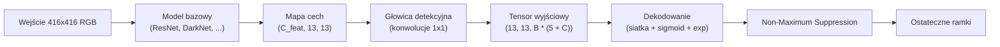

# Detekcja obiektów — YOLO od zera

> Detekcja obiektów to połączenie klasyfikacji i regresji realizowane dla każdej pozycji na mapie cech, oczyszczane następnie za pomocą algorytmu NMS (Non-Maximum Suppression).

**Typ:** Teoria + Implementacja  
**Języki:** Python, PyTorch  
**Wymagania wstępne:** Faza 4 Lekcja 03 (CNN), Faza 4 Lekcja 04 (Klasyfikacja obrazu), Faza 4 Lekcja 05 (Uczenie transferowe)  
**Czas:** ~75 minut  

## Cele kształcenia

- Zrozumienie koncepcji siatki (grid) i ramek kotwiczących (anchor boxes), które przekształcają detekcję w problem gęstej predykcji (dense prediction), oraz interpretacja wartości tensora wyjściowego.
- Obliczanie miary IoU (Intersection over Union) oraz implementacja algorytmu NMS (Non-Maximum Suppression) od zera.
- Budowa minimalistycznej głowicy detekcyjnej w stylu YOLO na bazie wstępnie wytrenowanego ekstraktora cech, z uwzględnieniem funkcji strat dla klasyfikacji, lokalizacji (bounding box regression) oraz wykrycia obiektu (objectness).
- Interpretacja metryk detekcji (precision@0.5, recall, mAP@0.5, mAP@0.5:0.95) i dobór odpowiednich kroków optymalizacyjnych w procesie uczenia.

## Problem

Klasyfikacja obrazu odpowiada na pytanie: „czy na tym obrazie jest pies?”. Detekcja obiektów precyzuje: „pies znajduje się w obszarze oznaczonym pikselami (112, 40, 280, 210), kot w obszarze (400, 180, 560, 310), a poza tym w kadrze nie ma innych obiektów”. Ta zmiana strukturalna – polegająca na przewidywaniu zmiennej liczby zlokalizowanych ramek zamiast jednej etykiety dla całego obrazu – jest kluczowa dla systemów autonomicznych, monitoringu wizyjnego czy automatyzacji kontroli jakości w fabrykach.

Detekcja to obszar, w którym od razu uwidaczniają się inżynieryjne kompromisy. Oczekujemy precyzyjnych współrzędnych ramek (zadanie głowicy regresyjnej), poprawnego przypisania klasy do każdej ramki (głowica klasyfikacyjna), zdolności modelu do zignorowania pustego tła (wynik ufności – objectness score) oraz wygenerowania dokładnie jednej predykcji dla każdego rzeczywistego obiektu (eliminacja nadmiaru przez NMS). Pominięcie któregokolwiek z tych elementów sprawi, że model będzie opuszczał obiekty, generował fałszywe detekcje (halucynacje) lub tworzył kilkanaście nakładających się ramek dla tego samego obiektu.

Projekt YOLO (You Only Look Once, Redmon i in., 2016) jako pierwszy umożliwił realizację tych zadań w czasie rzeczywistym, wykonując pojedyncze przejście sieci konwolucyjnej w przód. Te same założenia architektoniczne do dziś stanowią fundament nowoczesnych detektorów (YOLOv8, YOLOv9, YOLO-NAS, RT-DETR). Zrozumienie tych podstaw pozwala na szybką adaptację do dowolnych nowszych wariantów modeli.

## Koncepcja

### Detekcja obiektów jako zadanie gęstej predykcji

Klasyczna sieć klasyfikacyjna generuje wektor $C$ wartości dla obrazu. Detektor typu YOLO generuje tensor o wymiarach $(S \times S \times (B \cdot (5 + C)))$, gdzie $S$ to rozmiar siatki przestrzennej (grid size), a $B$ to liczba ramek kotwiczących na każdą komórkę siatki.



Każda z $S \times S$ komórek siatki przewiduje $B$ ramek otaczających. Dla każdej ramki wyznaczane są:
- 4 wartości geometryczne opisujące położenie: `tx, ty, tw, th`.
- 1 wynik ufności (objectness score): „czy w tym obszarze znajduje się obiekt?”.
- $C$ wartości reprezentujących prawdopodobieństwa przynależności do klas.

Dla zbioru danych VOC z siatką $S=13$, liczbą ramek $B=2$ i liczbą klas $C=20$, daje to 50 wartości wyjściowych dla każdej komórki siatki.

### Siatki i ramki kotwiczące (Anchor Boxes)

Zwykły model regresji musiałby przewidywać współrzędne bezwzględne $(x, y, w, h)$ dla każdego obiektu. Jest to zadanie niezwykle trudne dla sieci konwolucyjnych, ponieważ translacja (przesunięcie) obrazu nie powinna wpływać na predykcje w sposób bezwzględny – obiekty są powiązane z konkretnymi obszarami przestrzennymi. Podział obrazu na siatkę (grid) rozwiązuje ten problem: przypisuje każdą rzeczywistą ramkę otaczającą do tej komórki siatki, w której znajduje się jej środek, czyniąc tę komórkę odpowiedzialną za detekcję danego obiektu.

Drugim wyzwaniem jest zróżnicowanie kształtów obiektów. Konwolucja $3 \times 3$ na poziomie komórki o 16-pikselowym polu receptywnym nie jest w stanie bezpośrednio wyznaczyć współrzędnych obiektu o szerokości np. 500 pikseli. Zamiast tego definiujemy $B$ szablonów ramek o stałych wymiarach (tzw. ramek kotwiczących / anchors) przypisanych do komórek siatki i przewidujemy jedynie przesunięcia (delty) względem tych szablonów. Model uczy się wyboru najbardziej dopasowanego szablonu i korygowania jego wymiarów, co jest znacznie łatwiejszym zadaniem niż generowanie współrzędnych od zera.

```
Przykładowe wymiary ramek kotwiczących (dla wejścia 416x416):
  mała:    (30,  60)
  średnia:  (75,  170)
  duża:    (200, 380)

W każdej komórce siatki każda kotwica generuje wektor (tx, ty, tw, th, obj, c_1, ..., c_C).
```

Nowoczesne detektory wykorzystują sieci FPN (Feature Pyramid Networks) z różnymi zestawami ramek kotwiczących w zależności od rozdzielczości – małe kotwice dla warstw o wysokiej rozdzielczości przestrzennej, duże kotwice dla warstw głębszych o niskiej rozdzielczości.

### Dekodowanie predykcji geometrycznych

Wartości wyjściowe modelu `tx, ty, tw, th` nie są bezpośrednimi współrzędnymi ramek; to parametry regresji, które należy przekształcić zgodnie ze wzorami:

$$\text{box\_cx} = (\sigma(t_x) + \text{cell\_x}) \cdot \text{stride}$$
$$\text{box\_cy} = (\sigma(t_y) + \text{cell\_y}) \cdot \text{stride}$$
$$\text{box\_w} = \text{anchor\_w} \cdot e^{t_w}$$
$$\text{box\_h} = \text{anchor\_h} \cdot e^{t_h}$$

Zastosowanie funkcji sigmoidalnej $\sigma$ ogranicza przesunięcia środka do wnętrza danej komórki. Funkcja wykładnicza $e^t$ pozwala na skalowanie szerokości i wysokości względem ramki kotwiczącej, zapobiegając ujemnym wartościom wymiarów. Parametr `stride` reprezentuje krok próbkowania siatki i pozwala na powrót do bezwzględnych pikseli obrazu wejściowego. Ten mechanizm dekodowania jest standardem w rodzinie YOLO od wersji v2.

### Indeks Jaccarda (Intersection over Union - IoU)

Uniwersalna metryka określająca stopień nakładania się dwóch ramek otaczających:

$$\text{IoU}(A, B) = \frac{\text{pole powierzchni } (A \cap B)}{\text{pole powierzchni } (A \cup B)}$$

Wartość $\text{IoU} = 1$ oznacza identyczne położenie ramek, natomiast $\text{IoU} = 0$ oznacza całkowity brak wspólnego obszaru. Współczynnik IoU między predykcją a rzeczywistą ramką określa, czy detekcję uznajemy za poprawną (True Positive – zazwyczaj przy $\text{IoU} \ge 0.5$). Wartość IoU pomiędzy poszczególnymi predykcjami jest również kluczowym elementem algorytmu NMS.

### Algorytm Non-Maximum Suppression (NMS)

Sieci trenowane na sąsiednich komórkach siatki generują wiele nakładających się ramek otaczających dla jednego obiektu. Algorytm NMS porządkuje predykcje, wybiera tę o najwyższym wyniku ufności (score), a następnie usuwa wszystkie inne ramki nakładające się na nią powyżej zdefiniowanego progu IoU.

```
NMS(ramki, wyniki, prog_iou):
    posortuj ramki malejąco według wyników ufności
    zachowane = []
    dopóki lista ramek nie jest pusta:
        wybierz ramkę o najwyższym wyniku, dodaj do zachowanych
        usuń z listy wszystkie pozostałe ramki, których IoU z wybraną ramką przekracza prog_iou
    zwróć zachowane
```

Standardowy próg odrzucania (IoU threshold) w detekcji obiektów to zazwyczaj 0.45. Nowsze architektury zastępują klasyczny NMS wariantami typu Soft-NMS, DIoU-NMS lub bezpośrednio uczą się eliminacji duplikatów (RT-DETR).

### Funkcja straty

Funkcja straty w modelach YOLO składa się z trzech ważonych komponentów:

$$L = \lambda_{\text{coord}} \cdot L_{\text{box}} + \lambda_{\text{obj}} \cdot L_{\text{obj\_pos}} + \lambda_{\text{noobj}} \cdot L_{\text{obj\_neg}} + \lambda_{\text{cls}} \cdot L_{\text{cls}}$$

- **Regresja ramki ($L_{\text{box}}$)** oraz **klasyfikacja ($L_{\text{cls}}$)** są obliczane wyłącznie dla tych komórek siatki, które faktycznie zawierają obiekt.
- **Strata obecności obiektu ($L_{\text{obj}}$)** jest wyznaczana dla wszystkich komórek siatki (dla pustych komórek uczy model braku predykcji).
- Waga $\lambda_{\text{noobj}}$ jest celowo ustawiana na niską wartość (np. 0.5), ponieważ większość komórek siatki reprezentuje puste tło i bez tego skalowania zdominowałaby ona proces optymalizacji.

Nowoczesne wersje zastępują stratę lokalizacji MSE metrykami typu CIoU / DIoU (optymalizującymi bezpośrednio pole powierzchni IoU) oraz stosują funkcję Focal Loss w celu rozwiązania problemu niezbalansowania klas.

### Metryki oceny detektora

Tradycyjna dokładność (accuracy) nie ma zastosowania w detekcji obiektów. Kluczowe metryki to:
- **Precision@IoU=0.5**: precyzja – jaki odsetek wygenerowanych ramek o $\text{IoU} \ge 0.5$ jest poprawny.
- **Recall@IoU=0.5**: czułość – jaki odsetek rzeczywistych obiektów został wykryty przez model.
- **AP@0.5**: średnia precyzja (Average Precision) dla danej klasy przy progu $\text{IoU} = 0.5$.
- **mAP@0.5:0.95**: uśredniona wartość mAP dla progów IoU od 0.5 do 0.95 z krokiem 0.05. To standardowa metryka benchmarku COCO – najbardziej rygorystyczna i miarodajna.

Detektor, który ma wysokie AP@0.5, lecz niskie mAP@0.5:0.95, potrafi zlokalizować obiekty, ale nie robi tego precyzyjnie (warto zastosować lepszą funkcję straty dla regresji ramki). Detektor o wysokiej precyzji, ale niskiej czułości (recall) jest zbyt ostrożny (warto obniżyć próg ufności lub zwiększyć wagę straty obecności obiektu).

## Implementacja krok po kroku

### Krok 1: Wyznaczanie współczynnika IoU

Podstawowe narzędzie do obliczania IoU dla zestawów ramek w formacie `(x1, y1, x2, y2)`.

```python
import numpy as np

def box_iou(boxes_a, boxes_b):
    ax1, ay1, ax2, ay2 = boxes_a[:, 0], boxes_a[:, 1], boxes_a[:, 2], boxes_a[:, 3]
    bx1, by1, bx2, by2 = boxes_b[:, 0], boxes_b[:, 1], boxes_b[:, 2], boxes_b[:, 3]

    inter_x1 = np.maximum(ax1[:, None], bx1[None, :])
    inter_y1 = np.maximum(ay1[:, None], by1[None, :])
    inter_x2 = np.minimum(ax2[:, None], bx2[None, :])
    inter_y2 = np.minimum(ay2[:, None], by2[None, :])

    inter_w = np.clip(inter_x2 - inter_x1, 0, None)
    inter_h = np.clip(inter_y2 - inter_y1, 0, None)
    inter = inter_w * inter_h

    area_a = (ax2 - ax1) * (ay2 - ay1)
    area_b = (bx2 - bx1) * (by2 - by1)
    union = area_a[:, None] + area_b[None, :] - inter
    return inter / np.clip(union, 1e-8, None)
```

Zwraca macierz par IoU o wymiarach `(N_a, N_b)`.

### Krok 2: Algorytm Non-Maximum Suppression (NMS)

```python
def nms(boxes, scores, iou_threshold=0.45):
    order = np.argsort(-scores)
    keep = []
    while len(order) > 0:
        i = order[0]
        keep.append(i)
        if len(order) == 1:
            break
        rest = order[1:]
        ious = box_iou(boxes[[i]], boxes[rest])[0]
        order = rest[ious <= iou_threshold]
    return np.array(keep, dtype=np.int64)
```

### Krok 3: Kodowanie i dekodowanie ramek

Przekształcanie bezwzględnych współrzędnych pikseli na przesunięcia (delty) względem ramek kotwiczących i odwrotnie.

```python
def encode(box_xyxy, cell_x, cell_y, stride, anchor_wh):
    x1, y1, x2, y2 = box_xyxy
    cx = 0.5 * (x1 + x2)
    cy = 0.5 * (y1 + y2)
    w = x2 - x1
    h = y2 - y1
    tx = cx / stride - cell_x
    ty = cy / stride - cell_y
    tw = np.log(w / anchor_wh[0] + 1e-8)
    th = np.log(h / anchor_wh[1] + 1e-8)
    return np.array([tx, ty, tw, th])

def decode(tx_ty_tw_th, cell_x, cell_y, stride, anchor_wh):
    tx, ty, tw, th = tx_ty_tw_th
    cx = (sigmoid(tx) + cell_x) * stride
    cy = (sigmoid(ty) + cell_y) * stride
    w = anchor_wh[0] * np.exp(tw)
    h = anchor_wh[1] * np.exp(th)
    return np.array([cx - w / 2, cy - h / 2, cx + w / 2, cy + h / 2])

def sigmoid(x):
    return 1.0 / (1.0 + np.exp(-x))
```

### Krok 4: Głowica detekcyjna YOLO (YOLOHead)

Konwolucja $1 \times 1$ mapująca mapę cech na tensor o wymiarach `(N, H, W, num_anchors, 5 + C)`.

```python
import torch
import torch.nn as nn

class YOLOHead(nn.Module):
    def __init__(self, in_c, num_anchors, num_classes):
        super().__init__()
        self.num_anchors = num_anchors
        self.num_classes = num_classes
        self.conv = nn.Conv2d(in_c, num_anchors * (5 + num_classes), kernel_size=1)

    def forward(self, x):
        n, _, h, w = x.shape
        y = self.conv(x)
        y = y.view(n, self.num_anchors, 5 + self.num_classes, h, w)
        y = y.permute(0, 3, 4, 1, 2).contiguous()
        return y
```

### Krok 5: Przypisywanie celów uczenia (Target Assignment)

Określenie, która komórka siatki i która ramka kotwicząca odpowiadają za wykrycie danego obiektu.

```python
def assign_targets(boxes_xyxy, classes, anchors, stride, grid_size, num_classes):
    num_anchors = len(anchors)
    target = np.zeros((grid_size, grid_size, num_anchors, 5 + num_classes), dtype=np.float32)
    has_obj = np.zeros((grid_size, grid_size, num_anchors), dtype=bool)

    for box, cls in zip(boxes_xyxy, classes):
        x1, y1, x2, y2 = box
        cx, cy = 0.5 * (x1 + x2), 0.5 * (y1 + y2)
        gx, gy = int(cx / stride), int(cy / stride)
        bw, bh = x2 - x1, y2 - y1

        # Dobór najlepszej kotwicy na podstawie wymiarów IoU
        ious = np.array([
            (min(bw, aw) * min(bh, ah)) / (bw * bh + aw * ah - min(bw, aw) * min(bh, ah))
            for aw, ah in anchors
        ])
        best = int(np.argmax(ious))
        aw, ah = anchors[best]

        target[gy, gx, best, 0] = cx / stride - gx
        target[gy, gx, best, 1] = cy / stride - gy
        target[gy, gx, best, 2] = np.log(bw / aw + 1e-8)
        target[gy, gx, best, 3] = np.log(bh / ah + 1e-8)
        target[gy, gx, best, 4] = 1.0
        target[gy, gx, best, 5 + cls] = 1.0
        has_obj[gy, gx, best] = True
        
    return target, has_obj
```

### Krok 6: Wyznaczanie funkcji straty

```python
def yolo_loss(pred, target, has_obj, lambda_coord=5.0, lambda_obj=1.0, lambda_noobj=0.5, lambda_cls=1.0):
    has_obj_t = torch.from_numpy(has_obj).bool()
    target_t = torch.from_numpy(target).float()

    # Strata lokalizacji (bounding box regression)
    box_pred = pred[..., :4][has_obj_t]
    box_true = target_t[..., :4][has_obj_t]
    loss_box = torch.nn.functional.mse_loss(box_pred, box_true, reduction="sum")

    # Strata obecności obiektu (objectness loss)
    obj_pred = pred[..., 4]
    obj_true = target_t[..., 4]
    loss_obj_pos = torch.nn.functional.binary_cross_entropy_with_logits(
        obj_pred[has_obj_t], obj_true[has_obj_t], reduction="sum")
    loss_obj_neg = torch.nn.functional.binary_cross_entropy_with_logits(
        obj_pred[~has_obj_t], obj_true[~has_obj_t], reduction="sum")

    # Strata klasyfikacji
    cls_pred = pred[..., 5:][has_obj_t]
    cls_true = target_t[..., 5:][has_obj_t]
    loss_cls = torch.nn.functional.binary_cross_entropy_with_logits(
        cls_pred, cls_true, reduction="sum")

    total = (lambda_coord * loss_box
             + lambda_obj * loss_obj_pos
             + lambda_noobj * loss_obj_neg
             + lambda_cls * loss_cls)
             
    return total, {"box": loss_box.item(), "obj_pos": loss_obj_pos.item(),
                   "obj_neg": loss_obj_neg.item(), "cls": loss_cls.item()}
```

### Krok 7: Potok przetwarzania wyników (Postprocessing)

Przekształcenie surowych predykcji modelu, filtrowanie progowe i deduplikacja za pomocą NMS.

```python
def postprocess(pred_tensor, anchors, stride, conf_threshold=0.25, iou_threshold=0.45):
    pred = pred_tensor.detach().cpu().numpy()
    grid_h, grid_w = pred.shape[1], pred.shape[2]
    num_anchors = len(anchors)

    boxes, scores, classes = [], [], []
    for gy in range(grid_h):
        for gx in range(grid_w):
            for a in range(num_anchors):
                tx, ty, tw, th, obj, *cls = pred[0, gy, gx, a]
                score = sigmoid(obj) * sigmoid(np.array(cls)).max()
                if score < conf_threshold:
                    continue
                cls_idx = int(np.argmax(cls))
                cx = (sigmoid(tx) + gx) * stride
                cy = (sigmoid(ty) + gy) * stride
                w = anchors[a][0] * np.exp(tw)
                h = anchors[a][1] * np.exp(th)
                boxes.append([cx - w / 2, cy - h / 2, cx + w / 2, cy + h / 2])
                scores.append(float(score))
                classes.append(cls_idx)

    if not boxes:
        return np.zeros((0, 4)), np.zeros((0,)), np.zeros((0,), dtype=int)
    boxes = np.array(boxes)
    scores = np.array(scores)
    classes = np.array(classes)
    keep = nms(boxes, scores, iou_threshold)
    return boxes[keep], scores[keep], classes[keep]
```

## Wykorzystanie w bibliotece torchvision

Moduł `torchvision.models.detection` udostępnia gotowe, zoptymalizowane detektory. Ich wywołanie sprowadza się do kilku linii kodu:

```python
import torch
from torchvision.models.detection import fasterrcnn_resnet50_fpn_v2

model = fasterrcnn_resnet50_fpn_v2(weights="DEFAULT")
model.eval()
with torch.no_grad():
    # Model oczekuje listy obrazów w formacie CHW
    predictions = model([torch.randn(3, 400, 600)])
    
print(predictions[0].keys())
print(f"Ramki otaczające: {predictions[0]['boxes'].shape}")
print(f"Współczynniki ufności: {predictions[0]['scores'].shape}")
print(f"Klasy: {predictions[0]['labels'].shape}")
```

W zastosowaniach komercyjnych standardem jest biblioteka `ultralytics` (YOLOv8/v9):
```python
from ultralytics import YOLO
model = YOLO('yolov8n.pt')
results = model('obraz.jpg')
```

## Wyjście projektu

Ta lekcja dostarcza:
- `outputs/prompt-detection-metric-reader.md` – szablon monitu przekształcający metryki detekcji w konkretne wnioski i sugerujący kierunki optymalizacji.
- `outputs/skill-anchor-designer.md` – skrypt realizujący algorytm K-Means na współrzędnych ramek otaczających w celu automatycznego wyznaczenia optymalnych wymiarów ramek kotwiczących (anchors).

## Zadania do samodzielnego wykonania

1. **Weryfikacja poprawności IoU**: Zaimplementuj funkcję `box_iou` i porównaj jej wyniki z wyjściem funkcji `torchvision.ops.box_iou` dla 1000 losowo wygenerowanych ramek. Upewnij się, że maksymalna różnica wynosi mniej niż `1e-6`.
2. **Implementacja straty CIoU**: Zmodyfikuj funkcję `yolo_loss` tak, aby do lokalizacji wykorzystywała stratę CIoU (Complete IoU) zamiast błędu średniokwadratowego (MSE). Porównaj zbieżność i końcowe mAP@0.5:0.95 na małym zbiorze syntetycznym.
3. **Wnioskowanie wieloskalowe (Multi-Scale Inference)**: Zaimplementuj funkcję przetwarzającą obraz wejściowy w trzech różnych rozdzielczościach, połącz uzyskane ramki i przeprowadź ostateczną deduplikację za pomocą pojedynczego kroku NMS. Zmierz wpływ tej operacji na wartość mAP.

## Słownik kluczowych pojęć

| Termin | Potoczne określenie | Co to dokładnie oznacza |
| :--- | :--- | :--- |
| **Ramka kotwicząca (Anchor Box)** | „Szablon ramki” | Zdefiniowany przedział geometryczny przypisany do komórki siatki, ułatwiający regresję zróżnicowanych kształtów |
| **IoU (Intersection over Union)** | „Stopień nakładania się” | Stosunek pola powierzchni wspólnej dwóch ramek do pola powierzchni ich sumy |
| **NMS (Non-Maximum Suppression)** | „Usuwanie duplikatów” | Algorytm eliminujący powtarzające się predykcje wokół jednego obiektu na podstawie wyniku ufności i progu IoU |
| **Objectness (Ufność obecności)** | „Czy tu coś jest” | Wartość określająca prawdopodobieństwo, że środek dowolnego obiektu znajduje się w danej komórce siatki |
| **Krok siatki (Grid Stride)** | „Współczynnik próbkowania” | Stosunek rozdzielczości obrazu wejściowego do rozdzielczości mapy cech (np. dla wejścia $416$ i siatki $13 \times 13$ krok wynosi $32$) |
| **mAP (Mean Average Precision)** | „Średnia precyzja” | Główna metryka oceny detektorów, będąca średnią wartością AP obliczoną dla wszystkich klas i różnych progów IoU |
