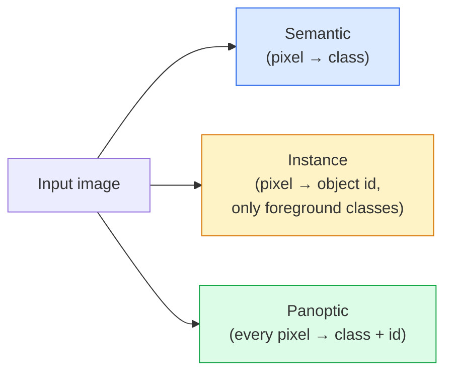
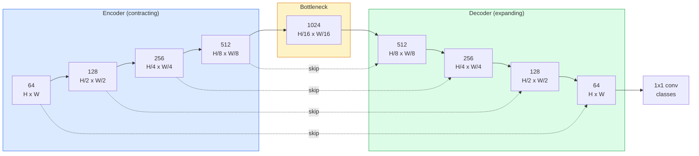

# Segmentacja semantyczna — U-Net

> Segmentacja to klasyfikacja w każdym pikselu. U-Net sprawia, że ​​działa to poprzez połączenie kodera zmniejszającego próbkowanie z dekoderem zwiększającym próbkowanie i pomijanie połączeń między nimi.

**Typ:** Kompilacja
**Języki:** Python
**Wymagania wstępne:** Faza 4, lekcja 03 (CNN), Faza 4, lekcja 04 (klasyfikacja obrazów)
**Czas:** ~75 minut

## Cele nauczania

- Rozróżnij segmentację semantyczną, instancyjną i panoptyczną i wybierz odpowiednie zadanie dla danego problemu
- Zbuduj od podstaw sieć U-Net w PyTorch z blokami kodera, wąskim gardłem, dekoderem z transponowanymi splotami i pomiń połączenia
- Zaimplementuj pikselową entropię krzyżową, utratę kości i łączną stratę, która jest obecnie domyślną segmentacją medyczną i przemysłową
- Przeczytaj metryki IoU i Dice dla każdej klasy i zdiagnozuj, czy zły wynik wynika z przypominania sobie małych obiektów, dokładności granic lub braku równowagi klas

## Problem

Klasyfikacja generuje jedną etykietę na obraz. Funkcja wykrywania generuje kilka pól na obraz. Segmentacja generuje jedną etykietę na piksel. Dla danych wejściowych o rozmiarze `H x W` wynikiem jest tensor kształtu `H x W` (semantyczny) lub `H x W x N_instances` (instancja). To miliony podpowiedzi na obraz, a nie jedna.

Dzięki strukturze segmentacji obsługuje on prawie każdy produkt wizyjny o gęstej predykcji: obrazowanie medyczne (maski nowotworowe), jazdę autonomiczną (droga, pas ruchu, przeszkoda), satelitę (ślady budynków, granice upraw), analizę dokumentów (strefy układu), robotykę (obszary możliwe do uchwycenia). Żadnego z tych zadań nie da się rozwiązać, umieszczając ramkę wokół obiektu; potrzebują dokładnej sylwetki.

Problem architektoniczny jest prosty do sformułowania i niełatwy do rozwiązania: potrzebujesz sieci, aby jednocześnie zobaczyć globalny kontekst obrazu (co to za scena) i szczegóły lokalnych pikseli (dokładnie, który piksel to droga, a który chodnik). Standardowa CNN kompresuje przestrzennie, aby uzyskać kontekst, co powoduje utratę szczegółów. U-Net był projektem, który połączył jedno i drugie.

## Koncepcja

### Semantyka vs instancja vs panoptyka



- **Semantyczny** mówi „ten piksel to droga, ten piksel to samochód”. Dwa samochody obok siebie zapadają się w jedną kulę.
- **Instancja** mówi: „ten piksel to samochód nr 3, ten piksel to samochód nr 5”. Ignoruje elementy tła („rzeczy” = niebo, droga, trawa).
- **Panoptic** jednoczy jedno i drugie: każdy piksel otrzymuje etykietę klasy, każda instancja otrzymuje unikalny identyfikator, a elementy i elementy są podzielone na segmenty.

Ta lekcja dotyczy semantyki. Następna lekcja (Maska R-CNN) dotyczy przykładu.

### Kształt U-Net



Koder czterokrotnie zmniejsza o połowę rozdzielczość przestrzenną i podwaja kanały. Dekoder odwraca: czterokrotnie podwaja rozdzielczość przestrzenną i dzieli kanały na pół. Połączenia pomijane łączą pasujące funkcje kodera z funkcjami dekodera w każdej rozdzielczości. Ostateczne mapy konw. 1x1 `64 -> num_classes` w pełnej rozdzielczości.

Dlaczego pomijanie połączeń jest konieczne: dekoder widział tylko małe mapy obiektów, zanim próbował wygenerować przewidywania na poziomie pikseli. Bez przeskoków nie jest w stanie dokładnie zlokalizować krawędzi, ponieważ informacja ta została skompresowana w koderze. Pomiń połączenia, ponieważ funkcja wysokiej rozdzielczości odwzorowuje koder obliczany w drodze w dół.

### Transpozycja vs próbkowanie dwuliniowe

Dekoder musi rozszerzać wymiary przestrzenne. Dwie opcje:

- **Transponowany splot** (`nn.ConvTranspose2d`) — upsample, którego można się nauczyć. Historyczne ustawienie domyślne U-Net. Może powodować artefakty szachownicy, jeśli krok i rozmiar jądra nie dzielą się równomiernie.
- **Bilinearny próbkowanie + konw. 3x3** — gładki próbkowanie, po którym następuje konw. Mniej artefaktów, mniej parametrów – teraz współczesne ustawienia domyślne.

Obydwa pojawiają się na wolności. W przypadku pierwszej sieci U-Net rozwiązanie dwuliniowe jest bezpieczniejsze.

### Entropia krzyżowa na siatce pikseli

W przypadku segmentacji semantycznej z klasami C wyjście modelu to `(N, C, H, W)`. Celem jest `(N, H, W)` z identyfikatorami klas w postaci liczb całkowitych. Entropia krzyżowa jest identyczna z przypadkiem klasyfikacji, zastosowana właśnie w każdej pozycji przestrzennej:

```
Loss = mean over (n, h, w) of -log( softmax(logits[n, :, h, w])[target[n, h, w]] )
```

`F.cross_entropy` w PyTorch obsługuje ten kształt natywnie. Nie ma potrzeby zmiany kształtu.

### Utrata kości i dlaczego jej potrzebujesz

Entropia krzyżowa traktuje każdy piksel jednakowo. Jest to błędne podejście, gdy w kadrze dominuje jedna klasa (obrazowanie medyczne: 99% tła, 1% guza). Sieć może osiągnąć 99% dokładności, przewidując tło wszędzie i nadal być bezużyteczna.

Utrata kości rozwiązuje ten problem poprzez bezpośrednią optymalizację nakładania się maski przewidywanej i prawdziwej:

```
Dice(p, y) = 2 * sum(p * y) / (sum(p) + sum(y) + epsilon)
Dice_loss = 1 - Dice
```

gdzie `p` to sigmoidalna/softmax mapa prawdopodobieństwa dla klasy, a `y` to binarna maska prawdy. Strata wynosi zero tylko wtedy, gdy zachodzenie na siebie jest idealne. Ponieważ opiera się na stosunkach, nierównowaga klas jest nieistotna.

W praktyce zastosuj **stratę łączną**:

```
L = L_cross_entropy + lambda * L_dice       (lambda ~ 1)
```

Entropia krzyżowa zapewnia stabilne gradienty na początku treningu; Dice skupia się na ostatecznym dopasowaniu kształtu maski. Ta kombinacja jest domyślną kombinacją obrazowania medycznego i jest trudna do pokonania w przypadku dowolnego zbioru danych niezrównoważonego klasowo.

### Metryki oceny

- **Dokładność pikseli** — procent poprawnie przewidywanych pikseli. Tani. Uszkodzony w przypadku niezrównoważonych danych z tego samego powodu, co dokładność klasyfikacji.
- **IoU na klasę** — przecięcie przez sumę dla maski każdej klasy; średnia dla klas = mIoU.
- **Kostki (F1 na pikselach)** — podobne do IoU; `Dice = 2 * IoU / (1 + IoU)`. Obrazowanie medyczne preferuje kości, społeczność kierowców preferuje IoU; są ze sobą monotonicznie powiązane.
- **Granica F1** — mierzy, jak blisko przewidywanych granic znajdują się granice rzeczywiste, co karze nawet małe przesunięcia. Ważne w przypadku zadań wymagających dużej precyzji, takich jak kontrola półprzewodników.

Raportuj IoU na każdą klasę, a nie tylko mIoU. Średni IoU ukrywa klasę na poziomie 15%, podczas gdy dziewięć innych ma wartość 85%.

### Kompromis w zakresie rozdzielczości wejściowej

Koder U-Net czterokrotnie zmniejsza rozdzielczość o połowę, więc dane wejściowe muszą być podzielne przez 16. Obrazy medyczne mają często wymiary 512x512 lub 1024x1024. Uprawy autonomicznie poruszające się mają wymiary 2048 x 1024. Koszt pamięci U-Net skaluje się z `H * W * C_max`, a przy rozdzielczości 1024x1024 z 1024 kanałami wąskiego gardła przepustowość w przód wykorzystuje już gigabajty pamięci VRAM.

Dwa standardowe obejścia:
1. Rozłóż wejście — przetwórz płytki 256x256 z zakładką i zszyciem.
2. Zastąp wąskie gardło rozszerzonymi splotami, które utrzymają wyższą rozdzielczość przestrzenną, ale poszerzą pole recepcyjne (rodzina DeepLab).

W przypadku pierwszego modelu wejście 256 x 256 z 64-kanałową siecią U-Net pozwala wygodnie trenować na 8 GB pamięci VRAM.

## Zbuduj to

### Krok 1: Blok enkodera

Dwie konwersje 3x3 z normą wsadową i ReLU. Pierwsza konwersja zmienia liczbę kanałów; drugi go utrzymuje.

```python
import torch
import torch.nn as nn
import torch.nn.functional as F

class DoubleConv(nn.Module):
    def __init__(self, in_c, out_c):
        super().__init__()
        self.net = nn.Sequential(
            nn.Conv2d(in_c, out_c, kernel_size=3, padding=1, bias=False),
            nn.BatchNorm2d(out_c),
            nn.ReLU(inplace=True),
            nn.Conv2d(out_c, out_c, kernel_size=3, padding=1, bias=False),
            nn.BatchNorm2d(out_c),
            nn.ReLU(inplace=True),
        )

    def forward(self, x):
        return self.net(x)
```

Ten blok jest ponownie używany w całym tekście. `bias=False`, ponieważ wersja beta BN radzi sobie z odchyleniami.

### Krok 2: Bloki w dół i w górę

```python
class Down(nn.Module):
    def __init__(self, in_c, out_c):
        super().__init__()
        self.net = nn.Sequential(
            nn.MaxPool2d(2),
            DoubleConv(in_c, out_c),
        )

    def forward(self, x):
        return self.net(x)

class Up(nn.Module):
    def __init__(self, in_c, out_c):
        super().__init__()
        self.up = nn.Upsample(scale_factor=2, mode="bilinear", align_corners=False)
        self.conv = DoubleConv(in_c, out_c)

    def forward(self, x, skip):
        x = self.up(x)
        if x.shape[-2:] != skip.shape[-2:]:
            x = F.interpolate(x, size=skip.shape[-2:], mode="bilinear", align_corners=False)
        x = torch.cat([skip, x], dim=1)
        return self.conv(x)
```

Kontrola kształtu dotycząca wyłącznie przestrzeni (`shape[-2:]`) obsługuje dane wejściowe, których wymiary nie są podzielne przez 16; bezpieczny `F.interpolate` wyrównuje tensor przed konkatem. Porównanie pełnego kształtu spowodowałoby również różnice w liczbie kanałów, co powinno być głośnym błędem, a nie cichą interpolacją.

### Krok 3: Sieć U

```python
class UNet(nn.Module):
    def __init__(self, in_channels=3, num_classes=2, base=64):
        super().__init__()
        self.inc = DoubleConv(in_channels, base)
        self.d1 = Down(base, base * 2)
        self.d2 = Down(base * 2, base * 4)
        self.d3 = Down(base * 4, base * 8)
        self.d4 = Down(base * 8, base * 16)
        self.u1 = Up(base * 16 + base * 8, base * 8)
        self.u2 = Up(base * 8 + base * 4, base * 4)
        self.u3 = Up(base * 4 + base * 2, base * 2)
        self.u4 = Up(base * 2 + base, base)
        self.outc = nn.Conv2d(base, num_classes, kernel_size=1)

    def forward(self, x):
        x1 = self.inc(x)
        x2 = self.d1(x1)
        x3 = self.d2(x2)
        x4 = self.d3(x3)
        x5 = self.d4(x4)
        x = self.u1(x5, x4)
        x = self.u2(x, x3)
        x = self.u3(x, x2)
        x = self.u4(x, x1)
        return self.outc(x)

net = UNet(in_channels=3, num_classes=2, base=32)
x = torch.randn(1, 3, 256, 256)
print(f"output: {net(x).shape}")
print(f"params: {sum(p.numel() for p in net.parameters()):,}")
```

Kształt wyjściowy `(1, 2, 256, 256)` — ten sam rozmiar przestrzenny co wejście, kanały `num_classes`. Około 7,7 mln parametrów w `base=32`.

### Krok 4: Straty

```python
def dice_loss(logits, targets, num_classes, eps=1e-6):
    probs = F.softmax(logits, dim=1)
    targets_one_hot = F.one_hot(targets, num_classes).permute(0, 3, 1, 2).float()
    dims = (0, 2, 3)
    intersection = (probs * targets_one_hot).sum(dim=dims)
    denom = probs.sum(dim=dims) + targets_one_hot.sum(dim=dims)
    dice = (2 * intersection + eps) / (denom + eps)
    return 1 - dice.mean()

def combined_loss(logits, targets, num_classes, lam=1.0):
    ce = F.cross_entropy(logits, targets)
    dc = dice_loss(logits, targets, num_classes)
    return ce + lam * dc, {"ce": ce.item(), "dice": dc.item()}
```

Kości są obliczane dla każdej klasy, a następnie uśredniane (makro kości). `eps` zapobiega dzieleniu przez zero klas nieobecnych w partii.

### Krok 5: Wskaźnik IoU

```python
@torch.no_grad()
def iou_per_class(logits, targets, num_classes):
    preds = logits.argmax(dim=1)
    ious = torch.zeros(num_classes)
    for c in range(num_classes):
        pred_c = (preds == c)
        true_c = (targets == c)
        inter = (pred_c & true_c).sum().float()
        union = (pred_c | true_c).sum().float()
        ious[c] = (inter / union) if union > 0 else torch.tensor(float("nan"))
    return ious
```

Zwraca wektor o długości C. `nan` oznacza klasy nieobecne w partii — przy obliczaniu mIoU nie należy ich uśredniać.

### Krok 6: Syntetyczny zbiór danych do kompleksowej weryfikacji

Generuj kształty na kolorowym tle, aby sieć musiała uczyć się kształtu, a nie koloru pikseli.

```python
import numpy as np
from torch.utils.data import Dataset, DataLoader

def synthetic_segmentation(num_samples=200, size=64, seed=0):
    rng = np.random.default_rng(seed)
    images = np.zeros((num_samples, size, size, 3), dtype=np.float32)
    masks = np.zeros((num_samples, size, size), dtype=np.int64)
    for i in range(num_samples):
        bg = rng.uniform(0, 1, (3,))
        images[i] = bg
        masks[i] = 0
        num_shapes = rng.integers(1, 4)
        for _ in range(num_shapes):
            cls = int(rng.integers(1, 3))
            color = rng.uniform(0, 1, (3,))
            cx, cy = rng.integers(10, size - 10, size=2)
            r = int(rng.integers(4, 12))
            yy, xx = np.meshgrid(np.arange(size), np.arange(size), indexing="ij")
            if cls == 1:
                mask = (xx - cx) ** 2 + (yy - cy) ** 2 < r ** 2
            else:
                mask = (np.abs(xx - cx) < r) & (np.abs(yy - cy) < r)
            images[i][mask] = color
            masks[i][mask] = cls
        images[i] += rng.normal(0, 0.02, images[i].shape)
        images[i] = np.clip(images[i], 0, 1)
    return images, masks

class SegDataset(Dataset):
    def __init__(self, images, masks):
        self.images = images
        self.masks = masks

    def __len__(self):
        return len(self.images)

    def __getitem__(self, i):
        img = torch.from_numpy(self.images[i]).permute(2, 0, 1).float()
        mask = torch.from_numpy(self.masks[i]).long()
        return img, mask
```

Trzy klasy: tło (0), koła (1), kwadraty (2). Sieć musi nauczyć się rozróżniać kształty.

### Krok 7: Pętla treningowa

```python
def train_one_epoch(model, loader, optimizer, device, num_classes):
    model.train()
    loss_sum, total = 0.0, 0
    iou_sum = torch.zeros(num_classes)
    for x, y in loader:
        x, y = x.to(device), y.to(device)
        logits = model(x)
        loss, _ = combined_loss(logits, y, num_classes)
        optimizer.zero_grad()
        loss.backward()
        optimizer.step()
        loss_sum += loss.item() * x.size(0)
        total += x.size(0)
        iou_sum += iou_per_class(logits, y, num_classes).nan_to_num(0)
    return loss_sum / total, iou_sum / len(loader)
```

Uruchom to dla 10-30 epok na syntetycznym zbiorze danych i obserwuj, jak mIoU przekracza 0,9 dla klas kształtu. Zauważ, że `nan_to_num(0)` traktuje klasy nieobecne w partii jako zero; aby uzyskać dokładne IoU dla poszczególnych klas, maskuj według obecności i używaj `torch.nanmean` w partiach w czasie oceny, zamiast tutaj uśredniać.

## Użyj tego

Na potrzeby produkcyjne `segmentation_models_pytorch` („smp”) obejmuje każdą standardową architekturę segmentacji dowolnym szkieletem Torchvision lub Timm. Trzy linie:

```python
import segmentation_models_pytorch as smp

model = smp.Unet(
    encoder_name="resnet34",
    encoder_weights="imagenet",
    in_channels=3,
    classes=3,
)
```

Warto znać także w przypadku prawdziwej pracy:
- **DeepLabV3+** zastępuje próbkowanie w oparciu o maksymalną pulę konwersjami rozszerzonymi, dzięki czemu wąskie gardło utrzymuje rozdzielczość; szybsze granice danych satelitarnych i jazdy.
- **SegFormer** zamienia koder konwersji na transformator hierarchiczny; obecna SOTA w wielu benchmarkach.
- **Mask2Former** / **OneFormer** ujednolica segmentację semantyczną, instancyjną i panoptyczną w jednej architekturze.

Wszystkie trzy są zamiennikami typu drop-in w `smp` lub `transformers` z tym samym modułem ładującym dane.

## Wyślij to

Ta lekcja daje:

- `outputs/prompt-segmentation-task-picker.md` — zachęta, która wybiera pomiędzy segmentacją semantyczną, instancyjną i panoptyczną oraz nazywa architekturę dla danego zadania.
- `outputs/skill-segmentation-mask-inspector.md` — umiejętność raportująca rozkład klas, statystyki przewidywanej maski oraz klasy, które są niedoszacowane lub zamazane granice.

## Ćwiczenia

1. **(Łatwy)** Zaimplementuj `bce_dice_loss` dla zadania segmentacji binarnej (pierwszy plan vs tło). Sprawdź na syntetycznym zbiorze danych dwóch klas, że łączna strata zbiega się szybciej niż sama BCE, gdy pierwszy plan obejmuje 5% pikseli.
2. **(Średni)** Zamień blok w górę `nn.Upsample + conv` na blok w górę `nn.ConvTranspose2d`. Trenuj oba na syntetycznym zestawie danych i porównaj mIoU. Zwróć uwagę, gdzie w wersji transponowanej konwersji pojawiają się artefakty szachownicy.
3. **(Trudne)** Weź prawdziwy zbiór danych segmentacyjnych (Oxford-IIIT Pets, mini split Cityscapes lub podzbiór medyczny) i wytrenuj sieć U-Net w zakresie 2 punktów IoU od odniesienia `smp.Unet`. Zgłaszaj IoU dla poszczególnych klas i określ, które klasy czerpią najwięcej korzyści z dodania kości do straty.

## Kluczowe terminy

| Termin | Co ludzie mówią | Co to właściwie oznacza |
|------|----------------|----------------------|
| Segmentacja semantyczna | „Oznacz każdy piksel” | Klasyfikacja per piksel na klasy C; instancje tej samej klasy scalają |
| Segmentacja instancji | „Oznacz każdy obiekt” | Oddziela różne instancje tej samej klasy; tylko na pierwszym planie |
| Segmentacja panoptyczna | „Semantyka + instancja” | Każdy piksel otrzymuje klasę; każda instancja rzeczy otrzymuje również unikalny identyfikator |
| Pomiń połączenie | „Most U-Net” | Połączenie funkcji kodera w funkcje dekodera o dopasowanej rozdzielczości; zachowuje szczegóły wysokich częstotliwości |
| Przeniesione konw. | „Dekonwolucja” | Możliwość nauczenia się upsamplingu; może wytwarzać artefakty szachownicy |
| Utrata kości | „Utrata nakładania się” | 1 - 2|A ∩ B| / (|A| + |B|); optymalizuje bezpośrednie nakładanie się masek i jest odporny na brak równowagi klas |
| mioU | „Średnie przecięcie przez sumę” | Średni IoU w klasach; standardowa metryka społeczności dotycząca segmentacji |
| Granica F1 | „Dokładność granic” | Wynik F1 obliczony tylko dla pikseli brzegowych; ma znaczenie w przypadku zadań o znaczeniu krytycznym |

## Dalsze czytanie

- [U-Net: Convolutional Networks for Biomedical Image Segmentation (Ronneberger et al., 2015)](https://arxiv.org/abs/1505.04597) — praca oryginalna; rysunek, który wszyscy kopiują, znajduje się na stronie 2
– [Fully Convolutional Networks (Long et al., 2015)](https://arxiv.org/abs/1411.4038) – artykuł, w którym po raz pierwszy segmentacja stała się kompleksowym problemem konwersji
- [segmentation_models_pytorch](https://github.com/qubvel/segmentation_models.pytorch) — odniesienie do segmentacji produkcji; każda standardowa architektura plus każda standardowa strata
- [Wnioski wyciągnięte ze szkolenia segmentacji SOTA (konkursy kaggle.com)](https://www.kaggle.com/code/iafoss/carvana-unet-pytorch) — przewodnik pokazujący, dlaczego TTA, pseudo-labeling i wagi klas mają znaczenie w rzeczywistych danych