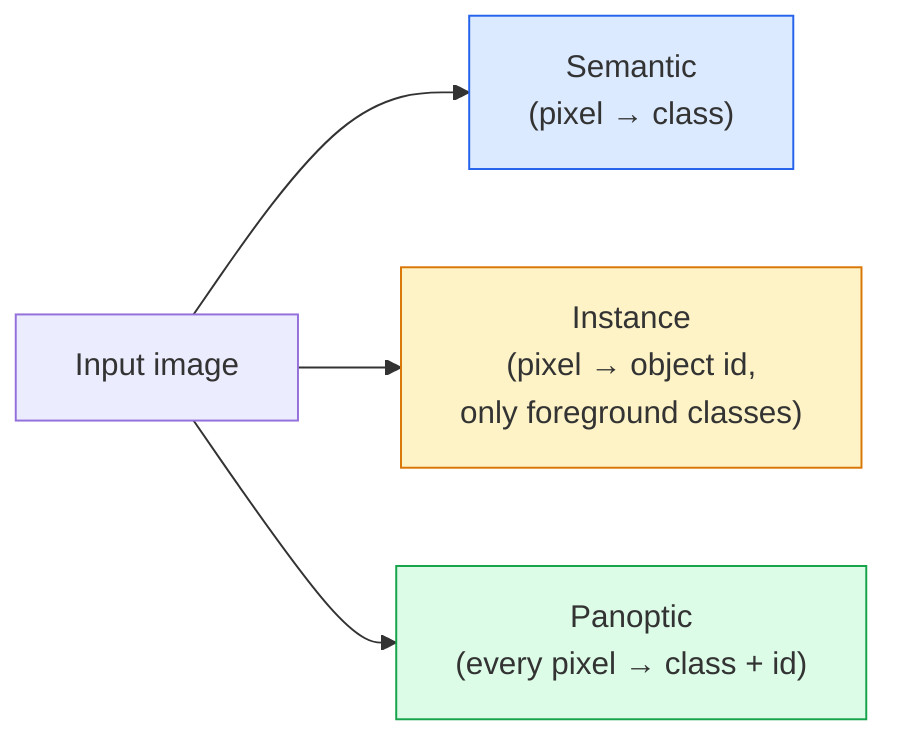
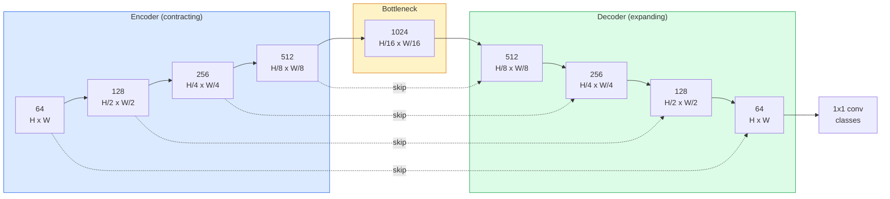

# Segmentacja semantyczna — U-Net

> Segmentacja to klasyfikacja na poziomie każdego piksela. U-Net realizuje to, łącząc enkoder zmniejszający rozdzielczość z dekoderem ją zwiększającym, połączonymi za pomocą połączeń skip.

**Typ:** Build
**Języki:** Python
**Wymagania wstępne:** Faza 4 Lekcja 03 (CNN), Faza 4 Lekcja 04 (Klasyfikacja obrazów)
**Czas:** ~75 minut

## Cele nauki

- Rozróżnienie segmentacji semantycznej, instancyjnej i panoptycznej oraz wybór odpowiedniego zadania dla danego problemu
- Zbudowanie sieci U-Net od zera w PyTorch z blokami enkodera, bottleneckiem, dekoderem z konwolucjami transponowanymi oraz połączeniami skip
- Implementacja pikselowej entropii skrośnej (cross-entropy), funkcji straty Dice oraz połączonej funkcji straty, która jest obecnym standardem w segmentacji medycznej i przemysłowej
- Odczytywanie metryk IoU i Dice dla poszczególnych klas oraz diagnozowanie, czy słaby wynik wynika z odzysku małych obiektów (recall), dokładności granic czy niezbalansowania klas

## Problem

Klasyfikacja zwraca jedną etykietę na obraz. Detekcja zwraca kilka prostokątów (boxów) na obraz. Segmentacja zwraca jedną etykietę na piksel. Dla wejścia o rozmiarze `H x W` wyjściem jest tensor o kształcie `H x W` (semantyczna) lub `H x W x N_instances` (instancyjna). To miliony predykcji na obraz, a nie jedna.

Ta struktura segmentacji sprawia, że stoi ona za prawie każdym produktem wizyjnym opartym na gęstej predykcji: obrazowanie medyczne (maski guzów), jazda autonomiczna (droga, pas, przeszkoda), zdjęcia satelitarne (zarysy budynków, granice pól), parsowanie dokumentów (strefy układu), robotyka (obszary możliwe do chwycenia). Żadnego z tych zadań nie da się rozwiązać poprzez obrysowanie obiektu prostokątem — potrzebna jest dokładna sylwetka.

Problem architektoniczny jest prosty do sformułowania, ale niełatwy do rozwiązania: sieć musi widzieć zarówno globalny kontekst obrazu (jaka to scena), jak i lokalny szczegół pikselowy (który dokładnie piksel jest drogą, a który chodnikiem) — jednocześnie. Standardowa sieć CNN kompresuje przestrzennie, aby uzyskać kontekst, co usuwa szczegóły. U-Net to projekt, który osiągnął oba cele.

## Koncepcja

### Semantyczna vs instancyjna vs panoptyczna



- **Semantyczna** mówi „ten piksel to droga, tamten to samochód". Dwa samochody stojące blisko siebie zlewają się w jeden obszar.
- **Instancyjna** mówi „ten piksel to samochód #3, tamten to samochód #5". Ignoruje elementy tła („stuff" = niebo, droga, trawa).
- **Panoptyczna** łączy obie: każdy piksel otrzymuje etykietę klasy, każda instancja otrzymuje unikalny identyfikator, segmentowane są jednocześnie elementy tła i obiekty pierwszoplanowe.

Ta lekcja obejmuje segmentację semantyczną. Następna lekcja (Mask R-CNN) obejmuje segmentację instancyjną.

### Kształt sieci U-Net



Enkoder cztery razy zmniejsza rozdzielczość przestrzenną o połowę i podwaja liczbę kanałów. Dekoder działa odwrotnie: cztery razy podwaja rozdzielczość przestrzenną i zmniejsza liczbę kanałów o połowę. Połączenia skip łączą (konkatenacja) odpowiadające sobie cechy enkodera z cechami dekodera na każdym poziomie rozdzielczości. Końcowa konwolucja 1x1 mapuje `64 -> num_classes` w pełnej rozdzielczości.

Dlaczego połączenia skip są niezbędne: dekoder w momencie generowania predykcji na poziomie pikseli widział tylko małe mapy cech. Bez skipów nie może precyzyjnie zlokalizować krawędzi, ponieważ ta informacja została skompresowana w enkoderze. Połączenia skip przekazują mu mapy cech o wysokiej rozdzielczości obliczone przez enkoder podczas zmniejszania rozdzielczości.

### Konwolucja transponowana vs upsampling bilinearny

Dekoder musi powiększać wymiary przestrzenne. Dwie opcje:

- **Konwolucja transponowana** (`nn.ConvTranspose2d`) — uczalny upsampling. Historyczny standard w U-Net. Może wytwarzać artefakty typu „szachownica" (checkerboard), jeśli stride i rozmiar kernela nie dzielą się równo.
- **Upsampling bilinearny + konwolucja 3x3** — gładki upsampling, po którym następuje konwolucja. Mniej artefaktów, mniej parametrów, obecnie nowy standard.

Obie metody są spotykane w praktyce. Dla pierwszej implementacji U-Net wariant bilinearny jest bezpieczniejszy.

### Entropia skrośna na siatce pikseli

Dla segmentacji semantycznej z C klasami wyjście modelu ma kształt `(N, C, H, W)`. Cel (target) ma kształt `(N, H, W)` z całkowitoliczbowymi identyfikatorami klas. Entropia skrośna (cross-entropy) jest identyczna jak w przypadku klasyfikacji, tylko zastosowana w każdej pozycji przestrzennej:

```
Loss = mean over (n, h, w) of -log( softmax(logits[n, :, h, w])[target[n, h, w]] )
```

`F.cross_entropy` w PyTorch obsługuje ten kształt natywnie. Nie jest wymagane przekształcanie kształtu (reshape).

### Funkcja straty Dice i dlaczego jest potrzebna

Entropia skrośna traktuje każdy piksel jednakowo. To błąd, gdy jedna klasa dominuje w kadrze (obrazowanie medyczne: 99% tła, 1% guza). Sieć może osiągnąć 99% dokładności, przewidując samo tło wszędzie, i wciąż być bezużyteczna.

Funkcja straty Dice rozwiązuje to, optymalizując bezpośrednio nakładanie się (overlap) między przewidywaną a prawdziwą maską:

```
Dice(p, y) = 2 * sum(p * y) / (sum(p) + sum(y) + epsilon)
Dice_loss = 1 - Dice
```

gdzie `p` to mapa prawdopodobieństw sigmoid/softmax dla danej klasy, a `y` to binarna maska ground-truth. Strata jest równa zeru tylko wtedy, gdy nakładanie się jest idealne. Ponieważ jest oparta na proporcji (ratio), niezbalansowanie klas nie ma znaczenia.

W praktyce stosuje się **połączoną funkcję straty (combined loss)**:

```
L = L_cross_entropy + lambda * L_dice       (lambda ~ 1)
```

Entropia skrośna zapewnia stabilne gradienty na początku treningu; Dice koncentruje końcową fazę treningu na faktycznym dopasowaniu kształtu maski. Ta kombinacja jest standardem w obrazowaniu medycznym i trudno ją przebić na jakimkolwiek zbiorze danych z niezbalansowanymi klasami.

### Metryki ewaluacyjne

- **Dokładność pikselowa (pixel accuracy)** — procent prawidłowo przewidzianych pikseli. Tania w obliczeniu. Zawodna na niezbalansowanych danych z tego samego powodu co dokładność (accuracy) w klasyfikacji.
- **IoU per klasa** — iloczyn przez sumę (intersection over union) dla maski każdej klasy; średnia po klasach = mIoU.
- **Dice (F1 na pikselach)** — podobna do IoU; `Dice = 2 * IoU / (1 + IoU)`. Obrazowanie medyczne preferuje Dice, środowisko motoryzacyjne preferuje IoU; są one monotonicznie powiązane.
- **Boundary F1** — mierzy, jak blisko przewidziane granice są granic ground-truth, penalizując nawet niewielkie przesunięcia. Ważne dla zadań wymagających wysokiej precyzji, jak inspekcja półprzewodników.

Raportuj IoU per klasa, nie tylko mIoU. Średnie IoU może skryć klasę na poziomie 15%, gdy dziewięć innych jest na poziomie 85%.

### Kompromis dotyczący rozdzielczości wejściowej

Enkoder U-Net cztery razy zmniejsza rozdzielczość o połowę, więc wejście musi być podzielne przez 16. Obrazy medyczne mają często rozmiar 512x512 lub 1024x1024. Wycinki z jazdy autonomicznej mają 2048x1024. Koszt pamięciowy U-Net skaluje się wraz z `H * W * C_max`, a przy 1024x1024 i 1024 kanałach w bottlenecku przejście w przód (forward pass) już zajmuje gigabajty VRAM.

Dwa standardowe rozwiązania:
1. Podziel wejście na kafelki (tiling) — przetwarzaj kafelki 256x256 z nakładaniem (overlap) i zszywaj.
2. Zastąp bottleneck konwolucjami dylatowanymi (dilated convolutions), które zachowują wyższą rozdzielczość przestrzenną, jednocześnie poszerzając pole recepcyjne (rodzina DeepLab).

Dla pierwszego modelu wejście 256x256 z U-Net o bazowej liczbie kanałów 64 trenuje się komfortowo na 8 GB VRAM.

## Budowa

### Krok 1: Blok enkodera

Dwie konwolucje 3x3 z batch norm i ReLU. Pierwsza konwolucja zmienia liczbę kanałów; druga ją zachowuje.

```python
import torch
import torch.nn as nn
import torch.nn.functional as F

class DoubleConv(nn.Module):
    def __init__(self, in_c, out_c):
        super().__init__()
        self.net = nn.Sequential(
            nn.Conv2d(in_c, out_c, kernel_size=3, padding=1, bias=False),
            nn.BatchNorm2d(out_c),
            nn.ReLU(inplace=True),
            nn.Conv2d(out_c, out_c, kernel_size=3, padding=1, bias=False),
            nn.BatchNorm2d(out_c),
            nn.ReLU(inplace=True),
        )

    def forward(self, x):
        return self.net(x)
```

Ten blok jest wielokrotnie wykorzystywany w całej sieci. `bias=False`, ponieważ beta z BN obsługuje bias.

### Krok 2: Bloki down i up

```python
class Down(nn.Module):
    def __init__(self, in_c, out_c):
        super().__init__()
        self.net = nn.Sequential(
            nn.MaxPool2d(2),
            DoubleConv(in_c, out_c),
        )

    def forward(self, x):
        return self.net(x)


class Up(nn.Module):
    def __init__(self, in_c, out_c):
        super().__init__()
        self.up = nn.Upsample(scale_factor=2, mode="bilinear", align_corners=False)
        self.conv = DoubleConv(in_c, out_c)

    def forward(self, x, skip):
        x = self.up(x)
        if x.shape[-2:] != skip.shape[-2:]:
            x = F.interpolate(x, size=skip.shape[-2:], mode="bilinear", align_corners=False)
        x = torch.cat([skip, x], dim=1)
        return self.conv(x)
```

Sprawdzenie kształtu ograniczone do wymiarów przestrzennych (`shape[-2:]`) obsługuje wejścia, których wymiary nie są podzielne przez 16; bezpieczne `F.interpolate` wyrównuje tensor przed konkatenacją. Porównywanie pełnego kształtu wywołałoby tę ścieżkę również przy różnicach w liczbie kanałów, co powinno być głośnym błędem, a nie cichym interpolowaniem.

### Krok 3: Sieć U-Net

```python
class UNet(nn.Module):
    def __init__(self, in_channels=3, num_classes=2, base=64):
        super().__init__()
        self.inc = DoubleConv(in_channels, base)
        self.d1 = Down(base, base * 2)
        self.d2 = Down(base * 2, base * 4)
        self.d3 = Down(base * 4, base * 8)
        self.d4 = Down(base * 8, base * 16)
        self.u1 = Up(base * 16 + base * 8, base * 8)
        self.u2 = Up(base * 8 + base * 4, base * 4)
        self.u3 = Up(base * 4 + base * 2, base * 2)
        self.u4 = Up(base * 2 + base, base)
        self.outc = nn.Conv2d(base, num_classes, kernel_size=1)

    def forward(self, x):
        x1 = self.inc(x)
        x2 = self.d1(x1)
        x3 = self.d2(x2)
        x4 = self.d3(x3)
        x5 = self.d4(x4)
        x = self.u1(x5, x4)
        x = self.u2(x, x3)
        x = self.u3(x, x2)
        x = self.u4(x, x1)
        return self.outc(x)

net = UNet(in_channels=3, num_classes=2, base=32)
x = torch.randn(1, 3, 256, 256)
print(f"output: {net(x).shape}")
print(f"params: {sum(p.numel() for p in net.parameters()):,}")
```

Kształt wyjścia `(1, 2, 256, 256)` — taki sam rozmiar przestrzenny jak wejście, `num_classes` kanałów. Około 7,7M parametrów przy `base=32`.

### Krok 4: Funkcje straty

```python
def dice_loss(logits, targets, num_classes, eps=1e-6):
    probs = F.softmax(logits, dim=1)
    targets_one_hot = F.one_hot(targets, num_classes).permute(0, 3, 1, 2).float()
    dims = (0, 2, 3)
    intersection = (probs * targets_one_hot).sum(dim=dims)
    denom = probs.sum(dim=dims) + targets_one_hot.sum(dim=dims)
    dice = (2 * intersection + eps) / (denom + eps)
    return 1 - dice.mean()


def combined_loss(logits, targets, num_classes, lam=1.0):
    ce = F.cross_entropy(logits, targets)
    dc = dice_loss(logits, targets, num_classes)
    return ce + lam * dc, {"ce": ce.item(), "dice": dc.item()}
```

Dice jest obliczane per klasa, a następnie uśredniane (macro Dice). `eps` zapobiega dzieleniu przez zero dla klas nieobecnych w danym batchu.

### Krok 5: Metryka IoU

```python
@torch.no_grad()
def iou_per_class(logits, targets, num_classes):
    preds = logits.argmax(dim=1)
    ious = torch.zeros(num_classes)
    for c in range(num_classes):
        pred_c = (preds == c)
        true_c = (targets == c)
        inter = (pred_c & true_c).sum().float()
        union = (pred_c | true_c).sum().float()
        ious[c] = (inter / union) if union > 0 else torch.tensor(float("nan"))
    return ious
```

Zwraca wektor o długości C. `nan` oznacza klasy nieobecne w batchu — nie należy ich uśredniać podczas obliczania mIoU.

### Krok 6: Syntetyczny zbiór danych do weryfikacji end-to-end

Generuj kształty na kolorowych tłach, aby sieć musiała nauczyć się rozpoznawać kształt, a nie kolor pikseli.

```python
import numpy as np
from torch.utils.data import Dataset, DataLoader

def synthetic_segmentation(num_samples=200, size=64, seed=0):
    rng = np.random.default_rng(seed)
    images = np.zeros((num_samples, size, size, 3), dtype=np.float32)
    masks = np.zeros((num_samples, size, size), dtype=np.int64)
    for i in range(num_samples):
        bg = rng.uniform(0, 1, (3,))
        images[i] = bg
        masks[i] = 0
        num_shapes = rng.integers(1, 4)
        for _ in range(num_shapes):
            cls = int(rng.integers(1, 3))
            color = rng.uniform(0, 1, (3,))
            cx, cy = rng.integers(10, size - 10, size=2)
            r = int(rng.integers(4, 12))
            yy, xx = np.meshgrid(np.arange(size), np.arange(size), indexing="ij")
            if cls == 1:
                mask = (xx - cx) ** 2 + (yy - cy) ** 2 < r ** 2
            else:
                mask = (np.abs(xx - cx) < r) & (np.abs(yy - cy) < r)
            images[i][mask] = color
            masks[i][mask] = cls
        images[i] += rng.normal(0, 0.02, images[i].shape)
        images[i] = np.clip(images[i], 0, 1)
    return images, masks


class SegDataset(Dataset):
    def __init__(self, images, masks):
        self.images = images
        self.masks = masks

    def __len__(self):
        return len(self.images)

    def __getitem__(self, i):
        img = torch.from_numpy(self.images[i]).permute(2, 0, 1).float()
        mask = torch.from_numpy(self.masks[i]).long()
        return img, mask
```

Trzy klasy: tło (0), okręgi (1), kwadraty (2). Sieć musi nauczyć się rozróżniać kształty.

### Krok 7: Pętla treningowa

```python
def train_one_epoch(model, loader, optimizer, device, num_classes):
    model.train()
    loss_sum, total = 0.0, 0
    iou_sum = torch.zeros(num_classes)
    for x, y in loader:
        x, y = x.to(device), y.to(device)
        logits = model(x)
        loss, _ = combined_loss(logits, y, num_classes)
        optimizer.zero_grad()
        loss.backward()
        optimizer.step()
        loss_sum += loss.item() * x.size(0)
        total += x.size(0)
        iou_sum += iou_per_class(logits, y, num_classes).nan_to_num(0)
    return loss_sum / total, iou_sum / len(loader)
```

Uruchom to przez 10-30 epok na syntetycznym zbiorze danych i obserwuj, jak mIoU wzrasta powyżej 0,9 dla klas kształtów. Zwróć uwagę, że `nan_to_num(0)` traktuje klasy nieobecne w danym batchu jako zero; dla dokładnego IoU per klasa należy maskować na podstawie obecności klasy i podczas ewaluacji używać `torch.nanmean` po batchach, a nie uśredniać w ten sposób.

## Zastosowanie

W produkcji `segmentation_models_pytorch` ("smp") opakowuje każdą standardową architekturę segmentacyjną w połączeniu z dowolnym backbone'em z torchvision lub timm. Trzy linie kodu:

```python
import segmentation_models_pytorch as smp

model = smp.Unet(
    encoder_name="resnet34",
    encoder_weights="imagenet",
    in_channels=3,
    classes=3,
)
```

Warto też znać do pracy produkcyjnej:
- **DeepLabV3+** zastępuje zmniejszanie rozdzielczości oparte na max-pool konwolucjami dylatowanymi, dzięki czemu bottleneck zachowuje rozdzielczość; szybsze i dokładniejsze granice na danych satelitarnych i motoryzacyjnych.
- **SegFormer** zastępuje konwolucyjny enkoder hierarchicznym transformerem; obecny SOTA w wielu benchmarkach.
- **Mask2Former** / **OneFormer** łączą segmentację semantyczną, instancyjną i panoptyczną w jednej architekturze.

Wszystkie trzy są zamiennikami „plug-in" w `smp` lub `transformers` z tym samym data loaderem.

## Co dalej

Ta lekcja generuje:

- `outputs/prompt-segmentation-task-picker.md` — prompt, który wybiera między segmentacją semantyczną, instancyjną i panoptyczną oraz wskazuje architekturę dla danego zadania.
- `outputs/skill-segmentation-mask-inspector.md` — skill, który raportuje rozkład klas, statystyki przewidywanej maski oraz klasy, które są niedoszacowane lub mają rozmyte granice.

## Zadania

1. **(Łatwe)** Zaimplementuj `bce_dice_loss` dla zadania segmentacji binarnej (pierwszy plan vs tło). Sprawdź na syntetycznym zbiorze dwuklasowym, czy połączona funkcja straty zbiega szybciej niż samo BCE, gdy pierwszy plan stanowi 5% pikseli.
2. **(Średnie)** Zastąp blok up `nn.Upsample + conv` blokiem up wykorzystującym `nn.ConvTranspose2d`. Wytrenuj obie wersje na syntetycznym zbiorze danych i porównaj mIoU. Zaobserwuj, gdzie pojawiają się artefakty typu „szachownica" w wersji z konwolucją transponowaną.
3. **(Trudne)** Weź rzeczywisty zbiór danych segmentacyjny (Oxford-IIIT Pets, mini split Cityscapes lub podzbiór medyczny) i wytrenuj U-Net do wyniku w granicach 2 punktów IoU od referencyjnego `smp.Unet`. Zaraportuj IoU per klasa i wskaż, które klasy najbardziej zyskują na dodaniu Dice do funkcji straty.

## Kluczowe terminy

| Termin | Co się mówi | Co to faktycznie znaczy |
|------|----------------|----------------------|
| Segmentacja semantyczna | "Oznacz każdy piksel" | Klasyfikacja per-piksel na C klas; instancje tej samej klasy łączą się w jedną |
| Segmentacja instancyjna | "Oznacz każdy obiekt" | Rozdziela poszczególne instancje tej samej klasy; tylko pierwszy plan (foreground) |
| Segmentacja panoptyczna | "Semantyczna + instancyjna" | Każdy piksel otrzymuje klasę; każda instancja obiektu (thing) otrzymuje też unikalny identyfikator |
| Połączenie skip | "Mostek U-Net" | Konkatenacja cech enkodera z cechami dekodera o tej samej rozdzielczości; zachowuje szczegóły wysokiej częstotliwości |
| Konwolucja transponowana | "Dekonwolucja" | Uczalny upsampling; może wytwarzać artefakty typu „szachownica" |
| Funkcja straty Dice | "Strata nakładania" | 1 - 2|A ∩ B| / (|A| + |B|); optymalizuje bezpośrednio nakładanie się masek i jest odporna na niezbalansowanie klas |
| mIoU | "Średnie iloczyn przez sumę" | Średnie IoU po klasach; standardowa metryka stosowana powszechnie w segmentacji |
| Boundary F1 | "Dokładność granic" | Wynik F1 obliczany tylko na pikselach granicznych; istotne dla zadań wymagających wysokiej precyzji |

## Dalsze materiały

- [U-Net: Convolutional Networks for Biomedical Image Segmentation (Ronneberger et al., 2015)](https://arxiv.org/abs/1505.04597) — oryginalna publikacja; rysunek, który wszyscy kopiują, znajduje się na stronie 2
- [Fully Convolutional Networks (Long et al., 2015)](https://arxiv.org/abs/1411.4038) — publikacja, która jako pierwsza uczyniła segmentację problemem konwolucyjnym end-to-end
- [segmentation_models_pytorch](https://github.com/qubvel/segmentation_models.pytorch) — punkt odniesienia dla segmentacji produkcyjnej; wszystkie standardowe architektury i wszystkie standardowe funkcje straty
- [Lessons learned from training SOTA segmentation (kaggle.com competitions)](https://www.kaggle.com/code/iafoss/carvana-unet-pytorch) — opis tego, dlaczego TTA, pseudo-etykietowanie i wagi klas mają znaczenie na rzeczywistych danych
