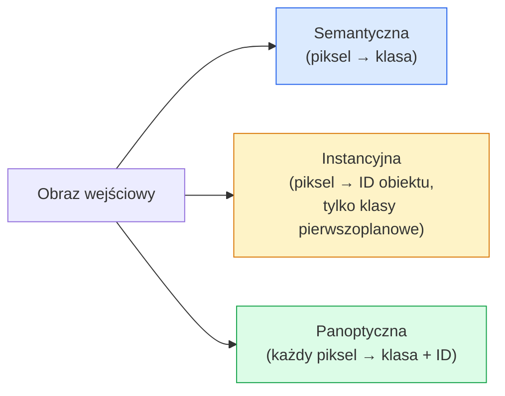
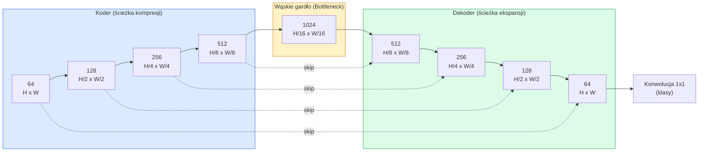

# Segmentacja semantyczna — U-Net

> Segmentacja to klasyfikacja na poziomie pojedynczych pikseli. U-Net realizuje to zadanie, łącząc koder zmniejszający próbkowanie (downsampling encoder) z dekoderem zwiększającym próbkowanie (upsampling decoder) za pomocą połączeń pomijających (skip connections).

**Typ:** Kompilacja
**Języki:** Python
**Wymagania wstępne:** Faza 4, lekcja 03 (CNN), Faza 4, lekcja 04 (klasyfikacja obrazów)
**Czas:** ~75 minut

## Cele nauczania

- Rozróżnienie segmentacji semantycznej, instancyjnej oraz panoptycznej i dobór właściwego typu zadania do danego problemu.
- Zbudowanie od podstaw sieci U-Net w PyTorch, zawierającej bloki kodera, wąskie gardło (bottleneck), dekoder z interpolacją oraz połączenia pomijające (skip connections).
- Zaimplementowanie pikselowej entropii krzyżowej (pixel-wise cross-entropy), straty Dice'a (Dice loss) oraz ich kombinacji (straty łączonej), będącej standardem w segmentacji medycznej i przemysłowej.
- Interpretacja metryk IoU oraz Dice dla poszczególnych klas i diagnozowanie problemów z czułością (recall) dla małych obiektów, precyzją granic czy niezbalansowaniem klas.

## Problem

Klasyfikacja przypisuje pojedynczą etykietę do całego obrazu. Wykrywanie obiektów (object detection) generuje współrzędne ramek otaczających (bounding boxes). Segmentacja natomiast klasyfikuje każdy piksel z osobna. Dla obrazu wejściowego o rozmiarze `H x W` wyjściem modelu jest tensor o kształcie `H x W` (w segmentacji semantycznej) lub `H x W x N_instances` (w segmentacji instancyjnej). Przekłada się to na miliony predykcji dla pojedynczego obrazu.

Segmentacja leży u podstaw niemal każdego systemu komputerowego rozpoznawania obrazów (computer vision) opartego na gęstej predykcji (dense prediction): obrazowania medycznego (wykrywanie zmian nowotworowych), jazdy autonomicznej (wyznaczanie jezdni, pasów ruchu, przeszkód), teledetekcji i analizy zdjęć satelitarnych (obrysy budynków, granice upraw), analizy dokumentów (struktura układu strony) czy robotyki (określanie stref chwytu obiektów). Żadnego z tych zadań nie da się rozwiązać za pomocą zwykłych ramek otaczających – konieczne jest precyzyjne odwzorowanie kształtów (maski).

Wyzwanie architektoniczne polega na tym, by sieć potrafiła jednocześnie uchwycić globalny kontekst obrazu (np. jaka to scena) oraz lokalne szczegóły geometryczne (dokładnie który piksel należy do krawędzi obiektu). Standardowe sieci CNN redukują wymiary przestrzenne w celu ekstrakcji kontekstu semantycznego, co bezpowrotnie niszczy drobne szczegóły. Architektura U-Net powstała jako rozwiązanie tego problemu, łącząc oba te aspekty.

## Koncepcja

### Segmentacja semantyczna, instancyjna i panoptyczna



- **Segmentacja semantyczna** klasyfikuje każdy piksel (np. „ten piksel to jezdnia, ten piksel to samochód”). Dwa zaparkowane obok siebie samochody zostaną połączone w jedną maskę (obszar).
- **Segmentacja instancyjna** rozróżnia poszczególne obiekty (np. „ten piksel to samochód nr 3, a tamten to samochód nr 5”). Ignoruje ona elementy tła (tzw. *stuff*, np. niebo, jezdnia, trawa).
- **Segmentacja panoptyczna** łączy oba podejścia: każdy piksel otrzymuje etykietę klasy, a każda instancja obiektu policzalnego (*things*) dodatkowo swój unikalny identyfikator. Rozróżnia ona zarówno obiekty, jak i bezkształtne tło (*stuff*).

Ta lekcja skupia się na segmentacji semantycznej. Kolejny moduł (Mask R-CNN) dotyczy segmentacji instancyjnej.

### Architektura U-Net



Koder czterokrotnie zmniejsza rozdzielczość przestrzenną o połowę, jednocześnie podwajając liczbę kanałów. Dekoder wykonuje operację odwrotną: czterokrotnie podwaja rozdzielczość przestrzenną i zmniejsza liczbę kanałów o połowę. Połączenia pomijające (skip connections) łączą mapy cech (feature maps) z kodera z odpowiadającymi im mapami w dekoderze na każdym poziomie rozdzielczości. Ostateczna konwolucja 1x1 mapuje 64 kanały na liczbę klas (`num_classes`) w pełnej rozdzielczości przestrzennej.

Dlaczego połączenia pomijające są kluczowe: bez nich dekoder dysponowałby jedynie mocno skompresowanymi, niskorozdzielczymi mapami cech z wąskiego gardła przed próbą rekonstrukcji predykcji na poziomie pikseli. Model nie byłby w stanie precyzyjnie zlokalizować krawędzi obiektów. Połączenia te przekazują wysokorozdzielcze cechy przestrzenne bezpośrednio z kodera (wyznaczone podczas ścieżki w dół).

### Splot transponowany vs interpolacja dwuliniowa (Upsampling)

Dekoder musi zwiększać wymiary przestrzenne map cech. Stosuje się dwie główne metody:

- **Splot transponowany** (`nn.ConvTranspose2d`) – operacja zwiększania wymiarów z parametrami podlegającymi uczeniu. Klasyczne podejście w oryginalnej sieci U-Net. Może jednak powodować artefakty szachownicy (checkerboard artifacts), jeśli krok (stride) i rozmiar jądra (kernel size) nie są odpowiednio dobrane.
- **Interpolacja dwuliniowa + konwolucja 3x3** – gładkie powiększanie obrazu za pomocą stałej interpolacji, a następnie nałożenie warstwy splotowej. Generuje mniej artefaktów i redukuje liczbę parametrów – obecnie jest to standardowe, nowoczesne podejście.

Oba rozwiązania są powszechnie stosowane w praktyce. Na początku drogi z modelami U-Net bezpieczniejszym wyborem jest stosowanie interpolacji dwuliniowej.

### Pikselowa entropia krzyżowa (Pixel-wise Cross-Entropy)

W wieloklasowej segmentacji semantycznej (dla $C$ klas) wyjście modelu ma kształt `(N, C, H, W)`, natomiast maska rzeczywista (target) ma kształt `(N, H, W)` i zawiera identyfikatory klas w postaci liczb całkowitych. Entropia krzyżowa jest identyczna jak w klasycznej klasyfikacji obrazów, lecz jest aplikowana niezależnie dla każdego piksela:

```
Loss = średnia po (n, h, w) z -log( softmax(logits[n, :, h, w])[target[n, h, w]] )
```

Funkcja `F.cross_entropy` w PyTorch natywnie obsługuje sensory o takich kształtach, więc nie ma potrzeby ręcznej zmiany wymiarów.

### Strata Dice'a (Dice Loss) i jej znaczenie

Entropia krzyżowa traktuje każdy piksel jednakowo. Prowadzi to do poważnych problemów w przypadku silnego niezbalansowania klas (np. w obrazowaniu medycznym, gdzie tło zajmuje 99% obrazu, a szukana zmiana chorobowa tylko 1%). Model może osiągnąć 99% dokładności (accuracy), po prostu klasyfikując wszystkie piksele jako tło, co czyni go bezużytecznym.

Strata Dice'a (Dice Loss) rozwiązuje ten problem, bezpośrednio optymalizując stopień pokrycia maski przewidywanej i rzeczywistej:

```
Dice(p, y) = 2 * sum(p * y) / (sum(p) + sum(y) + epsilon)
Dice_loss = 1 - Dice
```

gdzie `p` to mapa prawdopodobieństw klasy (po funkcji sigmoid lub softmax), a `y` to binarna maska rzeczywista (ground-truth). Strata wynosi zero tylko przy idealnym pokryciu masek. Dzięki operowaniu na stosunkach powierzchni, brak zbalansowania klas nie wpływa negatywnie na stabilność optymalizacji.

W praktyce stosuje się **stratę hybrydową (łączoną)**:

```
L = L_cross_entropy + lambda * L_dice       (gdzie lambda ~ 1)
```

Entropia krzyżowa zapewnia stabilniejsze gradienty na początku procesu uczenia, natomiast strata Dice'a dba o precyzyjne dopasowanie konturów maski w późniejszej fazie. Ta kombinacja jest domyślnym standardem w segmentacji medycznej.

### Metryki ewaluacji

- **Dokładność pikseli (Pixel Accuracy)** – procent poprawnie sklasyfikowanych pikseli. Prosta w obliczeniach, lecz bezużyteczna przy niezbalansowanych danych.
- **Współczynnik IoU dla klasy (Intersection over Union)** – stosunek części wspólnej do sumy obszarów maski przewidywanej i rzeczywistej dla danej klasy. Średnia po wszystkich klasach daje metrykę **mIoU**.
- **Współczynnik Dice'a (F1 na poziomie pikseli)** – blisko powiązany z IoU; zachodzi relacja: $\text{Dice} = \frac{2 \cdot \text{IoU}}{1 + \text{IoU}}$. Sektor medyczny częściej posługuje się metryką Dice, natomiast systemy jazdy autonomicznej wolą IoU; obie metryki są monotonicznie powiązane.
- **Granica F1 (Boundary F1)** – mierzy stopień dopasowania samych krawędzi masek, surowo karząc nawet małe przesunięcia konturu. Kluczowe w zadaniach o wysokiej precyzji, np. przy kontroli jakości w mikroskopii przemysłowej.

Zawsze należy raportować IoU dla każdej klasy z osobna. Średnia mIoU może maskować krytyczne błędy (np. wykrywanie rzadkiej klasy na poziomie 15%, podczas gdy pozostałe mają 85%).

### Rozmiar obrazu wejściowego a zasoby sprzętowe

Koder U-Net czterokrotnie zmniejsza wymiary przestrzenne o połowę, stąd wymiary wejściowe muszą być podzielne przez 16. Zdjęcia medyczne często mają rozdzielczości 512x512 lub 1024x1024, a obrazy w systemach jazdy autonomicznej nawet 2048x1024. Zapotrzebowanie na pamięć w sieci U-Net skaluje się jako $H \cdot W \cdot C_{max}$. Przy wejściu 1024x1024 i 1024 kanałach w wąskim gardle, przejście w przód (forward pass) może błyskawicznie przepełnić pamięć VRAM.

Dwa najpopularniejsze podejścia to:
1. **Dzielenie obrazu na kafelki (tiling)** – przetwarzanie obrazu w mniejszych, nakładających się fragmentach (np. 256x256), a następnie ich łączenie (zszywanie) z wygładzaniem krawędzi.
2. **Zastąpienie wąskiego gardła splotami rozszerzonymi (dilated convolutions)** – pozwala to utrzymać wyższą rozdzielczość przestrzenną przy szerokim polu recepcyjnym (rodzina modeli DeepLab).

W przypadku pierwszych własnych implementacji wejście 256x256 wraz z siecią o bazowej liczbie kanałów równej 64 pozwala na stabilny trening na karcie z 8 GB pamięci VRAM.

## Implementacja krok po kroku

### Krok 1: Blok podwójnej konwolucji (DoubleConv)

Składa się z dwóch warstw splotowych 3x3, z których każda posiada normalizację wsadową (Batch Normalization) oraz aktywację ReLU. Pierwszy splot dostosowuje liczbę kanałów, a drugi ją zachowuje.

```python
import torch
import torch.nn as nn
import torch.nn.functional as F

class DoubleConv(nn.Module):
    def __init__(self, in_c, out_c):
        super().__init__()
        self.net = nn.Sequential(
            nn.Conv2d(in_c, out_c, kernel_size=3, padding=1, bias=False),
            nn.BatchNorm2d(out_c),
            nn.ReLU(inplace=True),
            nn.Conv2d(out_c, out_c, kernel_size=3, padding=1, bias=False),
            nn.BatchNorm2d(out_c),
            nn.ReLU(inplace=True),
        )

    def forward(self, x):
        return self.net(x)
```

Ten komponent jest wielokrotnie wykorzystywany w całej architekturze. Ustawiamy `bias=False`, ponieważ warstwa normalizacji wsadowej eliminuje potrzebę stosowania wyrazu wolnego (bias).

### Krok 2: Bloki Down i Up

```python
class Down(nn.Module):
    def __init__(self, in_c, out_c):
        super().__init__()
        self.net = nn.Sequential(
            nn.MaxPool2d(2),
            DoubleConv(in_c, out_c),
        )

    def forward(self, x):
        return self.net(x)

class Up(nn.Module):
    def __init__(self, in_c, out_c):
        super().__init__()
        self.up = nn.Upsample(scale_factor=2, mode="bilinear", align_corners=False)
        self.conv = DoubleConv(in_c, out_c)

    def forward(self, x, skip):
        x = self.up(x)
        if x.shape[-2:] != skip.shape[-2:]:
            x = F.interpolate(x, size=skip.shape[-2:], mode="bilinear", align_corners=False)
        x = torch.cat([skip, x], dim=1)
        return self.conv(x)
```

Kontrola wymiarów przestrzennych (`shape[-2:]`) zabezpiecza model w przypadku przekazania obrazów, których wymiary nie dzielą się idealnie przez 16 – funkcja `F.interpolate` wyrównuje tensory przed konkatenacją. Sprawdzanie całego kształtu (wraz z kanałami) mogłoby maskować błędy w architekturze; niezgodność liczby kanałów powinna rzucić jawny błąd w operacji `torch.cat`, a nie być po cichu interpolowana.

### Krok 3: Pełna sieć U-Net

```python
class UNet(nn.Module):
    def __init__(self, in_channels=3, num_classes=2, base=64):
        super().__init__()
        self.inc = DoubleConv(in_channels, base)
        self.d1 = Down(base, base * 2)
        self.d2 = Down(base * 2, base * 4)
        self.d3 = Down(base * 4, base * 8)
        self.d4 = Down(base * 8, base * 16)
        self.u1 = Up(base * 16 + base * 8, base * 8)
        self.u2 = Up(base * 8 + base * 4, base * 4)
        self.u3 = Up(base * 4 + base * 2, base * 2)
        self.u4 = Up(base * 2 + base, base)
        self.outc = nn.Conv2d(base, num_classes, kernel_size=1)

    def forward(self, x):
        x1 = self.inc(x)
        x2 = self.d1(x1)
        x3 = self.d2(x2)
        x4 = self.d3(x3)
        x5 = self.d4(x4)
        x = self.u1(x5, x4)
        x = self.u2(x, x3)
        x = self.u3(x, x2)
        x = self.u4(x, x1)
        return self.outc(x)

net = UNet(in_channels=3, num_classes=2, base=32)
x = torch.randn(1, 3, 256, 256)
print(f"Wyjście: {net(x).shape}")
print(f"Parametry: {sum(p.numel() for p in net.parameters()):,}")
```

Kształt wyjściowy to `(1, 2, 256, 256)` – taka sama rozdzielczość przestrzenna jak na wejściu, z liczbą kanałów równą `num_classes`. Model przy `base=32` posiada około 7.7 miliona parametrów.

### Krok 4: Funkcje strat

```python
def dice_loss(logits, targets, num_classes, eps=1e-6):
    probs = F.softmax(logits, dim=1)
    targets_one_hot = F.one_hot(targets, num_classes).permute(0, 3, 1, 2).float()
    dims = (0, 2, 3)
    intersection = (probs * targets_one_hot).sum(dim=dims)
    denom = probs.sum(dim=dims) + targets_one_hot.sum(dim=dims)
    dice = (2 * intersection + eps) / (denom + eps)
    return 1 - dice.mean()

def combined_loss(logits, targets, num_classes, lam=1.0):
    ce = F.cross_entropy(logits, targets)
    dc = dice_loss(logits, targets, num_classes)
    return ce + lam * dc, {"ce": ce.item(), "dice": dc.item()}
```

Wartość Dice jest obliczana dla każdej klasy niezależnie, a następnie wyciągana jest z nich średnia (makro-uśrednianie). Czynnik `eps` chroni przed dzieleniem przez zero dla klas, które nie wystąpiły w danej minipaczce.

### Krok 5: Metryka IoU

```python
@torch.no_grad()
def iou_per_class(logits, targets, num_classes):
    preds = logits.argmax(dim=1)
    ious = torch.zeros(num_classes)
    for c in range(num_classes):
        pred_c = (preds == c)
        true_c = (targets == c)
        inter = (pred_c & true_c).sum().float()
        union = (pred_c | true_c).sum().float()
        ious[c] = (inter / union) if union > 0 else torch.tensor(float("nan"))
    return ious
```

Zwraca wektor o długości $C$. Wartość `nan` oznacza klasy nieobecne w bieżącej paczce danych – nie należy ich wliczać do ostatecznej średniej mIoU.

### Krok 6: Syntetyczny zbiór danych do testów end-to-end

Generujemy proste figury geometryczne na losowych, kolorowych tłach, co zmusza model do uczenia się kształtów zamiast bazowania na kolorach poszczególnych pikseli.

```python
import numpy as np
from torch.utils.data import Dataset, DataLoader

def synthetic_segmentation(num_samples=200, size=64, seed=0):
    rng = np.random.default_rng(seed)
    images = np.zeros((num_samples, size, size, 3), dtype=np.float32)
    masks = np.zeros((num_samples, size, size), dtype=np.int64)
    for i in range(num_samples):
        bg = rng.uniform(0, 1, (3,))
        images[i] = bg
        masks[i] = 0
        num_shapes = rng.integers(1, 4)
        for _ in range(num_shapes):
            cls = int(rng.integers(1, 3))
            color = rng.uniform(0, 1, (3,))
            cx, cy = rng.integers(10, size - 10, size=2)
            r = int(rng.integers(4, 12))
            yy, xx = np.meshgrid(np.arange(size), np.arange(size), indexing="ij")
            if cls == 1:
                mask = (xx - cx) ** 2 + (yy - cy) ** 2 < r ** 2
            else:
                mask = (np.abs(xx - cx) < r) & (np.abs(yy - cy) < r)
            images[i][mask] = color
            masks[i][mask] = cls
        images[i] += rng.normal(0, 0.02, images[i].shape)
        images[i] = np.clip(images[i], 0, 1)
    return images, masks

class SegDataset(Dataset):
    def __init__(self, images, masks):
        self.images = images
        self.masks = masks

    def __len__(self):
        return len(self.images)

    def __getitem__(self, i):
        img = torch.from_numpy(self.images[i]).permute(2, 0, 1).float()
        mask = torch.from_numpy(self.masks[i]).long()
        return img, mask
```

Mamy 3 klasy: tło (0), koła (1), kwadraty (2). Sieć musi nauczyć się identyfikacji tych kształtów.

### Krok 7: Pętla treningowa

```python
def train_one_epoch(model, loader, optimizer, device, num_classes):
    model.train()
    loss_sum, total = 0.0, 0
    iou_sum = torch.zeros(num_classes)
    for x, y in loader:
        x, y = x.to(device), y.to(device)
        logits = model(x)
        loss, _ = combined_loss(logits, y, num_classes)
        optimizer.zero_grad()
        loss.backward()
        optimizer.step()
        loss_sum += loss.item() * x.size(0)
        total += x.size(0)
        iou_sum += iou_per_class(logits, y, num_classes).nan_to_num(0)
    return loss_sum / total, iou_sum / len(loader)
```

Uruchomienie tego kodu na 10–30 epok na danych syntetycznych powinno zaowocować wzrostem mIoU dla klas geometrycznych powyżej 0.9. Pamiętaj, że funkcja `nan_to_num(0)` traktuje nieobecne klasy jako 0. W celach dokładnej ewaluacji należy odfiltrować nieobecne klasy i użyć `torch.nanmean` po wszystkich paczkach danych zamiast prostego uśredniania w tym miejscu.

## Wykorzystanie w praktyce

W zastosowaniach komercyjnych (produkcyjnych) warto skorzystać z biblioteki `segmentation_models_pytorch` („smp”), która dostarcza gotowe architektury segmentacji z dowolnymi modelami bazowymi (backbones) z bibliotek Torchvision lub Timm. Konfiguracja sprowadza się do kilku linii kodu:

```python
import segmentation_models_pytorch as smp

model = smp.Unet(
    encoder_name="resnet34",
    encoder_weights="imagenet",
    in_channels=3,
    classes=3,
)
```

Inne popularne architektury produkcyjne:
- **DeepLabV3+** – zastępuje klasyczne próbkowanie w dół splotami rozszerzonymi (dilated convolutions), dzięki czemu wąskie gardło zachowuje większą rozdzielczość przestrzenną. Doskonale sprawdza się w zdjęciach satelitarnych oraz przy wykrywaniu drogi.
- **SegFormer** – koder konwolucyjny zastąpiono hierarchicznym transformatorem (Transformer); obecny stan wiedzy (SOTA) w wielu benchmarkach.
- **Mask2Former** / **OneFormer** – unifikuje zadania segmentacji semantycznej, instancyjnej i panoptycznej w ramach jednej, spójnej architektury.

Wszystkie te modele można łatwo zintegrować w ramach bibliotek `smp` lub `transformers`, korzystając z tych samych loaderów danych.

## Dostarczone narzędzia

W ramach tej lekcji otrzymujesz:

- `outputs/prompt-segmentation-task-picker.md` – prompt ułatwiający dobór odpowiedniego typu segmentacji (semantyczna, instancyjna, panoptyczna) oraz sugerujący właściwą architekturę dla konkretnego problemu.
- `outputs/skill-segmentation-mask-inspector.md` – narzędzie analizujące rozkład klas w maskach oraz identyfikujące klasy z niedoszacowanymi lub rozmytymi granicami.

## Ćwiczenia

1. **(Łatwe)** Zaimplementuj funkcję straty `bce_dice_loss` dla segmentacji binarnej (obiekt vs tło). Zweryfikuj na syntetycznym zbiorze dwuklasowym, że łączona strata (BCE + Dice) zbiega się szybciej niż samo BCE w sytuacji, gdy obiekt zajmuje jedynie 5% wszystkich pikseli.
2. **(Średnie)** Zastąp blok powiększający (`nn.Upsample` + conv) warstwą splotu transponowanego (`nn.ConvTranspose2d`). Przetrenuj obie wersje na syntetycznym zbiorze danych i porównaj mIoU. Zwróć uwagę na miejsca, w których splot transponowany generuje artefakty szachownicy (checkerboard artifacts).
3. **(Trudne)** Wykorzystaj rzeczywisty zbiór danych (np. Oxford-IIIT Pets, uproszczoną wersję Cityscapes lub zbiór medyczny) i wytrenuj własną sieć U-Net tak, aby jej wynik mIoU różnił się o najwyżej 2 punkty procentowe od gotowego modelu bazowego z `smp.Unet`. Monitoruj wyniki IoU dla poszczególnych klas i wskaż, które klasy zyskują najwięcej po dodaniu straty Dice'a.

## Kluczowe terminy

| Termin | Potoczne określenie | Co to oznacza w rzeczywistości |
|------|----------------|----------------------|
| Segmentacja semantyczna | „Oznaczanie każdego piksela” | Klasyfikacja każdego piksela do jednej z $C$ klas; obiekty tej samej klasy są łączone w jedną maskę. |
| Segmentacja instancyjna | „Wykrywanie kształtu każdego obiektu” | Wydzielenie poszczególnych instancji (obiektów) tej samej klasy; dotyczy tylko obiektów pierwszoplanowych. |
| Segmentacja panoptyczna | „Semantyka + instancja” | Łączy oba podejścia: każdy piksel otrzymuje etykietę klasy, a każda instancja obiektu policzalnego (*thing*) dodatkowo swój unikalny identyfikator. |
| Połączenie pomijające (Skip Connection) | „Most U-Net” | Przekazywanie map cech z kodera bezpośrednio do dekodera na odpowiadających sobie poziomach rozdzielczości; pozwala zachować szczegóły o wysokiej częstotliwości przestrzennej. |
| Splot transponowany | „Dekonwolucja” | Warstwa powiększająca rozdzielczość (upsampling) posiadająca parametry podlegające uczeniu; może powodować powstawanie artefaktów szachownicy. |
| Strata Dice'a (Dice Loss) | „Strata nakładania się” | Zdefiniowana jako $1 - \frac{2|A \cap B|}{|A| + |B|}$; bezpośrednio optymalizuje stopień pokrycia masek i jest odporna na silne niezbalansowanie klas. |
| mIoU | „Średnie IoU” | Średnia wartość współczynnika IoU (Intersection over Union) wyznaczona dla wszystkich klas; podstawowy standard oceny modeli segmentacji. |
| Granica F1 (Boundary F1) | „Dokładność krawędzi” | Wynik F1 wyliczany wyłącznie dla pikseli leżących na krawędziach obiektów; istotny w zadaniach o krytycznej precyzji lokalizacji. |

## Dalsze czytanie

- [U-Net: Convolutional Networks for Biomedical Image Segmentation (Ronneberger et al., 2015)](https://arxiv.org/abs/1505.04597) — oryginalna publikacja naukowa; słynny schemat architektury znajduje się na stronie 2.
- [Fully Convolutional Networks (Long et al., 2015)](https://arxiv.org/abs/1411.4038) — pierwsza publikacja, która sformułowała zadanie segmentacji jako w pełni konwolucyjną sieć (FCN) uczoną end-to-end.
- [segmentation_models_pytorch](https://github.com/qubvel/segmentation_models.pytorch) — popularna biblioteka do segmentacji w środowisku produkcyjnym; zawiera większość standardowych architektur i funkcji strat.
- [Wnioski wyciągnięte ze szkolenia segmentacji SOTA (konkursy kaggle.com)](https://www.kaggle.com/code/iafoss/carvana-unet-pytorch) — praktyczne wnioski z treningu modeli segmentacyjnych SOTA (konkursy Kaggle); przewodnik tłumaczący znaczenie technik TTA (Test-Time Augmentation), pseudo-labelingu oraz ważenia klas na realnych danych.
