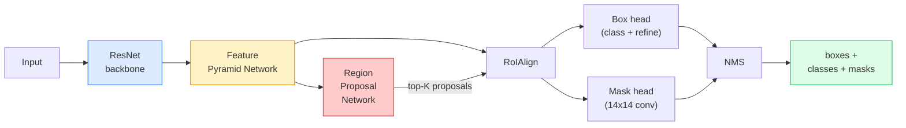

# Segmentacja instancji — Mask R-CNN

> Dodaj niewielką gałąź maski do detektora Faster R-CNN i masz segmentację instancji. Trudna część to RoIAlign, i jest trudniejsza, niż wygląda.

**Typ:** Budowanie + nauka
**Języki:** Python
**Wymagania wstępne:** Faza 4, lekcja 06 (YOLO), Faza 4, lekcja 07 (U-Net)
**Czas:** ~75 minut

## Cele nauki

- Przejść przez architekturę Mask R-CNN od początku do końca: backbone, FPN, RPN, RoIAlign, głowica box, głowica maski
- Zaimplementować RoIAlign od zera i wyjaśnić, czemu RoIPool nie jest już używane
- Użyć wstępnie wytrenowanego modelu torchvision `maskrcnn_resnet50_fpn_v2` do generowania masek instancji o jakości produkcyjnej i prawidłowo odczytać format jego wyjścia
- Dostroić Mask R-CNN na małym, własnym zbiorze danych, zamieniając głowice box i maski przy zamrożonym backbone

## Problem

Segmentacja semantyczna daje jedną maskę na klasę. Segmentacja instancji daje jedną maskę na obiekt, nawet gdy dwa obiekty należą do tej samej klasy. Liczenie poszczególnych obiektów, śledzenie ich między ramkami i mierzenie ich (bounding box każdej cegły w murze, każdej komórki na zdjęciu z mikroskopu) — wszystko to wymaga segmentacji instancji.

Mask R-CNN (He et al., 2017) rozwiązał ten problem, przeformułowując segmentację instancji jako detekcję plus maskę. Projekt był tak elegancki, że przez kolejne pięć lat praktycznie każda praca z segmentacji instancji była wariantem Mask R-CNN, a implementacja w torchvision wciąż jest domyślnym rozwiązaniem produkcyjnym dla małych i średnich zbiorów danych.

Trudnym problemem inżynieryjnym jest tu próbkowanie: jak wyciąć fragment mapy cech o ustalonym rozmiarze z propozycji ramki, której narożniki nie pasują do granic pikseli? Błąd w tym miejscu kosztuje dziesiąte części punktu mAP wszędzie. Odpowiedzią jest RoIAlign.

## Koncepcja

### Architektura



Pięć elementów do zrozumienia:

1. **Backbone** — ResNet-50 lub ResNet-101 wytrenowany na ImageNet. Tworzy hierarchię map cech o krokach (stride) 4, 8, 16, 32.
2. **FPN (Feature Pyramid Network)** — połączenia odgórne (top-down) i boczne (lateral), które dają każdemu poziomowi C kanałów semantycznie bogatych cech. Detekcja odpytuje poziom FPN odpowiadający rozmiarowi obiektu.
3. **RPN (Region Proposal Network)** — mała głowica konwolucyjna, która dla każdej pozycji kotwicy (anchor) przewiduje „czy jest tu obiekt?” oraz „jak skorygować ramkę?”. Generuje ~1000 propozycji na obraz.
4. **RoIAlign** — wycina fragment cech o ustalonym rozmiarze (np. 7x7) z dowolnej ramki na dowolnym poziomie FPN. Próbkowanie biliniowe, bez kwantyzacji.
5. **Głowice (Heads)** — dwuwarstwowa głowica box, która koryguje ramkę i wybiera klasę, oraz niewielka głowica konwolucyjna, która generuje binarną maskę `28x28` dla każdej propozycji.

### Czemu RoIAlign, a nie RoIPool

Oryginalny Fast R-CNN używał RoIPool, który dzieli ramkę propozycji na siatkę, bierze maksymalną wartość cechy w każdej komórce i zaokrągla wszystkie współrzędne do liczb całkowitych. To zaokrąglenie przesuwa mapę cech względem współrzędnych pikseli wejściowych o nawet cały piksel mapy cech — niewielki problem na obrazie 224x224, katastrofalny, gdy mapa cech ma stride 32.

```
RoIPool:
  box (34.7, 51.3, 98.2, 142.9)
  round -> (34, 51, 98, 142)
  split grid -> round each cell boundary
  misalignment accumulates at every step

RoIAlign:
  box (34.7, 51.3, 98.2, 142.9)
  sample at exact float coordinates using bilinear interpolation
  no rounding anywhere
```

RoIAlign podnosi mask AP o 3-4 punkty na COCO praktycznie za darmo. Każdy detektor, dla którego liczy się lokalizacja, używa go obecnie — YOLOv7 seg, RT-DETR, Mask2Former i inne.

### RPN w jednym akapicie

W każdej pozycji mapy cech umieszczamy K ramek kotwicowych (anchor) o różnych rozmiarach i proporcjach. Dla każdej kotwicy przewidujemy wynik obiektowości (objectness score) oraz przesunięcie regresyjne, które przekształca kotwicę w lepiej dopasowaną ramkę. Zachowujemy ~1000 ramek o najwyższym wyniku, stosujemy NMS przy IoU 0.7 i przekazujemy ocalałe do głowic. RPN jest trenowany własną mini-funkcją straty — o tej samej strukturze jak strata YOLO z lekcji 6, tylko z dwiema klasami (obiekt / brak obiektu).

### Głowica maski

Dla każdej propozycji (po RoIAlign) głowica maski to mała sieć FCN: cztery konwolucje 3x3, dekonwolucja 2x oraz końcowa konwolucja 1x1, która generuje `num_classes` kanałów wyjściowych w rozdzielczości `28x28`. Zachowywany jest tylko kanał odpowiadający przewidzianej klasie; pozostałe są ignorowane. To odsprzęga przewidywanie maski od klasyfikacji.

Maska 28x28 jest powiększana (upsampling) do oryginalnego rozmiaru pikselowego propozycji, aby uzyskać finalną binarną maskę.

### Funkcje straty

Mask R-CNN sumuje cztery straty:

```
L = L_rpn_cls + L_rpn_box + L_box_cls + L_box_reg + L_mask
```

- `L_rpn_cls`, `L_rpn_box` — obiektowość i regresja ramek dla propozycji RPN.
- `L_box_cls` — entropia skrośna (cross-entropy) na (C+1) klasach (włącznie z tłem) na klasyfikatorze głowicy.
- `L_box_reg` — gładka L1 (smooth L1) na korekcji ramki w głowicy.
- `L_mask` — pikselowa binarna entropia skrośna (binary cross-entropy) na wyjściu maski 28x28.

Każda strata ma własną domyślną wagę; implementacja torchvision udostępnia je jako argumenty konstruktora.

### Format wyjścia

`torchvision.models.detection.maskrcnn_resnet50_fpn_v2` zwraca listę słowników, jeden na obraz:

```
{
    "boxes":  (N, 4) in (x1, y1, x2, y2) pixel coordinates,
    "labels": (N,) class IDs, 0 = background so indices are 1-based,
    "scores": (N,) confidence scores,
    "masks":  (N, 1, H, W) float masks in [0, 1] — threshold at 0.5 for binary,
}
```

Maska jest już w pełnej rozdzielczości obrazu. Wyjście głowicy 28x28 zostało powiększone (upsampling) wewnętrznie.

## Zbuduj to

### Krok 1: RoIAlign od zera

To jeden z elementów Mask R-CNN, który łatwiej zrozumieć jako kod, niż jako opis słowny.

```python
import torch
import torch.nn.functional as F

def roi_align_single(feature, box, output_size=7, spatial_scale=1 / 16.0):
    """
    feature: (C, H, W) single-image feature map
    box: (x1, y1, x2, y2) in original image pixel coordinates
    output_size: side of the output grid (7 for box head, 14 for mask head)
    spatial_scale: reciprocal of the feature map stride
    """
    C, H, W = feature.shape
    x1, y1, x2, y2 = [c * spatial_scale - 0.5 for c in box]
    bin_w = (x2 - x1) / output_size
    bin_h = (y2 - y1) / output_size

    grid_y = torch.linspace(y1 + bin_h / 2, y2 - bin_h / 2, output_size)
    grid_x = torch.linspace(x1 + bin_w / 2, x2 - bin_w / 2, output_size)
    yy, xx = torch.meshgrid(grid_y, grid_x, indexing="ij")

    gx = 2 * (xx + 0.5) / W - 1
    gy = 2 * (yy + 0.5) / H - 1
    grid = torch.stack([gx, gy], dim=-1).unsqueeze(0)
    sampled = F.grid_sample(feature.unsqueeze(0), grid, mode="bilinear",
                            align_corners=False)
    return sampled.squeeze(0)
```

Każda liczba znajduje się w pozycji próbkowanej biliniowo. Brak zaokrągleń, brak kwantyzacji, brak utraconych gradientów.

### Krok 2: Porównanie z RoIAlign z torchvision

```python
from torchvision.ops import roi_align

feature = torch.randn(1, 16, 50, 50)
boxes = torch.tensor([[0, 10, 20, 100, 90]], dtype=torch.float32)  # (batch_idx, x1, y1, x2, y2)

ours = roi_align_single(feature[0], boxes[0, 1:].tolist(), output_size=7, spatial_scale=1/4)
theirs = roi_align(feature, boxes, output_size=(7, 7), spatial_scale=1/4, sampling_ratio=1, aligned=True)[0]

print(f"shape ours:   {tuple(ours.shape)}")
print(f"shape theirs: {tuple(theirs.shape)}")
print(f"max|diff|:    {(ours - theirs).abs().max().item():.3e}")
```

Przy `sampling_ratio=1` i `aligned=True` obie wersje zgadzają się z dokładnością do `1e-5`.

### Krok 3: Wczytanie wstępnie wytrenowanego Mask R-CNN

```python
import torch
from torchvision.models.detection import maskrcnn_resnet50_fpn_v2, MaskRCNN_ResNet50_FPN_V2_Weights

model = maskrcnn_resnet50_fpn_v2(weights=MaskRCNN_ResNet50_FPN_V2_Weights.DEFAULT)
model.eval()
print(f"params: {sum(p.numel() for p in model.parameters()):,}")
print(f"classes (including background): {len(model.roi_heads.box_predictor.cls_score.out_features * [0])}")
```

46M parametrów, 91 klas (COCO). Pierwsza klasa (id 0) to tło; wszystko, co model faktycznie wykrywa, zaczyna się od id 1.

### Krok 4: Uruchomienie inferencji

```python
with torch.no_grad():
    x = torch.randn(3, 400, 600)
    predictions = model([x])
p = predictions[0]
print(f"boxes:  {tuple(p['boxes'].shape)}")
print(f"labels: {tuple(p['labels'].shape)}")
print(f"scores: {tuple(p['scores'].shape)}")
print(f"masks:  {tuple(p['masks'].shape)}")
```

Tensor masek ma kształt `(N, 1, H, W)`. Zastosuj próg 0.5, aby uzyskać binarną maskę dla każdego obiektu:

```python
binary_masks = (p['masks'] > 0.5).squeeze(1)  # (N, H, W) boolean
```

### Krok 5: Zamiana głowic na inną liczbę klas

Typowa receptura dostrajania (fine-tuning): zachowaj backbone, FPN i RPN; zamień dwie głowice klasyfikatorów.

```python
from torchvision.models.detection.faster_rcnn import FastRCNNPredictor
from torchvision.models.detection.mask_rcnn import MaskRCNNPredictor

def build_custom_maskrcnn(num_classes):
    model = maskrcnn_resnet50_fpn_v2(weights=MaskRCNN_ResNet50_FPN_V2_Weights.DEFAULT)
    in_features = model.roi_heads.box_predictor.cls_score.in_features
    model.roi_heads.box_predictor = FastRCNNPredictor(in_features, num_classes)
    in_features_mask = model.roi_heads.mask_predictor.conv5_mask.in_channels
    hidden_layer = 256
    model.roi_heads.mask_predictor = MaskRCNNPredictor(in_features_mask, hidden_layer, num_classes)
    return model

custom = build_custom_maskrcnn(num_classes=5)
print(f"custom cls_score.out_features: {custom.roi_heads.box_predictor.cls_score.out_features}")
```

`num_classes` musi zawierać klasę tła, więc zbiór danych z 4 klasami obiektów używa `num_classes=5`.

### Krok 6: Zamrożenie tego, co nie wymaga trenowania

Na małych zbiorach danych zamroź backbone i FPN. Uczy się tylko obiektowość + regresja RPN oraz dwie głowice.

```python
def freeze_backbone_and_fpn(model):
    # torchvision Mask R-CNN packs the FPN inside `model.backbone` (as
    # `model.backbone.fpn`), so iterating `model.backbone.parameters()` covers
    # both the ResNet feature layers and the FPN lateral/output convs.
    for p in model.backbone.parameters():
        p.requires_grad = False
    return model

custom = freeze_backbone_and_fpn(custom)
trainable = sum(p.numel() for p in custom.parameters() if p.requires_grad)
print(f"trainable after freeze: {trainable:,}")
```

Na zbiorach 500-obrazowych to różnica między zbieżnością a przeuczeniem (overfitting).

## Użyj tego

Pełna pętla treningowa Mask R-CNN w torchvision to 40 linii i nie zmienia się znacząco między zadaniami — wystarczy podstawić inny zbiór danych.

```python
def train_step(model, images, targets, optimizer):
    model.train()
    loss_dict = model(images, targets)
    losses = sum(loss for loss in loss_dict.values())
    optimizer.zero_grad()
    losses.backward()
    optimizer.step()
    return {k: v.item() for k, v in loss_dict.items()}
```

Lista `targets` musi zawierać słowniki dla każdego obrazu z polami `boxes`, `labels` i `masks` (jako tensory binarne `(num_instances, H, W)`). Model zwraca słownik czterech strat podczas treningu i listę predykcji podczas ewaluacji, w zależności od `model.training`.

Ewaluator `pycocotools` generuje mAP@IoU=0.5:0.95 zarówno dla ramek, jak i dla masek; potrzebujesz obu wartości, aby wiedzieć, czy ograniczeniem jest głowica box, czy głowica maski.

## Wdrożenie

Ta lekcja tworzy:

- `outputs/prompt-instance-vs-semantic-router.md` — prompt, który zadaje trzy pytania i wskazuje segmentację instancji vs semantyczną vs panoptyczną oraz konkretny model, od którego zacząć.
- `outputs/skill-mask-rcnn-head-swapper.md` — skill, który generuje 10 linii kodu do zamiany głowic w dowolnym modelu detekcji z torchvision, dla podanej nowej wartości `num_classes`.

## Ćwiczenia

1. **(Łatwe)** Zweryfikuj swoją implementację RoIAlign względem `torchvision.ops.roi_align` na 100 losowych ramkach. Podaj maksymalną różnicę absolutną. Uruchom też RoIPool (zachowanie sprzed 2017) i pokaż, że rozjeżdża się o ~1-2 piksele mapy cech na ramkach blisko granicy.
2. **(Średnie)** Dostrój `maskrcnn_resnet50_fpn_v2` na 50-obrazowym własnym zbiorze danych (dowolne dwie klasy: balony, ryby, dziura w drodze, logo). Zamroź backbone, trenuj 20 epok, podaj mask AP@0.5.
3. **(Trudne)** Zastąp głowicę maski Mask R-CNN taką, która przewiduje w rozdzielczości 56x56 zamiast 28x28. Zmierz mAP@IoU=0.75 przed i po. Wyjaśnij, czemu uzyskany zysk (lub jego brak) odpowiada oczekiwanemu kompromisowi między precyzją granic a pamięcią.

## Kluczowe pojęcia

| Termin | Co się mówi | Co to faktycznie znaczy |
|------|----------------|----------------------|
| Mask R-CNN | „Detekcja plus maski” | Faster R-CNN + mała głowica FCN, która przewiduje maskę 28x28 dla każdej propozycji i każdej klasy |
| FPN | „Piramida cech” | Połączenia odgórne i boczne, które dają każdemu poziomowi stride C kanałów semantycznie bogatych cech |
| RPN | „Generator propozycji regionów” | Mała głowica konwolucyjna generująca ~1000 propozycji obiekt/brak obiektu na obraz |
| RoIAlign | „Wycinanie bez zaokrąglania” | Próbkuje biliniowo siatkę cech o ustalonym rozmiarze z dowolnej ramki o współrzędnych zmiennoprzecinkowych |
| RoIPool | „Wycinanie sprzed 2017” | Ten sam cel co RoIAlign, ale zaokrągla współrzędne ramki; przestarzałe |
| Mask AP | „mAP dla instancji” | Average precision liczona z użyciem IoU masek zamiast IoU ramek; metryka segmentacji instancji COCO |
| Binarna głowica maski | „Maska na klasę” | Przewiduje jedną binarną maskę na klasę dla każdej propozycji; zachowywany jest tylko kanał przewidzianej klasy |
| Klasa tła | „Klasa 0” | Klasa „brak obiektu” obejmująca wszystko; indeksy klas rzeczywistych zaczynają się od 1 |

## Dalsze materiały

- [Mask R-CNN (He et al., 2017)](https://arxiv.org/abs/1703.06870) — artykuł źródłowy; sekcja 3 o RoIAlign to kluczowa lektura
- [FPN: Feature Pyramid Networks (Lin et al., 2017)](https://arxiv.org/abs/1612.03144) — artykuł o FPN; używa go praktycznie każdy nowoczesny detektor
- [torchvision Mask R-CNN tutorial](https://pytorch.org/tutorials/intermediate/torchvision_tutorial.html) — punkt odniesienia dla pętli dostrajania
- [Detectron2 model zoo](https://github.com/facebookresearch/detectron2/blob/main/MODEL_ZOO.md) — implementacje produkcyjne z wytrenowanymi wagami dla praktycznie każdego wariantu detekcji i segmentacji
