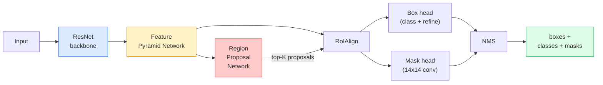

# Segmentacja instancji — maska R-CNN

> Dodaj małą gałąź maski do szybszego detektora R-CNN i uzyskaj segmentację instancji. Najtrudniejszą częścią jest RoIAlign i jest trudniejsza, niż się wydaje.

**Typ:** Buduj i ucz się
**Języki:** Python
**Wymagania wstępne:** Faza 4 Lekcja 06 (YOLO), Faza 4 Lekcja 07 (U-Net)
**Czas:** ~75 minut

## Cele nauczania

- Śledź architekturę maski R-CNN od początku do końca: szkielet, FPN, RPN, RoIAlign, głowica skrzynkowa, głowica maski
- Zaimplementuj RoIAlign od zera i wyjaśnij, dlaczego RoIPool nie jest już używany
- Użyj wstępnie wytrenowanego modelu torchvision `maskrcnn_resnet50_fpn_v2` do masek instancji o jakości produkcyjnej i poprawnie odczytaj jego format wyjściowy
- Dostosuj maskę R-CNN na małym, niestandardowym zestawie danych, wymieniając głowice skrzynki i maski i utrzymując zamrożony szkielet

## Problem

Semantyczna segmentacja daje jedną maskę na klasę. Segmentacja instancji daje jedną maskę na obiekt, nawet jeśli dwa obiekty mają tę samą klasę. Liczenie osób, śledzenie klatek i mierzenie obiektów (obramowanie każdej cegły w ścianie, każda komórka na obrazie mikroskopowym) wymaga segmentacji instancji.

Maska R-CNN (He i in., 2017) rozwiązała ten problem, zmieniając segmentację instancji na zasadę wykrywania plus maski. Projekt był tak przejrzysty, że przez następne pięć lat prawie każdy dokument segmentacji instancji był wariantem Mask R-CNN, a implementacja torchvision nadal jest domyślnym standardem produkcyjnym dla małych i średnich zbiorów danych.

Trudnym problemem inżynierskim jest próbkowanie: jak wyciąć z pola propozycji obszar obiektów o stałym rozmiarze, którego rogi nie pokrywają się z granicami pikseli? Pomyłka kosztuje wszędzie dziesiąte części punktu mAP. Rozwiązaniem jest RoIAlign.

## Koncepcja

### Architektura



Pięć elementów do zrozumienia:

1. **Backbone** — ResNet-50 lub ResNet-101 przeszkolony w ImageNet. Tworzy hierarchię map obiektów w krokach 4, 8, 16, 32.
2. **FPN (Feature Pyramid Network)** — połączenia od góry do dołu + połączenia boczne, które zapewniają każdemu kanałowi poziomu C funkcje bogate semantycznie. Wykrywanie sprawdza poziom FPN pasujący do rozmiaru obiektu.
3. **RPN (Region Proposal Network)** — mały konwerter, który przy każdej pozycji zakotwiczenia przewiduje „czy jest tu obiekt?” i „Jak udoskonalić pudełko?”. Tworzy ~1000 propozycji na obraz.
4. **RoIAlign** — pobiera próbki o stałym rozmiarze (np. 7x7) z dowolnego pudełka na dowolnym poziomie FPN. Próbkowanie dwuliniowe, bez kwantyzacji.
5. **Heads** — dwuwarstwowy box head, który udoskonala pudełko i wybiera klasę, plus mały head conv, który generuje binarną maskę `28x28` dla każdej propozycji.

### Dlaczego RoIAlign, a nie RoIPool

Oryginalny Fast R-CNN korzystał z RoIPool, który dzieli pole propozycji na siatkę, pobiera maksymalną liczbę funkcji z każdej komórki i zaokrągla wszystkie współrzędne do liczb całkowitych. To zaokrąglenie powoduje przesunięcie mapy obiektów w stosunku do współrzędnych pikseli wejściowych aż do pełnego piksela mapy obiektów — jest to małe na obrazie o wymiarach 224 x 224, a katastrofalne w przypadku mapy obiektów o kroku 32.

```
RoIPool:
  box (34.7, 51.3, 98.2, 142.9)
  round -> (34, 51, 98, 142)
  split grid -> round each cell boundary
  misalignment accumulates at every step

RoIAlign:
  box (34.7, 51.3, 98.2, 142.9)
  sample at exact float coordinates using bilinear interpolation
  no rounding anywhere
```

RoIAlign podnosi maskę AP o 3-4 punkty na COCO za darmo. Używa go teraz każdy detektor, któremu zależy na lokalizacji — zarówno YOLOv7 seg, RT-DETR, jak i Mask2Former.

### RPN w jednym akapicie

W każdym miejscu mapy obiektów umieść K skrzynek kontrolnych o różnych rozmiarach i kształtach. Przewiduj wynik obiektywności dla każdej kotwicy i przesunięcie regresji, aby zamienić kotwicę w lepiej dopasowane pudełko. Zachowaj ~1000 najlepszych pudełek według wyniku, zastosuj NMS przy IoU 0,7 i przekaż ocalałym głowom. RPN jest trenowany przy użyciu własnej mini-straty — tej samej struktury co strata YOLO z lekcji 6, tylko z dwiema klasami (obiekt/brak obiektu).

### Głowa maski

Dla każdej propozycji (po RoIAlign) głowica maski to mały FCN: cztery konwersje 3x3, deconv 2x, końcowa konwersja 1x1, która tworzy kanały wyjściowe `num_classes` w rozdzielczości `28x28`. Zachowany zostanie tylko kanał odpowiadający przewidywanej klasie; inne są ignorowane. To oddziela przewidywanie maski od klasyfikacji.

Zwiększ próbkę maski 28x28 do oryginalnego rozmiaru w pikselach propozycji, aby uzyskać ostateczną maskę binarną.

### Straty

Maska R-CNN ma zsumowane cztery straty:

```
L = L_rpn_cls + L_rpn_box + L_box_cls + L_box_reg + L_mask
```

- `L_rpn_cls`, `L_rpn_box` — obiektywność + regresja pudełkowa dla propozycji RPN.
- `L_box_cls` — entropia krzyżowa po klasach (C+1) (w tym tle) w klasyfikatorze nagłówka.
- `L_box_reg` — wygładzenie L1 na udoskonaleniu skrzynki głowicy.
- `L_mask` — binarna entropia krzyżowa na piksel na wyjściu maski 28x28.

Każda strata ma swoją domyślną wagę; implementacja torchvision udostępnia je jako argumenty konstruktora.

###Format wyjściowy

`torchvision.models.detection.maskrcnn_resnet50_fpn_v2` zwraca listę słowników, po jednym na obraz:

```
{
    "boxes":  (N, 4) in (x1, y1, x2, y2) pixel coordinates,
    "labels": (N,) class IDs, 0 = background so indices are 1-based,
    "scores": (N,) confidence scores,
    "masks":  (N, 1, H, W) float masks in [0, 1] — threshold at 0.5 for binary,
}
```

Maska ma już pełną rozdzielczość obrazu. Wyjście głowicy 28x28 zostało wewnętrznie upsamplowane.

## Zbuduj to

### Krok 1: RoIAlign od zera

To jedyny element Maski R-CNN, który łatwiej zrozumieć jako kod niż jako prozę.

```python
import torch
import torch.nn.functional as F

def roi_align_single(feature, box, output_size=7, spatial_scale=1 / 16.0):
    """
    feature: (C, H, W) single-image feature map
    box: (x1, y1, x2, y2) in original image pixel coordinates
    output_size: side of the output grid (7 for box head, 14 for mask head)
    spatial_scale: reciprocal of the feature map stride
    """
    C, H, W = feature.shape
    x1, y1, x2, y2 = [c * spatial_scale - 0.5 for c in box]
    bin_w = (x2 - x1) / output_size
    bin_h = (y2 - y1) / output_size

    grid_y = torch.linspace(y1 + bin_h / 2, y2 - bin_h / 2, output_size)
    grid_x = torch.linspace(x1 + bin_w / 2, x2 - bin_w / 2, output_size)
    yy, xx = torch.meshgrid(grid_y, grid_x, indexing="ij")

    gx = 2 * (xx + 0.5) / W - 1
    gy = 2 * (yy + 0.5) / H - 1
    grid = torch.stack([gx, gy], dim=-1).unsqueeze(0)
    sampled = F.grid_sample(feature.unsqueeze(0), grid, mode="bilinear",
                            align_corners=False)
    return sampled.squeeze(0)
```

Każda liczba znajduje się w pozycji próbkowanej dwuliniowo. Bez zaokrąglania, bez kwantyzacji, bez opadających gradientów.

### Krok 2: Porównaj z RoIAlign firmy Torchvision

```python
from torchvision.ops import roi_align

feature = torch.randn(1, 16, 50, 50)
boxes = torch.tensor([[0, 10, 20, 100, 90]], dtype=torch.float32)  # (batch_idx, x1, y1, x2, y2)

ours = roi_align_single(feature[0], boxes[0, 1:].tolist(), output_size=7, spatial_scale=1/4)
theirs = roi_align(feature, boxes, output_size=(7, 7), spatial_scale=1/4, sampling_ratio=1, aligned=True)[0]

print(f"shape ours:   {tuple(ours.shape)}")
print(f"shape theirs: {tuple(theirs.shape)}")
print(f"max|diff|:    {(ours - theirs).abs().max().item():.3e}")
```

W przypadku `sampling_ratio=1` i `aligned=True` oba pasują do `1e-5`.

### Krok 3: Załaduj wstępnie przeszkoloną maskę R-CNN

```python
import torch
from torchvision.models.detection import maskrcnn_resnet50_fpn_v2, MaskRCNN_ResNet50_FPN_V2_Weights

model = maskrcnn_resnet50_fpn_v2(weights=MaskRCNN_ResNet50_FPN_V2_Weights.DEFAULT)
model.eval()
print(f"params: {sum(p.numel() for p in model.parameters()):,}")
print(f"classes (including background): {len(model.roi_heads.box_predictor.cls_score.out_features * [0])}")
```

Parametry 46M, 91 klas (COCO). Pierwsza klasa (id 0) to tło; wszystko, co faktycznie wykrywa model, zaczyna się od identyfikatora 1.

### Krok 4: Uruchom wnioskowanie

```python
with torch.no_grad():
    x = torch.randn(3, 400, 600)
    predictions = model([x])
p = predictions[0]
print(f"boxes:  {tuple(p['boxes'].shape)}")
print(f"labels: {tuple(p['labels'].shape)}")
print(f"scores: {tuple(p['scores'].shape)}")
print(f"masks:  {tuple(p['masks'].shape)}")
```

Tensor maski ma kształt `(N, 1, H, W)`. Próg na poziomie 0,5, aby uzyskać maskę binarną na obiekt:

```python
binary_masks = (p['masks'] > 0.5).squeeze(1)  # (N, H, W) boolean
```

### Krok 5: Zamień głowy, aby uzyskać niestandardową liczbę klas

Typowy przepis na dostrajanie: ponowne wykorzystanie szkieletu, FPN i RPN; wymienić dwie głowice klasyfikatora.

```python
from torchvision.models.detection.faster_rcnn import FastRCNNPredictor
from torchvision.models.detection.mask_rcnn import MaskRCNNPredictor

def build_custom_maskrcnn(num_classes):
    model = maskrcnn_resnet50_fpn_v2(weights=MaskRCNN_ResNet50_FPN_V2_Weights.DEFAULT)
    in_features = model.roi_heads.box_predictor.cls_score.in_features
    model.roi_heads.box_predictor = FastRCNNPredictor(in_features, num_classes)
    in_features_mask = model.roi_heads.mask_predictor.conv5_mask.in_channels
    hidden_layer = 256
    model.roi_heads.mask_predictor = MaskRCNNPredictor(in_features_mask, hidden_layer, num_classes)
    return model

custom = build_custom_maskrcnn(num_classes=5)
print(f"custom cls_score.out_features: {custom.roi_heads.box_predictor.cls_score.out_features}")
```

`num_classes` musi zawierać klasę tła, dlatego zbiór danych zawierający 4 klasy obiektu używa klasy `num_classes=5`.

### Krok 6: Zamroź to, co nie wymaga szkolenia

W przypadku małych zestawów danych zamroź szkielet i FPN. Tylko obiektywność RPN + regresja i dwie głowy się uczą.

```python
def freeze_backbone_and_fpn(model):
    # torchvision Mask R-CNN packs the FPN inside `model.backbone` (as
    # `model.backbone.fpn`), so iterating `model.backbone.parameters()` covers
    # both the ResNet feature layers and the FPN lateral/output convs.
    for p in model.backbone.parameters():
        p.requires_grad = False
    return model

custom = freeze_backbone_and_fpn(custom)
trainable = sum(p.numel() for p in custom.parameters() if p.requires_grad)
print(f"trainable after freeze: {trainable:,}")
```

W przypadku zbiorów danych zawierających 500 obrazów jest to różnica między zbieżnością a nadmiernym dopasowaniem.

## Użyj tego

Pełna pętla szkoleniowa dla Mask R-CNN w technologii Torchvision składa się z 40 linii i nie zmienia się znacząco pomiędzy zadaniami — zamień zbiory danych i gotowe.

```python
def train_step(model, images, targets, optimizer):
    model.train()
    loss_dict = model(images, targets)
    losses = sum(loss for loss in loss_dict.values())
    optimizer.zero_grad()
    losses.backward()
    optimizer.step()
    return {k: v.item() for k, v in loss_dict.items()}
```

Lista `targets` musi zawierać przypisy dotyczące poszczególnych obrazów zawierające `boxes`, `labels` i `masks` (jako `(num_instances, H, W)` tensory binarne). Model zwraca informację o czterech stratach podczas uczenia i listę przewidywań podczas oceny, wpisaną w `model.training`.

Ewaluator `pycocotools` generuje mAP@IoU=0,5:0,95 zarówno dla skrzynek, jak i masek; potrzebne są obie liczby, aby wiedzieć, czy wąskim gardłem jest głowica skrzynki czy głowica maski.

## Wyślij to

Ta lekcja daje:

- `outputs/prompt-instance-vs-semantic-router.md` — podpowiedź, która zadaje trzy pytania i wybiera instancję, semantykę, panoptykę oraz dokładny model na początek.
- `outputs/skill-mask-rcnn-head-swapper.md` — umiejętność generująca 10 linii kodu do zamiany głowic w dowolnym modelu detekcji wizyjnej, biorąc pod uwagę nowy `num_classes`.

## Ćwiczenia

1. **(Łatwe)** Sprawdź swoje RoIAlign względem `torchvision.ops.roi_align` na 100 losowych polach. Zgłoś maksymalną różnicę bezwzględną. Uruchom także RoIPool (zachowanie sprzed 2017 r.) i pokaż, że różni się on o ~1-2 piksele mapy obiektów na polach w pobliżu granicy.
2. **(Średni)** Dostosuj `maskrcnn_resnet50_fpn_v2` na niestandardowym zestawie danych składającym się z 50 obrazów (dowolne dwie klasy: balony, ryba, dziura, logo). Zamroź szkielet, trenuj przez 20 epok, zgłoś maskę AP@0.5.
3. **(Twardy)** Wymień głowicę maski Mask R-CNN na taką, która przewiduje rozmiar 56x56 zamiast 28x28. Zmierz mAP@IoU=0,75 przed i po. Wyjaśnij, dlaczego wzmocnienie (lub jego brak) odpowiada oczekiwanemu kompromisowi między precyzją granic a pamięcią.

## Kluczowe terminy

| Termin | Co ludzie mówią | Co to właściwie oznacza |
|------|----------------|----------------------|
| Maska R-CNN | „Wykrywanie plus maski” | Szybszy R-CNN + mała głowica FCN, która przewiduje maskę 28x28 na propozycję na klasę |
| FPN | „Piramida funkcji” | Połączenia od góry do dołu + boczne, które zapewniają każdemu krokowi kanały na poziomie C z funkcjami bogatymi semantycznie |
| RPN | „Proponujący region” | Mała głowica konwertująca, która generuje ~1000 propozycji obiektów/braków obiektów na obraz |
| RoIAlign | „Uprawa bez zaokrągleń” | Dwuliniowo próbkuje siatkę obiektów o stałym rozmiarze z dowolnego pola współrzędnych zmiennoprzecinkowych |
| RoIPool | „Uprawy sprzed 2017 r.” | Ten sam cel co RoIAlign, ale zaokrągla współrzędne prostokąta; przestarzałe |
| Maska AP | „MAPA instancji” | Średnia precyzja obliczona przy użyciu maski IoU zamiast IoU skrzynki; metryka segmentacji instancji COCO |
| Głowa maski binarnej | „Maska na klasę” | Przewiduje jedną maskę binarną na klasę dla każdej propozycji; zachowywany jest tylko kanał przewidywanej klasy |
| Zajęcia w tle | „Klasa 0” | Przechwytująca klasa „bez obiektu”; indeksy dla klas rzeczywistych zaczynają się od 1 |

## Dalsze czytanie

- [Mask R-CNN (He et al., 2017)](https://arxiv.org/abs/1703.06870) – artykuł; Sekcja 3 dotycząca RoIAlign jest lekturą krytyczną
- [FPN: Feature Pyramid Networks (Lin et al., 2017)](https://arxiv.org/abs/1612.03144) – artykuł FPN; wykorzystuje go każdy nowoczesny detektor
– [samouczek dotyczący maski Torchvision R-CNN](https://pytorch.org/tutorials/intermediate/torchvision_tutorial.html) — odniesienie do pętli dostrajania
- [Zoo modelu Detectron2](https://github.com/facebookresearch/detectron2/blob/main/MODEL_ZOO.md) — implementacje produkcyjne z wyszkolonymi wagami dla prawie każdego wariantu wykrywania i segmentacji