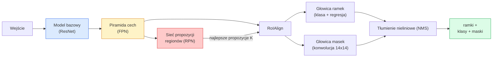

# Segmentacja instancyjna — Mask R-CNN

> Architektura Mask R-CNN rozbudowuje detektor Faster R-CNN o dodatkową gałąź predykcji masek (mask branch). Jej kluczowym i najbardziej wymagającym elementem jest warstwa RoIAlign.

**Typ:** Implementacja i analiza
**Języki:** Python
**Wymagania wstępne:** Faza 4, lekcja 06 (YOLO), Faza 4, lekcja 07 (U-Net)
**Czas:** ~75 minut

## Cele nauczania

- Zrozumienie pełnej architektury Mask R-CNN krok po kroku: model bazowy (backbone), piramida cech FPN, moduł RPN, RoIAlign, głowica ramek (box head) oraz głowica masek (mask head).
- Zaimplementowanie operacji RoIAlign od podstaw i wyjaśnienie, dlaczego wyparła ona wcześniejszą metodę RoIPool.
- Wykorzystanie gotowego, pre-trenowanego modelu `maskrcnn_resnet50_fpn_v2` z biblioteki `torchvision` do generowania masek o jakości produkcyjnej oraz poprawna interpretacja jego formatu wyjściowego.
- Dostrojenie (fine-tuning) modelu Mask R-CNN na małym, niestandardowym zbiorze danych poprzez podmianę głowic klasyfikacji, regresji i masek przy zamrożonym modelu bazowym.

## Problem

Segmentacja semantyczna generuje jedną maskę dla danej klasy. Segmentacja instancyjna natomiast przypisuje odrębną maskę do każdego pojedynczego obiektu z osobna, nawet jeśli należą one do tej samej kategorii. Zadania takie jak zliczanie osób w tłumie, śledzenie obiektów na nagraniach wideo czy analiza ilościowa (np. precyzyjne wyznaczenie obrysu każdej cegły w murze lub pojedynczej komórki na obrazie mikroskopowym) wymagają segmentacji instancyjnej.

Model Mask R-CNN (He et al., 2017) rozwiązał ten problem, wprowadzając podejście „detekcja + maska”. Koncepcja ta okazała się tak skuteczna, że przez kolejne lata większość nowych architektur segmentacji instancyjnej stanowiła wariacje Mask R-CNN, a jej implementacja w `torchvision` wciąż stanowi standard wdrożeniowy dla małych i średnich zbiorów danych.

Trudność inżynieryjna tkwi w próbkowaniu: w jaki sposób wyciąć z mapy cech obszar o stałym rozmiarze odpowiadający zaproponowanej ramce (region proposal), gdy jej współrzędne są zmiennoprzecinkowe (nie pokrywają się idealnie z siatką pikseli)? Każda niedokładność i błędy zaokrągleń obniżają metrykę mAP. Rozwiązaniem tego problemu jest operacja RoIAlign.

## Koncepcja

### Architektura



Pięć głównych komponentów architektury:

1. **Backbone (Model bazowy)** — sieć ResNet-50 lub ResNet-101 pre-trenowana na zbiorze ImageNet. Tworzy hierarchię map cech ze współczynnikami redukcji przestrzennej (strides) równymi 4, 8, 16, 32.
2. **FPN (Feature Pyramid Network)** — połączenia zstępujące (top-down) oraz boczne (lateral), które zasilają mapy cech o niższej rozdzielczości bogatym kontekstem semantycznym. Detekcja obiektu odbywa się na poziomie piramidy dopasowanym do jego skali przestrzennej.
3. **RPN (Region Proposal Network)** — mała sieć konwolucyjna, która dla każdego punktu kotwiczenia (anchor point) przewiduje prawdopodobieństwo bycia obiektem (objectness score) oraz przesunięcia ramki (bounding box regressions). Generuje około 1000 propozycji (region proposals) na obraz.
4. **RoIAlign** — wycina obszar o stałym rozmiarze (np. 7x7) dla dowolnej ramki z odpowiedniego poziomu piramidy FPN. Wykorzystuje interpolację dwuliniową bez kwantyzacji współrzędnych.
5. **Heads (Głowice)** — dwuwarstwowa głowica ramek (box head), która poprawia współrzędne ramki i klasyfikuje obiekt, oraz głowica masek (mask head) składająca się z warstw splotowych, generująca binarną maskę o rozmiarze `28x28` dla każdej propozycji.

### Dlaczego RoIAlign, a nie RoIPool

Wczesne detektory (np. Fast R-CNN) wykorzystywały warstwę RoIPool. Dzieliła ona obszar propozycji na siatkę, wyciągała największą wartość (MaxPooling) z każdej komórki i zaokrąglała wszystkie współrzędne do liczb całkowitych. Te zaokrąglenia powodują przesunięcie (misalignment) między mapą cech a oryginalnym obrazem. Choć na obrazie o wymiarach 224x224 przesunięcie może wydawać się niewielkie, staje się ono katastrofalne przy kroku redukcji (stride) równym 32.

```
RoIPool:
  ramka (34.7, 51.3, 98.2, 142.9)
  zaokrąglenie -> (34, 51, 98, 142)
  podział siatki -> zaokrąglenie granic komórek
  przesunięcie (misalignment) kumuluje się na każdym etapie

RoIAlign:
  ramka (34.7, 51.3, 98.2, 142.9)
  próbkowanie na dokładnych współrzędnych zmiennoprzecinkowych z użyciem interpolacji dwuliniowej
  brak zaokrągleń na jakimkolwiek etapie
```

Zastosowanie RoIAlign bez żadnych dodatkowych zmian zwiększa metrykę AP maski o 3–4 punkty procentowe na zbiorze COCO. Z tego powodu operacja ta stała się standardem w nowoczesnych detektorach (m.in. YOLOv7-seg, RT-DETR czy Mask2Former).

### RPN (Region Proposal Network) w pigułce

W każdym punkcie mapy cech generowanych jest $K$ ramek kotwiczących (anchor boxes) o różnych proporcjach i skalach. Sieć przewiduje prawdopodobieństwo bycia obiektem (objectness score) oraz przesunięcia (offsety) regresji dla każdej kotwicy. Na koniec wybieranych jest około 1000 najlepszych ramek na podstawie ich wyniku, aplikowana jest procedura NMS (Non-Maximum Suppression) przy progu IoU równym 0.7, a pozostałe propozycje przekazywane są do dalszych głowic. Moduł RPN trenowany jest z użyciem własnej funkcji straty, zbliżonej strukturalnie do straty detektora YOLO.

### Głowica masek (Mask Head)

Dla każdej propozycji (po wycięciu cech przez RoIAlign) głowica masek działa jak mała sieć w pełni konwolucyjna (FCN): cztery warstwy splotowe 3x3, warstwa splotu transponowanego powiększająca obraz dwukrotnie (deconv 2x) oraz końcowy splot 1x1 mapujący kanały na liczbę klas (`num_classes`) przy rozdzielczości `28x28`. W procesie uczenia i predykcji brany jest pod uwagę wyłącznie kanał odpowiadający sklasyfikowanej kategorii, co oddziela zadanie segmentacji od klasyfikacji obiektów.

Ostateczna maska binarna powstaje poprzez przeskalowanie w górę (upsampling) wyjściowej maski 28x28 do oryginalnych wymiarów ramki otaczającej.

### Funkcje strat

Całkowity koszt treningu Mask R-CNN składa się z pięciu składowych strat:

```
L = L_rpn_cls + L_rpn_box + L_box_cls + L_box_reg + L_mask
```

- `L_rpn_cls`, `L_rpn_box` — strata klasyfikacji i regresji ramek dla modułu propozycji RPN.
- `L_box_cls` — klasyczna entropia krzyżowa po $C+1$ klasach (wliczając tło) dla klasyfikatora ramek.
- `L_box_reg` — wygładzona strata L1 (Smooth L1) dla regresji ramek otaczających.
- `L_mask` — binarna entropia krzyżowa (BCE) liczona dla każdego piksela maski o wymiarach 28x28.

Każda z tych strat ma swoją domyślną wagę, a implementacja w `torchvision` pozwala na ich konfigurację poprzez parametry konstruktora modelu.

### Format wyjściowy

Model `torchvision.models.detection.maskrcnn_resnet50_fpn_v2` w trybie ewaluacji zwraca listę słowników (po jednym słowniku na każdy obraz wejściowy):

```python
{
    "boxes":  tensor (N, 4) współrzędnych ramek (x1, y1, x2, y2) w pikselach,
    "labels": tensor (N,) identyfikatorów klas (gdzie 0 oznacza tło, więc indeksy klas właściwych zaczynają się od 1),
    "scores": tensor (N,) współczynników pewności (confidence scores),
    "masks":  tensor (N, 1, H, W) wartości zmiennoprzecinkowych z zakresu [0, 1] (zastosuj próg 0.5, aby otrzymać maski binarne).
}
```

Maska wyjściowa ma już pełną rozdzielczość oryginalnego obrazu – operacja upsamplingu z formatu 28x28 odbywa się automatycznie wewnątrz modelu.

## Implementacja krok po kroku

### Krok 1: Implementacja RoIAlign od podstaw

To kluczowy element Mask R-CNN, który najłatwiej zrozumieć analizując kod źródłowy.

```python
import torch
import torch.nn.functional as F

def roi_align_single(feature, box, output_size=7, spatial_scale=1 / 16.0):
    """
    feature: (C, H, W) mapa cech dla pojedynczego obrazu
    box: (x1, y1, x2, y2) współrzędne ramki w pikselach oryginalnego obrazu
    output_size: wymiar boku siatki wyjściowej (7 dla głowicy ramek, 14 dla głowicy masek)
    spatial_scale: odwrotność kroku (stride) mapy cech (np. 1/16)
    """
    C, H, W = feature.shape
    x1, y1, x2, y2 = [c * spatial_scale - 0.5 for c in box]
    bin_w = (x2 - x1) / output_size
    bin_h = (y2 - y1) / output_size

    grid_y = torch.linspace(y1 + bin_h / 2, y2 - bin_h / 2, output_size)
    grid_x = torch.linspace(x1 + bin_w / 2, x2 - bin_w / 2, output_size)
    yy, xx = torch.meshgrid(grid_y, grid_x, indexing="ij")

    gx = 2 * (xx + 0.5) / W - 1
    gy = 2 * (yy + 0.5) / H - 1
    grid = torch.stack([gx, gy], dim=-1).unsqueeze(0)
    sampled = F.grid_sample(feature.unsqueeze(0), grid, mode="bilinear",
                            align_corners=False)
    return sampled.squeeze(0)
```

Każda wartość cechy jest pobierana w dokładnej pozycji zmiennoprzecinkowej za pomocą interpolacji dwuliniowej, bez zaokrągleń i straty gradientów.

### Krok 2: Porównanie z RoIAlign z biblioteki Torchvision

```python
from torchvision.ops import roi_align

feature = torch.randn(1, 16, 50, 50)
boxes = torch.tensor([[0, 10, 20, 100, 90]], dtype=torch.float32)  # (batch_idx, x1, y1, x2, y2)

ours = roi_align_single(feature[0], boxes[0, 1:].tolist(), output_size=7, spatial_scale=1/4)
theirs = roi_align(feature, boxes, output_size=(7, 7), spatial_scale=1/4, sampling_ratio=1, aligned=True)[0]

print(f"Kształt (nasz):  {tuple(ours.shape)}")
print(f"Kształt (torch): {tuple(theirs.shape)}")
print(f"Max różnica:     {(ours - theirs).abs().max().item():.3e}")
```

Przy konfiguracji `sampling_ratio=1` oraz `aligned=True` obie wersje dają identyczny wynik z dokładnością do `1e-5`.

### Krok 3: Załadowanie pre-trenowanego modelu Mask R-CNN

```python
import torch
from torchvision.models.detection import maskrcnn_resnet50_fpn_v2, MaskRCNN_ResNet50_FPN_V2_Weights

model = maskrcnn_resnet50_fpn_v2(weights=MaskRCNN_ResNet50_FPN_V2_Weights.DEFAULT)
model.eval()
print(f"Liczba parametrów: {sum(p.numel() for p in model.parameters()):,}")
print(f"Liczba klas wyjściowych (z tłem): {model.roi_heads.box_predictor.cls_score.out_features}")
```

Model posiada około 46 milionów parametrów i jest wyszkolony na 91 klasach zbioru COCO. Klasa o indeksie 0 reprezentuje tło, a wykrywane obiekty mają indeksy $\ge 1$.

### Krok 4: Wnioskowanie (Inference)

```python
with torch.no_grad():
    x = torch.randn(3, 400, 600)  # Kanały, Wysokość, Szerokość
    predictions = model([x])
p = predictions[0]
print(f"Ramki (boxes):   {tuple(p['boxes'].shape)}")
print(f"Etykiety (labels): {tuple(p['labels'].shape)}")
print(f"Pewność (scores):  {tuple(p['scores'].shape)}")
print(f"Maski (masks):   {tuple(p['masks'].shape)}")
```

Uzyskanie binarnej maski dla każdego wykrytego obiektu wymaga nałożenia odpowiedniego progu (np. 0.5):

```python
binary_masks = (p['masks'] > 0.5).squeeze(1)  # Kształt (N, H, W), typ bool
```

### Krok 5: Zamiana głowic dla niestandardowej liczby klas

Typowy scenariusz dostrajania (fine-tuning) polega na zachowaniu wag modelu bazowego, FPN oraz RPN, przy jednoczesnej podmianie głowicy klasyfikacji ramek i głowicy masek.

```python
from torchvision.models.detection.faster_rcnn import FastRCNNPredictor
from torchvision.models.detection.mask_rcnn import MaskRCNNPredictor

def build_custom_maskrcnn(num_classes):
    model = maskrcnn_resnet50_fpn_v2(weights=MaskRCNN_ResNet50_FPN_V2_Weights.DEFAULT)
    in_features = model.roi_heads.box_predictor.cls_score.in_features
    # Podmiana głowicy klasyfikacji i regresji ramek
    model.roi_heads.box_predictor = FastRCNNPredictor(in_features, num_classes)
    
    # Podmiana głowicy masek
    in_features_mask = model.roi_heads.mask_predictor.conv5_mask.in_channels
    hidden_layer = 256
    model.roi_heads.mask_predictor = MaskRCNNPredictor(in_features_mask, hidden_layer, num_classes)
    return model

custom = build_custom_maskrcnn(num_classes=5)
print(f"Nowa liczba klas wyjściowych: {custom.roi_heads.box_predictor.cls_score.out_features}")
```

Pamiętaj, że parametr `num_classes` musi uwzględniać klasę tła (np. dla zbioru z 4 klasami obiektów podajemy `num_classes=5`).

### Krok 6: Zamrażanie wag modelu bazowego

W przypadku pracy z niewielkimi zbiorami danych należy zamrozić wagi kodera (backbone) i piramidy FPN, umożliwiając uczenie wyłącznie głowicom oraz modułowi RPN.

```python
def freeze_backbone_and_fpn(model):
    # W implementacji torchvision FPN jest zintegrowany z koderem (jako model.backbone.fpn).
    # Zablokowanie parametrów w model.backbone zamraża zarówno warstwy ResNet, jak i sploty FPN.
    for p in model.backbone.parameters():
        p.requires_grad = False
    return model

custom = freeze_backbone_and_fpn(custom)
trainable = sum(p.numel() for p in custom.parameters() if p.requires_grad)
print(f"Parametry trenowalne po zamrożeniu: {trainable:,}")
```

Dla małych zbiorów danych (np. 500 zdjęć) zamrożenie wag jest kluczowe, aby zapobiec przeuczeniu (overfitting).

## Trening modelu

Podstawowa pętla treningowa dla modeli detekcji w bibliotece `torchvision` jest zwięzła i uniwersalna:

```python
def train_step(model, images, targets, optimizer):
    model.train()
    loss_dict = model(images, targets)
    losses = sum(loss for loss in loss_dict.values())
    optimizer.zero_grad()
    losses.backward()
    optimizer.step()
    return {k: v.item() for k, v in loss_dict.items()}
```

Struktura danych wejściowych `targets` to lista słowników (jeden na każdy obraz), zawierająca klucze `boxes`, `labels` oraz `masks` (jako tensory binarne o kształcie `(num_instances, H, W)`). Model w trybie treningowym automatycznie zwraca słownik ze składowymi strat, a w trybie ewaluacji listę predykcji.

Do ewaluacji zaleca się użycie oficjalnego narzędzia `pycocotools`, które oblicza metrykę mAP@IoU=0.5:0.95 zarówno dla ramek otaczających (bbox AP), jak i masek (mask AP). Pozwala to precyzyjnie ocenić, która z głowic wymaga ewentualnej poprawy.

## Narzędzia pomocnicze

W ramach tej lekcji otrzymujesz:

- `outputs/prompt-instance-vs-semantic-router.md` – prompt ułatwiający dobór typu segmentacji (semantyczna, instancyjna, panoptyczna) oraz rekomendujący optymalny model bazowy na start.
- `outputs/skill-mask-rcnn-head-swapper.md` – skrypt generujący kod do podmiany głowic w dowolnym modelu detekcji wizyjnej dla nowej liczby klas.

## Ćwiczenia

1. **(Łatwe)** Przetestuj własną implementację `roi_align_single` w porównaniu do `torchvision.ops.roi_align` na 100 losowych ramkach i oblicz maksymalną różnicę bezwzględną. Uruchom dodatkowo operację `RoIPool` i pokaż, że błędy zaokrągleń współrzędnych powodują przesunięcia rzędu 1–2 pikseli mapy cech dla ramek leżących blisko krawędzi.
2. **(Średnie)** Dostrój model `maskrcnn_resnet50_fpn_v2` na małym zbiorze danych (np. 50 obrazów z dwiema klasami obiektów). Zamroź koder (backbone) i trenuj model przez 20 epok, po czym zaraportuj wartość metryki mask AP@0.5.
3. **(Trudne)** Zmodyfikuj głowicę masek (mask head) tak, by generowała maski o rozdzielczości 56x56 zamiast domyślnych 28x28. Porównaj metrykę mAP@IoU=0.75 przed i po zmianie. Wyjaśnij, jak uzyskana zmiana jakości ma się do kompromisu między precyzją krawędzi a zużyciem pamięci VRAM.

## Kluczowe terminy

| Termin | Potoczne określenie | Co to oznacza w rzeczywistości |
|------|----------------|----------------------|
| Mask R-CNN | „Detekcja plus maski” | Rozbudowa detektora Faster R-CNN o małą głowicę FCN, która przewiduje binarną maskę o rozmiarze 28x28 dla każdej propozycji regionu osobno dla każdej klasy. |
| FPN | „Piramida cech” | Feature Pyramid Network – sieć łącząca cechy ze ścieżki zstępującej (top-down) i bocznej (lateral), co pozwala uzyskać bogate semantycznie mapy cech na różnych poziomach skali. |
| RPN | „Generator propozycji” | Region Proposal Network – mała sieć splotowa generująca około 1000 propozycji ramki (obszarów kandydujących do bycia obiektem) na jeden obraz. |
| RoIAlign | „Próbkowanie bez zaokrągleń” | Operacja wycinania cech bez kwantyzacji – próbkuje wartości z mapy cech za pomocą interpolacji dwuliniowej dla dowolnej ramki o współrzędnych zmiennoprzecinkowych. |
| RoIPool | „Próbkowanie z zaokrąglaniem” | Starsza operacja wycinania cech, która zaokrąglała zmiennoprzecinkowe współrzędne ramek do siatki pikseli; obecnie przestarzała ze względu na błędy przesunięcia. |
| Maska AP | „MAP instancji” | Średnia precyzja (AP) obliczana na podstawie współczynnika IoU samych masek (a nie ramek otaczających); standardowa metryka w COCO. |
| Głowica maski binarnej | „Maska na klasę” | Głowica generująca binarne maski dla każdej klasy osobno; przy ostatecznym wnioskowaniu brany jest pod uwagę wyłącznie kanał sklasyfikowanej kategorii. |
| Klasa tła | „Klasa 0” | Klasa tła (background class) – reprezentuje brak obiektu; indeksowana jako 0, podczas gdy właściwe klasy zaczynają się od 1. |

## Dalsze czytanie

- [Mask R-CNN (He et al., 2017)](https://arxiv.org/abs/1703.06870) — oryginalny artykuł naukowy; sekcja 3 dotycząca RoIAlign jest lekturą obowiązkową.
- [FPN: Feature Pyramid Networks (Lin et al., 2017)](https://arxiv.org/abs/1612.03144) — publikacja wprowadzająca Feature Pyramid Networks; standardowy element współczesnych detektorów.
- [Samouczek Torchvision Mask R-CNN](https://pytorch.org/tutorials/intermediate/torchvision_tutorial.html) — oficjalne materiały dotyczące pętli dostrajania modeli.
- [Detectron2 Model Zoo](https://github.com/facebookresearch/detectron2/blob/main/MODEL_ZOO.md) — referencyjne implementacje z pre-trenowanymi wagami dla niemal każdego wariantu wykrywania i segmentacji obiektów.
