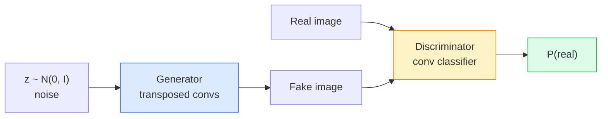
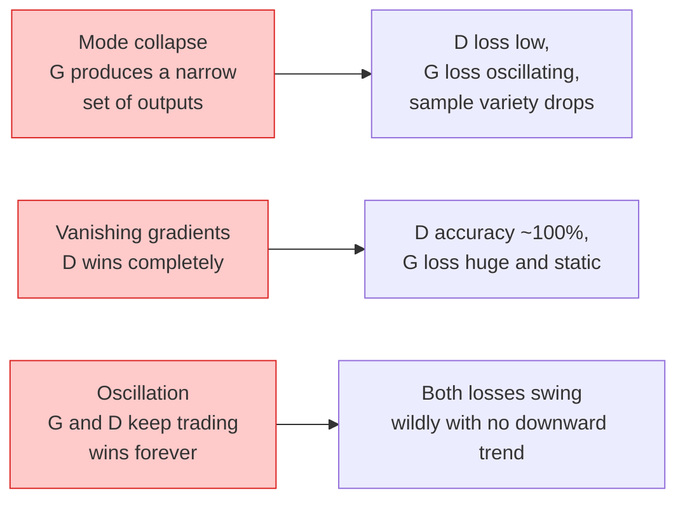

# Generowanie obrazu — sieci GAN

> GAN to dwie sieci neuronowe w ustalonej grze. Jeden rysuje, drugi krytykuje. Razem stają się lepsi, dopóki rysunki nie zmylą krytyka.

**Typ:** Kompilacja
**Języki:** Python
**Wymagania wstępne:** Faza 4, lekcja 03 (CNN), faza 3, lekcja 06 (optymalizatory), faza 3, lekcja 07 (regularyzacja)
**Czas:** ~75 minut

## Cele nauczania

- Wyjaśnij grę minimaksową pomiędzy generatorem a dyskryminatorem i dlaczego równowaga odpowiada p_model = p_data
- Zaimplementuj DCGAN w PyTorch i poproś go o wygenerowanie spójnych syntetycznych obrazów 32x32 w mniej niż 60 liniach
- Stabilizuj trening GAN za pomocą trzech standardowych trików: straty nienasycającej, normy widmowej, TTUR (reguła aktualizacji w dwóch skalach czasowych)
- Przeczytaj krzywe treningowe, które odróżniają zdrową konwergencję od załamania modów, oscylacji i dyskryminatora-całkowitego zwycięstwa

## Problem

Klasyfikacja uczy sieć mapowania obrazów na etykiety. Generacja odwraca problem: wypróbuj nowe obrazy, które wyglądają, jakby pochodziły z tej samej dystrybucji. Nie ma „poprawnego” wyniku, z którym można porównać; istnieje tylko dystrybucja, którą chcesz naśladować.

Standardowe funkcje straty (MSE, entropia krzyżowa) nie są w stanie zmierzyć „czy ta próbka pochodzi z rozkładu rzeczywistego”. Minimalizowanie błędu na piksel daje rozmyte średnie, a nie realistyczne próbki. Przełomem było nauczenie się straty: wytrenowanie drugiej sieci, której zadaniem jest odróżnianie rzeczywistości od fałszerstwa i wykorzystanie jej oceny do uruchomienia generatora.

Sieci GAN (Goodfellow i in., 2014) zdefiniowały te ramy. Do 2018 roku StyleGAN produkował twarze o wymiarach 1024x1024, których nie można było odróżnić od fotografii. Od tego czasu tron ​​w kwestii jakości i sterowalności przejęły modele dyfuzji, ale każdy trik, który czyni dyfuzję praktyczną – wybory normalizacji, przestrzenie ukryte, straty cech – został po raz pierwszy zrozumiany w sieciach GAN.

## Koncepcja

### Dwie sieci



**Generator** G pobiera wektor szumu `z` i generuje obraz. **dyskryminator** D pobiera obraz i generuje pojedynczy skalar: prawdopodobieństwo, że obraz jest prawdziwy.

### Gra

G chce, żeby D się mylił. D chce mieć rację. Formalnie:

```
min_G max_D  E_x[log D(x)] + E_z[log(1 - D(G(z)))]
```

Czytaj od prawej do lewej: D maksymalizuje dokładność prawdziwych (`log D(real)`) i fałszywych (`log (1 - D(fake))`) obrazów. G minimalizuje dokładność D w przypadku podróbek — chce, aby wartość `D(G(z))` była wysoka.

Goodfellow udowodnił, że ten minimax ma globalną równowagę, gdzie `p_G = p_data`, D wszędzie daje wynik 0,5, a rozbieżność Jensena-Shannona między rozkładami wygenerowanymi i rzeczywistymi wynosi zero. Najtrudniejsza część to dotarcie tam.

### Strata nienasycająca

Powyższy formularz jest numerycznie niestabilny. Na początku szkolenia wartość `D(G(z))` jest bliska zeru dla każdej fałszywej wartości, więc `log(1 - D(G(z)))` ma zanikające gradienty względem G. Poprawka: odwróć stratę G.

```
L_D = -E_x[log D(x)] - E_z[log(1 - D(G(z)))]
L_G = -E_z[log D(G(z))]                          # non-saturating
```

Teraz, gdy `D(G(z))` jest bliski zeru, strata G jest duża, a jej gradient ma charakter informacyjny. Każdy nowoczesny GAN trenuje z tym wariantem.

### Reguły architektury DCGAN

Radford, Metz, Chintala (2015) zebrali lata nieudanych eksperymentów w pięć zasad, które zapewniają stabilność treningu GAN:

1. Zamień łączenie na konwersje krokowe (obie sieci).
2. Użyj normy wsadowej zarówno w generatorze, jak i dyskryminatorze, z wyjątkiem wyjścia G i wejścia D.
3. Usuń w pełni połączone warstwy z głębszych architektur.
4. G używa ReLU na wszystkich warstwach z wyjątkiem wyjścia (tanh dla wyjścia w [-1, 1]).
5. D używa LeakyReLU (nachylenie ujemne=0,2) na wszystkich warstwach.

Każdy nowoczesny GAN oparty na konwulsjach (StyleGAN, BigGAN, GigaGAN) nadal zaczyna od tych zasad i wymienia elementy pojedynczo.

### Tryby awarii i ich sygnatury



- **Załamanie trybu**: G znajduje jeden obraz, który oszukuje D i generuje tylko ten obraz. Poprawka: dodaj rozróżnienie minipartii, normę widmową lub warunkowanie etykiety.
- **Rozróżniacz wygrywa**: D staje się zbyt silny zbyt szybko, gradienty G znikają. Poprawka: mniejsze D, niższa szybkość uczenia się D lub zastosuj wygładzanie etykiet na prawdziwych etykietach.
- **Oscylacja**: handel dwiema sieciami wygrywa, nigdy nie osiągając równowagi. Poprawka: TTUR (D uczy się szybciej niż G 2-4 razy) lub przejdź na stratę Wassersteina.

### Ocena

Sieci GAN nie mają żadnych podstaw, więc skąd wiesz, że działają?

- **Kontrola próbek** — wystarczy spojrzeć na 64 próbki na koniec każdej epoki. Nie podlega negocjacjom.
- **FID (Fréchet Inception Distance)** — odległość pomiędzy rozkładami cech Inception-v3 zbiorów rzeczywistych i generowanych. Niżej jest lepiej. Norma wspólnotowa.
- **Inception Score** — starszy, bardziej łamliwy; wolę FID-a.
- **Precyzja/wycofanie dla modeli generatywnych** — mierzy oddzielnie jakość (precyzję) i zasięg (wycofanie). Więcej informacji niż sam FID.

W przypadku małej serii danych syntetycznych wystarczy kontrola próbki.

## Zbuduj to

### Krok 1: Generator

Mały generator DCGAN, który pobiera 64-przyciemniony szum i tworzy obraz 32x32.

```python
import torch
import torch.nn as nn

class Generator(nn.Module):
    def __init__(self, z_dim=64, img_channels=3, feat=64):
        super().__init__()
        self.net = nn.Sequential(
            nn.ConvTranspose2d(z_dim, feat * 4, kernel_size=4, stride=1, padding=0, bias=False),
            nn.BatchNorm2d(feat * 4),
            nn.ReLU(inplace=True),
            nn.ConvTranspose2d(feat * 4, feat * 2, kernel_size=4, stride=2, padding=1, bias=False),
            nn.BatchNorm2d(feat * 2),
            nn.ReLU(inplace=True),
            nn.ConvTranspose2d(feat * 2, feat, kernel_size=4, stride=2, padding=1, bias=False),
            nn.BatchNorm2d(feat),
            nn.ReLU(inplace=True),
            nn.ConvTranspose2d(feat, img_channels, kernel_size=4, stride=2, padding=1, bias=False),
            nn.Tanh(),
        )

    def forward(self, z):
        return self.net(z.view(z.size(0), -1, 1, 1))
```

Cztery transponowane konwersje, każda z `kernel_size=4, stride=2, padding=1`, dzięki czemu podwajają rozmiar przestrzenny. Aktywacja wyjścia w [-1, 1] poprzez tanh.

### Krok 2: Dyskryminator

Lustro generatora. LeakyReLU, konwersje krokowe, kończą się logitem skalarnym.

```python
class Discriminator(nn.Module):
    def __init__(self, img_channels=3, feat=64):
        super().__init__()
        self.net = nn.Sequential(
            nn.Conv2d(img_channels, feat, kernel_size=4, stride=2, padding=1),
            nn.LeakyReLU(0.2, inplace=True),
            nn.Conv2d(feat, feat * 2, kernel_size=4, stride=2, padding=1, bias=False),
            nn.BatchNorm2d(feat * 2),
            nn.LeakyReLU(0.2, inplace=True),
            nn.Conv2d(feat * 2, feat * 4, kernel_size=4, stride=2, padding=1, bias=False),
            nn.BatchNorm2d(feat * 4),
            nn.LeakyReLU(0.2, inplace=True),
            nn.Conv2d(feat * 4, 1, kernel_size=4, stride=1, padding=0),
        )

    def forward(self, x):
        return self.net(x).view(-1)
```

Ostatnia konwersja redukuje `4x4` mapę funkcji do `1x1`. Dane wyjściowe to pojedynczy skalar na obraz; zastosuj sigmoidę tylko podczas obliczania strat.

### Krok 3: Krok szkolenia

Alternatywnie: zaktualizuj D raz, następnie G raz, w każdej partii.

```python
import torch.nn.functional as F

def train_step(G, D, real, z, opt_g, opt_d, device):
    real = real.to(device)
    bs = real.size(0)

    # D step
    opt_d.zero_grad()
    d_real = D(real)
    d_fake = D(G(z).detach())
    loss_d = (F.binary_cross_entropy_with_logits(d_real, torch.ones_like(d_real))
              + F.binary_cross_entropy_with_logits(d_fake, torch.zeros_like(d_fake)))
    loss_d.backward()
    opt_d.step()

    # G step
    opt_g.zero_grad()
    d_fake = D(G(z))
    loss_g = F.binary_cross_entropy_with_logits(d_fake, torch.ones_like(d_fake))
    loss_g.backward()
    opt_g.step()

    return loss_d.item(), loss_g.item()
```

`G(z).detach()` w kroku D jest krytyczny: nie chcemy, aby gradienty wpływały do G podczas jego aktualizacji. Zapominanie o tym jest klasycznym błędem początkujących.

### Krok 4: Pełna pętla treningowa na kształtach syntetycznych

```python
from torch.utils.data import DataLoader, TensorDataset
import numpy as np

def synthetic_images(num=2000, size=32, seed=0):
    rng = np.random.default_rng(seed)
    imgs = np.zeros((num, 3, size, size), dtype=np.float32) - 1.0
    for i in range(num):
        r = rng.uniform(6, 12)
        cx, cy = rng.uniform(r, size - r, size=2)
        yy, xx = np.meshgrid(np.arange(size), np.arange(size), indexing="ij")
        mask = (xx - cx) ** 2 + (yy - cy) ** 2 < r ** 2
        color = rng.uniform(-0.5, 1.0, size=3)
        for c in range(3):
            imgs[i, c][mask] = color[c]
    return torch.from_numpy(imgs)

device = "cuda" if torch.cuda.is_available() else "cpu"
data = synthetic_images()
loader = DataLoader(TensorDataset(data), batch_size=64, shuffle=True)

G = Generator(z_dim=64, img_channels=3, feat=32).to(device)
D = Discriminator(img_channels=3, feat=32).to(device)
opt_g = torch.optim.Adam(G.parameters(), lr=2e-4, betas=(0.5, 0.999))
opt_d = torch.optim.Adam(D.parameters(), lr=2e-4, betas=(0.5, 0.999))

for epoch in range(10):
    for (batch,) in loader:
        z = torch.randn(batch.size(0), 64, device=device)
        ld, lg = train_step(G, D, batch, z, opt_g, opt_d, device)
    print(f"epoch {epoch}  D {ld:.3f}  G {lg:.3f}")
```

Wartość domyślna DCGAN to `Adam(lr=2e-4, betas=(0.5, 0.999))` — niska wartość beta1 sprawia, że okres dynamiki nie stabilizuje zbytnio gry kontradyktoryjnej.

### Krok 5: Próbkowanie

```python
@torch.no_grad()
def sample(G, n=16, z_dim=64, device="cpu"):
    G.eval()
    z = torch.randn(n, z_dim, device=device)
    imgs = G(z)
    imgs = (imgs + 1) / 2
    return imgs.clamp(0, 1)
```

Przed próbkowaniem należy zawsze przełączyć się na tryb eval. W przypadku DCGAN ma to znaczenie, ponieważ zamiast statystyk partii używane są statystyki działania normy wsadowej.

### Krok 6: Normalizacja widmowa

Zamiennikiem BN w dyskryminatorze gwarantującym, że sieć to 1-Lipschitz. Naprawia większość błędów typu „D wygrywa zbyt mocno”.

```python
from torch.nn.utils import spectral_norm

def build_sn_discriminator(img_channels=3, feat=64):
    return nn.Sequential(
        spectral_norm(nn.Conv2d(img_channels, feat, 4, 2, 1)),
        nn.LeakyReLU(0.2, inplace=True),
        spectral_norm(nn.Conv2d(feat, feat * 2, 4, 2, 1)),
        nn.LeakyReLU(0.2, inplace=True),
        spectral_norm(nn.Conv2d(feat * 2, feat * 4, 4, 2, 1)),
        nn.LeakyReLU(0.2, inplace=True),
        spectral_norm(nn.Conv2d(feat * 4, 1, 4, 1, 0)),
    )
```

Zamień `Discriminator` na `build_sn_discriminator()`, a często nie będziesz potrzebować sztuczki TTUR. Norma widmowa to najłatwiejsze pojedyncze ulepszenie odporności, jakie możesz zastosować.

## Użyj tego

W przypadku poważnego generowania użyj wstępnie wytrenowanych ciężarów lub przejdź na dyfuzję. Dwie standardowe biblioteki:

- `torch_fidelity` oblicza FID/IS na twoim generatorze bez pisania niestandardowego kodu ewaluacyjnego.
- `pytorch-gan-zoo` (starsza wersja) i `StudioGAN` przetestowane na statku implementacje DCGAN, WGAN-GP, SN-GAN, StyleGAN i BigGAN.

W 2026 roku sieci GAN będą nadal najlepszym wyborem do: generowania obrazu w czasie rzeczywistym (opóźnienie <10 ms), transferu stylu, translacji obrazu na obraz z precyzyjną kontrolą (Pix2Pix, CycleGAN). Dyfuzja wygrywa z fotorealizmem i warunkowaniem tekstu.

## Wyślij to

Ta lekcja daje:

- `outputs/prompt-gan-training-triage.md` — zachęta, która odczytuje opis krzywej szkoleniowej i wybiera tryb awarii (załamanie trybu, wygrane D, oscylacja) oraz pojedynczą zalecaną naprawę.
- `outputs/skill-dcgan-scaffold.md` — umiejętność pisania szkieletu DCGAN z `z_dim`, celu `image_size` i `num_channels`, w tym pętla treningowa i oszczędzanie próbek.

## Ćwiczenia

1. **(Łatwe)** Wytrenuj powyższy DCGAN na zbiorze danych syntetycznego okręgu i zapisz siatkę 16 próbek na końcu każdej epoki. W której epoce wygenerowane koła stają się wyraźnie okrągłe?
2. **(Średni)** Zastąp normę wsadową dyskryminatora normą widmową. Trenuj obie wersje obok siebie. Który zbiega się szybciej? Który z nich ma niższą wariancję w trzech nasionach?
3. **(Trudne)** Zaimplementuj warunkowy DCGAN: wprowadź etykietę klasy do obu G i D (połącz jeden z szumem w G, połącz kanał osadzania klasy w D). Trenuj na syntetycznym zestawie danych „koła kontra kwadraty” z lekcji 7 i pokaż, że warunkowanie klas działa poprzez próbkowanie z określonymi etykietami.

## Kluczowe terminy

| Termin | Co ludzie mówią | Co to właściwie oznacza |
|------|----------------|----------------------|
| Generator (G) | „Sieć do losowania” | Mapuje szum na obrazy; przeszkolony, aby oszukać dyskryminatora |
| Dyskryminator (D) | „Krytyk” | Klasyfikator binarny; przeszkolony w odróżnianiu obrazów rzeczywistych od generowanych |
| Minimaks | „Gra” | min nad G, max nad D w przypadku przegranej przeciwnej; równowaga wynosi p_G = p_data |
| Strata nienasycająca | „Wersja rozsądna liczbowo” | Strata G wynosi -log(D(G(z))) zamiast log(1 - D(G(z))), aby uniknąć zanikania gradientów na początku treningu |
| Załamanie trybu | „Generator robi jedno” | G tworzy tylko mały podzbiór rozkładu danych; napraw za pomocą SN, rozróżnienia minipartii lub większej partii |
| TTUR | „Dwa tempo uczenia się” | D uczy się szybciej niż G, zazwyczaj 2-4 razy; stabilizuje trening |
| Norma widmowa | „Warstwa 1-Lipschitza” | Normalizacja wagi, która ogranicza stałą Lipschitza każdej warstwy; powstrzymuje D przed arbitralną stromością |
| FID | „Odległość początkowa Frécheta” | Odległość pomiędzy rozkładami funkcji Inception-v3 zbiorów rzeczywistych i generowanych; standardowy miernik oceny |

## Dalsze czytanie

– [Generative Adversarial Networks (Goodfellow et al., 2014)](https://arxiv.org/abs/1406.2661) – artykuł, od którego wszystko się zaczęło
- [DCGAN (Radford, Metz, Chintala, 2015)](https://arxiv.org/abs/1511.06434) — reguły architektury, dzięki którym sieci GAN można trenować
- [Spectral Normalization for GAN (Miyato et al., 2018)](https://arxiv.org/abs/1802.05957) — najbardziej przydatna sztuczka stabilizacyjna
- [StyleGAN3 (Karras i in., 2021)](https://arxiv.org/abs/2106.12423) — SOTA GAN; czyta się jak album z największymi hitami i wszystkimi trikami ostatniej dekady