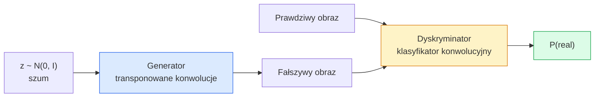
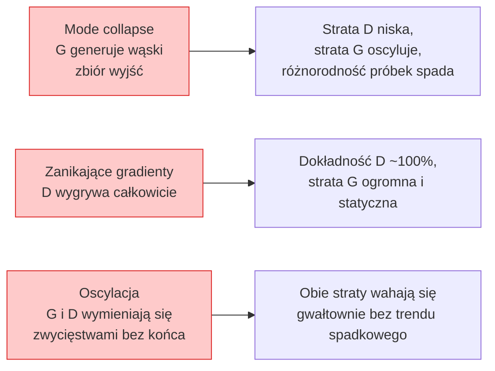

# Generowanie obrazów — GAN-y

> GAN to dwie sieci neuronowe rozgrywające ustaloną grę. Jedna rysuje, druga ocenia. Razem stają się coraz lepsze, aż rysunki zaczynają oszukiwać krytyka.

**Typ:** Implementacja
**Języki:** Python
**Wymagania wstępne:** Faza 4 Lekcja 03 (CNN-y), Faza 3 Lekcja 06 (Optymalizatory), Faza 3 Lekcja 07 (Regularyzacja)
**Czas:** ~75 minut

## Cele nauki

- Wyjaśnić grę typu minimax między generatorem i dyskryminatorem oraz powód, dla którego równowaga odpowiada p_model = p_data
- Zaimplementować DCGAN w PyTorchu i uzyskać generowanie spójnych syntetycznych obrazów 32x32 w mniej niż 60 liniach kodu
- Ustabilizować trenowanie GAN-a za pomocą trzech standardowych trików: funkcji straty bez saturacji (non-saturating loss), normalizacji spektralnej (spectral norm) oraz TTUR (reguły aktualizacji o dwóch skalach czasowych)
- Czytać krzywe treningowe rozróżniające zdrową konwergencję od mode collapse, oscylacji i całkowitego zwycięstwa dyskryminatora

## Problem

Klasyfikacja uczy sieć mapowania obrazów na etykiety. Generowanie odwraca ten problem: próbkujemy nowe obrazy, które wyglądają jak pochodzące z tego samego rozkładu. Nie istnieje „poprawny" wynik, z którym można porównać wyjście — istnieje tylko rozkład, który chcemy imitować.

Standardowe funkcje straty (MSE, entropia skrośna) nie mierzą tego, „czy ta próbka pochodzi z rzeczywistego rozkładu". Minimalizacja błędu na poziomie pikseli prowadzi do rozmytych uśrednień, a nie realistycznych próbek. Przełomem było nauczenie się samej funkcji straty: wytrenowanie drugiej sieci, której zadaniem jest odróżnianie prawdziwych obrazów od fałszywych, i wykorzystanie jej ocen do popychania generatora w odpowiednim kierunku.

GAN-y (Goodfellow i in., 2014) zdefiniowały ten framework. Do 2018 roku StyleGAN generował twarze 1024x1024 nieodróżnialne od fotografii. Modele dyfuzyjne od tamtej pory przejęły tron pod względem jakości i kontrolowalności, ale każdy trik, który czyni dyfuzję praktyczną — wybory dotyczące normalizacji, przestrzenie ukryte, straty oparte na cechach — został najpierw zrozumiany na przykładzie GAN-ów.

## Koncepcja

### Dwie sieci



**Generator** G przyjmuje wektor szumu `z` i generuje obraz. **Dyskryminator** D przyjmuje obraz i wypisuje pojedynczy skalar: prawdopodobieństwo, że obraz jest prawdziwy.

### Gra

G chce, aby D się pomylił. D chce mieć rację. Formalnie:

```
min_G max_D  E_x[log D(x)] + E_z[log(1 - D(G(z)))]
```

Czytaj od prawej do lewej: D maksymalizuje dokładność na prawdziwych (`log D(real)`) i fałszywych (`log (1 - D(fake))`) obrazach. G minimalizuje dokładność D na fałszywkach — chce, aby `D(G(z))` było wysokie.

Goodfellow udowodnił, że ten minimax ma globalną równowagę, w której `p_G = p_data`, D wszędzie wypisuje 0.5, a dywergencja Jensena-Shannona między rozkładem generowanym i rzeczywistym jest równa zero. Trudność leży w jej osiągnięciu.

### Funkcja straty bez saturacji (non-saturating loss)

Powyższa postać jest numerycznie niestabilna. Na początku treningu `D(G(z))` jest bliskie zeru dla każdej fałszywki, więc `log(1 - D(G(z)))` ma zanikające gradienty względem G. Rozwiązanie: odwrócić funkcję straty G.

```
L_D = -E_x[log D(x)] - E_z[log(1 - D(G(z)))]
L_G = -E_z[log D(G(z))]                          # bez saturacji (non-saturating)
```

Teraz, gdy `D(G(z))` jest bliskie zeru, strata G jest duża, a jej gradient niesie informację. Każdy współczesny GAN trenuje się z użyciem tego wariantu.

### Reguły architektury DCGAN

Radford, Metz, Chintala (2015) skondensowali lata nieudanych eksperymentów w pięć reguł, które czynią trenowanie GAN-ów stabilnym:

1. Zastąp pooling konwolucjami z krokiem (stride) — w obu sieciach.
2. Użyj batch norm w generatorze i dyskryminatorze, z wyjątkiem wyjścia G i wejścia D.
3. Usuń warstwy w pełni połączone w głębszych architekturach.
4. G używa ReLU na wszystkich warstwach poza wyjściem (tanh dla wyjścia w [-1, 1]).
5. D używa LeakyReLU (negative_slope=0.2) na wszystkich warstwach.

Każdy współczesny GAN bazujący na konwolucjach (StyleGAN, BigGAN, GigaGAN) wciąż zaczyna od tych reguł i wymienia poszczególne elementy po jednym na raz.

### Tryby awarii i ich sygnatury



- **Mode collapse**: G znajduje jeden obraz, który oszukuje D, i produkuje tylko jego. Rozwiązanie: dodaj minibatch discrimination, normalizację spektralną lub warunkowanie etykietą (label-conditioning).
- **Dyskryminator wygrywa**: D staje się za silny za szybko, a gradienty G zanikają. Rozwiązanie: mniejszy D, niższy learning rate D lub label smoothing na prawdziwych etykietach.
- **Oscylacja**: dwie sieci wymieniają się zwycięstwami, nigdy nie zbliżając się do równowagi. Rozwiązanie: TTUR (D uczy się szybciej niż G o czynnik 2-4) lub przejście na stratę Wasserstein.

### Ewaluacja

GAN-y nie mają wzorca prawdy (ground truth), więc jak sprawdzić, że działają?

- **Inspekcja próbek** — wystarczy spojrzeć na 64 próbki na końcu każdej epoki. Niepodlegające negocjacjom.
- **FID (Fréchet Inception Distance)** — odległość między rozkładami cech Inception-v3 dla zbiorów prawdziwych i generowanych. Mniej = lepiej. Standard w środowisku.
- **Inception Score** — starsza, bardziej niestabilna metryka; preferuj FID.
- **Precision/Recall dla modeli generatywnych** — mierzy jakość (precision) i pokrycie (recall) osobno. Bardziej informatywne niż samo FID.

Dla małego przebiegu na syntetycznych danych inspekcja próbek jest wystarczająca.

## Zbuduj to

### Krok 1: Generator

Mały generator DCGAN, który przyjmuje 64-wymiarowy szum i generuje obraz 32x32.

```python
import torch
import torch.nn as nn

class Generator(nn.Module):
    def __init__(self, z_dim=64, img_channels=3, feat=64):
        super().__init__()
        self.net = nn.Sequential(
            nn.ConvTranspose2d(z_dim, feat * 4, kernel_size=4, stride=1, padding=0, bias=False),
            nn.BatchNorm2d(feat * 4),
            nn.ReLU(inplace=True),
            nn.ConvTranspose2d(feat * 4, feat * 2, kernel_size=4, stride=2, padding=1, bias=False),
            nn.BatchNorm2d(feat * 2),
            nn.ReLU(inplace=True),
            nn.ConvTranspose2d(feat * 2, feat, kernel_size=4, stride=2, padding=1, bias=False),
            nn.BatchNorm2d(feat),
            nn.ReLU(inplace=True),
            nn.ConvTranspose2d(feat, img_channels, kernel_size=4, stride=2, padding=1, bias=False),
            nn.Tanh(),
        )

    def forward(self, z):
        return self.net(z.view(z.size(0), -1, 1, 1))
```

Cztery transponowane konwolucje, każda z `kernel_size=4, stride=2, padding=1`, tak aby czysto podwajały rozmiar przestrzenny. Aktywacje wyjściowe w zakresie [-1, 1] za pomocą tanh.

### Krok 2: Dyskryminator

Odbicie generatora. LeakyReLU, konwolucje z krokiem, zakończone skalarnym logitem.

```python
class Discriminator(nn.Module):
    def __init__(self, img_channels=3, feat=64):
        super().__init__()
        self.net = nn.Sequential(
            nn.Conv2d(img_channels, feat, kernel_size=4, stride=2, padding=1),
            nn.LeakyReLU(0.2, inplace=True),
            nn.Conv2d(feat, feat * 2, kernel_size=4, stride=2, padding=1, bias=False),
            nn.BatchNorm2d(feat * 2),
            nn.LeakyReLU(0.2, inplace=True),
            nn.Conv2d(feat * 2, feat * 4, kernel_size=4, stride=2, padding=1, bias=False),
            nn.BatchNorm2d(feat * 4),
            nn.LeakyReLU(0.2, inplace=True),
            nn.Conv2d(feat * 4, 1, kernel_size=4, stride=1, padding=0),
        )

    def forward(self, x):
        return self.net(x).view(-1)
```

Ostatnia konwolucja redukuje mapę cech `4x4` do `1x1`. Wyjściem jest pojedynczy skalar dla każdego obrazu; sigmoid stosujemy tylko podczas obliczania straty.

### Krok 3: Krok treningowy

Alternuj: zaktualizuj D raz, potem G raz, dla każdego batcha.

```python
import torch.nn.functional as F

def train_step(G, D, real, z, opt_g, opt_d, device):
    real = real.to(device)
    bs = real.size(0)

    # krok D
    opt_d.zero_grad()
    d_real = D(real)
    d_fake = D(G(z).detach())
    loss_d = (F.binary_cross_entropy_with_logits(d_real, torch.ones_like(d_real))
              + F.binary_cross_entropy_with_logits(d_fake, torch.zeros_like(d_fake)))
    loss_d.backward()
    opt_d.step()

    # krok G
    opt_g.zero_grad()
    d_fake = D(G(z))
    loss_g = F.binary_cross_entropy_with_logits(d_fake, torch.ones_like(d_fake))
    loss_g.backward()
    opt_g.step()

    return loss_d.item(), loss_g.item()
```

`G(z).detach()` w kroku D jest kluczowe: nie chcemy, aby gradienty przepływały do G podczas aktualizacji D. Zapomnienie o tym jest klasycznym błędem początkujących.

### Krok 4: Pełna pętla treningowa na syntetycznych kształtach

```python
from torch.utils.data import DataLoader, TensorDataset
import numpy as np

def synthetic_images(num=2000, size=32, seed=0):
    rng = np.random.default_rng(seed)
    imgs = np.zeros((num, 3, size, size), dtype=np.float32) - 1.0
    for i in range(num):
        r = rng.uniform(6, 12)
        cx, cy = rng.uniform(r, size - r, size=2)
        yy, xx = np.meshgrid(np.arange(size), np.arange(size), indexing="ij")
        mask = (xx - cx) ** 2 + (yy - cy) ** 2 < r ** 2
        color = rng.uniform(-0.5, 1.0, size=3)
        for c in range(3):
            imgs[i, c][mask] = color[c]
    return torch.from_numpy(imgs)

device = "cuda" if torch.cuda.is_available() else "cpu"
data = synthetic_images()
loader = DataLoader(TensorDataset(data), batch_size=64, shuffle=True)

G = Generator(z_dim=64, img_channels=3, feat=32).to(device)
D = Discriminator(img_channels=3, feat=32).to(device)
opt_g = torch.optim.Adam(G.parameters(), lr=2e-4, betas=(0.5, 0.999))
opt_d = torch.optim.Adam(D.parameters(), lr=2e-4, betas=(0.5, 0.999))

for epoch in range(10):
    for (batch,) in loader:
        z = torch.randn(batch.size(0), 64, device=device)
        ld, lg = train_step(G, D, batch, z, opt_g, opt_d, device)
    print(f"epoch {epoch}  D {ld:.3f}  G {lg:.3f}")
```

`Adam(lr=2e-4, betas=(0.5, 0.999))` to domyślne ustawienie DCGAN — niski beta1 zapobiega temu, by człon momentum nadmiernie stabilizował grę adwersarialną.

### Krok 5: Próbkowanie

```python
@torch.no_grad()
def sample(G, n=16, z_dim=64, device="cpu"):
    G.eval()
    z = torch.randn(n, z_dim, device=device)
    imgs = G(z)
    imgs = (imgs + 1) / 2
    return imgs.clamp(0, 1)
```

Zawsze przełącz się w tryb eval przed próbkowaniem. Dla DCGAN jest to istotne, ponieważ używane są statystyki bieżące batch norm, a nie statystyki danego batcha.

### Krok 6: Normalizacja spektralna

Bezpośredni zamiennik BN w dyskryminatorze, który gwarantuje, że sieć jest 1-Lipschitzowska. Naprawia większość awarii typu „D wygrywa za mocno".

```python
from torch.nn.utils import spectral_norm

def build_sn_discriminator(img_channels=3, feat=64):
    return nn.Sequential(
        spectral_norm(nn.Conv2d(img_channels, feat, 4, 2, 1)),
        nn.LeakyReLU(0.2, inplace=True),
        spectral_norm(nn.Conv2d(feat, feat * 2, 4, 2, 1)),
        nn.LeakyReLU(0.2, inplace=True),
        spectral_norm(nn.Conv2d(feat * 2, feat * 4, 4, 2, 1)),
        nn.LeakyReLU(0.2, inplace=True),
        spectral_norm(nn.Conv2d(feat * 4, 1, 4, 1, 0)),
    )
```

Zamień `Discriminator` na `build_sn_discriminator()` i często nie potrzebujesz już triku TTUR. Normalizacja spektralna jest najprostszym pojedynczym usprawnieniem zwiększającym stabilność, jakie można zastosować.

## Zastosuj to

Dla poważnego generowania używaj wytrenowanych wag lub przejdź na dyfuzję. Dwie standardowe biblioteki:

- `torch_fidelity` oblicza FID / IS dla twojego generatora bez konieczności pisania własnego kodu ewaluacji.
- `pytorch-gan-zoo` (przestarzała) i `StudioGAN` udostępniają przetestowane implementacje DCGAN, WGAN-GP, SN-GAN, StyleGAN i BigGAN.

W 2026 roku GAN-y wciąż są najlepszym wyborem do: generowania obrazów w czasie rzeczywistym (latencja <10 ms), transferu stylu, tłumaczenia obrazu na obraz z precyzyjną kontrolą (Pix2Pix, CycleGAN). Dyfuzja wygrywa pod względem fotorealizmu i warunkowania tekstem.

## Wdroż to

Ta lekcja produkuje:

- `outputs/prompt-gan-training-triage.md` — prompt, który odczytuje opis krzywej treningowej i wskazuje tryb awarii (mode collapse, D-wygrywa, oscylacja) wraz z jedną zalecaną poprawką.
- `outputs/skill-dcgan-scaffold.md` — skill, który pisze szkielet DCGAN na podstawie `z_dim`, docelowego `image_size` i `num_channels`, wraz z pętlą treningową i zapisywaniem próbek.

## Ćwiczenia

1. **(Łatwe)** Wytrenuj powyższy DCGAN na syntetycznym zbiorze danych z okręgami i zapisuj siatkę 16 próbek na końcu każdej epoki. W której epoce generowane okręgi staną się wyraźnie kołowe?
2. **(Średnie)** Zamień batch norm dyskryminatora na normalizację spektralną. Wytrenuj obie wersje równolegle. Która zbiega szybciej? Która ma niższą wariancję przy trzech ziarnach (seeds)?
3. **(Trudne)** Zaimplementuj warunkowy DCGAN: podaj etykietę klasy na wejście G i D (połącz one-hot z szumem w G, połącz kanał embeddingu klasy w D). Wytrenuj na syntetycznym zbiorze danych „okręgi vs kwadraty" z lekcji 7 i wykaż, że warunkowanie klasą działa, próbkując z konkretnymi etykietami.

## Kluczowe terminy

| Termin | Co się mówi | Co to faktycznie oznacza |
|------|----------------|----------------------|
| Generator (G) | „Sieć, która rysuje" | Mapuje szum na obrazy; trenowany, aby oszukać dyskryminator |
| Dyskryminator (D) | „Krytyk" | Klasyfikator binarny; trenowany, aby odróżniać obrazy prawdziwe od generowanych |
| Minimax | „Gra" | min po G, max po D funkcji straty adwersarialnej; równowaga to p_G = p_data |
| Funkcja straty bez saturacji (non-saturating loss) | „Numerycznie rozsądna wersja" | Strata G to -log(D(G(z))) zamiast log(1 - D(G(z))), aby uniknąć zanikających gradientów na początku treningu |
| Mode collapse | „Generator tworzy jedną rzecz" | G generuje tylko mały podzbiór rozkładu danych; rozwiązanie to SN, minibatch discrimination lub większy batch |
| TTUR | „Dwa learning rate'y" | D uczy się szybciej niż G, typowo o czynnik 2-4; stabilizuje trening |
| Normalizacja spektralna | „Warstwa 1-Lipschitzowska" | Normalizacja wag, która ogranicza stałą Lipschitza każdej warstwy; zapobiega temu, by D stał się arbitralnie „ostry" |
| FID | „Fréchet Inception Distance" | Odległość między rozkładami cech Inception-v3 zbiorów prawdziwego i generowanego; standardowa metryka ewaluacji |

## Dalsze materiały

- [Generative Adversarial Networks (Goodfellow i in., 2014)](https://arxiv.org/abs/1406.2661) — praca, która zaczęła wszystko
- [DCGAN (Radford, Metz, Chintala, 2015)](https://arxiv.org/abs/1511.06434) — reguły architektury, które uczyniły GAN-y trenowalnymi
- [Spectral Normalization for GANs (Miyato i in., 2018)](https://arxiv.org/abs/1802.05957) — najbardziej przydatny pojedynczy trik stabilizacyjny
- [StyleGAN3 (Karras i in., 2021)](https://arxiv.org/abs/2106.12423) — GAN o najwyższej jakości (SOTA); czyta się jak album z największymi hitami z ostatniej dekady
