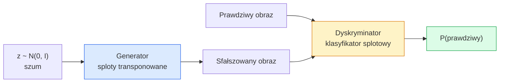
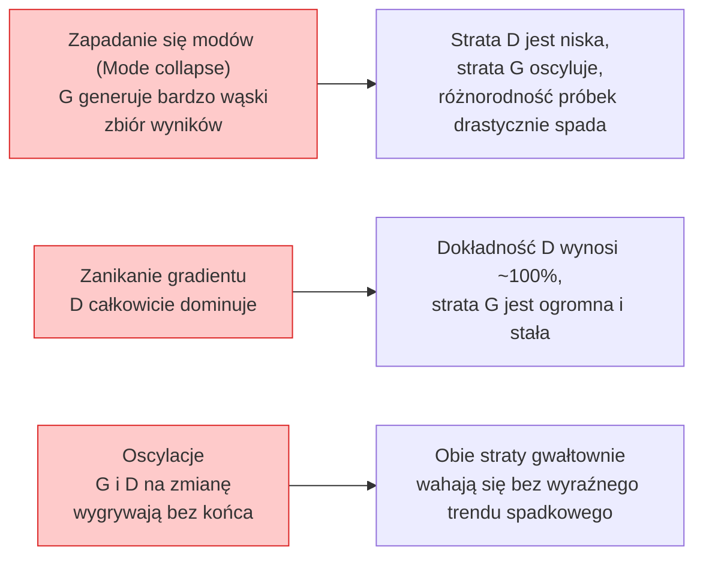

Created At: 2026-06-08T18:16:58Z
Completed At: 2026-06-08T18:16:58Z
File Path: `file:///C:/poligon/LLM_Traning/phases/04-computer-vision/09-image-generation-gans/docs/pl_pro.md`

# Generowanie obrazów za pomocą sieci GAN

> GAN to dwie sieci neuronowe rywalizujące ze sobą w grze o sumie zerowej. Jedna generuje (rysuje), druga krytykuje. Wspólnie doskonalą swoje umiejętności, dopóki wygenerowane obrazy nie zmylą krytyka.

**Typ:** Kompilacja  
**Języki:** Python  
**Wymagania wstępne:** Faza 4, lekcja 03 (CNN); faza 3, lekcja 06 (optymalizatory); faza 3, lekcja 07 (regularyzacja)  
**Czas:** ~75 minut  

## Cele nauczania

- Wyjaśnić zasady gry minimaksowej pomiędzy generatorem a dyskryminatorem oraz powód, dla którego stan równowagi odpowiada równości $p_{model} = p_{data}$.
- Zaimplementować model DCGAN w PyTorch i wygenerować spójne obrazy syntetyczne o wymiarach 32x32 w mniej niż 60 linijkach kodu.
- Ustabilizować proces uczenia GAN za pomocą trzech standardowych technik: nienasycającej się funkcji straty (non-saturating loss), normalizacji spektralnej (spectral norm) oraz TTUR (Two-Time-Scale Update Rule).
- Interpretować krzywe uczenia w celu odróżnienia prawidłowej zbieżności od zapadania się modów (mode collapse), oscylacji oraz całkowitej dominacji dyskryminatora.

## Problem

Klasyfikacja uczy sieć mapowania obrazów na etykiety. Generowanie obrazów odwraca ten problem: polega na tworzeniu nowych obrazów, które wyglądają tak, jakby pochodziły z tego samego rozkładu (dystrybucji). Nie ma tu jednego „poprawnego” wyniku, z którym można bezpośrednio porównać wyjście sieci; istnieje jedynie rozkład, który chcemy naśladować.

Standardowe funkcje straty (takie jak błąd średniokwadratowy – MSE czy entropia krzyżowa) nie potrafią ocenić, czy dana próbka pochodzi z rzeczywistego rozkładu danych. Minimalizacja błędu na poziomie pojedynczych pikseli prowadzi do uzyskania rozmytych, uśrednionych obrazów, a nie realistycznych próbek. Przełomem okazało się uczenie samej funkcji straty: polega ono na wytrenowaniu drugiej sieci, której zadaniem jest odróżnianie obrazów prawdziwych od sfałszowanych, a następnie wykorzystanie jej ocen do kierowania procesem uczenia generatora.

Koncepcję tę zapoczątkowały sieci GAN (Goodfellow i in., 2014). Do 2018 roku model StyleGAN generował twarze o rozdzielczości 1024x1024, niemal nie do odróżnienia od prawdziwych zdjęć. Choć od tamtego czasu modele dyfuzyjne przejęły prymat pod względem jakości i sterowalności generowania, to większość rozwiązań ułatwiających ich praktyczne zastosowanie – takich jak metody normalizacji, operacje w przestrzeni ukrytej (latent space) czy funkcje straty oparte na cechach – została po raz pierwszy opracowana i zrozumiana właśnie na gruncie sieci GAN.

## Koncepcja

### Dwie sieci



**Generator** G pobiera wektor szumu `z` i generuje na jego podstawie obraz. **Dyskryminator** D pobiera obraz (prawdziwy lub wygenerowany) i zwraca pojedynczą wartość skalarną: prawdopodobieństwo, że obraz jest prawdziwy.

### Gra

G dąży do tego, aby D się mylił, natomiast D chce trafnie oceniać obrazy. Formalnie zapisujemy to jako:

```
min_G max_D  E_x[log D(x)] + E_z[log(1 - D(G(z)))]
```

Czytając od prawej do lewej: D maksymalizuje dokładność rozpoznawania obrazów prawdziwych (`log D(x)`) oraz fałszywych (`log (1 - D(G(z)))`). G z kolei dąży do minimalizacji trafności ocen D w przypadku próbek wygenerowanych – chce, aby wartość `D(G(z))` była jak najbliższa 1.

Goodfellow udowodnił, że ta gra minimaksowa posiada globalną równowagę, w której $p_G = p_{data}$, D zwraca wszędzie wartość 0,5, a rozbieżność Jensena-Shannona między rozkładem wygenerowanym a rzeczywistym wynosi zero. Najtrudniejszą częścią jest jednak stabilne dotarcie do tego punktu.

### Strata nienasycająca

Powyższe sformułowanie matematyczne jest numerycznie niestabilne. Na początku procesu uczenia wartość `D(G(z))` jest bliska zeru dla każdej wygenerowanej próbki, przez co składnik `log(1 - D(G(z)))` generuje zanikające gradienty względem generatora G. Rozwiązaniem jest odwrócenie celu generatora:

```
L_D = -E_x[log D(x)] - E_z[log(1 - D(G(z)))]
L_G = -E_z[log D(G(z))]                          # funkcja straty nienasycająca się (non-saturating)
```

Teraz, gdy `D(G(z))` jest bliskie zeru, strata generatora G jest wysoka, a jej gradient niesie cenne informacje dla optymalizacji. Praktycznie wszystkie współczesne sieci GAN są trenowane przy użyciu tego wariantu.

### Reguły architektury DCGAN

Radford, Metz i Chintala (2015) podsumowali lata nieudanych eksperymentów w postaci pięciu zasad zapewniających stabilność uczenia sieci GAN:

1. Zastąp warstwy łączące (pooling) splotami o zmienionym kroku (strided convolutions) w obu sieciach.
2. Zastosuj normalizację wsadową (Batch Normalization) zarówno w generatorze, jak i dyskryminatorze, z wyjątkiem warstwy wyjściowej G oraz wejściowej D.
3. Usuń warstwy w pełni połączone (fully connected) w głębszych architekturach.
4. W generatorze użyj aktywacji ReLU we wszystkich warstwach poza wyjściową (dla której stosuje się Tanh, aby uzyskać zakres [-1, 1]).
5. W dyskryminatorze użyj aktywacji LeakyReLU (z nachyleniem ujemnym = 0.2) we wszystkich warstwach.

Każda współczesna sieć GAN oparta na splotach (np. StyleGAN, BigGAN, GigaGAN) nadal bazuje na tych zasadach, modyfikując poszczególne elementy jedynie w uzasadnionych przypadkach.

### Tryby awarii i ich sygnatury



- **Zapadanie się modów (Mode collapse)**: Generator G znajduje jeden lub kilka obrazów, które skutecznie oszukują dyskryminator D, i zaczyna generować wyłącznie te próbki. Środki zaradcze: dodanie dyskryminacji minipaczek (minibatch discrimination), normalizacja spektralna (spectral normalization) lub warunkowanie etykietami.
- **Dominacja dyskryminatora**: D staje się zbyt silny zbyt szybko, przez co gradienty generatora G zanikają. Środki zaradcze: zmniejszenie pojemności D, obniżenie współczynnika uczenia (learning rate) dla D lub zastosowanie wygładzania etykiet (label smoothing) dla próbek prawdziwych.
- **Oscylacje**: Obie sieci na przemian wygrywają rywalizację, przez co system nigdy nie osiąga stanu równowagi. Środki zaradcze: zastosowanie techniki TTUR (D uczy się szybciej niż G, zwykle 2-4 razy) lub przejście na funkcję straty Wassersteina (WGAN).

### Ocena

Sieci GAN nie mają naturalnej funkcji kosztu, którą można bezpośrednio monitorować w celu oceny postępów. Jak zatem ocenić ich działanie?

- **Weryfikacja wizualna próbek** – wygenerowanie i ocena np. 64 próbek na koniec każdej epoki. Jest to krok obowiązkowy.
- **FID (Fréchet Inception Distance)** – mierzy odległość między rozkładami cech (wyciągniętych z modelu Inception-v3) dla zbioru rzeczywistego i wygenerowanego. Niższa wartość oznacza lepszą jakość. Jest to standard w środowisku naukowym.
- **Inception Score (IS)** – starsza, bardziej podatna na błędy metryka; obecnie preferuje się FID.
- **Precyzja i pełność (Precision/Recall) dla modeli generatywnych** – mierzą niezależnie jakość (precyzję) oraz pokrycie rozkładu (pełność). Dostarczają więcej informacji niż sam wskaźnik FID.

W przypadku pracy z małym, syntetycznym zbiorem danych w zupełności wystarcza wizualna ocena próbek.

## Zbuduj to

### Krok 1: Generator

Prosty generator DCGAN, który przyjmuje 64-wymiarowy wektor szumu i generuje obraz o wymiarach 32x32.

```python
import torch
import torch.nn as nn

class Generator(nn.Module):
    def __init__(self, z_dim=64, img_channels=3, feat=64):
        super().__init__()
        self.net = nn.Sequential(
            nn.ConvTranspose2d(z_dim, feat * 4, kernel_size=4, stride=1, padding=0, bias=False),
            nn.BatchNorm2d(feat * 4),
            nn.ReLU(inplace=True),
            nn.ConvTranspose2d(feat * 4, feat * 2, kernel_size=4, stride=2, padding=1, bias=False),
            nn.BatchNorm2d(feat * 2),
            nn.ReLU(inplace=True),
            nn.ConvTranspose2d(feat * 2, feat, kernel_size=4, stride=2, padding=1, bias=False),
            nn.BatchNorm2d(feat),
            nn.ReLU(inplace=True),
            nn.ConvTranspose2d(feat, img_channels, kernel_size=4, stride=2, padding=1, bias=False),
            nn.Tanh(),
        )

    def forward(self, z):
        return self.net(z.view(z.size(0), -1, 1, 1))
```

Cztery warstwy splotu transponowanego (ConvTranspose2d), gdzie pierwsza przekształca wektor w mapę o wymiarach 4x4, a kolejne z parametrami `kernel_size=4, stride=2, padding=1` podwajają wymiar przestrzenny. Wartości wyjściowe są skalowane do przedziału [-1, 1] za pomocą funkcji Tanh.

### Krok 2: Dyskryminator

Symetryczne odwrócenie generatora. Wykorzystuje aktywację LeakyReLU, sploty o zmienionym kroku (strided convolutions) i kończy się zwróceniem pojedynczego logitu.

```python
class Discriminator(nn.Module):
    def __init__(self, img_channels=3, feat=64):
        super().__init__()
        self.net = nn.Sequential(
            nn.Conv2d(img_channels, feat, kernel_size=4, stride=2, padding=1),
            nn.LeakyReLU(0.2, inplace=True),
            nn.Conv2d(feat, feat * 2, kernel_size=4, stride=2, padding=1, bias=False),
            nn.BatchNorm2d(feat * 2),
            nn.LeakyReLU(0.2, inplace=True),
            nn.Conv2d(feat * 2, feat * 4, kernel_size=4, stride=2, padding=1, bias=False),
            nn.BatchNorm2d(feat * 4),
            nn.LeakyReLU(0.2, inplace=True),
            nn.Conv2d(feat * 4, 1, kernel_size=4, stride=1, padding=0),
        )

    def forward(self, x):
        return self.net(x).view(-1)
```

Ostatnia warstwa splotowa redukuje mapę cech o wymiarach `4x4` do rozmiaru `1x1`. Wynikiem jest pojedyncza wartość skalarna dla każdego obrazu; funkcję sigmoidalną nakłada się dopiero na etapie obliczania funkcji straty.

### Krok 3: Krok szkolenia

W każdej minipaczce naprzemiennie aktualizujemy najpierw dyskryminator D, a następnie generator G.

```python
import torch.nn.functional as F

def train_step(G, D, real, z, opt_g, opt_d, device):
    real = real.to(device)
    bs = real.size(0)

    # Krok D (Dyskryminator)
    opt_d.zero_grad()
    d_real = D(real)
    d_fake = D(G(z).detach())
    loss_d = (F.binary_cross_entropy_with_logits(d_real, torch.ones_like(d_real))
              + F.binary_cross_entropy_with_logits(d_fake, torch.zeros_like(d_fake)))
    loss_d.backward()
    opt_d.step()

    # Krok G (Generator)
    opt_g.zero_grad()
    d_fake = D(G(z))
    loss_g = F.binary_cross_entropy_with_logits(d_fake, torch.ones_like(d_fake))
    loss_g.backward()
    opt_g.step()

    return loss_d.item(), loss_g.item()
```

Wywołanie `G(z).detach()` w kroku D jest kluczowe: zapobiega ono propagacji gradientów do generatora G podczas aktualizacji wag dyskryminatora. Pominięcie tej operacji to klasyczny błąd początkujących.

### Krok 4: Pełna pętla treningowa na kształtach syntetycznych

```python
from torch.utils.data import DataLoader, TensorDataset
import numpy as np

def synthetic_images(num=2000, size=32, seed=0):
    rng = np.random.default_rng(seed)
    imgs = np.zeros((num, 3, size, size), dtype=np.float32) - 1.0
    for i in range(num):
        r = rng.uniform(6, 12)
        cx, cy = rng.uniform(r, size - r, size=2)
        yy, xx = np.meshgrid(np.arange(size), np.arange(size), indexing="ij")
        mask = (xx - cx) ** 2 + (yy - cy) ** 2 < r ** 2
        color = rng.uniform(-0.5, 1.0, size=3)
        for c in range(3):
            imgs[i, c][mask] = color[c]
    return torch.from_numpy(imgs)

device = "cuda" if torch.cuda.is_available() else "cpu"
data = synthetic_images()
loader = DataLoader(TensorDataset(data), batch_size=64, shuffle=True)

G = Generator(z_dim=64, img_channels=3, feat=32).to(device)
D = Discriminator(img_channels=3, feat=32).to(device)
opt_g = torch.optim.Adam(G.parameters(), lr=2e-4, betas=(0.5, 0.999))
opt_d = torch.optim.Adam(D.parameters(), lr=2e-4, betas=(0.5, 0.999))

for epoch in range(10):
    for (batch,) in loader:
        z = torch.randn(batch.size(0), 64, device=device)
        ld, lg = train_step(G, D, batch, z, opt_g, opt_d, device)
    print(f"epoch {epoch}  D {ld:.3f}  G {lg:.3f}")
```

Domyślne parametry optymalizatora Adam dla DCGAN to `lr=2e-4` oraz `betas=(0.5, 0.999)`. Niska wartość parametru `beta1` sprawia, że moment pędu (momentum) nie tłumi zbyt mocno dynamicznej gry konkurencyjnej obu sieci.

### Krok 5: Próbkowanie

```python
@torch.no_grad()
def sample(G, n=16, z_dim=64, device="cpu"):
    G.eval()
    z = torch.randn(n, z_dim, device=device)
    imgs = G(z)
    imgs = (imgs + 1) / 2
    return imgs.clamp(0, 1)
```

Przed rozpoczęciem generowania próbki należy zawsze przełączyć model w tryb ewaluacji (`G.eval()`). W przypadku DCGAN jest to szczególnie ważne, ponieważ wpływa na sposób działania warstw Batch Normalization (używane są uśrednione statystyki z całego procesu uczenia zamiast statystyk bieżącej paczki).

### Krok 6: Normalizacja widmowa

Zastąpienie normalizacji wsadowej (BN) normalizacją spektralną w dyskryminatorze pozwala zagwarantować, że sieć spełnia warunek 1-Lipschitza. Rozwiązuje to większość problemów związanych z dominacją dyskryminatora nad generatorem.

```python
from torch.nn.utils import spectral_norm

def build_sn_discriminator(img_channels=3, feat=64):
    return nn.Sequential(
        spectral_norm(nn.Conv2d(img_channels, feat, 4, 2, 1)),
        nn.LeakyReLU(0.2, inplace=True),
        spectral_norm(nn.Conv2d(feat, feat * 2, 4, 2, 1)),
        nn.LeakyReLU(0.2, inplace=True),
        spectral_norm(nn.Conv2d(feat * 2, feat * 4, 4, 2, 1)),
        nn.LeakyReLU(0.2, inplace=True),
        spectral_norm(nn.Conv2d(feat * 4, 1, 4, 1, 0)),
    )
```

Zastąpienie standardowego dyskryminatora wersją z normalizacją spektralną (`build_sn_discriminator()`) często eliminuje konieczność stosowania techniki TTUR. Normalizacja spektralna jest najprostszą i najbardziej efektywną metodą poprawy stabilności sieci GAN.

## Użyj tego

W przypadku zaawansowanych projektów generatywnych zaleca się użycie gotowych, pre-trenowanych wag lub przejście na modele dyfuzyjne. Dwie standardowe biblioteki to:

- `torch_fidelity` – pozwala obliczyć wskaźniki FID/IS bezpośrednio dla generatora, bez konieczności pisania własnego kodu ewaluacyjnego.
- `pytorch-gan-zoo` (starsza wersja) oraz `StudioGAN` – sprawdzone w praktyce, referencyjne implementacje modeli takich jak DCGAN, WGAN-GP, SN-GAN, StyleGAN czy BigGAN.

W 2026 roku sieci GAN pozostają najlepszym wyborem do zadań takich jak: generowanie obrazów w czasie rzeczywistym (opóźnienie <10 ms), transfer stylu oraz translacja obrazu na obraz z precyzyjną kontrolą (np. Pix2Pix, CycleGAN). W obszarze fotorealizmu oraz generowania na podstawie tekstu (text-to-image) dominują jednak modele dyfuzyjne.

## Wyślij to

Niniejsza lekcja dostarcza:

- `outputs/prompt-gan-training-triage.md` – prompt analizujący opis krzywej uczenia w celu zdiagnozowania problemu (zapadanie się modów, dominacja D, oscylacje) i wskazania optymalnego rozwiązania.
- `outputs/skill-dcgan-scaffold.md` – narzędzie generujące szablon modelu DCGAN dla zadanych wartości `z_dim`, `image_size` i `num_channels`, wraz z pętlą uczenia i funkcją zapisu wygenerowanych próbek.

## Ćwiczenia

1. **(Łatwe)** Wytrenuj powyższy model DCGAN na syntetycznym zbiorze danych z kołami i zapisuj siatkę 16 próbek na koniec każdej epoki. W której epoce generowane kształty zaczynają wyraźnie przypominać koła?
2. **(Średnie)** Zastąp normalizację wsadową w dyskryminatorze normalizacją spektralną. Przetrenuj obie wersje obok siebie. Która zbiega się szybciej? Która wykazuje mniejszą wariancję wyników przy użyciu trzech różnych punktów startowych (seeds)?
3. **(Trudne)** Zaimplementuj warunkowy DCGAN (Conditional GAN): przekaż etykietę klasy do generatora G (np. łącząc wektor osadzenia klasy z wektorem szumu) oraz do dyskryminatora D (np. jako dodatkowy kanał wejściowy). Przeprowadź trening na syntetycznym zbiorze danych zawierającym koła i kwadraty (z lekcji 7) i wykaż poprawne działanie warunkowania poprzez generowanie próbek dla konkretnych klas.

## Kluczowe terminy

| Termin | Obiegowe określenie | Co to oznacza w rzeczywistości |
|------|----------------|----------------------|
| Generator (G) | „Sieć rysująca” | Sieć mapująca szum losowy na obrazy; trenowana w celu oszukania dyskryminatora |
| Dyskryminator (D) | „Krytyk” | Klasyfikator binarny oceniający prawdopodobieństwo, że dany obraz jest prawdziwy |
| Minimax | „Gra” | Sformułowanie gry o sumie zerowej (min po stronie G, max po stronie D); stanem równowagi jest $p_G = p_{data}$ |
| Nienasycająca się funkcja straty | „Wersja stabilna numerycznie” | Funkcja straty G zdefiniowana jako $-\log(D(G(z)))$ zamiast $\log(1 - D(G(z)))$, zapobiegająca zanikaniu gradientów na początku uczenia |
| Zapadanie się modów (Mode collapse) | „Generator ciągle robi to samo” | Generator wytwarza jedynie wąski podzbiór zróżnicowania obecnego w danych rzeczywistych; rozwiązaniem jest normalizacja spektralna, minibatch discrimination lub większa paczka |
| TTUR (Two-Time-Scale Update Rule) | „Dwa różne współczynniki uczenia” | Technika polegająca na szybszym uczeniu dyskryminatora D niż generatora G (zazwyczaj 2-4 razy), co stabilizuje proces uczenia |
| Normalizacja spektralna (Spectral Norm) | „Warunek 1-Lipschitza” | Technika normalizacji wag ograniczająca stałą Lipschitza każdej warstwy sieci, co zapobiega gwałtownym wahaniom ocen dyskryminatora |
| FID (Fréchet Inception Distance) | „Odległość początkowa Frécheta” | Metryka oceniająca jakość wygenerowanych obrazów na podstawie odległości między rozkładami ich cech w sieci Inception-v3 a rozkładami cech obrazów prawdziwych |

## Literatura uzupełniająca

- [Generative Adversarial Networks (Goodfellow et al., 2014)](https://arxiv.org/abs/1406.2661) – artykuł, od którego wszystko się zaczęło
- [DCGAN (Radford, Metz, Chintala, 2015)](https://arxiv.org/abs/1511.06434) – reguły architektury umożliwiające stabilne trenowanie sieci GAN
- [Spectral Normalization for GAN (Miyato et al., 2018)](https://arxiv.org/abs/1802.05957) – najbardziej przydatna metoda stabilizacji uczenia
- [StyleGAN3 (Karras i in., 2021)](https://arxiv.org/abs/2106.12423) – stan wiedzy (SOTA) w obszarze sieci GAN; podsumowanie najważniejszych technik ostatniej dekady
