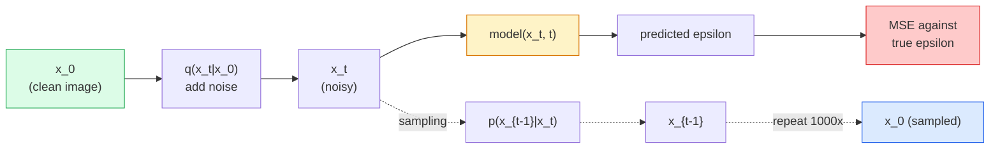

# Generowanie obrazu — modele dyfuzyjne

> Model dyfuzyjny uczy się odszumiać. Wytrenuj go, aby usuwał odrobinę szumu z zaszumionego obrazu, powtórz to tysiąc razy od tyłu, a otrzymasz generator obrazu.

**Typ:** Kompilacja
**Języki:** Python
**Wymagania wstępne:** Faza 4 Lekcja 07 (U-Net), Faza 1 Lekcja 06 (Prawdopodobieństwo), Faza 3 Lekcja 06 (Optymalizatory)
**Czas:** ~75 minut

## Cele nauczania

- Wyprowadź proces szumowania w przód `x_0 -> x_1 -> ... -> x_T` i wyjaśnij, dlaczego forma zamknięta `q(x_t | x_0)` obowiązuje dla dowolnego t
- Zaimplementuj cel szkoleniowy w stylu DDPM, który regresuje szum dodany na każdym kroku, oraz próbnik, który wraca od czystego szumu do obrazu
- Zbuduj uwarunkowaną czasowo sieć U-Net (wystarczająco małą, aby trenować na procesorze), która przewiduje szum w dowolnym kroku czasowym
- Wyjaśnij różnicę pomiędzy próbkowaniem DDPM i DDIM oraz kiedy każdy z nich jest odpowiedni (lekcja 23 omawia szczegółowo dopasowanie przepływu i skorygowany przepływ)

## Problem

Sieci GAN generują jednorazowo: wejście szumu, wyjście obrazu, jedno przejście do przodu. Są szybkie i trudne w szkoleniu. Modele dyfuzji są generowane iteracyjnie: zacznij od czystego szumu, odszumiaj go małymi krokami, aż pojawi się obraz. Są powolne i łatwe w szkoleniu. Przez ostatnie pięć lat dominowała ta druga właściwość: każdy mały zespół może wytrenować model dyfuzji i uzyskać rozsądne próbki; Trening GAN to rzemiosło, którego uczysz się przez lata nieudanych biegów.

Poza stabilnością treningu, iteracyjna struktura dyfuzji odblokowuje wszystko, co robi współczesne generowanie obrazu: warunkowanie tekstu, malowanie, edycja obrazu, superrozdzielczość, kontrolowany styl. Każdy krok pętli próbkowania jest miejscem, w którym można wprowadzić nowe ograniczenie. Właśnie dlatego Stable Diffusion, Imagen, DALL-E 3, Midjourney i każdy kontrolowany model obrazu, którego będziesz używać, opierają się na dyfuzji.

Ta lekcja buduje minimalny DDPM: szum do przodu, odszumianie do tyłu, pętla treningowa. Następna lekcja (Stable Diffusion) łączy go z systemem produkcyjnym z VAE, koderem tekstu i wskazówkami bez klasyfikatorów.

## Koncepcja

### Proces do przodu

Zrób zdjęcie `x_0`. Dodaj niewielką ilość szumu Gaussa, aby uzyskać `x_1`. Dodaj jeszcze odrobinę, aby otrzymać `x_2`. Kontynuuj wykonywanie T kroków, aż `x_T` będzie prawie nie do odróżnienia od czystego szumu Gaussa.

```
q(x_t | x_{t-1}) = N(x_t; sqrt(1 - beta_t) * x_{t-1},  beta_t * I)
```

`beta_t` to harmonogram małej wariancji, zazwyczaj liniowy od 0,0001 do 0,02 w T=1000 kroków. Każdy krok nieznacznie zmniejsza sygnał i wprowadza świeży szum.

### Skok w formie zamkniętej

Dodawanie szumu krok po kroku to łańcuch Markowa, ale matematyka się sprawdza: możesz próbkować `x_t` bezpośrednio z `x_0` w jednym kroku.

```
Define alpha_t = 1 - beta_t
Define alpha_bar_t = prod_{s=1..t} alpha_s

Then:
  q(x_t | x_0) = N(x_t; sqrt(alpha_bar_t) * x_0,  (1 - alpha_bar_t) * I)

Equivalently:
  x_t = sqrt(alpha_bar_t) * x_0 + sqrt(1 - alpha_bar_t) * epsilon
  where epsilon ~ N(0, I)
```

To pojedyncze równanie stanowi cały powód, dla którego dyfuzja jest praktyczna. Podczas szkolenia wybierasz losowo `t`, pobierasz próbkę `x_t` bezpośrednio z `x_0` i trenujesz w jednym kroku — nie jest wymagana symulacja pełnego łańcucha Markowa.

### Proces odwrotny

Proces przekazywania jest ustalony. Sieć neuronowa uczy się procesu odwrotnego `p(x_{t-1} | x_t)`. Modele dyfuzji nie przewidują bezpośrednio `x_{t-1}`; przewidują szum `epsilon` dodany w kroku t, a matematyka wyprowadza z niego `x_{t-1}`.



### Strata w treningu

Na każdym etapie szkolenia:

1. Wypróbuj prawdziwy obraz `x_0`.
2. Próbkuj krok czasowy `t` równomiernie z [1, T].
3. Przykładowy szum `epsilon ~ N(0, I)`.
4. Oblicz `x_t = sqrt(alpha_bar_t) * x_0 + sqrt(1 - alpha_bar_t) * epsilon`.
5. Przewiduj `epsilon_theta(x_t, t)` za pomocą sieci.
6. Zminimalizuj `|| epsilon - epsilon_theta(x_t, t) ||^2`.

To jest to. Sieć neuronowa uczy się przewidywać hałas w dowolnym momencie. Strata to MSE. Nie ma gry kontradyktoryjnej, żadnego upadku, żadnej oscylacji.

### Próbnik (DDPM)

Aby wygenerować: zacznij od `x_T ~ N(0, I)` i cofaj się krok po kroku.

```
for t = T, T-1, ..., 1:
    eps = model(x_t, t)
    x_{t-1} = (1 / sqrt(alpha_t)) * (x_t - (beta_t / sqrt(1 - alpha_bar_t)) * eps) + sqrt(beta_t) * z
    where z ~ N(0, I) if t > 1, else 0
return x_0
```

Kluczem jest to, że chociaż odwrotny tryb warunkowy nie jest ogólnie znany w postaci zamkniętej, w przypadku tego konkretnego procesu Gaussa do przodu jest tak. Brzydko wyglądające współczynniki są tym, co daje reguła Bayesa.

### Po co 1000 kroków

Harmonogram szumów w przód jest wybierany tak, aby każdy krok dodał tyle szumu, że krok odwrotny był prawie gaussowski. Za mało kroków i krok odwrotny jest daleki od Gaussa, sieć nie może tego dobrze modelować. Zbyt wiele kroków i próbkowanie staje się kosztowne wraz ze zmniejszającym się wzmocnieniem. Domyślną wartością DDPM jest T=1000 z harmonogramem liniowym.

### DDIM: 20x szybsze próbkowanie

Trening jest taki sam. Zmiany w próbkowaniu. DDIM (Song i in., 2020) definiuje deterministyczny proces odwrotny, który pomija etapy czasowe bez ponownego szkolenia. Próbkowanie w 50 krokach za pomocą DDIM daje jakość DDPM prawie 1000 kroków. Każdy system produkcyjny wykorzystuje DDIM lub jeszcze szybszy wariant (DPM-Solver, przodek Eulera).

### Warunkowanie czasu

Sieć `epsilon_theta(x_t, t)` musi wiedzieć, który krok czasowy odszumia. Nowoczesne modele dyfuzji wprowadzają `t` poprzez sinusoidalne osadzanie czasu (ten sam pomysł, co kodowanie pozycyjne w transformatorach), które są dodawane do map obiektów na każdym poziomie U-Net.

```
t_embedding = sinusoidal(t)
feature_map += MLP(t_embedding)
```

Bez warunkowania czasowego sieć musi odgadnąć poziom szumu na podstawie samego obrazu, co działa, ale jest znacznie mniej wydajne pod względem próbkowania.

## Zbuduj to

### Krok 1: Harmonogram szumów

```python
import torch

def linear_beta_schedule(T=1000, beta_start=1e-4, beta_end=2e-2):
    return torch.linspace(beta_start, beta_end, T)

def precompute_schedule(betas):
    alphas = 1.0 - betas
    alphas_cumprod = torch.cumprod(alphas, dim=0)
    return {
        "betas": betas,
        "alphas": alphas,
        "alphas_cumprod": alphas_cumprod,
        "sqrt_alphas_cumprod": torch.sqrt(alphas_cumprod),
        "sqrt_one_minus_alphas_cumprod": torch.sqrt(1.0 - alphas_cumprod),
        "sqrt_recip_alphas": torch.sqrt(1.0 / alphas),
    }

schedule = precompute_schedule(linear_beta_schedule(T=1000))
```

Oblicz wstępnie raz, zbierz według indeksu podczas uczenia i pobierania próbek.

### Krok 2: Rozpowszechnienie w przód (q_sample)

```python
def q_sample(x0, t, noise, schedule):
    sqrt_a = schedule["sqrt_alphas_cumprod"][t].view(-1, 1, 1, 1)
    sqrt_one_minus_a = schedule["sqrt_one_minus_alphas_cumprod"][t].view(-1, 1, 1, 1)
    return sqrt_a * x0 + sqrt_one_minus_a * noise
```

Jednoliniowy formularz zamknięty. `t` to grupa kroków czasowych, po jednym na obraz w partii.

### Krok 3: Mała, uwarunkowana czasowo sieć U-Net

```python
import torch.nn as nn
import torch.nn.functional as F
import math

def timestep_embedding(t, dim=64):
    half = dim // 2
    freqs = torch.exp(-math.log(10000) * torch.arange(half, device=t.device) / half)
    args = t[:, None].float() * freqs[None]
    emb = torch.cat([args.sin(), args.cos()], dim=-1)
    return emb

class TinyUNet(nn.Module):
    def __init__(self, img_channels=3, base=32, t_dim=64):
        super().__init__()
        self.t_mlp = nn.Sequential(
            nn.Linear(t_dim, base * 4),
            nn.SiLU(),
            nn.Linear(base * 4, base * 4),
        )
        self.t_dim = t_dim
        self.enc1 = nn.Conv2d(img_channels, base, 3, padding=1)
        self.enc2 = nn.Conv2d(base, base * 2, 4, stride=2, padding=1)
        self.mid = nn.Conv2d(base * 2, base * 2, 3, padding=1)
        self.dec1 = nn.ConvTranspose2d(base * 2, base, 4, stride=2, padding=1)
        self.dec2 = nn.Conv2d(base * 2, img_channels, 3, padding=1)
        self.time_proj = nn.Linear(base * 4, base * 2)

    def forward(self, x, t):
        t_emb = timestep_embedding(t, self.t_dim)
        t_emb = self.t_mlp(t_emb)
        t_proj = self.time_proj(t_emb)[:, :, None, None]

        h1 = F.silu(self.enc1(x))
        h2 = F.silu(self.enc2(h1)) + t_proj
        h3 = F.silu(self.mid(h2))
        d1 = F.silu(self.dec1(h3))
        d2 = torch.cat([d1, h1], dim=1)
        return self.dec2(d2)
```

Dwupoziomowa sieć U-Net z warunkowaniem czasowym wprowadzonym w wąskie gardło. Skaluj głębokość i szerokość, aby uzyskać prawdziwe obrazy.

### Krok 4: Pętla treningowa

```python
def train_step(model, x0, schedule, optimizer, device, T=1000):
    model.train()
    x0 = x0.to(device)
    bs = x0.size(0)
    t = torch.randint(0, T, (bs,), device=device)
    noise = torch.randn_like(x0)
    x_t = q_sample(x0, t, noise, schedule)
    pred = model(x_t, t)
    loss = F.mse_loss(pred, noise)
    optimizer.zero_grad()
    loss.backward()
    optimizer.step()
    return loss.item()
```

To jest cała pętla treningowa. Żadnej gry GAN, żadnej specjalistycznej straty, jedno połączenie MSE.

### Krok 5: Próbnik (DDPM)

```python
@torch.no_grad()
def sample(model, schedule, shape, T=1000, device="cpu"):
    model.eval()
    x = torch.randn(shape, device=device)
    betas = schedule["betas"].to(device)
    sqrt_one_minus_a = schedule["sqrt_one_minus_alphas_cumprod"].to(device)
    sqrt_recip_alphas = schedule["sqrt_recip_alphas"].to(device)

    for t in reversed(range(T)):
        t_batch = torch.full((shape[0],), t, dtype=torch.long, device=device)
        eps = model(x, t_batch)
        coef = betas[t] / sqrt_one_minus_a[t]
        mean = sqrt_recip_alphas[t] * (x - coef * eps)
        if t > 0:
            x = mean + torch.sqrt(betas[t]) * torch.randn_like(x)
        else:
            x = mean
    return x
```

1000 przejść do przodu w celu wyprodukowania jednej partii próbek. W prawdziwym kodzie zamieniłbyś to na 50-stopniowy próbnik DDIM.

### Krok 6: Próbnik DDIM (deterministyczny, ~20x szybszy)

```python
@torch.no_grad()
def sample_ddim(model, schedule, shape, steps=50, T=1000, device="cpu", eta=0.0):
    model.eval()
    x = torch.randn(shape, device=device)
    alphas_cumprod = schedule["alphas_cumprod"].to(device)

    ts = torch.linspace(T - 1, 0, steps + 1).long()
    for i in range(steps):
        t = ts[i]
        t_prev = ts[i + 1]
        t_batch = torch.full((shape[0],), t, dtype=torch.long, device=device)
        eps = model(x, t_batch)
        a_t = alphas_cumprod[t]
        a_prev = alphas_cumprod[t_prev] if t_prev >= 0 else torch.tensor(1.0, device=device)
        x0_pred = (x - torch.sqrt(1 - a_t) * eps) / torch.sqrt(a_t)
        sigma = eta * torch.sqrt((1 - a_prev) / (1 - a_t) * (1 - a_t / a_prev))
        dir_xt = torch.sqrt(1 - a_prev - sigma ** 2) * eps
        noise = sigma * torch.randn_like(x) if eta > 0 else 0
        x = torch.sqrt(a_prev) * x0_pred + dir_xt + noise
    return x
```

`eta=0` jest w pełni deterministyczny (ten sam sygnał wejściowy szumu zawsze daje ten sam wynik). `eta=1` odzyskuje DDPM.

## Użyj tego

Do prac produkcyjnych użyj `diffusers`:

```python
from diffusers import DDPMScheduler, UNet2DModel

unet = UNet2DModel(sample_size=32, in_channels=3, out_channels=3, layers_per_block=2)
scheduler = DDPMScheduler(num_train_timesteps=1000)
```

Biblioteka zawiera gotowe harmonogramy (DDPM, DDIM, DPM-Solver, Euler, Heun), konfigurowalne sieci U-Net, potoki dla zamiany tekstu na obraz i obrazu na obraz oraz pomoce dostrajające LoRA.

Do celów badawczych `k-diffusion` (Katherine Crowson) dysponuje najwierniejszymi implementacjami referencyjnymi i najlepszymi wariantami próbkowania.

## Wyślij to

Ta lekcja daje:

- `outputs/prompt-diffusion-sampler-picker.md` — monit, który wybiera DDPM / DDIM / DPM-Solver / Euler na podstawie docelowej jakości, budżetu opóźnień i typu warunkowania.
- `outputs/skill-noise-schedule-designer.md` — umiejętność, która tworzy liniowy, cosinusowy lub sigmoidalny harmonogram beta przy danym T i docelowym poziomie zniekształcenia, a także wykresy diagnostyczne stosunku sygnału do szumu w czasie.

## Ćwiczenia

1. **(Łatwy)** Wizualizuj dalszy proces: weź jeden obraz i narysuj `x_t` w `t in [0, 100, 250, 500, 750, 1000]`. Sprawdź, czy `x_1000` wygląda jak czysty szum Gaussa.
2. **(Średni)** Trenuj TinyUNet na zbiorze danych syntetycznych okręgów dla 20 epok i próbkuj 16 okręgów. Porównaj próbkowanie DDPM (1000 kroków) i DDIM (50 kroków) — czy dają one podobne obrazy z tego samego źródła szumu?
3. **(Trudny)** Wprowadź harmonogram szumu cosinus (Nichol i Dhariwal, 2021): `alpha_bar_t = cos^2((t/T + s) / (1 + s) * pi / 2)`. Wytrenuj ten sam model za pomocą harmonogramów liniowych i cosinusowych i pokaż, że cosinus daje lepsze próbki przy małej liczbie kroków.

## Kluczowe terminy

| Termin | Co ludzie mówią | Co to właściwie oznacza |
|------|----------------|----------------------|
| Dalszy proces | „Dodaj szum w miarę upływu czasu” | Naprawiono łańcuch Markowa, który psuje obraz do szumu Gaussa w T krokach |
| Proces odwrotny | „Odszumianie krok po kroku” | Wyuczona dystrybucja, która przechodzi od szumu do obrazu |
| Przewidywanie epsilona | „Przewiduj hałas” | Cel uczenia: `epsilon_theta(x_t, t)` przewiduje szum dodany w kroku t |
| Harmonogram wersji beta | „Ilości hałasu” | Sekwencja T małych wariancji, które definiują ilość szumu wprowadzanego na krok |
| alfa_bar_t | „Skumulowany współczynnik zatrzymania” | Iloczyn (1 - beta_s) do czasu t; większe t oznacza mniej sygnału |
| Próbnik DDPM | „Przodkowie, stochastyczni” | Próbkuje każdy x_{t-1} z jego warunkowego Gaussa; 1000 kroków |
| Próbnik DDIM | „Deterministyczny, szybki” | Przepisuje próbkowanie jako deterministyczną ODE; 20-100 kroków o podobnej jakości |
| Warunkowanie czasu | „Powiedz modelowi, który t” | Sinusoidalne osadzenie t wprowadzonego do sieci U-Net, aby znała poziom hałasu |

## Dalsze czytanie

- [Denoising Diffusion Probabilistic Models (Ho et al., 2020)](https://arxiv.org/abs/2006.11239) — artykuł, który uczynił dyfuzję praktyczną i pokonał GAN w FID
- [Ulepszony DDPM (Nichol i Dhariwal, 2021)](https://arxiv.org/abs/2102.09672) — harmonogram cosinus i parametryzacja v
– [DDIM (Song, Meng, Ermon, 2020)](https://arxiv.org/abs/2010.02502) — deterministyczny próbnik, który umożliwił wnioskowanie w czasie rzeczywistym
- [Elucidating the Design Space of Diffusion (Karras et al., 2022)](https://arxiv.org/abs/2206.00364) — ujednolicony widok na każdy wybór projektu dyfuzji; aktualne najlepsze referencje