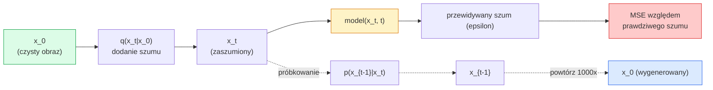

Created At: 2026-06-08T18:17:35Z
Completed At: 2026-06-08T18:17:35Z
File Path: `file:///C:/poligon/LLM_Traning/phases/04-computer-vision/10-image-generation-diffusion/docs/pl_pro.md`

# Generowanie obrazów za pomocą modeli dyfuzyjnych

> Model dyfuzyjny uczy się procesu odszumiania. Wytrenuj go, aby usuwał niewielkie ilości szumu z zaszumionego obrazu, powtórz ten krok wstecz tysiąc razy, a otrzymasz generator obrazów.

**Typ:** Kompilacja  
**Języki:** Python  
**Wymagania wstępne:** Faza 4, lekcja 07 (U-Net); faza 1, lekcja 06 (prawdopodobieństwo); faza 3, lekcja 06 (optymalizatory)  
**Czas:** ~75 minut  

## Cele nauczania

- Wyprowadzić równania procesu dodawania szumu w przód (forward process) $x_0 \to x_1 \to \dots \to x_T$ i wyjaśnić, dlaczego postać zamknięta $q(x_t | x_0)$ obowiązuje dla dowolnego kroku $t$.
- Zaimplementować funkcję celu w stylu DDPM, która minimalizuje błąd regresji szumu dodanego na każdym kroku, oraz próbnik (sampler), który pozwala odtworzyć obraz z czystego szumu.
- Zbudować warunkowaną czasem sieć U-Net (o rozmiarze pozwalającym na uczenie na CPU), przewidującą szum dla dowolnego kroku czasowego $t$.
- Wyjaśnić różnice pomiędzy próbkowaniem za pomocą DDPM i DDIM oraz wskazać scenariusze, w których każdy z nich jest odpowiedni (lekcja 23 szczegółowo omawia dopasowanie przepływu – flow matching – i przepływy skorygowane – rectified flow).

## Problem

Sieci GAN generują obrazy w jednym przebiegu (single-pass): na wejściu podawany jest szum, na wyjściu otrzymujemy obraz w ramach jednego przejścia w przód (forward pass). Są one szybkie w działaniu, lecz trudne w trenowaniu. Modele dyfuzyjne działają iteracyjnie: proces rozpoczyna się od czystego szumu, który jest odszumiany małymi krokami, aż do uzyskania finalnego obrazu.

Są powolniejsze podczas generowania, lecz znacznie łatwiejsze w trenowaniu. W ostatnich latach ta druga zaleta okazała się kluczowa: nawet małe zespoły badawcze są w stanie wytrenować model dyfuzyjny i uzyskać zadowalające rezultaty, podczas gang-y (GAN-y) wymagają ogromnego doświadczenia i wielu nieudanych prób, by zachować stabilność.

Poza stabilnością uczenia, iteracyjna natura dyfuzji umożliwia realizację niemal wszystkich współczesnych technik edycji i generowania: sterowanie tekstem (text-to-image), domalowywanie brakujących obszarów (inpainting), edycję obrazów, podnoszenie rozdzielczości (super-resolution) czy kontrolę nad stylem. Każdy krok pętli próbkowania jest momentem, w którym można nałożyć nowe ograniczenia na generowany obraz. Z tego powodu Stable Diffusion, Imagen, DALL-E 3, Midjourney oraz inne czołowe generatory obrazów opierają się właśnie na modelach dyfuzyjnych.

W tej lekcji zbudujemy minimalną wersję DDPM: proces szumowania w przód, odszumianie wstecz oraz pętlę uczenia. W kolejnej lekcji (Stable Diffusion) połączymy te elementy w kompletny system produkcyjny zawierający VAE, koder tekstu oraz metodę naprowadzania bez użycia klasyfikatora (Classifier-Free Guidance).

## Koncepcja

### Proces w przód (Forward process)

Weźmy czysty obraz $x_0$. Dodajmy niewielką ilość szumu gaussowskiego, aby otrzymać $x_1$, a następnie kolejną porcję szumu, aby uzyskać $x_2$. Powtarzamy ten krok $T$ razy, aż obraz $x_T$ stanie się praktycznie nie do odróżnienia od czystego szumu gaussowskiego.

$$q(x_t | x_{t-1}) = \mathcal{N}(x_t; \sqrt{1 - \beta_t} x_{t-1}, \beta_t \mathbf{I})$$

$\beta_t$ to harmonogram przyrostu wariancji szumu (variance schedule), na ogół rosnący liniowo od 0.0001 do 0.02 w $T=1000$ krokach. Każdy krok nieznacznie tłumi sygnał wejściowy i wprowadza nową porcję szumu.

### Postać zamknięta procesu w przód

Dodawanie szumu krok po kroku tworzy łańcuch Markowa, jednak dzięki matematycznym właściwościom sumy rozkładów gaussowskich możemy próbkować $x_t$ bezpośrednio na podstawie $x_0$ w jednym kroku.

Definiujemy $\alpha_t = 1 - \beta_t$ oraz skumulowany iloczyn $\bar{\alpha}_t = \prod_{s=1}^t \alpha_s$.

Wtedy:
$$q(x_t | x_0) = \mathcal{N}(x_t; \sqrt{\bar{\alpha}_t} x_0, (1 - \bar{\alpha}_t) \mathbf{I})$$

Równoważnie:
$$x_t = \sqrt{\bar{\alpha}_t} x_0 + \sqrt{1 - \bar{\alpha}_t} \epsilon$$
gdzie $\epsilon \sim \mathcal{N}(0, \mathbf{I})$.

To jedno równanie sprawia, że modele dyfuzyjne są tak praktyczne. Podczas uczenia losujemy krok $t$, obliczamy $x_t$ bezpośrednio z $x_0$ za pomocą powyższego wzoru i wykonujemy jeden krok optymalizacji – bez konieczności kosztownej symulacji całego łańcucha Markowa krok po kroku.

### Proces wsteczny (Reverse process)

Proces w przód jest z góry określony. Sieć neuronowa uczy się przybliżać proces wsteczny $p(x_{t-1} | x_t)$. W praktyce modele dyfuzyjne nie przewidują bezpośrednio odszumionego obrazu $x_{t-1}$, lecz starają się przewidzieć szum $\epsilon$ dodany w kroku $t$. Odszumiony stan $x_{t-1}$ wyliczany jest z tej prognozy analitycznie.



### Funkcja straty w procesie uczenia

W każdym kroku uczenia:

1. Wylosuj prawdziwy obraz $x_0$ z danych treningowych.
2. Wylosuj krok czasowy $t$ z rozkładu jednostajnego na przedziale $[1, T]$.
3. Wylosuj szum $\epsilon \sim \mathcal{N}(0, \mathbf{I})$.
4. Oblicz $x_t = \sqrt{\bar{\alpha}_t} x_0 + \sqrt{1 - \bar{\alpha}_t} \epsilon$.
5. Przewiduj szum $\epsilon_\theta(x_t, t)$ za pomocą sieci neuronowej.
6. Zminimalizuj błąd średniokwadratowy: $\mathcal{L} = \| \epsilon - \epsilon_\theta(x_t, t) \|^2$.

To wszystko. Sieć neuronowa uczy się przewidywać szum nałożony na obraz na dowolnym etapie procesu. Funkcją straty jest prosty błąd średniokwadratowy (MSE). Nie występuje tu gra przeciwników (konkurencja sieci), zapadanie się modów ani oscylacje.

### Próbkowanie (DDPM)

Aby wygenerować obraz: zaczynamy od czystego szumu $x_T \sim \mathcal{N}(0, \mathbf{I})$ i cofamy się krok po kroku:

```
dla t = T, T-1, ..., 1:
    eps = model(x_t, t)
    x_{t-1} = (1 / sqrt(alpha_t)) * (x_t - (beta_t / sqrt(1 - alpha_bar_t)) * eps) + sqrt(beta_t) * z
    gdzie z ~ N(0, I) dla t > 1, w przeciwnym razie z = 0
zwróć x_0
```

Kluczowym faktem jest to, że choć rozkład przejścia wstecznego nie jest ogólnie znany, to dla zdefiniowanego procesu w przód opartego na rozkładzie Gaussa można go wyznaczyć analitycznie. Skomplikowane współczynniki w tym wzorze wynikają bezpośrednio z zastosowania twierdzenia Bayesa.

### Dlaczego aż 1000 kroków?

Harmonogram szumowania w przód dobiera się tak, aby przyrost szumu w każdym kroku był na tyle mały, by rozkład przejścia wstecznego był bliski rozkładowi Gaussa. Jeśli kroków będzie za mało, to założenie o gaussowskim charakterze przejścia wstecznego przestanie być prawdziwe, co utrudni sieci jego modelowanie. Z kolei zbyt wiele kroków drastycznie wydłuża czas próbkowania, nie przynosząc już zauważalnej poprawy jakości. Standardem w DDPM jest wybór $T=1000$ z harmonogramem liniowym.

### DDIM: Dwudziestokrotnie szybsze próbkowanie

Proces uczenia pozostaje bez zmian; modyfikacji ulega jedynie pętla próbkowania. Model DDIM (Song i in., 2020) definiuje deterministyczny proces wsteczny, który pozwala na pomijanie kroków czasowych bez konieczności ponownego trenowania sieci. Próbkowanie w zaledwie 50 krokach za pomocą DDIM pozwala uzyskać jakość porównywalną do 1000 kroków klasycznego DDPM. Systemy produkcyjne wykorzystują DDIM lub jeszcze szybsze metody próbkowania, takie jak DPM-Solver czy Euler Ancestral.

### Warunkowanie krokiem czasowym

Sieć $\epsilon_\theta(x_t, t)$ musi znać aktualny krok czasowy $t$, dla którego dokonuje odszumiania. Współczesne modele wprowadzają informację o $t$ poprzez sinusoidalne kodowanie kroku czasowego (analogicznie do kodowania pozycyjnego w Transformerach). Te wektory kodujące są następnie rzutowane i dodawane do map cech na poszczególnych poziomach sieci U-Net.

```
t_embedding = sinusoidalne_kodowanie(t)
feature_map += MLP(t_embedding)
```

Bez warunkowania czasem sieć musiałaby wnioskować o poziomie zaszumienia wyłącznie na podstawie wyglądu obrazu $x_t$, co znacząco obniża efektywność uczenia i jakość generowania.

## Zbuduj to

### Krok 1: Harmonogram szumów (Noise Schedule)

```python
import torch

def linear_beta_schedule(T=1000, beta_start=1e-4, beta_end=2e-2):
    return torch.linspace(beta_start, beta_end, T)

def precompute_schedule(betas):
    alphas = 1.0 - betas
    alphas_cumprod = torch.cumprod(alphas, dim=0)
    return {
        "betas": betas,
        "alphas": alphas,
        "alphas_cumprod": alphas_cumprod,
        "sqrt_alphas_cumprod": torch.sqrt(alphas_cumprod),
        "sqrt_one_minus_alphas_cumprod": torch.sqrt(1.0 - alphas_cumprod),
        "sqrt_recip_alphas": torch.sqrt(1.0 / alphas),
    }

schedule = precompute_schedule(linear_beta_schedule(T=1000))
```

Wartości te obliczamy jednorazowo przed rozpoczęciem uczenia, a następnie odczytujemy odpowiednie indeksy w trakcie uczenia i próbkowania.

### Krok 2: Próbkowanie z procesu w przód (q_sample)

```python
def q_sample(x0, t, noise, schedule):
    sqrt_a = schedule["sqrt_alphas_cumprod"][t].view(-1, 1, 1, 1)
    sqrt_one_minus_a = schedule["sqrt_one_minus_alphas_cumprod"][t].view(-1, 1, 1, 1)
    return sqrt_a * x0 + sqrt_one_minus_a * noise
```

Wzór w postaci zamkniętej zapisany w jednej linijce kodu. Parametr `t` to wektor kroków czasowych – po jednym dla każdego obrazu w paczce (batchu).

### Krok 3: Lekka, warunkowana czasem sieć U-Net

```python
import torch.nn as nn
import torch.nn.functional as F
import math

def timestep_embedding(t, dim=64):
    half = dim // 2
    freqs = torch.exp(-math.log(10000) * torch.arange(half, device=t.device) / half)
    args = t[:, None].float() * freqs[None]
    emb = torch.cat([args.sin(), args.cos()], dim=-1)
    return emb

class TinyUNet(nn.Module):
    def __init__(self, img_channels=3, base=32, t_dim=64):
        super().__init__()
        self.t_mlp = nn.Sequential(
            nn.Linear(t_dim, base * 4),
            nn.SiLU(),
            nn.Linear(base * 4, base * 4),
        )
        self.t_dim = t_dim
        self.enc1 = nn.Conv2d(img_channels, base, 3, padding=1)
        self.enc2 = nn.Conv2d(base, base * 2, 4, stride=2, padding=1)
        self.mid = nn.Conv2d(base * 2, base * 2, 3, padding=1)
        self.dec1 = nn.ConvTranspose2d(base * 2, base, 4, stride=2, padding=1)
        self.dec2 = nn.Conv2d(base * 2, img_channels, 3, padding=1)
        self.time_proj = nn.Linear(base * 4, base * 2)

    def forward(self, x, t):
        t_emb = timestep_embedding(t, self.t_dim)
        t_emb = self.t_mlp(t_emb)
        t_proj = self.time_proj(t_emb)[:, :, None, None]

        h1 = F.silu(self.enc1(x))
        h2 = F.silu(self.enc2(h1)) + t_proj
        h3 = F.silu(self.mid(h2))
        d1 = F.silu(self.dec1(h3))
        d2 = torch.cat([d1, h1], dim=1)
        return self.dec2(d2)
```

Prosta, dwupoziomowa sieć U-Net z informacją o kroku czasowym wstrzykiwaną w wąskim gardle (bottleneck). Aby model radził sobie z rzeczywistymi obrazami o wyższej rozdzielczości, należy zwiększyć jego głębokość i liczbę kanałów.

### Krok 4: Krok uczenia

```python
def train_step(model, x0, schedule, optimizer, device, T=1000):
    model.train()
    x0 = x0.to(device)
    bs = x0.size(0)
    t = torch.randint(0, T, (bs,), device=device)
    noise = torch.randn_like(x0)
    x_t = q_sample(x0, t, noise, schedule)
    pred = model(x_t, t)
    loss = F.mse_loss(pred, noise)
    optimizer.zero_grad()
    loss.backward()
    optimizer.step()
    return loss.item()
```

To kompletny krok uczenia. Brak skomplikowanej rywalizacji sieci znanej z GAN, brak złożonych funkcji straty – jedynie proste obliczenie błędu średniokwadratowego (MSE).

### Krok 5: Próbkowanie stochastyczne (DDPM)

```python
@torch.no_grad()
def sample(model, schedule, shape, T=1000, device="cpu"):
    model.eval()
    x = torch.randn(shape, device=device)
    betas = schedule["betas"].to(device)
    sqrt_one_minus_a = schedule["sqrt_one_minus_alphas_cumprod"].to(device)
    sqrt_recip_alphas = schedule["sqrt_recip_alphas"].to(device)

    for t in reversed(range(T)):
        t_batch = torch.full((shape[0],), t, dtype=torch.long, device=device)
        eps = model(x, t_batch)
        coef = betas[t] / sqrt_one_minus_a[t]
        mean = sqrt_recip_alphas[t] * (x - coef * eps)
        if t > 0:
            x = mean + torch.sqrt(betas[t]) * torch.randn_like(x)
        else:
            x = mean
    return x
```

Generowanie paczki próbek wymaga wykonania 1000 przejść w przód (forward pass) przez sieć neuronową. W zastosowaniach produkcyjnych krok ten zastępuje się znacznie szybszym próbnikiem, np. 50-krokowym DDIM.

### Krok 6: Próbkowanie deterministyczne DDIM (~20x szybsze)

```python
@torch.no_grad()
def sample_ddim(model, schedule, shape, steps=50, T=1000, device="cpu", eta=0.0):
    model.eval()
    x = torch.randn(shape, device=device)
    alphas_cumprod = schedule["alphas_cumprod"].to(device)

    ts = torch.linspace(T - 1, 0, steps + 1).long()
    for i in range(steps):
        t = ts[i]
        t_prev = ts[i + 1]
        t_batch = torch.full((shape[0],), t, dtype=torch.long, device=device)
        eps = model(x, t_batch)
        a_t = alphas_cumprod[t]
        a_prev = alphas_cumprod[t_prev] if t_prev >= 0 else torch.tensor(1.0, device=device)
        x0_pred = (x - torch.sqrt(1 - a_t) * eps) / torch.sqrt(a_t)
        sigma = eta * torch.sqrt((1 - a_prev) / (1 - a_t) * (1 - a_t / a_prev))
        dir_xt = torch.sqrt(1 - a_prev - sigma ** 2) * eps
        noise = sigma * torch.randn_like(x) if eta > 0 else 0
        x = torch.sqrt(a_prev) * x0_pred + dir_xt + noise
    return x
```

Dla wartości `eta=0.0` proces jest w pełni deterministyczny (ten sam początkowy szum zawsze wygeneruje identyczny obraz końcowy). Ustawienie `eta=1.0` pozwala odtworzyć stochastyczne zachowanie próbkowania DDPM.

## Użyj tego

W projektach produkcyjnych zaleca się korzystanie z biblioteki `diffusers`:

```python
from diffusers import DDPMScheduler, UNet2DModel

unet = UNet2DModel(sample_size=32, in_channels=3, out_channels=3, layers_per_block=2)
scheduler = DDPMScheduler(num_train_timesteps=1000)
```

Biblioteka ta dostarcza zoptymalizowane implementacje harmonogramów szumu (DDPM, DDIM, DPM-Solver, Euler, Heun), elastyczne architektury U-Net, kompletne potoki (pipelines) dla zadań typu text-to-image oraz image-to-image, a także wsparcie dla technik szybkiego dostrajania (LoRA).

Do celów badawczych i eksperymentalnych biblioteka `k-diffusion` (autorstwa Katherine Crowson) oferuje jedne z najbardziej precyzyjnych implementacji matematycznych oraz zaawansowane metody próbkowania.

## Wyślij to

Niniejsza lekcja dostarcza:

- `outputs/prompt-diffusion-sampler-picker.md` – prompt ułatwiający dobór odpowiedniego próbnik (DDPM, DDIM, DPM-Solver, Euler) na podstawie wymagań dotyczących jakości, dopuszczalnych opóźnień (latency) oraz rodzaju warunkowania.
- `outputs/skill-noise-schedule-designer.md` – narzędzie generujące harmonogramy szumu (liniowe, cosinusowe lub sigmoidalne) dla określonej liczby kroków $T$, wraz z wykresami diagnostycznymi stosunku sygnału do szumu (SNR) w czasie.

## Ćwiczenia

1. **(Łatwe)** Zaimplementuj wizualizację procesu w przód: dla wybranego obrazu wygeneruj i wyświetl stany $x_t$ dla kroków $t \in [0, 100, 250, 500, 750, 1000]$. Upewnij się, że próbka dla $t=1000$ nie różni się wizualnie od czystego szumu gaussowskiego.
2. **(Średnie)** Wytrenuj model TinyUNet na syntetycznym zbiorze danych z kołami przez 20 epok, a następnie wygeneruj 16 próbnych obrazów. Porównaj wyniki próbkowania stochastycznego DDPM (1000 kroków) oraz deterministycznego DDIM (50 kroków) – sprawdź, czy dla tej samej wejściowej macierzy szumu oba samplery wygenerują podobne obrazy.
3. **(Trudne)** Zaimplementuj cosinusowy harmonogram szumu (zaproponowany przez Nichola i Dhariwala, 2021): $\bar{\alpha}_t = \cos^2\left(\frac{t/T + s}{1 + s} \cdot \frac{\pi}{2}\right)$. Wytrenuj ten sam model, korzystając z harmonogramu liniowego oraz cosinusowego, a następnie wykaż, że harmonogram cosinusowy generuje lepsze jakościowo próbki przy małej liczbie kroków odszumiania.

## Kluczowe terminy

| Termin | Obiegowe określenie | Co to oznacza w rzeczywistości |
|------|----------------|----------------------|
| Proces w przód (Forward process) | „Stopniowe dodawanie szumu” | Z góry określony łańcuch Markowa przekształcający obraz w szum gaussowski w $T$ krokach |
| Proces wsteczny (Reverse process) | „Iteracyjne odszumianie” | Wyuczony przez sieć rozkład prawdopodobieństwa przejść od szumu do czystego obrazu |
| Predykcja szumu (Epsilon prediction) | „Prognozowanie dodanego szumu” | Cel uczenia sieci: model $\epsilon_\theta(x_t, t)$ uczy się przewidywać dokładny szum nałożony w kroku $t$ |
| Harmonogram wariancji szumu (Beta schedule) | „Poziomy szumu” | Ciąg $T$ wartości wariancji określających ilość szumu dodawanego w poszczególnych krokach |
| $\bar{\alpha}_t$ | „Skumulowany współczynnik zachowania sygnału” | Iloczyn wartości $(1 - \beta_s)$ dla kroków od 1 do $t$; im większe $t$, tym mniejszy udział oryginalnego obrazu |
| Sampler DDPM | Stochastyczny, generatywny | Próbkuje stany $x_{t-1}$ z warunkowego rozkładu Gaussa; wymaga zazwyczaj 1000 kroków |
| Sampler DDIM | Deterministyczny, przyspieszony | Formułuje próbkowanie jako rozwiązywanie deterministycznego równania różniczkowego zwyczajnego (ODE); wymaga tylko 20-100 kroków do uzyskania dobrej jakości |
| Warunkowanie krokiem czasowym | „Wskazanie kroku $t$” | Wstrzykiwanie sinusoidalnego kodowania kroku $t$ do sieci U-Net, aby model dostosował działanie do bieżącego poziomu zaszumienia |

## Literatura uzupełniająca

- [Denoising Diffusion Probabilistic Models (Ho et al., 2020)](https://arxiv.org/abs/2006.11239) – kluczowa praca, która dowiodła praktycznej użyteczności modeli dyfuzyjnych i pozwoliła im prześcignąć GAN-y pod względem metryki FID.
- [Improved Denoising Diffusion Probabilistic Models (Nichol i Dhariwal, 2021)](https://arxiv.org/abs/2102.09672) – wprowadzenie cosinusowego harmonogramu szumu oraz parametryzacji wariancji.
- [Denoising Diffusion Implicit Models (Song, Meng, Ermon, 2020)](https://arxiv.org/abs/2010.02502) – wprowadzenie deterministycznego samplera, co znacznie przyspieszyło generowanie obrazów.
- [Elucidating the Design Space of Diffusion-Based Generative Models (Karras et al., 2022)](https://arxiv.org/abs/2206.00364) – systematyczne uporządkowanie przestrzeni projektowej modeli dyfuzyjnych; obecnie najlepsze kompendium wiedzy o detalach implementacyjnych.
