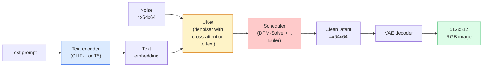

# Stable Diffusion — Architektura i Fine-Tuning

> Stable Diffusion to DDPM działający w przestrzeni latentnej wstępnie wytrenowanego VAE, warunkowany na tekst poprzez cross-attention, próbkowany za pomocą szybkiego deterministycznego solvera ODE i kierowany przez classifier-free guidance.

**Typ:** Nauka + Zastosowanie
**Języki:** Python
**Wymagania wstępne:** Faza 4 Lekcja 10 (Dyfuzja), Faza 7 Lekcja 02 (Self-Attention)
**Czas:** ~75 minut

## Cele nauki

- Przejść przez pięć elementów potoku Stable Diffusion: VAE, encoder tekstu, U-Net, scheduler, safety checker — i co każdy z nich faktycznie robi
- Wyjaśnić dyfuzję latentną i dlaczego trenowanie w 4x64x64 przestrzeni latentnej (zamiast w obrazie 3x512x512) redukuje obciążenie obliczeniowe 48x bez utraty jakości
- Użyć `diffusers` do generowania obrazów, uruchomienia image-to-image, inpaintingu i generacji sterowanej przez ControlNet
- Dostrojić Stable Diffusion za pomocą LoRA na małym własnym zbiorze danych i wczytać adapter LoRA podczas inferencji

## Problem

Trenowanie DDPM bezpośrednio na obrazach RGB 512x512 jest kosztowne. Każdy krok treningowy wymaga backpropagacji przez U-Net, który widzi 3x512x512 = 786 432 wartości wejściowych, a samplowanie wymaga 50+ przejść w przód przez ten sam U-Net. Na poziomie jakości Stable Diffusion 1.5 (wydanego w 2022), dyfuzja w przestrzeni pikseli wymagałaby około 256 GPU-miesięcy treningu i 10-30 sekund na obraz na konsumenckim GPU.

Sztuczką, która sprawiła, że text-to-image z otwartymi wagami stał się praktyczny, była **dyfuzja latentna** (Rombach i in., CVPR 2022). Wytrenuj VAE, który mapuje obraz 3x512x512 na tensor latentny 4x64x64 i z powrotem, a następnie wykonuj dyfuzję w tej przestrzeni latentnej. Obciążenie obliczeniowe spada o `(3*512*512)/(4*64*64) = 48x`. Samplowanie spada z dziesiątek sekund do poniżej dwóch sekund na tym samym GPU.

Prawie każdy nowoczesny model generowania obrazów — SDXL, SD3, FLUX, HunyuanDiT, Wan-Video — jest modelem dyfuzji latentnej z wariacjami autoenkodera, denoisera (U-Net lub DiT) i warunkowania tekstowego. Naucz się Stable Diffusion i poznasz cały szablon.

## Koncepcja

### Potok przetwarzania



- **VAE** — zamrożony autoenkoder. Encoder zamienia obraz na latenty (używane w img2img i treningu). Decoder zamienia latenty z powrotem w obraz.
- **Encoder tekstu** — encoder tekstu CLIP (SD 1.x/2.x), CLIP-L + CLIP-G (SDXL) lub T5-XXL (SD3/FLUX). Produkuje sekwencję embeddingów tokenów.
- **U-Net** — denoiser. Posiada warstwy cross-attention, które kierują uwagę z latentów na embedding tekstu na każdym poziomie rozdzielczości.
- **Scheduler** — algorytm samplowania (DDIM, Euler, DPM-Solver++). Wybiera sigmy, miesza przewidziany szum z powrotem do latentu.
- **Safety checker** — opcjonalny filtr NSFW / nielegalnej zawartości na wyjściowym obrazie.

### Classifier-free guidance (CFG)

Zwykłe warunkowanie tekstowe uczy się `epsilon_theta(x_t, t, c)` dla każdego promptu `c`. CFG trenuje tę samą sieć, w której `c` jest odrzucane w 10% przypadków (zastępowane przez puste embeddingi), co daje pojedynczy model przewidujący zarówno warunkowy, jak i niewarunkowy szum. Przy inferencji:

```
eps = eps_uncond + w * (eps_cond - eps_uncond)
```

`w` to skala guidance. `w=0` jest niewarunkowe, `w=1` jest zwykłym warunkowaniem, `w>1` przesuwa wynik w stronę "bardziej warunkowanego na promptcie" za cenę różnorodności. Wartość domyślna SD to `w=7.5`.

CFG jest powodem, dla którego text-to-image działa na poziomie jakości produkcyjnej. Bez niej prompty słabo wpływają na wynik; z nią prompty dominują.

### Geometria przestrzeni latentnej

4-kanałowy latent VAE to nie tylko skompresowany obraz. Jest to mnogość (manifold), na której arytmetyka odpowiada z grubsza edycjom semantycznym (prompt engineering i interpolacja oba żyją tutaj), i na której U-Net dyfuzyjny został wytrenowany do wydawania całego swojego budżetu modelowania. Dekodowanie losowego latentu 4x64x64 nie produkuje obrazu wyglądającego losowo — produkuje śmieci, ponieważ tylko konkretna podmnogość latentów dekoduje się do prawidłowych obrazów.

Dwie konsekwencje:

1. **Img2img** = zakoduj obraz do latentu, dodaj częściowy szum, uruchom denoiser, zdekoduj. Struktura obrazu przetrwa, ponieważ kodowanie jest bliskie odwracalności; treść zmienia się na podstawie promptu.
2. **Inpainting** = to samo co img2img, ale denoiser aktualizuje tylko maskowane regiony; niemaskowane regiony są zachowywane na poziomie zakodowanego latentu.

### Architektura U-Net

U-Net SD jest większą wersją TinyUNet z Lekcji 10 z trzema dodatkami:

- **Blokami transformera** na każdej rozdzielczości przestrzennej, zawierającymi self-attention + cross-attention do embeddingu tekstu.
- **Embeddingiem czasu** poprzez MLP na sinusoidalnym kodowaniu.
- **Skip connections** między encoderem i decoderem na odpowiadających sobie rozdzielczościach.

Łączna liczba parametrów w SD 1.5: ~860M. SDXL: ~2,6B. FLUX: ~12B. Skok w liczbie parametrów jest głównie w warstwach attention.

### Fine-tuning LoRA

Pełne dostrajanie (fine-tuning) Stable Diffusion wymaga 20+ GB VRAM i aktualizacji 860M parametrów. LoRA (Low-Rank Adaptation) trzyma model bazowy zamrożony i wstrzykuje małe macierze rozkładu niskiego rzędu w warstwy attention. Adapter LoRA dla SD ma typowo 10-50 MB, trenuje się 10-60 minut na pojedynczym konsumenckim GPU i wczytuje się przy inferencji jako modyfikacja "plug-and-play".

```
Original: W_q : (d_in, d_out)   frozen
LoRA:     W_q + alpha * (A @ B)   where A : (d_in, r), B : (r, d_out)

r is typically 4-32.
```

LoRA jest sposobem, w jaki rozpowszechniana jest prawie każda społecznościowa wersja fine-tune. CivitAI i Hugging Face hostują ich miliony.

### Schedulery, które zobaczysz

- **DDIM** — deterministyczny, ~50 kroków, prosty.
- **Euler ancestral** — stochastyczny, 30-50 kroków, lekko bardziej kreatywne próbki.
- **DPM-Solver++ 2M Karras** — deterministyczny, 20-30 kroków, domyślny w produkcji.
- **LCM / TCD / Turbo** — modele consistency i wersje destylowane; 1-4 kroki za cenę pewnej jakości.

Zamiana schedulerów to jednolinijkowa zmiana w `diffusers` i czasami naprawia problemy z próbkami bez żadnego retreningu.

## Zbuduj to

Ta lekcja używa `diffusers` od początku do końca, zamiast odbudowywać Stable Diffusion od zera. Elementy, które musiałbyś odbudować (VAE, encoder tekstu, U-Net, scheduler) są tematami osobnych lekcji; tutaj celem jest płynność w korzystaniu z produkcyjnego API.

### Krok 1: Text-to-image

```python
import torch
from diffusers import StableDiffusionPipeline

pipe = StableDiffusionPipeline.from_pretrained(
    "runwayml/stable-diffusion-v1-5",
    torch_dtype=torch.float16,
).to("cuda")

image = pipe(
    prompt="a dog riding a skateboard in tokyo, studio ghibli style",
    guidance_scale=7.5,
    num_inference_steps=25,
    generator=torch.Generator("cuda").manual_seed(42),
).images[0]
image.save("dog.png")
```

`float16` redukuje VRAM o połowę bez widocznej utraty jakości. `num_inference_steps=25` z domyślnym DPM-Solver++ daje wynik porównywalny do `num_inference_steps=50` z DDIM.

### Krok 2: Zamiana schedulera

```python
from diffusers import DPMSolverMultistepScheduler, EulerAncestralDiscreteScheduler

pipe.scheduler = DPMSolverMultistepScheduler.from_config(pipe.scheduler.config)
pipe.scheduler = EulerAncestralDiscreteScheduler.from_config(pipe.scheduler.config)
```

Stan schedulera jest odseparowany od wag U-Net. Możesz trenować na DDPM i samplować z dowolnym schedulerem.

### Krok 3: Image-to-image

```python
from diffusers import StableDiffusionImg2ImgPipeline
from PIL import Image

img2img = StableDiffusionImg2ImgPipeline.from_pretrained(
    "runwayml/stable-diffusion-v1-5",
    torch_dtype=torch.float16,
).to("cuda")

init_image = Image.open("dog.png").convert("RGB").resize((512, 512))
out = img2img(
    prompt="a dog riding a skateboard, oil painting",
    image=init_image,
    strength=0.6,
    guidance_scale=7.5,
).images[0]
```

`strength` to ilość szumu dodawanego przed denoisingiem (0,0 = bez zmian, 1,0 = pełna regeneracja). 0,5-0,7 to standardowy zakres dla transferu stylu.

### Krok 4: Inpainting

```python
from diffusers import StableDiffusionInpaintPipeline

inpaint = StableDiffusionInpaintPipeline.from_pretrained(
    "runwayml/stable-diffusion-inpainting",
    torch_dtype=torch.float16,
).to("cuda")

image = Image.open("dog.png").convert("RGB").resize((512, 512))
mask = Image.open("dog_mask.png").convert("L").resize((512, 512))

out = inpaint(
    prompt="a cat",
    image=image,
    mask_image=mask,
    guidance_scale=7.5,
).images[0]
```

Białe piksele w masce to obszar do regeneracji. Czarne piksele są zachowywane.

### Krok 5: Wczytywanie LoRA

```python
pipe.load_lora_weights("sayakpaul/sd-lora-ghibli")
pipe.fuse_lora(lora_scale=0.8)

image = pipe(prompt="a village square in ghibli style").images[0]
```

`lora_scale` kontroluje siłę; 0,0 = brak efektu, 1,0 = pełny efekt. `fuse_lora` zaszywa adapter w wagi na miejscu dla szybkości, ale blokuje możliwość zamiany. Wywołaj `pipe.unfuse_lora()` przed wczytaniem innego adaptera.

### Krok 6: Trening LoRA (szkic)

Prawdziwy trening LoRA odbywa się w `peft` lub `diffusers.training`. Zarys:

```python
# Pseudocode
for step, batch in enumerate(dataloader):
    images, prompts = batch
    latents = vae.encode(images).latent_dist.sample() * 0.18215

    t = torch.randint(0, num_train_timesteps, (batch_size,))
    noise = torch.randn_like(latents)
    noisy_latents = scheduler.add_noise(latents, noise, t)

    text_emb = text_encoder(tokenizer(prompts))

    pred_noise = unet(noisy_latents, t, text_emb)  # LoRA weights injected here

    loss = F.mse_loss(pred_noise, noise)
    loss.backward()
    optimizer.step()
```

Tylko macierze LoRA otrzymują gradient; bazowy U-Net, VAE i encoder tekstu są zamrożone. Z batch size 1 i gradient checkpointing to mieści się w 8 GB VRAM.

## Zastosuj to

W produkcji decyzje, które rzeczywiście podejmujesz:

- **Rodzina modelu**: SD 1.5 dla open-source'owych fine-tune'ów społeczności, SDXL dla wyższej wierności, SD3 / FLUX dla najnowocześniejszych wyników i ścisłych wymagań licencyjnych.
- **Scheduler**: DPM-Solver++ 2M Karras dla 20-30 kroków, LCM-LoRA gdy latencja musi być poniżej 1s.
- **Precyzja**: `float16` na 4080/4090, `bfloat16` na A100 i nowszych, `int8` (przez `bitsandbytes` lub `compel`) gdy VRAM jest ograniczone.
- **Warunkowanie**: zwykły tekst działa; dla silniejszej kontroli dodaj ControlNet (canny, depth, pose) na bazowy potok.

Dla generacji wsadowej, `AUTO1111` / `ComfyUI` są narzędziami społecznościowymi; dla produkcyjnych API, `diffusers` + `accelerate` lub `optimum-nvidia` z kompilacją TensorRT.

## Wypchnij to

Ta lekcja produkuje:

- `outputs/prompt-sd-pipeline-planner.md` — prompt, który wybiera SD 1.5 / SDXL / SD3 / FLUX wraz ze schedulerem i precyzją w oparciu o budżet latencji, cel wierności i ograniczenia licencyjne.
- `outputs/skill-lora-training-setup.md` — skill, który pisze pełną konfigurację treningu LoRA dla własnego zbioru danych, włączając opisy (captions), rangę, batch size i learning rate.

## Ćwiczenia

1. **(Łatwe)** Wygeneruj ten sam prompt z `guidance_scale` w `[1, 3, 5, 7.5, 10, 15]`. Opisz, jak zmienia się obraz. Przy jakiej wartości guidance pojawiają się artefakty?
2. **(Średnie)** Weź dowolną rzeczywistą fotografię, przepuść ją przez `StableDiffusionImg2ImgPipeline` z `strength` w `[0.2, 0.4, 0.6, 0.8, 1.0]`. Która wartość strength zachowuje kompozycję, jednocześnie zmieniając styl? Czemu 1,0 całkowicie ignoruje wejście?
3. **(Trudne)** Wytrenuj LoRA na 10-20 obrazach pojedynczego podmiotu (zwierzę domowe, logo, postać) i wygeneruj nowe scenki z tym podmiotem. Podaj rangę LoRA i liczbę kroków treningu, które dały najlepsze zachowanie tożsamości bez przeuczenia na obrazach wejściowych.

## Kluczowe terminy

| Termin | Co mówią ludzie | Co to faktycznie znaczy |
|------|----------------|----------------------|
| Latent diffusion | "Dyfuzja w latentach" | Uruchomienie całego DDPM w przestrzeni latentnej VAE (4x64x64) zamiast w przestrzeni pikseli (3x512x512); 48x oszczędności obliczeniowych |
| VAE scale factor | "0,18215" | Konstanta, która przeskalowuje surowy latent VAE do w przybliżeniu jednostkowej wariancji; zakodowana na sztywno w każdym potoku SD |
| Classifier-free guidance | "CFG" | Miksowanie warunkowych i niewarunkowych przewidywań szumu; jednoznacznie najbardziej wpływowy parametr przy inferencji |
| Scheduler | "Sampler" | Algorytm, który zamienia szum + przewidywania modelu w trajektorię odszumionego latentu |
| LoRA | "Adapter niskiego rzędu" | Małe macierze rozkładu niskiego rzędu, które dostrajają warstwy attention bez dotykania wag bazowych |
| Cross-attention | "Attention tekst-obraz" | Attention z tokenów latentnych do tokenów tekstowych; wstrzykuje informację z promptu na każdym poziomie U-Net |
| ControlNet | "Warunkowanie strukturą" | Osobno wytrenowany adapter, który kieruje SD za pomocą dodatkowego wejścia (canny, depth, pose, segmentacja) |
| DPM-Solver++ | "Domyślny scheduler" | Deterministyczny solver ODE drugiego rzędu; najlepsza jakość przy małej liczbie kroków (20-30) w 2026 roku |

## Dalsze materiały

- [High-Resolution Image Synthesis with Latent Diffusion (Rombach i in., 2022)](https://arxiv.org/abs/2112.10752) — praca o Stable Diffusion; zawiera każdą ablację, która uzasadnia ten projekt
- [Classifier-Free Diffusion Guidance (Ho & Salimans, 2022)](https://arxiv.org/abs/2207.12598) — praca o CFG
- [LoRA: Low-Rank Adaptation of Large Language Models (Hu i in., 2021)](https://arxiv.org/abs/2106.09685) — LoRA zostało stworzone najpierw dla NLP; przeniosło się do SD z prawie żadnymi zmianami
- [Dokumentacja diffusers](https://huggingface.co/docs/diffusers) — referencja dla każdego potoku SD / SDXL / SD3 / FLUX
