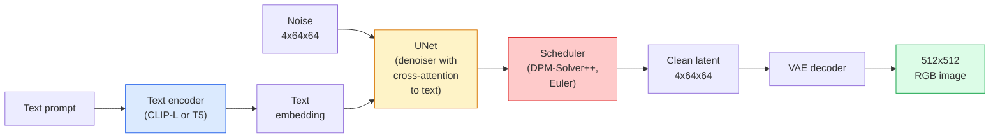

# Stabilna dyfuzja — architektura i dostrajanie

> Stable Diffusion to DDPM działający w ukrytej przestrzeni wstępnie wyszkolonego VAE, warunkowany tekstem poprzez wzajemne uwagi, próbkowany za pomocą szybkiego deterministycznego solwera ODE i sterowany przez wskazówki wolne od klasyfikatorów.

**Wpisz:** Ucz się + Używaj
**Języki:** Python
**Wymagania wstępne:** Faza 4, lekcja 10 (dyfuzja), faza 7, lekcja 02 (samouważność)
**Czas:** ~75 minut

## Cele nauczania

- Prześledź pięć elementów rurociągu stabilnej dyfuzji: VAE, koder tekstu, U-Net, program planujący, moduł sprawdzania bezpieczeństwa - i co właściwie każdy z nich robi
— Wyjaśnij utajone rozpowszechnianie i dlaczego szkolenie w ukrytej przestrzeni 4x64x64 (zamiast obrazu 3x512x512) zmniejsza moc obliczeniową 48x bez utraty jakości
- Użyj `diffusers` do generowania obrazów, uruchamiania obrazu na obraz, malowania i generowania pod kontrolą ControlNet
- Dostosuj stabilną dyfuzję za pomocą LoRA na małym, niestandardowym zestawie danych i załaduj adapter LoRA podczas wnioskowania

## Problem

Uczenie DDPM bezpośrednio na obrazach RGB o rozdzielczości 512x512 jest kosztowne. Każdy etap szkolenia odbywa się za pośrednictwem sieci U-Net, która widzi 3x512x512 = 786 432 wartości wejściowych, a próbkowanie obejmuje ponad 50 przejść w przód przez tę samą sieć U-Net. Na poziomie jakości Stable Diffusion 1.5 (wydanej w 2022 r.) dyfuzja w przestrzeni pikseli wymagałaby około 256 miesięcy szkolenia na GPU i 10–30 sekund na obraz na konsumenckim procesorze graficznym.

Sztuczką, która sprawiła, że ​​zamiana tekstu na obraz o otwartej wadze stała się praktyczna, było **utajone rozpowszechnianie** (Rombach i in., CVPR 2022). Wytrenuj VAE, który odwzorowuje obraz 3x512x512 na utajony tensor 4x64x64 i odwrotnie, a następnie wykonaj dyfuzję w tej utajonej przestrzeni. Obliczenia spadają o `(3*512*512)/(4*64*64) = 48x`. Próbkowanie spada z kilkudziesięciu sekund do poniżej dwóch sekund na tym samym procesorze graficznym.

Prawie każdy nowoczesny model generowania obrazu — SDXL, SD3, FLUX, HunyuanDiT, Wan-Video — to model dyfuzji ukrytej z odmianami autoenkodera, denoisera (U-Net lub DiT) i warunkowania tekstu. Naucz się stabilnej dyfuzji, a poznasz szablon.

## Koncepcja

### Rurociąg



- **VAE** — zamrożony autoenkoder. Koder zamienia obraz w ukryte elementy (używane do img2img i szkolenia). Dekoder zamienia ukryte informacje z powrotem w obraz.
- **Koder tekstu** — Koder tekstu CLIP (SD 1.x/2.x), CLIP-L + CLIP-G (SDXL) lub T5-XXL (SD3/FLUX). Tworzy sekwencję osadzania tokenów.
- **U-Net** — odszumiacz. Posiada warstwy wzajemnej uwagi, które obsługują od ukrytych do osadzania tekstu na każdym poziomie rozdzielczości.
- **Scheduler** — algorytm próbkowania (DDIM, Euler, DPM-Solver++). Wybiera sigma i łączy przewidywany szum z powrotem w utajony.
- **Weryfikator bezpieczeństwa** — opcjonalny filtr NSFW / nielegalnych treści na obrazie wyjściowym.

### Wytyczne bez klasyfikatorów (CFG)

Warunkowanie zwykłego tekstu uczy się `epsilon_theta(x_t, t, c)` dla każdego monitu `c`. CFG trenuje tę samą sieć, przy czym wartość `c` spadła w 10% przypadków (zastąpiona pustym osadzeniem), dając pojedynczy model przewidujący zarówno szum warunkowy, jak i bezwarunkowy. Wnioskując:

```
eps = eps_uncond + w * (eps_cond - eps_uncond)
```

`w` to skala wskazówek. `w=0` jest bezwarunkowy, `w=1` jest zwykły warunkowy, `w>1` sprawia, że ​​dane wyjściowe są „bardziej uzależnione od podpowiedzi” kosztem różnorodności. Wartość domyślna SD to `w=7.5`.

CFG jest powodem, dla którego zamiana tekstu na obraz działa z jakością produkcyjną. Bez tego monity słabo wpływają na wyjście; wraz z nim dominują podpowiedzi.

### Geometria przestrzeni ukrytej

Ukryty 4-kanałowy obraz VAE to nie tylko skompresowany obraz. Jest to rozmaitość, w której arytmetyka z grubsza odpowiada edycjom semantycznym (oba funkcje: szybka inżynieria + interpolacja) i w której sieć U-Net dyfuzyjna została przeszkolona do wydawania całego budżetu na modelowanie. Dekodowanie losowego ukrytego obrazu 4x64x64 nie daje losowo wyglądającego obrazu — generuje śmieci, ponieważ tylko określona podrozmaitość ukrytych elementów dekoduje prawidłowe obrazy.

Dwie konsekwencje:

1. **Img2img** = zakoduj obraz do stanu ukrytego, dodaj częściowy szum, uruchom funkcję usuwania szumów, dekoduj. Struktura obrazu przetrwała, ponieważ kodowanie jest prawie odwracalne; treść zmienia się w oparciu o monit.
2. **Inpainting** = to samo co img2img, ale denoiser aktualizuje tylko zamaskowane obszary; niezamaskowane regiony są przechowywane w zakodowanym stanie ukrytym.

### Architektura U-Net

SD U-Net to duża wersja TinyUNet z Lekcji 10 z trzema dodatkami:

- **Bloki transformatorowe** w każdej rozdzielczości przestrzennej, zawierające samouważność + uwagę krzyżową na osadzanie tekstu.
- **Osadzanie czasu** poprzez MLP przy kodowaniu sinusoidalnym.
- **Pomiń połączenia** między koderem i dekoderem przy pasujących rozdzielczościach.

Parametry całkowite w SD 1.5: ~860M. SDXL: ~2,6B. STRUMIEŃ: ~12B. Skok w paramach następuje głównie w warstwach uwagi.

### Dostrajanie LoRA

Pełne dostrojenie Stable Diffusion wymaga ponad 20 GB pamięci VRAM i aktualizuje parametry 860M. LoRA (adaptacja niskiego rangi) utrzymuje model podstawowy w stanie zamrożenia i wstrzykuje małe macierze rozkładu rang do warstw uwagi. Adapter LoRA dla SD ma zazwyczaj 10–50 MB, można go trenować w ciągu 10–60 minut na pojedynczym konsumenckim procesorze graficznym i ładuje się w czasie wnioskowania jako modyfikacja typu drop-in.

```
Original: W_q : (d_in, d_out)   frozen
LoRA:     W_q + alpha * (A @ B)   where A : (d_in, r), B : (r, d_out)

r is typically 4-32.
```

LoRA to sposób, w jaki dystrybuowane są prawie wszystkie poprawki społeczności. CivitAI i Hugging Face obsługują ich miliony.

### Harmonogramy, które zobaczysz

- **DDIM** — deterministyczny, ~50 kroków, prosty.
- **Przodek Eulera** — stochastyczny, 30-50 kroków, nieco bardziej kreatywne próbki.
- **DPM-Solver++ 2M Karras** — deterministyczny, 20-30 kroków, domyślne ustawienia produkcyjne.
- **LCM / TCD / Turbo** – modele konsystencji i warianty destylowane; 1-4 kroki kosztem pewnej jakości.

Zamiana harmonogramów to jednowierszowa zmiana w `diffusers` i czasami rozwiązuje przykładowe problemy bez ponownego szkolenia.

## Zbuduj to

W tej lekcji zastosowano `diffusers` od początku do końca, zamiast odbudowywać wersję Stable Diffusion od zera. Elementy, które musiałbyś przebudować (VAE, koder tekstu, U-Net, program planujący) są tematami odrębnych lekcji; tutaj celem jest płynność korzystania z produkcyjnego API.

### Krok 1: Zamiana tekstu na obraz

```python
import torch
from diffusers import StableDiffusionPipeline

pipe = StableDiffusionPipeline.from_pretrained(
    "runwayml/stable-diffusion-v1-5",
    torch_dtype=torch.float16,
).to("cuda")

image = pipe(
    prompt="a dog riding a skateboard in tokyo, studio ghibli style",
    guidance_scale=7.5,
    num_inference_steps=25,
    generator=torch.Generator("cuda").manual_seed(42),
).images[0]
image.save("dog.png")
```

`float16` zmniejsza o połowę pamięć VRAM bez widocznej utraty jakości. `num_inference_steps=25` z domyślnym DPM-Solver++ pasuje do `num_inference_steps=50` z DDIM.

### Krok 2: Zamień harmonogram

```python
from diffusers import DPMSolverMultistepScheduler, EulerAncestralDiscreteScheduler

pipe.scheduler = DPMSolverMultistepScheduler.from_config(pipe.scheduler.config)
pipe.scheduler = EulerAncestralDiscreteScheduler.from_config(pipe.scheduler.config)
```

Stan harmonogramu jest oddzielony od wag U-Net. Możesz trenować w DDPM i próbkować za pomocą dowolnego harmonogramu.

### Krok 3: Obraz do obrazu

```python
from diffusers import StableDiffusionImg2ImgPipeline
from PIL import Image

img2img = StableDiffusionImg2ImgPipeline.from_pretrained(
    "runwayml/stable-diffusion-v1-5",
    torch_dtype=torch.float16,
).to("cuda")

init_image = Image.open("dog.png").convert("RGB").resize((512, 512))
out = img2img(
    prompt="a dog riding a skateboard, oil painting",
    image=init_image,
    strength=0.6,
    guidance_scale=7.5,
).images[0]
```

`strength` określa ilość szumu, którą należy dodać przed odszumianiem (0,0 = bez zmian, 1,0 = pełna regeneracja). 0,5-0,7 to standardowy zakres przenoszenia stylu.

### Krok 4: Malowanie

```python
from diffusers import StableDiffusionInpaintPipeline

inpaint = StableDiffusionInpaintPipeline.from_pretrained(
    "runwayml/stable-diffusion-inpainting",
    torch_dtype=torch.float16,
).to("cuda")

image = Image.open("dog.png").convert("RGB").resize((512, 512))
mask = Image.open("dog_mask.png").convert("L").resize((512, 512))

out = inpaint(
    prompt="a cat",
    image=image,
    mask_image=mask,
    guidance_scale=7.5,
).images[0]
```

Białe piksele w masce to obszar wymagający regeneracji. Czarne piksele zostają zachowane.

### Krok 5: Ładowanie LoRA

```python
pipe.load_lora_weights("sayakpaul/sd-lora-ghibli")
pipe.fuse_lora(lora_scale=0.8)

image = pipe(prompt="a village square in ghibli style").images[0]
```

`lora_scale` kontroluje siłę; 0,0 = brak efektu, 1,0 = pełny efekt. `fuse_lora` umieszcza adapter w obciążnikach na miejscu, aby zwiększyć szybkość, ale zapobiega zamianie. Wywołaj `pipe.unfuse_lora()` przed załadowaniem innego adaptera.

### Krok 6: Szkolenie LoRA (szkic)

Prawdziwe szkolenie LoRA odbywa się w `peft` lub `diffusers.training`. Zarys:

```python
# Pseudocode
for step, batch in enumerate(dataloader):
    images, prompts = batch
    latents = vae.encode(images).latent_dist.sample() * 0.18215

    t = torch.randint(0, num_train_timesteps, (batch_size,))
    noise = torch.randn_like(latents)
    noisy_latents = scheduler.add_noise(latents, noise, t)

    text_emb = text_encoder(tokenizer(prompts))

    pred_noise = unet(noisy_latents, t, text_emb)  # LoRA weights injected here

    loss = F.mse_loss(pred_noise, noise)
    loss.backward()
    optimizer.step()
```

Tylko macierze LoRA otrzymują gradient; podstawowa sieć U-Net, VAE i koder tekstu są zablokowane. Przy wielkości partii 1 i punkcie kontrolnym gradientu mieści się to w 8 GB pamięci VRAM.

## Użyj tego

W produkcji decyzje, które faktycznie podejmujesz:

- **Rodzina modeli**: SD 1.5 dla ulepszeń społeczności open source, SDXL dla wyższej wierności, SD3 / FLUX dla najnowocześniejszych i rygorystycznych wymagań licencyjnych.
- **Scheduler**: DPM-Solver++ 2M Karras dla 20-30 kroków, LCM-LoRA, gdy opóźnienie jest mniejsze niż 1s.
- **Precyzja**: `float16` na 4080/4090, `bfloat16` na A100 i nowszych, `int8` (przez `bitsandbytes` lub `compel`), gdy pamięć VRAM jest zajęta.
- **Kondycjonowanie**: działa zwykły tekst; aby uzyskać lepszą kontrolę, dodaj ControlNet (spryt, głębokość, pozycja) na wierzchu rurociągu podstawowego.

Do generowania wsadowego narzędziami społecznościowymi są `AUTO1111` / `ComfyUI`; w przypadku produkcyjnych interfejsów API `diffusers` + `accelerate` lub `optimum-nvidia` z kompilacją TensorRT.

## Wyślij to

Ta lekcja daje:

- `outputs/prompt-sd-pipeline-planner.md` — monit, który wybiera SD 1.5 / SDXL / SD3 / FLUX plus harmonogram i precyzję, biorąc pod uwagę budżet opóźnień, docelową dokładność i ograniczenia licencyjne.
- `outputs/skill-lora-training-setup.md` — umiejętność polegająca na pisaniu pełnej konfiguracji szkoleniowej LoRA dla niestandardowego zestawu danych, w tym podpisów, rangi, rozmiaru partii i szybkości uczenia się.

## Ćwiczenia

1. **(Łatwe)** Wygeneruj ten sam monit za pomocą `guidance_scale` w `[1, 3, 5, 7.5, 10, 15]`. Opisz, jak zmienia się obraz. Przy jakiej wartości orientacyjnej pojawiają się artefakty?
2. **(Średni)** Zrób dowolne prawdziwe zdjęcie i przepuść je przez `StableDiffusionImg2ImgPipeline` w `strength` w `[0.2, 0.4, 0.6, 0.8, 1.0]`. Która siła zachowuje kompozycję przy zmianie stylu? Dlaczego wersja 1.0 całkowicie ignoruje dane wejściowe?
3. **(Trudny)** Trenuj LoRA na 10–20 obrazach jednego obiektu (zwierzę, logo, postać) i twórz nowatorskie sceny z tym tematem. Zgłoś rangę LoRA i kroki szkoleniowe, które zapewniły najlepszą ochronę tożsamości bez nadmiernego dopasowania do obrazów wejściowych.

## Kluczowe terminy

| Termin | Co ludzie mówią | Co to właściwie oznacza |
|------|----------------|----------------------|
| Ukryta dyfuzja | „Rozproszone w utajonych” | Uruchom cały DDPM w ukrytej przestrzeni VAE (4x64x64) zamiast w przestrzeni pikseli (3x512x512); 48x oszczędność obliczeń |
| Współczynnik skali VAE | „0,18215” | Stała, która przeskalowuje surową ukrytą wartość VAE do mniej więcej jednostkowej wariancji; zakodowane na stałe w każdym potoku SD |
| Wskazówki bez klasyfikatorów | "CFG" | Mieszaj warunkowe i bezwarunkowe prognozy hałasu; pojedyncze, najbardziej wpływowe pokrętło wnioskowania |
| Harmonogram | „Próbnik” | Algorytm, który przekształca przewidywania szumu + modelu w odszumioną ukrytą trajektorię |
| LoRA | „Adapter niskiej rangi” | Małe macierze rozkładu rang, które dostrajają warstwy uwagi bez dotykania wag podstawowych |
| Uwaga krzyżowa | „Uwaga tekst-obraz” | Uwaga od ukrytych tokenów do tokenów tekstowych; wprowadza natychmiastowe informacje na każdym poziomie U-Net |
| Sieć kontrolna | „Uwarunkowanie konstrukcji” | Oddzielnie przeszkolony adapter, który steruje SD z dodatkowymi danymi wejściowymi (spryt, głębokość, pozycja, segmentacja) |
| Solver DPM++ | „Domyślny harmonogram” | Deterministyczny moduł rozwiązywania ODE drugiego rzędu; najlepsza jakość przy niskiej liczbie kroków (20–30) w 2026 r. |

## Dalsze czytanie

- [High-Resolution Image Synthesis with Laten Diffusion (Rombach et al., 2022)](https://arxiv.org/abs/2112.10752) – artykuł Stable Diffusion; obejmuje każdą ablację uzasadniającą projekt
– [Wytyczne dotyczące rozpowszechniania bez klasyfikatorów (Ho i Salimans, 2022)](https://arxiv.org/abs/2207.12598) – artykuł CFG
- [LoRA: Low-Rank Adaptation of Large Language Models (Hu et al., 2021)](https://arxiv.org/abs/2106.09685) — LoRA była pierwszą firmą NLP; został przeniesiony na SD prawie bez zmian
- [dokumentacja dyfuzorów](https://huggingface.co/docs/diffusers) — odniesienie dla każdego rurociągu SD / SDXL / SD3 / FLUX