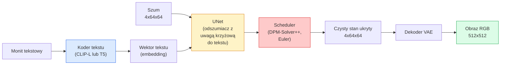

Created At: 2026-06-08T18:18:28Z
Completed At: 2026-06-08T18:18:28Z
File Path: `file:///C:/poligon/LLM_Traning/phases/04-computer-vision/11-stable-diffusion/docs/pl_pro.md`

# Stable Diffusion – architektura i dostrajanie

> Stable Diffusion to model DDPM działający w przestrzeni ukrytej (latent space) pre-trenowanego autoenkodera VAE, warunkowany tekstem za pomocą mechanizmu uwagi krzyżowej (cross-attention), próbkowany przy użyciu szybkiego, deterministycznego solvera ODE i sterowany metodą naprowadzania bez użycia klasyfikatora (Classifier-Free Guidance).

**Typ:** Kompendium wiedzy i zastosowanie  
**Języki:** Python  
**Wymagania wstępne:** Faza 4, lekcja 10 (modele dyfuzyjne); faza 7, lekcja 02 (mechanizm uwagi – self-attention)  
**Czas:** ~75 minut  

## Cele nauczania

- Przeanalizować pięć elementów potoku (pipeline) Stable Diffusion: VAE, koder tekstu, U-Net, scheduler oraz moduł weryfikacji bezpieczeństwa (safety checker) – i zrozumieć rolę każdego z nich.
- Wyjaśnić ideę dyfuzji w przestrzeni ukrytej (latent diffusion) i powód, dla którego prowadzenie obliczeń na tensorze o wymiarach 4x64x64 (zamiast obrazu 3x512x512) zmniejsza zapotrzebowanie na moc obliczeniową 48-krotnie bez straty jakości.
- Zapplykować bibliotekę `diffusers` do generowania obrazów (text-to-image), modyfikacji obrazu (image-to-image), domalowywania fragmentów (inpainting) oraz generowania sterowanego geometrią przy użyciu ControlNet.
- Dostroić model Stable Diffusion za pomocą techniki LoRA na niewielkim, niestandardowym zbiorze danych oraz wczytać wyuczony adapter LoRA na etapie wnioskowania (inference).

## Problem

Uczenie modelu DDPM bezpośrednio na obrazach RGB o rozdzielczości 512x512 jest niezwykle kosztowne obliczeniowo. Każdy krok uczenia wymaga przejścia przez sieć U-Net przetwarzającą dane o rozmiarze $3 \times 512 \times 512 = 786\ 432$ wartości, a pętla próbkowania składa się z kilkudziesięciu przejść w przód (forward pass) przez tę samą sieć. Aby uzyskać jakość oferowaną przez Stable Diffusion 1.5 (wydaną w 2022 roku), dyfuzja bezpośrednio w przestrzeni pikseli wymagałaby około 256 miesięcy obliczeniowych na pojedynczej karcie GPU, a wygenerowanie jednego obrazu na konsumenckiej karcie graficznej zajmowałoby od 10 do 30 sekund.

Przełomem, który umożliwił uruchamianie modeli text-to-image o otwartych wagach (open-weights) na powszechnie dostępnym sprzęcie, była koncepcja **dyfuzji w przestrzeni ukrytej** (Latent Diffusion; Rombach i in., CVPR 2022). Polega ona na wytrenowaniu autoenkodera VAE, który koduje obraz o wymiarach $3 \times 512 \times 512$ do postaci ukrytej (latent representation) o wymiarach $4 \times 64 \times 64$ (oraz dekoduje go z powrotem), a następnie prowadzeniu procesu dyfuzji bezpośrednio w tej skompresowanej przestrzeni. Złożoność obliczeniowa spada wtedy aż 48-krotnie: $\frac{3 \times 512 \times 512}{4 \times 64 \times 64} = 48$. Czas potrzebny na wygenerowanie obrazu skraca się z kilkudziesięciu do poniżej dwóch sekund na tym samym sprzęcie.

Niemal każdy współczesny model generowania obrazów (taki jak SDXL, SD3, FLUX, HunyuanDiT czy modele wideo jak Wan) to w istocie model dyfuzji w przestrzeni ukrytej, różniący się jedynie architekturą autoenkodera, odszumiacza (U-Net lub Diffusion Transformer – DiT) oraz sposobem warunkowania tekstem. Zrozumienie zasad działania Stable Diffusion daje solidne fundamenty pod pracę z dowolnym z tych modeli.

## Koncepcja

### Potok generatywny (Pipeline)



- **VAE** – zamrożony (nieaktualizowany) autoenkoder. Koder (Encoder) mapuje obraz do przestrzeni ukrytej (wykorzystywane w zadaniach img2img oraz podczas uczenia). Dekoder (Decoder) rekonstruuje obraz z reprezentacji ukrytej.
- **Koder tekstu** – przetwarza tekst wejściowy. Wykorzystuje model CLIP-L (SD 1.x/2.x), duet CLIP-L + CLIP-G (SDXL) lub T5-XXL (SD3/FLUX) do wygenerowania sekwencji wektorów osadzeń (embeddings).
- **U-Net** – odszumiacz (denoiser). Wyposażony w warstwy uwagi krzyżowej (cross-attention), które umożliwiają mapowanie informacji z wektorów tekstowych na cechy przestrzeni ukrytej na każdym poziomie rozdzielczości sieci.
- **Scheduler (harmonogram)** – algorytm próbkowania (np. DDIM, Euler, DPM-Solver++). Określa poziom szumu (wartości $\sigma$) dla każdego kroku i aktualizuje stan ukryty na podstawie przewidywań sieci.
- **Safety Checker** – opcjonalny moduł klasyfikujący, który filtruje treści NSFW (nieodpowiednie dla miejsca pracy) lub obrazy niezgodne z polityką bezpieczeństwa.

### Naprowadzanie bez użycia klasyfikatora (Classifier-Free Guidance – CFG)

Standardowe warunkowanie tekstem uczy model przewidywania szumu $\epsilon_\theta(x_t, t, c)$ dla zadanego monitu $c$. Technika CFG polega na uczeniu tej samej sieci, przy czym w 10% kroków uczenia monit $c$ jest pomijany (zastępowany pustym ciągiem znaków). Dzięki temu pojedynczy model uczy się szacować zarówno szum warunkowy, jak i bezwarunkowy. Na etapie wnioskowania przewidywany szum wyliczany jest jako:

$$\epsilon = \epsilon_{uncond} + w \cdot (\epsilon_{cond} - \epsilon_{uncond})$$

gdzie $w$ oznacza skalę naprowadzania (guidance scale). Dla $w=0$ generowanie jest bezwarunkowe, dla $w=1$ stosuje się standardowe warunkowanie, natomiast dla $w > 1$ model silniej dopasowuje generowany obraz do treści wpisanego monitu, kosztem zmniejszenia różnorodności próbek. Domyślną wartością w Stable Diffusion jest zazwyczaj $w = 7.5$.

Zastosowanie CFG jest głównym czynnikiem decydującym o wysokiej wierności generowania na podstawie tekstu. Bez tej metody generowane obrazy słabo odpowiadają wpisanym opisom; wprowadzenie CFG sprawia, że treść monitu precyzyjnie steruje procesem dyfuzji.

### Geometria przestrzeni ukrytej (Latent Space)

Reprezentacja ukryta w postaci 4-kanałowego tensora nie jest jedynie zwykłym skompresowanym obrazem. Tworzy ona przestrzeń wielowymiarową (rozmaitość), w której operacje wektorowe odpowiadają zmianom semantycznym (co umożliwia edycję oraz płynną interpolację), i w której sieć U-Net uczy się efektywnie alokować pojemność modelu. Zdekodowanie losowego tensora $4 \times 64 \times 64$ nie da spójnego obrazu – wygeneruje jedynie szum i artefakty, ponieważ tylko określony obszar (podrozmaitość) przestrzeni ukrytej odpowiada poprawnym obrazom rzeczywistym.

Wynikają z tego dwie kluczowe konsekwencje:

1. **Img2img (obraz na obraz)**: obraz wejściowy jest kodowany do przestrzeni ukrytej, a następnie dodaje się do niego kontrolowaną porcję szumu. W kolejnym kroku następuje proces odszumiania sterowany nowym monitem i ostateczna rekonstrukcja. Kompozicja obrazu zostaje zachowana dzięki temu, że proces kodowania i dekodowania VAE jest niemal bezstratny, natomiast szczegóły ulegają modyfikacji zgodnie z tekstem.
2. **Inpainting (domalowywanie)**: zasada działania jest analogiczna do img2img, z tą różnicą, że odszumiacz modyfikuje wyłącznie piksele należące do zdefiniowanej maski, podczas gdy pozostałe obszary pozostają niezmienione (są kopiowane z oryginalnego zakodowanego stanu ukrytego).

### Architektura sieci U-Net

Sieć U-Net stosowana w Stable Diffusion to znacznie powiększona wersja modelu TinyUNet opisanego w lekcji 10, uzupełniona o trzy kluczowe elementy:

- **Bloki Transformerów** wbudowane na każdym poziomie rozdzielczości przestrzennej, realizujące samouważność (self-attention) oraz uwagę krzyżową (cross-attention) względem wektorów tekstu.
- **Kodowanie kroku czasowego** za pomocą sieci MLP aplikowane do sinusoidalnych wektorów pozycyjnych.
- **Połączenia omijające (skip connections)** łączące warstwy kodera z dekoderem o odpowiadających rozdzielczościach.

Liczba parametrów w Stable Diffusion 1.5 wynosi ok. 860 milionów, w SDXL ok. 2.6 miliarda, a w modelu FLUX ok. 12 miliardów. Wzrost rozmiaru modeli wynika głównie ze zwiększania liczby warstw uwagi.

### Dostrajanie za pomocą LoRA (Low-Rank Adaptation)

Pełne dostrojenie (full fine-tuning) modelu Stable Diffusion wymaga ogromnych zasobów (często powyżej 20 GB pamięci VRAM) i modyfikuje wszystkie parametry modelu. Technika LoRA pozwala zachować wagi modelu bazowego w stanie zamrożonym, wstrzykując do warstw uwagi pary macierzy o niskiej randze. Adaptery LoRA mają zazwyczaj rozmiar od 10 do 50 MB, mogą być wytrenowane w czasie od 10 do 60 minut na pojedynczym konsumenckim GPU i są dynamicznie wczytywane na etapie wnioskowania.

```
Oryginalna macierz wag (zamrożona): W_q : (d_in, d_out)
Modyfikacja wag:                     W_q + alpha * (A @ B)
gdzie A : (d_in, r), B : (r, d_out), a r (ranga) wynosi zazwyczaj od 4 do 32.
```

Technika LoRA stała się standardem dystrybucji modyfikacji tworzonych przez społeczność. Portale takie jak CivitAI czy Hugging Face przechowują miliony takich adapterów.

### Najważniejsze schedulery (samplery)

- **DDIM** – deterministyczny, zazwyczaj wymaga ok. 50 kroków, prosty matematycznie.
- **Euler Ancestral (Euler a)** – stochastyczny, 30-50 kroków, daje nieco bardziej zróżnicowane i plastyczne wyniki.
- **DPM-Solver++ 2M Karras** – deterministyczny, 20-30 kroków, najpopularniejszy standard w systemach produkcyjnych.
- **LCM / TCD / Turbo** – wersje destylowane (np. Consistency Models); umożliwiają generowanie w zaledwie 1-4 krokach, kosztem niewielkiego spadku szczegółowości.

Wymiana algorytmu próbkowania w bibliotece `diffusers` wymaga modyfikacji zaledwie jednej linijki kodu, a pozwala szybko rozwiązać problemy z artefaktami lub jakością generowania bez konieczności ponownego trenowania sieci.

## Zastosowanie

W tej lekcji wykorzystamy bibliotekę `diffusers` do zbudowania kompletnego procesu, zamiast implementować każdy komponent od zera. Poszczególne elementy (takie jak VAE, koder tekstu, U-Net czy algorytmy próbkowania) są na tyle złożone, że stanowią tematy osobnych modułów; tutaj celem jest opanowanie produkcyjnego API.

### Krok 1: Generowanie obrazu na podstawie tekstu (Text-to-Image)

```python
import torch
from diffusers import StableDiffusionPipeline

pipe = StableDiffusionPipeline.from_pretrained(
    "runwayml/stable-diffusion-v1-5",
    torch_dtype=torch.float16,
).to("cuda")

image = pipe(
    prompt="a dog riding a skateboard in tokyo, studio ghibli style",
    guidance_scale=7.5,
    num_inference_steps=25,
    generator=torch.Generator("cuda").manual_seed(42),
).images[0]
image.save("dog.png")
```

Zastosowanie typu danych `float16` zmniejsza zapotrzebowanie na pamięć VRAM o połowę bez dostrzegalnego spadku jakości obrazu. Ustawienie `num_inference_steps=25` z użyciem samplera DPM-Solver++ odpowiada jakościowo 50 krokom algorytmu DDIM.

### Krok 2: Zmiana schedulera (samplera)

```python
from diffusers import DPMSolverMultistepScheduler, EulerAncestralDiscreteScheduler

pipe.scheduler = DPMSolverMultistepScheduler.from_config(pipe.scheduler.config)
pipe.scheduler = EulerAncestralDiscreteScheduler.from_config(pipe.scheduler.config)
```

Definicja i stan harmonogramu są niezależne od wag sieci U-Net. Model może być trenowany przy użyciu DDPM, a próbkowanie może być realizowane za pomocą dowolnego innego samplera.

### Krok 3: Modyfikacja obrazu na podstawie obrazu (Image-to-Image)

```python
from diffusers import StableDiffusionImg2ImgPipeline
from PIL import Image

img2img = StableDiffusionImg2ImgPipeline.from_pretrained(
    "runwayml/stable-diffusion-v1-5",
    torch_dtype=torch.float16,
).to("cuda")

init_image = Image.open("dog.png").convert("RGB").resize((512, 512))
out = img2img(
    prompt="a dog riding a skateboard, oil painting",
    image=init_image,
    strength=0.6,
    guidance_scale=7.5,
).images[0]
```

Parametr `strength` określa stopień zaszumienia obrazu przed rozpoczęciem procesu odszumiania (wartość 0.0 oznacza brak zmian, natomiast 1.0 oznacza całkowite nadpisanie obrazu nową generacją). Przedział od 0.5 do 0.7 jest standardowo stosowany przy transferze stylu.

### Krok 4: Domalowywanie fragmentów obrazu (Inpainting)

```python
from diffusers import StableDiffusionInpaintPipeline

inpaint = StableDiffusionInpaintPipeline.from_pretrained(
    "runwayml/stable-diffusion-inpainting",
    torch_dtype=torch.float16,
).to("cuda")

image = Image.open("dog.png").convert("RGB").resize((512, 512))
mask = Image.open("dog_mask.png").convert("L").resize((512, 512))

out = inpaint(
    prompt="a cat",
    image=image,
    mask_image=mask,
    guidance_scale=7.5,
).images[0]
```

Jasne (białe) piksele w masce definiują obszar, który zostanie wygenerowany na nowo. Czarne piksele maski oznaczają fragmenty obrazu, które zostaną nienaruszone.

### Krok 5: Wczytywanie wag adaptera LoRA

```python
pipe.load_lora_weights("sayakpaul/sd-lora-ghibli")
pipe.fuse_lora(lora_scale=0.8)

image = pipe(prompt="a village square in ghibli style").images[0]
```

Parametr `lora_scale` kontroluje wpływ adaptera (0.0 to brak zmian, 1.0 to pełne zastosowanie). Metoda `fuse_lora` scala wagi adaptera bezpośrednio z wagami modelu bazowego w celu przyspieszenia generowania, jednak uniemożliwia to dynamiczną zmianę adaptera. Przed załadowaniem innego adaptera należy wywołać `pipe.unfuse_lora()`.

### Krok 6: Koncepcja procesu uczenia LoRA

Pełny kod szkoleniowy LoRA zazwyczaj wykorzystuje bibliotekę `peft` lub skrypty z pakietu `diffusers.training`. Poniższy pseudokod przedstawia ogólny zarys procesu:

```python
# Pseudokod
for step, batch in enumerate(dataloader):
    images, prompts = batch
    latents = vae.encode(images).latent_dist.sample() * 0.18215

    t = torch.randint(0, num_train_timesteps, (batch_size,))
    noise = torch.randn_like(latents)
    noisy_latents = scheduler.add_noise(latents, noise, t)

    text_emb = text_encoder(tokenizer(prompts))

    pred_noise = unet(noisy_latents, t, text_emb)  # Wstrzyknięcie wag LoRA następuje wewnątrz U-Net

    loss = F.mse_loss(pred_noise, noise)
    loss.backward()
    optimizer.step()
```

W procesie uczenia aktualizowane są wyłącznie parametry macierzy LoRA; wagi modelu bazowego U-Net, VAE oraz kodera tekstu pozostają zamrożone. Przy zastosowaniu rozmiaru paczki równego 1 oraz techniki gradient checkpointing proces ten wymaga mniej niż 8 GB pamięci VRAM.

## Produkcja

Kluczowe decyzje w środowisku produkcyjnym:

- **Wybór modelu bazowego**: SD 1.5 ze względu na bogatą bazę darmowych rozszerzeń stworzonych przez społeczność, SDXL dla wyższej wierności obrazu, bądź SD3 / FLUX dla osiągnięcia najwyższej jakości fotorealizmu (przy uwzględnieniu licencji komercyjnych).
- **Dobór schedulera**: DPM-Solver++ 2M Karras (20-30 kroków) jako standard, lub LCM-LoRA / SDXL Lightning dla generowania w czasie poniżej 1 sekundy.
- **Precyzja obliczeń**: `float16` dla kart konsumenckich (np. RTX 4080/4090), `bfloat16` dla procesorów graficznych klasy serwerowej (np. A100, H100) oraz kwantyzacja do formatu `int8` (np. przez `bitsandbytes`) przy ograniczonych zasobach VRAM.
- **Warunkowanie dodatkowe**: standardowy monit tekstowy jest wystarczający do ogólnych zadań; w celu precyzyjnego pozycjonowania i kontroli geometrii stosuje się adaptery ControlNet (np. wykrywanie krawędzi Canny, mapy głębi lub detekcję pozycji OpenPose) nałożone na model bazowy.

W przypadku generowania wsadowego i eksperymentów graficznych najpopularniejszymi narzędziami są interfejsy `AUTOMATIC1111` oraz `ComfyUI`. W zastosowaniach serwerowych i API produkcyjnych standardem jest stosowanie bibliotek `diffusers` + `accelerate` lub platformy `optimum-nvidia` z kompilacją TensorRT-LM.

## Wyślij to

Niniejsza lekcja dostarcza:

- `outputs/prompt-sd-pipeline-planner.md` – prompt ułatwiający dobór modelu bazowego (SD 1.5, SDXL, SD3, FLUX), schedulera i precyzji obliczeń na podstawie budżetu opóźnień, wymagań jakościowych oraz ograniczeń licencyjnych.
- `outputs/skill-lora-training-setup.md` – narzędzie generujące kompletną konfigurację procesu uczenia LoRA dla zadanego zbioru danych (w tym przygotowanie opisów, rangę macierzy, rozmiar paczki i tempo uczenia).

## Ćwiczenia

1. **(Łatwe)** Wygeneruj obrazy dla tego samego monitu, zmieniając parametr `guidance_scale` (CFG scale) w przedziale `[1, 3, 5, 7.5, 10, 15]`. Przeanalizuj zmiany w wyglądzie obrazu. Przy jakiej wartości współczynnika naprowadzania zaczynają pojawiać się widoczne artefakty (przesterowanie kolorów)?
2. **(Średnie)** Wybierz dowolne zdjęcie i przekaż je do potoku `StableDiffusionImg2ImgPipeline`, testując wartości parametru `strength` w przedziale `[0.2, 0.4, 0.6, 0.8, 1.0]`. Który poziom zaszumienia najlepiej pozwala na zmianę stylu z zachowaniem oryginalnej kompozycji? Dlaczego przy wartości `strength=1.0` obraz wejściowy jest całkowicie ignorowany?
3. **(Trudne)** Przeprowadź uczenie adaptera LoRA na zbiorze 10-20 obrazów przedstawiających konkretny obiekt (np. maskotkę, logo lub postać), a następnie wygeneruj sceny z tym obiektem w nowych kontekstach. Dobierz rangę macierzy LoRA oraz liczbę kroków uczenia w taki sposób, aby uzyskać wysoką wierność odwzorowania obiektu bez efektu przeuczenia (overfittingu) do teł z obrazów treningowych.

## Kluczowe terminy

| Termin | Obiegowe określenie | Co to oznacza w rzeczywistości |
|------|----------------|----------------------|
| Dyfuzja w przestrzeni ukrytej (Latent Diffusion) | „Dyfuzja w przestrzeni latentnej” | Prowadzenie całego procesu odszumiania (DDPM) w skompresowanej przestrzeni ukrytej VAE (np. o wymiarach 4x64x64) zamiast w wysokiej rozdzielczości przestrzeni pikseli (np. 3x512x512), co pozwala na 48-krotne zmniejszenie złożoności obliczeniowej |
| Współczynnik skalowania VAE (scaling factor) | „0.18215” | Stała służąca do znormalizowania wariancji reprezentacji ukrytej przed przekazaniem jej do U-Net; wartość ta jest wpisana na stałe w implementację potoków Stable Diffusion |
| Classifier-Free Guidance (CFG) | Wskazówki naprowadzania | Technika polegająca na liniowym łączeniu predykcji szumu warunkowanej opisem oraz predykcji bezwarunkowej; najważniejszy parametr sterujący stopniem dopasowania obrazu do tekstu |
| Scheduler | „Sampler / Próbnik” | Algorytm, który przekształca wyjście sieci U-Net (przewidywanie szumu) w krok zmiany stanu ukrytego |
| LoRA | „Adapter niskiej rangi” | Małe macierze o niskiej randze dołączane do warstw uwagi w celu ich szybkiego i oszczędnego dostrojenia bez modyfikowania wag bazowych |
| Uwaga krzyżowa (Cross-Attention) | „Uwaga tekst-obraz” | Warstwa mechanizmu uwagi mapująca relacje pomiędzy tensorami cech przestrzeni ukrytej a wektorami osadzeń tekstu; pozwala na wstrzykiwanie informacji semantycznych do U-Net |
| ControlNet | Sterowanie geometrią i strukturą | Pomocnicza sieć neuronowa trenowana w celu narzucenia dodatkowych ograniczeń strukturalnych na proces generowania (np. przy użyciu krawędzi Canny, map głębi itp.) |
| DPM-Solver++ | „Standardowy próbnik” | Deterministyczny algorytm rozwiązywania równań różniczkowych zwyczajnego (ODE) drugiego rzędu; zapewnia optymalną jakość przy niskiej liczbie kroków (20-30) |

## Literatura uzupełniająca

- [High-Resolution Image Synthesis with Latent Diffusion Models (Rombach et al., 2022)](https://arxiv.org/abs/2112.10752) – oryginalny artykuł opisujący Stable Diffusion; zawiera analizę uzasadniającą wybór poszczególnych komponentów architektury.
- [Classifier-Free Diffusion Guidance (Ho i Salimans, 2022)](https://arxiv.org/abs/2207.12598) – artykuł wprowadzający technikę CFG.
- [LoRA: Low-Rank Adaptation of Large Language Models (Hu et al., 2021)](https://arxiv.org/abs/2106.09685) – przełomowa praca wprowadzająca technologię LoRA w NLP, zaadaptowana następnie do modeli Stable Diffusion.
- [Dokumentacja biblioteki Diffusers](https://huggingface.co/docs/diffusers) – kompletne kompendium wiedzy o potokach SD / SDXL / SD3 / FLUX.
