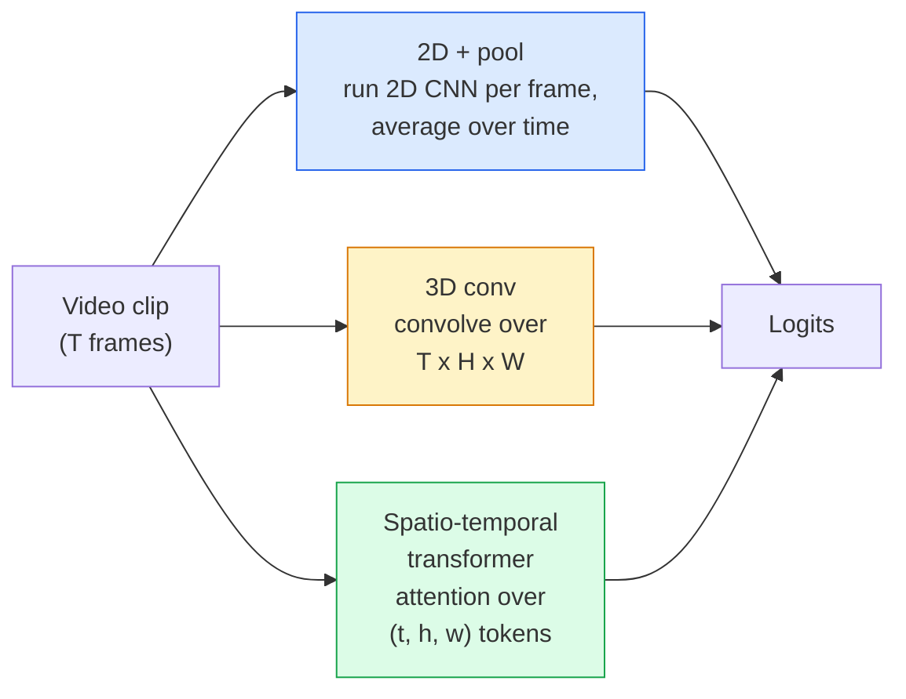

# Rozumienie wideo — modelowanie czasowe

> Film to sekwencja obrazów plus fizyka, która je łączy. Każdy model wideo traktuje czas jako dodatkową oś (konw. 3D), sekwencję do obsługi (transformator) lub funkcję jednorazowego wyodrębnienia i puli (pula 2D+).

**Typ:** Ucz się + Buduj
**Języki:** Python
**Wymagania wstępne:** Faza 4, lekcja 03 (CNN), Faza 4, lekcja 04 (klasyfikacja obrazów)
**Czas:** ~45 minut

## Cele nauczania

- Rozróżnij trzy główne podejścia do modelowania wideo (pula 2D +, konwersja 3D, transformator przestrzenno-czasowy) i przewiduj ich kompromisy w zakresie kosztów i dokładności
- Zaimplementuj próbkowanie klatek, łączenie czasowe i klasyfikator bazowy 2D + pula w PyTorch
- Wyjaśnij, dlaczego „nadmuchane” jądra 3D I3D dobrze przenoszą się z wag ImageNet i co różni się od współczynnika konwersji (2+1)D
- Przeczytaj standardowe zbiory danych i metryki dotyczące rozpoznawania działań: Kinetics-400/600, UCF101, Something-Something V2; najwyższa dokładność na poziomie klipu i wideo

## Problem

30-sekundowy film przy 30 kl./s to 900 obrazów. Naiwnie klasyfikacja wideo to klasyfikacja obrazu przeprowadzana 900 razy, po której następuje pewnego rodzaju agregacja. Działa to, gdy akcja jest widoczna niemal w każdej klatce (filmy sportowe, kulinarne, z ćwiczeniami), ale zawodzi, gdy akcję definiuje sam ruch: „przesuwanie czegoś od lewej do prawej” wygląda jak dwa nieruchome obiekty w każdej klatce.

Podstawowe pytanie w przypadku każdej architektury wideo brzmi: kiedy i w jaki sposób modelowana jest struktura czasowa? Odpowiedź wpływa na wszystko inne — obliczenie kosztów, strategię wstępnego uczenia, możliwość ponownego wykorzystania wag ImageNet i na jakich zbiorach danych trenuje model.

Ta lekcja jest celowo krótsza niż lekcje dotyczące obrazu statycznego. Podstawowy mechanizm tworzenia obrazu już istnieje, a zrozumienie wideo opiera się głównie na historii czasowej: próbkowaniu, modelowaniu i agregowaniu.

## Koncepcja

### Trzy rodziny architektoniczne



### 2D + basen

Weź CNN 2D (ResNet, EfficientNet, ViT). Uruchom go niezależnie na każdej próbkowanej klatce. Średnia (lub maksymalna pula lub pula uwagi) osadzania na klatkę. Podaj połączony wektor do klasyfikatora.

Plusy:
- Bezpośrednie transfery przedszkoleniowe ImageNet.
- Najprostszy do wdrożenia.
- Tanie: ramki T * koszt wnioskowania pojedynczego obrazu.

Wady:
- Nie można modelować ruchu. Działanie = suma pozorów.
- Łączenie czasowe jest niezmienne w kolejności; „otwarte drzwi” i „zamknij drzwi” wyglądają tak samo.

Kiedy używać: zadania wymagające dużej ilości wyglądu, przenoszenie wiedzy na małych zestawach danych wideo, początkowe wartości bazowe.

### Sploty 3D

Zamień jądra 2D (H, W) na jądra 3D (T, H, W). Sieć kręci się zarówno w przestrzeni, jak i w czasie. Wczesna rodzina: C3D, I3D, SlowFast.

Sztuczka I3D: weź wstępnie wytrenowany model 2D ImageNet, „nadmuchaj” każde jądro 2D, kopiując je wzdłuż nowej osi czasu. Konwencja 3x3 2D staje się konwersją 3x3x3 3D. Dzięki temu model 3D ma mocne, wstępnie wytrenowane ciężary, zamiast trenować od zera.

Plusy:
- Bezpośrednio modeluje ruch.
- Inflacja I3D zapewnia bezpłatną naukę transferu.

Wady:
- T/8 więcej FLOPów niż odpowiednik 2D (dla jądra tymczasowego 3 ułożonego 3 razy).
- Jądra czasowe są małe; ruch dalekiego zasięgu wymaga podejścia piramidalnego lub dwustrumieniowego.

Kiedy stosować: rozpoznawanie akcji, gdzie sygnałem jest ruch (Coś-Coś V2, Kinetyka z klasami obciążonymi ruchem).

### Transformatory czasoprzestrzenne

Podziel wideo na siatkę fragmentów czasoprzestrzeni i obejrzyj je wszystkie. TimeSformer, ViViT, Video Swin, VideoMAE.

Wzorce uwagi, które mają znaczenie:
- **Staw** — jedna duża uwaga na (t, h, w). Kwadratowy w `T*H*W`; drogi.
- **Podzielone** — dwie uwagi na blok: jedna w czasie, druga w przestrzeni. Skalowanie liniowe.
- **Faktoryzowane** — uwaga czasowa przeplata się z uwagą przestrzenną w poszczególnych blokach.

Plusy:
- Dokładność SOTA w każdym głównym benchmarku.
- Transfery z transformatorów obrazu (ViT) poprzez nadmuchanie łaty.
- Obsługuje wideo o długim kontekście poprzez rzadką uwagę.

Wady:
- Głodny obliczeń.
- Wymaga starannego wyboru wzorca lub balonów wykonawczych.

Kiedy używać: duże zbiory danych, zrozumienie wideo o wysokiej jakości, wielomodalne zadania wideo i tekstowe.

### Próbkowanie klatek

10-sekundowy klip przy 30 kl./s to 300 klatek; karmienie wszystkich 300 dowolnym modelem jest marnotrawstwem. Standardowe strategie:

- **Jednolite próbkowanie** — wybieraj klatki T równomiernie w całym klipie. Domyślnie dla puli 2D+.
- **Gęste próbkowanie** — losowe, ciągłe okno typu T-frame. Typowe dla konwersji 3D, ponieważ ruch wymaga sąsiadujących klatek.
- **Multi-clip** — próbkuj wiele okien w kształcie litery T z tego samego wideo, klasyfikuj każde, średnie przewidywania w czasie testu.

T wynosi zwykle 8, 16, 32 lub 64. Wyższe T = więcej sygnału tymczasowego przy większej liczbie obliczeń.

### Ocena

Dwa poziomy:
- **Dokładność na poziomie klipu** — model widzi jeden klip w kształcie litery T, raportuje top-k.
- **Dokładność na poziomie wideo** — średnie przewidywania na poziomie klipu dla wielu klipów na film; wyższy i stabilniejszy.

Zawsze zgłaszaj oba. Model, który uzyskał 78% klipów i 82% wideo, w dużym stopniu opiera się na uśrednianiu czasu testu; ten, który uzyskuje wynik 80%/81%, jest bardziej solidny w przeliczeniu na klip.

### Zbiory danych, które spotkasz

- **Kinetics-400 / 600 / 700** — zbiór danych działań ogólnego przeznaczenia. 400 tys. klipów; Adresy URL YouTube (wiele z nich jest już martwych).
- **Coś-Coś V2** — akcje zdefiniowane ruchem („przesuwanie X od lewej do prawej”). Nie można rozwiązać za pomocą puli 2D+.
- **UCF-101**, **HMDB-51** — starsze, mniejsze, wciąż raportowane.
- **AVA** — akcja *lokalizacja* w przestrzeni i czasie; trudniejsze niż klasyfikacja.

## Zbuduj to

### Krok 1: Próbnik klatek

Jednolite i gęste samplery działające na liście klatek (lub tensorze wideo).

```python
import numpy as np

def sample_uniform(num_frames_total, T):
    if num_frames_total <= T:
        return list(range(num_frames_total)) + [num_frames_total - 1] * (T - num_frames_total)
    step = num_frames_total / T
    return [int(i * step) for i in range(T)]

def sample_dense(num_frames_total, T, rng=None):
    rng = rng or np.random.default_rng()
    if num_frames_total <= T:
        return list(range(num_frames_total)) + [num_frames_total - 1] * (T - num_frames_total)
    start = int(rng.integers(0, num_frames_total - T + 1))
    return list(range(start, start + T))
```

Obydwa zwracają indeksy `T` używane do dzielenia tensora wideo.

### Krok 2: Baza 2D+pula

Uruchom 2D ResNet-18 na każdej klatce, cechy średniej puli, klasyfikuj.

```python
import torch
import torch.nn as nn
from torchvision.models import resnet18, ResNet18_Weights

class FramePool(nn.Module):
    def __init__(self, num_classes=400, pretrained=True):
        super().__init__()
        weights = ResNet18_Weights.IMAGENET1K_V1 if pretrained else None
        backbone = resnet18(weights=weights)
        self.features = nn.Sequential(*(list(backbone.children())[:-1]))  # global avg pool kept
        self.head = nn.Linear(512, num_classes)

    def forward(self, x):
        # x: (N, T, 3, H, W)
        N, T = x.shape[:2]
        x = x.view(N * T, *x.shape[2:])
        feats = self.features(x).view(N, T, -1)
        pooled = feats.mean(dim=1)
        return self.head(pooled)

model = FramePool(num_classes=10)
x = torch.randn(2, 8, 3, 224, 224)
print(f"output: {model(x).shape}")
print(f"params: {sum(p.numel() for p in model.parameters()):,}")
```

Jedenaście milionów parametrów, wstępnie przeszkolonych przez ImageNet, działa na klatkę, uśrednia i klasyfikuje. Ta wartość bazowa często mieści się w zakresie 5–10 punktów od prawidłowych modeli 3D w przypadku zadań wymagających dużej liczby elementów — czasami jest lepsza, ponieważ ponownie wykorzystuje silniejszy szkielet ImageNet.

### Krok 3: zawyżona konwersja 3D w stylu I3D

Zamień pojedynczą konwersję 2D w konwersję 3D, powtarzając wagi na nowej osi czasu.

```python
def inflate_2d_to_3d(conv2d, time_kernel=3):
    out_c, in_c, kh, kw = conv2d.weight.shape
    weight_3d = conv2d.weight.data.unsqueeze(2)  # (out, in, 1, kh, kw)
    weight_3d = weight_3d.repeat(1, 1, time_kernel, 1, 1) / time_kernel
    conv3d = nn.Conv3d(in_c, out_c, kernel_size=(time_kernel, kh, kw),
                        padding=(time_kernel // 2, conv2d.padding[0], conv2d.padding[1]),
                        stride=(1, conv2d.stride[0], conv2d.stride[1]),
                        bias=False)
    conv3d.weight.data = weight_3d
    return conv3d

conv2d = nn.Conv2d(3, 64, kernel_size=3, padding=1, bias=False)
conv3d = inflate_2d_to_3d(conv2d, time_kernel=3)
print(f"2D weight shape:  {tuple(conv2d.weight.shape)}")
print(f"3D weight shape:  {tuple(conv3d.weight.shape)}")
x = torch.randn(1, 3, 8, 56, 56)
print(f"3D output shape:  {tuple(conv3d(x).shape)}")
```

Dzielenie przez `time_kernel` pozwala zachować mniej więcej stałe wielkości aktywacji — ważne, aby nie złamać statystyk normy wsadowej przy pierwszym przebiegu.

### Krok 4: współczynnik konw. (2+1)D

Podziel konwersję 3D na konwersję 2D (przestrzenną) i 1D (czasową). To samo pole receptywne, mniej parametrów, lepsza dokładność w niektórych testach porównawczych.

```python
class Conv2Plus1D(nn.Module):
    def __init__(self, in_c, out_c, kernel_size=3):
        super().__init__()
        mid_c = (in_c * out_c * kernel_size * kernel_size * kernel_size) \
                // (in_c * kernel_size * kernel_size + out_c * kernel_size)
        self.spatial = nn.Conv3d(in_c, mid_c, kernel_size=(1, kernel_size, kernel_size),
                                 padding=(0, kernel_size // 2, kernel_size // 2), bias=False)
        self.bn = nn.BatchNorm3d(mid_c)
        self.act = nn.ReLU(inplace=True)
        self.temporal = nn.Conv3d(mid_c, out_c, kernel_size=(kernel_size, 1, 1),
                                  padding=(kernel_size // 2, 0, 0), bias=False)

    def forward(self, x):
        return self.temporal(self.act(self.bn(self.spatial(x))))

c = Conv2Plus1D(3, 64)
x = torch.randn(1, 3, 8, 56, 56)
print(f"(2+1)D output: {tuple(c(x).shape)}")
```

Pełna sieć R(2+1)D jest taka sama jak sieć ResNet-18, w której każda konwersja 3x3 jest zastąpiona przez `Conv2Plus1D`.

## Użyj tego

Dwie biblioteki obejmują produkcję wideo:

- `torchvision.models.video` — R(2+1)D, MViT, Swin3D z wstępnie wytrenowanymi wagami Kinetics. Ten sam interfejs API, co modele obrazów.
- `pytorchvideo` (Meta) — zoo modeli, moduły ładujące dane dla Kinetics / SSv2 / AVA, transformacje standardowe.

W przypadku modeli wideo Vision-Language (napisy wideo, kontrola jakości wideo) użyj `transformers` (`VideoMAE`, `VideoLLaMA`, `InternVideo`).

## Wyślij to

Ta lekcja daje:

- `outputs/prompt-video-architecture-picker.md` — monit, który wybiera 2D+pulę / I3D / (2+1)D / transformator w oparciu o porównanie wyglądu z ruchem, rozmiar zbioru danych i budżet obliczeniowy.
- `outputs/skill-frame-sampler-auditor.md` — umiejętność polegająca na sprawdzaniu próbnika potoku wideo i oznaczaniu typowych błędów: indeksu off-by-one, nierównego próbkowania przy `num_frames < T`, braku przycięcia zachowującego aspekt itp.

## Ćwiczenia

1. **(Łatwe)** Oblicz FLOPy (przybliżone) dla FramePool z T=8 w porównaniu z 3D ResNet w stylu I3D z T=8. Uzasadnij, dlaczego basen 2D+ jest 3-5 razy tańszy.
2. **(Średni)** Wygeneruj syntetyczny zbiór danych wideo: losowe kulki poruszające się w losowych kierunkach, oznaczone kierunkiem ruchu („od lewej do prawej”, „od prawej do lewej”, „po przekątnej w górę”). Trenuj na nim FramePool. Pokaż, że osiąga niemal przypadkową dokładność, udowadniając, że sam wygląd nie wystarczy do zadań związanych z ruchem.
3. **(Trudne)** Zbuduj R(2+1)D-18, zastępując każdy Conv2d w ResNet-18 przez `Conv2Plus1D`. Zawyżaj wagę pierwszej konwersji na podstawie wstępnie wyszkolonego ResNet-18 w ImageNet. Trenuj na zestawie danych ruchu z ćwiczenia 2 i pokonaj FramePool.

## Kluczowe terminy

| Termin | Co ludzie mówią | Co to właściwie oznacza |
|------|----------------|----------------------|
| 2D + basen | „Klasyfikator na klatkę” | Uruchom CNN 2D na każdej próbkowanej klatce, uśrednij cechy puli w czasie, klasyfikuj |
| Splot 3D | „Jądro czasoprzestrzenne” | Jądro zwinięte w (T, H, W); może natywnie modelować ruch |
| Inflacja | „Podnieś ciężary 2D do 3D” | Zainicjuj wagi konw. 3D, powtarzając wagi konw. 2D na nowej osi czasu, a następnie podziel przez kernel_T, aby zachować skalę aktywacji |
| (2+1)D | „Konw. rozłożona na czynniki” | Podziel 3D na przestrzenne 2D i czasowe 1D; mniej parametrów, dodatkowa nieliniowość pomiędzy |
| Podzielona uwaga | „Czas, potem przestrzeń” | Blok transformatora z dwoma uwagami na warstwę: jedna nad żetonami w tej samej ramce, druga nad żetonami w tej samej pozycji |
| Klip | „Okno typu T” | Próbkowana podsekwencja T-ramek; jednostka zużywana przez model wideo |
| Dokładność klipu a wideo | „Dwa ustawienia ewaluacyjne” | Klip = jedna próbka na film, wideo = średnia z wielu samplowanych klipów |
| Kinetyka | „ImageNet wideo” | 400-700 zajęć ruchowych, ponad 300 tys. klipów na YouTube, standardowy korpus wideo przedtreningowy |

## Dalsze czytanie

- [I3D: Quo Vadis, Action Recognition (Carreira & Zisserman, 2017)](https://arxiv.org/abs/1705.07750) — wprowadza inflację i zbiór danych Kinetics
- [R(2+1)D: A Closer Look at Spatiotemporal Convolutions (Tran et al., 2018)](https://arxiv.org/abs/1711.11248) — współczynnik konwersji na czynniki, nadal mocny punkt odniesienia
- [TimeSformer: Czy uwaga czasoprzestrzenna jest wszystkim, czego potrzebujesz? (Bertasius et al., 2021)](https://arxiv.org/abs/2102.05095) — pierwszy mocny transformator wideo
- [VideoMAE (Tong et al., 2022)](https://arxiv.org/abs/2203.12602) — wstępne szkolenie zamaskowanego autoenkodera dla wideo; obecnie dominująca receptura przedtreningowa