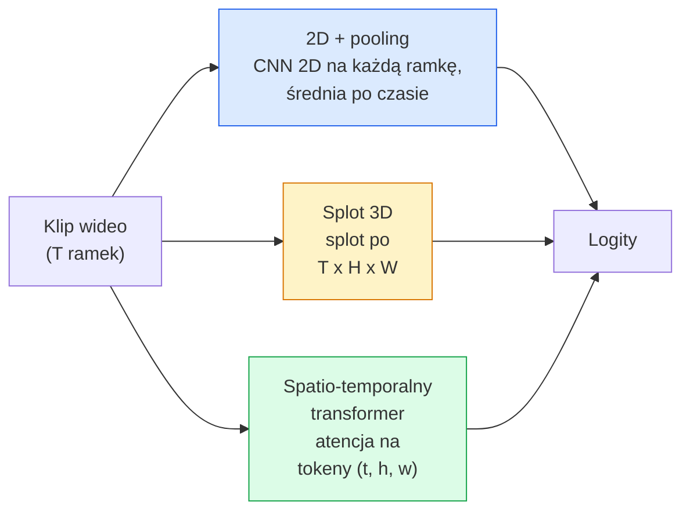

# Rozumienie wideo — modelowanie czasowe

> Wideo to sekwencja obrazów plus fizyka, która je łączy. Każdy model wideo albo traktuje czas jako dodatkową oś (splot 3D), albo jako sekwencję, na której wykonuje się atencję (transformer), albo jako cechę ekstraktowaną raz i poolowaną (2D + pooling).

**Typ:** Nauka + Budowanie
**Języki:** Python
**Wymagania wstępne:** Faza 4 Lekcja 03 (CNN), Faza 4 Lekcja 04 (Klasyfikacja obrazów)
**Czas:** ~45 minut

## Cele nauki

- Rozróżnienie trzech głównych podejść do modelowania wideo (2D + pooling, splot 3D, spatio-temporalny transformer) i przewidzenie ich kosztu obliczeniowego oraz trade-offów dokładności
- Implementacja próbkowania ramek, poolingu czasowego oraz bazowego klasyfikatora 2D + pooling w PyTorch
- Wyjaśnienie, dlaczego „nadmuchane" (inflated) jądra 3D w I3D dobrze transferują się z wag ImageNet i czym różni się od tego faktoryzowany splot (2+1)D
- Zapoznanie się ze standardowymi zbiorami danych i metrykami do rozpoznawania akcji: Kinetics-400/600, UCF101, Something-Something V2; dokładność top-1 na poziomie klipu i wideo

## Problem

30-sekundowe wideo przy 30 fps to 900 obrazów. Naiwnie, klasyfikacja wideo to klasyfikacja obrazów wykonana 900 razy, a następnie pewna forma agregacji. To działa, gdy akcja jest widoczna w prawie każdej ramce (sport, gotowanie, filmy treningowe) i zawodzi spektakularnie, gdy akcja jest zdefiniowana przez sam ruch: „przesuwanie czegoś od lewej do prawej" wygląda jak dwa nieruchome obiekty w każdej pojedynczej ramce.

Kluczowe pytanie dla każdej architektury wideo to: kiedy modelowana jest struktura czasowa i jak? Odpowiedź determinuje wszystko inne — koszt obliczeniowy, strategię pretrenowania, możliwość ponownego wykorzystania wag ImageNet, na jakich zbiorach danych model jest trenowany.

Ta lekcja jest celowo krótsza niż lekcje o statycznych obrazach. Podstawowy aparat dotyczący obrazów jest już ustalony, a rozumienie wideo to przede wszystkim historia czasowa: próbkowanie, modelowanie i agregacja.

## Koncepcja

### Trzy rodziny architektur



### 2D + pooling

Weź sieć CNN 2D (ResNet, EfficientNet, ViT). Uruchom ją niezależnie na każdej próbkowanej ramce. Wykonaj średnią (lub max-pooling, albo attention-pooling) embeddingów z poszczególnych ramek. Podaj uśredniony wektor do klasyfikatora.

Zalety:
- Pretrenowanie ImageNet transferuje się bezpośrednio.
- Najprostszy w implementacji.
- Tani: T ramek * koszt inferencji pojedynczego obrazu.

Wady:
- Nie może modelować ruchu. Akcja = agregat wyglądów (appearances).
- Pooling czasowy jest niezależny od porządku; „otwieranie drzwi" i „zamykanie drzwi" wyglądają tak samo.

Kiedy używać: zadania zależne od wyglądu (appearance-heavy), transfer learning na małych zbiorach wideo, początkowe baseline'y.

### Splot 3D

Zamień jądra 2D (H, W) na jądra 3D (T, H, W). Sieć wykonuje splot zarówno po przestrzeni, jak i po czasie. Wczesna rodzina: C3D, I3D, SlowFast.

Trik I3D: weź wstępnie wytrenowany model 2D ImageNet i „nadmuchaj" (inflate) każde jądro 2D, kopiując je wzdłuż nowej osi czasu. Splot 3x3 2D staje się splotem 3x3x3 3D. To daje modelowi 3D silne wstępnie wytrenowane wagi, zamiast trenowania od zera.

Zalety:
- Bezpośrednio modeluje ruch.
- Inflacja I3D daje darmowy transfer learning.

Wady:
- T/8 więcej FLOPów niż odpowiednik 2D (dla jądra czasowego o rozmiarze 3, ułożonego trzykrotnie).
- Jądra czasowe są małe; ruch na duże odległości wymaga piramidy lub podejścia dwustrumieniowego (dual-stream).

Kiedy używać: rozpoznawanie akcji, gdzie ruch jest sygnałem (Something-Something V2, Kinetics dla klas o dużej zawartości ruchu).

### Spatio-temporalne transformery

Tokenizuj wideo na siatkę łatek (patchy) przestrzenno-czasowych i wykonaj atencję między nimi wszystkimi. TimeSformer, ViViT, Video Swin, VideoMAE.

Wzorce atencji, które mają znaczenie:
- **Joint (wspólna)** — jedna duża atencja po (t, h, w). Kwadratowa względem `T*H*W`; kosztowna.
- **Divided (rozdzielona)** — dwie atencje na blok: jedna po czasie, jedna po przestrzeni. Skalowanie quasi-liniowe.
- **Factorised (faktoryzowana)** — atencja czasowa przeplata się z atencją przestrzenną między blokami.

Zalety:
- Najwyższa dokładność (SOTA) na każdym głównym benchmarku.
- Transferuje się z transformerów obrazów (ViT) przez inflację łatek.
- Wspiera wideo o długim kontekście poprzez sparse attention.

Wady:
- Wymagający obliczeniowo.
- Wymaga starannego wyboru wzorca atencji, w przeciwnym razie czas wykonania eksploduje.

Kiedy używać: duże zbiory danych, wysoka wierność rozumienia wideo, zadania multimodalne wideo+tekst.

### Próbkowanie ramek

10-sekundowy klip przy 30 fps to 300 ramek; podawanie wszystkich 300 do jakiegokolwiek modelu jest marnotrawne. Standardowe strategie:

- **Próbkowanie jednostajne (uniform)** — wybierz T ramek równomiernie rozłożonych w klipie. Domyślne dla 2D + pooling.
- **Próbkowanie gęste (dense)** — losowe ciągłe okno T ramek. Powszechne dla splotów 3D, ponieważ ruch wymaga sąsiadujących ramek.
- **Multi-clip** — próbkuj wiele okien T ramek z tego samego wideo, klasyfikuj każde, uśrednij predykcje w czasie testowania.

T to zwykle 8, 16, 32 lub 64. Wyższe T = więcej sygnału czasowego za cenę większych obliczeń.

### Ewaluacja

Dwa poziomy:
- **Dokładność na poziomie klipu (clip-level)** — model widzi jeden klip T ramek, raportuje top-k.
- **Dokładność na poziomie wideo (video-level)** — uśrednia predykcje na poziomie klipu po wielu klipach z tego samego wideo; wyższa i bardziej stabilna.

Zawsze raportuj obie. Model, który osiąga 78% na klipie / 82% na wideo, silnie opiera się na uśrednianiu w czasie testowania; model osiągający 80% / 81% jest bardziej odporny na poziomie pojedynczego klipu.

### Zbiory danych, z którymi się spotkasz

- **Kinetics-400 / 600 / 700** — ogólnego przeznaczenia zbiór akcji. 400 tys. klipów; adresy URL YouTube (wiele już nieaktywnych).
- **Something-Something V2** — akcje zdefiniowane przez ruch ("przesuwanie X od lewej do prawej"). Nie da się rozwiązać metodą 2D + pooling.
- **UCF-101**, **HMDB-51** — starsze, mniejsze, wciąż raportowane.
- **AVA** — *lokalizacja* akcji w przestrzeni i czasie; trudniejsze niż klasyfikacja.

## Zbuduj to

### Krok 1: Próbkownik ramek

Próbkowniki jednostajny i gęsty, działające na liście ramek (lub tensorze wideo).

```python
import numpy as np

def sample_uniform(num_frames_total, T):
    if num_frames_total <= T:
        return list(range(num_frames_total)) + [num_frames_total - 1] * (T - num_frames_total)
    step = num_frames_total / T
    return [int(i * step) for i in range(T)]


def sample_dense(num_frames_total, T, rng=None):
    rng = rng or np.random.default_rng()
    if num_frames_total <= T:
        return list(range(num_frames_total)) + [num_frames_total - 1] * (T - num_frames_total)
    start = int(rng.integers(0, num_frames_total - T + 1))
    return list(range(start, start + T))
```

Obie funkcje zwracają `T` indeksów, których używasz do wycięcia (slice) tensora wideo.

### Krok 2: Baseline 2D + pooling

Uruchom 2D ResNet-18 na każdej ramce, wykonaj average-pooling cech, klasyfikuj.

```python
import torch
import torch.nn as nn
from torchvision.models import resnet18, ResNet18_Weights

class FramePool(nn.Module):
    def __init__(self, num_classes=400, pretrained=True):
        super().__init__()
        weights = ResNet18_Weights.IMAGENET1K_V1 if pretrained else None
        backbone = resnet18(weights=weights)
        self.features = nn.Sequential(*(list(backbone.children())[:-1]))  # global avg pool kept
        self.head = nn.Linear(512, num_classes)

    def forward(self, x):
        # x: (N, T, 3, H, W)
        N, T = x.shape[:2]
        x = x.view(N * T, *x.shape[2:])
        feats = self.features(x).view(N, T, -1)
        pooled = feats.mean(dim=1)
        return self.head(pooled)

model = FramePool(num_classes=10)
x = torch.randn(2, 8, 3, 224, 224)
print(f"output: {model(x).shape}")
print(f"params: {sum(p.numel() for p in model.parameters()):,}")
```

Jedenaście milionów parametrów, pretrenowanych na ImageNet, działa per-ramka, uśrednia, klasyfikuje. Ten baseline jest często w granicach 5-10 punktów od właściwych modeli 3D na zadaniach zależnych od wyglądu — czasem nawet lepszy, bo wykorzystuje silniejszy backbone ImageNet.

### Krok 3: Nadmuchany (inflated) splot 3D w stylu I3D

Przekształć pojedynczy splot 2D w splot 3D, powielając wagi wzdłuż nowej osi czasu.

```python
def inflate_2d_to_3d(conv2d, time_kernel=3):
    out_c, in_c, kh, kw = conv2d.weight.shape
    weight_3d = conv2d.weight.data.unsqueeze(2)  # (out, in, 1, kh, kw)
    weight_3d = weight_3d.repeat(1, 1, time_kernel, 1, 1) / time_kernel
    conv3d = nn.Conv3d(in_c, out_c, kernel_size=(time_kernel, kh, kw),
                        padding=(time_kernel // 2, conv2d.padding[0], conv2d.padding[1]),
                        stride=(1, conv2d.stride[0], conv2d.stride[1]),
                        bias=False)
    conv3d.weight.data = weight_3d
    return conv3d

conv2d = nn.Conv2d(3, 64, kernel_size=3, padding=1, bias=False)
conv3d = inflate_2d_to_3d(conv2d, time_kernel=3)
print(f"2D weight shape:  {tuple(conv2d.weight.shape)}")
print(f"3D weight shape:  {tuple(conv3d.weight.shape)}")
x = torch.randn(1, 3, 8, 56, 56)
print(f"3D output shape:  {tuple(conv3d(x).shape)}")
```

Dzielenie przez `time_kernel` utrzymuje wielkości aktywacji w przybliżeniu na stałym poziomie — co jest istotne, by nie zepsuć statystyk batch-norm przy pierwszym przebiegu.

### Krok 4: Faktoryzowany splot (2+1)D

Podziel splot 3D na splot 2D (przestrzenny) i splot 1D (czasowy). Takie samo pole recepcyjne, mniej parametrów, lepsza dokładność na niektórych benchmarkach.

```python
class Conv2Plus1D(nn.Module):
    def __init__(self, in_c, out_c, kernel_size=3):
        super().__init__()
        mid_c = (in_c * out_c * kernel_size * kernel_size * kernel_size) \
                // (in_c * kernel_size * kernel_size + out_c * kernel_size)
        self.spatial = nn.Conv3d(in_c, mid_c, kernel_size=(1, kernel_size, kernel_size),
                                 padding=(0, kernel_size // 2, kernel_size // 2), bias=False)
        self.bn = nn.BatchNorm3d(mid_c)
        self.act = nn.ReLU(inplace=True)
        self.temporal = nn.Conv3d(mid_c, out_c, kernel_size=(kernel_size, 1, 1),
                                  padding=(kernel_size // 2, 0, 0), bias=False)

    def forward(self, x):
        return self.temporal(self.act(self.bn(self.spatial(x))))

c = Conv2Plus1D(3, 64)
x = torch.randn(1, 3, 8, 56, 56)
print(f"(2+1)D output: {tuple(c(x).shape)}")
```

Pełna sieć R(2+1)D to to samo co ResNet-18, w którym każdy splot 3x3 zastąpiono `Conv2Plus1D`.

## Wykorzystaj to

Dwie biblioteki obejmują produkcyjną pracę z wideo:

- `torchvision.models.video` — R(2+1)D, MViT, Swin3D z wstępnie wytrenowanymi wagami Kinetics. Ten sam API co modele obrazów.
- `pytorchvideo` (Meta) — zoo modeli, loadery danych dla Kinetics / SSv2 / AVA, standardowe transformacje.

Dla modeli wizyjno-językowych wideo (opisywanie wideo, odpowiadanie na pytania o wideo) użyj `transformers` (`VideoMAE`, `VideoLLaMA`, `InternVideo`).

## Dostarcz to

Ta lekcja produkuje:

- `outputs/prompt-video-architecture-picker.md` — prompt, który wybiera 2D+pool / I3D / (2+1)D / transformer na podstawie balansu wygląd-vs-ruch, rozmiaru zbioru danych i budżetu obliczeniowego.
- `outputs/skill-frame-sampler-auditor.md` — skill, który analizuje próbkownik w pipeline wideo i zgłasza typowe błędy: błąd indeksowania off-by-one, nierówne próbkowanie gdy `num_frames < T`, brak kadrowania zachowującego proporcje (aspect-preserving crop), itp.

## Ćwiczenia

1. **(Łatwe)** Oblicz (w przybliżeniu) FLOPy dla FramePool z T=8 w porównaniu do 3D ResNet w stylu I3D z T=8. Uzasadnij, dlaczego 2D + pooling jest 3-5x tańszy.
2. **(Średnie)** Wygeneruj syntetyczny zbiór danych wideo: losowe kule poruszające się w losowych kierunkach, oznaczone etykietami kierunku ruchu ("od lewej do prawej", "od prawej do lewej", "po skosie w górę"). Wytrenuj FramePool na tym zbiorze. Pokaż, że osiąga dokładność bliską przypadkowej, co dowodzi, że sam wygląd jest niewystarczający dla zadań związanych z ruchem.
3. **(Trudne)** Zbuduj R(2+1)D-18, zastępując każdy Conv2d w ResNet-18 przez `Conv2Plus1D`. Nadmuchaj (inflate) wagi pierwszego splotu z wstępnie wytrenowanego na ImageNet ResNet-18. Wytrenuj na zbiorze ruchu z ćwiczenia 2 i pobij FramePool.

## Kluczowe terminy

| Termin | Co się mówi | Co to faktycznie znaczy |
|------|----------------|----------------------|
| 2D + pooling | "Klasyfikator per-ramka" | Uruchom CNN 2D na każdej próbkowanej ramce, wykonaj average-pooling cech po czasie, klasyfikuj |
| Splot 3D | "Jądro spatio-temporalne" | Jądro, które wykonuje splot po (T, H, W); może natywnie modelować ruch |
| Inflacja (inflation) | "Podnoszenie wag 2D do 3D" | Inicjalizacja wag splotu 3D poprzez powielenie wag splotu 2D wzdłuż nowej osi czasu, a następnie podzielenie przez kernel_T, aby zachować skalę aktywacji |
| (2+1)D | "Faktoryzowany splot" | Podział splotu 3D na przestrzenny 2D + czasowy 1D; mniej parametrów, dodatkowa nieliniowość pomiędzy |
| Divided attention | "Najpierw czas, potem przestrzeń" | Blok transformera z dwiema atencjami na warstwę: jedna po tokenach z tej samej ramki, jedna po tokenach z tej samej pozycji |
| Klip | "Okno T ramek" | Próbkowana podsekwencja T ramek; jednostka, którą konsumuje model wideo |
| Dokładność klipu vs wideo | "Dwa ustawienia ewaluacji" | Klip = jedna próbka na wideo, wideo = średnia po wielu próbkowanych klipach |
| Kinetics | "ImageNet wideo" | 400-700 klas akcji, 300 tys.+ klipów z YouTube, standardowy korpus pretrenowania wideo |

## Dalsza lektura

- [I3D: Quo Vadis, Action Recognition (Carreira & Zisserman, 2017)](https://arxiv.org/abs/1705.07750) — wprowadza inflację i zbiór danych Kinetics
- [R(2+1)D: A Closer Look at Spatiotemporal Convolutions (Tran et al., 2018)](https://arxiv.org/abs/1711.11248) — faktoryzowany splot, wciąż silny baseline
- [TimeSformer: Is Space-Time Attention All You Need? (Bertasius et al., 2021)](https://arxiv.org/abs/2102.05095) — pierwszy silny transformer wideo
- [VideoMAE (Tong et al., 2022)](https://arxiv.org/abs/2203.12602) — pretrenowanie typu masked autoencoder dla wideo; obecnie dominująca receptura pretrenowania
