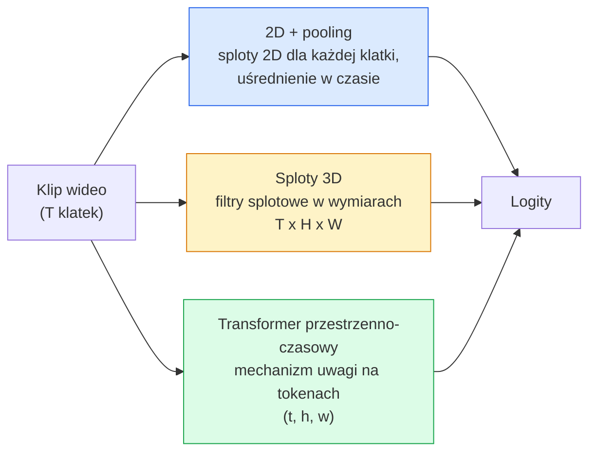

Created At: 2026-06-08T18:19:24Z
Completed At: 2026-06-08T18:19:24Z
File Path: `file:///C:/poligon/LLM_Traning/phases/04-computer-vision/12-video-understanding/docs/pl_pro.md`

# Rozumienie wideo – modelowanie czasowe

> Wideo to sekwencja obrazów połączonych fizyką ruchu. Modele przetwarzania wideo traktują wymiar czasu jako dodatkową oś (sploty 3D), sekwencję elementów (Transformery) lub po prostu wyodrębniają i agregują cechy z pojedynczych klatek (2D + pooling).

**Typ:** Ucz się + Buduj  
**Języki:** Python  
**Wymagania wstępne:** Faza 4, lekcja 03 (CNN); faza 4, lekcja 04 (klasyfikacja obrazów)  
**Czas:** ~45 minut  

## Cele nauczania

- Rozróżniać trzy główne podejścia do modelowania wideo (2D + pooling, sploty 3D, Transformery przestrzenno-czasowe) oraz oceniać ich kompromisy pod względem kosztu obliczeniowego i dokładności.
- Zaimplementować próbkowanie klatek (frame sampling), agregację czasową (temporal pooling) oraz bazowy klasyfikator typu 2D + pooling w PyTorch.
- Wyjaśnić koncepcję „nadmuchiwania” (inflation) jąder splotowych w modelach I3D w celu ponownego wykorzystania wag z ImageNet, a także zasadę działania splotów rozdzielnych (2+1)D.
- Zinterpretować standardowe zbiory danych i metryki stosowane w rozpoznawaniu aktywności (Kinetics-400/600, UCF101, Something-Something V2), w tym różnice między dokładnością mierzoną na poziomie pojedynczego klipu a całego wideo.

## Problem

30-sekundowy klip wideo nagrany w 30 klatkach na sekundę (fps) składa się z 900 pojedynczych obrazów. Najprostsze, naiwne podejście do klasyfikacji wideo polega na wykonaniu klasyfikacji obrazu 900 razy i późniejszej agregacji wyników. Taka metoda sprawdza się, gdy akcję można jednoznacznie zidentyfikować na podstawie pojedynczych klatek (np. w nagraniach sportowych, kulinarnych czy instruktażach ćwiczeń), jednak zawodzi całkowicie, gdy istotą czynności jest sam ruch. Przykładowo, czynność „przesuwanie przedmiotu od lewej do prawej” w każdej pojedynczej klatce wygląda identycznie jak nieruchomy obiekt.

Kluczowym pytaniem przy projektowaniu dowolnej architektury przetwarzania wideo jest: w którym momencie i w jaki sposób modelowana jest zależność czasowa? Odpowiedź na to pytanie rzutuje na wszystkie inne aspekty projektu – od kosztów obliczeniowych, przez strategię pre-treningu i możliwość ponownego wykorzystania wag z ImageNet, aż po wybór zbiorów danych szkoleniowych.

Niniejsza lekcja jest celowo bardziej zwięzła niż te poświęcone obrazom statycznym. Bazowe mechanizmy ekstrakcji cech z obrazów są już nam znane; tutaj skupiamy się na modelowaniu dynamiki czasu: próbkowaniu klatek, reprezentacji ruchu oraz agregacji cech czasowych.

## Koncepcja

### Trzy rodziny architektur



### 2D + pooling

Używamy standardowej sieci CNN 2D (np. ResNet, EfficientNet, ViT). Uruchamiamy ją niezależnie dla każdej z próbkowanych klatek. Następnie agregujemy wygenerowane wektory cech (np. stosując uśrednianie – average pooling, wybieranie maksimów – max pooling lub mechanizm uwagi – attention pooling) i przekazujemy wynikowy wektor do klasyfikatora.

**Zalety:**
- Możliwość bezpośredniego transferu wag pre-trenowanych na ImageNet.
- Bardzo prosta implementacja.
- Niski koszt obliczeniowy (liniowa zależność od liczby klatek $T$).

**Wady:**
- Brak modelowania relacji ruchu. Aktywność jest traktowana jedynie jako suma statycznych kadrów.
- Agregacja czasowa ignoruje kolejność klatek; akcje takie jak „otwieranie drzwi” i „zamykanie drzwi” dają identyczny wektor cech.

**Kiedy stosować:** Zadania klasyfikacji oparte głównie na wyglądzie obiektów, transfer wiedzy przy małych zbiorach danych wideo, budowa pierwszych modeli bazowych (baselines).

### Sploty 3D (3D Convolutions)

Zastępujemy filtry splotowe o wymiarach $(H, W)$ filtrami trójwymiarowymi $(T, H, W)$. Sieć dokonuje splotu jednocześnie w przestrzeni i w czasie. Klasycznymi modelami z tej rodziny są C3D, I3D oraz SlowFast.

Koncepcja I3D (Inflated 3D): bierzemy model 2D pre-trenowany na ImageNet i „nadmuchujemy” (inflate) każde jądro splotu 2D poprzez skopiowanie jego wag wzdłuż nowej osi czasu (wymiaru $T$). Filtr splotowy $3 \times 3$ staje się filtrem $3 \times 3 \times 3$ (wartości wag dzieli się przez 3, aby zachować skalę aktywacji). Dzięki temu model 3D startuje z bardzo dobrych wag początkowych, zamiast uczyć się od zera.

**Zalety:**
- Bezpośrednie modelowanie dynamiki ruchu.
- „Nadmuchiwanie” wag (I3D) zapewnia efektywny transfer wiedzy z dużych zbiorów obrazów.

**Wady:**
- Drastyczny wzrost kosztu obliczeniowego (np. ok. 3-krotny wzrost liczby operacji FLOP dla filtrów o rozmiarze czasowym 3).
- Filtry splotowe mają mały zasięg czasowy; wykrywanie zależności długoterminowych wymaga stosowania struktur piramidalnych lub modeli dwustrumieniowych (two-stream models).

**Kiedy stosować:** Rozpoznawanie aktywności, w których ruch jest kluczowym elementem definicji klasy (np. Something-Something V2, Kinetics).

### Transformery przestrzenno-czasowe (Spatio-Temporal Transformers)

Wideo jest dzielone na siatkę trójwymiarowych kostek (spatiotemporal patches), a relacje między nimi są modelowane za pomocą mechanizmu uwagi. Przykładami są TimeSformer, ViViT, Video Swin oraz VideoMAE.

Warianty mechanizmu uwagi:
- **Uwaga połączona (Joint Attention)** – obliczanie uwagi dla wszystkich tokenów przestrzenno-czasowych jednocześnie. Charakteryzuje się kwadratową złożonością względem liczby tokenów ($O((T \cdot H \cdot W)^2)$), co czyni ją bardzo kosztowną.
- **Uwaga rozdzielona (Divided Attention)** – dwa oddzielne moduły uwagi w każdym bloku: jeden analizuje wyłącznie wymiar czasu, drugi wyłącznie wymiar przestrzeni. Zapewnia to liniową skalowalność względem liczby klatek.
- **Uwaga faktoryzowana (Factorized Attention)** – przeplatanie warstw uwagi czasowej i przestrzennej w kolejnych blokach sieci.

**Zalety:**
- Najwyższa jakość (SOTA) we wszystkich wiodących testach porównawczych.
- Łasy transfer wag z modeli ViT (poprzez rzutowanie patchów 2D w wymiar 3D).
- Możliwość przetwarzania długich sekwencji wideo przy użyciu technik rzadkiej uwagi (sparse attention).

**Wady:**
- Ekstremalnie wysokie wymagania sprzętowe i obliczeniowe.
- Konieczność precyzyjnego doboru wariantów uwagi w celu uniknięcia przepełnienia pamięci GPU.

**Kiedy stosować:** Przetwarzanie dużych zbiorów danych, zaawansowane systemy analizy wideo, zadania multimodalne (np. wideo-tekst).

### Strategie próbkowania klatek

10-sekundowy klip wideo nagrany w 30 fps to aż 300 klatek; przetwarzanie wszystkich klatek przez model jest nieefektywne. Stosuje się następujące strategie próbkowania:

- **Próbkowanie równomierne (Uniform Sampling)** – wybór $T$ klatek równomiernie rozłożonych w całym klipie. Jest to standardowa metoda dla modeli typu 2D + pooling.
- **Próbkowanie gęste (Dense Sampling)** – wycięcie spójnego, ciągłego fragmentu o długości $T$ klatek z losowego miejsca w wideo. Metoda ta jest kluczowa dla splotów 3D, które wymagają zachowania płynności ruchu między sąsiadującymi klatkami.
- **Próbkowanie wielokrotne (Multi-clip/Multi-view Sampling)** – pobranie kilku różnych fragmentów z jednego nagrania, niezależne sklasyfikowanie każdego z nich i uśrednienie wyników na etapie testowania.

Liczba klatek $T$ wynosi zazwyczaj 8, 16, 32 lub 64. Większa wartość $T$ dostarcza więcej informacji o dynamice czasu, kosztem proporcjonalnego wzrostu narzutu obliczeniowego.

### Metodologia oceny (Evaluation)

Wyniki podaje się na dwóch poziomach:

- **Dokładność na poziomie klipu (Clip-level accuracy)** – model klasyfikuje pojedynczy wycięty fragment o długości $T$ klatek.
- **Dokładność na poziomie wideo (Video-level accuracy)** – predykcje modelu są uśredniane dla wielu klipów wyciętych z tego samego filmu. Wskaźnik ten jest zazwyczaj wyższy i bardziej stabilny.

Dobre praktyki wymagają raportowania obu tych metryk. Model osiągający 78% na poziomie klipu i 82% na poziomie wideo mocno polega na uśrednianiu wyników na etapie testowania. Model o wynikach 80% / 81% wykazuje znacznie większą stabilność dla pojedynczych wycinków.

### Najważniejsze zbiory danych

- **Kinetics-400 / 600 / 700** – uniwersalny zbiór danych rozpoznawania aktywności. Zawiera setki tysięcy krótkich wycinków z serwisu YouTube (należy pamiętać, że część oryginalnych linków z czasem wygasła).
- **Something-Something V2** – zbiór skupiony wokół interakcji z fizyką i kierunkiem ruchu (np. „przesuwanie obiektu od lewej do prawej”). Niemożliwy do poprawnego sklasyfikowania przy użyciu prostych modeli 2D + pooling.
- **UCF-101** oraz **HMDB-51** – klasyczne, znacznie mniejsze zbiory danych, wciąż używane w celach akademickich.
- **AVA** – zbiór przeznaczony do detekcji oraz lokalizacji przestrzenno-czasowej aktywności (spatiotemporal localization), co stanowi trudniejsze zadanie niż zwykła klasyfikacja.

## Zbuduj to

### Krok 1: Implementacja próbników klatek

Próbkowanie równomierne (uniform) oraz gęste (dense) na podstawie całkowitej liczby klatek filmu.

```python
import numpy as np

def sample_uniform(num_frames_total, T):
    if num_frames_total <= T:
        return list(range(num_frames_total)) + [num_frames_total - 1] * (T - num_frames_total)
    step = num_frames_total / T
    return [int(i * step) for i in range(T)]

def sample_dense(num_frames_total, T, rng=None):
    rng = rng or np.random.default_rng()
    if num_frames_total <= T:
        return list(range(num_frames_total)) + [num_frames_total - 1] * (T - num_frames_total)
    start = int(rng.integers(0, num_frames_total - T + 1))
    return list(range(start, start + T))
```

Obie funkcje zwracają listę indeksów o długości `T` służących do indeksowania tensora wideo.

### Krok 2: Bazowy model 2D + pooling

Wykorzystanie sieci ResNet-18 do ekstrakcji cech z klatek, uśrednienie reprezentacji i klasyfikacja końcowa.

```python
import torch
import torch.nn as nn
from torchvision.models import resnet18, ResNet18_Weights

class FramePool(nn.Module):
    def __init__(self, num_classes=400, pretrained=True):
        super().__init__()
        weights = ResNet18_Weights.IMAGENET1K_V1 if pretrained else None
        backbone = resnet18(weights=weights)
        self.features = nn.Sequential(*(list(backbone.children())[:-1]))  # zachowuje pooling przestrzenny
        self.head = nn.Linear(512, num_classes)

    def forward(self, x):
        # Wejście x: (N, T, 3, H, W)
        N, T = x.shape[:2]
        x = x.view(N * T, *x.shape[2:])
        feats = self.features(x).view(N, T, -1)
        pooled = feats.mean(dim=1)
        return self.head(pooled)

model = FramePool(num_classes=10)
x = torch.randn(2, 8, 3, 224, 224)
print(f"Wyjście kształt: {model(x).shape}")
print(f"Liczba parametrów: {sum(p.numel() for p in model.parameters()):,}")
```

Model ten posiada ok. 11 milionów parametrów, wykorzystuje wagi pre-trenowane na ImageNet, przetwarza klatki niezależnie, a następnie uśrednia cechy przed klasyfikacją. Taki model bazowy (baseline) w zadaniach opartych na analizie wyglądu obiektów osiąga często wyniki gorsze o zaledwie 5–10 punktów procentowych od zaawansowanych modeli 3D, a w niektórych przypadkach może je przewyższyć dzięki lepszemu transferowi cech przestrzennych.

### Krok 3: Konwersja 3D metodą inflacji wag (styl I3D)

Przekształcenie warstwy splotu 2D do postaci 3D poprzez powielenie wag wzdłuż nowej osi czasowej.

```python
def inflate_2d_to_3d(conv2d, time_kernel=3):
    out_c, in_c, kh, kw = conv2d.weight.shape
    weight_3d = conv2d.weight.data.unsqueeze(2)  # (out, in, 1, kh, kw)
    weight_3d = weight_3d.repeat(1, 1, time_kernel, 1, 1) / time_kernel
    conv3d = nn.Conv3d(in_c, out_c, kernel_size=(time_kernel, kh, kw),
                        padding=(time_kernel // 2, conv2d.padding[0], conv2d.padding[1]),
                        stride=(1, conv2d.stride[0], conv2d.stride[1]),
                        bias=False)
    conv3d.weight.data = weight_3d
    return conv3d

conv2d = nn.Conv2d(3, 64, kernel_size=3, padding=1, bias=False)
conv3d = inflate_2d_to_3d(conv2d, time_kernel=3)
print(f"2D wagi kształt:  {tuple(conv2d.weight.shape)}")
print(f"3D wagi kształt:  {tuple(conv3d.weight.shape)}")
x = torch.randn(1, 3, 8, 56, 56)
print(f"3D wyjście kształt: {tuple(conv3d(x).shape)}")
```

Podział wag przez wartość `time_kernel` pozwala na zachowanie zbliżonego poziomu aktywacji, co zapobiega rozregulowaniu statystyk warstw Batch Normalization przy pierwszym przejściu danych.

### Krok 4: Implementacja splotu (2+1)D

Rozbicie splotu trójwymiarowego na splot przestrzenny 2D oraz następujący po nim splot czasowy 1D. Takie rozwiązanie zapewnia identyczne pole odbiorcze (receptive field) przy mniejszej liczbie parametrów i wyższej dokładności w testach porównawczych.

```python
class Conv2Plus1D(nn.Module):
    def __init__(self, in_c, out_c, kernel_size=3):
        super().__init__()
        mid_c = (in_c * out_c * kernel_size * kernel_size * kernel_size) \
                // (in_c * kernel_size * kernel_size + out_c * kernel_size)
        self.spatial = nn.Conv3d(in_c, mid_c, kernel_size=(1, kernel_size, kernel_size),
                                 padding=(0, kernel_size // 2, kernel_size // 2), bias=False)
        self.bn = nn.BatchNorm3d(mid_c)
        self.act = nn.ReLU(inplace=True)
        self.temporal = nn.Conv3d(mid_c, out_c, kernel_size=(kernel_size, 1, 1),
                                  padding=(kernel_size // 2, 0, 0), bias=False)

    def forward(self, x):
        return self.temporal(self.act(self.bn(self.spatial(x))))

c = Conv2Plus1D(3, 64)
x = torch.randn(1, 3, 8, 56, 56)
print(f"Kształt wyjścia (2+1)D: {tuple(c(x).shape)}")
```

Kompletna sieć R(2+1)D-18 jest analogiczna do modelu ResNet-18, w którym każda standardowa warstwa splotu 2D została zastąpiona przez blok `Conv2Plus1D`.

## Biblioteki

Dwie główne biblioteki obsługujące przetwarzanie wideo w ekosystemie PyTorch to:

- `torchvision.models.video` – zawiera modele R(2+1)D, MViT, Swin3D wraz z gotowymi wagami przeszkolonymi na zbiorze Kinetics. Korzysta z tego samego interfejsu co moduły obrazów.
- `pytorchvideo` (tworzona przez Meta) – biblioteka zawierająca bogate zoo modeli, wydajne moduły ładujące dane (loader-y dla Kinetics, SSv2, AVA) oraz zoptymalizowane transformacje wideo.

W zadaniach łączących wideo z przetwarzaniem tekstu (np. automatyczne opisywanie wideo – video captioning, czy odpowiadanie na pytania – Video QA) stosuje się bibliotekę `transformers` i modele takie jak `VideoMAE`, `VideoLLaMA` czy `InternVideo`.

## Wyślij to

Niniejsza lekcja dostarcza:

- `outputs/prompt-video-architecture-picker.md` – prompt ułatwiający dobór architektury (2D+pooling, I3D, (2+1)D lub Transformer) na podstawie relacji cech statycznych do ruchu, rozmiaru zbioru danych i budżetu obliczeniowego.
- `outputs/skill-frame-sampler-auditor.md` – narzędzie do audytu potoków przetwarzania wideo, wykrywające typowe błędy implementacyjne (np. przesunięcia indeksów off-by-one, niepoprawne próbkowanie przy małej liczbie klatek, brak zachowania proporcji kadru itp.).

## Ćwiczenia

1. **(Łatwe)** Oblicz (szacunkowo) liczbę operacji FLOP dla modelu `FramePool` (z parametrem T=8) i porównaj ją z modelem 3D ResNet (styl I3D, T=8). Uzasadnij matematycznie, dlaczego podejście 2D + pooling jest zazwyczaj 3-5 razy tańsze obliczeniowo.
2. **(Średnie)** Wygeneruj syntetyczny zbiór danych wideo: stwórz nagrania z kulami poruszającymi się w różnych kierunkach i przypisz im etykiety (np. „ruch w lewo”, „ruch w prawo”, „ruch po skosie”). Wytrenuj na tym zbiorze model `FramePool`. Wykaż, że dokładność modelu oscyluje wokół poziomu losowego (zgadywania), co dowodzi, że analiza cech statycznych klatek jest niewystarczająca do detekcji ruchu.
3. **(Trudne)** Zaimplementuj pełny model R(2+1)D-18 poprzez zastąpienie wszystkich warstw splotowych 2D w ResNet-18 blokami `Conv2Plus1D`. Zainicjuj wagi pierwszej warstwy za pomocą techniki inflacji, korzystając z wag ImageNet. Wytrenuj model na zbiorze danych z ćwiczenia 2 i udowodnij jego przewagę nad klasycznym podejściem `FramePool`.

## Kluczowe terminy

| Termin | Obiegowe określenie | Co to oznacza w rzeczywistości |
|------|----------------|----------------------|
| 2D + pooling | Agregacja klatek | Metoda polegająca na przetworzeniu każdej klatki za pomocą sieci 2D CNN, uśrednieniu cech na osi czasu i przekazaniu ich do klasyfikatora |
| Splot 3D (3D Convolution) | Filtry przestrzenno-czasowe | Jądro splotu o wymiarach (T, H, W) realizujące splot jednocześnie w czasie i przestrzeni; pozwala bezpośrednio modelować ruch |
| Inflacja wag (Inflation) | Nadmuchiwanie wag 2D do 3D | Technika inicjalizacji wag splotu 3D poprzez powielenie wag splotu 2D wzdłuż osi czasu i podzielenie ich przez rozmiar filtra czasowego w celu zachowania skali aktywacji |
| Splot (2+1)D | Splot faktoryzowany | Rozbicie splotu 3D na splot przestrzenny 2D i czasowy 1D; zmniejsza liczbę parametrów oraz wprowadza dodatkową funkcję aktywacji pomiędzy filtrami |
| Uwaga rozdzielona (Divided Attention) | Rozdzielenie osi | Blok Transformera obliczający uwagę osobno dla tokenów w obrębie tej samej klatki (przestrzeń), a osobno wzdłuż tej samej pozycji na osi czasu (czas) |
| Klip wideo (Clip) | Fragment sekwencji | Podsekwencja składająca się z $T$ klatek stanowiąca bezpośrednie wejście do modelu |
| Dokładność klipu a wideo (Clip vs. Video Accuracy) | Metody ewaluacji | Ocena na poziomie klipu (pojedyncza próbka) vs. ocena na poziomie wideo (uśredniona predykcja z wielu próbek dla jednego filmu) |
| Kinetics | Standardowy zbiór wideo | Duże zbiory danych (Kinetics 400/600/700) zawierające nagrania z YouTube pogrupowane w klasy aktywności; standard do pre-treningu modeli wideo |

## Literatura uzupełniająca

- [Quo Vadis, Action Recognition? A New Model and the Kinetics Dataset (Carreira & Zisserman, 2017)](https://arxiv.org/abs/1705.07750) – wprowadzenie techniki inflacji wag (I3D) oraz publikacja zbioru Kinetics.
- [A Closer Look at Spatiotemporal Convolutions for Action Recognition (Tran et al., 2018)](https://arxiv.org/abs/1711.11248) – szczegółowa analiza i wprowadzenie architektury splotów rozdzielnych R(2+1)D.
- [Is Space-Time Attention All You Need for Video Understanding? (Bertasius et al., 2021)](https://arxiv.org/abs/2102.05095) – jedna z pierwszych prac wprowadzających zoptymalizowane Transformery wideo (TimeSformer).
- [VideoMAE: Masked Autoencoders are Data-Efficient Learners for Self-Supervised Video Pre-Training (Tong et al., 2022)](https://arxiv.org/abs/2203.12602) – wprowadzenie metody samo-nadzorowanego uczenia za pomocą maskowania tokenów przestrzenno-czasowych.
