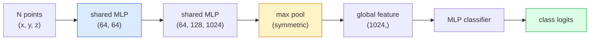

# Wizja 3D — chmury punktów i NeRF

> Wizja 3D występuje w dwóch wersjach. Chmury punktów to surowy wynik czujnika. NeRF to wyuczone pole wolumetryczne. Obie odpowiadają: „co jest gdzie w kosmosie”.

**Typ:** Ucz się + Buduj
**Języki:** Python
**Wymagania wstępne:** Faza 4, lekcja 03 (CNN), faza 1, lekcja 12 (operacje tensorowe)
**Czas:** ~45 minut

## Cele nauczania

- Rozróżnij jawne (chmura punktów, siatka, woksel) i ukryte (pole odległości ze znakiem, NeRF) reprezentacje 3D i kiedy każda z nich jest używana
- Zrozumienie sztuczki z funkcją symetryczną PointNet, która sprawia, że permutacja sieci neuronowej jest niezmienna w przypadku nieuporządkowanego zbioru punktów
- Śledzenie przejścia do przodu NeRF: rzucanie promieni, renderowanie wolumetryczne, kodowanie pozycyjne, gęstość MLP + głowica kolorów
- Użyj `nerfstudio` lub `instant-ngp` do wstępnie wytrenowanej rekonstrukcji 3D z małego zestawu pozowanych obrazów

## Problem

Kamera generuje obraz 2D. LIDAR generuje zestaw punktów 3D bez uporządkowania. Potok struktury z ruchu tworzy rzadką chmurę kluczowych punktów 3D. NeRF rekonstruuje całą scenę 3D z kilku pozowanych obrazów. Wszystko to jest „wizją”, ale żaden nie wygląda tak, jak gęsty tensor, jakiego oczekuje CNN.

Wizja 3D ma znaczenie, ponieważ prawie każde zadanie robota o dużej wartości odbywa się w 3D: chwytanie, unikanie przeszkód, nawigacja, okluzja AR, przechwytywanie treści 3D. Inżynier wizyjny, który rozumie tylko obrazy 2D, jest wykluczony z najszybciej rozwijającego się segmentu dziedziny (treści AR/VR, robotyka, autonomiczne stosy jazdy, rekonstrukcja 3D oparta na NeRF dla nieruchomości lub budownictwa).

Obie reprezentacje dominują z różnych powodów. Chmury punktów to coś, co czujniki dają Ci za darmo. NeRF i ich następcy (rozpryskiwanie 3D Gaussa, neuronowe SDF) są tym, co otrzymasz, gdy poprosisz sieć neuronową o nauczenie się sceny.

## Koncepcja

### Chmury punktów

Chmura punktów to nieuporządkowany zbiór N punktów w R^3, opcjonalnie każdy z cechami (kolor, intensywność, normalność).

```
cloud = [
  (x1, y1, z1, r1, g1, b1),
  (x2, y2, z2, r2, g2, b2),
  ...
  (xN, yN, zN, rN, gN, bN),
]
```

Żadnej sieci, żadnej łączności. Dwie właściwości utrudniają to w przypadku sieci neuronowych:

- **Niezmienniczość permutacji** — wynik nie może zależeć od kolejności punktów.
- **Zmienna N** — pojedynczy model musi obsługiwać chmury o różnych rozmiarach.

PointNet (Qi i in., 2017) rozwiązał oba problemy, mając jeden pomysł: zastosować współdzielony MLP do każdego punktu, a następnie agregować za pomocą funkcji symetrycznej (maksymalna pula). Rezultatem jest wektor o stałym rozmiarze, który nie zależy od kolejności.

```
f(P) = max_{p in P} MLP(p)
```

To jest cały rdzeń PointNet. Głębsze warianty (PointNet++, Point Transformer) dodają próbkowanie hierarchiczne i lokalną agregację, ale sztuczka z funkcją symetryczną pozostaje niezmieniona.

### Architektura PointNet



„Wspólny MLP” oznacza, że ten sam MLP działa niezależnie w każdym punkcie. Wdrożono jako konwersję 1x1 w wymiarze punktowym w celu zwiększenia wydajności.

### Neuronowe pola promieniowania (NeRF)

Zespół NeRF (Mildenhall i in., 2020) zadał pytanie „czy możemy zrekonstruować scenę 3D z N zdjęć?” i odpowiedział siecią neuronową, która jest sceną. Sieć mapuje `(x, y, z, viewing_direction)` na `(density, colour)`. Renderowanie nowego widoku to pętla rzutowania promieni w tej sieci.

```
NeRF MLP:  (x, y, z, theta, phi) -> (sigma, r, g, b)

To render a pixel (u, v) of a new view:
  1. Cast a ray from the camera through pixel (u, v)
  2. Sample points along the ray at distances t_1, t_2, ..., t_N
  3. Query the MLP at each point
  4. Composite the colours weighted by (1 - exp(-sigma * dt))
  5. The sum is the rendered pixel colour
```

Utrata porównuje wyrenderowany piksel z rzeczywistym pikselem na zdjęciach treningowych. Backprop na etapie renderowania aktualizuje MLP. Żadnej prawdy 3D, żadnej wyraźnej geometrii – scena jest przechowywana w wagach MLP.

### Kodowanie pozycyjne w NeRF

Zwykły MLP na `(x, y, z)` nie może reprezentować szczegółów o wysokiej częstotliwości, ponieważ MLP są widmowo przesunięte w stronę niskich częstotliwości. NeRF rozwiązuje ten problem, kodując każdą współrzędną do wektora cech Fouriera przed MLP:

```
gamma(p) = (sin(2^0 pi p), cos(2^0 pi p), sin(2^1 pi p), cos(2^1 pi p), ...)
```

Do L=10 poziomów częstotliwości. Jest to ta sama sztuczka, której używają transformatory do określenia pozycji i pojawia się ona ponownie w warunkowaniu czasu dyfuzji (lekcja 10). Bez tego NeRF wyglądają na rozmazane.

### Renderowanie wolumetryczne

```
C(r) = sum_i T_i * (1 - exp(-sigma_i * delta_i)) * c_i

T_i  = exp(- sum_{j<i} sigma_j * delta_j)
delta_i = t_{i+1} - t_i
```

`T_i` to przepuszczalność — ile światła dociera do punktu i. `(1 - exp(-sigma_i * delta_i))` to nieprzezroczystość w punkcie i. `c_i` to kolor. Ostatni piksel jest sumą ważoną wzdłuż promienia.

### Co zastąpiło NeRF

Czyste NeRF uczą się powoli (w godzinach) i renderują (w sekundach na obraz). Rodowód od:

- **Instant-NGP** (2022) – kodowanie w formie siatki mieszającej zastępuje dane wejściowe dotyczące pozycji MLP; pociągi w ciągu kilku sekund.
- **Mip-NeRF 360** — obsługuje nieograniczone sceny i wygładzanie krawędzi.
- **3D Gaussian Splatting** (2023) — zastępuje pole wolumetryczne milionami trójwymiarowych Gaussów; pociągi w ciągu kilku minut, renderowane w czasie rzeczywistym. Bieżąca wartość domyślna produkcyjna.

Prawie każdy prawdziwy produkt NeRF w 2026 roku będzie w rzeczywistości trójwymiarowym rozpryskiem Gaussa. Model mentalny to nadal NeRF.

### Zbiory danych i testy porównawcze

- **ShapeNet** — klasyfikacja i segmentacja modeli 3D CAD w postaci chmur punktów.
- **ScanNet** — rzeczywiste skany wnętrz w celu segmentacji.
- **KITTI** — zewnętrzne chmury punktów LIDAR do jazdy autonomicznej.
- **NeRF Synthetic** / **Mieszany MVS** — zbiory danych pozowanych obrazów do syntezy widoku.
- Zbiór danych **Mip-NeRF 360** — nieograniczone, rzeczywiste sceny.

## Zbuduj to

### Krok 1: Klasyfikator PointNet

```python
import torch
import torch.nn as nn

class PointNet(nn.Module):
    def __init__(self, num_classes=10):
        super().__init__()
        self.mlp1 = nn.Sequential(
            nn.Conv1d(3, 64, 1),    nn.BatchNorm1d(64),   nn.ReLU(inplace=True),
            nn.Conv1d(64, 64, 1),   nn.BatchNorm1d(64),   nn.ReLU(inplace=True),
        )
        self.mlp2 = nn.Sequential(
            nn.Conv1d(64, 128, 1),  nn.BatchNorm1d(128),  nn.ReLU(inplace=True),
            nn.Conv1d(128, 1024, 1), nn.BatchNorm1d(1024), nn.ReLU(inplace=True),
        )
        self.head = nn.Sequential(
            nn.Linear(1024, 512),   nn.BatchNorm1d(512),  nn.ReLU(inplace=True),
            nn.Dropout(0.3),
            nn.Linear(512, 256),    nn.BatchNorm1d(256),  nn.ReLU(inplace=True),
            nn.Dropout(0.3),
            nn.Linear(256, num_classes),
        )

    def forward(self, x):
        # x: (N, 3, num_points) — transposed for Conv1d
        x = self.mlp1(x)
        x = self.mlp2(x)
        x = torch.max(x, dim=-1)[0]       # (N, 1024)
        return self.head(x)

pts = torch.randn(4, 3, 1024)
net = PointNet(num_classes=10)
print(f"output: {net(pts).shape}")
print(f"params: {sum(p.numel() for p in net.parameters()):,}")
```

Około 1,6 mln parametrów. Działa na 1024 punktach na chmurę.

### Krok 2: Kodowanie pozycyjne

```python
def positional_encoding(x, L=10):
    """
    x: (..., D) -> (..., D * 2 * L)
    """
    freqs = 2.0 ** torch.arange(L, dtype=x.dtype, device=x.device)
    args = x.unsqueeze(-1) * freqs * 3.141592653589793
    sinc = torch.cat([args.sin(), args.cos()], dim=-1)
    return sinc.reshape(*x.shape[:-1], -1)

x = torch.randn(5, 3)
y = positional_encoding(x, L=10)
print(f"input:  {x.shape}")
print(f"encoded: {y.shape}     # (5, 60)")
```

Mnożenie przez `2^l * pi` daje stopniowo wyższe częstotliwości.

### Krok 3: Mały NeRF MLP

```python
class TinyNeRF(nn.Module):
    def __init__(self, L_pos=10, L_dir=4, hidden=128):
        super().__init__()
        self.L_pos = L_pos
        self.L_dir = L_dir
        pos_dim = 3 * 2 * L_pos
        dir_dim = 3 * 2 * L_dir
        self.trunk = nn.Sequential(
            nn.Linear(pos_dim, hidden), nn.ReLU(inplace=True),
            nn.Linear(hidden, hidden),  nn.ReLU(inplace=True),
            nn.Linear(hidden, hidden),  nn.ReLU(inplace=True),
            nn.Linear(hidden, hidden),  nn.ReLU(inplace=True),
        )
        self.sigma = nn.Linear(hidden, 1)
        self.color = nn.Sequential(
            nn.Linear(hidden + dir_dim, hidden // 2), nn.ReLU(inplace=True),
            nn.Linear(hidden // 2, 3), nn.Sigmoid(),
        )

    def forward(self, x, d):
        x_enc = positional_encoding(x, self.L_pos)
        d_enc = positional_encoding(d, self.L_dir)
        h = self.trunk(x_enc)
        sigma = torch.relu(self.sigma(h)).squeeze(-1)
        rgb = self.color(torch.cat([h, d_enc], dim=-1))
        return sigma, rgb

nerf = TinyNeRF()
x = torch.randn(128, 3)
d = torch.randn(128, 3)
s, c = nerf(x, d)
print(f"sigma: {s.shape}   rgb: {c.shape}")
```

Mały w porównaniu do oryginalnego NeRF (który ma 2 pnie MLP o głębokości 8). Wystarczająco, aby zademonstrować architekturę.

### Krok 4: Renderowanie wolumetryczne wzdłuż promienia

```python
def volumetric_render(sigma, rgb, t_vals):
    """
    sigma: (..., N_samples)
    rgb:   (..., N_samples, 3)
    t_vals: (N_samples,) distances along the ray
    """
    delta = torch.cat([t_vals[1:] - t_vals[:-1], torch.full_like(t_vals[:1], 1e10)])
    alpha = 1.0 - torch.exp(-sigma * delta)
    trans = torch.cumprod(torch.cat([torch.ones_like(alpha[..., :1]), 1.0 - alpha + 1e-10], dim=-1), dim=-1)[..., :-1]
    weights = alpha * trans
    rendered = (weights.unsqueeze(-1) * rgb).sum(dim=-2)
    depth = (weights * t_vals).sum(dim=-1)
    return rendered, depth, weights

N = 64
t_vals = torch.linspace(2.0, 6.0, N)
sigma = torch.rand(N) * 0.5
rgb = torch.rand(N, 3)
rendered, depth, weights = volumetric_render(sigma, rgb, t_vals)
print(f"rendered colour: {rendered.tolist()}")
print(f"depth:           {depth.item():.2f}")
```

Jeden promień, 64 próbki, złożone z pojedynczego piksela RGB i głębokości.

## Użyj tego

Do prawdziwej pracy:

- `nerfstudio` (Tancik et al.) — aktualna biblioteka referencyjna dla NeRF / Instant-NGP / Gaussian Splatting. Wiersz poleceń i przeglądarka internetowa.
- `pytorch3d` (Meta) — renderowanie różniczkowe, narzędzia chmury punktów, operacje siatkowe.
- `open3d` — przetwarzanie chmury punktów, rejestracja, wizualizacja.

Na potrzeby wdrożenia rozpryskiwanie gaussowskie 3D w dużej mierze zastąpiło czyste NeRF, ponieważ renderuje 100 razy szybciej. Jakość rekonstrukcji jest porównywalna.

## Wyślij to

Ta lekcja daje:

- `outputs/prompt-3d-task-router.md` — podpowiedź, która kieruje do właściwej reprezentacji 3D (chmura punktów, siatka, woksel, NeRF, ikona Gaussa) w oparciu o zadanie i dane wejściowe.
- `outputs/skill-point-cloud-loader.md` — umiejętność pisania PyTorch `Dataset` dla plików .ply / .pcd / .xyz z poprawną normalizacją, centrowaniem i próbkowaniem punktowym.

## Ćwiczenia

1. **(Łatwe)** Pokaż, że PointNet jest niezmienny pod względem permutacji: przeprowadź tę samą chmurę dwa razy, raz z przetasowanymi punktami. Sprawdź, czy wyjścia są identyczne aż do szumu zmiennoprzecinkowego.
2. **(Średni)** Zaimplementuj funkcję minimalnego generowania promieni, która, biorąc pod uwagę cechy charakterystyczne i położenie aparatu, generuje początki i kierunki promieni dla każdego piksela obrazu H x S.
3. **(Trudny)** Trenuj TinyNeRF na syntetycznym zestawie danych wyrenderowanych widoków kolorowej kostki (wygenerowanej poprzez renderowanie różniczkowe lub prosty znacznik promieni). Zgłoś utratę renderowania w epoce 1, 10 i 100. W jakiej epoce model generuje rozpoznawalne widoki?

## Kluczowe terminy

| Termin | Co ludzie mówią | Co to właściwie oznacza |
|------|----------------|----------------------|
| Chmura punktów | „Punkty 3D z LIDAR” | Nieuporządkowany zbiór (x, y, z) + opcjonalne cechy na punkt |
| PointNet | „Pierwsza sieć neuronowa na chmurach punktów” | Wspólny MLP na punkt + symetryczna (maks.) pula; permutacja-niezmiennik według konstrukcji |
| NeRF | „MLP to jest scena” | Mapowanie sieci (x, y, z, dir) na (gęstość, kolor); renderowane przez rzutowanie promieni |
| Kodowanie pozycyjne | „Cechy Fouriera” | Zakoduj każdą współrzędną w postaci sin/cos przy wielu częstotliwościach, aby przezwyciężyć odchylenie niskich częstotliwości MLP |
| Renderowanie wolumetryczne | „Integracja promieni” | Próbki złożone wzdłuż promienia do pojedynczego piksela przy użyciu transmitancji i alfa |
| Natychmiastowy-NGP | „Siatka mieszająca NeRF” | Zastępuje współrzędne MLP NeRF siatką mieszającą o wielu rozdzielczościach; 100-1000x szybciej |
| Rozpryskiwanie Gaussa 3D | „Miliony Gaussów” | Scena = zbiór trójwymiarowych Gaussów; renderuje w czasie rzeczywistym, pociągi w minutach |
| SDF | „Podpisane pole odległości” | Funkcja zwracająca odległość ze znakiem do najbliższej powierzchni; kolejna ukryta reprezentacja |

## Dalsze czytanie

- [PointNet (Qi et al., 2017)](https://arxiv.org/abs/1612.00593) — klasyfikator niezmienniczy permutacji
- [NeRF (Mildenhall et al., 2020)](https://arxiv.org/abs/2003.08934) — artykuł, w którym rekonstrukcja 3D ze zdjęć stała się problemem sieci neuronowej
- [Instant-NGP (Müller et al., 2022)](https://arxiv.org/abs/2201.05989) — siatki mieszające, przyspieszenie 1000x
- [3D Gaussian Splatting (Kerbl et al., 2023)](https://arxiv.org/abs/2308.04079) — architektura, która zastąpiła NeRF w produkcji