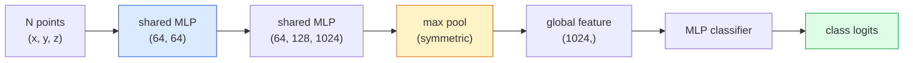

# Widzenie 3D — chmury punktów i NeRF-y

> Widzenie 3D ma dwa oblicza. Chmury punktów to surowy wynik z czujnika. NeRF-y to wyuczone pole wolumetryczne. Obie odpowiadają na pytanie „co znajduje się gdzie w przestrzeni".

**Typ:** Nauka + Budowanie
**Języki:** Python
**Wymagania wstępne:** Faza 4, Lekcja 03 (CNN), Faza 1, Lekcja 12 (Operacje na tensorach)
**Czas:** ~45 minut

## Cele nauki

- Rozróżnić jawne (chmura punktów, mesh, voksele) i niejawne (pole odległości znakowanej, NeRF) reprezentacje 3D oraz wiedzieć, kiedy stosuje się każdą z nich
- Zrozumieć trik PointNet z funkcją symetryczną, który czyni sieć neuronową niewrażliwą na permutację nieuporządkowanego zbioru punktów
- Przejść przez przebieg w przód NeRF-a: rzucanie promieni, renderowanie wolumetryczne, kodowanie pozycyjne, głowa MLP zwracająca gęstość i kolor
- Wykorzystać `nerfstudio` lub `instant-ngp` do wstępnie wytrenowanej rekonstrukcji 3D z niewielkiego zbioru obrazów z znanymi pozami kamery

## Problem

Kamera produkuje obraz 2D. LIDAR produkuje zbiór punktów 3D bez żadnego uporządkowania. Potok structure-from-motion produkuje rzadką chmurę punktów charakterystycznych 3D. NeRF rekonstruuje całą scenę 3D z kilku obrazów o znanych pozach. Wszystko to jest „widzeniem", ale żadne z tych danych nie wygląda jak gęsty tensor, którego oczekuje CNN.

Widzenie 3D ma znaczenie, ponieważ prawie każde wartościowe zadanie robotyczne odbywa się w 3D: chwytanie, unikanie przeszkód, nawigacja, okluzja w AR, przechwytywanie treści 3D. Inżynier wizji rozumiejący jedynie obrazy 2D jest odcięty od najszybciej rozwijającej się części tej dziedziny (treści AR/VR, robotyka, stosy autonomicznej jazdy, rekonstrukcja 3D oparta na NeRF dla nieruchomości czy budownictwa).

Te dwie reprezentacje dominują z różnych powodów. Chmury punktów to coś, co otrzymujemy od czujników za darmo. NeRF-y i ich następcy (splatting gaussowski 3D, neuronowe SDF-y) to coś, co otrzymujemy, gdy poprosimy sieć neuronową, by nauczyła się scenę.

## Koncepcja

### Chmury punktów

Chmura punktów to nieuporządkowany zbiór N punktów w R^3, opcjonalnie z cechami dla każdego punktu (kolor, intensywność, normalna).

```
cloud = [
  (x1, y1, z1, r1, g1, b1),
  (x2, y2, z2, r2, g2, b2),
  ...
  (xN, yN, zN, rN, gN, bN),
]
```

Brak siatki, brak łączności. Dwie właściwości czynią to trudnym dla sieci neuronowych:

- **Niewrażliwość na permutację** — wynik nie może zależeć od kolejności punktów.
- **Zmienne N** — jeden model musi obsługiwać chmury o różnych rozmiarach.

PointNet (Qi i in., 2017) rozwiązał obie kwestie jednym pomysłem: zastosować wspólny MLP do każdego punktu, a następnie zagregować wynik za pomocą funkcji symetrycznej (max pooling). Wynikiem jest wektor o ustalonym rozmiarze, niezależny od kolejności.

```
f(P) = max_{p in P} MLP(p)
```

To jest cały rdzeń PointNet. Głębsze warianty (PointNet++, Point Transformer) dodają hierarchiczne próbkowanie i lokalną agregację, ale trik z funkcją symetryczną pozostaje niezmieniony.

### Architektura PointNet



„Wspólny MLP" oznacza, że ten sam MLP działa na każdym punkcie niezależnie. Dla efektywności jest implementowany jako konwolucja 1x1 wzdłuż wymiaru punktów.

### Neural Radiance Fields (NeRF-y)

NeRF-y (Mildenhall i in., 2020) wzięły pytanie „czy możemy zrekonstruować scenę 3D z N zdjęć?" i odpowiedziały siecią neuronową, która sama jest tą sceną. Sieć mapuje `(x, y, z, kierunek_widzenia)` na `(gęstość, kolor)`. Renderowanie nowego widoku to pętla rzucania promieni przez tę sieć.

```
NeRF MLP:  (x, y, z, theta, phi) -> (sigma, r, g, b)

Aby wyrenderować piksel (u, v) nowego widoku:
  1. Wystrzel promień z kamery przez piksel (u, v)
  2. Pobierz próbki punktów wzdłuż promienia w odległościach t_1, t_2, ..., t_N
  3. Zapytaj MLP w każdym punkcie
  4. Złóż kolory z wagami (1 - exp(-sigma * dt))
  5. Suma jest wyrenderowanym kolorem piksela
```

Funkcja straty porównuje wyrenderowany piksel z pikselem prawdy podstawowej na zdjęciach treningowych. Propagacja wsteczna przez krok renderowania aktualizuje MLP. Brak prawdy podstawowej 3D, brak jawnej geometrii — scena jest przechowywana w wagach MLP.

### Kodowanie pozycyjne w NeRF

Zwykły MLP na `(x, y, z)` nie może reprezentować detali o wysokiej częstotliwości, ponieważ MLP-y są spektralnie obciążone w stronę niskich częstotliwości. NeRF rozwiązuje to, kodując każdą współrzędną w wektor cech Fouriera przed MLP:

```
gamma(p) = (sin(2^0 pi p), cos(2^0 pi p), sin(2^1 pi p), cos(2^1 pi p), ...)
```

Do L=10 poziomów częstotliwości. To ten sam trik, który transformery wykorzystują dla pozycji, i pojawia się on ponownie w warunkowaniu czasowym dyfuzji (Lekcja 10). Bez niego NeRF-y wyglądają rozmyto.

### Renderowanie wolumetryczne

```
C(r) = sum_i T_i * (1 - exp(-sigma_i * delta_i)) * c_i

T_i  = exp(- sum_{j<i} sigma_j * delta_j)
delta_i = t_{i+1} - t_i
```

`T_i` to transmitancja — ile światła przetrwa do punktu i. `(1 - exp(-sigma_i * delta_i))` to opacity (nieprzezroczystość) w punkcie i. `c_i` to kolor. Końcowy piksel jest sumą ważoną wzdłuż promienia.

### Co zastąpiło NeRF-y

Czyste NeRF-y są wolne w treningu (godziny) i wolne w renderowaniu (sekundy na obraz). Od tego momentu rozwój przebiegał tak:

- **Instant-NGP** (2022) — kodowanie hash-grid zastępuje wejście pozycyjne MLP; trenuje się w sekundach.
- **Mip-NeRF 360** — obsługuje nieograniczone sceny i wygładzanie krawędzi (anti-aliasing).
- **3D Gaussian Splatting** (2023) — zastępuje pole wolumetryczne milionami gaussianów 3D; trenuje się w minuty, renderuje w czasie rzeczywistym. Obecny domyślny standard produkcyjny.

Prawie każdy realny produkt typu NeRF w 2026 roku jest w rzeczywistości splattingiem gaussowskim 3D. Model mentalny pozostaje jednak modelem NeRF.

### Zbiory danych i benchmarki

- **ShapeNet** — klasyfikacja i segmentacja modeli CAD 3D jako chmur punktów.
- **ScanNet** — rzeczywiste skany wnętrz do segmentacji.
- **KITTI** — zewnętrzne chmury punktów LIDAR do autonomicznej jazdy.
- **NeRF Synthetic** / **Blended MVS** — zbiory obrazów z znanymi pozami do syntezy widoków.
- **Mip-NeRF 360** — zbiór danych z nieograniczonymi scenami rzeczywistymi.

## Zbuduj to

### Krok 1: Klasyfikator PointNet

```python
import torch
import torch.nn as nn

class PointNet(nn.Module):
    def __init__(self, num_classes=10):
        super().__init__()
        self.mlp1 = nn.Sequential(
            nn.Conv1d(3, 64, 1),    nn.BatchNorm1d(64),   nn.ReLU(inplace=True),
            nn.Conv1d(64, 64, 1),   nn.BatchNorm1d(64),   nn.ReLU(inplace=True),
        )
        self.mlp2 = nn.Sequential(
            nn.Conv1d(64, 128, 1),  nn.BatchNorm1d(128),  nn.ReLU(inplace=True),
            nn.Conv1d(128, 1024, 1), nn.BatchNorm1d(1024), nn.ReLU(inplace=True),
        )
        self.head = nn.Sequential(
            nn.Linear(1024, 512),   nn.BatchNorm1d(512),  nn.ReLU(inplace=True),
            nn.Dropout(0.3),
            nn.Linear(512, 256),    nn.BatchNorm1d(256),  nn.ReLU(inplace=True),
            nn.Dropout(0.3),
            nn.Linear(256, num_classes),
        )

    def forward(self, x):
        # x: (N, 3, num_points) — transposed for Conv1d
        x = self.mlp1(x)
        x = self.mlp2(x)
        x = torch.max(x, dim=-1)[0]       # (N, 1024)
        return self.head(x)

pts = torch.randn(4, 3, 1024)
net = PointNet(num_classes=10)
print(f"output: {net(pts).shape}")
print(f"params: {sum(p.numel() for p in net.parameters()):,}")
```

Około 1,6 mln parametrów. Działa na 1024 punktach na chmurę.

### Krok 2: Kodowanie pozycyjne

```python
def positional_encoding(x, L=10):
    """
    x: (..., D) -> (..., D * 2 * L)
    """
    freqs = 2.0 ** torch.arange(L, dtype=x.dtype, device=x.device)
    args = x.unsqueeze(-1) * freqs * 3.141592653589793
    sinc = torch.cat([args.sin(), args.cos()], dim=-1)
    return sinc.reshape(*x.shape[:-1], -1)

x = torch.randn(5, 3)
y = positional_encoding(x, L=10)
print(f"input:  {x.shape}")
print(f"encoded: {y.shape}     # (5, 60)")
```

Mnożenie przez `2^l * pi` daje coraz wyższe częstotliwości.

### Krok 3: Mały MLP NeRF

```python
class TinyNeRF(nn.Module):
    def __init__(self, L_pos=10, L_dir=4, hidden=128):
        super().__init__()
        self.L_pos = L_pos
        self.L_dir = L_dir
        pos_dim = 3 * 2 * L_pos
        dir_dim = 3 * 2 * L_dir
        self.trunk = nn.Sequential(
            nn.Linear(pos_dim, hidden), nn.ReLU(inplace=True),
            nn.Linear(hidden, hidden),  nn.ReLU(inplace=True),
            nn.Linear(hidden, hidden),  nn.ReLU(inplace=True),
            nn.Linear(hidden, hidden),  nn.ReLU(inplace=True),
        )
        self.sigma = nn.Linear(hidden, 1)
        self.color = nn.Sequential(
            nn.Linear(hidden + dir_dim, hidden // 2), nn.ReLU(inplace=True),
            nn.Linear(hidden // 2, 3), nn.Sigmoid(),
        )

    def forward(self, x, d):
        x_enc = positional_encoding(x, self.L_pos)
        d_enc = positional_encoding(d, self.L_dir)
        h = self.trunk(x_enc)
        sigma = torch.relu(self.sigma(h)).squeeze(-1)
        rgb = self.color(torch.cat([h, d_enc], dim=-1))
        return sigma, rgb

nerf = TinyNeRF()
x = torch.randn(128, 3)
d = torch.randn(128, 3)
s, c = nerf(x, d)
print(f"sigma: {s.shape}   rgb: {c.shape}")
```

Niewielki w porównaniu z oryginalnym NeRF-em (który ma 2 trzony MLP o głębokości 8). Wystarczający, by zademonstrować architekturę.

### Krok 4: Renderowanie wolumetryczne wzdłuż promienia

```python
def volumetric_render(sigma, rgb, t_vals):
    """
    sigma: (..., N_samples)
    rgb:   (..., N_samples, 3)
    t_vals: (N_samples,) distances along the ray
    """
    delta = torch.cat([t_vals[1:] - t_vals[:-1], torch.full_like(t_vals[:1], 1e10)])
    alpha = 1.0 - torch.exp(-sigma * delta)
    trans = torch.cumprod(torch.cat([torch.ones_like(alpha[..., :1]), 1.0 - alpha + 1e-10], dim=-1), dim=-1)[..., :-1]
    weights = alpha * trans
    rendered = (weights.unsqueeze(-1) * rgb).sum(dim=-2)
    depth = (weights * t_vals).sum(dim=-1)
    return rendered, depth, weights


N = 64
t_vals = torch.linspace(2.0, 6.0, N)
sigma = torch.rand(N) * 0.5
rgb = torch.rand(N, 3)
rendered, depth, weights = volumetric_render(sigma, rgb, t_vals)
print(f"rendered colour: {rendered.tolist()}")
print(f"depth:           {depth.item():.2f}")
```

Jeden promień, 64 próbki, złożenie do pojedynczego piksela RGB i głębokości.

## Wykorzystaj to

Do prawdziwej pracy:

- `nerfstudio` (Tancik i in.) — aktualna referencyjna biblioteka dla NeRF / Instant-NGP / Gaussian Splatting. Interfejs wiersza poleceń plus przeglądarka webowa.
- `pytorch3d` (Meta) — różniczkowalne renderowanie, narzędzia do chmur punktów, operacje na meshach.
- `open3d` — przetwarzanie chmur punktów, rejestracja, wizualizacja.

W zastosowaniach produkcyjnych splatting gaussowski 3D w dużej mierze zastąpił czyste NeRF-y, ponieważ renderuje 100 razy szybciej. Jakość rekonstrukcji jest porównywalna.

## Wypchnij to

Ta lekcja tworzy:

- `outputs/prompt-3d-task-router.md` — prompt, który kieruje do właściwej reprezentacji 3D (chmura punktów, mesh, voksele, NeRF, splat gaussowski) na podstawie zadania i danych wejściowych.
- `outputs/skill-point-cloud-loader.md` — skill, który pisze PyTorchowy `Dataset` dla plików .ply / .pcd / .xyz z poprawną normalizacją, centrowaniem i próbkowaniem punktów.

## Zadania

1. **(Łatwe)** Wykaż, że PointNet jest niewrażliwy na permutację: przepuść tę samą chmurę dwa razy, raz z przemieszanymi punktami. Zweryfikuj, że wyniki są identyczne z dokładnością do szumu zmiennoprzecinkowego.
2. **(Średnie)** Zaimplementuj minimalną funkcję generowania promieni, która dla danej macierzy wewnętrznej kamery i pozy wytwarza początki i kierunki promieni dla każdego piksela obrazu H x W.
3. **(Trudne)** Wytrenuj TinyNeRF na syntetycznym zbiorze danych złożonym z wyrenderowanych widoków kolorowej kostki (wygenerowanych za pomocą różniczkowalnego renderowania lub prostego ray tracera). Podaj stratę renderowania w epoce 1, 10 i 100. W której epoce model zaczyna produkować rozpoznawalne widoki?

## Kluczowe terminy

| Termin | Co się mówi | Co to faktycznie oznacza |
|------|----------------|----------------------|
| Chmura punktów | „Punkty 3D z LIDAR-u" | Nieuporządkowany zbiór (x, y, z) + opcjonalne cechy dla każdego punktu |
| PointNet | „Pierwsza sieć neuronowa na chmurach punktów" | Wspólny MLP per punkt + symetryczny (max) pooling; niewrażliwy na permutację z konstrukcji |
| NeRF | „MLP, który jest sceną" | Sieć mapująca (x, y, z, kierunek) na (gęstość, kolor); renderowana przez rzucanie promieni |
| Kodowanie pozycyjne | „Cechy Fouriera" | Kodowanie każdej współrzędnej w sin/cos przy wielu częstotliwościach, aby przezwyciężyć obciążenie MLP w stronę niskich częstotliwości |
| Renderowanie wolumetryczne | „Integracja promienia" | Złożenie próbek wzdłuż promienia w jeden piksel za pomocą transmitancji i alfa |
| Instant-NGP | „NeRF z hash-gridem" | Zastępuje MLP współrzędnych w NeRF wielorozdzielczym hash-gridem; 100-1000x szybciej |
| 3D Gaussian splatting | „Miliony gaussianów" | Scena = zbiór gaussianów 3D; renderuje w czasie rzeczywistym, trenuje się w minuty |
| SDF | „Pole odległości znakowanej" | Funkcja zwracająca odległość znakowaną do najbliższej powierzchni; kolejna niejawna reprezentacja |

## Dalsza lektura

- [PointNet (Qi i in., 2017)](https://arxiv.org/abs/1612.00593) — klasyfikator niewrażliwy na permutację
- [NeRF (Mildenhall i in., 2020)](https://arxiv.org/abs/2003.08934) — praca, która uczyniła z rekonstrukcji 3D ze zdjęć problem sieci neuronowych
- [Instant-NGP (Müller i in., 2022)](https://arxiv.org/abs/2201.05989) — hash-gridy, 1000-krotne przyspieszenie
- [3D Gaussian Splatting (Kerbl i in., 2023)](https://arxiv.org/abs/2308.04079) — architektura, która zastąpiła NeRF-y w produkcji
