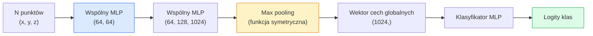

Created At: 2026-06-08T18:20:06Z
Completed At: 2026-06-08T18:20:06Z
File Path: `file:///C:/poligon/LLM_Traning/phases/04-computer-vision/13-3d-vision-nerf/docs/pl_pro.md`

# Wizja 3D – chmury punktów i NeRF

> Przetwarzanie danych 3D opiera się na dwóch głównych reprezentacjach. Chmury punktów to surowe dane z czujników (reprezentacja jawna). Modele NeRF to uczone ciągłe pola wolumetryczne (reprezentacja ukryta). Obie odpowiadają na pytanie: „co i gdzie znajduje się w przestrzeni”.

**Typ:** Ucz się + Buduj  
**Języki:** Python  
**Wymagania wstępne:** Faza 4, lekcja 03 (CNN); faza 1, lekcja 12 (operacje tensorowe)  
**Czas:** ~45 minut  

## Cele nauczania

- Rozróżniać jawne (chmury punktów, siatki trójkątów, woksele) oraz ukryte/niejawne (pola odległości ze znakiem – SDF, NeRF) reprezentacje przestrzeni 3D i określać ich zastosowania.
- Zrozumieć matematyczne podstawy sieci PointNet (zastosowanie funkcji symetrycznej), co zapewnia niezmienniczość względem permutacji dla nieuporządkowanych chmur punktów.
- Przehedzić proces wnioskowania (forward pass) w modelach NeRF: generowanie promieni (ray casting), próbkowanie, kodowanie pozycyjne, prognozowanie gęstości i koloru za pomocą sieci MLP oraz renderowanie wolumetryczne.
- Wykorzystać narzędzia `nerfstudio` lub `instant-ngp` do rekonstrukcji 3D na podstawie niewielkiego zbioru zdjęć o znanych pozycjach kamery (posed images).

## Problem

Klasyczny aparat fotograficzny rejestruje płaskie obrazy 2D. Czujnik LiDAR generuje nieuporządkowany zbiór punktów w przestrzeni 3D. Algorytmy rekonstrukcji trójwymiarowej (Structure from Motion – SfM) tworzą rzadkie chmury punktów kluczowych. Z kolei modele NeRF rekonstruują ciągłą, trójwymiarową scenę na podstawie zestawu zdjęć o znanych pozycjach aparatów. Wszystko to stanowi domenę komputerowego przetwarzania obrazu (Computer Vision), jednak żadne z tych danych wejściowych nie przypomina gęstego, uporządkowanego tensora przetwarzanego przez klasyczne sieci CNN.

Przetwarzanie danych 3D ma kluczowe znaczenie, ponieważ niemal wszystkie zaawansowane zadania w robotyce i systemach autonomicznych zachodzą w przestrzeni trójwymiarowej: manipulacja obiektami (chwytanie), unikanie przeszkód, nawigacja, okluzja w rzeczywistości rozszerzonej (AR) czy skanowanie obiektów. Specjalista od wizji komputerowej ograniczający się wyłącznie do obrazów 2D traci kontakt z najszybciej rosnącymi gałęziami technologii, takimi jak systemy AR/VR, robotyka przemysłowa, pojazdy autonomiczne czy cyfrowe bliźniaki budynków.

Zarówno reprezentacje jawne, jak i niejawne mają swoje unikalne zastosowania. Chmury punktów to bezpośredni, surowy odczyt fizyczny z sensorów. Modele NeRF oraz ich nowocześniejsze wersje (takie jak 3D Gaussian Splatting czy neuronowe pola SDF) powstają wówczas, gdy powierzamy sieci neuronowej zadanie optymalizacji i „zrozumienia” geometrii całej sceny.

## Koncepcja

### Chmury punktów

Chmura punktów (point cloud) to nieuporządkowany zbiór $N$ punktów w przestrzeni $\mathbb{R}^3$, gdzie każdy punkt może być dodatkowo opisany cechami (np. kolor RGB, intensywność odbicia światła, wektor normalny do powierzchni).

```
cloud = [
  (x1, y1, z1, r1, g1, b1),
  (x2, y2, z2, r2, g2, b2),
  ...
  (xN, yN, zN, rN, gN, bN),
]
```

W chmurze punktów nie ma zdefiniowanej siatki połączeń (topologii). Dwie cechy sprawiają, że dane te są trudne do przetworzenia przez klasyczne sieci neuronowe:

- **Niezmienniczość względem permutacji (Permutation Invariance)** – wynik działania modelu musi być identyczny niezależnie od kolejności, w jakiej punkty są zapisane w pliku/tensorze.
- **Zmienna liczba punktów $N$** – model musi obsługiwać chmury o dowolnej wielkości bez konieczności rekonfiguracji architektury.

Model PointNet (Qi i in., 2017) rozwiązał oba te problemy za pomocą eleganckiego pomysłu: zastosowania wspólnej sieci MLP (Shared MLP) niezależnie dla każdego punktu, a następnie zagregowania uzyskanych wektorów cech za pomocą funkcji symetrycznej (np. max pooling). W rezultacie otrzymujemy wektor o stałej długości reprezentujący całą chmurę, który jest w pełni niezależny od kolejności punktów:

$$f(P) = \max_{p \in P} \{ \text{MLP}(p) \}$$

To najważniejsza innowacja PointNet. Bardziej zaawansowane architektury (takie jak PointNet++ czy Point Transformers) dodają próbkowanie hierarchiczne i lokalną agregację cech w sąsiedztwach punktów, jednak bazowy koncept funkcji symetrycznej pozostaje fundamentem przetwarzania chmur punktów.

### Architektura PointNet



Określenie „Shared MLP” oznacza, że dokładnie te same wagi sieci są aplikowane do każdego punktu z osobna. W kodzie implementuje się to bardzo wydajnie jako warstwę splotu 1D (Conv1d) z filtrem o rozmiarze 1.

### Neuronowe pola promieniowania (Neural Radiance Fields – NeRF)

Twórcy modelu NeRF (Mildenhall i in., 2020) postawili pytanie: „Czy możemy zrekonstruować scenę 3D na podstawie zestawu $N$ zdjęć?”. Ich rozwiązaniem była sieć neuronowa będąca ciągłą reprezentacją tej sceny. Sieć ta mapuje współrzędne przestrzenne oraz kierunek obserwacji $(x, y, z, \theta, \phi)$ na lokalną gęstość i kolor $(gęstość\ \sigma, RGB)$. Generowanie nowego obrazu (rendering) odbywa się poprzez rzutowanie promieni (ray casting) i odpytywanie sieci wzdłuż nich.

```
NeRF MLP:  (x, y, z, theta, phi) -> (sigma, r, g, b)

Aby wyrenderować piksel (u, v) nowego widoku:
  1. Wyślij promień z kamery przechodzący przez piksel (u, v)
  2. Pobierz punkty próbkowania wzdłuż promienia w odległościach t_1, t_2, ..., t_N
  3. Odpytaj sieć MLP dla każdego punktu próbkowania
  4. Agreguj kolory ważone współczynnikiem (1 - exp(-sigma * dt))
  5. Suma stanowi ostateczny kolor wyrenderowanego piksela
```

Funkcja straty porównuje kolor wyrenderowanego piksela z jego rzeczywistym odpowiednikiem ze zdjęć treningowych. Propagacja wsteczna (backpropagation) przechodzi przez cały proces renderowania, aktualizując wagi sieci MLP. Nie potrzebujemy żadnych trójwymiarowych danych referencyjnych (ground truth 3D) ani jawnej siatki – cała geometria i tekstury sceny zostają zakodowane bezpośrednio w wagach sieci.

### Kodowanie pozycyjne (Positional Encoding)

Standardowe sieci MLP operujące bezpośrednio na surowych współrzędnych $(x, y, z)$ wykazują tendencję do uczenia się wyłącznie funkcji o niskich częstotliwościach (tzw. spectral bias), co sprawia, że generowane obrazy są rozmyte. Aby temu zapobiec, przed podaniem współrzędnych do sieci koduje się je za pomocą funkcji harmonicznych Fouriera:

$$\gamma(p) = \left( \sin(2^0 \pi p), \cos(2^0 \pi p), \sin(2^1 \pi p), \cos(2^1 \pi p), \dots, \sin(2^{L-1} \pi p), \cos(2^{L-1} \pi p) \right)$$

gdzie stopień kodowania $L$ wynosi zazwyczaj 10 dla pozycji i 4 dla kierunków. To ten sam mechanizm, który stosuje się do kodowania pozycji w Transformerach oraz do wprowadzania informacji o czasie w modelach dyfuzyjnych. Bez kodowania pozycyjnego modele NeRF tracą ostre krawędzie i drobne detale tekstur.

### Renderowanie wolumetryczne (Volume Rendering)

$$C(\mathbf{r}) = \sum_{i=1}^N T_i (1 - \exp(-\sigma_i \delta_i)) \mathbf{c}_i$$

$$T_i = \exp\left(-\sum_{j=1}^{i-1} \sigma_j \delta_j\right)$$

gdzie $\delta_i = t_{i+1} - t_i$ to odległość między sąsiednimi punktami próbkowania. $T_i$ oznacza współczynnik transmisji (transmittance) – określa, jaka część światła dociera do punktu $i$ bez wcześniejszego pochłonięcia lub rozproszenia. Składnik $(1 - \exp(-\sigma_i \delta_i))$ to przezroczystość (opacity) w punkcie $i$, natomiast $\mathbf{c}_i$ to kolor. Ostateczny kolor piksela jest sumą ważoną cech zebranych wzdłuż całego promienia.

### Ewolucja i następcy modeli NeRF

Oryginalne modele NeRF trenują się bardzo powoli (wiele godzin) i renderują obrazy z niską prędkością (kilka sekund na klatkę). Ich ewolucja doprowadziła do powstania następujących rozwiązań:

- **Instant-NGP** (2022) – wprowadzenie wielorozdzielczej siatki haszującej (multi-resolution hash grid) do kodowania współrzędnych przestrzennych, co skróciło czas uczenia do zaledwie kilku sekund.
- **Mip-NeRF 360** – wprowadzenie próbkowania stożkowego (anti-aliasing) oraz optymalizacji scen otwartych (nieograniczonych).
- **3D Gaussian Splatting** (2023) – rezygnacja z niejawnego reprezentowania sceny przez sieć neuronową na rzecz milionów jawnych elipsoid (Gaussów 3D). Umożliwia uczenie w kilka minut i renderowanie w czasie rzeczywistym (ponad 100 fps). Jest to obecnie standard w zastosowaniach komercyjnych.

Praktycznie wszystkie komercyjne silniki rekonstrukcji 3D bazują obecnie na technologii 3D Gaussian Splatting, choć w języku potocznym wciąż często określa się je mianem „NeRF”.

### Najważniejsze zbiory danych

- **ShapeNet** – zbiór syntetycznych modeli CAD 3D do zadań klasyfikacji i segmentacji chmur punktów.
- **ScanNet** – trójwymiarowe skany rzeczywistych wnętrz budynków, wykorzystywane do semantycznej segmentacji scen.
- **KITTI** – zbiór danych LiDAR z pojazdów autonomicznych rejestrujący chmury punktów w ruchu ulicznym.
- **NeRF Synthetic / BlendedMVS** – zestawy obrazów o znanych pozycjach kamer, służące do oceny jakości syntezy nowych widoków.
- **Mip-NeRF 360** – zbiór trudnych, nieograniczonych scen rzeczywistych (zarówno wnętrz, jak i plenerów).

## Zbuduj to

### Krok 1: Klasyfikator PointNet

```python
import torch
import torch.nn as nn

class PointNet(nn.Module):
    def __init__(self, num_classes=10):
        super().__init__()
        self.mlp1 = nn.Sequential(
            nn.Conv1d(3, 64, 1),    nn.BatchNorm1d(64),   nn.ReLU(inplace=True),
            nn.Conv1d(64, 64, 1),   nn.BatchNorm1d(64),   nn.ReLU(inplace=True),
        )
        self.mlp2 = nn.Sequential(
            nn.Conv1d(64, 128, 1),  nn.BatchNorm1d(128),  nn.ReLU(inplace=True),
            nn.Conv1d(128, 1024, 1), nn.BatchNorm1d(1024), nn.ReLU(inplace=True),
        )
        self.head = nn.Sequential(
            nn.Linear(1024, 512),   nn.BatchNorm1d(512),  nn.ReLU(inplace=True),
            nn.Dropout(0.3),
            nn.Linear(512, 256),    nn.BatchNorm1d(256),  nn.ReLU(inplace=True),
            nn.Dropout(0.3),
            nn.Linear(256, num_classes),
        )

    def forward(self, x):
        # x: (N, 3, num_points) — transpozycja dla Conv1d
        x = self.mlp1(x)
        x = self.mlp2(x)
        x = torch.max(x, dim=-1)[0]       # (N, 1024)
        return self.head(x)

pts = torch.randn(4, 3, 1024)
net = PointNet(num_classes=10)
print(f"Wyjście kształt: {net(pts).shape}")
print(f"Liczba parametrów: {sum(p.numel() for p in net.parameters()):,}")
```

Model zawiera ok. 1.6 miliona parametrów i przetwarza chmury składające się z 1024 punktów.

### Krok 2: Kodowanie pozycyjne (Fourier Features)

```python
def positional_encoding(x, L=10):
    """
    x: (..., D) -> (..., D * 2 * L)
    """
    freqs = 2.0 ** torch.arange(L, dtype=x.dtype, device=x.device)
    args = x.unsqueeze(-1) * freqs * 3.141592653589793
    sinc = torch.cat([args.sin(), args.cos()], dim=-1)
    return sinc.reshape(*x.shape[:-1], -1)

x = torch.randn(5, 3)
y = positional_encoding(x, L=10)
print(f"Wejście:  {x.shape}")
print(f"Kodowanie: {y.shape}     # (5, 60)")
```

Przemnożenie współrzędnych przez kolejne potęgi dwójki rzutuje dane w przestrzenie o wysokich częstotliwościach.

### Krok 3: Lekka sieć NeRF MLP

```python
class TinyNeRF(nn.Module):
    def __init__(self, L_pos=10, L_dir=4, hidden=128):
        super().__init__()
        self.L_pos = L_pos
        self.L_dir = L_dir
        pos_dim = 3 * 2 * L_pos
        dir_dim = 3 * 2 * L_dir
        self.trunk = nn.Sequential(
            nn.Linear(pos_dim, hidden), nn.ReLU(inplace=True),
            nn.Linear(hidden, hidden),  nn.ReLU(inplace=True),
            nn.Linear(hidden, hidden),  nn.ReLU(inplace=True),
            nn.Linear(hidden, hidden),  nn.ReLU(inplace=True),
        )
        self.sigma = nn.Linear(hidden, 1)
        self.color = nn.Sequential(
            nn.Linear(hidden + dir_dim, hidden // 2), nn.ReLU(inplace=True),
            nn.Linear(hidden // 2, 3), nn.Sigmoid(),
        )

    def forward(self, x, d):
        x_enc = positional_encoding(x, self.L_pos)
        d_enc = positional_encoding(d, self.L_dir)
        h = self.trunk(x_enc)
        sigma = torch.relu(self.sigma(h)).squeeze(-1)
        rgb = self.color(torch.cat([h, d_enc], dim=-1))
        return sigma, rgb

nerf = TinyNeRF()
x = torch.randn(128, 3)
d = torch.randn(128, 3)
s, c = nerf(x, d)
print(f"sigma: {s.shape}   rgb: {c.shape}")
```

Uproszczona wersja w porównaniu do klasycznej architektury NeRF (która wykorzystuje głęboki, 8-warstwowy blok MLP z połączeniami omijającymi). Model ten jest jednak w zupełności wystarczający do celów demonstracyjnych.

### Krok 4: Renderowanie wolumetryczne wzdłuż promienia

```python
def volumetric_render(sigma, rgb, t_vals):
    """
    sigma: (..., N_samples)
    rgb:   (..., N_samples, 3)
    t_vals: (N_samples,) odległości wzdłuż promienia
    """
    delta = torch.cat([t_vals[1:] - t_vals[:-1], torch.full_like(t_vals[:1], 1e10)])
    alpha = 1.0 - torch.exp(-sigma * delta)
    trans = torch.cumprod(torch.cat([torch.ones_like(alpha[..., :1]), 1.0 - alpha + 1e-10], dim=-1), dim=-1)[..., :-1]
    weights = alpha * trans
    rendered = (weights.unsqueeze(-1) * rgb).sum(dim=-2)
    depth = (weights * t_vals).sum(dim=-1)
    return rendered, depth, weights

N = 64
t_vals = torch.linspace(2.0, 6.0, N)
sigma = torch.rand(N) * 0.5
rgb = torch.rand(N, 3)
rendered, depth, weights = volumetric_render(sigma, rgb, t_vals)
print(f"Wyrenderowany kolor: {rendered.tolist()}")
print(f"Głębokość:           {depth.item():.2f}")
```

Obliczenia dla jednego promienia i 64 punktów próbkowania, zwracające ostateczny kolor RGB piksela, jego głębokość (depth map) oraz rozkład wag.

## Narzędzia

Do zaawansowanych prac projektowych wykorzystuje się biblioteki:

- `nerfstudio` (Tancik i in.) – wiodący, produkcyjny ekosystem do pracy z modelami NeRF, Instant-NGP oraz 3D Gaussian Splatting, oferujący interfejs konsolowy oraz wygodną przeglądarkę webową.
- `pytorch3d` (tworzona przez Meta) – biblioteka dedykowana do renderowania różniczkowego (differentiable rendering), operacji na chmurach punktów oraz geometrii siatek trójkątów.
- `open3d` – klasyczna biblioteka do szybkiej wizualizacji chmur punktów, rejestracji (dopasowywania) geometrii oraz klasycznego przetwarzania danych 3D.

W zastosowaniach komercyjnych i produkcyjnych technologia 3D Gaussian Splatting niemal całkowicie wyparła klasyczne NeRF-y ze względu na ponad 100-krotnie szybsze renderowanie przy zachowaniu identycznej lub wyższej jakości wizualnej.

## Wyślij to

Niniejsza lekcja dostarcza:

- `outputs/prompt-3d-task-router.md` – prompt automatycznie dopasowujący odpowiednią reprezentację 3D (chmura punktów, siatka wokseli, NeRF, Gaussian Splatting) na podstawie specyfiki zadania oraz rodzaju wejściowych danych.
- `outputs/skill-point-cloud-loader.md` – skrypt generujący klasę PyTorch `Dataset` do wczytywania i normalizacji plików chmur punktów (.ply, .pcd, .xyz) wraz z centrowaniem i losowym próbkowaniem punktów.

## Ćwiczenia

1. **(Łatwe)** Wykaż empirycznie niezmienniczość sieci PointNet względem permutacji: prześlij tę samą chmurę punktów przez model dwukrotnie, za drugim razem losowo zmieniając kolejność punktów. Upewnij się, że logity wyjściowe są identyczne (z dokładnością do błędów zaokrągleń zmiennoprzecinkowych).
2. **(Średnie)** Napisz funkcję generującą promienie (ray generation): na podstawie parametrów wewnętrznych (intrinsic matrix) oraz pozycji kamery (pose matrix) wyznacz punkt początkowy (origin) oraz wektor kierunku (direction) każdego promienia odpowiadającego pikselom na obrazie o rozmiarze $H \times W$.
3. **(Trudne)** Wytrenuj model `TinyNeRF` na syntetycznym zbiorze danych przedstawiających kolorowy sześcian z różnych kątów (widoki można wygenerować prostym skryptem do śledzenia promieni – ray tracerem). Zapisz wartości funkcji straty (MSE) dla epok 1, 10 i 100. Po ilu epokach model zaczyna generować rozpoznawalne i ostre widoki sześcianu?

## Kluczowe terminy

| Termin | Obiegowe określenie | Co to oznacza w rzeczywistości |
|------|----------------|----------------------|
| Chmura punktów (Point Cloud) | Dane LiDAR | Nieuporządkowany zbiór punktów 3D $(x, y, z)$ z ewentualnymi dodatkowymi cechami (np. kolor, normalne) |
| PointNet | Klasyfikator chmur | Architektura stosująca wspólne wagi MLP dla każdego punktu z osobna oraz globalną agregację (max pooling), co zapewnia matematyczną niezmienniczość względem kolejności punktów |
| NeRF (Neural Radiance Fields) | Scena w sieci | Niejawna reprezentacja sceny 3D za pomocą sieci MLP mapującej pozycję i kierunek na gęstość optyczną i kolor; obraz powstaje metodą śledzenia promieni |
| Kodowanie pozycyjne | Rzutowanie Fouriera | Przekształcenie współrzędnych wejściowych za pomocą funkcji sinus i cosinus o różnych częstotliwościach w celu ułatwienia sieci uczenia się ostrych krawędzi i drobnych detali |
| Renderowanie wolumetryczne | Całkowanie wzdłuż promienia | Agregacja koloru i gęstość punktów próbkowania leżących na promieniu w celu wyznaczenia ostatecznego koloru piksela z uwzględnieniem stopnia przesłaniania |
| Instant-NGP | Kodowanie haszujące | Optymalizacja zastępująca głęboki koder współrzędnych wielorozdzielczą strukturą siatki z haszowaniem, co przyspiesza uczenie oraz wnioskowanie o kilka rzędów wielkości |
| 3D Gaussian Splatting | Elipsoidy 3D | Jawna reprezentacja sceny za pomocą milionów chmur elipsoid 3D; umożliwia uczenie w kilka minut i renderowanie w czasie rzeczywistym z bardzo wysokim fps |
| SDF (Signed Distance Function) | Pole odległości ze znakiem | Funkcja niejawna (implicit representation) zwracająca odległość do najbliższej powierzchni geometrycznej sceny, gdzie znak określa położenie wewnątrz lub na zewnątrz obiektu |

## Literatura uzupełniająca

- [PointNet: Deep Learning on Point Sets for 3D Classification and Segmentation (Qi et al., 2017)](https://arxiv.org/abs/1612.00593) – przełomowa praca wprowadzająca klasyfikację i segmentację chmur punktów o dowolnej permutacji.
- [NeRF: Representing Scenes as Neural Radiance Fields for View Synthesis (Mildenhall et al., 2020)](https://arxiv.org/abs/2003.08934) – publikacja naukowa, która zainicjowała epokę niejawnych pól neuronowych do rekonstrukcji 3D.
- [Instant Neural Graphics Primitives with a Multiresolution Hash Encoding (Müller et al., 2022)](https://arxiv.org/abs/2201.05989) – opis architektury Instant-NGP i techniki kodowania haszującego.
- [3D Gaussian Splatting for Real-Time Radiance Field Rendering (Kerbl et al., 2023)](https://arxiv.org/abs/2308.04079) – praca, która zrewolucjonizowała syntezę widoków w czasie rzeczywistym za pomocą elipsoid 3D.
