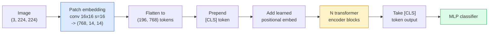

# Vision Transformers (ViT)

> Pokrój obraz na fragmenty (patche), traktuj każdy fragment jak słowo, uruchom standardowy transformer. Nie patrz za siebie.

**Typ:** Build
**Języki:** Python
**Wymagania wstępne:** Faza 7 Lekcja 02 (Self-Attention), Faza 4 Lekcja 04 (Klasyfikacja obrazów)
**Czas:** ~45 minut

## Cele nauki

- Zaimplementować od zera patch embedding, uczone embeddingi pozycyjne, token klasy (class token) oraz bloki enkodera transformera, aby zbudować minimalny ViT
- Wyjaśnić, czemu uważano, że ViT wymaga ogromnych ilości danych do pretrenowania, dopóki DeiT i MAE nie udowodniły inaczej
- Porównać ViT, Swin i ConvNeXt pod kątem ich architektonicznych założeń (brak, lokalna uwaga okienkowa, backbone konwolucyjny)
- Dostroić (fine-tune) wstępnie wytrenowany ViT na małym zbiorze danych za pomocą `timm` i standardowej receptury linear-probe / fine-tune

## Problem

Przez dekadę konwolucja była synonimem widzenia komputerowego. CNN-y miały silne biasy indukcyjne — lokalność, ekwiwariancję translacyjną — o których nikt nie sądził, że da się je zastąpić. Następnie Dosovitskiy i in. (2020) wykazali, że prosty transformer zastosowany do spłaszczonych fragmentów obrazu, bez żadnej maszynerii konwolucyjnej, może dorównać lub przewyższyć najlepsze CNN-y na dużej skali.

Haczyk tkwił w "na dużej skali". ViT na ImageNet-1k przegrywał z ResNetem. ViT pretrenowany na ImageNet-21k lub JFT-300M, a następnie dostrojony na ImageNet-1k, pokonywał go. Wniosek był taki, że transformery nie mają użytecznych biasów (priorów), ale mogą się ich nauczyć z wystarczającej ilości danych. Późniejsze prace (DeiT, MAE, DINO) pokazały, że z odpowiednimi receptami treningowymi — silną augmentacją, samonadzorowanym pretrenowaniem, dystylacją — ViT-y trenują się dobrze również na małych danych.

W 2026 roku czyste CNN-y są wciąż konkurencyjne na urządzeniach edge (ConvNeXt jest najsilniejszy), ale transformery dominują we wszystkim innym: segmentacji (Mask2Former, SegFormer), detekcji (DETR, RT-DETR), multimodalności (CLIP, SigLIP), wideo (VideoMAE, VJEPA). Strukturę bloku ViT trzeba znać.

## Koncepcja

### Pipeline



Siedem kroków. Patche -> tokeny -> uwaga (attention) -> klasyfikator. Każdy wariant (DeiT, Swin, ConvNeXt, pretrenowanie MAE) zmienia jeden lub dwa z tych siedmiu kroków, a resztę pozostawia bez zmian.

### Patch embedding

Pierwsza konwolucja to sekret. Rozmiar kernela 16, stride 16, więc obraz 224x224 staje się siatką 14x14 fragmentów 16x16, każdy zrzutowany na 768-wymiarowy embedding. Ta jedna konwolucja jednocześnie dzieli obraz na patche i wykonuje liniową projekcję.

```
Input:  (3, 224, 224)
Conv (3 -> 768, k=16, s=16, no padding):
Output: (768, 14, 14)
Flatten spatial: (196, 768)
```

196 fragmentów = 196 tokenów. Wymiar cech każdego tokenu to 768 (ViT-B), 1024 (ViT-L) lub 1280 (ViT-H).

### Class token

Pojedynczy uczony wektor dodawany na początku sekwencji:

```
tokens = [CLS; patch_1; patch_2; ...; patch_196]   shape (197, 768)
```

Po N blokach transformera wyjście `[CLS]` jest globalną reprezentacją obrazu. Głowa klasyfikacyjna odczytuje tylko ten jeden wektor.

### Positional embedding

Transformery nie mają wbudowanego pojęcia pozycji przestrzennej. Dodaj uczony wektor do każdego tokenu:

```
tokens = tokens + learned_pos_embedding   (also shape (197, 768))
```

Embedding jest parametrem modelu; trening gradientowy dopasowuje go do struktury 2D obrazu. Istnieją alternatywy sinusoidalne 2D, ale rzadko są używane w praktyce.

### Blok enkodera transformera

Standard. Wielogłowicowa self-attention, MLP, połączenia residualne, pre-LayerNorm.

```
x = x + MSA(LN(x))
x = x + MLP(LN(x))

MLP is two-layer with GELU: Linear(d -> 4d) -> GELU -> Linear(4d -> d)
```

ViT-B/16 układa 12 takich bloków, każdy z 12 głowicami uwagi, w sumie 86M parametrów.

### Dlaczego pre-LN

Wczesne transformery używały post-LN (`x = LN(x + sublayer(x))`) i miały problemy z trenowaniem powyżej 6-8 warstw bez warmupu. Pre-LN (`x = x + sublayer(LN(x))`) pozwala stabilnie trenować głębsze sieci bez warmupu. Każdy ViT i każdy współczesny LLM używa pre-LN.

### Trade-off rozmiaru patcha

- Fragmenty 16x16 -> 196 tokenów, standard.
- Fragmenty 32x32 -> 49 tokenów, szybciej, ale mniejsza rozdzielczość.
- Fragmenty 8x8 -> 784 tokeny, dokładniej, ale koszt uwagi O(n^2) skaluje się źle.

Większe fragmenty = mniej tokenów = szybciej, ale mniej szczegółów przestrzennych. SwinV2 używa fragmentów 4x4 w hierarchicznych oknach.

### Receptura DeiT do trenowania ViT na ImageNet-1k

Oryginalny ViT potrzebował JFT-300M, aby pokonać CNN-y. DeiT (Touvron i in., 2020) wytrenował ViT-B do 81,8% top-1 na samym ImageNet-1k dzięki czterem zmianom:

1. Mocna augmentacja: RandAugment, Mixup, CutMix, Random Erasing.
2. Stochastic depth (losowe odrzucanie całych bloków podczas treningu).
3. Powtarzana augmentacja (ten sam obraz próbkowany 3 razy w batchu).
4. Dystylacja od nauczyciela CNN (opcjonalnie, dodatkowo podnosi dokładność).

Każda współczesna receptura treningowa ViT pochodzi od DeiT.

### Swin vs ConvNeXt

- **Swin** (Liu i in., 2021) — uwaga oparta na oknach. Każdy blok wykonuje uwagę wewnątrz lokalnego okna; przeplatające się bloki przesuwają okno, aby mieszać informacje między oknami. Przywraca bias lokalności podobny do CNN, zachowując operator uwagi.
- **ConvNeXt** (Liu i in., 2022) — przeprojektowany CNN, który dopasowuje wybory architektoniczne Swina (konwolucje depthwise, LayerNorm, GELU, odwrócony bottleneck). Wykazał, że różnica nie polega na "uwadze vs konwolucji", lecz na "modernej recepturze treningowej + architekturze".

W 2026 roku ConvNeXt-V2 i Swin-V2 są obie gotowe do produkcji; właściwy wybór zależy od stosu inferencyjnego (ConvNeXt lepiej kompiluje się na edge) i korpusu pretrenowania.

### Pretrenowanie MAE

Masked Autoencoder (He i in., 2022): maskuje losowo 75% fragmentów, trenuje enkoder do przetwarzania jedynie widocznych 25%, trenuje mały dekoder do odtworzenia zamaskowanych fragmentów na podstawie wyjścia enkodera. Po pretrenowaniu dekoder jest odrzucany, a enkoder dostrajany.

MAE umożliwia trenowanie ViT na samym ImageNet-1k, osiąga SOTA i jest obecnie domyślną receptą samonadzorowanego pretrenowania.

## Zbuduj to

### Krok 1: Patch embedding

```python
import torch
import torch.nn as nn

class PatchEmbedding(nn.Module):
    def __init__(self, in_channels=3, patch_size=16, dim=192, image_size=64):
        super().__init__()
        assert image_size % patch_size == 0
        self.proj = nn.Conv2d(in_channels, dim, kernel_size=patch_size, stride=patch_size)
        num_patches = (image_size // patch_size) ** 2
        self.num_patches = num_patches

    def forward(self, x):
        x = self.proj(x)
        return x.flatten(2).transpose(1, 2)
```

Jedna konwolucja, jedno spłaszczenie, jedna transpozycja. To cały krok zamiany obrazu na tokeny.

### Krok 2: Blok transformera

Pre-LN, wielogłowicowa self-attention, MLP z GELU, połączenia residualne.

```python
class Block(nn.Module):
    def __init__(self, dim, num_heads, mlp_ratio=4, dropout=0.0):
        super().__init__()
        self.ln1 = nn.LayerNorm(dim)
        self.attn = nn.MultiheadAttention(dim, num_heads, dropout=dropout, batch_first=True)
        self.ln2 = nn.LayerNorm(dim)
        self.mlp = nn.Sequential(
            nn.Linear(dim, dim * mlp_ratio),
            nn.GELU(),
            nn.Dropout(dropout),
            nn.Linear(dim * mlp_ratio, dim),
            nn.Dropout(dropout),
        )

    def forward(self, x):
        a, _ = self.attn(self.ln1(x), self.ln1(x), self.ln1(x), need_weights=False)
        x = x + a
        x = x + self.mlp(self.ln2(x))
        return x
```

`nn.MultiheadAttention` obsługuje podział na głowice, skalowany dot-product oraz projekcję wyjściową. `batch_first=True`, więc kształty są `(N, seq, dim)`.

### Krok 3: ViT

```python
class ViT(nn.Module):
    def __init__(self, image_size=64, patch_size=16, in_channels=3,
                 num_classes=10, dim=192, depth=6, num_heads=3, mlp_ratio=4):
        super().__init__()
        self.patch = PatchEmbedding(in_channels, patch_size, dim, image_size)
        num_patches = self.patch.num_patches
        self.cls_token = nn.Parameter(torch.zeros(1, 1, dim))
        self.pos_embed = nn.Parameter(torch.zeros(1, num_patches + 1, dim))
        self.blocks = nn.ModuleList([
            Block(dim, num_heads, mlp_ratio) for _ in range(depth)
        ])
        self.ln = nn.LayerNorm(dim)
        self.head = nn.Linear(dim, num_classes)
        nn.init.trunc_normal_(self.pos_embed, std=0.02)
        nn.init.trunc_normal_(self.cls_token, std=0.02)

    def forward(self, x):
        x = self.patch(x)
        cls = self.cls_token.expand(x.size(0), -1, -1)
        x = torch.cat([cls, x], dim=1)
        x = x + self.pos_embed
        for blk in self.blocks:
            x = blk(x)
        x = self.ln(x[:, 0])
        return self.head(x)

vit = ViT(image_size=64, patch_size=16, num_classes=10, dim=192, depth=6, num_heads=3)
x = torch.randn(2, 3, 64, 64)
print(f"output: {vit(x).shape}")
print(f"params: {sum(p.numel() for p in vit.parameters()):,}")
```

Około 2,8M parametrów — mały ViT, który da się przetworzyć na CPU. Prawdziwy ViT-B ma 86M; ta sama definicja klasy z `dim=768, depth=12, num_heads=12`.

### Krok 4: Sanity check — inferencja na pojedynczym obrazie

```python
logits = vit(torch.randn(1, 3, 64, 64))
print(f"logits: {logits}")
print(f"probs:  {logits.softmax(-1)}")
```

Powinno zadziałać bez błędu. Prawdopodobieństwa sumują się do 1.

## Użyj tego

`timm` zawiera każdy wariant ViT z wagami pretrenowanymi na ImageNet. Jedna linia:

```python
import timm

model = timm.create_model("vit_base_patch16_224", pretrained=True, num_classes=10)
```

`timm` jest produkcyjnym standardem dla vision transformerów w 2026 roku. Wspiera ViT, DeiT, Swin, Swin-V2, ConvNeXt, ConvNeXt-V2, MaxViT, MViT, EfficientFormer i dziesiątki innych pod tym samym API.

Do prac multimodalnych (obraz + tekst) `transformers` zawiera CLIP, SigLIP, BLIP-2, LLaVA. Enkoder obrazu we wszystkich tych modelach jest wariantem ViT.

## Wypchnij to

Ta lekcja produkuje:

- `outputs/prompt-vit-vs-cnn-picker.md` — prompt, który wybiera między ViT, ConvNeXt lub Swin na podstawie rozmiaru zbioru danych, dostępnych zasobów obliczeniowych i stosu inferencyjnego.
- `outputs/skill-vit-patch-and-pos-embed-inspector.md` — skill, który weryfikuje, czy kształty patch embeddingu i positional embeddingu ViT-a odpowiadają oczekiwanej długości sekwencji modelu, wychwytując najczęstsze błędy przy portowaniu.

## Ćwiczenia

1. **(Łatwe)** Wypisz kształty wszystkich pośrednich tensorów dla przejścia w przód przez mały ViT powyżej. Potwierdź: wejście `(N, 3, 64, 64)` -> fragmenty `(N, 16, 192)` -> z CLS `(N, 17, 192)` -> wejście klasyfikatora `(N, 192)` -> wyjście `(N, num_classes)`.
2. **(Średnie)** Dostrój wstępnie wytrenowany `timm` ViT-S/16 na zbiorze syntetycznym-CIFAR z Lekcji 4. Porównaj z dostrajaniem ResNet-18 na tych samych danych. Podaj czas treningu i końcową dokładność.
3. **(Trudne)** Zaimplementuj pretrenowanie MAE dla małego ViT: zamaskuj 75% fragmentów, wytrenuj enkoder + mały dekoder do odtworzenia zamaskowanych fragmentów. Oceń dokładność linear-probe na danych syntetycznych przed i po pretrenowaniu.

## Kluczowe terminy

| Termin | Co się mówi | Co to faktycznie znaczy |
|------|----------------|----------------------|
| Patch embedding | "Pierwsza konwolucja" | Konwolucja, w której rozmiar kernela = stride = rozmiar patcha; przekształca obraz w siatkę embeddingów tokenów |
| Class token | "[CLS]" | Uczony wektor dodawany na początku sekwencji tokenów; jego końcowe wyjście jest globalną reprezentacją obrazu |
| Positional embedding | "Uczona pozycja" | Uczony wektor dodawany do każdego tokenu, dzięki czemu transformer wie, skąd pochodzi każdy fragment |
| Pre-LN | "LayerNorm przed sublayerem" | Stabilny wariant transformera: `x + sublayer(LN(x))` zamiast `LN(x + sublayer(x))` |
| Multi-head attention | "Równoległa uwaga" | Standardowa uwaga transformera podzielona na num_heads niezależnych podprzestrzeni, później złączonych |
| ViT-B/16 | "Base, patch 16" | Kanoniczny rozmiar: dim=768, depth=12, heads=12, patch_size=16, image=224; ~86M parametrów |
| DeiT | "Data-efficient ViT" | ViT trenowany na samym ImageNet-1k z silną augmentacją; udowodnił, że duże zbiory pretrenowania nie są bezwzględnie wymagane |
| MAE | "Masked autoencoder" | Samonadzorowane pretrenowanie: zamaskuj 75% fragmentów, odtwórz; dominująca receptura pretrenowania ViT |

## Dalsza lektura

- [An Image is Worth 16x16 Words (Dosovitskiy et al., 2020)](https://arxiv.org/abs/2010.11929) — artykuł o ViT
- [DeiT: Data-efficient Image Transformers (Touvron et al., 2020)](https://arxiv.org/abs/2012.12877) — jak trenować ViT na samym ImageNet-1k
- [Masked Autoencoders are Scalable Vision Learners (He et al., 2022)](https://arxiv.org/abs/2111.06377) — pretrenowanie MAE
- [timm documentation](https://huggingface.co/docs/timm) — punkt odniesienia dla każdego vision transformera, który wykorzystasz w produkcji
