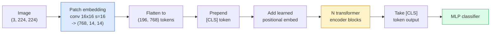

# Transformatory wizyjne (ViT)

> Potnij obraz na fragmenty, traktuj każdy fragment jako słowo, uruchom standardowy transformator. Nie oglądaj się za siebie.

**Typ:** Kompilacja
**Języki:** Python
**Wymagania wstępne:** Faza 7, lekcja 02 (Samouwaga), faza 4, lekcja 04 (klasyfikacja obrazu)
**Czas:** ~45 minut

## Cele nauczania

- Zaimplementuj od podstaw osadzanie poprawek, wyuczone osadzanie pozycyjne, token klasy i bloki kodera transformatora od podstaw, aby zbudować minimalny ViT
- Wyjaśnij, dlaczego uważano, że ViT potrzebuje ogromnych danych przed treningiem, dopóki DeiT i MAE nie udowodniły inaczej
- Porównaj ViT, Swin i ConvNeXt pod kątem ich wcześniejszych rozwiązań architektonicznych (brak, uwaga lokalnego okna, szkielet konw.)
- Dostosuj wstępnie wytrenowany ViT na małym zestawie danych, używając `timm` i standardowej sondy liniowej/receptury dostrajania

## Problem

Przez dekadę splot był synonimem widzenia komputerowego. CNN miały silne uprzedzenia indukcyjne – lokalność, równoważność tłumaczenia – których nikt nie sądził, że można je zastąpić. Następnie Dosovitskiy i in. (2020) wykazali, że zwykły transformator zastosowany do spłaszczonych fragmentów obrazu, bez żadnej maszynerii splotowej, może dorównać lub pokonać najlepsze CNN na dużą skalę.

Połów był „na dużą skalę”. ViT na ImageNet-1k przegrał z ResNet. ViT przeszkolony w oparciu o ImageNet-21k lub JFT-300M, a następnie dostrojony w ImageNet-1k, pokonał go. Wniosek był taki, że transformatorom brakowało przydatnych priorytetów, ale mogli się ich nauczyć na podstawie wystarczających danych. Późniejsze prace (DeiT, MAE, DINO) wykazały, że przy odpowiednich przepisach treningowych – silnym wzmacnianiu, samonadzorowanym treningu wstępnym, destylacji – ViT również dobrze trenują na małych danych.

Do 2026 r. sieci CNN będą nadal konkurencyjne na urządzeniach brzegowych (ConvNeXt jest najsilniejszy), ale we wszystkim innym dominują transformatory: segmentacja (Mask2Former, SegFormer), detekcja (DETR, RT-DETR), multimodalność (CLIP, SigLIP), wideo (VideoMAE, VJEPA). Należy znać strukturę bloków ViT.

## Koncepcja

### Rurociąg



Siedem kroków. Łatki -> tokeny -> uwaga -> klasyfikator. Każdy wariant (DeiT, Swin, ConvNeXt, MAE przed treningiem) zmienia jeden lub dwa z siedmiu, a resztę pozostawia w spokoju.

### Osadzanie poprawek

Sekretem jest pierwsza konwersacja. Rozmiar jądra 16, krok 16, więc obraz 224x224 staje się siatką 14x14 złożoną z 16x16 fragmentów, z których każdy jest wyświetlany z osadzeniem o rozdzielczości 768 przyciemnień. Ta pojedyncza konwersja zarówno łata, jak i projektuje liniowo.

```
Input:  (3, 224, 224)
Conv (3 -> 768, k=16, s=16, no padding):
Output: (768, 14, 14)
Flatten spatial: (196, 768)
```

196 naszywek = 196 żetonów. Wymiar funkcji każdego tokena wynosi 768 (ViT-B), 1024 (ViT-L) lub 1280 (ViT-H).

### Żeton klasy

Pojedynczy wyuczony wektor dołączony do sekwencji:

```
tokens = [CLS; patch_1; patch_2; ...; patch_196]   shape (197, 768)
```

Po N blokach transformatorów wyjście `[CLS]` jest globalną reprezentacją obrazu. Głowa klasyfikacyjna odczytuje tylko ten jeden wektor.

### Osadzanie pozycyjne

Transformatory nie mają wbudowanego pojęcia położenia przestrzennego. Dodaj wyuczony wektor do każdego tokena:

```
tokens = tokens + learned_pos_embedding   (also shape (197, 768))
```

Osadzanie jest parametrem modelu; szkolenie oparte na gradientach dostosowuje je do struktury obrazu 2D. Istnieją sinusoidalne alternatywy 2D, ale są rzadko stosowane w praktyce.

### Blok enkodera transformatora

Standardowe. Samouważność wielu głowic, MLP, połączenia resztkowe, pre-LayerNorm.

```
x = x + MSA(LN(x))
x = x + MLP(LN(x))

MLP is two-layer with GELU: Linear(d -> 4d) -> GELU -> Linear(4d -> d)
```

ViT-B/16 składa się z 12 takich bloków, każdy z 12 głowami uwagi, co daje łącznie 86M parametrów.

### Dlaczego przed LN

Wczesne transformatory korzystały z post-LN (`x = LN(x + sublayer(x))`) i miały trudności z trenowaniem przez 6-8 warstw bez rozgrzewki. Pre-LN (`x = x + sublayer(LN(x))`) stabilnie uczy głębsze sieci bez rozgrzewania. Każdy ViT i każdy nowoczesny LLM używa pre-LN.

### Kompromis dotyczący rozmiaru łaty

- 16x16 naszywek -> 196 żetonów, standard.
- łatki 32x32 -> 49 tokenów, szybsza, ale niższa rozdzielczość.
- Łaty 8x8 -> 784 tokeny, lepsze, ale koszt uwagi O(n^2) źle się skaluje.

Większe łaty = mniej tokenów = szybsze, ale mniej szczegółów przestrzennych. SwinV2 wykorzystuje łatki 4x4 w oknach hierarchicznych.

### Przepis DeiT na szkolenie ViT na ImageNet-1k

Oryginalny ViT potrzebował JFT-300M, aby pokonać CNN. DeiT (Touvron i in., 2020) wyszkolił ViT-B do 81,8% pierwszej pozycji w samym ImageNet-1k z czterema zmianami:

1. Ciężkie wzmocnienie: RandAugment, Mixup, CutMix, Random Erasing.
2. Głębokość stochastyczna (upuszczaj losowo całe bloki podczas treningu).
3. Powtarzana augmentacja (ten sam obraz pobrany 3 razy w partii).
4. Destylacja od nauczyciela CNN (opcjonalnie, jeszcze bardziej podnosi dokładność).

Każdy nowoczesny przepis na trening ViT wywodzi się z DeiT.

### Swin kontra ConvNeXt

- **Swin** (Liu i in., 2021) — uwaga oparta na oknie. Każdy blok uczestniczy w lokalnym oknie; naprzemienne bloki przesuwają okno, aby wymieszać informacje w oknach. Przywraca lokalizację przypominającą CNN, jednocześnie utrzymując uwagę operatora.
- **ConvNeXt** (Liu i in., 2022) — przeprojektowany CNN, który odpowiada wyborom architektury Swin (konwersje wgłębne, LayerNorm, GELU, odwrócone wąskie gardło). Pokazał, że różnicą nie jest „uwaga kontra splot”, ale „nowoczesny przepis na trening + architektura”.

W roku 2026 ConvNeXt-V2 i Swin-V2 będą dostępne w wersji produkcyjnej; właściwy wybór zależy od stosu wnioskowań (ConvNeXt lepiej kompiluje się na krawędzi) i korpusu przedtreningowego.

### Trening wstępny MAE

Masked Autoencoder (He et al., 2022): losowe maskowanie 75% fragmentów, wytrenowanie kodera tak, aby przetwarzał tylko widoczne 25%, wytrenowanie małego dekodera w celu zrekonstruowania zamaskowanych fragmentów z sygnału wyjściowego kodera. Po wstępnym szkoleniu wyrzuć dekoder i dostrój koder.

MAE umożliwia szkolenie ViT wyłącznie w ImageNet-1k, trafia do SOTA i jest bieżącym domyślnym przepisem samonadzorowanym.

## Zbuduj to

### Krok 1: Osadzanie poprawki

```python
import torch
import torch.nn as nn

class PatchEmbedding(nn.Module):
    def __init__(self, in_channels=3, patch_size=16, dim=192, image_size=64):
        super().__init__()
        assert image_size % patch_size == 0
        self.proj = nn.Conv2d(in_channels, dim, kernel_size=patch_size, stride=patch_size)
        num_patches = (image_size // patch_size) ** 2
        self.num_patches = num_patches

    def forward(self, x):
        x = self.proj(x)
        return x.flatten(2).transpose(1, 2)
```

Jedna konwersja, jedna spłaszczenie, jedna transpozycja. To jest cały etap przekształcania obrazu w tokeny.

### Krok 2: Blok transformatora

Pre-LN, wielogłowicowa samouwaga, MLP z GELU, połączenia resztkowe.

```python
class Block(nn.Module):
    def __init__(self, dim, num_heads, mlp_ratio=4, dropout=0.0):
        super().__init__()
        self.ln1 = nn.LayerNorm(dim)
        self.attn = nn.MultiheadAttention(dim, num_heads, dropout=dropout, batch_first=True)
        self.ln2 = nn.LayerNorm(dim)
        self.mlp = nn.Sequential(
            nn.Linear(dim, dim * mlp_ratio),
            nn.GELU(),
            nn.Dropout(dropout),
            nn.Linear(dim * mlp_ratio, dim),
            nn.Dropout(dropout),
        )

    def forward(self, x):
        a, _ = self.attn(self.ln1(x), self.ln1(x), self.ln1(x), need_weights=False)
        x = x + a
        x = x + self.mlp(self.ln2(x))
        return x
```

`nn.MultiheadAttention` obsługuje dzielenie na głowy, skalowany iloczyn skalarny i rzutowanie wyjściowe. `batch_first=True`, więc kształty to `(N, seq, dim)`.

### Krok 3: ViT

```python
class ViT(nn.Module):
    def __init__(self, image_size=64, patch_size=16, in_channels=3,
                 num_classes=10, dim=192, depth=6, num_heads=3, mlp_ratio=4):
        super().__init__()
        self.patch = PatchEmbedding(in_channels, patch_size, dim, image_size)
        num_patches = self.patch.num_patches
        self.cls_token = nn.Parameter(torch.zeros(1, 1, dim))
        self.pos_embed = nn.Parameter(torch.zeros(1, num_patches + 1, dim))
        self.blocks = nn.ModuleList([
            Block(dim, num_heads, mlp_ratio) for _ in range(depth)
        ])
        self.ln = nn.LayerNorm(dim)
        self.head = nn.Linear(dim, num_classes)
        nn.init.trunc_normal_(self.pos_embed, std=0.02)
        nn.init.trunc_normal_(self.cls_token, std=0.02)

    def forward(self, x):
        x = self.patch(x)
        cls = self.cls_token.expand(x.size(0), -1, -1)
        x = torch.cat([cls, x], dim=1)
        x = x + self.pos_embed
        for blk in self.blocks:
            x = blk(x)
        x = self.ln(x[:, 0])
        return self.head(x)

vit = ViT(image_size=64, patch_size=16, num_classes=10, dim=192, depth=6, num_heads=3)
x = torch.randn(2, 3, 64, 64)
print(f"output: {vit(x).shape}")
print(f"params: {sum(p.numel() for p in vit.parameters()):,}")
```

Około 2,8 mln parametrów — mały ViT możliwy do obsługi na procesorze. Prawdziwe ViT-B to 86M; ta sama definicja klasy z `dim=768, depth=12, num_heads=12`.

### Krok 4: Kontrola poprawności — wnioskowanie o pojedynczym obrazie

```python
logits = vit(torch.randn(1, 3, 64, 64))
print(f"logits: {logits}")
print(f"probs:  {logits.softmax(-1)}")
```

Powinien działać bez błędów. Prawdopodobieństwa sumują się do 1.

## Użyj tego

`timm` każdy wariant ViT jest dostarczany z wstępnie wytrenowanymi wagami ImageNet. Jedna linia:

```python
import timm

model = timm.create_model("vit_base_patch16_224", pretrained=True, num_classes=10)
```

`timm` to domyślne ustawienie produkcyjne transformatorów wizyjnych w roku 2026. Obsługuje ViT, DeiT, Swin, Swin-V2, ConvNeXt, ConvNeXt-V2, MaxViT, MViT, EfficientFormer i dziesiątki innych w ramach tego samego API.

Do pracy multimodalnej (obraz + tekst) `transformers` dostarcza CLIP, SigLIP, BLIP-2, LLaVA. Koder obrazu we wszystkich jest wariantem ViT.

## Wyślij to

Ta lekcja daje:

- `outputs/prompt-vit-vs-cnn-picker.md` — zachęta, która wybiera pomiędzy ViT, ConvNeXt lub Swin na podstawie rozmiaru zestawu danych, obliczeń i stosu wnioskowań.
- `outputs/skill-vit-patch-and-pos-embed-inspector.md` — umiejętność sprawdzająca, czy kształty osadzania łatek i osadzania pozycyjnego ViT odpowiadają oczekiwanej długości sekwencji modelu, wychwytując najczęstsze błędy związane z przenoszeniem.

## Ćwiczenia

1. **(Łatwe)** Wydrukuj kształty każdego tensora pośredniego dla przejścia do przodu przez mały ViT powyżej. Potwierdź: wejście `(N, 3, 64, 64)` -> poprawki `(N, 16, 192)` -> z CLS `(N, 17, 192)` -> wejście klasyfikatora `(N, 192)` -> wyjście `(N, num_classes)`.
2. **(Średni)** Dostosuj wstępnie wytrenowany `timm` ViT-S/16 na zbiorze danych syntetycznych CIFAR z lekcji 4. Porównaj z dostrajaniem ResNet-18 na tych samych danych. Raportuj czas szkolenia i końcową dokładność.
3. **(Trudne)** Zaimplementuj wstępne szkolenie MAE dla małego ViT: zamaskuj 75% poprawek, wytrenuj koder + mały dekoder, aby zrekonstruować zamaskowane poprawki. Oceń dokładność sondy liniowej na danych syntetycznych przed i po treningu wstępnym.

## Kluczowe terminy

| Termin | Co ludzie mówią | Co to właściwie oznacza |
|------|----------------|----------------------|
| Osadzanie poprawek | „Pierwsza konwersacja” | Konwencja z rozmiarem jądra = krok = rozmiar poprawki; zamienia obraz w siatkę osadzonych żetonów |
| Żeton klasy | „[CLS]” | Wyuczony wektor dołączony do sekwencji tokenów; jego ostatecznym wynikiem jest globalna reprezentacja obrazu |
| Osadzenie pozycyjne | „Nauczony poz” | Wyuczony wektor dodany do każdego żetonu, dzięki czemu transformator wie, skąd pochodzi każda łata |
| Przed LN | „LayerNorm przed podwarstwą” | Stabilny wariant transformatora: `x + sublayer(LN(x))` zamiast `LN(x + sublayer(x))` |
| Uwaga wielogłowa | „Uwaga równoległa” | Uwaga transformatora standardowego podzielona na niezależne podprzestrzenie num_heads, następnie połączona |
| ViT-B/16 | „Baza, łatka 16” | Rozmiar kanoniczny: dim=768, głębokość=12, głowice=12, patch_size=16, image=224; ~86M parametrów |
| DeiT | „VIT efektywnie wykorzystujący dane” | ViT trenował sam na ImageNet-1k z silnym wzmocnieniem; udowodniono, że duże zbiory danych przedtreningowych nie są ściśle wymagane |
| MAE | „Zamaskowany autokoder” | Samodzielny trening wstępny: maskowanie 75% płatów, rekonstrukcja; dominujący przepis na przedtreningówkę ViT |

## Dalsze czytanie

– [Obraz jest wart 16 x 16 słów (Dosovitskiy et al., 2020)](https://arxiv.org/abs/2010.11929) – artykuł ViT
- [DeiT: Data-efektywne transformatory obrazu (Touvron et al., 2020)](https://arxiv.org/abs/2012.12877) — jak trenować ViT w samym ImageNet-1k
- [Zamaskowane autoenkodery są skalowalnymi uczniami zajmującymi się wizją (He et al., 2022)](https://arxiv.org/abs/2111.06377) — szkolenie wstępne MAE
- [dokumentacja Timma](https://huggingface.co/docs/timm) — dokumentacja każdego transformatora wizyjnego, którego będziesz używać w produkcji