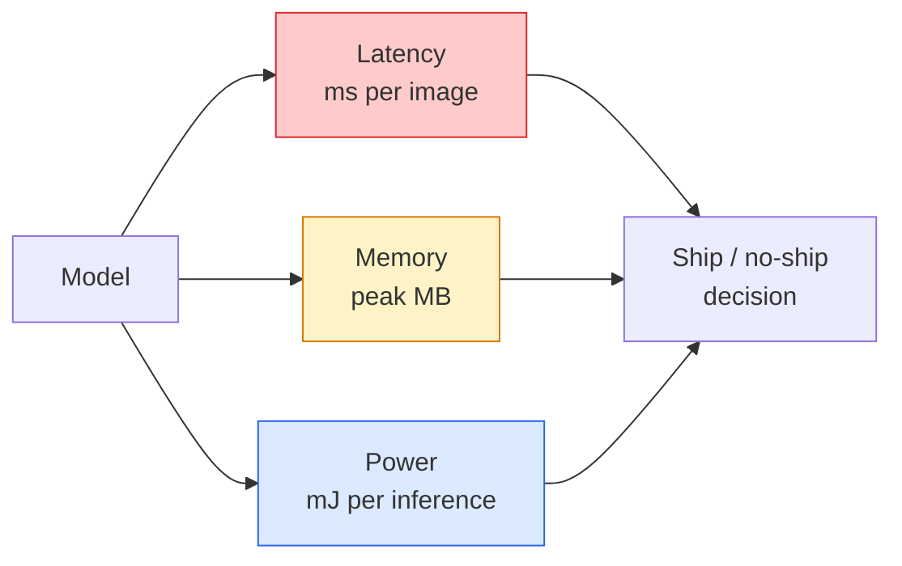

# Wizja w czasie rzeczywistym — wdrożenie brzegowe

> Wnioskowanie brzegowe to dyscyplina polegająca na uzyskaniu modelu o dokładności 90, działającego z szybkością 30 klatek na sekundę na urządzeniu z 2 GB pamięci RAM. Każdy punkt procentowy dokładności jest zamieniany na milisekundy opóźnienia.

**Typ:** Ucz się + Buduj
**Języki:** Python
**Wymagania wstępne:** Faza 4, lekcja 04 (Klasyfikacja obrazu), faza 10, lekcja 11 (kwantyzacja)
**Czas:** ~75 minut

## Cele nauczania

- Zmierz opóźnienie wnioskowania, pamięć szczytową i przepustowość dla dowolnego modelu PyTorch i przeczytaj kompromis FLOP/param/opóźnienie
- Kwantyzacja modelu widzenia do INT8 przy użyciu kwantyzacji potreningowej PyTorch i zweryfikowanie utraty dokładności < 1%
- Eksportuj do ONNX i kompiluj za pomocą ONNX Runtime lub TensorRT; wymień trzy najczęstsze błędy eksportu i ich rozwiązania
- Wyjaśnij, kiedy wybrać MobileNetV3, EfficientNet-Lite, ConvNeXt-Tiny lub MobileViT w przypadku ograniczenia krawędzi

## Problem

Model widzenia w czasie treningu to zmiennoprzecinkowy potwór. Parametry 100M, 10 GFLOPów na przebieg w przód, 2 GB pamięci VRAM. Żadne z nich nie pasuje do telefonu, samochodowego urządzenia informacyjno-rozrywkowego, kamery przemysłowej ani drona. Wysyłka systemu wizyjnego oznacza dopasowanie tych samych przewidywań do 100 razy mniejszego budżetu.

Większość pracy wykonują trzy pokrętła: wybór modelu (mniejsza architektura o tej samej recepturze), kwantyzacja (INT8 zamiast FP32) i czas działania wnioskowania (ONNX Runtime, TensorRT, Core ML, TFLite). Właściwe ich wykonanie stanowi różnicę między wersją demonstracyjną działającą na stacji roboczej a produktem dostarczanym z modułem kamery o wartości 30 USD.

W tej lekcji najpierw zostanie ustalona dyscyplina pomiaru (nie można zoptymalizować tego, czego nie można zmierzyć), a następnie omówione zostaną trzy pokrętła. Celem nie jest nauczenie się każdego środowiska wykonawczego brzegowego, ale wiedza, jakie istnieją dźwignie i sposób sprawdzenia, czy każda z nich robi to, co myślisz.

## Koncepcja

### Trzy budżety



- **Opóźnienie**: p50, p95, p99. Uśrednianie tylko p50 ukrywa ogonowe zachowanie, które ma znaczenie dla systemów czasu rzeczywistego.
- **Pamięć szczytowa**: maksymalna wartość, jaką urządzenie kiedykolwiek widzi, a nie średnia w stanie ustalonym. Ma to znaczenie, ponieważ OOM są śmiertelne w przypadku osadzonych celów.
- **Moc / energia**: milidżule na wnioskowanie w urządzeniu zasilanym bateryjnie. Często przesyłane przez serwer proxy według wykorzystania procesora/GPU *czas.

Tabela (model, opóźnienie, pamięć, dokładność) jest podstawą decyzji brzegowej. Każda komórka jest mierzona na urządzeniu docelowym, a nie na stacji roboczej.

### Dyscyplina pomiarowa

Trzy zasady, którymi powinien kierować się każdy profil krawędziowy:

1. **Rozgrzej** modela, wykonując 5-10 podań w przód z manekinem przed pomiarem. Zimne pamięci podręczne i kompilacja JIT dają niereprezentatywne pierwsze liczby.
2. **Zsynchronizuj** obciążenia GPU z `torch.cuda.synchronize()` przed i po bloku czasowym. Bez tego mierzysz wysyłanie jądra, a nie wykonanie jądra.
3. **Dostosuj rozmiary wejściowe** do rozdzielczości produkcyjnej. Opóźnienie na 224x224 nie jest opóźnieniem na 512x512.

### FLOPy jako proxy

FLOP (operacje zmiennoprzecinkowe na wnioskowanie) to tani, niezależny od urządzenia serwer proxy dla opóźnień. Przydatny do porównywania architektury, mylący jako absolutny zegar ścienny. Model z 10% większą liczbą FLOPów może być w praktyce 2x szybszy, ponieważ wykorzystuje operacje przyjazne dla sprzętu (konwersje wgłębne dobrze się kompilują, duże konwersje 7x7 nie).

Reguła: używaj FLOPów do wyszukiwania architektury, używaj opóźnień na urządzeniu przy podejmowaniu decyzji o wdrożeniu.

### Kwantyzacja w jednym akapicie

Zamień wagi i aktywacje FP32 na INT8. Rozmiar modelu spada 4x, przepustowość pamięci spada 4x, moc obliczeniowa spada 2-4x na sprzęcie z jądrem INT8 (każdy nowoczesny mobilny SoC, każdy procesor graficzny NVIDIA z rdzeniami Tensor). Utrata dokładności zadań związanych ze wzrokiem wynosi zazwyczaj 0,1–1 punktu procentowego w przypadku kwantyzacji statycznej po treningu.

Typy:

- **Dynamiczny** — kwantyfikuj wagi do INT8, aktywacje obliczane w FP. Łatwe, małe przyspieszenie.
- **Statyczny (po treningu)** — kwantyfikacja ciężarów + kalibracja zakresów aktywacji na małym zestawie kalibracyjnym. Dużo szybciej niż dynamicznie.
- **Szkolenie uwzględniające kwantyzację (QAT)** — symuluj kwantyzację podczas szkolenia, aby model uczył się na jej podstawie. Najlepsza dokładność, wymaga oznaczonych danych.

W przypadku wzroku kwantyzacja statyczna po treningu daje 95% korzyści przy 5% wysiłku. Używaj QAT tylko wtedy, gdy utrata dokładności spowodowana PTQ jest nie do przyjęcia.

### Przycinanie i destylacja

- **Przycinanie** — usuń nieistotne wagi (w oparciu o wielkość) lub kanały (ustrukturyzowane). Działa dobrze w modelach przeparametryzowanych; mniej przydatne w już kompaktowych architekturach.
- **Destylacja** — naucz małego ucznia naśladować logity dużego nauczyciela. Często odzyskuje większość dokładności utraconej w wyniku zmniejszenia modelu. Standard dla modeli krawędzi produkcyjnej.

### Czasy działania wnioskowania

- **PyTorch chętny** — powolny, nie do wdrożenia. Używaj wyłącznie do celów programistycznych.
- **TorchScript** — dziedzictwo. Zastąpiony przez `torch.compile` i eksport ONNX.
- **ONNX Runtime** — neutralny czas działania. CPU, CUDA, CoreML, TensorRT, OpenVINO mają dostawców ONNX. Zacznij tutaj.
- **TensorRT** — kompilator NVIDIA. Najlepsze opóźnienia na procesorach graficznych NVIDIA (stacja robocza i Jetson). Integruje się z ONNX Runtime lub jest samodzielny.
- **Core ML** — środowisko wykonawcze Apple dla systemu iOS/macOS. Potrzebuje `.mlmodel` lub `.mlpackage`.
- **TFlite** — środowisko wykonawcze Google dla Androida/ARM. Potrzebuje `.tflite`.
- **OpenVINO** — środowisko wykonawcze Intela dla procesora/VPU. Potrzebuje `.xml` + `.bin`.

W praktyce: eksportuj PyTorch -> ONNX -> wybierz środowisko wykonawcze dla celu. ONNX to język francuski.

### Selektor architektury brzegowej

| Budżet | Modelka | Dlaczego |
|------------|-------|-----|
| < Parametry 3M | MobileNetV3 — mały | Kompiluje się wszędzie, dobry poziom bazowy |
| 3-10M | EfficientNet-Lite-B0 | Najlepsza dokładność na parametr w TFLite |
| 10-20M | ConvNeXt-Tiny | Najlepsza dokładność na parametr, przyjazna dla procesora |
| 20-30M | MobileViT-S lub EfficientViT | Transformator z dokładnością ImageNet |
| 30-80M | Swin-V2-Mały | Jeśli stos obsługuje uwagę okna |

Skwantyzuj to wszystko do INT8, chyba że masz konkretny powód, aby tego nie robić.

## Zbuduj to

### Krok 1: Prawidłowo zmierz opóźnienie

```python
import time
import torch

def measure_latency(model, input_shape, device="cpu", warmup=10, iters=50):
    model = model.to(device).eval()
    x = torch.randn(input_shape, device=device)
    with torch.no_grad():
        for _ in range(warmup):
            model(x)
        if device == "cuda":
            torch.cuda.synchronize()
        times = []
        for _ in range(iters):
            if device == "cuda":
                torch.cuda.synchronize()
            t0 = time.perf_counter()
            model(x)
            if device == "cuda":
                torch.cuda.synchronize()
            times.append((time.perf_counter() - t0) * 1000)
    times.sort()
    return {
        "p50_ms": times[len(times) // 2],
        "p95_ms": times[int(len(times) * 0.95)],
        "p99_ms": times[int(len(times) * 0.99)],
        "mean_ms": sum(times) / len(times),
    }
```

Rozgrzej się, zsynchronizuj, użyj `time.perf_counter()`. Podawaj percentyle, a nie tylko średnie.

### Krok 2: Liczenie parametrów i FLOP

```python
def parameter_count(model):
    return sum(p.numel() for p in model.parameters())

def flops_estimate(model, input_shape):
    """
    Rough FLOP count for a conv/linear-only model. For production use `fvcore` or `ptflops`.
    """
    total = 0
    def conv_hook(m, inp, out):
        nonlocal total
        c_out, c_in, kh, kw = m.weight.shape
        h, w = out.shape[-2:]
        total += 2 * c_in * c_out * kh * kw * h * w
    def linear_hook(m, inp, out):
        nonlocal total
        total += 2 * m.in_features * m.out_features
    hooks = []
    for m in model.modules():
        if isinstance(m, torch.nn.Conv2d):
            hooks.append(m.register_forward_hook(conv_hook))
        elif isinstance(m, torch.nn.Linear):
            hooks.append(m.register_forward_hook(linear_hook))
    model.eval()
    with torch.no_grad():
        model(torch.randn(input_shape))
    for h in hooks:
        h.remove()
    return total
```

W przypadku prawdziwych projektów użyj `fvcore.nn.FlopCountAnalysis` lub `ptflops`; poprawnie obsługują każdy typ modułu.

### Krok 3: Kwantyzacja statyczna po treningu

```python
def quantise_ptq(model, calibration_loader, backend="x86"):
    import torch.ao.quantization as tq
    model = model.eval().cpu()
    model.qconfig = tq.get_default_qconfig(backend)
    tq.prepare(model, inplace=True)
    with torch.no_grad():
        for x, _ in calibration_loader:
            model(x)
    tq.convert(model, inplace=True)
    return model
```

Trzy kroki: konfiguracja, przygotowanie (wstawienie obserwatorów), kalibracja z rzeczywistymi danymi, konwersja (zabezpieczenie + kwantyzacja). Wymaga połączenia modelu (`Conv -> BN -> ReLU` -> `ConvBnReLU`), który obsługuje `torch.ao.quantization.fuse_modules`.

### Krok 4: Eksportuj do ONNX

```python
def export_onnx(model, sample_input, path="model.onnx"):
    model = model.eval()
    torch.onnx.export(
        model,
        sample_input,
        path,
        input_names=["input"],
        output_names=["output"],
        dynamic_axes={"input": {0: "batch"}, "output": {0: "batch"}},
        opset_version=17,
    )
    return path
```

`opset_version=17` to bezpieczna wartość domyślna w 2026 r. `dynamic_axes` umożliwia uruchomienie modelu ONNX z dowolną wielkością partii.

### Krok 5: Test porównawczy i porównanie systemów

```python
import torch.nn as nn
from torchvision.models import mobilenet_v3_small

def compare_regimes():
    model = mobilenet_v3_small(weights=None, num_classes=10)
    params = parameter_count(model)
    flops = flops_estimate(model, (1, 3, 224, 224))
    lat_fp32 = measure_latency(model, (1, 3, 224, 224), device="cpu")
    print(f"FP32 MobileNetV3-Small: {params:,} params  {flops/1e9:.2f} GFLOPs  "
          f"p50={lat_fp32['p50_ms']:.2f}ms  p95={lat_fp32['p95_ms']:.2f}ms")
```

Uruchom tę samą funkcję dla `resnet50`, `efficientnet_v2_s` i `convnext_tiny`, aby uzyskać tabelę porównawczą potrzebną do podjęcia decyzji o wdrożeniu.

## Użyj tego

Stosy produkcyjne zbiegają się na jednej z trzech ścieżek:

- **Web/bezserwerowy**: PyTorch -> ONNX -> ONNX Runtime (dostawca procesora lub CUDA). Najprostszy, wystarczający dla większości.
- **NVIDIA Edge (Jetson, serwer GPU)**: PyTorch -> ONNX -> TensorRT. Najlepsze opóźnienie, największy wysiłek inżynieryjny.
- **Mobilne**: PyTorch -> ONNX -> Core ML (iOS) lub TFLite (Android). Kwantyfikacja przed eksportem.

Do pomiarów `torch-tb-profiler`, `nvprof` / `nsys` i instrumenty w systemie macOS udostępniają podziały warstwa po warstwie. `benchmark_app` (OpenVINO) i `trtexec` (TensorRT) dają samodzielne numery CLI.

## Wyślij to

Ta lekcja daje:

- `outputs/prompt-edge-deployment-planner.md` — monit, który wybiera szkielet, strategię kwantyzacji i czas działania, biorąc pod uwagę urządzenie docelowe i umowę SLA dotyczącą opóźnienia.
- `outputs/skill-latency-profiler.md` — umiejętność polegająca na pisaniu kompletnego skryptu do analizy porównawczej opóźnień z rozgrzewką, synchronizacją, percentylami i śledzeniem pamięci.

## Ćwiczenia

1. **(Łatwe)** Zmierz opóźnienie p50 dla `resnet18`, `mobilenet_v3_small`, `efficientnet_v2_s` i `convnext_tiny` przy rozdzielczości 224x224 na procesorze. Zgłoś tabelę i określ, która architektura ma najlepszą dokładność na ms.
2. **(Średni)** Zastosuj kwantyzację statyczną po treningu do `mobilenet_v3_small`. Zgłoś opóźnienie i utratę dokładności FP32 w porównaniu z INT8 w wstrzymanym podzbiorze CIFAR-10 lub podobnym.
3. **(Trudny)** Eksportuj `convnext_tiny` do ONNX, uruchom go przez `onnxruntime` z `CPUExecutionProvider` i porównaj opóźnienie z linią bazową chętniej PyTorch. Zidentyfikuj pierwszą warstwę, w której środowisko wykonawcze ONNX jest szybsze i wyjaśnij dlaczego.

## Kluczowe terminy

| Termin | Co ludzie mówią | Co to właściwie oznacza |
|------|----------------|----------------------|
| Opóźnienie | „Jak szybko” | Czas od wejścia do wyjścia; percentyle p50/p95/p99, nie średnia |
| FLOPy | „Rozmiar modelu” | Operacje zmiennoprzecinkowe na podanie w przód; przybliżony przybliżony koszt obliczeń |
| Kwantyzacja INT8 | „8-bitowy” | Zamień wagi/aktywacje FP32 na 8-bitowe liczby całkowite; ~4x mniejszy, 2-4x szybszy |
| PTQ | „Kwantyzacja potreningowa” | Kwantyzuj przeszkolony model bez ponownego uczenia; łatwe, zwykle wystarczające |
| QAT | „Szkolenie świadome kwantyzacji” | Symuluj kwantyzację podczas treningu; najlepsza dokładność, wymaga oznaczonych danych |
| ONNNX | „Neutralny format” | Format wymiany modeli obsługiwany przez każde środowisko wykonawcze wnioskowania głównego nurtu |
| TensorRT | „Kompilator NVIDIA” | Kompiluje ONNX w zoptymalizowany silnik dla procesorów graficznych NVIDIA |
| Destylacja | „Nauczyciel -> uczeń” | Trenuj mały model, aby naśladował logity dużego modelu; odzyskuje większość utraconej dokładności |

## Dalsze czytanie

- [EfficientNet (Tan & Le, 2019)](https://arxiv.org/abs/1905.11946) — skalowanie złożone dla wydajnych architektur
- [MobileNetV3 (Howard et al., 2019)](https://arxiv.org/abs/1905.02244) — architektura przede wszystkim mobilna z h-swish i wyciskaniem-excite
- [Praktyczny przewodnik po optymalizacji TensorRT (NVIDIA)](https://developer.nvidia.com/blog/accelerating-model-inference-with-tensorrt-tips-and-best-practices-for-pytorch-users/) — jak faktycznie uzyskać liczby przepustowości w artykule
- [Dokumentacja ONNX Runtime](https://onnxruntime.ai/docs/) — kwantyzacja, optymalizacja wykresów, wybór dostawcy