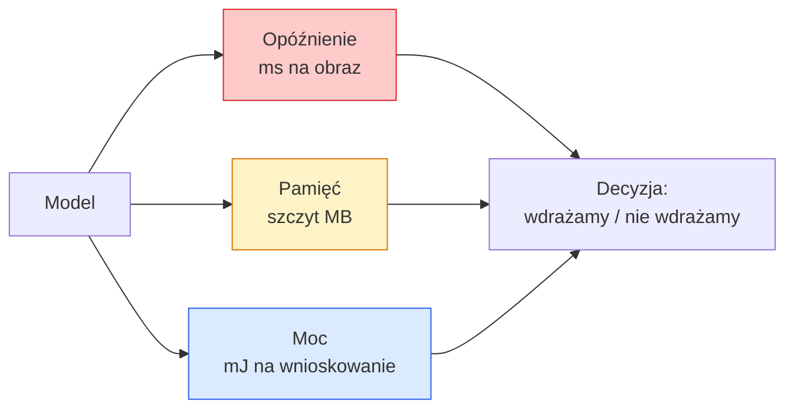

# Wizja w czasie rzeczywistym — wdrożenie na urządzeniach brzegowych (Edge)

> Wnioskowanie na urządzeniach brzegowych (edge inference) to dyscyplina sprowadzająca się do tego, jak sprawić, by model o dokładności 90% działał z prędkością 30 fps na urządzeniu z 2 GB RAM. Każdy punkt procentowy dokładności jest wymieniany na milisekundy opóźnienia.

**Typ:** Nauka + Budowa
**Języki:** Python
**Wymagania wstępne:** Faza 4, Lekcja 04 (Klasyfikacja obrazów), Faza 10, Lekcja 11 (Kwantyzacja)
**Czas:** ~75 minut

## Cele nauki

- Zmierzyć opóźnienie wnioskowania, szczytowe zużycie pamięci i przepustowość dla dowolnego modelu PyTorch oraz odczytać kompromis między FLOPs / liczbą parametrów / opóźnieniem
- Skwantyzować model wizyjny do INT8 za pomocą kwantyzacji posttreningowej (post-training quantisation) w PyTorch i zweryfikować, że spadek dokładności jest mniejszy niż 1%
- Wyeksportować model do ONNX i skompilować go za pomocą ONNX Runtime lub TensorRT; wymienić trzy najczęstsze przyczyny błędów eksportu i sposoby ich naprawy
- Wyjaśnić, kiedy wybrać MobileNetV3, EfficientNet-Lite, ConvNeXt-Tiny lub MobileViT w kontekście ograniczeń urządzenia brzegowego

## Problem

Model wizyjny powstały w fazie treningu to potwór zmiennoprzecinkowy. 100M parametrów, 10 GFLOPs na jeden przebieg w przód, 2 GB VRAM. Nic z tego nie zmieści się na telefonie, w jednostce multimedialnej samochodu, w kamerze przemysłowej czy w dronie. Wdrożenie systemu wizyjnego oznacza zmieszczenie tych samych predykcji w budżecie 100 razy mniejszym.

Trzy gałki odpowiadają za większość pracy: wybór modelu (mniejsza architektura realizująca tę samą recepturę), kwantyzacja (INT8 zamiast FP32) oraz środowisko wykonawcze wnioskowania (ONNX Runtime, TensorRT, Core ML, TFLite). Dobranie ich poprawnie to różnica między demo działającym na stacji roboczej a produktem działającym na module kamery za 30 dolarów.

Ta lekcja najpierw ustanawia dyscyplinę pomiarową (nie można optymalizować czegoś, czego nie można zmierzyć), a następnie przechodzi przez te trzy gałki. Celem nie jest poznanie każdego środowiska wykonawczego dla urządzeń brzegowych, ale wiedza, jakie dźwignie istnieją i jak zweryfikować, że każda z nich robi to, co myślisz.

## Koncepcja

### Trzy budżety



- **Opóźnienie**: p50, p95, p99. Uśrednianie tylko p50 skrywa zachowanie ogona rozkładu, które ma znaczenie dla systemów czasu rzeczywistego.
- **Szczytowa pamięć**: maksimum, jakie urządzenie kiedykolwiek zobaczy, a nie średnia w stanie ustalonym. Ma znaczenie, ponieważ błędy braku pamięci (OOM) są fatalne na urządzeniach wbudowanych.
- **Moc / energia**: miliodżule na wnioskowanie na urządzeniu zasilanym bateryjnie. Często przybliżana przez wykorzystanie CPU/GPU * czas.

Tabela (model, opóźnienie, pamięć, dokładność) jest tym, na podstawie czego podejmuje się decyzję dotyczącą urządzenia brzegowego. Każda komórka jest mierzona na docelowym urządzeniu, nie na stacji roboczej.

### Dyscyplina pomiarowa

Trzy zasady, których powinien przestrzegać każdy profil dla urządzeń brzegowych:

1. **Rozgrzej** model za pomocą 5-10 fikcyjnych przebiegów w przód przed pomiarem. Zimne pamięci podręczne i kompilacja JIT dają niereprezentatywne pierwsze wyniki.
2. **Synchronizuj** obciążenia GPU za pomocą `torch.cuda.synchronize()` przed i po mierzonym blokiem. Bez tego mierzysz dyspozycję jąder (kernel dispatch), a nie ich wykonanie.
3. **Ustal rozmiary wejściowe** na rozdzielczość produkcyjną. Opóźnienie przy 224x224 nie jest opóźnieniem przy 512x512.

### FLOPs jako proxy

FLOPs (operacje zmiennoprzecinkowe na wnioskowanie) to tani, niezależny od urządzenia wskaźnik zastępczy opóźnienia. Przydatny do porównywania architektur, ale myleący jako absolutny czas rzeczywisty. Model z 10% większą liczbą FLOPs może w praktyce być 2x szybszy, ponieważ używa operacji przyjaznych dla sprzętu (konwolucje depthwise kompilują się dobrze, duże konwolucje 7x7 nie).

Zasada: używaj FLOPs do przeszukiwania architektur, używaj opóźnienia na urządzeniu do decyzji o wdrożeniu.

### Kwantyzacja w jednym paragrafie

Zastąp wagi i aktywacje FP32 wartościami INT8. Rozmiar modelu spada 4x, przepustowość pamięci spada 4x, obliczenia spadają 2-4x na sprzęcie posiadającym jądra INT8 (każdy nowoczesny mobilny SoC, każde GPU NVIDIA z Tensor Cores). Spadek dokładności w zadaniach wizyjnych wynosi typowo 0,1-1 punktu procentowego przy statycznej kwantyzacji posttreningowej.

Typy:

- **Dynamiczna** — kwantyzuje wagi do INT8, aktywacje są obliczane w FP. Łatwa, niewielkie przyspieszenie.
- **Statyczna (posttreningowa)** — kwantyzuje wagi + kalibruje zakresy aktywacji na małym zbiorze kalibracyjnym. Znacznie szybsza niż dynamiczna.
- **Trening świadomy kwantyzacji (QAT)** — symuluje kwantyzację podczas treningu, dzięki czemu model uczy się ją omijać. Najlepsza dokładność, wymaga oznaczonych danych.

W przypadku wizji statyczna kwantyzacja posttreningowa daje 95% korzyści za 5% nakładu pracy. Używaj QAT tylko wtedy, gdy spadek dokładności wynikający z PTQ jest niedopuszczalny.

### Przycinanie i destylacja

- **Przycinanie (pruning)** — usuwa nieistotne wagi (na podstawie wartości) lub kanały (strukturalnie). Działa dobrze na modelach z nadmiarem parametrów; mniej przydatne w już zwartych architekturach.
- **Destylacja** — trenuje mały model uczeń (student), by imitował logity dużego modelu nauczyciela (teacher). Często odzyskuje większość dokładności utraconej przy zmniejszeniu modelu. Standard dla produkcyjnych modeli edge.

### Środowiska wykonawcze wnioskowania

- **PyTorch eager** — wolne, nie do wdrożenia. Używaj tylko podczas rozwoju.
- **TorchScript** — przestarzałe. Zastąpione przez `torch.compile` i eksport do ONNX.
- **ONNX Runtime** — neutralne środowisko wykonawcze. CPU, CUDA, CoreML, TensorRT, OpenVINO — wszystkie mają dostawców (providers) ONNX. Zacznij tutaj.
- **TensorRT** — kompilator NVIDII. Najlepsze opóźnienie na GPU NVIDIA (stacje robocze i Jetson). Integruje się z ONNX Runtime lub działa samodzielnie.
- **Core ML** — środowisko wykonawcze Apple dla iOS/macOS. Wymaga `.mlmodel` lub `.mlpackage`.
- **TFLite** — środowisko wykonawcze Google dla Android/ARM. Wymaga `.tflite`.
- **OpenVINO** — środowisko wykonawcze Intela dla CPU/VPU. Wymaga `.xml` + `.bin`.

W praktyce: eksportuj PyTorch -> ONNX -> wybierz środowisko wykonawcze dla docelowego urządzenia. ONNX jest lingua franca.

### Selektor architektury edge

| Budżet | Model | Dlaczego |
|--------|-------|-----|
| < 3M parametrów | MobileNetV3-Small | Kompiluje się wszędzie, dobry punkt odniesienia |
| 3-10M | EfficientNet-Lite-B0 | Najlepsza dokładność na parametr w TFLite |
| 10-20M | ConvNeXt-Tiny | Najlepsza dokładność na parametr, przyjazny dla CPU |
| 20-30M | MobileViT-S lub EfficientViT | Transformer z dokładnością na poziomie ImageNet |
| 30-80M | Swin-V2-Tiny | Jeśli stos wsparcia obsługuje window attention |

Kwantyzuj wszystkie te modele do INT8, o ile nie masz konkretnego powodu, by tego nie robić.

## Zbuduj to

### Krok 1: Poprawne mierzenie opóźnienia

```python
import time
import torch

def measure_latency(model, input_shape, device="cpu", warmup=10, iters=50):
    model = model.to(device).eval()
    x = torch.randn(input_shape, device=device)
    with torch.no_grad():
        for _ in range(warmup):
            model(x)
        if device == "cuda":
            torch.cuda.synchronize()
        times = []
        for _ in range(iters):
            if device == "cuda":
                torch.cuda.synchronize()
            t0 = time.perf_counter()
            model(x)
            if device == "cuda":
                torch.cuda.synchronize()
            times.append((time.perf_counter() - t0) * 1000)
    times.sort()
    return {
        "p50_ms": times[len(times) // 2],
        "p95_ms": times[int(len(times) * 0.95)],
        "p99_ms": times[int(len(times) * 0.99)],
        "mean_ms": sum(times) / len(times),
    }
```

Rozgrzej, synchronizuj, używaj `time.perf_counter()`. Raportuj percentyle, nie tylko średnią.

### Krok 2: Liczba parametrów i FLOPs

```python
def parameter_count(model):
    return sum(p.numel() for p in model.parameters())

def flops_estimate(model, input_shape):
    """
    Rough FLOP count for a conv/linear-only model. For production use `fvcore` or `ptflops`.
    """
    total = 0
    def conv_hook(m, inp, out):
        nonlocal total
        c_out, c_in, kh, kw = m.weight.shape
        h, w = out.shape[-2:]
        total += 2 * c_in * c_out * kh * kw * h * w
    def linear_hook(m, inp, out):
        nonlocal total
        total += 2 * m.in_features * m.out_features
    hooks = []
    for m in model.modules():
        if isinstance(m, torch.nn.Conv2d):
            hooks.append(m.register_forward_hook(conv_hook))
        elif isinstance(m, torch.nn.Linear):
            hooks.append(m.register_forward_hook(linear_hook))
    model.eval()
    with torch.no_grad():
        model(torch.randn(input_shape))
    for h in hooks:
        h.remove()
    return total
```

Do prawdziwych projektów użyj `fvcore.nn.FlopCountAnalysis` lub `ptflops`; obsługują poprawnie każdy typ modułu.

### Krok 3: Statyczna kwantyzacja posttreningowa

```python
def quantise_ptq(model, calibration_loader, backend="x86"):
    import torch.ao.quantization as tq
    model = model.eval().cpu()
    model.qconfig = tq.get_default_qconfig(backend)
    tq.prepare(model, inplace=True)
    with torch.no_grad():
        for x, _ in calibration_loader:
            model(x)
    tq.convert(model, inplace=True)
    return model
```

Trzy kroki: konfiguracja, przygotowanie (wstawienie obserwatorów), kalibracja na rzeczywistych danych, konwersja (fuzja + kwantyzacja). Wymaga, by model był wcześniej zespolony (`Conv -> BN -> ReLU` -> `ConvBnReLU`), co obsługuje `torch.ao.quantization.fuse_modules`.

### Krok 4: Eksport do ONNX

```python
def export_onnx(model, sample_input, path="model.onnx"):
    model = model.eval()
    torch.onnx.export(
        model,
        sample_input,
        path,
        input_names=["input"],
        output_names=["output"],
        dynamic_axes={"input": {0: "batch"}, "output": {0: "batch"}},
        opset_version=17,
    )
    return path
```

`opset_version=17` jest bezpiecznym domyślnym wyborem w 2026 roku. `dynamic_axes` pozwala uruchomić model ONNX z dowolnym rozmiarem batcha.

### Krok 5: Benchmark i porównanie reżimów

```python
import torch.nn as nn
from torchvision.models import mobilenet_v3_small

def compare_regimes():
    model = mobilenet_v3_small(weights=None, num_classes=10)
    params = parameter_count(model)
    flops = flops_estimate(model, (1, 3, 224, 224))
    lat_fp32 = measure_latency(model, (1, 3, 224, 224), device="cpu")
    print(f"FP32 MobileNetV3-Small: {params:,} params  {flops/1e9:.2f} GFLOPs  "
          f"p50={lat_fp32['p50_ms']:.2f}ms  p95={lat_fp32['p95_ms']:.2f}ms")
```

Uruchom tę samą funkcję dla `resnet50`, `efficientnet_v2_s` i `convnext_tiny`, i otrzymasz tabelę porównawczą potrzebną do decyzji o wdrożeniu.

## Zastosowanie

Stosy produkcyjne zbiegają się do jednej z trzech ścieżek:

- **Web / serverless**: PyTorch -> ONNX -> ONNX Runtime (provider CPU lub CUDA). Najprostsze, wystarczające w większości przypadków.
- **Edge NVIDIA (Jetson, serwer GPU)**: PyTorch -> ONNX -> TensorRT. Najlepsze opóźnienie, największy wysiłek inżynieryjny.
- **Mobile**: PyTorch -> ONNX -> Core ML (iOS) lub TFLite (Android). Kwantyzuj przed eksportem.

Do pomiarów `torch-tb-profiler`, `nvprof` / `nsys` oraz Instruments na macOS dają rozbicie warstwa po warstwie. `benchmark_app` (OpenVINO) i `trtexec` (TensorRT) dają samodzielne wyniki z linii komend.

## Wynik końcowy

Ta lekcja produkuje:

- `outputs/prompt-edge-deployment-planner.md` — prompt, który wybiera backbone, strategię kwantyzacji i środowisko wykonawcze na podstawie docelowego urządzenia i SLA opóźnienia.
- `outputs/skill-latency-profiler.md` — skill, który pisze kompletny skrypt do benchmarkowania opóźnienia z rozgrzewką, synchronizacją, percentylami i śledzeniem pamięci.

## Ćwiczenia

1. **(Łatwe)** Zmierz opóźnienie p50 dla `resnet18`, `mobilenet_v3_small`, `efficientnet_v2_s` i `convnext_tiny` przy 224x224 na CPU. Zaraportuj tabelę i zidentyfikuj, która architektura ma najlepszą dokładność na milisekundę.
2. **(Średnie)** Zastosuj statyczną kwantyzację posttreningową do `mobilenet_v3_small`. Zaraportuj opóźnienie FP32 vs INT8 oraz spadek dokładności na wydzielonym podzbiorze CIFAR-10 lub podobnego zbioru.
3. **(Trudne)** Wyeksportuj `convnext_tiny` do ONNX, uruchom go przez `onnxruntime` z `CPUExecutionProvider` i porównaj opóźnienie z bazowym wynikiem PyTorch eager. Zidentyfikuj pierwszą warstwę, w której ONNX Runtime jest szybszy, i wyjaśnij, dlaczego.

## Kluczowe terminy

| Termin | Co mówią ludzie | Co to faktycznie znaczy |
|------|----------------|----------------------|
| Latency (opóźnienie) | "Jak szybko" | Czas od wejścia do wyjścia; percentyle p50/p95/p99, nie średnia |
| FLOPs | "Rozmiar modelu" | Operacje zmiennoprzecinkowe na przebieg w przód; przybliżony wskaźnik kosztu obliczeniowego |
| Kwantyzacja INT8 | "8-bitowy" | Zastąpienie wag/aktywacji FP32 8-bitowymi liczbami całkowitymi; ~4x mniejszy, 2-4x szybszy |
| PTQ | "Kwantyzacja posttreningowa" | Kwantyzacja wytrenowanego modelu bez ponownego treningu; łatwe, zwykle wystarczające |
| QAT | "Trening świadomy kwantyzacji" | Symulacja kwantyzacji podczas treningu; najlepsza dokładność, wymaga oznaczonych danych |
| ONNX | "Neutralny format" | Format wymiany modeli wspierany przez każde popularne środowisko wykonawcze wnioskowania |
| TensorRT | "Kompilator NVIDII" | Kompiluje ONNX do zoptymalizowanego silnika dla GPU NVIDIA |
| Destylacja | "Nauczyciel -> uczeń" | Trening małego modelu, by imitował logity dużego modelu; odzyskuje większość utraconej dokładności |

## Dalsze materiały

- [EfficientNet (Tan & Le, 2019)](https://arxiv.org/abs/1905.11946) — skalowanie złożone dla efektywnych architektur
- [MobileNetV3 (Howard et al., 2019)](https://arxiv.org/abs/1905.02244) — architektura mobile-first z h-swish i squeeze-excite
- [A Practical Guide to TensorRT Optimization (NVIDIA)](https://developer.nvidia.com/blog/accelerating-model-inference-with-tensorrt-tips-and-best-practices-for-pytorch-users/) — jak faktycznie uzyskać wyniki przepustowości z publikacji
- [ONNX Runtime docs](https://onnxruntime.ai/docs/) — kwantyzacja, optymalizacja grafu, wybór providera
