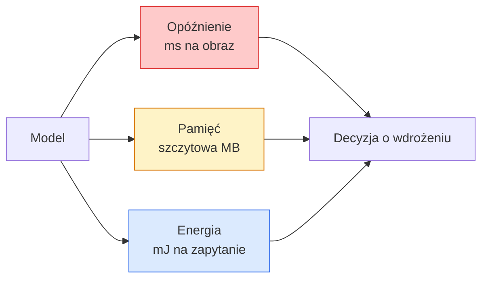

Created At: 2026-06-08T18:21:35Z
Completed At: 2026-06-08T18:21:35Z
File Path: `file:///C:/poligon/LLM_Traning/phases/04-computer-vision/15-real-time-edge/docs/pl_pro.md`

# Wizja komputerowa w czasie rzeczywistym – wdrożenia brzegowe (Edge AI)

> Optymalizacja modeli na urządzenia brzegowe to sztuka kompromisu: jak utrzymać dokładność na poziomie 90% przy generowaniu 30 klatek na sekundę (fps) na sprzęcie z 2 GB pamięci RAM. W tej dyscyplinie każdy punkt procentowy dokładności ma swoją cenę mierzoną w milisekundach opóźnienia (latency).

**Typ:** Ucz się + Buduj  
**Języki:** Python  
**Wymagania wstępne:** Faza 4, lekcja 04 (klasyfikacja obrazów); faza 10, lekcja 11 (kwantyzacja modeli)  
**Czas:** ~75 minut  

## Cele nauczania

- Mierzyć opóźnienie (latency), pamięć szczytową (peak memory) oraz przepustowość (throughput) dla modeli PyTorch oraz interpretować relacje między parametrami, liczbą operacji FLOP a rzeczywistym czasem odpowiedzi.
- Przeprowadzić kwantyzację modelu wizyjnego do formatu INT8 za pomocą statycznej kwantyzacji po treningu (Post-Training Quantization – PTQ) w PyTorch i zweryfikować spadek dokładności na poziomie poniżej 1%.
- Eksportować modele do formatu ONNX i kompilować je za pomocą ONNX Runtime lub TensorRT, identyfikując three najczęstsze błędy eksportu i sposoby ich rozwiązywania.
- Wskazywać scenariusze zastosowania dla modeli MobileNetV3, EfficientNet-Lite, ConvNeXt-Tiny oraz MobileViT przy ograniczonych zasobach sprzętowych.

## Problem

Model wizyjny w trakcie fazy uczenia to obliczeniowy kolos: setki milionów parametrów FP32, 10 GFLOPów na jedno przejście w przód (forward pass), gigabajty zajętej pamięci VRAM. Żadne z tych wymagań nie pozwala na uruchomienie modelu na smartfonie, w samochodowym systemie infotainment, na dronie czy kamerze przemysłowej. Wdrożenie produkcyjne systemu wizyjnego na urządzeniach brzegowych wymaga zmieszczenia tych samych predykcji w budżecie sprzętowym mniejszym nawet 100-krotnie.

Główną rolę odgrywają tu trzy czynniki optymalizacji: dobór architektury (lżejszy model o wysokiej efektywności), kwantyzacja (konwersja wag z formatu FP32 do INT8) oraz wybór dedykowanego środowiska uruchomieniowego (np. ONNX Runtime, TensorRT, Core ML, TFLite). Precyzyjna konfiguracja tych elementów decyduje o tym, czy projekt pozostanie jedynie prototypem na mocnej stacji roboczej, czy stanie się gotowym produktem działającym na tanim module kamery za 30 USD.

W tej lekcji w pierwszej kolejności zdefiniujemy poprawne metody pomiarowe (zasada: „nie możesz zoptymalizować czegoś, czego nie potrafisz precyzyjnie zmierzyć”), a następnie omówimy wspomniane trzy parametry optymalizacji. Celem lekcji nie jest opanowanie każdego środowiska uruchomieniowego od strony deweloperskiej, lecz zrozumienie dostępnych narzędzi i metod weryfikacji ich skuteczności.

## Koncepcja

### Trzy kluczowe budżety zasobów



- **Opóźnienie (Latency)** – należy monitorować rozkłady percentylowe: p50, p95, p99. Analizowanie wyłącznie mediany (p50) ukrywa sporadyczne opóźnienia w kolejce (tail latency), które są kluczowe w systemach czasu rzeczywistego.
- **Pamięć szczytowa (Peak Memory)** – maksymalna objętość pamięci zajętej przez model w dowolnym momencie (włącznie z alokacjami tymczasowymi), a nie średnia wartość w stanie spoczynku. Przekroczenie limitu RAM prowadzi do natychmiastowego zamknięcia procesu (błąd Out of Memory – OOM), co w systemach wbudowanych jest niedopuszczalne.
- **Zużycie energii (Power)** – wyrażane w milidżulach (mJ) na jedno zapytanie, kluczowe dla urządzeń zasilanych bateryjnie. W praktyce mierzone pośrednio jako iloczyn poboru mocy przez CPU/GPU oraz czasu wykonywania obliczeń.

Zestawienie tych parametrów (wybrany model, opóźnienie, zużycie pamięci, dokładność) stanowi podstawę decyzji wdrożeniowej. Wszystkie te wartości muszą być mierzone na rzeczywistym sprzęcie docelowym, a nie na stacji roboczej programisty.

### Dobre praktyki pomiarowe

Trzy fundamentalne reguły profilowania wydajności:

1. **Rozgrzewka (Warmup)**: wykonaj od 5 do 10 przejść w przód (forward pass) z losowymi danymi przed rozpoczęciem właściwego pomiaru czasu. Wczytywanie bibliotek do pamięci podręcznej (cache) oraz pierwsza kompilacja JIT mogą sztucznie zawyżyć czas pierwszych iteracji.
2. **Synchronizacja (Synchronization)**: w przypadku obliczeń na GPU przed i po każdym bloku mierzącym czas wywołaj `torch.cuda.synchronize()`. Bez tego zmierzysz jedynie czas zakolejkowania operacji, a nie ich faktyczne wykonanie na akceleratorze.
3. **Zgodność wymiarów wejściowych**: dopasuj rozmiar testowego tensora do rzeczywistej rozdzielczości produkcyjnej. Opóźnienie dla obrazu $224 \times 224$ będzie znacząco inne niż dla rozdzielczości $512 \times 512$.

### FLOP jako metryka pomocnicza (Proxy)

Liczba operacji FLOP (Floating Point Operations) przypadająca na jedno przejście w przód to prosta i niezależna od sprzętu metryka szacująca opóźnienie. Jest użyteczna przy wstępnym porównywaniu architektur, lecz bywa myląca jako wskaźnik rzeczywistego czasu wykonania. Model o 10% większej liczbie operacji FLOP może w rzeczywistości działać dwukrotnie szybciej, jeśli wykorzystuje operacje zoptymalizowane pod dany układ scalony (np. sploty głębokie – depthwise convolutions – kompilują się bardzo wydajnie, podczas gdy duże sploty $7 \times 7$ mogą nie mieć sprzętowego wsparcia).

Zasada: traktuj liczbę FLOP jako wskazówkę przy wyborze architektury, ale ostateczną decyzję wdrożeniową opieraj wyłącznie na pomiarze opóźnienia na urządzeniu docelowym.

### Kwantyzacja w pigułce

Polega na konwersji wag i aktywacji z formatu FP32 do INT8. Rozmiar pliku modelu zmniejsza się 4-krotnie, zapotrzebowanie na przepustowość pamięci spada o 75%, a wydajność obliczeniowa rośnie 2-4 krotnie na układach wspierających instrukcje INT8 (współczesne układy SoC w smartfonach, rdzenie Tensor w GPU NVIDIA). W zadaniach wizyjnych spadek dokładności przy zastosowaniu statycznej kwantyzacji po treningu (Post-Training Quantization – PTQ) wynosi zazwyczaj zaledwie od 0.1 do 1.0 punktu procentowego.

Warianty kwantyzacji:

- **Kwantyzacja dynamiczna (Dynamic Quantization)** – kwantyzacji do formatu INT8 podlegają wyłącznie wagi modelu, natomiast aktywacje są przeliczane w locie do FP32. Metoda najprostsza, dająca umiarkowane przyspieszenie.
- **Kwantyzacja statyczna (Static PTQ)** – kwantyzacja wag połączona z kalibracją zakresów aktywacji na małym podzbiorze danych testowych (zbiorze kalibracyjnym). Daje znacznie wyższą wydajność niż wersja dynamiczna.
- **Uczenie uwzględniające kwantyzację (Quantization-Aware Training – QAT)** – symulowanie błędów kwantyzacji w trakcie uczenia modelu (wagi są reprezentowane w INT8 w przejściu w przód, ale aktualizowane w FP32 w propagacji wstecznej). Zapewnia najmniejszy spadek dokładności, wymaga jednak etykietowanych danych treningowych.

W zadaniach wizyjnych statyczna kwantyzacja PTQ pozwala uzyskać 95% możliwych optymalizacji przy minimalnym nakładzie pracy. Użycie QAT jest zalecane tylko w przypadkach, gdy spadek dokładności po zastosowaniu standardowego PTQ jest zbyt duży dla danego systemu.

### Przycinanie wag (Pruning) oraz destylacja wiedzy (Distillation)

- **Przycinanie wag (Pruning)** – polega na usuwaniu wag o najmniejszym znaczeniu (np. o najmniejszej wartości bezwzględnej) lub całych kanałów (przycinanie strukturyzowane). Metoda skuteczna w modelach o nadmiernej pojemności; mało efektywna w modelach z natury kompaktowych.
- **Destylacja wiedzy (Distillation)** – uczenie mniejszego modelu (ucznia) naśladowania rozkładu logitów wyjściowych większego, dokładniejszego modelu (nauczyciela). Pozwala na odzyskanie większości dokładności utraconej wskutek redukcji rozmiaru sieci. Standardowa technika w produkcji.

### Środowiska uruchomieniowe (Inference Runtimes)

- **PyTorch (Eager Mode)** – powolny, nie nadaje się do wdrożeń produkcyjnych. Stosowany wyłącznie na etapie deweloperskim.
- **TorchScript** – rozwiązanie starszej generacji, obecnie zastępowane przez `torch.compile` oraz eksport do formatu ONNX.
- **ONNX Runtime** – uniwersalne i przenośne środowisko. Posiada dostawców wykonawczych (Execution Providers) dla CPU, CUDA, CoreML, TensorRT czy OpenVINO. Rekomendowany punkt startowy wdrożeń.
- **TensorRT** – wysoce zoptymalizowany kompilator i silnik od NVIDIA. Gwarantuje najniższe opóźnienia na GPU tej marki (wersje serwerowe oraz układy wbudowane Jetson). Może być używany samodzielnie lub jako backend dla ONNX Runtime.
- **Core ML** – oficjalne środowisko uruchomieniowe Apple dla systemów iOS/macOS. Wymaga modeli w formacie `.mlmodel` lub `.mlpackage`.
- **TFLite (TensorFlow Lite)** – lekki silnik Google dla systemów Android oraz układów ARM. Wymaga formatu `.tflite`.
- **OpenVINO** – zoptymalizowany silnik od Intel dla procesorów CPU i zintegrowanych układów graficznych tej marki. Korzysta z formatów `.xml` oraz `.bin`.

Standardowa ścieżka wdrożeniowa: eksport modelu z PyTorch $\to$ format ONNX $\to$ kompilacja do środowiska uruchomieniowego dopasowanego do sprzętu docelowego. Format ONNX pełni tu rolę uniwersalnego języka wymiany (lingua franca).

### Modele brzegowe (Edge Backbones)

| Parametry | Model | Zastosowanie |
|-----------|-------|--------------|
| < 3M      | MobileNetV3-Small | Kompatybilny z niemal każdym sprzętem, dobry jako pierwszy baseline |
| 3 - 10M   | EfficientNet-Lite-B0 | Wysoka dokładność w przeliczeniu na parametr w środowisku TFLite |
| 10 - 20M  | ConvNeXt-Tiny | Doskonały stosunek jakości do parametrów, wysoka wydajność na CPU |
| 20 - 30M  | MobileViT-S / EfficientViT | Architektura oparta na Transformerach zoptymalizowana na urządzenia mobilne |
| 30 - 80M  | Swin-V2-Small | Dla zaawansowanych systemów z pełną obsługą uwagi w oknach lokalnych |

Wszystkie modele docelowe warto poddać kwantyzacji do formatu INT8, o ile nie ma wyraźnych przeciwwskazań technicznych.

## Zbuduj to

### Krok 1: Precyzyjny pomiar opóźnienia (Latency Benchmarking)

```python
import time
import torch

def measure_latency(model, input_shape, device="cpu", warmup=10, iters=50):
    model = model.to(device).eval()
    x = torch.randn(input_shape, device=device)
    with torch.no_grad():
        for _ in range(warmup):
            model(x)
        if device == "cuda":
            torch.cuda.synchronize()
        times = []
        for _ in range(iters):
            if device == "cuda":
                torch.cuda.synchronize()
            t0 = time.perf_counter()
            model(x)
            if device == "cuda":
                torch.cuda.synchronize()
            times.append((time.perf_counter() - t0) * 1000)
    times.sort()
    return {
        "p50_ms": times[len(times) // 2],
        "p95_ms": times[int(len(times) * 0.95)],
        "p99_ms": times[int(len(times) * 0.99)],
        "mean_ms": sum(times) / len(times),
    }
```

Zasada: wykonaj rozgrzewkę, zsynchronizuj operacje GPU, użyj precyzyjnego zegara `time.perf_counter()` oraz analizuj percentyle zamiast prostego uśrednienia.

### Krok 2: Szacowanie liczby parametrów i operacji FLOP

```python
def parameter_count(model):
    return sum(p.numel() for p in model.parameters())

def flops_estimate(model, input_shape):
    """
    Uproszczone zliczanie FLOP dla warstw splotowych i liniowych.
    W celach produkcyjnych używaj biblioteki fvcore lub ptflops.
    """
    total = 0
    def conv_hook(m, inp, out):
        nonlocal total
        c_out, c_in, kh, kw = m.weight.shape
        h, w = out.shape[-2:]
        total += 2 * c_in * c_out * kh * kw * h * w
    def linear_hook(m, inp, out):
        nonlocal total
        total += 2 * m.in_features * m.out_features
    hooks = []
    for m in model.modules():
        if isinstance(m, torch.nn.Conv2d):
            hooks.append(m.register_forward_hook(conv_hook))
        elif isinstance(m, torch.nn.Linear):
            hooks.append(m.register_forward_hook(linear_hook))
    model.eval()
    with torch.no_grad():
        model(torch.randn(input_shape))
    for h in hooks:
        h.remove()
    return total
```

W zastosowaniach produkcyjnych zaleca się stosowanie wyspecjalizowanych bibliotek, takich jak `fvcore` czy `ptflops`, które poprawnie analizują i zliczają operacje dla każdego typu warstwy.

### Krok 3: Statyczna kwantyzacja po treningu (Post-Training Quantization – PTQ)

```python
def quantise_ptq(model, calibration_loader, backend="x86"):
    import torch.ao.quantization as tq
    model = model.eval().cpu()
    model.qconfig = tq.get_default_qconfig(backend)
    tq.prepare(model, inplace=True)
    with torch.no_grad():
        for x, _ in calibration_loader:
            model(x)
    tq.convert(model, inplace=True)
    return model
```

Cały proces składa się z czterech kroków: konfiguracji modelu, przygotowania (wstrzyknięcie modułów obserwatorów – observers), kalibracji na danych rzeczywistych oraz konwersji do wag INT8. Wymaga to wcześniejszego scalenia warstw (fusing: `Conv -> BatchNorm -> ReLU` do postaci jednego modułu), co realizuje funkcja `torch.ao.quantization.fuse_modules`.

### Krok 4: Eksport modelu do formatu ONNX

```python
def export_onnx(model, sample_input, path="model.onnx"):
    model = model.eval()
    torch.onnx.export(
        model,
        sample_input,
        path,
        input_names=["input"],
        output_names=["output"],
        dynamic_axes={"input": {0: "batch"}, "output": {0: "batch"}},
        opset_version=17,
    )
    return path
```

Wersja zestawu instrukcji `opset_version=17` to stabilny i bezpieczny standard. Definicja `dynamic_axes` pozwala na uruchamianie modelu ONNX z dynamicznie zmiennym rozmiarem paczki (batch size).

### Krok 5: Analiza wydajności i porównanie modeli

```python
import torch.nn as nn
from torchvision.models import mobilenet_v3_small

def compare_regimes():
    model = mobilenet_v3_small(weights=None, num_classes=10)
    params = parameter_count(model)
    flops = flops_estimate(model, (1, 3, 224, 224))
    lat_fp32 = measure_latency(model, (1, 3, 224, 224), device="cpu")
    print(f"FP32 MobileNetV3-Small: {params:,} parametrów  {flops/1e9:.2f} GFLOPs  "
          f"p50={lat_fp32['p50_ms']:.2f}ms  p95={lat_fp32['p95_ms']:.2f}ms")
```

Wykonanie pomiarów dla modeli takich jak ResNet-50, EfficientNet-V2-S czy ConvNeXt-Tiny dostarcza danych niezbędnych do podjęcia racjonalnej decyzji o wdrożeniu produkcyjnym.

## Wdrożenie

Główne ścieżki wdrożeń produkcyjnych:

- **Systemy webowe / bezserwerowe (Serverless)**: PyTorch $\to$ ONNX $\to$ ONNX Runtime (z Execution Provider dopasowanym do CPU lub CUDA). Najprostszy w implementacji potok wdrożeniowy.
- **Urządzenia brzegowe NVIDIA (Jetson, serwery z GPU)**: PyTorch $\to$ ONNX $\to$ TensorRT. Gwarantuje najniższe możliwe opóźnienia, kosztem większego nakładu pracy inżynieryjnej.
- **Urządzenia mobilne (smartfony)**: PyTorch $\to$ ONNX $\to$ Core ML (iOS) lub TFLite (Android), z wcześniejszą kwantyzacją wag.

Do szczegółowego profilowania warstwa po warstwie wykorzystuje się narzędzia takie jak `torch-tb-profiler`, `nvprof` / `nsys` (NVIDIA Nsight Systems) lub Xcode Instruments (na platformach Apple). Szybkie pomiary z poziomu konsoli umożliwiają narzędzia `benchmark_app` (z pakietu OpenVINO) oraz `trtexec` (z pakietu TensorRT).

## Wyślij to

Niniejsza lekcja dostarcza:

- `outputs/prompt-edge-deployment-planner.md` – prompt automatycznie dobierający odpowiedni model brzegowy, technikę kwantyzacji oraz środowisko uruchomieniowe na podstawie wymagań sprzętowych i umowy SLA dotyczącej opóźnienia.
- `outputs/skill-latency-profiler.md` – narzędzie generujące kompletny skrypt PyTorch do profilowania modeli pod kątem opóźnień (z rozgrzewką, synchronizacją GPU, analizą percentylową oraz monitorowaniem zużycia pamięci).

## Ćwiczenia

1. **(Łatwe)** Zmierz opóźnienie (medianę p50) dla modeli ResNet-18, MobileNetV3-Small, EfficientNet-V2-S oraz ConvNeXt-Tiny przy rozdzielczości wejściowej $224 \times 224$ na CPU. Przygotuj tabelę porównawczą i wskaż, który model charakteryzuje się najlepszym stosunkiem dokładności do czasu odpowiedzi (accuracy per millisecond).
2. **(Średnie)** Przeprowadź statyczną kwantyzację po treningu (Static PTQ) na modelu MobileNetV3-Small. Porównaj opóźnienie oraz dokładność (Accuracy) modelu bazowego FP32 oraz skwantyzowanego INT8 na zbiorze walidacyjnym (np. CIFAR-10).
3. **(Trudne)** Wyeksportuj model ConvNeXt-Tiny do formatu ONNX, uruchom go za pomocą biblioteki `onnxruntime` (z użyciem `CPUExecutionProvider`) i porównaj opóźnienie z oryginalnym modelem PyTorch (tryb eager). Przeanalizuj czasy wykonania poszczególnych operacji w celu zidentyfikowania warstw, dla których silnik ONNX Runtime uzyskuje przewagę, i wyjaśnij źródło tego przyspieszenia.

## Kluczowe terminy

| Termin | Obiegowe określenie | Co to oznacza w rzeczywistości |
|------|----------------|----------------------|
| Opóźnienie (Latency) | Czas odpowiedzi | Czas mierzony od podania danych wejściowych do zwrócenia wyniku; kluczowe znaczenie ma analiza percentyli p50/p95/p99, a nie średniej |
| FLOP | Złożoność obliczeniowa | Liczba operacji zmiennoprzecinkowych wykonywanych podczas jednego przejścia w przód; służy jako teoretyczna miara kosztu obliczeniowego |
| Kwantyzacja INT8 | Reprezentacja 8-bitowa | Konwersja wag i aktywacji z 32-bitowych wartości zmiennoprzecinkowych na 8-bitowe liczby całkowite; zmniejsza plik modelu 4-krotnie i przyspiesza wnioskowanie 2-4 krotnie |
| PTQ (Post-Training Quantization) | Kwantyzacja statyczna | Kwantyzacja gotowego, wytrenowanego modelu bez konieczności ponownego uczenia; szybka i skuteczna w większości zadań wizyjnych |
| QAT (Quantization-Aware Training) | Trening z uwzględnieniem kwantyzacji | Symulowanie błędów zaokrągleń kwantyzacji w trakcie treningu; minimalizuje spadek dokładności na etapie INT8, ale wymaga dostępu do pełnego procesu uczenia |
| ONNX (Open Neural Network Exchange) | Uniwersalny format | Otwarty format reprezentacji modeli ułatwiający ich migrację pomiędzy różnymi frameworkami i silnikami uruchomieniowymi |
| TensorRT | Silnik dedykowany GPU | Optymalizuje i kompiluje graf obliczeniowy modelu ONNX pod kątem konkretnych architektur GPU od NVIDIA |
| Destylacja wiedzy (Distillation) | Transfer wiedzy | Uczenie małego modelu (ucznia) w celu odtwarzania rozkładu wyjść generowanych przez duży model (nauczyciela) |

## Literatura uzupełniająca

- [EfficientNet: Rethinking Model Scaling for Convolutional Neural Networks (Tan & Le, 2019)](https://arxiv.org/abs/1905.11946) – matematyczna zasada skalowania parametrów sieci splotowych.
- [Searching for MobileNetV3 (Howard et al., 2019)](https://arxiv.org/abs/1905.02244) – architektura mobilna opracowana z użyciem automatycznego wyszukiwania struktur (NAS) i aktywacji h-swish.
- [Accelerating PyTorch Models with TensorRT: Tips and Best Practices (NVIDIA)](https://developer.nvidia.com/blog/accelerating-model-inference-with-tensorrt-tips-and-best-practices-for-pytorch-users/) – praktyczne wskazówki dotyczące kompilacji modeli TensorRT.
- [Dokumentacja silnika ONNX Runtime](https://onnxruntime.ai/docs/) – kompendium wiedzy o konfiguracjach Execution Providers, kwantyzacji oraz optymalizacjach grafów obliczeniowych.
