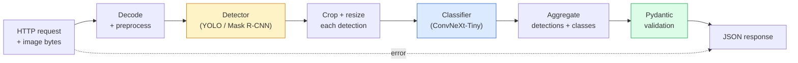

# Zbuduj kompletny rurociąg wizyjny — Capstone

> System wizji produkcji to łańcuch modeli i zasad połączonych kontraktami dotyczącymi danych. Elementy są już w tej fazie; zwieńczenie łączy je ze sobą od końca do końca.

**Typ:** Kompilacja
**Języki:** Python
**Wymagania wstępne:** Faza 4 Lekcje 01-15
**Czas:** ~120 minut

## Cele nauczania

- Zaprojektuj potok wizji produkcyjnej, który wykrywa obiekty, klasyfikuje je i emituje ustrukturyzowany JSON — z obsługiwaną każdą ścieżką awarii
- Podłącz detektor (Mask R-CNN lub YOLO), klasyfikator (ConvNeXt-Tiny) i kontrakt danych (Pydantic) do jednej usługi
- Dokonaj analizy porównawczej kompleksowego rurociągu i zidentyfikuj pierwsze wąskie gardło (zwykle przetwarzanie wstępne, następnie detektor)
- Wyślij minimalną usługę FastAPI, która akceptuje przesyłanie obrazu, uruchamia potok i zwraca wykrycia z klasyfikacją

## Problem

Indywidualne modele widzenia są przydatne; Produkty Vision to ich łańcuchy. Audyt półki detalicznej to detektor, klasyfikator produktu i potok cen-OCR. Jazda autonomiczna to detektor 2D, detektor 3D, segmenter, tracker i planista. Wstępny ekran medyczny to moduł segmentujący, klasyfikator regionu oraz interfejs lekarza.

Okablowanie tych łańcuchów to część oddzielająca prototyp ML od produktu. Każdy interfejs pomiędzy modelami jest nowym miejscem na błędy. Każda transformacja współrzędnych, każda normalizacja, każda zmiana rozmiaru maski jest kandydatem na cichą awarię. Rurociąg jest tak mocny, jak jego najsłabszy interfejs.

To zwieńczenie ustanawia minimalny realny potok: wykrywanie + klasyfikacja + ustrukturyzowane dane wyjściowe + warstwa obsługująca. Wszystko inne w fazie 4 pasuje do tego szkieletu: zamień Maskę R-CNN na YOLOv8, dodaj głowicę OCR, dodaj gałąź segmentacji, dodaj moduł śledzący. Architektura jest stabilna; elementy można podłączyć.

## Koncepcja

### Rurociąg



Siedem etapów. Obydwa etapy modelu są drogie; na pięciu pozostałych etapach żyją robaki.

### Umowy dotyczące danych z Pydantic

Każda granica modelu staje się obiektem wpisanym. Dzięki temu ciche awarie zamieniają się w głośne.

```
Detection(
    box: tuple[float, float, float, float],   # (x1, y1, x2, y2), absolute pixels
    score: float,                              # [0, 1]
    class_id: int,                             # from detector's label map
    mask: Optional[list[list[int]]],           # RLE-encoded if present
)

PipelineResult(
    image_id: str,
    detections: list[Detection],
    classifications: list[Classification],
    inference_ms: float,
)
```

Kiedy detektor zwraca pola w `(cx, cy, w, h)` zamiast `(x1, y1, x2, y2)`, weryfikacja Pydantic kończy się niepowodzeniem na granicy i dowiadujesz się o tym natychmiast, zamiast debugować dalszy zbiór, który po cichu zwraca puste regiony.

### Gdzie idzie opóźnienie

Trzy prawdy kryją się w niemal każdym procesie wizji:

1. **Przetwarzanie wstępne to często największy pojedynczy blok.** Dekodowanie plików JPEG, konwertowanie przestrzeni kolorów, zmiana rozmiaru — te czynności obciążają procesor i łatwo je zapomnieć.
2. **Detektor dominuje w czasie GPU.** 70–90% czasu GPU przypada na przebieg detekcji w przód.
3. **Przetwarzanie końcowe (NMS, kodowanie/dekodowanie RLE) jest tanie w przypadku procesora graficznego i kosztowne w przypadku procesora.** Zawsze profiluj z rzeczywistym celem.

Znajomość dystrybucji sprawia, że ​​optymalizacja staje się listą priorytetów.

### Tryby awarii

- **Puste wykrycia** — zwraca pustą listę, nie powoduje awarii. Dziennik.
- **Obszar poza granicami** — dopasuj do rozmiaru obrazu przed przycięciem.
- **Drobne uprawy** — pomiń klasyfikację dla pól mniejszych niż minimalne dane wejściowe klasyfikatora.
- **Przesyłanie uszkodzone** — odpowiedź 400 z określonym kodem błędu, a nie 500.
- **Awaria ładowania modelu** — awaria przy uruchomieniu usługi, a nie przy pierwszym żądaniu.

Potok produkcyjny obsługuje każdy z nich bez pisania ogólnego `try/except`, który ukrywa awarię. Każda awaria otrzymuje nazwany kod i odpowiedź.

### Grupowanie

Usługa produkcyjna obsługuje wielu klientów. Grupowanie wykryć i klasyfikacji w ramach żądań zwielokrotnia przepustowość. Kompromis: dodatkowe opóźnienie wynikające z oczekiwania na wypełnienie partii. Typowa konfiguracja: zbieranie żądań przez maksymalnie 20 ms, grupowanie, przetwarzanie i dystrybucja odpowiedzi. `torchserve` i `triton` robią to natywnie; małe usługi z przewidywalnym obciążeniem korzystają z własnego mikrodozownika.

## Zbuduj to

### Krok 1: Kontrakty dotyczące danych

```python
from pydantic import BaseModel, Field
from typing import List, Optional, Tuple

class Detection(BaseModel):
    box: Tuple[float, float, float, float]
    score: float = Field(ge=0, le=1)
    class_id: int = Field(ge=0)
    mask_rle: Optional[str] = None

class Classification(BaseModel):
    detection_index: int
    class_id: int
    class_name: str
    score: float = Field(ge=0, le=1)

class PipelineResult(BaseModel):
    image_id: str
    detections: List[Detection]
    classifications: List[Classification]
    inference_ms: float
```

Pięć sekund kodu oszczędza godzinę debugowania w każdym poważnym potoku.

### Krok 2: Minimalna klasa potoku

```python
import time
import numpy as np
import torch
from PIL import Image

class VisionPipeline:
    def __init__(self, detector, classifier, class_names,
                 device="cpu", min_crop=32):
        self.detector = detector.to(device).eval()
        self.classifier = classifier.to(device).eval()
        self.class_names = class_names
        self.device = device
        self.min_crop = min_crop

    def preprocess(self, image):
        """
        image: PIL.Image or np.ndarray (H, W, 3) uint8
        returns: CHW float tensor on device
        """
        if isinstance(image, Image.Image):
            image = np.asarray(image.convert("RGB"))
        tensor = torch.from_numpy(image).permute(2, 0, 1).float() / 255.0
        return tensor.to(self.device)

    @torch.no_grad()
    def detect(self, image_tensor):
        return self.detector([image_tensor])[0]

    @torch.no_grad()
    def classify(self, crops):
        if len(crops) == 0:
            return []
        batch = torch.stack(crops).to(self.device)
        logits = self.classifier(batch)
        probs = logits.softmax(-1)
        scores, cls = probs.max(-1)
        return list(zip(cls.tolist(), scores.tolist()))

    def run(self, image, image_id="anonymous"):
        t0 = time.perf_counter()
        tensor = self.preprocess(image)
        det = self.detect(tensor)

        crops = []
        detections = []
        valid_indices = []
        for i, (box, score, cls) in enumerate(zip(det["boxes"], det["scores"], det["labels"])):
            x1, y1, x2, y2 = [max(0, int(b)) for b in box.tolist()]
            x2 = min(x2, tensor.shape[-1])
            y2 = min(y2, tensor.shape[-2])
            detections.append(Detection(
                box=(x1, y1, x2, y2),
                score=float(score),
                class_id=int(cls),
            ))
            if (x2 - x1) < self.min_crop or (y2 - y1) < self.min_crop:
                continue
            crop = tensor[:, y1:y2, x1:x2]
            crop = torch.nn.functional.interpolate(
                crop.unsqueeze(0),
                size=(224, 224),
                mode="bilinear",
                align_corners=False,
            )[0]
            crops.append(crop)
            valid_indices.append(i)

        class_preds = self.classify(crops)

        classifications = []
        for valid_idx, (cls_id, cls_score) in zip(valid_indices, class_preds):
            classifications.append(Classification(
                detection_index=valid_idx,
                class_id=int(cls_id),
                class_name=self.class_names[cls_id],
                score=float(cls_score),
            ))

        return PipelineResult(
            image_id=image_id,
            detections=detections,
            classifications=classifications,
            inference_ms=(time.perf_counter() - t0) * 1000,
        )
```

Każdy interfejs jest wpisany. Każda ścieżka awarii ma określoną decyzję dotyczącą obsługi.

### Krok 3: Podłącz detektor i klasyfikator

```python
from torchvision.models.detection import maskrcnn_resnet50_fpn_v2
from torchvision.models import convnext_tiny

# Use ImageNet-pretrained weights for a realistic pipeline without training
detector = maskrcnn_resnet50_fpn_v2(weights="DEFAULT")
classifier = convnext_tiny(weights="DEFAULT")
class_names = [f"imagenet_class_{i}" for i in range(1000)]

pipe = VisionPipeline(detector, classifier, class_names)

# Smoke test with a synthetic image
test_image = (np.random.rand(400, 600, 3) * 255).astype(np.uint8)
result = pipe.run(test_image, image_id="demo")
print(result.model_dump_json(indent=2)[:500])
```

### Krok 4: Usługa FastAPI

```python
from fastapi import FastAPI, UploadFile, HTTPException
from io import BytesIO

app = FastAPI()
pipe = None  # initialised on startup

@app.on_event("startup")
def load():
    global pipe
    detector = maskrcnn_resnet50_fpn_v2(weights="DEFAULT").eval()
    classifier = convnext_tiny(weights="DEFAULT").eval()
    pipe = VisionPipeline(detector, classifier, class_names=[f"c{i}" for i in range(1000)])

@app.post("/detect")
async def detect_endpoint(file: UploadFile):
    if file.content_type not in {"image/jpeg", "image/png", "image/webp"}:
        raise HTTPException(status_code=400, detail="unsupported image type")
    data = await file.read()
    try:
        img = Image.open(BytesIO(data)).convert("RGB")
    except Exception:
        raise HTTPException(status_code=400, detail="cannot decode image")
    result = pipe.run(img, image_id=file.filename or "upload")
    return result.model_dump()
```

Uruchom z `uvicorn main:app --host 0.0.0.0 --port 8000`. Przetestuj z `curl -F 'file=@dog.jpg' http://localhost:8000/detect`.

### Krok 5: Wykonaj test porównawczy potoku

```python
import time

def benchmark(pipe, num_runs=20, image_size=(400, 600)):
    img = (np.random.rand(*image_size, 3) * 255).astype(np.uint8)
    pipe.run(img)  # warm up

    stages = {"preprocess": [], "detect": [], "classify": [], "total": []}
    for _ in range(num_runs):
        t0 = time.perf_counter()
        tensor = pipe.preprocess(img)
        t1 = time.perf_counter()
        det = pipe.detect(tensor)
        t2 = time.perf_counter()
        crops = []
        for box in det["boxes"]:
            x1, y1, x2, y2 = [max(0, int(b)) for b in box.tolist()]
            x2 = min(x2, tensor.shape[-1])
            y2 = min(y2, tensor.shape[-2])
            if (x2 - x1) >= pipe.min_crop and (y2 - y1) >= pipe.min_crop:
                crop = tensor[:, y1:y2, x1:x2]
                crop = torch.nn.functional.interpolate(
                    crop.unsqueeze(0), size=(224, 224), mode="bilinear", align_corners=False
                )[0]
                crops.append(crop)
        pipe.classify(crops)
        t3 = time.perf_counter()
        stages["preprocess"].append((t1 - t0) * 1000)
        stages["detect"].append((t2 - t1) * 1000)
        stages["classify"].append((t3 - t2) * 1000)
        stages["total"].append((t3 - t0) * 1000)

    for stage, times in stages.items():
        times.sort()
        print(f"{stage:12s}  p50={times[len(times)//2]:7.1f} ms  p95={times[int(len(times)*0.95)]:7.1f} ms")
```

Typowe wyjście na procesorze: przetwarzanie wstępne ~3 ms, wykrywanie 300-500 ms, klasyfikacja 20-40 ms, łącznie 350-550 ms. Na GPU wykrywanie wynosi 20–40 ms, a rozpoczęcie przetwarzania wstępnego i klasyfikowania ma większe znaczenie w kategoriach względnych.

## Użyj tego

Szablony produkcyjne mają tę samą strukturę, a ponadto:

- **Wersjonowanie modelu** — zawsze zapisuj w odpowiedzi nazwę modelu i skrót wagi.
- **Identyfikatory śledzenia na żądanie** — rejestruj czas każdego etapu dla każdego żądania, dzięki czemu możesz powiązać powolne odpowiedzi z etapami.
- **Ścieżka rezerwowa** — jeśli upłynie limit czasu klasyfikatora, zwracane są wykrycia bez klasyfikacji, zamiast odrzucić całe żądanie.
- **Filtry bezpieczeństwa** — Filtry NSFW/PII uruchamiane są po klasyfikacji, zanim odpowiedź opuści usługę.
- **Wsadowy punkt końcowy** — `/detect_batch` akceptujący listę adresów URL obrazów do masowego przetwarzania.

W przypadku obsługi produkcyjnej `torchserve`, `Triton Inference Server` i `BentoML` od razu obsługują przetwarzanie wsadowe, wersjonowanie, metryki i sprawdzanie stanu. Bezpośrednie uruchomienie `FastAPI` jest dobre w przypadku prototypów i produktów na małą skalę.

## Wyślij to

Ta lekcja daje:

- `outputs/prompt-vision-service-shape-reviewer.md` — monit przeglądający kod usługi wizyjnej pod kątem naruszeń kształtu umowy/odpowiedzi i wymieniający pierwszy zakłócający błąd.
- `outputs/skill-pipeline-budget-planner.md` — umiejętność, która przy docelowym opóźnieniu i przepustowości przydziela budżet czasu każdemu etapowi potoku i zaznacza, który etap jako pierwszy straci budżet.

## Ćwiczenia

1. **(Łatwe)** Uruchom potok na 10 obrazach z dowolnego otwartego zbioru danych. Podaj średni czas na etap i rozkład liczby wykryć na obraz.
2. **(Średni)** Dodaj pole wyjściowe maski do `Detection` i zakoduj je jako RLE. Sprawdź, czy rozmiar JSON pozostaje mniejszy niż 1 MB nawet w przypadku obrazu zawierającego 10 obiektów.
3. **(Trudny)** Dodaj mikrodozownik przed klasyfikatorem: zbieraj plony przez maksymalnie 10 ms, klasyfikuj je wszystkie w jednym wywołaniu GPU, zwracaj wyniki na żądanie. Zmierz przyrost przepustowości przy 5 równoczesnych żądaniach na sekundę i dodanym opóźnieniu.

## Kluczowe terminy

| Termin | Co ludzie mówią | Co to właściwie oznacza |
|------|----------------|----------------------|
| Rurociąg | „System” | Uporządkowany łańcuch etapów przetwarzania wstępnego, wnioskowania i przetwarzania końcowego z interfejsem tekstowym pomiędzy każdą parą |
| Umowa dotycząca danych | „Schemat” | Definicje Pydantic/dataclass, z którymi zgodne jest każde wejście i wyjście stopnia; wyłapuje błędy integracyjne na granicy |
| Przetwarzanie wstępne | „Przed modelem” | Dekodowanie, konwersja kolorów, zmiana rozmiaru, normalizacja; zwykle największy pochłaniacz czasu procesora |
| Przetwarzanie końcowe | „Po modelu” | NMS, zmiana rozmiaru maski, próg, kodowanie RLE; tanie na GPU, drogie na CPU |
| Mikrodozownik | „Odbierz i przekaż dalej” | Agregator, który czeka przez stałe okno na wiele żądań, uruchamia pojedyncze wsadowe przejście do przodu |
| Identyfikator śledzenia | „Identyfikator żądania” | Identyfikator żądania rejestrowany na każdym etapie, dzięki czemu można śledzić powolne żądania od początku do końca
| Kod błędu | „Nazwany błąd” | Konkretny kod błędu dla każdej klasy awarii zamiast ogólnego 500; włącza logikę ponownych prób klienta |
| Kontrola stanu zdrowia | „Sonda gotowości” | Tani punkt końcowy, który raportuje, czy usługa może odpowiedzieć; moduły równoważenia obciążenia na tym polegają |

## Dalsze czytanie

- [Full Stack Deep Learning — wdrażanie modeli](https://fullstackdeeplearning.com/course/2022/lecture-5-deployment/) — kanoniczny przegląd wdrożenia produkcyjnego uczenia maszynowego
- [Dokumentacja BentoML](https://docs.bentoml.com) — framework obsługujący przetwarzanie wsadowe, wersjonowanie i metryki
- [dokumentacja torchserve](https://pytorch.org/serve/) — oficjalna biblioteka obsługująca PyTorch
- [NVIDIA Triton Inference Server](https://developer.nvidia.com/triton-inference-server) — obsługa o dużej przepustowości z przetwarzaniem wsadowym i obsługą wielu modeli