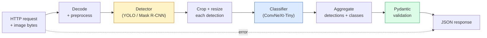

# Zbuduj kompletny pipeline wizyjny — projekt zaliczeniowy

> Produkcyjny system wizyjny to łańcuch modeli i reguł połączonych kontraktami danych. Wszystkie elementy są już dostępne w tej fazie; projekt zaliczeniowy łączy je w jeden przepływ end-to-end.

**Typ:** Build
**Języki:** Python
**Wymagania wstępne:** Faza 4, lekcje 01-15
**Czas:** ~120 minut

## Cele nauki

- Zaprojektować produkcyjny pipeline wizyjny, który wykrywa obiekty, klasyfikuje je i emituje ustrukturyzowany JSON — z obsłużoną każdą ścieżką błędu
- Połączyć detektor (Mask R-CNN lub YOLO), klasyfikator (ConvNeXt-Tiny) i kontrakt danych (Pydantic) w jedną usługę
- Zmierzyć wydajność pipeline'u end-to-end i zidentyfikować pierwszy wąski gardło (zwykle preprocessing, potem detektor)
- Wdrożyć minimalną usługę FastAPI, która przyjmuje przesłany obraz, uruchamia pipeline i zwraca detekcje z klasyfikacjami

## Problem

Pojedyncze modele wizyjne są przydatne; produkty wizyjne to ich łańcuchy. Audyt półki w sklepie to detektor plus klasyfikator produktów plus pipeline OCR do cen. Jazda autonomiczna to detektor 2D plus detektor 3D plus segmentator plus tracker plus planner. Wstępne badanie medyczne to segmentator plus klasyfikator regionów plus interfejs dla klinicysty.

Łączenie tych łańcuchów to element, który odróżnia prototyp ML od produktu. Każdy interfejs między modelami to nowe miejsce na błędy. Każda transformacja współrzędnych, każda normalizacja, każde przeskalowanie maski to kandydat na cichą awarię. Pipeline jest tak silny, jak jego najsłabszy interfejs.

Ten projekt zaliczeniowy ustawia minimalny działający pipeline: detekcja + klasyfikacja + ustrukturyzowane wyjście + warstwa serwująca. Wszystko inne w Fazie 4 wpasowuje się w ten szkielet: zamień Mask R-CNN na YOLOv8, dodaj głowicę OCR, dodaj odgałęzienie segmentacyjne, dodaj tracker. Architektura jest stabilna; elementy są wymienne.

## Koncepcja

### Pipeline



Siedem etapów. Dwa etapy modelowe są kosztowne; w pozostałych pięciu żyją błędy.

### Kontrakty danych z Pydantic

Każda granica między modelami staje się typowanym obiektem. To zamienia ciche awarie w głośne.

```
Detection(
    box: tuple[float, float, float, float],   # (x1, y1, x2, y2), absolute pixels
    score: float,                              # [0, 1]
    class_id: int,                             # from detector's label map
    mask: Optional[list[list[int]]],           # RLE-encoded if present
)

PipelineResult(
    image_id: str,
    detections: list[Detection],
    classifications: list[Classification],
    inference_ms: float,
)
```

Gdy detektor zwraca boksy w formacie `(cx, cy, w, h)` zamiast `(x1, y1, x2, y2)`, walidacja Pydantic zawodzi na granicy i dowiadujesz się o tym od razu, zamiast debugować dalszy etap przycinania, który po cichu zwraca puste regiony.

### Gdzie ucieka czas

Trzy prawdy obowiązują w prawie każdym pipelinie wizyjnym:

1. **Preprocessing jest często największym pojedynczym blokiem.** Dekodowanie JPEG-ów, konwersja przestrzeni kolorów, przeskalowanie — to operacje obciążające CPU, łatwe do przegapienia.
2. **Detektor dominuje czas GPU.** 70-90% czasu GPU przypada na przejście w przód detektora.
3. **Postprocessing (NMS, kodowanie/dekodowanie RLE) jest tani na GPU, kosztowny na CPU.** Zawsze profiluj na docelowym sprzęcie.

Znajomość tego rozkładu zamienia optymalizację w listę priorytetów.

### Tryby awarii

- **Puste detekcje** — zwróć pustą listę, nie powoduj awarii. Zaloguj.
- **Boksy wykraczające poza granice obrazu** — przyciąć do rozmiaru obrazu przed przycinaniem.
- **Zbyt małe wycinki** — pomiń klasyfikację dla boksów mniejszych niż minimalny rozmiar wejścia klasyfikatora.
- **Uszkodzony upload** — odpowiedź 400 z konkretnym kodem błędu, nie 500.
- **Błąd wczytania modelu** — niepowodzenie przy starcie usługi, nie przy pierwszym żądaniu.

Produkcyjny pipeline obsługuje każdy z tych przypadków bez pisania ogólnego `try/except`, który skrywa awarię. Każda awaria ma nazwany kod i odpowiedź.

### Batching

Produkcyjna usługa serwuje wielu klientów. Batchowanie detekcji i klasyfikacji między żądaniami zwielokrotnia przepustowość. Koszt: dodatkowe opóźnienie wynikające z czekania na zapełnienie batcha. Typowa konfiguracja: zbieraj żądania do 20 ms, połącz w batch, przetwórz, rozdziel odpowiedzi. `torchserve` i `triton` robią to natywnie; małe usługi z przewidywalnym obciążeniem implementują własny mikro-batcher.

## Zbuduj to

### Krok 1: Kontrakty danych

```python
from pydantic import BaseModel, Field
from typing import List, Optional, Tuple

class Detection(BaseModel):
    box: Tuple[float, float, float, float]
    score: float = Field(ge=0, le=1)
    class_id: int = Field(ge=0)
    mask_rle: Optional[str] = None


class Classification(BaseModel):
    detection_index: int
    class_id: int
    class_name: str
    score: float = Field(ge=0, le=1)


class PipelineResult(BaseModel):
    image_id: str
    detections: List[Detection]
    classifications: List[Classification]
    inference_ms: float
```

Pięć sekund kodu oszczędza godzinę debugowania w każdym poważnym pipelinie.

### Krok 2: Minimalna klasa Pipeline

```python
import time
import numpy as np
import torch
from PIL import Image

class VisionPipeline:
    def __init__(self, detector, classifier, class_names,
                 device="cpu", min_crop=32):
        self.detector = detector.to(device).eval()
        self.classifier = classifier.to(device).eval()
        self.class_names = class_names
        self.device = device
        self.min_crop = min_crop

    def preprocess(self, image):
        """
        image: PIL.Image or np.ndarray (H, W, 3) uint8
        returns: CHW float tensor on device
        """
        if isinstance(image, Image.Image):
            image = np.asarray(image.convert("RGB"))
        tensor = torch.from_numpy(image).permute(2, 0, 1).float() / 255.0
        return tensor.to(self.device)

    @torch.no_grad()
    def detect(self, image_tensor):
        return self.detector([image_tensor])[0]

    @torch.no_grad()
    def classify(self, crops):
        if len(crops) == 0:
            return []
        batch = torch.stack(crops).to(self.device)
        logits = self.classifier(batch)
        probs = logits.softmax(-1)
        scores, cls = probs.max(-1)
        return list(zip(cls.tolist(), scores.tolist()))

    def run(self, image, image_id="anonymous"):
        t0 = time.perf_counter()
        tensor = self.preprocess(image)
        det = self.detect(tensor)

        crops = []
        detections = []
        valid_indices = []
        for i, (box, score, cls) in enumerate(zip(det["boxes"], det["scores"], det["labels"])):
            x1, y1, x2, y2 = [max(0, int(b)) for b in box.tolist()]
            x2 = min(x2, tensor.shape[-1])
            y2 = min(y2, tensor.shape[-2])
            detections.append(Detection(
                box=(x1, y1, x2, y2),
                score=float(score),
                class_id=int(cls),
            ))
            if (x2 - x1) < self.min_crop or (y2 - y1) < self.min_crop:
                continue
            crop = tensor[:, y1:y2, x1:x2]
            crop = torch.nn.functional.interpolate(
                crop.unsqueeze(0),
                size=(224, 224),
                mode="bilinear",
                align_corners=False,
            )[0]
            crops.append(crop)
            valid_indices.append(i)

        class_preds = self.classify(crops)

        classifications = []
        for valid_idx, (cls_id, cls_score) in zip(valid_indices, class_preds):
            classifications.append(Classification(
                detection_index=valid_idx,
                class_id=int(cls_id),
                class_name=self.class_names[cls_id],
                score=float(cls_score),
            ))

        return PipelineResult(
            image_id=image_id,
            detections=detections,
            classifications=classifications,
            inference_ms=(time.perf_counter() - t0) * 1000,
        )
```

Każdy interfejs jest typowany. Każda ścieżka błędu ma konkretną decyzję obsługi.

### Krok 3: Połącz detektor i klasyfikator

```python
from torchvision.models.detection import maskrcnn_resnet50_fpn_v2
from torchvision.models import convnext_tiny

# Use ImageNet-pretrained weights for a realistic pipeline without training
detector = maskrcnn_resnet50_fpn_v2(weights="DEFAULT")
classifier = convnext_tiny(weights="DEFAULT")
class_names = [f"imagenet_class_{i}" for i in range(1000)]

pipe = VisionPipeline(detector, classifier, class_names)

# Smoke test with a synthetic image
test_image = (np.random.rand(400, 600, 3) * 255).astype(np.uint8)
result = pipe.run(test_image, image_id="demo")
print(result.model_dump_json(indent=2)[:500])
```

### Krok 4: Usługa FastAPI

```python
from fastapi import FastAPI, UploadFile, HTTPException
from io import BytesIO

app = FastAPI()
pipe = None  # initialised on startup

@app.on_event("startup")
def load():
    global pipe
    detector = maskrcnn_resnet50_fpn_v2(weights="DEFAULT").eval()
    classifier = convnext_tiny(weights="DEFAULT").eval()
    pipe = VisionPipeline(detector, classifier, class_names=[f"c{i}" for i in range(1000)])

@app.post("/detect")
async def detect_endpoint(file: UploadFile):
    if file.content_type not in {"image/jpeg", "image/png", "image/webp"}:
        raise HTTPException(status_code=400, detail="unsupported image type")
    data = await file.read()
    try:
        img = Image.open(BytesIO(data)).convert("RGB")
    except Exception:
        raise HTTPException(status_code=400, detail="cannot decode image")
    result = pipe.run(img, image_id=file.filename or "upload")
    return result.model_dump()
```

Uruchom za pomocą `uvicorn main:app --host 0.0.0.0 --port 8000`. Przetestuj za pomocą `curl -F 'file=@dog.jpg' http://localhost:8000/detect`.

### Krok 5: Zmierz wydajność pipeline'u

```python
import time

def benchmark(pipe, num_runs=20, image_size=(400, 600)):
    img = (np.random.rand(*image_size, 3) * 255).astype(np.uint8)
    pipe.run(img)  # warm up

    stages = {"preprocess": [], "detect": [], "classify": [], "total": []}
    for _ in range(num_runs):
        t0 = time.perf_counter()
        tensor = pipe.preprocess(img)
        t1 = time.perf_counter()
        det = pipe.detect(tensor)
        t2 = time.perf_counter()
        crops = []
        for box in det["boxes"]:
            x1, y1, x2, y2 = [max(0, int(b)) for b in box.tolist()]
            x2 = min(x2, tensor.shape[-1])
            y2 = min(y2, tensor.shape[-2])
            if (x2 - x1) >= pipe.min_crop and (y2 - y1) >= pipe.min_crop:
                crop = tensor[:, y1:y2, x1:x2]
                crop = torch.nn.functional.interpolate(
                    crop.unsqueeze(0), size=(224, 224), mode="bilinear", align_corners=False
                )[0]
                crops.append(crop)
        pipe.classify(crops)
        t3 = time.perf_counter()
        stages["preprocess"].append((t1 - t0) * 1000)
        stages["detect"].append((t2 - t1) * 1000)
        stages["classify"].append((t3 - t2) * 1000)
        stages["total"].append((t3 - t0) * 1000)

    for stage, times in stages.items():
        times.sort()
        print(f"{stage:12s}  p50={times[len(times)//2]:7.1f} ms  p95={times[int(len(times)*0.95)]:7.1f} ms")
```

Typowy wynik na CPU: preprocessing ~3 ms, detekcja 300-500 ms, klasyfikacja 20-40 ms, łącznie 350-550 ms. Na GPU detekcja trwa 20-40 ms, a preprocessing i klasyfikacja zaczynają mieć większe znaczenie względne.

## Zastosuj to

Produkcyjne szablony zbiegają do tej samej struktury, dodatkowo z:

- **Wersjonowaniem modeli** — zawsze loguj nazwę modelu i hash wag w odpowiedzi.
- **Identyfikatorami śledzenia per żądanie** — loguj czasy każdego etapu dla każdego żądania, aby móc skorelować wolne odpowiedzi z etapami.
- **Ścieżką zapasową** — jeśli klasyfikator przekroczy limit czasu, zwróć detekcje bez klasyfikacji, zamiast odrzucać całe żądanie.
- **Filtrami bezpieczeństwa** — filtry NSFW/PII działają po klasyfikacji, przed wysłaniem odpowiedzi z usługi.
- **Endpointem wsadowym** — `/detect_batch` przyjmujący listę adresów URL obrazów do przetwarzania wsadowego.

Do serwowania produkcyjnego `torchserve`, `Triton Inference Server` i `BentoML` obsługują batching, wersjonowanie, metryki i health checki "z pudełka". Uruchamianie `FastAPI` bezpośrednio jest w porządku dla prototypów i produktów małej skali.

## Wynik

Ta lekcja tworzy:

- `outputs/prompt-vision-service-shape-reviewer.md` — prompt, który przegląda kod usługi wizyjnej w poszukiwaniu naruszeń kontraktu/kształtu odpowiedzi i nazywa pierwszy błąd, który ją złamie.
- `outputs/skill-pipeline-budget-planner.md` — skill, który dla danej docelowej latencji i przepustowości przypisuje budżet czasowy każdemu etapowi pipeline'u i wskazuje, który etap pierwszy przekroczy swój budżet.

## Ćwiczenia

1. **(Łatwe)** Uruchom pipeline na 10 obrazach z dowolnego otwartego zbioru danych. Zaraportuj średni czas na etap oraz rozkład liczby detekcji na obraz.
2. **(Średnie)** Dodaj pole wyjściowe maski do `Detection` i zakoduj je jako RLE. Sprawdź, czy JSON pozostaje poniżej 1MB nawet dla obrazu z 10 obiektami.
3. **(Trudne)** Dodaj mikro-batcher przed klasyfikatorem: zbieraj wycinki przez maksymalnie 10 ms, sklasyfikuj je wszystkie w jednym wywołaniu GPU, zwróć wyniki dla każdego żądania. Zmierz przyrost przepustowości przy 5 równoczesnych żądaniach na sekundę oraz dodane opóźnienie.

## Kluczowe terminy

| Termin | Co się mówi | Co to faktycznie oznacza |
|------|----------------|----------------------|
| Pipeline | "System" | Uporządkowany łańcuch etapów preprocessingu, wnioskowania i postprocessingu z typowanym interfejsem między każdą parą |
| Kontrakt danych | "Schemat" | Definicje Pydantic / dataclass, którym musi odpowiadać wejście i wyjście każdego etapu; wychwytuje błędy integracji na granicy |
| Preprocessing | "Przed modelem" | Dekodowanie, konwersja kolorów, skalowanie, normalizacja; zwykle największy pożeracz czasu CPU |
| Postprocessing | "Po modelu" | NMS, przeskalowanie maski, threshold, kodowanie RLE; tanie na GPU, kosztowne na CPU |
| Microbatcher | "Zbierz, a potem przekaż dalej" | Agregator, który czeka ustalone okno czasowe na wiele żądań i wykonuje jedno przejście wsadowe w przód |
| Trace ID | "Identyfikator żądania" | Identyfikator przypisany do żądania, logowany na każdym etapie, aby wolne żądania można było śledzić od początku do końca |
| Kod błędu | "Nazwany błąd" | Konkretny kod błędu dla każdej klasy awarii zamiast ogólnego 500; umożliwia logikę ponawiania po stronie klienta |
| Health check | "Sonda gotowości" | Tani endpoint informujący, czy usługa może odpowiadać; load balancery na tym polegają |

## Dalsza lektura

- [Full Stack Deep Learning — Deploying Models](https://fullstackdeeplearning.com/course/2022/lecture-5-deployment/) — kanoniczny przegląd produkcyjnego wdrażania ML
- [BentoML docs](https://docs.bentoml.com) — framework serwujący z batchingiem, wersjonowaniem i metrykami
- [torchserve docs](https://pytorch.org/serve/) — oficjalna biblioteka serwująca PyTorch
- [NVIDIA Triton Inference Server](https://developer.nvidia.com/triton-inference-server) — wysokoprzepustowe serwowanie z batchingiem i obsługą wielu modeli
