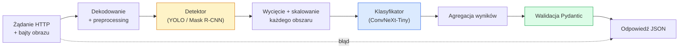

Created At: 2026-06-08T18:22:21Z
Completed At: 2026-06-08T18:22:21Z
File Path: `file:///C:/poligon/LLM_Traning/phases/04-computer-vision/16-vision-pipeline-capstone/docs/pl_pro.md`

# Projekt końcowy: Budowa kompletnego potoku wizyjnego (Vision Pipeline)

> Produkcyjny system wizyjny to łańcuch modeli oraz reguł decyzyjnych połączonych ze sobą ścisłymi kontraktami danych. Poszczególne elementy zostały omówione w poprzednich lekcjach; ten projekt końcowy łączy je w spójną, działającą od początku do końca aplikację.

**Typ:** Kompilacja  
**Języki:** Python  
**Wymagania wstępne:** Faza 4, lekcje 01-15  
**Czas:** ~120 minut  

## Cele nauczania

- Zaprojektować produkcyjny potok wizyjny, który realizuje detekcję obiektów, klasyfikuje je i zwraca ustrukturyzowany format JSON, z uwzględnieniem obsługi wyjątków i błędów.
- Połączyć detektor (Mask R-CNN lub YOLO), klasyfikator (ConvNeXt-Tiny) oraz kontrakt danych (Pydantic) w spójną usługę sieciową.
- Przeprowadzić profilowanie wydajności całego potoku i zidentyfikować główne wąskie gardło (zazwyczaj preprocessing, a następnie detektor).
- Wdrożyć usługę sieciową za pomocą FastAPI, która przyjmuje przesłany plik obrazu, uruchamia potok obliczeniowy i zwraca wyniki detekcji wraz z klasyfikacją.

## Problem

Pojedyncze modele wizyjne są pożyteczne, lecz komercyjne wdrożenia wymagają łączenia ich w łańcuchy (potoki). Przykładowo, system automatycznego audytu półek sklepowych łączy detektor obiektów, klasyfikator produktów oraz moduł OCR do odczytu cen. System pojazdu autonomicznego integruje detekcję 2D/3D, segmentację semantyczną, śledzenie obiektów (tracking) oraz planowanie ruchu. Narzędzie do diagnostyki medycznej łączy segmentację narządów, klasyfikację patologii oraz interfejs graficzny dla lekarza.

Integracja tych elementów (tzw. „okablowanie”) to etap, który odróżnia akademicki prototyp od stabilnego produktu. Każdy punkt styku między modelami jest potencjalnym źródłem błędów. Każda konwersja układów współrzędnych, normalizacja pikseli czy skalowanie masek segmentacji może wywołać ukryty błąd (silent failure). Cały potok jest tylko na tyle stabilny, na ile stabilne jest jego najsłabsze ogniwo.

Niniejszy projekt końcowy przedstawia minimalny, działający potok produkcyjny: detekcja + klasyfikacja + ustrukturyzowany format wyjściowy + serwer API. Dowolne inne komponenty omówione w fazie 4 mogą być łatwo wpięte w ten schemat (np. zastąpienie Mask R-CNN modelem YOLO, dodanie modułu OCR lub algorytmu trackera). Architektura pozostaje spójna; zmieniają się jedynie klocki.

## Koncepcja

### Potok przetwarzania (Pipeline)



Proces składa się z siedmiu kroków. Oba moduły sieciowe są kosztowne obliczeniowo; w pozostałych pięciu krokach kryje się większość błędów integracyjnych.

### Kontrakty danych za pomocą biblioteki Pydantic

All (Wszystkie) punkty styku między modelami są opisywane za pomocą silnie typowanych struktur danych. Dzięki temu ukryte błędy są natychmiast wykrywane i zgłaszane w postaci wyjątków.

```
Detection(
    box: tuple[float, float, float, float],   # (x1, y1, x2, y2), piksele bezwzględne
    score: float,                              # [0, 1]
    class_id: int,                             # z mapy klas detektora
    mask: Optional[list[list[int]]],           # zakodowane RLE, jeśli obecne
)

PipelineResult(
    image_id: str,
    detections: list[Detection],
    classifications: list[Classification],
    inference_ms: float,
)
```

Jeśli detektor zwróci współrzędne w formacie `(cx, cy, w, h)` zamiast oczekiwanego `(x1, y1, x2, y2)`, walidacja biblioteki Pydantic natychmiast zgłosi błąd na granicy modułów. Pozwala to na błyskawiczne wykrycie usterki, zamiast żmudnego debugowania kolejnych warstw potoku, które przetwarzałyby puste wycinki obrazu.

### Struktura opóźnień (Latency Profile)

Trzy kluczowe fakty dotyczące wydajności potoków wizyjnych:

1. **Preprocessing często stanowi znaczący narzut.** Dekodowanie plików JPEG, konwersja przestrzeni kolorów czy skalowanie obrazu są operacjami wykonywanymi na CPU i mogą stać się wąskim gardłem, o którym często się zapomina.
2. **Detektor dominuje czas obliczeń na GPU.** Około 70-90% czasu GPU podczas przejścia w przód (forward pass) jest pochłaniane przez model detekcyjny.
3. **Postprocessing (NMS, kodowanie/dekodowanie masek RLE) jest tani dla GPU, ale obciąża CPU.** Należy zawsze profilować te operacje na docelowym sprzęcie wdrożeniowym.

Dokładna analiza profilu wydajności pozwala na właściwe uszeregowanie priorytetów optymalizacyjnych.

### Obsługa sytuacji awaryjnych (Failure Modes)

- **Brak detekcji (Empty Detections)** – model nie wykrywa żadnych obiektów i zwraca pustą listę (nie powinno to powodować awarii serwera, wystarczy odnotować ten fakt w logach).
- **Obszar kadrowania poza granicami (Out of Bounds)** – przed wycięciem obszaru należy przyciąć współrzędne ramki (bounding box) do rzeczywistych wymiarów obrazu.
- **Zbyt małe wycinki (Micro-crops)** – pomijaj etap klasyfikacji dla obszarów o wymiarach mniejszych niż minimalne wejście klasyfikatora.
- **Uszkodzony plik wejściowy (Corrupted Upload)** – zwracaj kod błędu HTTP 400 wraz z jasnym opisem, zamiast błędu serwera 500.
- **Błąd inicjalizacji modeli (Model Load Failure)** – usługa powinna zgłosić błąd na etapie uruchamiania serwera, a nie podczas obsługi pierwszego zapytania użytkownika.

Produkcyjny potok powinien obsługiwać każdy z tych scenariuszy jawnie, zamiast stosować ogólne bloki `try/except`, które maskują przyczyny awarii. Każdy typ błędu powinien zwracać zdefiniowany kod statusu oraz jasny komunikat.

### Przetwarzanie wsadowe (Batching)

Serwer produkcyjny obsługuje wielu klientów jednocześnie. Grupowanie wycinków obrazów (crops) przed przekazaniem ich do klasyfikatora pozwala na optymalne wykorzystanie GPU i radykalne zwiększenie przepustowości (throughput). Kompromisem jest niewielki wzrost opóźnienia spowodowany oczekiwaniem na zapełnienie paczki (batch). Standardowa konfiguracja (dynamic batching) polega na zbieraniu napływających wycinków przez krótki czas (np. do 20 ms), a następnie wspólnym przetworzeniu ich na GPU. Narzędzia takie jak `TorchServe` czy `Triton` realizują ten proces natywnie; w prostszych aplikacjach można zaimplementować własny mechanizm mikropaczek (micro-batcher).

## Zbuduj to

### Krok 1: Definicja kontraktów danych (Pydantic)

```python
from pydantic import BaseModel, Field
from typing import List, Optional, Tuple

class Detection(BaseModel):
    box: Tuple[float, float, float, float]
    score: float = Field(ge=0, le=1)
    class_id: int = Field(ge=0)
    mask_rle: Optional[str] = None

class Classification(BaseModel):
    detection_index: int
    class_id: int
    class_name: str
    score: float = Field(ge=0, le=1)

class PipelineResult(BaseModel):
    image_id: str
    detections: List[Detection]
    classifications: List[Classification]
    inference_ms: float
```

Niewielki nakład pracy włożony w definicję kontraktu pozwala zaoszczędzić wiele godzin debugowania w złożonych systemach.

### Krok 2: Klasa potoku wizyjnego (Vision Pipeline)

```python
import time
import numpy as np
import torch
from PIL import Image

class VisionPipeline:
    def __init__(self, detector, classifier, class_names,
                 device="cpu", min_crop=32):
        self.detector = detector.to(device).eval()
        self.classifier = classifier.to(device).eval()
        self.class_names = class_names
        self.device = device
        self.min_crop = min_crop

    def preprocess(self, image):
        """
        image: PIL.Image lub np.ndarray (H, W, 3) uint8
        zwraca: tensor float CHW na urządzeniu docelowym
        """
        if isinstance(image, Image.Image):
            image = np.asarray(image.convert("RGB"))
        tensor = torch.from_numpy(image).permute(2, 0, 1).float() / 255.0
        return tensor.to(self.device)

    @torch.no_grad()
    def detect(self, image_tensor):
        return self.detector([image_tensor])[0]

    @torch.no_grad()
    def classify(self, crops):
        if len(crops) == 0:
            return []
        batch = torch.stack(crops).to(self.device)
        logits = self.classifier(batch)
        probs = logits.softmax(-1)
        scores, cls = probs.max(-1)
        return list(zip(cls.tolist(), scores.tolist()))

    def run(self, image, image_id="anonymous"):
        t0 = time.perf_counter()
        tensor = self.preprocess(image)
        det = self.detect(tensor)

        crops = []
        detections = []
        valid_indices = []
        for i, (box, score, cls) in enumerate(zip(det["boxes"], det["scores"], det["labels"])):
            x1, y1, x2, y2 = [max(0, int(b)) for b in box.tolist()]
            x2 = min(x2, tensor.shape[-1])
            y2 = min(y2, tensor.shape[-2])
            detections.append(Detection(
                box=(x1, y1, x2, y2),
                score=float(score),
                class_id=int(cls),
            ))
            if (x2 - x1) < self.min_crop or (y2 - y1) < self.min_crop:
                continue
            crop = tensor[:, y1:y2, x1:x2]
            crop = torch.nn.functional.interpolate(
                crop.unsqueeze(0),
                size=(224, 224),
                mode="bilinear",
                align_corners=False,
            )[0]
            crops.append(crop)
            valid_indices.append(i)

        class_preds = self.classify(crops)

        classifications = []
        for valid_idx, (cls_id, cls_score) in zip(valid_indices, class_preds):
            classifications.append(Classification(
                detection_index=valid_idx,
                class_id=int(cls_id),
                class_name=self.class_names[cls_id],
                score=float(cls_score),
            ))

        return PipelineResult(
            image_id=image_id,
            detections=detections,
            classifications=classifications,
            inference_ms=(time.perf_counter() - t0) * 1000,
        )
```

All (Wszystkie) interfejsy są silnie typowane, a każdy scenariusz awaryjny posiada jawnie zaimplementowaną ścieżkę obsługi.

### Krok 3: Integracja detektora i klasyfikatora

```python
from torchvision.models.detection import maskrcnn_resnet50_fpn_v2
from torchvision.models import convnext_tiny

# Załadowanie wag pre-trenowanych na ImageNet do testowania potoku bez uczenia
detector = maskrcnn_resnet50_fpn_v2(weights="DEFAULT")
classifier = convnext_tiny(weights="DEFAULT")
class_names = [f"imagenet_class_{i}" for i in range(1000)]

pipe = VisionPipeline(detector, classifier, class_names)

# Szybki test poprawności (smoke test) na losowym obrazie
test_image = (np.random.rand(400, 600, 3) * 255).astype(np.uint8)
result = pipe.run(test_image, image_id="demo")
print(result.model_dump_json(indent=2)[:500])
```

### Krok 4: Serwer API za pomocą FastAPI

```python
from fastapi import FastAPI, UploadFile, HTTPException
from io import BytesIO

app = FastAPI()
pipe = None  # inicjalizowany przy starcie serwera

@app.on_event("startup")
def load():
    global pipe
    detector = maskrcnn_resnet50_fpn_v2(weights="DEFAULT").eval()
    classifier = convnext_tiny(weights="DEFAULT").eval()
    pipe = VisionPipeline(detector, classifier, class_names=[f"c{i}" for i in range(1000)])

@app.post("/detect")
async def detect_endpoint(file: UploadFile):
    if file.content_type not in {"image/jpeg", "image/png", "image/webp"}:
        raise HTTPException(status_code=400, detail="nieobsługiwany format obrazu")
    data = await file.read()
    try:
        img = Image.open(BytesIO(data)).convert("RGB")
    except Exception:
        raise HTTPException(status_code=400, detail="błąd dekodowania obrazu")
    result = pipe.run(img, image_id=file.filename or "upload")
    return result.model_dump()
```

Uruchomienie serwera: `uvicorn main:app --host 0.0.0.0 --port 8000`. Testowanie za pomocą narzędzia curl: `curl -F 'file=@dog.jpg' http://localhost:8000/detect`.

### Krok 5: Profilowanie i pomiar wydajności (Benchmarking)

```python
import time

def benchmark(pipe, num_runs=20, image_size=(400, 600)):
    img = (np.random.rand(*image_size, 3) * 255).astype(np.uint8)
    pipe.run(img)  # rozgrzewka (warmup)

    stages = {"preprocess": [], "detect": [], "classify": [], "total": []}
    for _ in range(num_runs):
        t0 = time.perf_counter()
        tensor = pipe.preprocess(img)
        t1 = time.perf_counter()
        det = pipe.detect(tensor)
        t2 = time.perf_counter()
        crops = []
        for box in det["boxes"]:
            x1, y1, x2, y2 = [max(0, int(b)) for b in box.tolist()]
            x2 = min(x2, tensor.shape[-1])
            y2 = min(y2, tensor.shape[-2])
            if (x2 - x1) >= pipe.min_crop and (y2 - y1) >= pipe.min_crop:
                crop = tensor[:, y1:y2, x1:x2]
                crop = torch.nn.functional.interpolate(
                    crop.unsqueeze(0), size=(224, 224), mode="bilinear", align_corners=False
                )[0]
                crops.append(crop)
        pipe.classify(crops)
        t3 = time.perf_counter()
        stages["preprocess"].append((t1 - t0) * 1000)
        stages["detect"].append((t2 - t1) * 1000)
        stages["classify"].append((t3 - t2) * 1000)
        stages["total"].append((t3 - t0) * 1000)

    for stage, times in stages.items():
        times.sort()
        print(f"{stage:12s}  p50={times[len(times)//2]:7.1f} ms  p95={times[int(len(times)*0.95)]:7.1f} ms")
```

Przykładowe wyniki na CPU: preprocessing ~3 ms, detekcja 300-500 ms, klasyfikacja 20-40 ms (łącznie ok. 350-550 ms). Na GPU czas detekcji skraca się do 20-40 ms, przez co udział czasowy preprocessingu i klasyfikacji w ogólnym bilansie staje się znacznie większy.

## Produkcja

Zaawansowane funkcje systemów produkcyjnych:

- **Wersjonowanie modeli**: zwracaj w odpowiedzi nazwę oraz sumę kontrolną (hash) wag każdego z użytych modeli.
- **Identyfikatory korelacji (Trace IDs)**: generuj unikalny identyfikator dla każdego zapytania i loguj czas wykonania każdego etapu, co ułatwia debugowanie spowolnień.
- **Strategie rezerwowe (Fallback paths)**: w przypadku awarii klasyfikatora zwróć wyniki samej detekcji, zamiast odrzucać całe zapytanie.
- **Weryfikacja bezpieczeństwa (Safety filters)**: filtruj poufne dane (PII) lub treści NSFW przed wysłaniem odpowiedzi do klienta.
- **Interfejsy masowe (Batch endpoints)**: udostępniaj endpointy takie jak `/detect_batch` do równoległego przetwarzania wielu obrazów.

W wdrożeniach produkcyjnych o wysokiej skali serwery takie jak `TorchServe`, `Triton Inference Server` oraz `BentoML` dostarczają gotowe mechanizmy dynamicznego batchowania, wersjonowania, zbierania metryk oraz monitorowania stanu (health checks). Samodzielne FastAPI sprawdza się doskonale przy prototypowaniu oraz w systemach o mniejszym natężeniu ruchu.

## Wyślij to

Niniejsza lekcja dostarcza:

- `outputs/prompt-vision-service-shape-reviewer.md` – prompt ułatwiający weryfikację kodu API pod kątem poprawności typowania, obsługi błędów oraz zgodności ze schematem danych wyjściowych.
- `outputs/skill-pipeline-budget-planner.md` – skrypt rozdzielający budżet opóźnienia na poszczególne etapy potoku i wskazujący moduł, który jako pierwszy grozi przekroczeniem limitu czasowego.

## Ćwiczenia

1. **(Łatwe)** Uruchom potok dla 10 różnych obrazów. Zmierz i przedstaw średni czas wykonania każdego z etapów oraz rozkład liczby wykrytych obiektów na obraz.
2. **(Średnie)** Rozszerz strukturę `Detection` o maskę segmentacji zakodowaną algorytmem RLE (Run-Length Encoding). Upewnij się, że rozmiar generowanego pliku JSON nie przekracza 1 MB przy detekcji 10 obiektów na obrazie.
3. **(Trudne)** Zaimplementuj moduł dynamicznego batchowania (micro-batcher) przed klasyfikatorem: zbieraj wycinki przez maksymalnie 10 ms, prześlij je do klasyfikatora jako jedną paczkę (batch) na GPU, a następnie rozdziel wyniki. Zmierz zmianę przepustowości (throughput) oraz narzut na opóźnienie przy 5 współbieżnych zapytaniach na sekundę.

## Kluczowe terminy

| Termin | Obiegowe określenie | Co to oznacza w rzeczywistości |
|------|----------------|----------------------|
| Potok przetwarzania (Pipeline) | Łańcuch operacji | Uporządkowany sekwencyjnie zestaw etapów (preprocessing, modele, postprocessing) połączonych zdefiniowanymi interfejsami danych |
| Kontrakt danych (Data Contract) | Typowanie interfejsów | Klasy Pydantic lub dataclasses określające format danych na wejściu i wyjściu każdego z kroków; pozwala natychmiast wykryć błędy integracji |
| Preprocessing | Przygotowanie danych | Operacje dekodowania plików, zmiany formatów kolorów, skalowania i normalizacji; często najbardziej obciążające dla CPU |
| Postprocessing | Obróbka wyników | Algorytmy NMS, progowanie detekcji, rekonstrukcja masek segmentacji czy kodowanie RLE; operacje tanie dla GPU, ale powolne na CPU |
| Mikro-batcher (Dynamic Batching) | Dynamiczne grupowanie | Moduł zbierający pojedyncze zapytania przez określony czas w celu wykonania jednego, wspólnego przejścia w przód na GPU dla całej paczki |
| Identyfikator korelacji (Trace ID) | Logowanie przepływu | Unikalny identyfikator przypisywany do zapytania, logowany na każdym etapie potoku, umożliwiający lokalizację spowolnień i błędów |
| Kod błędu (Error Code) | Typowanie wyjątków | Zdefiniowane identyfikatory błędów dla konkretnych awarii (np. uszkodzony plik, zbyt mały obraz) zamiast ogólnego błędu serwera HTTP 500 |
| Sondy monitorujące (Health Checks) | Monitorowanie statusu | Dedykowane, szybkie endpointy (np. `/healthz` lub `/ready`) informujące load balancery o gotowości usługi do przetwarzania ruchu |

## Literatura uzupełniająca

- [Full Stack Deep Learning: Deployment & Serving (2022)](https://fullstackdeeplearning.com/course/2022/lecture-5-deployment/) – wiodący kurs dotyczący wdrażania i serwowania modeli głębokiego uczenia.
- [BentoML Documentation](https://docs.bentoml.com) – oficjalny przewodnik po ekosystemie BentoML.
- [TorchServe Documentation](https://pytorch.org/serve/) – oficjalna platforma do serwowania modeli w PyTorch.
- [NVIDIA Triton Inference Server](https://developer.nvidia.com/triton-inference-server) – silnik do wydajnego i wielomodelowego serwowania na GPU.
