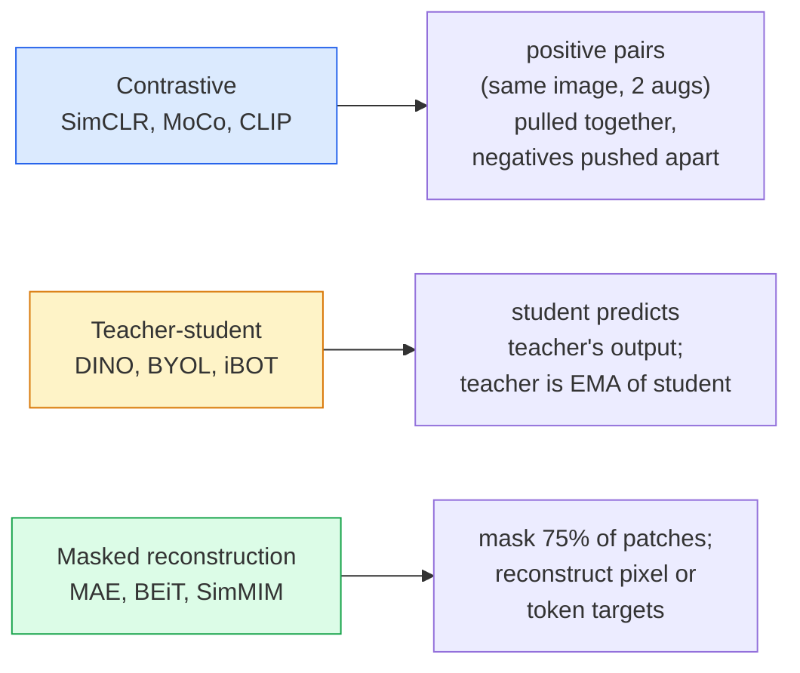

# Self-Supervised Vision — SimCLR, DINO, MAE

> Etykiety są wąskim gardłem widzenia komputerowego. Wstępne uczenie samonadzorowane je eliminuje: ucz się cech wizualnych na 100M nieoznakowanych obrazów, dostrajaj na 10k oznakowanych.

**Typ:** Nauka + Budowanie
**Języki:** Python
**Wymagania wstępne:** Faza 4 Lekcja 04 (Klasyfikacja obrazów), Faza 4 Lekcja 14 (ViT)
**Czas:** ~75 minut

## Cele nauki

- Przejść przez trzy główne rodziny metod samonadzorowanych — kontrastową (SimCLR), nauczyciel-uczeń (DINO), maskowaną rekonstrukcję (MAE) — i określić, co każda z nich optymalizuje
- Zaimplementować funkcję straty InfoNCE od podstaw i wyjaśnić, dlaczego batch o rozmiarze 512 działa, a batch o rozmiarze 32 zawodzi
- Wyjaśnić, dlaczego współczynnik maskowania 75% w MAE nie jest przypadkowy i czym różni się od 15% stosowanych przez BERT dla tekstu
- Wykorzystać checkpointy DINOv2 lub MAE wytrenowane na ImageNet do liniowego sondowania (linear probing) i wyszukiwania zero-shot

## Problem

Nadzorowany ImageNet zawiera 1,3M oznakowanych obrazów, których oznakowanie kosztowało szacunkowo 10M dolarów. Zbiory danych medycznych i przemysłowych są mniejsze i jeszcze droższe w etykietowaniu. Każdy zespół zajmujący się widzeniem komputerowym zadaje sobie pytanie: czy możemy przeprowadzić wstępne uczenie na tanich, nieoznakowanych danych — kadrach z YouTube, danych z crawlerów internetowych, nagraniach z kamer internetowych, zdjęciach satelitarnych — a następnie dostroić model na małym oznakowanym zbiorze?

Uczenie samonadzorowane jest odpowiedzią. Współczesny samonadzorowany ViT wytrenowany na LAION lub JFT osiąga lub przewyższa dokładność nadzorowanego ImageNet po dostrojeniu. Lepiej też transferuje się do zadań pochodnych (detekcja, segmentacja, głębia) niż wstępne uczenie nadzorowane. DINOv2 (Meta, 2023) i MAE (Meta, 2022) są obecnie domyślnymi rozwiązaniami produkcyjnymi dla transferowalnych cech wizualnych.

Koncepcyjna zmiana polega na tym, że zadanie pretekstowe — czyli to, do czego model jest trenowany — nie musi być zadaniem docelowym. Liczy się to, że wymusza na modelu uczenie się użytecznych cech. Przewidywanie kolorów obrazów w skali szarości, obracanie obrazów i proszenie modelu o klasyfikację obrotu, maskowanie fragmentów i ich rekonstrukcja — wszystko to działało. Trzy podejścia, które się skalują, to uczenie kontrastowe, dystylacja nauczyciel-uczeń i maskowana rekonstrukcja.

## Koncepcja

### Trzy rodziny



### Uczenie kontrastowe (SimCLR)

Weź jeden obraz, zastosuj dwie losowe augmentacje, otrzymując dwa widoki. Przepuść oba przez ten sam enkoder oraz głowicę projekcyjną. Minimalizuj funkcję straty, która mówi "te dwa embeddingi powinny być bliskie sobie" oraz "ten embedding powinien być daleko od embeddingów wszystkich innych obrazów w batchu."

```
Loss for positive pair (z_i, z_j) among 2N views per batch:

   L_ij = -log( exp(sim(z_i, z_j) / tau) / sum_k in batch \ {i} exp(sim(z_i, z_k) / tau) )

sim = cosine similarity
tau = temperature (0.1 standard)
```

To jest funkcja straty InfoNCE. Wymaga wielu negatywów na jeden pozytyw, więc rozmiar batcha ma znaczenie — SimCLR potrzebuje 512-8192. MoCo wprowadziło kolejkę momentum z poprzednich batchy, aby oddzielić liczbę negatywów od rozmiaru batcha.

### Nauczyciel-uczeń (DINO)

Dwie sieci o tej samej architekturze: uczeń i nauczyciel. Nauczyciel jest wykładniczą średnią ruchomą (EMA) wag ucznia. Obie sieci widzą zaugmentowane widoki obrazu. Wyjście ucznia jest trenowane tak, aby odpowiadało wyjściu nauczyciela — bez jawnych negatywów.

```
loss = CE( student_output(view_1),  teacher_output(view_2) )
     + CE( student_output(view_2),  teacher_output(view_1) )

teacher_weights = m * teacher_weights + (1 - m) * student_weights   (m ≈ 0.996)
```

Dlaczego nie dochodzi do kolapsu do "przewiduj stałą wartość": wyjście nauczyciela jest centrowane (odejmowana jest średnia po wymiarach) i wyostrzane (dzielone przez małą temperaturę). Centrowanie zapobiega zdominowaniu przez jeden wymiar; wyostrzanie zapobiega kolapsowi wyjścia do rozkładu jednorodnego.

DINO jest podejściem, które DINOv2 skaluje do 142M wyselekcjonowanych obrazów. Otrzymane cechy są obecnie SOTA dla zero-shot wyszukiwania wizualnego i gęstej predykcji.

### Maskowana rekonstrukcja (MAE)

Zamaskuj 75% fragmentów (patchy) wejścia ViT. Przepuść przez enkoder tylko widoczne 25%. Mały dekoder otrzymuje wyjście enkodera plus tokeny maskujące w zamaskowanych pozycjach i jest trenowany do rekonstrukcji pikseli zamaskowanych fragmentów.

```
Encoder:  visible 25% of patches -> features
Decoder:  features + mask tokens at masked positions -> reconstructed pixels
Loss:     MSE between reconstructed and original pixels on masked patches only
```

Kluczowe decyzje projektowe, które sprawiają, że MAE działa:

- **Współczynnik maskowania 75%** — wysoki. Wymusza na enkoderze uczenie się cech semantycznych; rekonstrukcja 25% byłaby prawie trywialna (sąsiadujące piksele są tak silnie skorelowane, że CNN poradziłby sobie z tym bez problemu).
- **Asymetryczny enkoder/dekoder** — duży enkoder ViT widzi tylko widoczne fragmenty; mały dekoder (8 warstw, wymiar 512) zajmuje się rekonstrukcją. 3 razy szybsze wstępne uczenie niż naiwny BEiT.
- **Cel rekonstrukcji w przestrzeni pikseli** — prostszy niż tokenizowany cel BEiT i działa lepiej na ViT.

Po wstępnym uczeniu dekoder jest odrzucany. Enkoder jest ekstraktorem cech.

### Dlaczego 75%, a nie 15%

BERT maskuje 15% tokenów. MAE maskuje 75%. Różnica wynika z gęstości informacji.

- Język naturalny ma wysoką entropię na token. Przewidywanie 15% tokenów jest wciąż trudne, ponieważ każda zamaskowana pozycja ma wiele możliwych dopełnień.
- Fragmenty obrazów mają niską entropię — niezamaskowane sąsiedztwo często determinuje piksele zamaskowanego fragmentu z dużą precyzją. Aby przewidywanie wymagało zrozumienia semantycznego, trzeba maskować agresywnie.

75% jest wystarczająco wysokie, aby prosta ekstrapolacja przestrzenna nie mogła rozwiązać zadania; enkoder musi reprezentować treść obrazu.

### Ewaluacja przez liniowy sondaż (linear probe)

Po wstępnym uczeniu samonadzorowanym standardową ewaluacją jest **liniowy sondaż (linear probe)**: zamroź enkoder, wytrenuj jeden liniowy klasyfikator na jego wyjściu na etykietach ImageNet. Raportowana jest dokładność top-1.

- SimCLR ResNet-50: ~71% (2020)
- DINO ViT-S/16: ~77% (2021)
- MAE ViT-L/16: ~76% (2022)
- DINOv2 ViT-g/14: ~86% (2023)

Liniowy sondaż jest czystą miarą jakości cech; dostrajanie (fine-tuning) zwykle dodaje 2-5 punktów, ale miesza się w nim również efekt ponownego trenowania głowicy.

## Zbuduj to

### Krok 1: Pipeline augmentacji dwuwidokowej

```python
import torch
import torchvision.transforms as T

two_view_train = lambda: T.Compose([
    T.RandomResizedCrop(96, scale=(0.2, 1.0)),
    T.RandomHorizontalFlip(),
    T.ColorJitter(0.4, 0.4, 0.4, 0.1),
    T.RandomGrayscale(p=0.2),
    T.ToTensor(),
])


class TwoViewDataset(torch.utils.data.Dataset):
    def __init__(self, base):
        self.base = base
        self.aug = two_view_train()

    def __len__(self):
        return len(self.base)

    def __getitem__(self, i):
        img, _ = self.base[i]
        v1 = self.aug(img)
        v2 = self.aug(img)
        return v1, v2
```

Każde wywołanie __getitem__ zwraca dwa zaugmentowane widoki tego samego obrazu; etykiety nie są potrzebne.

### Krok 2: Funkcja straty InfoNCE

```python
import torch.nn.functional as F

def info_nce(z1, z2, tau=0.1):
    """
    z1, z2: (N, D) L2-normalised embeddings of paired views
    """
    N, D = z1.shape
    z = torch.cat([z1, z2], dim=0)  # (2N, D)
    sim = z @ z.T / tau              # (2N, 2N)

    mask = torch.eye(2 * N, dtype=torch.bool, device=z.device)
    sim = sim.masked_fill(mask, float("-inf"))

    targets = torch.cat([torch.arange(N, 2 * N), torch.arange(0, N)]).to(z.device)
    return F.cross_entropy(sim, targets)
```

Znormalizuj embeddingi za pomocą L2 przed wywołaniem. `tau=0.1` to domyślna wartość w SimCLR; niższa wartość wyostrza funkcję straty i wymaga większej liczby negatywów.

### Krok 3: Test poprawności InfoNCE

```python
z1 = F.normalize(torch.randn(16, 32), dim=-1)
z2 = z1.clone()
loss_same = info_nce(z1, z2, tau=0.1).item()
z2_random = F.normalize(torch.randn(16, 32), dim=-1)
loss_random = info_nce(z1, z2_random, tau=0.1).item()
print(f"InfoNCE with identical pairs:  {loss_same:.3f}")
print(f"InfoNCE with random pairs:     {loss_random:.3f}")
```

Identyczne pary powinny dawać niską stratę (bliską 0 dla dużego batcha i niskiej temperatury). Losowe pary powinny dawać log(2N-1) = ~log(31) = ~3.4 dla batcha o rozmiarze 16 par.

### Krok 4: Maskowanie w stylu MAE

```python
def random_mask_indices(num_patches, mask_ratio=0.75, seed=0):
    g = torch.Generator().manual_seed(seed)
    n_keep = int(num_patches * (1 - mask_ratio))
    perm = torch.randperm(num_patches, generator=g)
    visible = perm[:n_keep]
    masked = perm[n_keep:]
    return visible.sort().values, masked.sort().values


num_patches = 196
visible, masked = random_mask_indices(num_patches, mask_ratio=0.75)
print(f"visible: {len(visible)} / {num_patches}")
print(f"masked:  {len(masked)} / {num_patches}")
```

Proste, szybkie i deterministyczne dla danego seeda. Rzeczywiste implementacje MAE wykonują to wsadowo i przechowują maski dla każdej próbki.

## Wykorzystaj to

DINOv2 jest standardem produkcyjnym w 2026 roku:

```python
import torch
from transformers import AutoImageProcessor, AutoModel

processor = AutoImageProcessor.from_pretrained("facebook/dinov2-base")
model = AutoModel.from_pretrained("facebook/dinov2-base")
model.eval()

# Per-image embeddings for zero-shot retrieval
with torch.no_grad():
    inputs = processor(images=[pil_image], return_tensors="pt")
    outputs = model(**inputs)
    embedding = outputs.last_hidden_state[:, 0]  # CLS token
```

Wynikowy 768-wymiarowy embedding jest fundamentem nowoczesnych pipeline'ów wyszukiwania obrazów, gęstego dopasowywania (dense correspondence) i transferu zero-shot. Dostrojenie do zadania docelowego rzadko wymaga więcej niż liniowej głowicy.

W przypadku embeddingów obraz-tekst odpowiednikiem jest SigLIP lub OpenCLIP; do dostrajania w stylu MAE repozytorium `timm` udostępnia każdy checkpoint MAE.

## Wdroż to

Ta lekcja tworzy:

- `outputs/prompt-ssl-pretraining-picker.md` — prompt, który wybiera SimCLR / MAE / DINOv2 na podstawie rozmiaru zbioru danych, dostępnej mocy obliczeniowej i zadania docelowego.
- `outputs/skill-linear-probe-runner.md` — skill, który pisze ewaluację liniowego sondażu dla każdego zamrożonego enkodera + oznakowanego zbioru danych.

## Ćwiczenia

1. **(Łatwe)** Zweryfikuj, że strata InfoNCE spada, gdy zmniejszasz temperaturę dla dobrze wyrównanych embeddingów, a rośnie, gdy zmniejszasz temperaturę dla losowych embeddingów. Wygeneruj wykres `tau in [0.05, 0.1, 0.2, 0.5]` vs strata.
2. **(Średnie)** Zaimplementuj bufor centrujący w stylu DINO. Pokaż, że bez centrowania uczeń kolapsuje do stałego wektora w ciągu kilku epok.
3. **(Trudne)** Wytrenuj MAE na CIFAR-100, używając TinyUNet z Lekcji 10 jako backbone'u. Zaraportuj dokładność liniowego sondażu po 10, 50 i 200 epokach. Pokaż, że liniowy sondaż na enkoderze wstępnie wytrenowanym za pomocą MAE przewyższa liniowy sondaż wytrenowany od zera w sposób nadzorowany na tym samym podzbiorze 1000 obrazów.

## Kluczowe terminy

| Termin | Co się mówi | Co to faktycznie znaczy |
|------|----------------|----------------------|
| Self-supervised | "Bez etykiet" | Zadanie pretekstowe, które generuje użyteczne reprezentacje z nieoznakowanych danych |
| Pretext task | "Fałszywe zadanie" | Cel używany podczas SSL (rekonstrukcja fragmentów, dopasowywanie widoków); odrzucany po wstępnym uczeniu |
| Linear probe | "Zamrożony enkoder + liniowa głowica" | Standardowa ewaluacja SSL: trenuj tylko liniowy klasyfikator na zamrożonych cechach |
| InfoNCE | "Strata kontrastowa" | softmax po podobieństwach kosinusowych; pozytywna para jest klasą docelową, wszystkie inne są negatywami |
| EMA teacher | "Nauczyciel ze średnią ruchomą" | Nauczyciel, którego wagi są wykładniczą średnią ruchomą wag ucznia; używany przez BYOL, MoCo, DINO |
| Mask ratio | "% zamaskowanych fragmentów" | Część fragmentów zamaskowana podczas MAE; 75% dla obrazów, 15% dla tekstu |
| Representation collapse | "Stałe wyjście" | Awaria SSL, w której enkoder generuje stały wektor dla wszystkich wejść; zapobiega się temu centrowaniem, wyostrzaniem lub negatywami |
| DINOv2 | "Produkcyjny backbone SSL" | Samonadzorowany ViT od Meta z 2023 roku; najsilniejsze ogólnego przeznaczenia cechy obrazów w 2026 roku |

## Dalsza lektura

- [SimCLR (Chen et al., 2020)](https://arxiv.org/abs/2002.05709) — referencja uczenia kontrastowego
- [DINO (Caron et al., 2021)](https://arxiv.org/abs/2104.14294) — nauczyciel-uczeń z momentum, centrowaniem i wyostrzaniem
- [MAE (He et al., 2022)](https://arxiv.org/abs/2111.06377) — wstępne uczenie maskowanego autoenkodera dla ViT
- [DINOv2 (Oquab et al., 2023)](https://arxiv.org/abs/2304.07193) — skalowanie samonadzorowanego ViT do cech produkcyjnych
