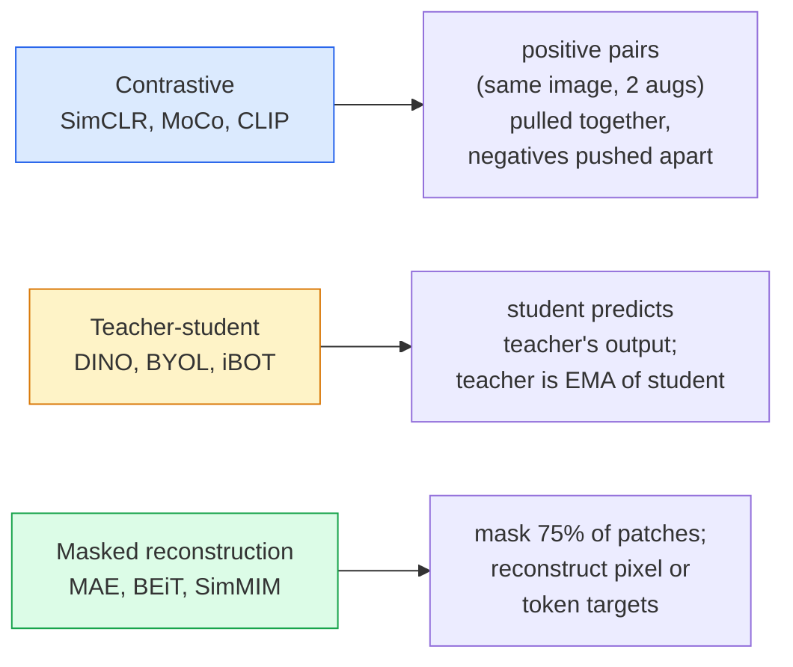

# Wizja samonadzorowana — SimCLR, DINO, MAE

> Etykiety stanowią wąskie gardło w nadzorowanej wizji. Samonadzorowane szkolenie wstępne usuwa je: naucz się cech wizualnych na 100 milionach nieoznakowanych obrazów i dopracuj 10 tys. oznaczonych obrazów.

**Typ:** Ucz się + Buduj
**Języki:** Python
**Wymagania wstępne:** Faza 4 Lekcja 04 (Klasyfikacja obrazu), Faza 4 Lekcja 14 (ViT)
**Czas:** ~75 minut

## Cele nauczania

- Prześledź trzy główne rodziny samonadzorowane — kontrastową (SimCLR), nauczyciel-uczeń (DINO), rekonstrukcję maskowaną (MAE) — i określ, co optymalizuje każda z nich
- Zaimplementuj od zera stratę InfoNCE i wyjaśnij, dlaczego partia 512 działa, ale partia 32 nie działa
- Wyjaśnij, dlaczego współczynnik maskowania wynoszący 75% MAE nie jest arbitralny i czym różni się od współczynnika maskowania wynoszącego 15% BERT w przypadku tekstu
- Użyj punktów kontrolnych DINOv2 lub MAE ImageNet do sondowania liniowego i pobierania zerowego

## Problem

W sieci Supervised ImageNet znajduje się 1,3 miliona oznaczonych obrazów, których koszt opisywania szacuje się na 10 milionów dolarów. Zbiory danych medycznych i przemysłowych są mniejsze, a ich etykietowanie jest jeszcze droższe. Każdy zespół wizyjny zadaje sobie pytanie: czy możemy przeprowadzić wstępne szkolenie na tanich, nieoznakowanych danych — klatkach z YouTube, indeksowaniach sieci, nagraniach z kamer internetowych, przeglądach satelitarnych — a następnie dopracować je na małym, oznakowanym zestawie?

Odpowiedzią jest nauka samonadzorowana. Nowoczesny, samonadzorowany ViT przeszkolony w LAION lub JFT osiąga lub przewyższa nadzorowaną dokładność ImageNet po dokładnym dostrojeniu. Lepiej przenosi się również do dalszych zadań (wykrywanie, segmentacja, głębokość) niż nadzorowane szkolenie wstępne. DINOv2 (Meta, 2023) i MAE (Meta, 2022) to aktualne ustawienia domyślne produkcyjne dla przenośnych funkcji wizyjnych.

Zmiana koncepcyjna polega na tym, że zadanie pretekstowe – czyli to, do czego model jest szkolony – nie musi być zadaniem dalszym. Ważne jest to, że zmusza model do nauczenia się przydatnych funkcji. Przewiduj kolor obrazów w skali szarości, obracaj obrazy i poproś modela o sklasyfikowanie obrotu, zamaskowanie fragmentów i ich rekonstrukcję — wszystko się sprawdziło. Trzy podejścia tej skali to uczenie się kontrastowe, destylacja nauczyciel-uczeń i rekonstrukcja zamaskowana.

## Koncepcja

### Trzy rodziny



### Kontrastywna nauka (SimCLR)

Zrób jedno zdjęcie, zastosuj dwa losowe ulepszenia, uzyskaj dwa widoki. Obydwa sygnały przesyłaj przez ten sam enkoder i głowicę projekcyjną. Zminimalizuj stratę, która mówi „te dwa osadzenia powinny być blisko siebie” i „to osadzenie powinno być daleko od osadzania pozostałych obrazów w partii”.

```
Loss for positive pair (z_i, z_j) among 2N views per batch:

   L_ij = -log( exp(sim(z_i, z_j) / tau) / sum_k in batch \ {i} exp(sim(z_i, z_k) / tau) )

sim = cosine similarity
tau = temperature (0.1 standard)
```

To strata InfoNCE. Wymaga wielu negatywów na jeden pozytyw, więc wielkość partii ma znaczenie — SimCLR potrzebuje 512-8192. MoCo wprowadziło kolejkę dynamiki poprzednich partii, aby oddzielić ujemną liczbę od wielkości partii.

### Nauczyciel-uczeń (DINO)

Dwie sieci o tej samej architekturze: uczeń i nauczyciel. Nauczyciel jest wykładniczą średnią ruchomą (EMA) wag uczniów. Obydwa widzą powiększony widok obrazu. Efekty pracy ucznia są dostosowywane do wyników nauczyciela — nie ma żadnych wyraźnych negatywów.

```
loss = CE( student_output(view_1),  teacher_output(view_2) )
     + CE( student_output(view_2),  teacher_output(view_1) )

teacher_weights = m * teacher_weights + (1 - m) * student_weights   (m ≈ 0.996)
```

Dlaczego nie zapada się, aby „przewidzieć stałą”: wyniki pracy nauczyciela są wyśrodkowane (odejmij średnią z wymiaru) i wyostrzone (podzielone przez małą temperaturę). Centrowanie zapobiega dominacji jednego wymiaru; wyostrzanie zapobiega zapadnięciu się wydruku do jednolitego kształtu.

DINO jest tym, co można skalować w DINOv2 na 142 milionach wyselekcjonowanych obrazów. Powstałe funkcje to bieżąca SOTA do wyszukiwania wizualnego z zerowym efektem i gęstego przewidywania.

### Rekonstrukcja zamaskowana (MAE)

Maskuj 75% poprawek sygnału wejściowego ViT. Przepuszczaj przez koder tylko widoczne 25%. Mały dekoder odbiera sygnał wyjściowy kodera oraz żetony maski w zamaskowanych pozycjach i jest szkolony w zakresie rekonstrukcji pikseli zamaskowanych obszarów.

```
Encoder:  visible 25% of patches -> features
Decoder:  features + mask tokens at masked positions -> reconstructed pixels
Loss:     MSE between reconstructed and original pixels on masked patches only
```

Kluczowe wybory projektowe, które sprawiają, że MAE działa:

- **Stosunek maski 75%** — wysoki. Zmusza koder do uczenia się cech semantycznych; rekonstrukcja 25% byłaby niemal trywialna (sąsiadujące piksele są tak skorelowane, że CNN mogłaby to zrobić).
- **Asymetryczny koder/dekoder** — duży koder ViT widzi tylko widoczne plamy; mały dekoder (8-warstwowy, 512-dim) obsługuje rekonstrukcję. 3x szybsze przygotowanie do treningu niż naiwny BEiT.
- **Cel rekonstrukcji przestrzeni pikseli** — prostszy niż stokenizowany cel BEiT i działa lepiej na ViT.

Po wstępnym szkoleniu wyrzuć dekoder. Koder to ekstraktor cech.

### Dlaczego 75%, a nie 15%

BERT maskuje 15% tokenów. MAE maskuje 75%. Różnica polega na gęstości informacji.

- Język naturalny ma wysoką entropię na token. Przewidywanie 15% tokenów jest nadal trudne, ponieważ każda zamaskowana pozycja ma wiele prawdopodobnych uzupełnień.
- Plamy obrazu mają niską entropię — niezamaskowane sąsiedztwo często określa niemal dokładnie piksele zamaskowanej plamy. Aby przewidywanie wymagało zrozumienia semantycznego, musisz agresywnie się maskować.

75% to na tyle dużo, że prosta ekstrapolacja przestrzenna nie jest w stanie rozwiązać zadania; koder musi reprezentować zawartość obrazu.

### Ocena sondy liniowej

Po samonadzorowanym szkoleniu wstępnym standardowa ocena to **sonda liniowa**: zamroź koder, wytrenuj pojedynczy klasyfikator liniowy na etykietach ImageNet. Raportuje najwyższą dokładność.

- SimCLR ResNet-50: ~71% (2020)
- DINO ViT-S/16: ~77% (2021)
- MAE ViT-L/16: ~76% (2022)
- DINOv2 ViT-g/14: ~86% (2023)

Sonda liniowa jest czystą miarą jakości cechy; dostrajanie zazwyczaj dodaje 2-5 punktów, ale także miesza efekt przekwalifikowania głowy.

## Zbuduj to

### Krok 1: Potok powiększania w dwóch widokach

```python
import torch
import torchvision.transforms as T

two_view_train = lambda: T.Compose([
    T.RandomResizedCrop(96, scale=(0.2, 1.0)),
    T.RandomHorizontalFlip(),
    T.ColorJitter(0.4, 0.4, 0.4, 0.1),
    T.RandomGrayscale(p=0.2),
    T.ToTensor(),
])

class TwoViewDataset(torch.utils.data.Dataset):
    def __init__(self, base):
        self.base = base
        self.aug = two_view_train()

    def __len__(self):
        return len(self.base)

    def __getitem__(self, i):
        img, _ = self.base[i]
        v1 = self.aug(img)
        v2 = self.aug(img)
        return v1, v2
```

Każdy __getitem__ zwraca dwa rozszerzone widoki tego samego obrazu; etykiety nie są potrzebne.

### Krok 2: Utrata InfoNCE

```python
import torch.nn.functional as F

def info_nce(z1, z2, tau=0.1):
    """
    z1, z2: (N, D) L2-normalised embeddings of paired views
    """
    N, D = z1.shape
    z = torch.cat([z1, z2], dim=0)  # (2N, D)
    sim = z @ z.T / tau              # (2N, 2N)

    mask = torch.eye(2 * N, dtype=torch.bool, device=z.device)
    sim = sim.masked_fill(mask, float("-inf"))

    targets = torch.cat([torch.arange(N, 2 * N), torch.arange(0, N)]).to(z.device)
    return F.cross_entropy(sim, targets)
```

L2 — normalizuj osadzanie przed wywołaniem. `tau=0.1` jest wartością domyślną SimCLR; niższa powoduje, że strata jest ostrzejsza i wymaga większej liczby negatywów.

### Krok 3: Kontrola poprawności InfoNCE

```python
z1 = F.normalize(torch.randn(16, 32), dim=-1)
z2 = z1.clone()
loss_same = info_nce(z1, z2, tau=0.1).item()
z2_random = F.normalize(torch.randn(16, 32), dim=-1)
loss_random = info_nce(z1, z2_random, tau=0.1).item()
print(f"InfoNCE with identical pairs:  {loss_same:.3f}")
print(f"InfoNCE with random pairs:     {loss_random:.3f}")
```

Identyczne pary powinny dawać niskie straty (bliskie 0 dla dużej partii i niskiej temperatury). Losowe pary powinny dać log(2N-1) = ~log(31) = ~3,4 w przypadku partii 16 par.

### Krok 4: Maskowanie w stylu MAE

```python
def random_mask_indices(num_patches, mask_ratio=0.75, seed=0):
    g = torch.Generator().manual_seed(seed)
    n_keep = int(num_patches * (1 - mask_ratio))
    perm = torch.randperm(num_patches, generator=g)
    visible = perm[:n_keep]
    masked = perm[n_keep:]
    return visible.sort().values, masked.sort().values

num_patches = 196
visible, masked = random_mask_indices(num_patches, mask_ratio=0.75)
print(f"visible: {len(visible)} / {num_patches}")
print(f"masked:  {len(masked)} / {num_patches}")
```

Proste, szybkie i deterministyczne dla danego materiału siewnego. Prawdziwe implementacje MAE grupują to i zachowują maski dla poszczególnych próbek.

## Użyj tego

DINOv2 to standard produkcyjny w 2026 roku:

```python
import torch
from transformers import AutoImageProcessor, AutoModel

processor = AutoImageProcessor.from_pretrained("facebook/dinov2-base")
model = AutoModel.from_pretrained("facebook/dinov2-base")
model.eval()

# Per-image embeddings for zero-shot retrieval
with torch.no_grad():
    inputs = processor(images=[pil_image], return_tensors="pt")
    outputs = model(**inputs)
    embedding = outputs.last_hidden_state[:, 0]  # CLS token
```

Powstałe w ten sposób osadzanie w rozdzielczości 768 przyćmień stanowi podstawę współczesnego wyszukiwania obrazów, gęstej korespondencji i potoków przesyłu zerowego strzału. Dostrajanie dalszych zadań rzadko wymaga czegoś więcej niż głowicy liniowej.

W przypadku osadzania obrazu i tekstu odpowiednikiem jest SigLIP lub OpenCLIP; w celu dostrojenia w stylu MAE repozytorium `timm` dostarcza każdy punkt kontrolny MAE.

## Wyślij to

Ta lekcja daje:

- `outputs/prompt-ssl-pretraining-picker.md` — zachęta, która wybiera SimCLR / MAE / DINOv2, biorąc pod uwagę rozmiar zbioru danych, obliczenia i dalsze zadanie.
- `outputs/skill-linear-probe-runner.md` — umiejętność zapisywania oceny sondy liniowej dla dowolnego zamrożonego kodera + oznaczonego zbioru danych.

## Ćwiczenia

1. **(Łatwe)** Sprawdź, czy strata InfoNCE spada, gdy obniżasz temperaturę w przypadku dobrze wyrównanych osadzania i rośnie, gdy obniżasz temperaturę w przypadku przypadkowych osadów. Utwórz wykres `tau in [0.05, 0.1, 0.2, 0.5]` w funkcji straty.
2. **(Średni)** Zastosuj bufor środkowy w stylu DINO. Pokaż, że bez centrowania student w ciągu kilku epok zapada się do wektora stałego.
3. **(Trudny)** Trenuj MAE na CIFAR-100, używając TinyUNet z Lekcji 10 jako szkieletu. Podaj dokładność sondy liniowej w 10, 50 i 200 epokach. Pokaż, że wstępnie wyszkolona sonda liniowa MAE pokonuje nadzorowaną od podstaw sondę liniową w tym samym podzbiorze 1000 obrazów.

## Kluczowe terminy

| Termin | Co ludzie mówią | Co to właściwie oznacza |
|------|----------------|----------------------|
| Samonadzorowany | „Bez etykiet” | Zadanie pretekstowe, które tworzy przydatne reprezentacje z nieoznakowanych danych |
| Zadanie pretekstowe | „Fałszywe zadanie” | Cel używany podczas SSL (rekonstrukcja poprawek, dopasowywanie widoków); odrzucony po treningu wstępnym |
| Sonda liniowa | „Zamrożony enkoder + głowica liniowa” | Standardowa ocena SSL: trenuj tylko klasyfikator liniowy na podstawie zamrożonych funkcji |
| InformacjeNCE | „Strata kontrastowa” | softmax na podobieństwach cosinus; klasa docelowa jest parą dodatnią, wszystkie pozostałe są klasą ujemną |
| Nauczyciel EMA | „Nauczyciel średniej ruchomej” | Nauczyciel, którego wagi są wykładniczą średnią ruchomą ucznia; używany przez BYOL, MoCo, DINO |
| Stosunek maski | „% ukrytych poprawek” | Część plam zamaskowanych podczas MAE; 75% na obraz, 15% na tekst |
| Upadek reprezentacji | „Stała moc wyjściowa” | Awaria SSL, gdy koder wysyła stały wektor dla wszystkich wejść; zapobiegane przez centrowanie, wyostrzanie lub negatywy |
| DINOv2 | „Produkcyjny szkielet SSL” | Samonadzorowany ViT Meta 2023; najsilniejsze cechy obrazu ogólnego przeznaczenia w 2026 r. |

## Dalsze czytanie

- [SimCLR (Chen et al., 2020)](https://arxiv.org/abs/2002.05709) — odniesienie do uczenia się kontrastowego
- [DINO (Caron et al., 2021)](https://arxiv.org/abs/2104.14294) — nauczyciel-uczeń z pędem, centrowaniem, wyostrzaniem
- [MAE (He et al., 2022)](https://arxiv.org/abs/2111.06377) — wstępne szkolenie zamaskowanego autoenkodera dla ViT
- [DINOv2 (Oquab et al., 2023)](https://arxiv.org/abs/2304.07193) — skalowanie samonadzorowanego ViT do funkcji produkcyjnych