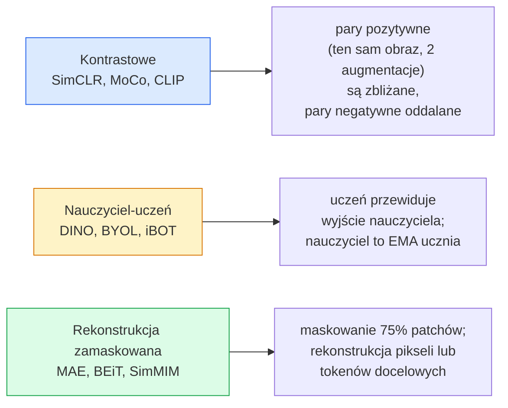

# Uczenie samonadzorowane w wizji komputerowej — SimCLR, DINO, MAE

> Ręczne etykietowanie danych stanowi największe wąskie gardło w klasycznym uczeniu nadzorowanym. Uczenie samonadzorowane (self-supervised pre-training) rozwiązuje ten problem: pozwala modelowi nauczyć się uniwersalnych cech wizualnych na 100 milionach nieoznaczonych obrazów, a następnie dostroić go na zaledwie 10 tysiącach oznakowanych próbek.

**Typ:** Ucz się + Buduj
**Języki:** Python
**Wymagania wstępne:** Faza 4 Lekcja 04 (Klasyfikacja obrazu), Faza 4 Lekcja 14 (Vision Transformer - ViT)
**Czas:** ~75 minut

## Cele nauki

- Poznaj trzy główne rodziny metod samonadzorowanych: kontrastowe (SimCLR), typu nauczyciel-uczeń (DINO) oraz oparte na rekonstrukcji zamaskowanej (MAE), a także zrozum, co optymalizuje każda z nich.
- Zaimplementuj od zera funkcję straty InfoNCE i wyjaśnij, dlaczego duży rozmiar wsadu (batch size) równy 512 działa dobrze, podczas gdy mały wsad o rozmiarze 32 zawodzi.
- Wyjaśnij, dlaczego współczynnik maskowania (masking ratio) na poziomie 75% w MAE nie jest przypadkowy i czym różni się od 15-procentowego maskowania w modelu BERT dla tekstu.
- Wykorzystaj wagi (checkpoints) modeli DINOv2 lub MAE wytrenowanych na ImageNet do ewaluacji metodą sondy liniowej (linear probing) oraz wyszukiwania bezprzykładowego (zero-shot retrieval).

## Wprowadzenie

Klasyczny zbiór ImageNet w wersji dla uczenia nadzorowanego zawiera 1,3 miliona ręcznie oznakowanych obrazów, a koszt ich anotacji szacuje się na 10 milionów dolarów. Zbiory danych medycznych i przemysłowych są znacznie mniejsze, a koszt ich etykietowania przez ekspertów jest jeszcze wyższy. Każdy zespół pracujący nad systemami wizyjnymi zadaje sobie pytanie: czy możemy przeprowadzić uczenie wstępne na tanich, nieoznaczonych danych — klatkach z filmów na YouTube, danych pobranych z sieci (web crawls), nagraniach z kamer internetowych czy zdjęciach satelitarnych — a następnie dostroić model na niewielkim, oznakowanym zbiorze?

Odpowiedzią jest uczenie samonadzorowane (self-supervised learning - SSL). Nowoczesny, samonadzorowany model ViT przeszkolony na zbiorach LAION lub JFT osiąga po dostrojeniu (fine-tuning) dokładność równą lub wyższą niż klasyczne uczenie nadzorowane na ImageNet. Przenosi się on również lepiej na zadania docelowe (detekcja obiektów, segmentacja, estymacja głębi) niż model po uczeniu nadzorowanym. DINOv2 (Meta, 2023) oraz MAE (Meta, 2022) to obecnie standardy produkcyjne w zakresie uniwersalnych ekstraktorów cech wizualnych.

Kluczowa zmiana koncepcyjna polega na tym, że zadanie pomocnicze (pretext task) — czyli cel, na którym trenujemy model — nie musi pokrywać się z docelowym zadaniem (downstream task). Ważne jest jedynie to, by zmuszało ono model do reprezentowania przydatnych cech obrazu. Kolorowanie obrazów czarno-białych, przewidywanie kąta obrotu obrazu czy rekonstrukcja zamaskowanych fragmentów — wszystkie te techniki okazały się skuteczne. Trzy najważniejsze rodziny metod o dużej skali to: uczenie kontrastowe (contrastive learning), destylacja typu nauczyciel-uczeń oraz rekonstrukcja zamaskowana (masked image modeling).

## Koncepcje teoretyczne

### Trzy rodziny metod



### Uczenie kontrastowe (SimCLR)

Pobierz obraz wejściowy, zastosuj dwie różne, losowe augmentacje i uzyskaj dwa widoki (views). Przepuść oba widoki przez ten sam enkoder i głowicę projekcyjną (projection head). Zminimalizuj funkcję straty, która dąży do zbliżenia wektorów cech (embeddings) tej samej pary, a zarazem oddala je od wektorów cech wszystkich innych obrazów w danym wsadzie (batch).

```
Funkcja straty dla pary pozytywnej (z_i, z_j) spośród 2N widoków we wsadzie:

   L_ij = -log( exp(sim(z_i, z_j) / tau) / sum_k in batch \ {i} exp(sim(z_i, z_k) / tau) )

sim = podobieństwo cosinusowe
tau = temperatura (domyślnie 0.1)
```

Jest to strata InfoNCE. Wymaga ona wielu przykładów negatywnych dla każdej pary pozytywnej, przez co rozmiar wsadu (batch size) ma kluczowe znaczenie — SimCLR wymaga wsadów rzędu 512 do 8192 próbek. MoCo (Momentum Contrast) wprowadziło dynamiczną kolejki przechowujące reprezentacje z poprzednich wsadów, co pozwoliło uniezależnić liczbę przykładów negatywnych od rozmiaru aktualnego wsadu.

### Metody nauczyciel-uczeń (DINO)

Podejście opiera się na dwóch sieciach o tej samej architekturze: uczniu (student) i nauczycielu (teacher). Wagi nauczyciela są aktualizowane jako wykładnicza średnia ruchoma (EMA - Exponential Moving Average) wag ucznia. Obie sieci otrzymują różne, augmentowane widoki tego samego obrazu. Wyjście ucznia jest dopasowywane do wyjścia nauczyciela — w tym procesie nie używa się jawnych przykładów negatywnych.

```
loss = CE( student_output(view_1),  teacher_output(view_2) )
     + CE( student_output(view_2),  teacher_output(view_1) )

teacher_weights = m * teacher_weights + (1 - m) * student_weights   (m ≈ 0.996)
```

Dlaczego nie dochodzi do kolapsu reprezentacji (gdzie model zawsze przewiduje stały wektor): wyjścia nauczyciela są centrowane (odejmuje się średnią z każdego wymiaru) oraz wyostrzane (sharpening — dzielone przez niską temperaturę). Centrowanie zapobiega dominacji jednego wymiaru; wyostrzanie zapobiega spłaszczeniu rozkładu prawdopodobieństwa do postaci jednostajnej.

Metodę DINO wyskalowano w projekcie DINOv2 przy użyciu 142 milionów wyselekcjonowanych obrazów. Wyuczone w ten sposób reprezentacje stanowią obecnie stan wiedzy (SOTA) w zadaniach bezprzykładowego wyszukiwania obrazów (zero-shot retrieval) oraz gęstej predykcji (np. estymacji głębi czy segmentacji).

### Rekonstrukcja zamaskowana (Masked Autoencoders - MAE)

Maskuje się aż 75% patchów (łatków) obrazu wejściowego ViT. Przez enkoder przechodzi wyłącznie pozostałe, widoczne 25% patchów. Lekki dekoder przyjmuje wektory cech z enkodera oraz dedykowane tokeny maski (mask tokens) wstawione w zamaskowane pozycje, a następnie jest trenowany do rekonstrukcji oryginalnych pikseli w zamaskowanych obszarach.

```
Enkoder:  widoczne 25% patchów -> cechy (features)
Dekoder:  cechy + tokeny maski w zamaskowanych pozycjach -> zrekonstruowane piksele
Strata:   błąd średniokwadratowy (MSE) między zrekonstruowanymi a oryginalnymi pikselami, liczony wyłącznie na zamaskowanych patchach
```

Kluczowe decyzje projektowe gwarantujące skuteczność MAE:

- **Wysoki stopień maskowania (75%)** — zmusza enkoder do nauki reprezentacji semantycznych; odtworzenie obrazu przy maskowaniu zaledwie 25% byłaby trywialne (sąsiednie piksele są tak mocno skorelowane, że sieć CNN poradziłaby sobie z tym bez głębszego rozumienia obrazu).
- **Asymetryczna architektura enkoder-dekoder** — duży, ciężki enkoder ViT przetwarza tylko widoczne patche; lekki dekoder (np. 8 warstw, wymiarowość 512) zajmuje się rekonstrukcją. Dzięki temu trening jest ponad 3-krotnie szybszy w porównaniu do klasycznej metody BEiT.
- **Rekonstrukcja bezpośrednio w przestrzeni pikseli** — prostsza niż używanie tokenów dyskretnych (jak w BEiT) i generująca lepsze cechy dla modeli ViT.

Po zakończeniu uczenia wstępnego dekoder jest odrzucany, a sam enkoder służy jako uniwersalny ekstraktor cech.

### Dlaczego 75%, a nie 15%?

BERT maskuje 15% tokenów tekstu, podczas gdy MAE maskuje aż 75% patchów obrazu. Różnica ta wynika z gęstości informacji:

- Język naturalny cechuje się wysoką entropią przypadającą na pojedynczy token. Przewidywanie nawet 15% brakujących słów jest trudne, ponieważ w zamaskowanych miejscach może pasować wiele różnych wyrazów.
- Patche obrazu mają niską entropię — piksele w sąsiedztwie zazwyczaj pozwalają bardzo dokładnie odtworzyć brakujący fragment za pomocą prostej interpolacji. Aby zmusić model do rozumienia semantyki sceny, należy zastosować agresywne maskowanie.

Współczynnik 75% uniemożliwia prostą interpolację przestrzenną; enkoder musi wygenerować stabilną reprezentację obiektów na obrazie, aby umożliwić ich odtworzenie.

### Ewaluacja za pomocą sondy liniowej (Linear Probing)

Po zakończeniu uczenia samonadzorowanego standardową metodą oceny jakości cech jest sonda liniowa (linear probe): zamraża się wagi enkodera i trenuje wyłącznie pojedynczą warstwę liniową klasyfikatora na zbiorze ImageNet. Pozwala to na bezpośrednie zmierzenie użyteczności uzyskanych cech (dokładność top-1):

- SimCLR ResNet-50: ~71% (2020)
- DINO ViT-S/16: ~77% (2021)
- MAE ViT-L/16: ~76% (2022)
- DINOv2 ViT-g/14: ~86% (2023)

Sonda liniowa stanowi czystą miarę jakości reprezentacji. Pełne dostrajanie (fine-tuning) zazwyczaj podnosi wynik o 2-5 punktów procentowych, ale zaciera obraz tego, jak dobre cechy generuje sam enkoder bez modyfikacji wag.

## Implementacja krok po kroku

### Krok 1: Potok augmentacji dla dwóch widoków

```python
import torch
import torchvision.transforms as T

two_view_train = lambda: T.Compose([
    T.RandomResizedCrop(96, scale=(0.2, 1.0)),
    T.RandomHorizontalFlip(),
    T.ColorJitter(0.4, 0.4, 0.4, 0.1),
    T.RandomGrayscale(p=0.2),
    T.ToTensor(),
])

class TwoViewDataset(torch.utils.data.Dataset):
    def __init__(self, base):
        self.base = base
        self.aug = two_view_train()

    def __len__(self):
        return len(self.base)

    def __getitem__(self, i):
        img, _ = self.base[i]
        v1 = self.aug(img)
        v2 = self.aug(img)
        return v1, v2
```

Metoda `__getitem__` zwraca dwa niezależnie augmentowane widoki tego samego obrazu; etykiety klas nie są tu wykorzystywane.

### Krok 2: Funkcja straty InfoNCE

```python
import torch.nn.functional as F

def info_nce(z1, z2, tau=0.1):
    """
    z1, z2: (N, D) Znormalizowane (L2) reprezentacje powiązanych widoków
    """
    N, D = z1.shape
    z = torch.cat([z1, z2], dim=0)  # (2N, D)
    sim = z @ z.T / tau              # (2N, 2N)

    mask = torch.eye(2 * N, dtype=torch.bool, device=z.device)
    sim = sim.masked_fill(mask, float("-inf"))

    targets = torch.cat([torch.arange(N, 2 * N), torch.arange(0, N)]).to(z.device)
    return F.cross_entropy(sim, targets)
```

Wektory cech (embeddings) muszą zostać znormalizowane (L2) przed przekazaniem do funkcji. Wartość `tau=0.1` to domyślna temperatura w SimCLR; niższa temperatura sprawia, że funkcja straty staje się bardziej stroma i wymaga większej liczby negatywnych próbek.

### Krok 3: Weryfikacja działania straty InfoNCE

```python
z1 = F.normalize(torch.randn(16, 32), dim=-1)
z2 = z1.clone()
loss_same = info_nce(z1, z2, tau=0.1).item()
z2_random = F.normalize(torch.randn(16, 32), dim=-1)
loss_random = info_nce(z1, z2_random, tau=0.1).item()
print(f"InfoNCE z identycznymi parami:  {loss_same:.3f}")
print(f"InfoNCE z losowymi parami:     {loss_random:.3f}")
```

Identyczne pary powinny dawać bardzo niską wartość straty (bliską 0 przy dużym wsadzie i niskiej temperaturze). Dla par losowych strata powinna wynosić około `log(2N - 1) = log(31) ≈ 3.43` dla wsadu zawierającego 16 par.

### Krok 4: Maskowanie w stylu MAE

```python
def random_mask_indices(num_patches, mask_ratio=0.75, seed=0):
    g = torch.Generator().manual_seed(seed)
    n_keep = int(num_patches * (1 - mask_ratio))
    perm = torch.randperm(num_patches, generator=g)
    visible = perm[:n_keep]
    masked = perm[n_keep:]
    return visible.sort().values, masked.sort().values

num_patches = 196
visible, masked = random_mask_indices(num_patches, mask_ratio=0.75)
print(f"widoczne: {len(visible)} / {num_patches}")
print(f"zamaskowane:  {len(masked)} / {num_patches}")
```

Prosta, szybka i deterministyczna metoda generowania maski dla określonego ziarna losowości (seed). W rzeczywistych implementacjach MAE proces ten jest zwektoryzowany i obsługuje maskowanie niezależnie dla każdej próbki we wsadzie.

## Wykorzystanie w praktyce

Model DINOv2 stanowi standard produkcyjny:

```python
import torch
from transformers import AutoImageProcessor, AutoModel

processor = AutoImageProcessor.from_pretrained("facebook/dinov2-base")
model = AutoModel.from_pretrained("facebook/dinov2-base")
model.eval()

# Generowanie reprezentacji obrazu dla wyszukiwania bezprzykładowego
with torch.no_grad():
    inputs = processor(images=[pil_image], return_tensors="pt")
    outputs = model(**inputs)
    embedding = outputs.last_hidden_state[:, 0]  # CLS token
```

Uzyskane w ten sposób wektory cech o wymiarowości 768 są fundamentem współczesnych systemów wyszukiwania obrazów, dopasowywania gęstego (dense correspondence) oraz potoków zero-shot. Przystosowanie modelu do zadań docelowych rzadko wymaga trenowania czegoś więcej niż prostej głowicy liniowej.

W przypadku zadań multimodalnych (obraz-tekst) odpowiednikami są SigLIP lub OpenCLIP. Jeśli chcesz wykorzystać wagi w stylu MAE, biblioteka `timm` zapewnia gotowe punkty kontrolne (checkpoints) dla różnych architektur.

## Materiały wyjściowe

W ramach tej lekcji przygotowano:

- `outputs/prompt-ssl-pretraining-picker_pl.md` — szablon promptu pomagający dobrać odpowiedni model (SimCLR / MAE / DINOv2) w zależności od rozmiaru zbioru danych, zasobów obliczeniowych i zadania docelowego.
- `outputs/skill-linear-probe-runner_pl.md` — skrypt ułatwiający automatyczne przeprowadzenie ewaluacji metodą sondy liniowej dla dowolnego zamrożonego enkodera na oznakowanym zbiorze danych.

## Ćwiczenia

1. **(Łatwe)** Sprawdź, jak zachowuje się strata InfoNCE przy zmianie temperatury. Dla dobrze dopasowanych wektorów cech wartość straty powinna spadać wraz z obniżaniem temperatury, natomiast dla par losowych — rosnąć. Stwórz wykres przedstawiający wartość straty w zależności od parametru `tau` z zakresu `[0.05, 0.1, 0.2, 0.5]`.
2. **(Średnie)** Zaimplementuj centrowanie wyjść nauczyciela w stylu DINO. Wykaż, że bez tej operacji (oraz bez wyostrzania) sieć ucznia w ciągu zaledwie kilku epok ulega kolapsowi, generując stały wektor dla każdego wejścia.
3. **(Trudne)** Wytrenuj model MAE na zbiorze CIFAR-100, używając uproszczonej sieci (np. małego ViT lub TinyUNet) jako enkodera. Zmierz dokładność sondy liniowej po 10, 50 i 200 epokach. Wykaż, że model z samonadzorowanym uczeniem wstępnym MAE osiąga wyższą dokładność na małym podzbiorze 1000 oznakowanych obrazów niż model klasyfikatora liniowego uczony od zera na tych samych danych.

## Kluczowe terminy

| Termin | Potoczne określenie | Co to właściwie oznacza |
|---|---|---|
| Uczenie samonadzorowane (Self-supervised learning) | „Bez etykiet” | Metoda trenowania modeli na nieoznaczonych danych za pomocą automatycznie generowanych zadań pomocniczych. |
| Zadanie pomocnicze (Pretext task) | „Sztuczne zadanie” | Zadanie zdefiniowane w celu wymuszenia na modelu nauki cech semantycznych (np. maskowanie, rotacja), odrzucane po zakończeniu uczenia wstępnego. |
| Sonda liniowa (Linear probe) | „Zamrożony enkoder + warstwa liniowa” | Standardowa metoda ewaluacji modeli SSL: trenowanie wyłącznie klasyfikatora liniowego na cechach pochodzących z zamrożonego enkodera. |
| InfoNCE | „Strata kontrastowa” | Funkcja straty oparta na funkcji softmax aplikowanej do podobieństw cosinusowych; dąży do zaklasyfikowania pary pozytywnej jako właściwej spośród wielu negatywnych. |
| Nauczyciel EMA (Momentum teacher) | „Nauczyciel średniej ruchomej” | Model nauczyciela, którego wagi są aktualizowane jako wykładnicza średnia ruchoma (EMA) wag ucznia. |
| Współczynnik maskowania (Masking ratio) | „Procent ukrytych patchów” | Odsetek fragmentów obrazu (lub tokenów) ukrywanych podczas treningu; typowo 75% dla obrazów w MAE i 15% dla tekstu w BERT. |
| Kolaps reprezentacji (Representation collapse) | „Stały wektor wyjściowy” | Stan awaryjny w uczeniu samonadzorowanym, w którym enkoder zwraca identyczny wektor dla wszystkich danych wejściowych; zapobiega się mu poprzez centrowanie, wyostrzanie lub użycie par negatywnych. |
| DINOv2 | „Produkcyjny enkoder wizyjny” | Samonadzorowany model ViT wydany przez Meta; generuje jedne z najsilniejszych, uniwersalnych reprezentacji obrazu. |

## Bibliografia i literatura dodatkowa

- [SimCLR (Chen et al., 2020)](https://arxiv.org/abs/2002.05709) — kamień milowy w dziedzinie uczenia kontrastowego.
- [DINO (Caron et al., 2021)](https://arxiv.org/abs/2104.14294) — uczenie nauczyciel-uczeń z pędem, centrowaniem oraz wyostrzaniem rozkładu.
- [MAE (He et al., 2022)](https://arxiv.org/abs/2111.06377) — koncepcja zamaskowanych autoenkoderów dostosowanych do modeli ViT.
- [DINOv2 (Oquab et al., 2023)](https://arxiv.org/abs/2304.07193) — skalowanie samonadzorowanych transformatorów do celów produkcyjnych.
