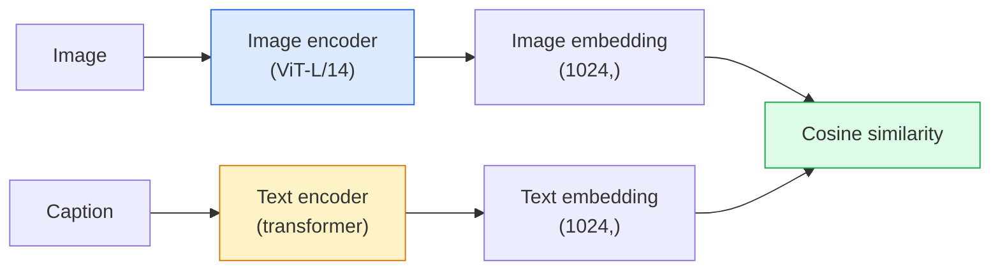

# Otwartosłownikowe widzenie komputerowe — CLIP

> Trenuj enkoder obrazu i enkoder tekstu razem, tak aby odpowiadające sobie pary (obraz, podpis) lądowały w tym samym punkcie współdzielonej przestrzeni. To jest cała sztuczka.

**Typ:** Zbuduj + Użyj
**Języki:** Python
**Wymagania wstępne:** Faza 4, Lekcja 14 (ViT), Faza 4, Lekcja 17 (Uczenie samonadzorowane)
**Czas:** ~45 minut

## Cele nauki

- Wyjaśnienie dwuwieżowej architektury CLIP i kontrastowego celu treningowego
- Użycie wytrenowanego modelu CLIP (lub SigLIP) do klasyfikacji zero-shot bez żadnego treningu specyficznego dla zadania
- Implementacja klasyfikacji zero-shot od podstaw: kodowanie promptów klas, obliczenie podobieństwa kosinusowego, wybór argmax
- Rozróżnienie modeli CLIP, SigLIP, OpenCLIP i LLaVA/LLaMA-vision — do czego służy każdy z nich w 2026 roku

## Problem

Tradycyjne klasyfikatory są zamkniętosłownikowe: model ImageNet z 1000 klasami może przewidzieć tylko 1000 etykiet. Każda nowa kategoria wymaga oznakowanych danych i przetrenowania głowicy.

CLIP (Radford i in., OpenAI 2021) pokazał, że trening na 400 mln par (obraz, podpis) zebranych z internetu daje model, który podczas wnioskowania może klasyfikować dowolny zestaw kategorii, opisanych wyłącznie w języku naturalnym. Nową klasę podajesz, pisząc zdanie.

Ta zdolność — transfer zero-shot — jest powodem, dla którego każdy nowoczesny system wizyjny zaczyna od checkpointu z rodziny CLIP. Detekcja (Grounding DINO, OWL-ViT), segmentacja (CLIPSeg, SAM), wyszukiwanie, moderacja treści, VLM-y oraz generowanie tekst-na-obraz — wszystkie te zastosowania opierają się na współdzielonych osadzeniach w stylu CLIP.

## Koncepcja

### Dwie wieże



Obydwa enkodery kończą się liniową projekcją do tego samego wymiaru osadzenia (512 dla CLIP-B/32, 1024 dla CLIP-L/14). Wykonujemy normalizację L2 i obliczamy podobieństwo kosinusowe.

### Cel treningowy

Mając batch N par (obraz, podpis), budujemy macierz podobieństwa NxN. Trenujemy oba enkodery tak, aby przekątna (pary dopasowane) miała wysokie podobieństwo, a elementy poza przekątną (pary niedopasowane) — niskie.

```
sim_matrix = image_embeddings @ text_embeddings.T / tau

loss_i2t = cross_entropy(sim_matrix,       targets=arange(N))
loss_t2i = cross_entropy(sim_matrix.T,     targets=arange(N))
loss = (loss_i2t + loss_t2i) / 2
```

Symetryczne, ponieważ powinno działać zarówno wyszukiwanie obraz-do-tekstu, jak i tekst-do-obrazu. `tau` (temperatura) jest zwykle uczona jako parametr skalarny, inicjalizowany na 0,07.

### SigLIP: lepsza funkcja straty

SigLIP (Zhai i in., 2023) zamienił softmax na sigmoid liczony dla każdej pary:

```
loss = mean over pairs of log(1 + exp(-y_ij * sim_ij))
y_ij = +1 if matching, -1 otherwise
```

Strata liczona per-para usuwa normalizację na poziomie batcha, której wymaga CLIP. SigLIP trenuje się lepiej przy małych rozmiarach batcha i przy tej samej ilości danych dorównuje lub przewyższa CLIP.

### Klasyfikacja zero-shot

Mając wytrenowany model CLIP:

1. Dla każdej klasy skomponuj prompt: "a photo of a {class}".
2. Zakoduj wszystkie prompty klas za pomocą enkodera tekstu -> `T` o kształcie (C, d).
3. Zakoduj obraz testowy -> `I` o kształcie (1, d).
4. Podobieństwo = `I @ T.T` o kształcie (1, C).
5. Argmax -> przewidziana klasa.

Inżynieria promptów ma znaczenie. OpenAI opublikowało 80 szablonów promptów dla ImageNet ("a photo of a {}", "a blurry photo of a {}", "a sketch of a {}", ...). Uśrednienie osadzeń wszystkich szablonów dla danej klasy daje dodatkowe 1-3% trafności top-1.

### Gdzie modele w stylu CLIP są używane w 2026 roku

- **Klasyfikacja zero-shot** — użycie bezpośrednie.
- **Wyszukiwanie obrazów** — zakoduj wszystkie obrazy raz, osadź zapytanie podczas wnioskowania.
- **Detekcja warunkowana tekstem** — Grounding DINO, OWL-ViT owijają wieżę tekstową CLIP wokół detektora.
- **Segmentacja warunkowana tekstem** — CLIPSeg; SAM korzysta z wejść w postaci promptów tekstowych za pośrednictwem CLIP.
- **VLM-y** — LLaVA, Qwen-VL, InternVL łączą enkoder wizyjny z rodziny CLIP z LLM.
- **Generowanie tekst-na-obraz** — Stable Diffusion, DALL-E 3 są warunkowane na osadzeniach tekstowych CLIP.

Gdy masz już współdzieloną przestrzeń osadzeń, każde zadanie z dziedziny wizja+język staje się obliczeniem odległości.

## Zbuduj to

### Krok 1: Mały model dwuwieżowy

Prawdziwy CLIP to ViT + transformer. W tej lekcji wieże to małe MLP nad wcześniej wyekstrahowanymi cechami, dzięki czemu sygnał treningowy jest widoczny na CPU.

```python
import torch
import torch.nn as nn
import torch.nn.functional as F


class TwoTower(nn.Module):
    def __init__(self, img_in=128, txt_in=64, emb=64):
        super().__init__()
        self.image_proj = nn.Sequential(nn.Linear(img_in, 128), nn.ReLU(), nn.Linear(128, emb))
        self.text_proj = nn.Sequential(nn.Linear(txt_in, 128), nn.ReLU(), nn.Linear(128, emb))
        self.logit_scale = nn.Parameter(torch.ones([]) * 2.6592)  # ln(1/0.07)

    def forward(self, img_feats, txt_feats):
        i = F.normalize(self.image_proj(img_feats), dim=-1)
        t = F.normalize(self.text_proj(txt_feats), dim=-1)
        return i, t, self.logit_scale.exp()
```

Dwie projekcje, wspólny wymiar wyjścia, uczona temperatura. Ten sam kształt co prawdziwe API CLIP.

### Krok 2: Strata kontrastowa

```python
def clip_loss(image_emb, text_emb, logit_scale):
    N = image_emb.size(0)
    sim = logit_scale * image_emb @ text_emb.T
    targets = torch.arange(N, device=sim.device)
    l_i = F.cross_entropy(sim, targets)
    l_t = F.cross_entropy(sim.T, targets)
    return (l_i + l_t) / 2
```

Symetryczna. Wyższy logit_scale = ostrzejszy softmax = większa pewność, ale ryzyko niestabilności.

### Krok 3: Klasyfikator zero-shot

```python
@torch.no_grad()
def zero_shot_classify(model, image_feats, class_text_feats, class_names):
    """
    image_feats:      (N, img_in)
    class_text_feats: (C, txt_in)   one averaged embedding per class
    """
    i = F.normalize(model.image_proj(image_feats), dim=-1)
    t = F.normalize(model.text_proj(class_text_feats), dim=-1)
    sim = i @ t.T
    pred = sim.argmax(dim=-1)
    return [class_names[p] for p in pred.tolist()]
```

Jedna linia na każdy krok. To jest dokładnie ta procedura zero-shot, która jest używana z produkcyjnym checkpointem CLIP.

### Krok 4: Test poprawności

```python
torch.manual_seed(0)
model = TwoTower()

img = torch.randn(8, 128)
txt = torch.randn(8, 64)
i, t, scale = model(img, txt)
loss = clip_loss(i, t, scale)
print(f"batch size: {i.size(0)}   loss: {loss.item():.3f}")
```

Strata powinna być bliska `log(N) = log(8) = 2.08` dla losowo zainicjalizowanego modelu — symetryczny cel cross-entropy, gdy żadna struktura nie została jeszcze nauczona.

## Użyj tego

OpenCLIP jest domyślnym wyborem społeczności w 2026 roku:

```python
import open_clip
import torch
from PIL import Image

model, _, preprocess = open_clip.create_model_and_transforms("ViT-B-32", pretrained="laion2b_s34b_b79k")
tokenizer = open_clip.get_tokenizer("ViT-B-32")

image = preprocess(Image.open("dog.jpg")).unsqueeze(0)
text = tokenizer(["a photo of a dog", "a photo of a cat", "a photo of a car"])

with torch.no_grad():
    image_features = model.encode_image(image)
    text_features = model.encode_text(text)
    image_features = image_features / image_features.norm(dim=-1, keepdim=True)
    text_features = text_features / text_features.norm(dim=-1, keepdim=True)
    probs = (100.0 * image_features @ text_features.T).softmax(dim=-1)

print(probs)
```

SigLIP jest nowszy, lepiej trenuje się na małych skalach i jest preferowany w nowych projektach: `google/siglip-base-patch16-224`. Hugging Face udostępnia oba.

## Dostarcz to

Ta lekcja produkuje:

- `outputs/prompt-zero-shot-class-picker.md` — prompt, który projektuje szablony klas dla zero-shot CLIP na podstawie listy klas i domeny.
- `outputs/skill-image-text-retriever.md` — skill, który buduje indeks osadzeń obrazów z użyciem dowolnego checkpointu CLIP, wspierający zapytania tekstem i zapytania obrazem.

## Ćwiczenia

1. **(Łatwe)** Użyj wytrenowanego OpenCLIP ViT-B/32 i wykonaj klasyfikację zero-shot na CIFAR-10 z zestawem 80 szablonów promptów. Podaj trafność top-1; powinna wynosić około 85-90%.
2. **(Średnie)** Porównaj osadzenia z jednym szablonem ("a photo of a {}") względem uśrednionych osadzeń z 80 szablonów na tym samym zadaniu CIFAR-10. Skwantyfikuj różnicę i wyjaśnij, czemu szablony pomagają.
3. **(Trudne)** Zbuduj indeks wyszukiwania obrazów zero-shot: osadź 1000 obrazów za pomocą CLIP, zbuduj indeks FAISS, wykonaj zapytanie opisem w języku naturalnym. Podaj recall@5 dla 20 zapytań napisanych ręcznie, na których nie trenowano.

## Kluczowe terminy

| Termin | Co się mówi | Co to faktycznie znaczy |
|------|----------------|----------------------|
| Two-tower | "Podwójny enkoder" | Oddzielne enkodery obrazu i tekstu, zakończone głowicą projekcji do wspólnego wymiaru |
| Zero-shot | "Brak treningu specyficznego dla zadania" | Klasyfikacja do klas opisanych jedynie tekstem podczas wnioskowania; żadne etykiety nie są używane |
| Temperature / logit_scale | "tau" | Uczony skalar, który skaluje macierz podobieństwa przed softmax |
| Prompt template | "A photo of a {}" | Wrapper w języku naturalnym wokół nazw klas; uśrednianie wielu szablonów zwiększa trafność zero-shot |
| CLIP | "Model obraz+tekst" | Model OpenAI z 2021 roku; słownictwo tej dziedziny w 2026 roku |
| SigLIP | "Sigmoid CLIP" | Zamienia softmax na sigmoid liczony dla każdej pary; lepiej trenuje się na małych batchach |
| OpenCLIP | "Otwarta reprodukcja" | Warianty CLIP trenowane przez społeczność na LAION; domyślny wybór produkcyjny dla open-source'owych pipeline'ów |
| VLM | "Model wizyjno-językowy" | Enkoder z rodziny CLIP plus LLM, trenowany do odpowiadania na pytania o obrazy |

## Dalsze materiały

- [CLIP: Learning Transferable Visual Models from Natural Language Supervision (Radford i in., 2021)](https://arxiv.org/abs/2103.00020)
- [SigLIP: Sigmoid Loss for Language-Image Pre-Training (Zhai i in., 2023)](https://arxiv.org/abs/2303.15343)
- [OpenCLIP](https://github.com/mlfoundations/open_clip) — baza kodu społeczności
- [DINOv2 vs CLIP vs MAE: a features comparison](https://huggingface.co/blog/dinov2) — przewodnik HF z porównaniem przypadków użycia
