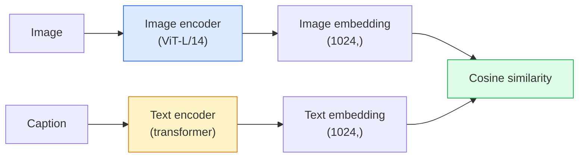

# Wizja otwartego słownictwa — KLIP

> Przetrenuj razem koder obrazu i koder tekstu, tak aby pasujące pary (obraz, podpis) lądowały w tym samym punkcie we współdzielonej przestrzeni. Na tym polega cała sztuczka.

**Typ:** Kompiluj + Użyj
**Języki:** Python
**Wymagania wstępne:** Faza 4, lekcja 14 (ViT), faza 4, lekcja 17 (samonadzorowany)
**Czas:** ~45 minut

## Cele nauczania

- Wyjaśnij dwuwieżową architekturę CLIP i kontrastowy cel szkolenia
- Użyj wstępnie przeszkolonego CLIP (lub SigLIP) do klasyfikacji typu zero-shot bez żadnego szkolenia dotyczącego konkretnego zadania
- Zaimplementuj klasyfikację zerową od zera: zakoduj podpowiedzi klas, oblicz podobieństwo cosinus, weź argmax
- Rozróżnij modele CLIP, SigLIP, OpenCLIP i LLaVA/LLaMA-vision — do czego każdy z nich służy w 2026 r.

## Problem

Tradycyjne klasyfikatory mają charakter zamknięty: model ImageNet klasy 1000 może przewidzieć tylko 1000 etykiet. Każda nowa kategoria wymaga oznaczonych danych i przeszkolonego szefa.

Projekt CLIP (Radford i in., OpenAI 2021) wykazał, że szkolenie na 400 milionach par (obrazek, podpis) pobranych z sieci tworzy model, który na podstawie wniosków można sklasyfikować w dowolny zestaw kategorii opisanych wyłącznie w języku naturalnym. Nadajesz mu nową klasę, pisząc zdanie.

Ta możliwość — transfer zerowy — jest powodem, dla którego każdy nowoczesny system wizyjny zaczyna się od punktu kontrolnego z rodziny CLIP. Wykrywanie (Grounding DINO, OWL-ViT), segmentacja (CLIPSeg, SAM), odzyskiwanie, moderowanie treści, VLM i generowanie tekstu na obraz opierają się na wspólnym osadzaniu w stylu CLIP.

## Koncepcja

### Dwie wieże



Oba enkodery kończą się rzutem liniowym na ten sam wymiar osadzania (512 dla CLIP-B/32, 1024 dla CLIP-L/14). L2-normalizacja i obliczenie podobieństwa cosinus.

### Cel

Biorąc pod uwagę partię N par (obraz, podpis), zbuduj macierz podobieństwa NxN. Trenuj oba kodery tak, aby przekątna (pasujące pary) miała duże podobieństwo, a nieprzekątne (niepasujące) miały niskie podobieństwo.

```
sim_matrix = image_embeddings @ text_embeddings.T / tau

loss_i2t = cross_entropy(sim_matrix,       targets=arange(N))
loss_t2i = cross_entropy(sim_matrix.T,     targets=arange(N))
loss = (loss_i2t + loss_t2i) / 2
```

Symetryczny, ponieważ powinno działać zarówno wyszukiwanie obrazu na tekst, jak i tekstu na obraz. `tau` (temperatura) jest zwykle zapamiętywana jako parametr skalarny, inicjowany na 0,07.

### SigLIP: lepsza strata

SigLIP (Zhai i in., 2023) zastąpił softmax sigmoidem na parę:

```
loss = mean over pairs of log(1 + exp(-y_ij * sim_ij))
y_ij = +1 if matching, -1 otherwise
```

Utrata pary usuwa normalizację na poziomie partii wymaganą przez CLIP. SigLIP lepiej radzi sobie z małymi partiami i dorównuje lub przewyższa CLIP przy takich samych danych.

### Klasyfikacja zerowego strzału

Biorąc pod uwagę przeszkolony CLIP:

1. Dla każdej klasy utwórz zachętę: „zdjęcie {klasy}”.
2. Zakoduj wszystkie podpowiedzi klasy za pomocą kodera tekstowego -> kształt `T` (C, d).
3. Zakoduj obraz testowy -> kształt `I` (1, d).
4. Podobieństwo = `I @ T.T` kształt (1, C).
5. Argmax -> przewidywana klasa.

Szybkie sprawy inżynieryjne. OpenAI opublikowało 80 szablonów podpowiedzi dla ImageNet („zdjęcie {}”, „rozmazane zdjęcie {}”, „szkic {}”,…). Uśrednij osadzenie wszystkich szablonów na klasę, aby uzyskać dodatkowe 1-3% dokładności w pierwszej kolejności.

### Gdzie w 2026 r. będą używane modele w stylu CLIP

- **Klasyfikacja zerowego** – bezpośrednie użycie.
- **Pobieranie obrazu** — koduj wszystkie obrazy raz, osadzaj zapytanie po wnioskowaniu.
- **Detekcja uwarunkowana tekstem** — Uziemienie DINO, OWL-ViT otacza czujkę wieżą tekstową CLIP.
- **Segmentacja warunkowana tekstem** — CLIPSeg; SAM wykorzystuje polecenia tekstowe za pośrednictwem CLIP.
- **VLM** — LLaVA, Qwen-VL, InternVL podłączają koder wizyjny z rodziny CLIP do LLM.
- **Genowanie tekstu na obraz** — Stabilne rozproszenie, warunek DALL-E 3 przy osadzaniu tekstu CLIP.

Kiedy już masz wspólną przestrzeń do osadzania, każde zadanie związane z wizją i językiem staje się obliczaniem odległości.

## Zbuduj to

### Krok 1: Mały model z dwiema wieżami

Real CLIP to transformator ViT+. W tej lekcji wieże są małymi MLP na wstępnie wyodrębnionych funkcjach, więc sygnał uczący jest widoczny na procesorze.

```python
import torch
import torch.nn as nn
import torch.nn.functional as F

class TwoTower(nn.Module):
    def __init__(self, img_in=128, txt_in=64, emb=64):
        super().__init__()
        self.image_proj = nn.Sequential(nn.Linear(img_in, 128), nn.ReLU(), nn.Linear(128, emb))
        self.text_proj = nn.Sequential(nn.Linear(txt_in, 128), nn.ReLU(), nn.Linear(128, emb))
        self.logit_scale = nn.Parameter(torch.ones([]) * 2.6592)  # ln(1/0.07)

    def forward(self, img_feats, txt_feats):
        i = F.normalize(self.image_proj(img_feats), dim=-1)
        t = F.normalize(self.text_proj(txt_feats), dim=-1)
        return i, t, self.logit_scale.exp()
```

Dwie projekcje, wspólne przyciemnienie, zaprogramowana temperatura. Taki sam kształt jak prawdziwe API CLIP.

### Krok 2: Kontrastowa strata

```python
def clip_loss(image_emb, text_emb, logit_scale):
    N = image_emb.size(0)
    sim = logit_scale * image_emb @ text_emb.T
    targets = torch.arange(N, device=sim.device)
    l_i = F.cross_entropy(sim, targets)
    l_t = F.cross_entropy(sim.T, targets)
    return (l_i + l_t) / 2
```

Symetryczny. Wyższa logit_scale = ostrzejszy softmax = większa pewność, ale ryzyko niestabilności.

### Krok 3: Klasyfikator zerowy

```python
@torch.no_grad()
def zero_shot_classify(model, image_feats, class_text_feats, class_names):
    """
    image_feats:      (N, img_in)
    class_text_feats: (C, txt_in)   one averaged embedding per class
    """
    i = F.normalize(model.image_proj(image_feats), dim=-1)
    t = F.normalize(model.text_proj(class_text_feats), dim=-1)
    sim = i @ t.T
    pred = sim.argmax(dim=-1)
    return [class_names[p] for p in pred.tolist()]
```

Jedna linia na krok. Jest to dokładna procedura zerowego strzału stosowana w produkcyjnym punkcie kontrolnym CLIP.

### Krok 4: Kontrola poprawności

```python
torch.manual_seed(0)
model = TwoTower()

img = torch.randn(8, 128)
txt = torch.randn(8, 64)
i, t, scale = model(img, txt)
loss = clip_loss(i, t, scale)
print(f"batch size: {i.size(0)}   loss: {loss.item():.3f}")
```

Strata powinna być bliska `log(N) = log(8) = 2.08` dla losowo inicjowanego modelu — symetrycznego docelowego punktu entropii krzyżowej, gdy nie poznano jeszcze żadnej struktury.

## Użyj tego

OpenCLIP będzie domyślnym ustawieniem społeczności w 2026 r.:

```python
import open_clip
import torch
from PIL import Image

model, _, preprocess = open_clip.create_model_and_transforms("ViT-B-32", pretrained="laion2b_s34b_b79k")
tokenizer = open_clip.get_tokenizer("ViT-B-32")

image = preprocess(Image.open("dog.jpg")).unsqueeze(0)
text = tokenizer(["a photo of a dog", "a photo of a cat", "a photo of a car"])

with torch.no_grad():
    image_features = model.encode_image(image)
    text_features = model.encode_text(text)
    image_features = image_features / image_features.norm(dim=-1, keepdim=True)
    text_features = text_features / text_features.norm(dim=-1, keepdim=True)
    probs = (100.0 * image_features @ text_features.T).softmax(dim=-1)

print(probs)
```

SigLIP jest nowszy, lepiej sprawdza się w małych skalach i jest preferowany do nowych prac: `google/siglip-base-patch16-224`. Hugging Face łączy jedno i drugie.

## Wyślij to

Ta lekcja daje:

- `outputs/prompt-zero-shot-class-picker.md` — zachęta projektująca szablony klas dla CLIP typu zero-shot z uwzględnieniem listy klas i domeny.
- `outputs/skill-image-text-retriever.md` — umiejętność budowania indeksu osadzania obrazu z dowolnym punktem kontrolnym CLIP, obsługuje zapytania po tekście i zapytania po obrazie.

## Ćwiczenia

1. **(Łatwy)** Użyj wstępnie przeszkolonego OpenCLIP ViT-B/32 i wykonaj klasyfikację zerową na CIFAR-10 za pomocą zestawu podpowiedzi zawierającego 80 szablonów. Zgłoś najwyższą dokładność; powinno wynosić około 85-90%.
2. **(Średni)** Porównanie pojedynczego szablonu („zdjęcie {}”) z osadzeniem uśrednionym na 80 szablonach w tym samym zadaniu CIFAR-10. Określ ilościowo lukę i wyjaśnij, dlaczego szablony są pomocne.
3. **(Trudny)** Zbuduj indeks wyszukiwania obrazów zero-shot: osadź 1000 obrazów za pomocą CLIP, zbuduj indeks FAISS, zapytaj z opisem w języku naturalnym. Raport o odzyskaniu przypomnienia@5 dla 20 wstrzymanych zapytań, które piszesz ręcznie.

## Kluczowe terminy

| Termin | Co ludzie mówią | Co to właściwie oznacza |
|------|----------------|----------------------|
| Dwie wieże | „Podwójny koder” | Oddzielne kodery obrazu i tekstu zakończone wspólną głowicą projekcyjną |
| Zerowy strzał | „Brak szkoleń zadaniowych” | Klasyfikuj na klasy opisane jedynie tekstem przy wnioskowaniu; żadne etykiety nie zostały dotknięte |
| Temperatura / skala logitowa | "tau" | Nauczony skalar skalujący macierz podobieństwa przed softmax |
| Szablon podpowiedzi | „Zdjęcie {}” | Opakowanie w języku naturalnym wokół nazw klas; uśrednianie wielu szablonów zwiększa dokładność zerowego strzału |
| KLIPS | „Model obraz+tekst” | Model OpenAI 2021; słownictwo z zakresu 2026 |
| SigLIP | „Sigmoidalny klip” | Zamienia softmax na sigmoid na parę; trenuje lepiej w małych partiach |
| OpenCLIP | „Reprodukcja otwarta” | Warianty CLIP wyszkolone przez społeczność na LAION; domyślna produkcja dla potoków open source |
| VLM | „Model wizjonersko-językowy” | Koder z rodziny CLIP plus LLM, przeszkolony w zakresie odpowiadania na pytania dotyczące obrazów |

## Dalsze czytanie

- [CLIP: Uczenie się możliwych do przeniesienia modeli wizualnych na podstawie nadzoru nad językiem naturalnym (Radford et al., 2021)](https://arxiv.org/abs/2103.00020)
– [SigLIP: Utrata esicy na potrzeby wstępnego szkolenia obrazu językowego (Zhai i in., 2023)](https://arxiv.org/abs/2303.15343)
- [OpenCLIP](https://github.com/mlfoundations/open_clip) — baza kodu społeczności
- [DINOv2 vs CLIP vs MAE: porównanie funkcji](https://huggingface.co/blog/dinov2) — Przewodnik HF z przykładami użycia obok siebie