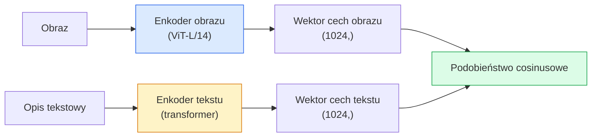

# Uczenie z otwartym słownikiem (Open-Vocabulary Vision) — CLIP

> Wytrenuj wspólnie enkoder obrazu i enkoder tekstu w taki sposób, aby powiązane pary (obraz, opis) trafiały w to samo miejsce we wspólnej przestrzeni cech (latent space). Na tym polega cała sztuka.

**Typ:** Ucz się + Buduj
**Języki:** Python
**Wymagania wstępne:** Faza 4 Lekcja 14 (Vision Transformer - ViT), Faza 4 Lekcja 17 (Uczenie samonadzorowane)
**Czas:** ~45 minut

## Cele edukacyjne

- Zrozumienie dwuwieżowej (two-tower) architektury modelu CLIP oraz kontrastowego celu uczenia (contrastive learning objective).
- Wykorzystanie wstępnie wytrenowanego modelu CLIP (lub SigLIP) do klasyfikacji bezprzykładowej (zero-shot) bez potrzeby dodatkowego trenowania na docelowym zbiorze.
- Zaimplementowanie od zera klasyfikacji zero-shot: tokenizacja i kodowanie promptów tekstowych dla klas, obliczenie podobieństwa cosinusowego oraz wyznaczenie klasy o najwyższym prawdopodobieństwie (argmax).
- Rozróżnianie modeli CLIP, SigLIP, OpenCLIP oraz LLaVA/LLaMA-vision — zrozumienie ich specyfiki i zastosowań.

## Opis problemu

Tradycyjne klasyfikatory mają charakter zamkniętego słownika: model trenowany na ImageNet dla 1000 klas potrafi przewidywać wyłącznie te 1000 etykiet. Każda nowa kategoria wymaga zebrania oznakowanych danych i douczenia nowej głowicy klasyfikatora (classification head).

Projekt CLIP (Radford i in., OpenAI 2021) wykazał, że trening na 400 milionach par (obraz, opis tekstowy) pobranych z internetu pozwala stworzyć model, który w fazie inferencji potrafi klasyfikować obrazy do dowolnego zbioru kategorii zdefiniowanych wyłącznie w języku naturalnym. Nową klasę definiuje się po prostu poprzez napisanie odpowiedniego zdania.

Ta zdolność — klasyfikacja bezprzykładowa (zero-shot transfer) — sprawia, że większość nowoczesnych systemów wizyjno-językowych opiera się na modelach z rodziny CLIP. Narzędzia do detekcji obiektów sterowanej tekstem (Grounding DINO, OWL-ViT), segmentacji (CLIPSeg), wyszukiwania (retrieval), moderacji treści, multimodalnych modeli językowych (VLM) oraz generowania obrazów z tekstu (Text-to-Image) wykorzystują wspólną przestrzeń cech w stylu CLIP.

## Koncepcje teoretyczne

### Architektura dwuwieżowa (Two-Tower)



Dane wyjściowe z obu enkoderów są rzutowane liniowo (projection layer) do wspólnej przestrzeni o identycznym wymiarze (512 dla CLIP-B/32, 1024 dla CLIP-L/14), a następnie poddawane normalizacji L2 w celu obliczenia podobieństwa cosinusowego.

### Cel uczenia (Loss function)

Dla wsadu o rozmiarze N par (obraz, opis tekstowy) tworzona jest macierz podobieństw o wymiarach N x N. Trenujemy oba enkodery w taki sposób, aby wartości na przekątnej macierzy (pary dopasowane) były jak najwyższe, a wartości poza przekątną (pary niedopasowane) — jak najniższe.

```
sim_matrix = image_embeddings @ text_embeddings.T / tau

loss_i2t = cross_entropy(sim_matrix,       targets=arange(N))
loss_t2i = cross_entropy(sim_matrix.T,     targets=arange(N))
loss = (loss_i2t + loss_t2i) / 2
```

Funkcja straty jest symetryczna, ponieważ model ma radzić sobie zarówno z wyszukiwaniem obrazu na podstawie tekstu (Image-to-Text), jak i tekstu na podstawie obrazu (Text-to-Image). Parametr temperatury `tau` jest optymalizowany w procesie uczenia (zazwyczaj inicjowany wartością 0.07).

### SigLIP: ulepszona funkcja straty

Model SigLIP (Zhai i in., 2023) zastępuje funkcję softmax funkcją sigmoidalną obliczaną dla każdej pary osobno:

```
strata = średnia po parach log(1 + exp(-y_ij * sim_ij))
y_ij = +1 jeśli pary są dopasowane, -1 w przeciwnym razie
```

Sformułowanie straty per-para eliminuje potrzebę globalnej normalizacji w ramach całego wsadu (batch), co było wymagane w klasycznym CLIP. Dzięki temu SigLIP działa wydajniej przy mniejszych wsadach oraz osiąga lepsze lub porównywalne wyniki przy tych samych danych treningowych.

### Procedura klasyfikacji bezprzykładowej (Zero-Shot Classification)

Wykorzystując wytrenowany model CLIP:

1. Dla każdej klasy utwórz prompt tekstowy: „zdjęcie przedstawiające {nazwa_klasy}”.
2. Przepuść wszystkie prompty przez enkoder tekstu, uzyskując tensor o wymiarach `(C, d)` (gdzie `C` to liczba klas, a `d` to wymiar wspólnej przestrzeni).
3. Przepuść obraz testowy przez enkoder obrazu, uzyskując tensor o wymiarach `(1, d)`.
4. Oblicz podobieństwo cosinusowe: `scores = I @ T.T` o wymiarach `(1, C)`.
5. Wybierz indeks o najwyższej wartości (argmax), co wskaże przewidywaną klasę.

Wskazówki praktyczne (Prompt Engineering): OpenAI opublikowało zestaw 80 szablonów promptów dla zbioru ImageNet (np. „zdjęcie przedstawiające {}”, „rozmazane zdjęcie {}”, „szkic {}” itp.). Uśrednienie wektorów cech z wielu szablonów dla danej klasy podnosi dokładność klasyfikacji zero-shot o dodatkowe 1-3%.

### Zastosowania modeli z rodziny CLIP

- **Klasyfikacja zero-shot** — bezpośrednie wnioskowanie bez douczania.
- **Wyszukiwanie obrazów (retrieval)** — jednorazowe zakodowanie całej bazy obrazów i wyszukiwanie na podstawie odległości od zapytania tekstowego lub graficznego.
- **Detekcja obiektów sterowana tekstem (open-vocabulary detection)** — modele takie jak Grounding DINO czy OWL-ViT łączą klasyczny detektor z enkoderem tekstu CLIP.
- **Segmentacja sterowana tekstem** — np. CLIPSeg lub rozszerzenia modelu SAM (Segment Anything), które przyjmują prompty tekstowe.
- **Multimodalne modele językowe (VLM)** — LLaVA, Qwen-VL czy InternVL wykorzystują enkoder wizyjny CLIP połączony z dekoderem autoregresyjnym LLM.
- **Generowanie obrazów z tekstu (Text-to-Image)** — modele takie jak Stable Diffusion czy DALL-E 3 są warunkowane wektorami cech tekstu z enkodera CLIP.

Posiadanie wspólnej przestrzeni cech (joint embedding space) sprawia, że większość zadań na styku wizji i tekstu sprowadza się do prostego porównywania odległości wektorowych.

## Implementacja krok po kroku

### Krok 1: Uproszczona architektura dwuwieżowa

Pełny model CLIP wykorzystuje architektury ViT i Transformer. W celach demonstracyjnych zaimplementujemy uproszczone wieże w postaci sieci MLP operujących na gotowych wektorach cech, co pozwoli na szybki trening bezpośrednio na procesorze (CPU).

```python
import torch
import torch.nn as nn
import torch.nn.functional as F

class TwoTower(nn.Module):
    def __init__(self, img_in=128, txt_in=64, emb=64):
        super().__init__()
        self.image_proj = nn.Sequential(nn.Linear(img_in, 128), nn.ReLU(), nn.Linear(128, emb))
        self.text_proj = nn.Sequential(nn.Linear(txt_in, 128), nn.ReLU(), nn.Linear(128, emb))
        self.logit_scale = nn.Parameter(torch.ones([]) * 2.6592)  # ln(1/0.07)

    def forward(self, img_feats, txt_feats):
        i = F.normalize(self.image_proj(img_feats), dim=-1)
        t = F.normalize(self.text_proj(txt_feats), dim=-1)
        return i, t, self.logit_scale.exp()
```

Dwie warstwy projekcyjne, wspólna przestrzeń cech i uczona temperatura. Schemat działania jest identyczny z oryginalnym API CLIP.

### Krok 2: Kontrastowa funkcja straty (CLIP Loss)

```python
def clip_loss(image_emb, text_emb, logit_scale):
    N = image_emb.size(0)
    sim = logit_scale * image_emb @ text_emb.T
    targets = torch.arange(N, device=sim.device)
    l_i = F.cross_entropy(sim, targets)
    l_t = F.cross_entropy(sim.T, targets)
    return (l_i + l_t) / 2
```

Strata jest symetryczna. Wyższa wartość `logit_scale` powoduje ostrzejszy rozkład prawdopodobieństwa po funkcji softmax i większą pewność modelu, ale może prowadzić do niestabilności treningu.

### Krok 3: Klasyfikator bezprzykładowy (Zero-Shot Classifier)

```python
@torch.no_grad()
def zero_shot_classify(model, image_feats, class_text_feats, class_names):
    """
    image_feats:      (N, img_in)
    class_text_feats: (C, txt_in)   uśredniona reprezentacja na klasę
    """
    i = F.normalize(model.image_proj(image_feats), dim=-1)
    t = F.normalize(model.text_proj(class_text_feats), dim=-1)
    sim = i @ t.T
    pred = sim.argmax(dim=-1)
    return [class_names[p] for p in pred.tolist()]
```

Klasyfikacja polega na obliczeniu podobieństwa cosinusowego i wyznaczeniu indeksu argmax. Jest to dokładnie ta sama procedura, która jest stosowana w produkcyjnych modelach CLIP.

### Krok 4: Weryfikacja działania

```python
torch.manual_seed(0)
model = TwoTower()

img = torch.randn(8, 128)
txt = torch.randn(8, 64)
i, t, scale = model(img, txt)
loss = clip_loss(i, t, scale)
print(f"Rozmiar wsadu: {i.size(0)}   Strata: {loss.item():.3f}")
```

Wartość straty dla losowo zainicjalizowanego modelu powinna być bliska teoretycznej wartości `log(N) = log(8) ≈ 2.079` — co odpowiada rozkładowi jednostajnemu przed rozpoczęciem uczenia.

## Wykorzystanie biblioteki OpenCLIP

Biblioteka OpenCLIP jest standardem w zastosowaniach otwartoźródłowych:

```python
import open_clip
import torch
from PIL import Image

model, _, preprocess = open_clip.create_model_and_transforms("ViT-B-32", pretrained="laion2b_s34b_b79k")
tokenizer = open_clip.get_tokenizer("ViT-B-32")

image = preprocess(Image.open("dog.jpg")).unsqueeze(0)
text = tokenizer(["a photo of a dog", "a photo of a cat", "a photo of a car"])

with torch.no_grad():
    image_features = model.encode_image(image)
    text_features = model.encode_text(text)
    image_features = image_features / image_features.norm(dim=-1, keepdim=True)
    text_features = text_features / text_features.norm(dim=-1, keepdim=True)
    probs = (100.0 * image_features @ text_features.T).softmax(dim=-1)

print(probs)
```

Model SigLIP jest nowocześniejszy, uczy się stabilniej przy mniejszych rozmiarach wsadów i jest wysoce zalecany do nowych projektów (np. punkt kontrolny `google/siglip-base-patch16-224`). Wygodną integrację obu podejść zapewnia biblioteka Transformers od Hugging Face.

## Materiały wyjściowe

W ramach tej lekcji przygotowano:

- `outputs/prompt-zero-shot-class-picker_pl.md` — szablon promptu wspomagający dobór optymalnych promptów/szablonów dla klasyfikacji zero-shot w zależności od dziedziny problemu.
- `outputs/skill-image-text-retriever_pl.md` — kod służący do budowy indeksu wektorowego obrazów przy użyciu modelu CLIP, umożliwiający wyszukiwanie obrazów za pomocą zapytań tekstowych lub innych obrazów.

## Ćwiczenia

1. **(Łatwe)** Wykorzystaj model OpenCLIP ViT-B/32 i przeprowadź klasyfikację zero-shot na zbiorze CIFAR-10, uśredniając wektory cech z 80 szablonów promptów. Zmierz i zapisz uzyskaną dokładność (powinna wynosić około 85-90%).
2. **(Średnie)** Porównaj dokładność klasyfikacji przy użyciu pojedynczego promptu (np. „zdjęcie przedstawiające {}”) z wynikami uzyskanymi przez uśrednienie 80 szablonów na zbiorze CIFAR-10. Określ różnicę w procentach i wyjaśnij, z czego wynika ta różnica.
3. **(Trudne)** Zbuduj system wyszukiwania obrazów (image retrieval): stwórz wektory cech dla 1000 obrazów przy użyciu modelu CLIP i zaindeksuj je za pomocą biblioteki FAISS. Przygotuj 20 testowych zapytań tekstowych w języku naturalnym i zmierz metrykę Recall@5 dla wyszukiwania obrazów.

## Kluczowe terminy

| Termin | Potoczne określenie | Co to właściwie oznacza |
|---|---|---|
| Architektura dwuwieżowa (Two-Tower) | „Podwójny enkoder” | Niezależne enkodery dla tekstu i obrazu, których wyjścia są rzutowane do wspólnej przestrzeni cech. |
| Klasyfikacja zero-shot | „Wnioskowanie bezprzykładowe” | Zdolność do przypisywania obrazów do klas zdefiniowanych wyłącznie w postaci tekstu, bez konieczności wcześniejszego trenowania modelu na tych klasach. |
| Temperatura / skala logitów (Logit scale) | `tau` | Parametr skalujący wartości macierzy podobieństwa przed nałożeniem funkcji softmax; wpływa na stromość rozkładu prawdopodobieństwa. |
| Szablon promptu (Prompt template) | „zdjęcie przedstawiające {}” | Tekstowy kontekst dodawany wokół nazwy klasy w celu poprawy dopasowania wektorowego; uśrednianie wyników dla wielu szablonów podnosi dokładność. |
| CLIP | „Model obraz+tekst” | Przełomowy model wizyjno-tekstowy wydany przez OpenAI w 2021 r. |
| SigLIP | „Sigmoid-constrained CLIP” | Wariant modelu zastępujący globalną funkcję softmax lokalną funkcją sigmoidalną liczoną dla pojedynczych par, co stabilizuje trening. |
| OpenCLIP | „Otwarta implementacja CLIP” | Społecznościowa, otwarta implementacja modeli CLIP wytrenowanych na zbiorach LAION, będąca standardem w projektach open-source. |
| Multimodalny model językowy (VLM / LMM) | „Model wizyjno-językowy” | Połączenie enkodera wizyjnego (np. CLIP) z autoregresyjnym modelem LLM, co pozwala na prowadzenie konwersacji na temat obrazów. |

## Bibliografia i literatura dodatkowa

- [CLIP: Learning Transferable Visual Models From Natural Language Supervision (Radford et al., 2021)](https://arxiv.org/abs/2103.00020)
- [SigLIP: Sigmoid Loss for Language-Image Pre-Training (Zhai et al., 2023)](https://arxiv.org/abs/2303.15343)
- [OpenCLIP GitHub Repository](https://github.com/mlfoundations/open_clip) — oficjalne repozytorium kodu dla projektów społecznościowych.
- [DINOv2 vs CLIP vs MAE: porównanie funkcji](https://huggingface.co/blog/dinov2) — poradnik na blogu Hugging Face opisujący różnice w generowaniu cech.
