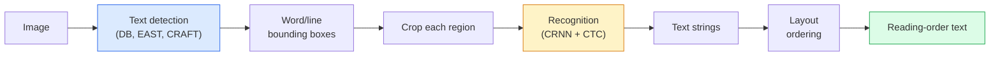

# OCR i zrozumienie dokumentów

> OCR to proces składający się z trzech etapów — wykrywa pola tekstowe, rozpoznaje znaki, a następnie układa je. Każdy nowoczesny system OCR zmienia kolejność tych etapów lub je łączy.

**Wpisz:** Ucz się + Używaj
**Języki:** Python
**Wymagania wstępne:** Faza 4 Lekcja 06 (Wykrywanie), Faza 7 Lekcja 02 (Samouwaga)
**Czas:** ~45 minut

## Cele nauczania

- Śledź klasyczny potok OCR (wykryj -> rozpoznaj -> układ) i nowoczesne, kompleksowe alternatywy (Donut, Qwen-VL-OCR)
- Wdrożenie utraty CTC (konektywistycznej klasyfikacji czasowej) na potrzeby szkolenia OCR sekwencja po sekwencji
- Użyj PaddleOCR lub EasyOCR do analizowania dokumentów produkcyjnych bez szkolenia
- Rozróżnij OCR, analizę układu i zrozumienie dokumentu - i wybierz odpowiednie narzędzie do każdego zadania

## Problem

Obrazy pełne tekstu są wszędzie: paragony, faktury, dowody osobiste, zeskanowane książki, formularze, tablice, znaki, zrzuty ekranu. Wyodrębnianie z nich uporządkowanych danych — nie tylko znaków, ale „to jest całkowita ilość” — jest jednym z najbardziej wartościowych problemów związanych z wizją stosowaną.

Pole dzieli się na trzy warstwy umiejętności:

1. **Właściwy OCR**: zamień piksele w tekst.
2. **Przetwarzanie układu**: grupuj dane wyjściowe OCR w regiony (tytuł, treść, tabela, nagłówek).
3. **Rozumienie dokumentu**: wyodrębnij z układu pola strukturalne („invoice_total = 42,50 USD”).

Każda warstwa ma podejście klasyczne i nowoczesne, a różnica między „Chcę tekstu z obrazu” a „Potrzebuję całkowitej kwoty z tego paragonu” jest większa, niż większość zespołów zdaje sobie sprawę.

## Koncepcja

### Klasyczny rurociąg



- **Wykrywanie tekstu** tworzy czworoboki w poszczególnych wierszach lub w słowach.
- **Rozpoznawanie** przycina każdy region do stałej wysokości, uruchamia CNN + BiLSTM + CTC w celu utworzenia sekwencji znaków.
- **Układ** zmienia kolejność czytania (od góry do dołu, od lewej do prawej w przypadku łaciny; inna w przypadku języka arabskiego i japońskiego).

### CTC w jednym akapicie

Rozpoznawanie OCR tworzy sekwencję o zmiennej długości z mapy obiektów o stałej długości. CTC (Graves i in., 2006) pozwala trenować to bez wyrównywania na poziomie znaku. Model generuje rozkład over (słownictwo + puste miejsce) w każdym kroku czasowym; Strata CTC marginalizuje się we wszystkich wyrównaniach, które sprowadzają się do tekstu docelowego po połączeniu powtórzeń i usunięciu spacji.

```
raw output: "h h h _ _ e e l l _ l l o _ _"
after merge repeats and remove blanks: "hello"
```

CTC jest powodem, dla którego CRNN pracował w 2015 r. i nadal szkoli większość produkcyjnych modeli OCR w 2026 r.

### Nowoczesne, kompleksowe modele

- **Donut** (Kim i in., 2022) — koder ViT + dekoder tekstu; odczytuje obraz i bezpośrednio emituje JSON. Brak detektora tekstu, brak modułu układu.
- **TrOCR** ​​— ViT + dekoder transformatorowy do OCR na poziomie liniowym.
- **Qwen-VL-OCR / InternVL** — pełne modele wizjonersko-językowe dostosowane do zadań OCR; najwyższa dokładność w 2026 r. w przypadku złożonych dokumentów.
- **PaddleOCR** ​​— klasyczny rurociąg DB + CRNN w dojrzałym pakiecie produkcyjnym; nadal głównym narzędziem open source.

Modele typu end-to-end wymagają więcej danych i obliczeń, ale pomijają akumulację błędów w potokach wieloetapowych.

### Analiza układu

W przypadku dokumentów strukturalnych uruchom detektor układu (LayoutLMv3, DocLayNet), który etykietuje każdy region: tytuł, akapit, rysunek, tabela, przypis. Kolejność czytania zmienia się wówczas na „iteruj przez regiony w kolejności układu, łącz”.

W przypadku formularzy użyj modeli **wyodrębniania kluczy i wartości** (Donut w przypadku dokumentów bogatych wizualnie, LayoutLMv3 w przypadku zwykłych skanów). Pobierają obraz + wykryty tekst + pozycje i przewidują ustrukturyzowane pary klucz-wartość.

### Metryki oceny

- **Współczynnik błędu znaku (CER)** — odległość Levenshteina / długość odniesienia. Niżej jest lepiej. Cel produkcyjny: < 2% w przypadku czystych skanów.
- **Współczynnik błędów słów (WER)** — taki sam na poziomie słowa.
- **F1 na polach strukturalnych** — dla zadań klucz-wartość; mierzy, czy `{invoice_total: 42.50}` jest wyświetlany poprawnie.
- **Edytuj odległość w JSON** — do kompleksowego analizowania dokumentów; w artykule Donut wprowadzono znormalizowaną odległość edycji drzewa.

## Zbuduj to

### Krok 1: utrata CTC + zachłanny dekoder

```python
import torch
import torch.nn as nn
import torch.nn.functional as F

def ctc_loss(log_probs, targets, input_lengths, target_lengths, blank=0):
    """
    log_probs:      (T, N, C) log-softmax over vocab including blank at index 0
    targets:        (N, S) int targets (no blanks)
    input_lengths:  (N,) per-sample time steps used
    target_lengths: (N,) per-sample target length
    """
    return F.ctc_loss(log_probs, targets, input_lengths, target_lengths,
                      blank=blank, reduction="mean", zero_infinity=True)

def greedy_ctc_decode(log_probs, blank=0):
    """
    log_probs: (T, N, C) log-softmax
    returns: list of index sequences (blanks removed, repeats merged)
    """
    preds = log_probs.argmax(dim=-1).transpose(0, 1).cpu().tolist()
    out = []
    for seq in preds:
        decoded = []
        prev = None
        for idx in seq:
            if idx != prev and idx != blank:
                decoded.append(idx)
            prev = idx
        out.append(decoded)
    return out
```

`F.ctc_loss` korzysta z wydajnej implementacji CuDNN, jeśli jest dostępna. Dekoder zachłanny jest prostszy niż przeszukiwanie wiązki i zwykle mieści się w granicach 1% CER.

### Krok 2: Mały moduł rozpoznawania CRNN

Minimalny CNN + BiLSTM dla linii OCR.

```python
class TinyCRNN(nn.Module):
    def __init__(self, vocab_size=40, hidden=128, feat=32):
        super().__init__()
        self.cnn = nn.Sequential(
            nn.Conv2d(1, feat, 3, 1, 1), nn.BatchNorm2d(feat), nn.ReLU(inplace=True),
            nn.MaxPool2d(2),
            nn.Conv2d(feat, feat * 2, 3, 1, 1), nn.BatchNorm2d(feat * 2), nn.ReLU(inplace=True),
            nn.MaxPool2d(2),
            nn.Conv2d(feat * 2, feat * 4, 3, 1, 1), nn.BatchNorm2d(feat * 4), nn.ReLU(inplace=True),
            nn.MaxPool2d((2, 1)),
            nn.Conv2d(feat * 4, feat * 4, 3, 1, 1), nn.BatchNorm2d(feat * 4), nn.ReLU(inplace=True),
            nn.MaxPool2d((2, 1)),
        )
        self.rnn = nn.LSTM(feat * 4, hidden, bidirectional=True, batch_first=True)
        self.head = nn.Linear(hidden * 2, vocab_size)

    def forward(self, x):
        # x: (N, 1, H, W)
        f = self.cnn(x)                # (N, C, H', W')
        f = f.mean(dim=2).transpose(1, 2)  # (N, W', C)
        h, _ = self.rnn(f)
        return F.log_softmax(self.head(h).transpose(0, 1), dim=-1)  # (W', N, vocab)
```

Dane wejściowe o stałej wysokości (maksymalna wysokość puli CNN wynosi 1). Szerokość jest wymiarem czasu dla CTC.

### Krok 3: Syntetyczny OCR

Generuj ciągi cyfr czarno-białych do kompleksowego testu dymu.

```python
import numpy as np

def synthetic_line(text, height=32, char_width=16):
    W = char_width * len(text)
    img = np.ones((height, W), dtype=np.float32)
    for i, c in enumerate(text):
        x = i * char_width
        shade = 0.0 if c.isalnum() else 0.5
        img[6:height - 6, x + 2:x + char_width - 2] = shade
    return img

def build_batch(strings, vocab):
    H = 32
    W = 16 * max(len(s) for s in strings)
    imgs = np.ones((len(strings), 1, H, W), dtype=np.float32)
    target_lengths = []
    targets = []
    for i, s in enumerate(strings):
        imgs[i, 0, :, :16 * len(s)] = synthetic_line(s)
        ids = [vocab.index(c) for c in s]
        targets.extend(ids)
        target_lengths.append(len(ids))
    return torch.from_numpy(imgs), torch.tensor(targets), torch.tensor(target_lengths)

vocab = ["_"] + list("0123456789abcdefghijklmnopqrstuvwxyz")
imgs, targets, lengths = build_batch(["hello", "world"], vocab)
print(f"images: {imgs.shape}   targets: {targets.shape}   lengths: {lengths.tolist()}")
```

Prawdziwy zbiór danych OCR dodaje czcionki, szum, obrót, rozmycie i kolor. Rurociąg powyżej jest identyczny.

### Krok 4: Szkic szkoleniowy

```python
model = TinyCRNN(vocab_size=len(vocab))
opt = torch.optim.Adam(model.parameters(), lr=1e-3)

for step in range(200):
    strings = ["abc" + str(step % 10)] * 4 + ["xyz" + str((step + 1) % 10)] * 4
    imgs, targets, target_lens = build_batch(strings, vocab)
    log_probs = model(imgs)  # (W', 8, vocab)
    input_lens = torch.full((8,), log_probs.size(0), dtype=torch.long)
    loss = ctc_loss(log_probs, targets, input_lens, target_lens, blank=0)
    opt.zero_grad(); loss.backward(); opt.step()
```

Strata powinna spaść z ~3 do ~0,2 w ciągu 200 kroków na tych trywialnych danych syntetycznych.

## Użyj tego

Trzy ścieżki produkcyjne:

- **PaddleOCR** — dojrzały, szybki, wielojęzyczny. Użycie jednej linii: `paddleocr.PaddleOCR(lang="en").ocr(image_path)`.
- **EasyOCR** ​​— natywny dla Pythona, wielojęzyczny, szkielet PyTorch.
- **Tesserakt** — klasyczny; nadal przydatne w przypadku starych zeskanowanych dokumentów, gdy modele mają problemy.

Do kompleksowego analizowania dokumentów użyj Donuta lub VLM:

```python
from transformers import DonutProcessor, VisionEncoderDecoderModel

processor = DonutProcessor.from_pretrained("naver-clova-ix/donut-base-finetuned-cord-v2")
model = VisionEncoderDecoderModel.from_pretrained("naver-clova-ix/donut-base-finetuned-cord-v2")
```

W przypadku paragonów, faktur i formularzy o powtarzalnej strukturze dostosuj Donut. W przypadku dowolnych dokumentów lub OCR z uzasadnieniem, VLM taki jak Qwen-VL-OCR jest bieżącym ustawieniem domyślnym.

## Wyślij to

Ta lekcja daje:

- `outputs/prompt-ocr-stack-picker.md` — monit, który wybiera Tesseract / PaddleOCR / Donut / VLM-OCR dla danego typu dokumentu, języka i struktury.
- `outputs/skill-ctc-decoder.md` — umiejętność polegająca na pisaniu od podstaw dekoderów CTC zachłannych i przeszukiwających wiązkę, łącznie z normalizacją długości.

## Ćwiczenia

1. **(Łatwy)** Trenuj TinyCRNN na 5-cyfrowych losowych ciągach liczbowych przez 500 kroków. Zgłoś CER dla wstrzymanego zestawu.
2. **(Średni)** Zamień zachłanne dekodowanie na wyszukiwanie wiązki (beam_width=5). Zgłoś deltę CER. Na jakich wejściach wygrywa wyszukiwanie belek?
3. **(Trudne)** Użyj PaddleOCR na zestawie 20 paragonów, wyodrębnij pozycje pojedyncze i oblicz F1 na podstawie ręcznie oznaczonej prawdy podstawowej dla par {item_name, cena}.

## Kluczowe terminy

| Termin | Co ludzie mówią | Co to właściwie oznacza |
|------|----------------|----------------------|
| OCR | „Tekst z pikseli” | Przekształcanie regionów obrazu w sekwencje znaków |
| CTC | „Strata bez wyrównania” | Strata, która szkoli model sekwencji bez etykiet poszczególnych kroków; marginalizuje poprzez wyrównania |
| CRNN | „Klasyczny model OCR” | Ekstraktor funkcji konwersji + BiLSTM + CTC; poziom bazowy z 2015 r. nadal stosowany w produkcji |
| Pączek | „Kompleksowe OCR” | Koder ViT + dekoder tekstu; emituje JSON bezpośrednio z obrazu |
| Analiza układu | „Znajdź regiony” | Wykryj i oznacz regiony tytułu/tabeli/rysunku/akapitu w dokumencie |
| Kolejność czytania | „Sekwencja tekstów” | Uporządkowanie rozpoznanych regionów w zdaniu; trywialne dla łaciny, nietrywialne dla układów mieszanych |
| CER/WER | „Wskaźniki błędów” | Odległość Levenshteina / długość odniesienia przy szczegółowości znaku lub słowa |
| VLM-OCR | „LLM, który czyta” | Model języka wizyjnego szkolony lub monitowany o zadania OCR; aktualna SOTA na skomplikowanych dokumentach |

## Dalsze czytanie

- [CRNN (Shi et al., 2015)](https://arxiv.org/abs/1507.05717) — oryginalna architektura CNN+RNN+CTC
- [CTC (Graves et al., 2006)](https://www.cs.toronto.edu/~graves/icml_2006.pdf) — oryginalna praca CTC; gęsto upakowany pomysłami algorytmicznymi
- [Donut (Kim et al., 2022)](https://arxiv.org/abs/2111.15664) — Transformator rozumienia dokumentów bez OCR
- [PaddleOCR](https://github.com/PaddlePaddle/PaddleOCR) — stos produkcyjny OCR typu open source