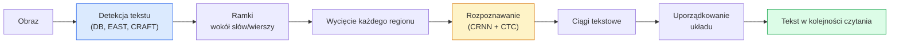

# OCR i rozumienie dokumentów

> OCR to trzyetapowy potok — wykryj pola tekstowe, rozpoznaj znaki, a następnie uporządkuj układ. Każdy nowoczesny system OCR przestawia te etapy albo je łączy.

**Typ:** Nauka + Zastosowanie
**Języki:** Python
**Wymagania wstępne:** Faza 4, Lekcja 06 (Detekcja), Faza 7, Lekcja 02 (Self-Attention)
**Czas:** ~45 minut

## Cele nauki

- Przejście przez klasyczny potok OCR (detekcja -> rozpoznawanie -> układ) oraz nowoczesne alternatywy end-to-end (Donut, Qwen-VL-OCR)
- Implementacja funkcji straty CTC (Connectionist Temporal Classification) do treningu sekwencyjnego OCR
- Wykorzystanie PaddleOCR lub EasyOCR do produkcyjnego parsowania dokumentów bez treningu
- Rozróżnienie OCR, parsowania układu (layout parsing) i rozumienia dokumentów — oraz wybór właściwego narzędzia do zadania

## Problem

Obrazy pełne tekstu są wszędzie: paragony, faktury, dokumenty identyfikacyjne, zeskanowane książki, formularze, tablice, znaki, zrzuty ekranu. Wydobywanie z nich danych strukturalnych — nie tylko znaków, ale informacji typu "to jest suma końcowa" — to jeden z najbardziej wartościowych problemów stosowanego widzenia komputerowego.

Dziedzina dzieli się na trzy warstwy umiejętności:

1. **Właściwy OCR**: zamiana pikseli na tekst.
2. **Parsowanie układu**: grupowanie wyniku OCR w regiony (tytuł, treść, tabela, nagłówek).
3. **Rozumienie dokumentu**: wydobycie ustrukturyzowanych pól ("invoice_total = 42,50 zł") z układu.

Każda warstwa ma podejścia klasyczne i nowoczesne, a przepaść między "chcę tekst z obrazu" a "potrzebuję sumy końcowej z tego paragonu" jest większa, niż większość zespołów sobie wyobraża.

## Koncepcja

### Klasyczny potok



- **Detekcja tekstu** generuje czworokąty na poziomie wiersza lub słowa.
- **Rozpoznawanie** przycina każdy region do ustalonej wysokości i przepuszcza go przez CNN + BiLSTM + CTC, aby wyprodukować sekwencję znaków.
- **Układ** odtwarza kolejność czytania (od góry do dołu, od lewej do prawej dla alfabetu łacińskiego; inaczej dla arabskiego czy japońskiego).

### CTC w jednym akapicie

Rozpoznawanie OCR generuje sekwencję o zmiennej długości na podstawie mapy cech o ustalonej długości. CTC (Graves i in., 2006) pozwala wytrenować to bez wyrównania na poziomie znaków. Model wytwarza rozkład nad (słownikiem + symbolem blank) w każdym kroku czasowym; strata CTC marginalizuje po wszystkich wyrównaniach, które po scaleniu powtórzeń i usunięciu symboli blank redukują się do tekstu docelowego.

```
surowy wynik: "h h h _ _ e e l l _ l l o _ _"
po scaleniu powtórzeń i usunięciu blanków: "hello"
```

CTC to powód, dla którego CRNN działał w 2015 roku i wciąż trenuje większość produkcyjnych modeli OCR w 2026 roku.

### Nowoczesne modele end-to-end

- **Donut** (Kim i in., 2022) — enkoder ViT + dekoder tekstu; odczytuje obraz i bezpośrednio generuje JSON. Brak detektora tekstu, brak modułu układu.
- **TrOCR** — ViT + dekoder transformerowy do OCR na poziomie wiersza.
- **Qwen-VL-OCR / InternVL** — pełne modele wizualno-językowe dostrojone do zadań OCR; najlepsza dokładność w 2026 roku na złożonych dokumentach.
- **PaddleOCR** — klasyczny potok DB + CRNN w dojrzałym pakiecie produkcyjnym; wciąż koń roboczy open source.

Modele end-to-end potrzebują więcej danych i obliczeń, ale eliminują kumulację błędów typową dla potoków wieloetapowych.

### Parsowanie układu

Dla dokumentów strukturalnych uruchamia się detektor układu (LayoutLMv3, DocLayNet), który etykietuje każdy region: Tytuł, Paragraf, Rysunek, Tabela, Przypis. Kolejność czytania staje się wtedy "iteruj po regionach w kolejności wynikającej z układu, konkatenuj".

Dla formularzy używa się modeli do **ekstrakcji par klucz-wartość** (Donut dla dokumentów bogatych wizualnie, LayoutLMv3 dla prostych skanów). Przyjmują obraz + wykryty tekst + pozycje i przewidują ustrukturyzowane pary klucz-wartość.

### Metryki ewaluacji

- **Character Error Rate (CER)** — odległość Levenshteina / długość referencji. Mniej = lepiej. Cel produkcyjny: < 2% na czystych skanach.
- **Word Error Rate (WER)** — analogicznie, na poziomie słów.
- **F1 na polach strukturalnych** — dla zadań klucz-wartość; mierzy, czy `{invoice_total: 42.50}` pojawia się poprawnie.
- **Edit distance na JSON** — dla parsowania dokumentów end-to-end; praca o Donut wprowadziła znormalizowaną odległość edycyjną drzew.

## Zbuduj to

### Krok 1: Strata CTC + dekoder zachłanny (greedy)

```python
import torch
import torch.nn as nn
import torch.nn.functional as F


def ctc_loss(log_probs, targets, input_lengths, target_lengths, blank=0):
    """
    log_probs:      (T, N, C) log-softmax po słowniku, łącznie z blankiem na indeksie 0
    targets:        (N, S) całkowite cele (bez blanków)
    input_lengths:  (N,) liczba użytych kroków czasowych na próbkę
    target_lengths: (N,) długość celu na próbkę
    """
    return F.ctc_loss(log_probs, targets, input_lengths, target_lengths,
                      blank=blank, reduction="mean", zero_infinity=True)


def greedy_ctc_decode(log_probs, blank=0):
    """
    log_probs: (T, N, C) log-softmax
    zwraca: listę sekwencji indeksów (bez blanków, ze scalonymi powtórzeniami)
    """
    preds = log_probs.argmax(dim=-1).transpose(0, 1).cpu().tolist()
    out = []
    for seq in preds:
        decoded = []
        prev = None
        for idx in seq:
            if idx != prev and idx != blank:
                decoded.append(idx)
            prev = idx
        out.append(decoded)
    return out
```

`F.ctc_loss` korzysta z efektywnej implementacji CuDNN, gdy jest dostępna. Dekoder zachłanny jest prostszy niż beam search i zwykle różni się od niego o mniej niż 1% CER.

### Krok 2: Minimalny rozpoznawacz CRNN

Minimalny CNN + BiLSTM do OCR na poziomie wiersza.

```python
class TinyCRNN(nn.Module):
    def __init__(self, vocab_size=40, hidden=128, feat=32):
        super().__init__()
        self.cnn = nn.Sequential(
            nn.Conv2d(1, feat, 3, 1, 1), nn.BatchNorm2d(feat), nn.ReLU(inplace=True),
            nn.MaxPool2d(2),
            nn.Conv2d(feat, feat * 2, 3, 1, 1), nn.BatchNorm2d(feat * 2), nn.ReLU(inplace=True),
            nn.MaxPool2d(2),
            nn.Conv2d(feat * 2, feat * 4, 3, 1, 1), nn.BatchNorm2d(feat * 4), nn.ReLU(inplace=True),
            nn.MaxPool2d((2, 1)),
            nn.Conv2d(feat * 4, feat * 4, 3, 1, 1), nn.BatchNorm2d(feat * 4), nn.ReLU(inplace=True),
            nn.MaxPool2d((2, 1)),
        )
        self.rnn = nn.LSTM(feat * 4, hidden, bidirectional=True, batch_first=True)
        self.head = nn.Linear(hidden * 2, vocab_size)

    def forward(self, x):
        # x: (N, 1, H, W)
        f = self.cnn(x)                # (N, C, H', W')
        f = f.mean(dim=2).transpose(1, 2)  # (N, W', C)
        h, _ = self.rnn(f)
        return F.log_softmax(self.head(h).transpose(0, 1), dim=-1)  # (W', N, vocab)
```

Wejście o ustalonej wysokości (CNN redukuje wysokość do 1 za pomocą max-poolingu). Szerokość jest wymiarem czasowym dla CTC.

### Krok 3: Syntetyczny OCR

Wygeneruj ciągi cyfr czarnych na białym tle do testu end-to-end (smoke test).

```python
import numpy as np

def synthetic_line(text, height=32, char_width=16):
    W = char_width * len(text)
    img = np.ones((height, W), dtype=np.float32)
    for i, c in enumerate(text):
        x = i * char_width
        shade = 0.0 if c.isalnum() else 0.5
        img[6:height - 6, x + 2:x + char_width - 2] = shade
    return img


def build_batch(strings, vocab):
    H = 32
    W = 16 * max(len(s) for s in strings)
    imgs = np.ones((len(strings), 1, H, W), dtype=np.float32)
    target_lengths = []
    targets = []
    for i, s in enumerate(strings):
        imgs[i, 0, :, :16 * len(s)] = synthetic_line(s)
        ids = [vocab.index(c) for c in s]
        targets.extend(ids)
        target_lengths.append(len(ids))
    return torch.from_numpy(imgs), torch.tensor(targets), torch.tensor(target_lengths)


vocab = ["_"] + list("0123456789abcdefghijklmnopqrstuvwxyz")
imgs, targets, lengths = build_batch(["hello", "world"], vocab)
print(f"images: {imgs.shape}   targets: {targets.shape}   lengths: {lengths.tolist()}")
```

Prawdziwy zbiór danych OCR dodaje czcionki, szum, obrót, rozmycie i kolor. Powyższy potok jest identyczny.

### Krok 4: Szkic treningu

```python
model = TinyCRNN(vocab_size=len(vocab))
opt = torch.optim.Adam(model.parameters(), lr=1e-3)

for step in range(200):
    strings = ["abc" + str(step % 10)] * 4 + ["xyz" + str((step + 1) % 10)] * 4
    imgs, targets, target_lens = build_batch(strings, vocab)
    log_probs = model(imgs)  # (W', 8, vocab)
    input_lens = torch.full((8,), log_probs.size(0), dtype=torch.long)
    loss = ctc_loss(log_probs, targets, input_lens, target_lens, blank=0)
    opt.zero_grad(); loss.backward(); opt.step()
```

Strata powinna spaść z ~3 do ~0.2 w ciągu 200 kroków na tych trywialnych danych syntetycznych.

## Zastosuj to

Trzy ścieżki produkcyjne:

- **PaddleOCR** — dojrzałe, szybkie, wielojęzyczne. Użycie w jednej linii: `paddleocr.PaddleOCR(lang="en").ocr(image_path)`.
- **EasyOCR** — natywny dla Pythona, wielojęzyczny, oparty na PyTorch.
- **Tesseract** — klasyczne rozwiązanie; wciąż przydatne dla starych zeskanowanych dokumentów, gdy modele zawodzą.

Do parsowania dokumentów end-to-end użyj Donut lub VLM:

```python
from transformers import DonutProcessor, VisionEncoderDecoderModel

processor = DonutProcessor.from_pretrained("naver-clova-ix/donut-base-finetuned-cord-v2")
model = VisionEncoderDecoderModel.from_pretrained("naver-clova-ix/donut-base-finetuned-cord-v2")
```

Dla paragonów, faktur i formularzy o powtarzalnej strukturze dostrój Donut. Dla dowolnych dokumentów lub OCR z elementami rozumowania, VLM taki jak Qwen-VL-OCR jest obecnie domyślnym wyborem.

## Dostarcz to

Ta lekcja produkuje:

- `outputs/prompt-ocr-stack-picker.md` — prompt, który wybiera Tesseract / PaddleOCR / Donut / VLM-OCR na podstawie typu dokumentu, języka i struktury.
- `outputs/skill-ctc-decoder.md` — skill, który pisze od zera dekodery CTC typu greedy i beam search, włącznie z normalizacją długości.

## Ćwiczenia

1. **(Łatwe)** Wytrenuj TinyCRNN na losowych 5-cyfrowych ciągach numerycznych przez 500 kroków. Podaj CER na zbiorze testowym (held-out).
2. **(Średnie)** Zamień dekodowanie zachłanne na beam search (beam_width=5). Podaj zmianę (deltę) CER. Dla jakich wejść beam search wygrywa?
3. **(Trudne)** Użyj PaddleOCR na zbiorze 20 paragonów, wyodrębnij pozycje (line items) i policz F1 względem ręcznie oznaczonej referencji dla par {item_name, price}.

## Kluczowe terminy

| Termin | Co się mówi | Co to faktycznie oznacza |
|------|----------------|----------------------|
| OCR | "Tekst z pikseli" | Zamiana regionów obrazu na sekwencje znaków |
| CTC | "Strata bez wyrównania" | Strata, która trenuje model sekwencyjny bez etykiet na poziomie kroku czasowego; marginalizuje po wyrównaniach |
| CRNN | "Klasyczny model OCR" | Ekstraktor cech konwolucyjny + BiLSTM + CTC; baseline z 2015 roku wciąż używany produkcyjnie |
| Donut | "OCR end-to-end" | Enkoder ViT + dekoder tekstu; generuje JSON bezpośrednio z obrazu |
| Parsowanie układu | "Znajdź regiony" | Wykrywanie i etykietowanie regionów Tytuł/Tabela/Rysunek/Paragraf w dokumencie |
| Kolejność czytania | "Sekwencja tekstu" | Uporządkowanie rozpoznanych regionów w zdanie; trywialne dla alfabetu łacińskiego, nietrywialne dla układów mieszanych |
| CER / WER | "Wskaźniki błędów" | Odległość Levenshteina / długość referencji na poziomie znaku lub słowa |
| VLM-OCR | "LLM, który czyta" | Model wizualno-językowy wytrenowany lub poprompowany do zadań OCR; obecny SOTA na złożonych dokumentach |

## Dalsze materiały

- [CRNN (Shi i in., 2015)](https://arxiv.org/abs/1507.05717) — oryginalna architektura CNN+RNN+CTC
- [CTC (Graves i in., 2006)](https://www.cs.toronto.edu/~graves/icml_2006.pdf) — oryginalna praca o CTC; gęsto upakowana ideami algorytmicznymi
- [Donut (Kim i in., 2022)](https://arxiv.org/abs/2111.15664) — transformer do rozumienia dokumentów bez OCR
- [PaddleOCR](https://github.com/PaddlePaddle/PaddleOCR) — produkcyjny stos OCR open source
