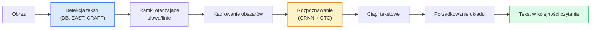

# OCR i automatyczne rozumienie dokumentów (Document Understanding)

> Klasyczny proces OCR składa się z trzech etapów: wykrywania obszarów tekstowych, rozpoznawania znaków oraz ich odpowiedniego układania. Nowoczesne systemy OCR często modyfikują kolejność tych kroków lub łączą je w jedną całość.

**Formuła:** Ucz się + Wdrażaj
**Język:** Python
**Wymagania wstępne:** Faza 4, Lekcja 06 (Detekcja); Faza 7, Lekcja 02 (Self-Attention / Samouwaga)
**Czas wykonania:** ~45 minut

## Cele lekcji

- Poznasz klasyczny potok OCR (detekcja -> rozpoznawanie -> układ) oraz nowoczesne, zintegrowane alternatywy (end-to-end), takie jak Donut czy Qwen-VL-OCR.
- Zaimplementujesz funkcję kosztu CTC (Connectionist Temporal Classification) na potrzeby uczenia modeli OCR sekwencja po sekwencji.
- Wykorzystasz biblioteki PaddleOCR lub EasyOCR do analizy dokumentów w warunkach produkcyjnych bez konieczności douczania modeli.
- Nauczysz się rozróżniać podstawowy OCR, analizę układu (layout analysis) oraz interpretację dokumentu (document understanding), a także dobierać odpowiednie narzędzia do każdego z tych zadań.

## Opis problemu

Obrazy zawierające tekst otaczają nas z każdej strony: paragony, faktury, dowody tożsamości, zeskanowane książki, formularze, tablice informacyjne, znaki czy zrzuty ekranu. Wyodrębnianie z nich ustrukturyzowanych danych – nie tylko samych znaków, ale też informacji o tym, np. która kwota to wartość całkowita – stanowi jedno z najbardziej wartościowych biznesowo wyzwań w obszarze komputerowego rozpoznawania obrazów (Computer Vision).

Zagadnienie to dzieli się na trzy poziomy:

1. **Właściwy OCR**: przekształcanie pikseli w tekst.
2. **Analiza układu (Layout Analysis)**: grupowanie wyników OCR w logiczne obszary (np. tytuł, treść, tabela, nagłówek).
3. **Rozumienie dokumentu (Document Understanding)**: wyodrębnianie z układu ustrukturyzowanych pól (np. `faktura_suma = 42.50 USD`).

Każdy z tych poziomów można realizować metodami klasycznymi lub nowoczesnymi. Różnica między prostym wyodrębnieniem tekstu z obrazu a wyciągnięciem konkretnej kwoty z paragonu jest jednak znacznie większa, niż wydaje się większości zespołów projektowych.

## Koncepcje teoretyczne

### Klasyczny potok przetwarzania (pipeline)



- **Detekcja tekstu** wyznacza czworokątne ramki otaczające poszczególne wiersze lub słowa (np. przy użyciu modeli DB, EAST, CRAFT).
- **Rozpoznawanie** polega na kadrowaniu (cropowaniu) każdego wykrytego obszaru, sprowadzeniu go do stałej wysokości i przetworzeniu przez sieć CNN + BiLSTM + CTC w celu wygenerowania sekwencji znaków.
- **Analiza układu** ustala prawidłową kolejność czytania (od góry do dołu, od lewej do prawej dla języków łacińskich; inaczej dla arabskiego czy japońskiego).

### CTC (Connectionist Temporal Classification) w pigułce

Moduł rozpoznawania tekstu tworzy sekwencję o zmiennej długości na podstawie mapy cech (feature map) o stałym rozmiarze. Algorytm CTC (Graves et al., 2006) pozwala trenować taki model bez konieczności dokładnego dopasowania (wyrównania) znaków na poziomie pojedynczych pikseli. Model przewiduje rozkład prawdopodobieństwa (dla znaków ze słownika oraz specjalnego znaku pustego `_` – blank) w każdym kroku czasowym. Funkcja straty CTC sumuje prawdopodobieństwa wszystkich możliwych dopasowań, które po scaleniu powtórzeń i usunięciu znaków pustych dają pożądany tekst docelowy.

```
Surowe wyjście: "h h h _ _ e e l l _ l l o _ _"
Po scaleniu powtórzeń i usunięciu znaków pustych: "hello"
```

To właśnie dzięki CTC architektura CRNN odniosła sukces w 2015 roku i nadal stanowi podstawę większości produkcyjnych modeli OCR w 2026 roku.

### Nowoczesne modele zintegrowane (End-to-End)

- **Donut** (Kim et al., 2022) – wykorzystuje koder ViT oraz dekoder tekstowy; bezpośrednio przekształca obraz dokumentu na format JSON bez osobnych modułów detekcji tekstu czy analizy układu.
- **TrOCR** – połączenie ViT z dekoderem Transformer do rozpoznawania tekstu na poziomie pojedynczych linii.
- **Qwen-VL-OCR / InternVL** – zaawansowane modele wizyjno-językowe (VLM) dostrojone do zadań OCR, oferujące najwyższą precyzję w przypadku skomplikowanych dokumentów.
- **PaddleOCR** – klasyczny potok DB + CRNN zamknięty w dojrzałym pakiecie produkcyjnym; wciąż jedno z najpopularniejszych narzędzi open-source.

Modele zintegrowane (end-to-end) wymagają większych zasobów obliczeniowych i większych zbiorów danych treningowych, jednak eliminują problem kumulowania się błędów, który występuje w potokach wieloetapowych.

### Analiza układu dokumentu (Layout Analysis)

W przypadku dokumentów o złożonej strukturze stosuje się detektory układu (np. LayoutLMv3, DocLayNet), które przypisują etykiety poszczególnym regionom (tytuł, akapit, ilustracja, tabela, przypis). Prawidłowy tekst jest wówczas odczytywany poprzez iterację po regionach w odpowiedniej kolejności i łączenie ich zawartości.

Przy przetwarzaniu formularzy kluczowe jest **wyodrębnianie par klucz-wartość** (Key-Value Extraction). W przypadku dokumentów o bogatej szacie graficznej sprawdzi się model Donut, a dla standardowych skanów – LayoutLMv3. Modele te analizują obraz, wykryty tekst oraz pozycje słów (bounding boxes), aby przewidzieć ustrukturyzowane powiązania klucz-wartość.

### Metryki oceny

- **CER (Character Error Rate)** – współczynnik błędu na poziomie znaków, obliczany jako odległość Levenshteina podzielona przez długość tekstu referencyjnego (im niższa wartość, tym lepiej). Cel dla wdrożeń produkcyjnych: < 2% na wyraźnych skanach.
- **WER (Word Error Rate)** – analogiczna metryka mierzona na poziomie pojedynczych słów.
- **F1 dla pól strukturalnych** – stosowana w zadaniach typu klucz-wartość; ocenia poprawność ekstrakcji określonych pól (np. `{invoice_total: 42.50}`).
- **Odległość edycji na strukturze JSON (Tree Edit Distance)** – stosowana w modelach end-to-end; w pracy naukowej o modelu Donut wprowadzono znormalizowaną metrykę odległości edycji drzewa (TED) dla struktur JSON.

## Implementacja krok po kroku

### Krok 1: Strata CTC i dekoder zachłanny (Greedy Decoder)

```python
import torch
import torch.nn as nn
import torch.nn.functional as F

def ctc_loss(log_probs, targets, input_lengths, target_lengths, blank=0):
    """
    log_probs:      (T, N, C) log-softmax po słowniku (wliczając blank pod indeksem 0)
    targets:        (N, S) int targety (bez znaków blank)
    input_lengths:  (N,) liczba kroków czasowych na próbkę
    target_lengths: (N,) długości targetów na próbkę
    """
    return F.ctc_loss(log_probs, targets, input_lengths, target_lengths,
                      blank=blank, reduction="mean", zero_infinity=True)

def greedy_ctc_decode(log_probs, blank=0):
    """
    log_probs: (T, N, C) log-softmax
    Zwraca: listę sekwencji indeksów (usunięte blaki, scalone powtórzenia)
    """
    preds = log_probs.argmax(dim=-1).transpose(0, 1).cpu().tolist()
    out = []
    for seq in preds:
        decoded = []
        prev = None
        for idx in seq:
            if idx != prev and idx != blank:
                decoded.append(idx)
            prev = idx
        out.append(decoded)
    return out
```

Funkcja `F.ctc_loss` automatycznie korzysta z wydajnej implementacji CuDNN, jeśli jest ona dostępna. Dekoder zachłanny jest znacznie prostszy w implementacji niż wyszukiwanie wiązkowe (beam search), a jego wyniki zazwyczaj różnią się od niego o mniej niż 1% CER.

### Krok 2: Uproszczona architektura CRNN do rozpoznawania tekstu

Minimalna sieć składająca się z warstw CNN i BiLSTM, przeznaczona do przetwarzania pojedynczych linii tekstu.

```python
class TinyCRNN(nn.Module):
    def __init__(self, vocab_size=40, hidden=128, feat=32):
        super().__init__()
        self.cnn = nn.Sequential(
            nn.Conv2d(1, feat, 3, 1, 1), nn.BatchNorm2d(feat), nn.ReLU(inplace=True),
            nn.MaxPool2d(2),
            nn.Conv2d(feat, feat * 2, 3, 1, 1), nn.BatchNorm2d(feat * 2), nn.ReLU(inplace=True),
            nn.MaxPool2d(2),
            nn.Conv2d(feat * 2, feat * 4, 3, 1, 1), nn.BatchNorm2d(feat * 4), nn.ReLU(inplace=True),
            nn.MaxPool2d((2, 1)),
            nn.Conv2d(feat * 4, feat * 4, 3, 1, 1), nn.BatchNorm2d(feat * 4), nn.ReLU(inplace=True),
            nn.MaxPool2d((2, 1)),
        )
        self.rnn = nn.LSTM(feat * 4, hidden, bidirectional=True, batch_first=True)
        self.head = nn.Linear(hidden * 2, vocab_size)

    def forward(self, x):
        # x: (N, 1, H, W)
        f = self.cnn(x)                # (N, C, H', W')
        f = f.mean(dim=2).transpose(1, 2)  # (N, W', C)
        h, _ = self.rnn(f)
        return F.log_softmax(self.head(h).transpose(0, 1), dim=-1)  # (W', N, vocab)
```

Obraz wejściowy musi mieć stałą wysokość (po redukcji wymiarów przez pooling w CNN wysokość wynosi 1). Szerokość reprezentuje wymiar czasowy (kroki sekwencji) dla algorytmu CTC.

### Krok 3: Generowanie syntetycznych danych OCR

Generowanie prostych, czarno-białych obrazów z cyframi na potrzeby szybkiego testu integracyjnego (smoke test).

```python
import numpy as np

def synthetic_line(text, height=32, char_width=16):
    W = char_width * len(text)
    img = np.ones((height, W), dtype=np.float32)
    for i, c in enumerate(text):
        x = i * char_width
        shade = 0.0 if c.isalnum() else 0.5
        img[6:height - 6, x + 2:x + char_width - 2] = shade
    return img

def build_batch(strings, vocab):
    H = 32
    W = 16 * max(len(s) for s in strings)
    imgs = np.ones((len(strings), 1, H, W), dtype=np.float32)
    target_lengths = []
    targets = []
    for i, s in enumerate(strings):
        imgs[i, 0, :, :16 * len(s)] = synthetic_line(s)
        ids = [vocab.index(c) for c in s]
        targets.extend(ids)
        target_lengths.append(len(ids))
    return torch.from_numpy(imgs), torch.tensor(targets), torch.tensor(target_lengths)

vocab = ["_"] + list("0123456789abcdefghijklmnopqrstuvwxyz")
imgs, targets, lengths = build_batch(["hello", "world"], vocab)
print(f"images: {imgs.shape}   targets: {targets.shape}   lengths: {lengths.tolist()}")
```

Rzeczywisty zbiór danych OCR wymagałby uwzględnienia różnych czcionek, szumów, rotacji obrazu, rozmycia oraz kolorów. Cały potok przetwarzania pozostaje jednak identyczny.

### Krok 4: Pętla szkoleniowa (szablon)

```python
model = TinyCRNN(vocab_size=len(vocab))
opt = torch.optim.Adam(model.parameters(), lr=1e-3)

for step in range(200):
    strings = ["abc" + str(step % 10)] * 4 + ["xyz" + str((step + 1) % 10)] * 4
    imgs, targets, target_lens = build_batch(strings, vocab)
    log_probs = model(imgs)  # (W', 8, vocab)
    input_lens = torch.full((8,), log_probs.size(0), dtype=torch.long)
    loss = ctc_loss(log_probs, targets, input_lens, target_lens, blank=0)
    opt.zero_grad(); loss.backward(); opt.step()
```

Wartość straty powinna spaść z około 3.0 do około 0.2 w ciągu 200 kroków na tym uproszczonym, syntetycznym zbiorze danych.

## Zastosowanie w praktyce

Trzy rekomendowane ścieżki wdrożeniowe:

- **PaddleOCR** – dojrzałe, szybkie i wielojęzyczne rozwiązanie. Uruchomienie w jednej linijce kodu: `paddleocr.PaddleOCR(lang="en").ocr(image_path)`.
- **EasyOCR** – napisany natywnie w Pythonie, wielojęzyczny, oparty na bibliotece PyTorch.
- **Tesseract** – klasyczne narzędzie; nadal niezwykle pomocne przy starych, niewyraźnych skanach, z którymi nowoczesne modele głębokie mogą sobie nie radzić.

W celu kompleksowej interpretacji dokumentów warto sięgnąć po model Donut lub zaawansowane modele VLM:

```python
from transformers import DonutProcessor, VisionEncoderDecoderModel

processor = DonutProcessor.from_pretrained("naver-clova-ix/donut-base-finetuned-cord-v2")
model = VisionEncoderDecoderModel.from_pretrained("naver-clova-ix/donut-base-finetuned-cord-v2")
```

Dla paragonów, faktur i formularzy o powtarzalnej strukturze zaleca się dostrojenie (finetuning) modelu Donut. Do przetwarzania niestandardowych dokumentów lub zadań wymagających logicznego wnioskowania na podstawie tekstu, domyślnym wyborem są obecnie modele klasy VLM, takie jak Qwen-VL-OCR.

## Materiały i pliki wyjściowe

W ramach tej lekcji przygotowano:

- `outputs/prompt-ocr-stack-picker.md` – szablon promptu ułatwiający dobór optymalnego narzędzia (Tesseract / PaddleOCR / Donut / VLM-OCR) w zależności od formatu dokumentu, języka i struktury.
- `outputs/skill-ctc-decoder.md` – implementacja dekoderów CTC (zarówno zachłannego, jak i wyszukiwania wiązkowego – beam search) od podstaw, wraz z normalizacją długości sekwencji.

## Ćwiczenia praktyczne

1. **(Łatwe)** Przetrenuj model `TinyCRNN` na 5-cyfrowych, losowych ciągach numerycznych przez 500 kroków. Oblicz i przedstaw wartość metryki CER na wydzielonym zbiorze walidacyjnym.
2. **(Średnie)** Zastąp dekodowanie zachłanne wyszukiwaniem wiązkowym (`beam_width=5`). Porównaj wyniki i wskaż różnicę w wartości CER. W przypadku jakich obrazów wejściowych wyszukiwanie wiązkowe przynosi lepsze rezultaty?
3. **(Trudne)** Wykorzystaj PaddleOCR na zestawie 20 paragonów, wyodrębnij poszczególne pozycje zakupowe i oblicz wartość miary F1 w odniesieniu to ręcznie przygotowanych etykiet (ground truth) dla par `{nazwa_produktu, cena}`.

## Słownik pojęć

| Pojęcie | Obiegowe rozumienie | Definicja techniczna |
|------|----------------|----------------------|
| OCR | „Tekst z pikseli” | Proces detekcji i ekstrakcji tekstu z obrazu, przekładający piksele na sekwencję znaków |
| CTC | „Strata bez wyrównania” | Funkcja kosztu umożliwiająca trenowanie modeli sekwencyjnych bez precyzyjnego przypisywania etykiet do poszczególnych kroków czasowych; agreguje prawdopodobieństwa po wszystkich możliwych dopasowaniach |
| CRNN | „Klasyczny model OCR” | Połączenie splotowej sieci neuronowej (ekstrakcja cech), sieci dwukierunkowej LSTM (analiza sekwencji) oraz warstwy CTC; sprawdzony standard od 2015 roku, wciąż powszechnie stosowany w produkcji |
| Donut | „Zintegrowany OCR” (End-to-End) | Architektura łącząca koder ViT z dekoderem tekstowym; generuje ustrukturyzowany format JSON bezpośrednio na podstawie obrazu |
| Analiza układu | „Wyszukiwanie sekcji” | Wykrywanie i klasyfikowanie poszczególnych obszarów dokumentu (tytuł, tabela, ilustracja, akapit) |
| Kolejność czytania | „Kolejność czytania” | Odpowiednie uszeregowanie wykrytych bloków tekstu w logiczny ciąg; proste dla tekstów jednokolumnowych, skomplikowane przy układach wielokolumnowych lub mieszanych |
| CER / WER | „Metryki błędów” | Stosunek odległości Levenshteina do długości tekstu wzorcowego, liczony odpowiednio na poziomie znaków (CER) lub słów (WER) |
| VLM-OCR | „Model LLM czytający obrazy” | Model wizyjno-językowy zoptymalizowany pod kątem zadań OCR; reprezentuje aktualny stan wiedzy (SOTA) dla złożonych struktur dokumentów |

## Literatura i materiały uzupełniające

- [CRNN (Shi et al., 2015)](https://arxiv.org/abs/1507.05717) – oryginalna architektura CNN+RNN+CTC
- [CTC (Graves et al., 2006)](https://www.cs.toronto.edu/~graves/icml_2006.pdf) – oryginalna praca naukowa o CTC, obfitująca w rozwiązania algorytmiczne
- [Donut (Kim et al., 2022)](https://arxiv.org/abs/2111.15664) – model interpretacji dokumentów typu end-to-end bez tradycyjnego modułu OCR
- [PaddleOCR](https://github.com/PaddlePaddle/PaddleOCR) – zaawansowane środowisko produkcyjne OCR typu open-source
