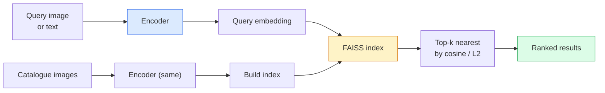

# Wyszukiwanie obrazów i uczenie metryczne (Image Retrieval & Metric Learning)

> System wyszukiwania (retrieval) porządkuje kandydatów według odległości w przestrzeni embeddingów. Uczenie metryczne (metric learning) to dyscyplina kształtowania tej przestrzeni tak, aby odległości znaczyły to, czego oczekujemy.

**Typ:** Build
**Języki:** Python
**Wymagania wstępne:** Faza 4, Lekcja 14 (ViT), Faza 4, Lekcja 18 (CLIP)
**Czas:** ~45 minut

## Cele nauki

- Wyjaśnić funkcje straty triplet, contrastive i proxy-based w uczeniu metrycznym oraz wybrać właściwą dla danego zbioru danych
- Poprawnie zaimplementować normalizację L2 i podobieństwo kosinusowe oraz zrozumieć różnicę między wyszukiwaniem „tego samego obiektu” a „tej samej klasy”
- Zbudować indeks FAISS, przeszukiwać go tekstem i obrazem oraz raportować recall@K dla zbioru zapytań testowych
- Wykorzystać DINOv2, CLIP i SigLIP jako gotowe (off-the-shelf) szkielety embeddingów i wiedzieć, kiedy każdy z nich wygrywa

## Problem

Wyszukiwanie (retrieval) jest wszechobecne w produkcyjnych systemach wizyjnych: wykrywanie duplikatów, odwrotne wyszukiwanie obrazów, wyszukiwanie wizualne ("znajdź podobne produkty"), reidentyfikacja twarzy, re-ID osób w nadzorze wideo, dopasowywanie na poziomie instancji w e-commerce. Pytanie produktowe jest zawsze takie samo: "mając ten obraz zapytania, uszereguj mój katalog".

Dwie decyzje projektowe kształtują cały system. Embedding — jaki model produkuje wektory. Indeks — jak znaleźć najbliższych sąsiadów na dużą skalę. Obie kwestie są w 2026 roku elementami standardowymi (DINOv2 dla embeddingu, FAISS dla indeksu), co podnosi poprzeczkę: trudną częścią jest zdefiniowanie *co liczy się jako podobne* dla danej aplikacji, a następnie ukształtowanie przestrzeni embeddingów tak, aby odległości to odzwierciedlały.

To kształtowanie to właśnie uczenie metryczne. Jest to mała, ale bardzo dochodowa (high-leverage) dyscyplina.

## Koncepcja

### Wyszukiwanie w skrócie



### Cztery rodziny funkcji straty

| Loss | Requires | Pros | Cons |
|------|----------|------|------|
| **Contrastive** | (anchor, positive) + negatywy | Proste, działa z każdym etykietowaniem par | Wolna zbieżność bez wielu negatywów |
| **Triplet** | (anchor, positive, negative) | Intuicyjne; bezpośrednia kontrola marginesu | Mining trudnych trójek (hard-triplet mining) jest kosztowny |
| **NT-Xent / InfoNCE** | Pary + negatywy wybierane w batchu | Skaluje się do dużych batchy | Wymaga dużego batcha lub kolejki momentum |
| **Proxy-based (ProxyNCA)** | Tylko etykiety klas | Szybkie, stabilne, bez miningu | Może przeuczać się na proxy przy małych zbiorach danych |

W większości przypadków produkcyjnych zacznij od wytrenowanego wcześniej szkieletu (pretrained backbone) i dodaj fine-tuning metryczny tylko wtedy, gdy gotowe embeddingi nie dają wystarczających wyników na Twoim zbiorze testowym.

### Triplet loss formalnie

```
L = max(0, ||f(a) - f(p)||^2 - ||f(a) - f(n)||^2 + margin)
```

Przyciągnij anchor `a` blisko do positive `p`, odpychaj go od negative `n`, z `margin` zapewniającym odstęp. Ta trójobrazowa struktura generalizuje się do każdego uporządkowania podobieństwa.

Mining ma znaczenie: łatwe trójki (`n` już daleko od `a`) wnoszą zerową stratę; tylko trudne trójki uczą sieć. Semi-hard mining (`n` dalej niż `p`, ale w obrębie marginesu) to przepis z FaceNet z 2016 roku i wciąż dominuje.

### Podobieństwo kosinusowe vs L2

Dwie metryki, dwie konwencje:

- **Cosine**: kąt między wektorami. Wymaga embeddingów znormalizowanych L2.
- **L2**: odległość euklidesowa. Działa na surowych lub znormalizowanych embeddingach, ale zazwyczaj jest łączona ze znormalizowanymi L2 + kwadratem odległości L2.

Dla większości współczesnych sieci te dwie metryki są równoważne: `||a - b||^2 = 2 - 2 cos(a, b)` gdy `||a|| = ||b|| = 1`. Wybierz konwencję, która odpowiada treningowi Twojego embeddingu; mieszanie ich w sposób niezauważony zmienia znaczenie pojęcia "najbliższy".

### Recall@K

Standardowa metryka wyszukiwania:

```
recall@K = fraction of queries where at least one correct match is in the top K results
```

Raportuj recall@1, @5, @10 razem. Recall@10 powyżej 0.95 z recall@1 poniżej 0.5 oznacza, że przestrzeń embeddingów ma właściwą strukturę, ale ranking jest szumiący — wypróbuj dłuższy fine-tuning lub etap ponownego rankingu (re-ranking).

Dla wykrywania duplikatów ważniejsze jest precision@K, ponieważ każdy fałszywy alarm jest błędem widocznym dla użytkownika. Dla wyszukiwania wizualnego recall@K jest sygnałem produktowym.

### FAISS w jednym paragrafie

Facebook AI Similarity Search. Biblioteka de facto standardowa do wyszukiwania najbliższych sąsiadów. Trzy wybory indeksu:

- `IndexFlatIP` / `IndexFlatL2` — brute force, dokładny, bez treningu. Stosować do ~1M wektorów.
- `IndexIVFFlat` — podział na K komórek, przeszukiwanie tylko najbliższych kilku komórek. Przybliżony, szybki, wymaga danych treningowych.
- `IndexHNSW` — oparty na grafie, najszybszy dla wielu zapytań, duży rozmiar indeksu.

Dla 100k wektorów prawdopodobnie chcesz `IndexFlatIP` na podobieństwie kosinusowym. Dla 10M chcesz `IndexIVFFlat`. Dla 100M+ w połączeniu z kwantyzacją produktową (`IndexIVFPQ`).

### Wyszukiwanie na poziomie instancji vs na poziomie kategorii

Dwa bardzo różne problemy o tej samej nazwie:

- **Poziom kategorii (category-level)** — "znajdź koty w moim katalogu". Podobieństwo warunkowane klasą; gotowe embeddingi CLIP / DINOv2 działają dobrze.
- **Poziom instancji (instance-level)** — "znajdź *ten konkretny produkt* w moim katalogu". Wymaga precyzyjnego rozróżniania wizualnie podobnych obiektów tej samej klasy; gotowe embeddingi dają słabe wyniki; ważny jest fine-tuning z uczeniem metrycznym.

Zawsze zapytaj, który problem rozwiązujesz, przed wyborem modelu.

## Zbuduj to

### Krok 1: Triplet loss

```python
import torch
import torch.nn.functional as F

def triplet_loss(anchor, positive, negative, margin=0.2):
    d_ap = F.pairwise_distance(anchor, positive, p=2)
    d_an = F.pairwise_distance(anchor, negative, p=2)
    return F.relu(d_ap - d_an + margin).mean()
```

Jedna linia. Działa na embeddingach znormalizowanych L2 lub surowych.

### Krok 2: Semi-hard mining

Mając batch embeddingów i etykiet, znajdź najtrudniejszy semi-hard negatyw dla każdego anchora.

```python
def semi_hard_negatives(emb, labels, margin=0.2):
    dist = torch.cdist(emb, emb)
    same_class = labels[:, None] == labels[None, :]
    diff_class = ~same_class
    N = emb.size(0)

    positives = dist.clone()
    positives[~same_class] = float("-inf")
    positives.fill_diagonal_(float("-inf"))
    pos_idx = positives.argmax(dim=1)

    semi_hard = dist.clone()
    semi_hard[same_class] = float("inf")
    d_ap = dist[torch.arange(N), pos_idx].unsqueeze(1)
    semi_hard[dist <= d_ap] = float("inf")
    neg_idx = semi_hard.argmin(dim=1)

    fallback_mask = semi_hard[torch.arange(N), neg_idx] == float("inf")
    if fallback_mask.any():
        hardest = dist.clone()
        hardest[same_class] = float("inf")
        neg_idx = torch.where(fallback_mask, hardest.argmin(dim=1), neg_idx)
    return pos_idx, neg_idx
```

Każdy anchor otrzymuje najtrudniejszy positive w obrębie swojej klasy oraz semi-hard negative, który jest dalej niż positive, ale w obrębie marginesu.

### Krok 3: Recall@K

```python
def recall_at_k(query_emb, gallery_emb, query_labels, gallery_labels, k=1):
    sim = query_emb @ gallery_emb.T
    _, top_k = sim.topk(k, dim=-1)
    matches = (gallery_labels[top_k] == query_labels[:, None]).any(dim=-1)
    return matches.float().mean().item()
```

Top-k według iloczynu skalarnego (inner product) na embeddingach znormalizowanych L2 jest równoważne top-k według podobieństwa kosinusowego. Raportuj średnią proporcję zapytań z przynajmniej jednym poprawnym sąsiadem.

### Krok 4: Złożenie całości

```python
import torch
import torch.nn as nn
from torch.optim import Adam

class Encoder(nn.Module):
    def __init__(self, in_dim=128, emb_dim=64):
        super().__init__()
        self.net = nn.Sequential(
            nn.Linear(in_dim, 128), nn.ReLU(),
            nn.Linear(128, emb_dim),
        )

    def forward(self, x):
        return F.normalize(self.net(x), dim=-1)

torch.manual_seed(0)
num_classes = 6
protos = F.normalize(torch.randn(num_classes, 128), dim=-1)

def sample_batch(bs=32):
    labels = torch.randint(0, num_classes, (bs,))
    x = protos[labels] + 0.15 * torch.randn(bs, 128)
    return x, labels

enc = Encoder()
opt = Adam(enc.parameters(), lr=3e-3)

for step in range(200):
    x, y = sample_batch(32)
    emb = enc(x)
    pos_idx, neg_idx = semi_hard_negatives(emb, y)
    loss = triplet_loss(emb, emb[pos_idx], emb[neg_idx])
    opt.zero_grad(); loss.backward(); opt.step()
```

Po kilkuset krokach klastry embeddingów formują się w jeden klaster na klasę.

## Zastosowanie

Stosy produkcyjne w 2026 roku:

- **DINOv2 + FAISS** — ogólnego przeznaczenia wyszukiwanie wizualne. Działa bez dodatkowego treningu.
- **CLIP + FAISS** — gdy zapytania są tekstowe.
- **Fine-tuned DINOv2 + FAISS** — wyszukiwanie na poziomie instancji, re-ID twarzy, moda, e-commerce.
- **Milvus / Weaviate / Qdrant** — zarządzane wrappery baz wektorowych nad FAISS lub HNSW.

Dla SOTA wyszukiwania na poziomie instancji przepis jest następujący: szkielet DINOv2, dodanie głowicy embeddingu, fine-tuning z funkcją straty triplet lub InfoNCE na parach etykietowanych na poziomie instancji, indeksowanie w FAISS.

## Dostarczenie (Ship It)

Ta lekcja produkuje:

- `outputs/prompt-retrieval-loss-picker.md` — prompt, który wybiera triplet / InfoNCE / ProxyNCA dla danego problemu wyszukiwania.
- `outputs/skill-recall-at-k-runner.md` — skill, który pisze czysty harness ewaluacyjny dla recall@K z podziałami train/val/gallery i właściwym kontraktem danych.

## Ćwiczenia

1. **(Łatwe)** Uruchom powyższy przykład poglądowy. Wykonaj wykres PCA embeddingów przed i po treningu, aby zobaczyć formowanie się sześciu klastrów.
2. **(Średnie)** Dodaj implementację funkcji straty ProxyNCA: jedno wyuczone "proxy" na klasę, standardowa entropia skrośna (cross-entropy) na podobieństwie kosinusowym. Porównaj tempo zbieżności z triplet loss na danych poglądowych.
3. **(Trudne)** Weź 1000 obrazów ze zbioru walidacyjnego ImageNet, oblicz embeddingi przy użyciu DINOv2 przez HuggingFace, zbuduj płaski indeks FAISS i raportuj recall@{1, 5, 10} względem tych samych obrazów jako zapytań (powinno wynosić 1.0) oraz względem wydzielonego podziału z etykietami ImageNet jako ground truth.

## Kluczowe terminy

| Term | What people say | What it actually means |
|------|----------------|----------------------|
| Metric learning | "Shape the space" | Trenowanie encodera tak, aby odległości w jego przestrzeni wyjściowej odzwierciedlały docelowe podobieństwo |
| Triplet loss | "Pull and push" | L = max(0, d(a, p) - d(a, n) + margin); kanoniczna funkcja straty w uczeniu metrycznym |
| Semi-hard mining | "Useful negatives" | Negatywy dalej od anchora niż positive, ale w obrębie marginesu; empirycznie najbardziej informatywne |
| Proxy-based loss | "Class prototypes" | Jedno wyuczone proxy na klasę; entropia skrośna nad podobieństwem do proxy; bez miningu par |
| Recall@K | "Top-K hit rate" | Ułamek zapytań z przynajmniej jednym poprawnym wynikiem w top K |
| Instance retrieval | "Find this exact thing" | Precyzyjne dopasowywanie (fine-grained matching); gotowe cechy zwykle dają słabe wyniki |
| FAISS | "The NN library" | Biblioteka Facebooka do wyszukiwania najbliższych sąsiadów; wspiera indeksy dokładne i przybliżone |
| HNSW | "Graph index" | Hierarchical navigable small world; szybkie przybliżone NN z małym narzutem pamięciowym |

## Dalsze materiały

- [FaceNet: A Unified Embedding for Face Recognition (Schroff et al., 2015)](https://arxiv.org/abs/1503.03832) — artykuł o triplet loss / semi-hard mining
- [In Defense of the Triplet Loss for Person Re-Identification (Hermans et al., 2017)](https://arxiv.org/abs/1703.07737) — praktyczny przewodnik po fine-tuningu z triplet loss
- [FAISS documentation](https://github.com/facebookresearch/faiss/wiki) — każdy indeks, każdy kompromis
- [SMoT: Metric Learning Taxonomy (Kim et al., 2021)](https://arxiv.org/abs/2010.06927) — przegląd współczesnych funkcji straty i ich powiązań
