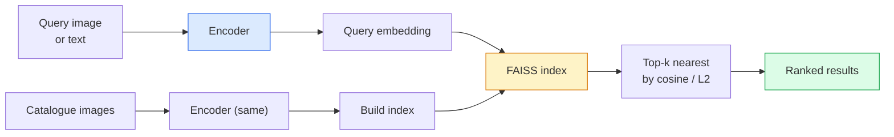

# Pobieranie obrazu i nauka metryk

> System wyszukiwania klasyfikuje kandydatów według odległości w przestrzeni osadzania. Uczenie się metryczne to dyscyplina kształtowania tej przestrzeni, tak aby odległości oznaczały to, czego chcesz.

**Typ:** Kompilacja
**Języki:** Python
**Wymagania wstępne:** Faza 4 Lekcja 14 (ViT), Faza 4 Lekcja 18 (CLIP)
**Czas:** ~45 minut

## Cele nauczania

- Wyjaśnij straty w uczeniu się metryk tripletowych, kontrastowych i zastępczych oraz wybierz właściwą dla danego zbioru danych
- Poprawnie zaimplementuj normalizację L2 i podobieństwo cosinusa i sprawdź różnicę między pobieraniem „tego samego elementu” i „tej samej klasy”
- Zbuduj indeks FAISS, przeprowadź zapytanie za pomocą tekstu i obrazu oraz zgłoś wycofanie@K dla wstrzymanego zestawu zapytań
- Używaj DINOv2, CLIP i SigLIP jako gotowych szkieletów osadzania i wiedz, kiedy każdy wygrywa

## Problem

Wyszukiwanie występuje wszędzie w wizji produkcji: wykrywanie duplikatów, wyszukiwanie odwrotnego obrazu, wyszukiwanie wizualne („znajdź podobne produkty”), ponowna identyfikacja twarzy, ponowna identyfikacja osoby na potrzeby nadzoru, dopasowywanie na poziomie instancji dla handlu elektronicznego. Pytanie dotyczące produktu jest zawsze takie samo: „biorąc pod uwagę ten obraz zapytania, oceń mój katalog”.

Dwie decyzje projektowe kształtują cały system. Osadzanie — jaki model wytwarza wektory. Indeks — jak znaleźć najbliższych sąsiadów na dużą skalę. Obydwa będą dostępne na rynku w 2026 r. (DINOv2 do osadzania, FAISS do indeksu), co podnosi poprzeczkę: najtrudniejsza część polega na zdefiniowaniu *tego, co liczy się jako podobne* w Twojej aplikacji, a następnie ukształtowaniu przestrzeni do osadzania tak, aby odległości były zgodne.

To kształtowanie to uczenie się metryczne. Jest to dyscyplina niewielka, ale o dużym wpływie.

## Koncepcja

### Odzyskiwanie w skrócie



### Cztery rodziny stratne

| Strata | Wymaga | Plusy | Wady |
|------|--------------|------|------|
| **Kontrastowy** | (kotwica, pozytyw) + negatywy | Proste, działa z dowolną etykietą pary | Wolno się zbiegać, bez wielu negatywów |
| **Trójka** | (kotwica, dodatnia, ujemna) | Intuicyjny; bezpośrednia kontrola marży | Wydobywanie twardych trójek jest drogie |
| **NT-Xent / InfoNCE** | Pary + negatywy wydobywane wsadowo | Wagi do dużych partii | Potrzebuje dużej partii lub kolejki pędu |
| **Oparte na serwerze proxy (ProxyNCA)** | Tylko etykiety klas | Szybki, stabilny, bez wydobycia | Może nadmiernie dopasować się do serwerów proxy w małych zestawach danych |

W przypadku większości przypadków użycia produkcyjnego zacznij od wstępnie wyszkolonego szkieletu i dodawaj dostrajanie oparte na uczeniu się metryk tylko wtedy, gdy gotowe osadzenia są słabsze w zestawie testowym.

### Formalna strata potrójna

```
L = max(0, ||f(a) - f(p)||^2 - ||f(a) - f(n)||^2 + margin)
```

Pociągnij kotwicę `a` blisko dodatniej `p`, odsuń ją od ujemnej `n`, z `margin` zapewniającym przerwę. Struktura trzech obrazów uogólnia dowolny porządek podobieństwa.

Wydobycie ma znaczenie: łatwe trójki (`n` już daleko od `a`) nie powodują żadnych strat; tylko twarde trójki uczą sieć. Wydobywanie półtwarde (`n` dalej niż `p`, ale w granicach marginesu) to przepis FaceNet z 2016 r., który nadal dominuje.

### Cosinus podobieństwa vs L2

Dwie metryki, dwie konwencje:

- **Cosinus**: kąt między wektorami. Wymaga osadzania znormalizowanego L2.
- **L2**: Odległość euklidesowa. Działa na surowych lub znormalizowanych osadzaniach, ale zwykle jest łączony z L2-normalizowanym + kwadratowym L2.

W większości nowoczesnych sieci oba są równoważne: `||a - b||^2 = 2 - 2 cos(a, b)` gdy `||a|| = ||b|| = 1`. Wybierz konwencję pasującą do Twojego szkolenia w zakresie osadzania; mieszanie ich po cichu zmienia znaczenie słowa „najbliższy”.

### Przypomnij@K

Standardowa metryka pobierania:

```
recall@K = fraction of queries where at least one correct match is in the top K results
```

Raportuj wycofanie @1, @5, @10 obok siebie. Przywołanie @ 10 powyżej 0,95 z przywołaniem @ 1 poniżej 0,5 oznacza, że ​​przestrzeń do osadzania ma właściwą strukturę, ale ranking jest zaszumiony — spróbuj dłużej dostrajać lub wykonać krok ponownego rankingu.

W przypadku wykrywania duplikatów precyzja @ K ma większe znaczenie, ponieważ każdy fałszywy alarm jest błędem widocznym dla użytkownika. W przypadku wyszukiwania wizualnego, przypomnieć@K jest sygnałem produktu.

### FAISS w jednym akapicie

Wyszukiwanie podobieństw na Facebooku AI. De facto biblioteka do wyszukiwania najbliższego sąsiada. Trzy opcje indeksu:

- `IndexFlatIP` / `IndexFlatL2` — brutalna siła, dokładnie, bez szkolenia. Użyj do ~1M wektorów.
- `IndexIVFFlat` — podziel na komórki K, przeszukaj tylko kilka najbliższych komórek. Przybliżone, szybkie, wymaga danych szkoleniowych.
- `IndexHNSW` — oparty na wykresach, najszybszy dla wielu zapytań, duży rozmiar indeksu.

W przypadku wektorów o długości 100 tys. prawdopodobnie potrzebujesz `IndexFlatIP` na podobieństwie cosinus. Za 10M chcesz `IndexIVFFlat`. Dla 100M+ w połączeniu z kwantyzacją produktu (`IndexIVFPQ`).

### Pobieranie na poziomie instancji a na poziomie kategorii

Dwa bardzo różne problemy o tej samej nazwie:

- **Poziom kategorii** — „znajdź koty w moim katalogu”. Podobieństwo klasowo-warunkowe; gotowe osadzania CLIP/DINOv2 działają dobrze.
- **Poziom instancji** — „znajdź *ten dokładny produkt* w moim katalogu.” Wymaga precyzyjnego rozróżnienia wizualnie podobnych obiektów tej samej klasy; gotowe osadzanie ma słabą wydajność; dostrajanie z nauką metryki ma znaczenie.

Zawsze pytaj, który z nich rozwiązujesz, zanim wybierzesz model.

## Zbuduj to

### Krok 1: Strata trójek

```python
import torch
import torch.nn.functional as F

def triplet_loss(anchor, positive, negative, margin=0.2):
    d_ap = F.pairwise_distance(anchor, positive, p=2)
    d_an = F.pairwise_distance(anchor, negative, p=2)
    return F.relu(d_ap - d_an + margin).mean()
```

Jedna linia. Działa na osadzaniach znormalizowanych L2 lub surowych.

### Krok 2: Wydobywanie półtwarde

Biorąc pod uwagę partię osadzania i etykiet, znajdź dla każdej kotwicy najtwardszy półtwardy negatyw.

```python
def semi_hard_negatives(emb, labels, margin=0.2):
    dist = torch.cdist(emb, emb)
    same_class = labels[:, None] == labels[None, :]
    diff_class = ~same_class
    N = emb.size(0)

    positives = dist.clone()
    positives[~same_class] = float("-inf")
    positives.fill_diagonal_(float("-inf"))
    pos_idx = positives.argmax(dim=1)

    semi_hard = dist.clone()
    semi_hard[same_class] = float("inf")
    d_ap = dist[torch.arange(N), pos_idx].unsqueeze(1)
    semi_hard[dist <= d_ap] = float("inf")
    neg_idx = semi_hard.argmin(dim=1)

    fallback_mask = semi_hard[torch.arange(N), neg_idx] == float("inf")
    if fallback_mask.any():
        hardest = dist.clone()
        hardest[same_class] = float("inf")
        neg_idx = torch.where(fallback_mask, hardest.argmin(dim=1), neg_idx)
    return pos_idx, neg_idx
```

Każda kotwica otrzymuje najtwardszy pozytyw w swojej klasie i półtwardy negatyw, który jest dalej niż pozytyw, ale w granicach marginesu.

### Krok 3: Przywołanie@K

```python
def recall_at_k(query_emb, gallery_emb, query_labels, gallery_labels, k=1):
    sim = query_emb @ gallery_emb.T
    _, top_k = sim.topk(k, dim=-1)
    matches = (gallery_labels[top_k] == query_labels[:, None]).any(dim=-1)
    return matches.float().mean().item()
```

Top-k według iloczynu wewnętrznego na osadzaniach znormalizowanych L2 równa się top-k przez cosinus. Podaj średnią proporcję zapytań z co najmniej jednym poprawnym sąsiadem.

### Krok 4: Składanie tego w całość

```python
import torch
import torch.nn as nn
from torch.optim import Adam

class Encoder(nn.Module):
    def __init__(self, in_dim=128, emb_dim=64):
        super().__init__()
        self.net = nn.Sequential(
            nn.Linear(in_dim, 128), nn.ReLU(),
            nn.Linear(128, emb_dim),
        )

    def forward(self, x):
        return F.normalize(self.net(x), dim=-1)

torch.manual_seed(0)
num_classes = 6
protos = F.normalize(torch.randn(num_classes, 128), dim=-1)

def sample_batch(bs=32):
    labels = torch.randint(0, num_classes, (bs,))
    x = protos[labels] + 0.15 * torch.randn(bs, 128)
    return x, labels

enc = Encoder()
opt = Adam(enc.parameters(), lr=3e-3)

for step in range(200):
    x, y = sample_batch(32)
    emb = enc(x)
    pos_idx, neg_idx = semi_hard_negatives(emb, y)
    loss = triplet_loss(emb, emb[pos_idx], emb[neg_idx])
    opt.zero_grad(); loss.backward(); opt.step()
```

Po kilkuset krokach klastry osadzające tworzą jeden klaster na klasę.

## Użyj tego

Stosy produkcyjne w 2026 roku:

- **DINOv2 + FAISS** — wyszukiwanie wizualne ogólnego przeznaczenia. Działa od ręki.
- **CLIP + FAISS** — gdy zapytania są tekstowe.
- **Dopracowany DINOv2 + FAISS** — pobieranie na poziomie instancji, ponowna identyfikacja twarzy, moda, e-commerce.
- **Milvus / Weaviate / Qdrant** — zarządzane wektorowe opakowania DB wokół FAISS lub HNSW.

W przypadku pobierania instancji SOTA przepis jest następujący: szkielet DINOv2, dodanie głowicy osadzającej, dostrojenie za pomocą trójki lub straty InfoNCE na parach oznaczonych instancjami, indeksowanie w FAISS.

## Wyślij to

Ta lekcja daje:

- `outputs/prompt-retrieval-loss-picker.md` — zachęta, która wybiera triplet / InfoNCE / ProxyNCA dla danego problemu z pobieraniem.
- `outputs/skill-recall-at-k-runner.md` — umiejętność polegająca na pisaniu czystej wiązki ewaluacyjnej dla odwołania@K z podziałem na pociąg/val/galeria i odpowiednim kontraktem danych.

## Ćwiczenia

1. **(Łatwy)** Uruchom powyższy przykład zabawki. Narysuj osadzenie za pomocą PCA przed i po treningu, aby zobaczyć, jak tworzy się sześć klastrów.
2. **(Średni)** Dodaj implementację strat ProxyNCA: jeden wyuczony „proxy” na klasę, standardowa entropia krzyżowa na podobieństwie cosinus. Porównaj prędkość konwergencji ze stratą trójek w danych zabawek.
3. **(Trudne)** Wykonaj 1000 obrazów walidacyjnych ImageNet, osadź w DINOv2 za pośrednictwem HuggingFace, zbuduj płaski indeks FAISS i zgłoś wycofanie@{1, 5, 10} w oparciu o te same obrazy, co zapytania (powinno wynosić 1,0) i w oparciu o ustalony podział z etykietami ImageNet jako podstawową prawdą.

## Kluczowe terminy

| Termin | Co ludzie mówią | Co to właściwie oznacza |
|------|----------------|----------------------|
| Uczenie się metryk | „Kształtuj przestrzeń” | Uczenie kodera tak, aby odległości w jego przestrzeni wyjściowej odzwierciedlały podobieństwo celu |
| Strata potrójna | „Ciągnij i pchnij” | L = max(0, d(a, p) - d(a, n) + margines); kanoniczna strata w uczeniu się metryk |
| Górnictwo półtwarde | „Przydatne negatywy” | Negatywy dalej od kotwicy niż pozytyw, ale w granicach marginesu; empirycznie najbardziej pouczający |
| Strata zastępcza | „Prototypy klas” | Jeden wyuczony pełnomocnik na klasę; entropia krzyżowa względem podobieństwa do proxy; brak wydobywania par |
| Przypomnij @K | „Współczynnik trafień najwyższego K” | Frakcja zapytań z co najmniej jednym poprawnym wynikiem w górnym K |
| Pobieranie instancji | „Znajdź dokładnie tę rzecz” | Dopasowanie drobnoziarniste; gotowe funkcje zwykle są gorsze od |
| FAISS | „Biblioteka NN” | Biblioteka najbliższego sąsiada Facebooka; obsługuje indeksy dokładne i przybliżone |
| HNSW | „Indeks wykresu” | Hierarchiczny, żeglowny mały świat; szybkie przybliżenie NN z małym obciążeniem pamięci |

## Dalsze czytanie

- [FaceNet: A Unified Embedding for Face Recognition (Schroff et al., 2015)](https://arxiv.org/abs/1503.03832) — artykuł poświęcony utracie trójek / półtwardemu wydobyciu
- [W obronie utraty trojaczków w celu ponownej identyfikacji osoby (Hermans et al., 2017)](https://arxiv.org/abs/1703.07737) — praktyczny przewodnik po dostrajaniu trójek
– [Dokumentacja FAISS](https://github.com/facebookresearch/faiss/wiki) — każdy indeks, każdy kompromis
- [SMoT: Metric Learning Taxonomy (Kim et al., 2021)](https://arxiv.org/abs/2010.06927) — badanie współczesnych strat i ich powiązań