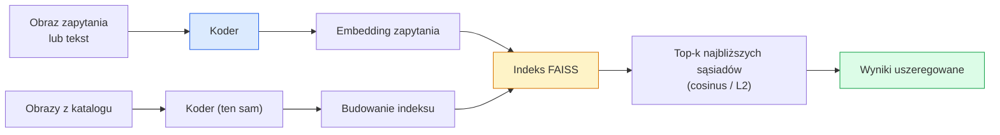

# Wyszukiwanie obrazów i uczenie metryczne (Metric Learning)

> Systemy wyszukiwania (Image Retrieval) szeregują kandydatów na podstawie ich odległości w przestrzeni wektorów cech (przestrzeni osadzeń / embeddingów). Uczenie metryczne (Metric Learning) to technika kształtowania tej przestrzeni w taki sposób, aby odległości geometryczne odpowiadały semantycznemu podobieństwu obiektów.

**Typ lekcji:** Teoria + Praktyka
**Język:** Python
**Wymagania wstępne:** Faza 4, Lekcja 14 (ViT); Faza 4, Lekcja 18 (CLIP)
**Czas wykonania:** ~45 minut

## Cele lekcji

- Zrozumiesz i porównasz funkcje straty stosowane w uczeniu metrycznym: tripletową (triplet loss), kontrastową (contrastive loss) oraz opartą na reprezentantach klas (proxy-based loss), a także dowiesz się, jak dobrać odpowiednią z nich do danego zbioru danych.
- Zaimplementujesz normalizację L2 oraz podobieństwo cosinusowe i przeanalizujesz różnice między wyszukiwaniem dokładnej kopii obiektu (instance-level retrieval) a wyszukiwaniem obiektów z tej samej klasy (category-level retrieval).
- Zbudujesz indeks w bibliotece FAISS, zrealizujesz wyszukiwanie przy użyciu zapytania tekstowego oraz obrazowego i obliczysz metrykę Recall@K na wydzielonym zbiorze testowym.
- Wykorzystasz gotowe modele bazowe, takie jak DINOv2, CLIP oraz SigLIP, do generowania embeddingów i nauczysz się identyfikować scenariusze, w których poszczególne rozwiązania sprawdzają się najlepiej.

## Opis problemu

Systemy wyszukiwania obrazów są kluczowym elementem wielu produkcyjnych wdrożeń komputerowego rozpoznawania obrazów (Computer Vision). Ich zastosowania obejmują m.in. detekcję duplikatów, wyszukiwanie obrazem (reverse image search), wyszukiwanie wizualne produktów w e-commerce („znajdź podobne”), weryfikację twarzy, śledzenie osób w systemach monitoringu (re-identification) oraz dopasowywanie konkretnych egzemplarzy produktów. Kluczowe pytanie biznesowe brzmi zawsze tak samo: „jak na podstawie obrazu zapytania (query) uszeregować elementy z naszego katalogu (gallery)?”.

Całość systemu determinują dwie kluczowe decyzje projektowe: wybór modelu generującego wektory cech (embeddingi) oraz struktury indeksu pozwalającej na szybkie wyszukiwanie najbliższych sąsiadów na dużą skalę. Obecnie standardem rynkowym są gotowe rozwiązania (np. DINOv2 jako generator cech i FAISS jako baza indeksująca). To jednak podnosi poprzeczkę dla inżynierów: najtrudniejszym zadaniem staje się precyzyjne zdefiniowanie, *co dokładnie oznacza podobieństwo* w kontekście danej aplikacji, a następnie odpowiednie ukształtowanie przestrzeni cech, tak aby odzwierciedlała ona te założenia.

Proces ten realizuje się za pomocą uczenia metrycznego (Metric Learning) – wyspecjalizowanej, ale niezwykle istotnej dziedziny uczenia maszynowego.

## Koncepcje teoretyczne

### Schemat procesu wyszukiwania



### Cztery główne rodziny funkcji strat

| Funkcja straty | Wymagane dane | Zalety | Wady |
|------|--------------|------|------|
| **Kontrastowa (Contrastive Loss)** | Pary (kotwica, pozytyw) + próbki negatywne | Prosta koncepcja, działa dla dowolnych par etykietowanych | Wolna zbieżność bez użycia dużej liczby negatywów |
| **Tripletowa (Triplet Loss)** | Trójki (kotwica, pozytyw, negatyw) | Intuicyjna architektura; bezpośrednia kontrola marginesu separacji | Generowanie i wyszukiwanie trudnych trójek (hard triple mining) jest kosztowne obliczeniowo |
| **NT-Xent / InfoNCE** | Pary pozytywne + negatywy w ramach mini-batcha | Doskonale skaluje się przy dużych rozmiarach mini-batcha | Wymaga dużej pamięci GPU lub mechanizmu kolejki (momentum queue) |
| **Oparta na reprezentantach (Proxy-based / ProxyNCA)** | Jedynie etykiety klas | Szybkie uczenie, wysoka stabilność, brak konieczności parowania próbek | Ryzyko przeuczenia reprezentantów (proxies) na małych zbiorach danych |

Dla większości projektów komercyjnych najlepiej zacząć od gotowego, zamrożonego modelu bazowego (backbone) i wdrażać dostrajanie za pomocą uczenia metrycznego dopiero wtedy, gdy podstawowe embeddingi nie zapewniają zadowalającej dokładności na zbiorze walidacyjnym.

### Sformułowanie matematyczne straty tripletowej

```
L = max(0, ||f(a) - f(p)||^2 - ||f(a) - f(n)||^2 + margin)
```

Cel polega na zbliżeniu kotwicy `a` do próbki pozytywnej `p` oraz oddaleniu jej od negatywnej `n` o co najmniej założony margines (`margin`). Struktura oparta na trzech próbkach pozwala na elastyczne definiowanie relacji podobieństwa.

Kluczowym elementem sukcesu jest dobór próbek (mining): łatwe trójki (gdzie próbka negatywna `n` jest już znacznie oddalona od kotwicy `a` w stosunku do `p`) dają zerowy koszt i nie aktualizują wag modelu. Jedynie trudne trójki stymulują proces uczenia sieci. Dobór próbek półtrudnych (semi-hard mining – gdzie negatyw `n` leży dalej od kotwicy niż pozytyw `p`, ale wciąż w obrębie marginesu bezpieczeństwa) to podejście spopularyzowane przez FaceNet w 2015 roku, które do dziś jest powszechnie stosowane.

### Podobieństwo cosinusowe a odległość L2

Są to dwie najpopularniejsze metryki porównywania wektorów:

- **Podobieństwo cosinusowe**: mierzy kąt pomiędzy wektorami. Wymaga uprzedniego znormalizowania embeddingów normą L2.
- **Odległość L2 (Euklidesowa)**: może być obliczana na surowych lub znormalizowanych wektorach, choć w uczeniu metrycznym najczęściej łączy się normalizację L2 z kwadratem odległości L2.

Dla wektorów znormalizowanych L2 zachodzi zależność: `||a - b||^2 = 2 - 2 * cos(a, b)` (przy założeniu `||a|| = ||b|| = 1`). Obie te metryki są wtedy równoważne geometrycznie. Bardzo ważne jest jednak zachowanie spójności: użycie innej metryki w czasie uczenia, a innej przy wyszukiwaniu w bazie (indeksie) może całkowicie zaburzyć wyniki wyszukiwania.

### Metryka Recall@K

Podstawowa metryka w systemach Image Retrieval:

```
Recall@K = odsetek zapytań, dla których przynajmniej jedno poprawne dopasowanie znajduje się w gronie top K wyników
```

Dobrą praktyką jest raportowanie wartości Recall@1, Recall@5 oraz Recall@10 obok siebie. Jeśli np. Recall@10 wynosi powyżej 0.95, ale Recall@1 oscyluje w okolicach 0.5, sugeruje to, że globalna struktura przestrzeni osadzeń jest poprawna, ale lokalne sortowanie jest zaszumiony. W takim przypadku warto wydłużyć proces dostrajania lub wdrożyć etap ponownego szeregowania (reranking).

Przy wykrywania duplikatów ważniejsza staje się metryka Precision@K (ponieważ każdy fałszywy pozytyw bezpośrednio irytuje użytkownika). W przypadku rekomendacji graficznych („podobne produkty”), to Recall@K jest głównym wskaźnikiem jakości systemu.

### Biblioteka FAISS w pigułce

FAISS (Facebook AI Similarity Search) to branżowy standard wyszukiwania najbliższych sąsiadów. Udostępnia trzy podstawowe typy indeksów:

- `IndexFlatIP` / `IndexFlatL2` – wyszukiwanie pełne (brute-force), w 100% dokładne, nie wymaga wcześniejszego treningu indeksu. Idealne dla baz zawierających do ~1 miliona wektorów.
- `IndexIVFFlat` – indeks odwróconego pliku (Inverted File Index). Dzieli przestrzeń na K komórek i przeszukuje tylko te najbliższe zapytaniu. Jest to wyszukiwanie przybliżone (ANN), bardzo szybkie, ale wymaga etapu uczenia indeksu.
- `IndexHNSW` – indeks oparty na grafach (Hierarchical Navigable Small World). Oferuje najkrótszy czas zapytania przy dużej liczbie zapytań, kosztem większego zużycia pamięci RAM na strukturę grafu.

Dla bazy rzędu 100 tysięcy wektorów najlepszym wyborem jest `IndexFlatIP` (oparty na iloczynie skalarnym znormalizowanych wektorów). Przy 10 milionach wektorów warto zastosować `IndexIVFFlat`, natomiast powyżej 100 milionów – `IndexIVFPQ` łączący strukturę odwróconą z kwantyzacją wektorów (Product Quantization).

### Wyszukiwanie obiektów (Instance-level) a wyszukiwanie kategorii (Category-level)

Są to dwa skrajnie różne zadania kryjące się pod tą samą nazwą:

- **Poziom kategorii (Category-level)**: np. „znajdź w bazie zdjęcia wszystkich kotów”. W tym scenariuszu gotowe, zamrożone reprezentacje z modeli CLIP lub DINOv2 radzą sobie doskonale.
- **Poziom instancji (Instance-level)**: np. „znajdź *ten konkretny model* buta o tym konkretnym wzorze”. Wymaga to wychwycenia drobnych różnic pomiędzy wizualnie zbliżonymi obiektami z tej samej klasy. Standardowe, gotowe modele często zawodzą w tym zadaniu; kluczem do sukcesu jest tutaj dedykowane uczenie metryczne.

Przed doborem architektury i zbioru danych zawsze dokładnie określ, który z tych problemów starasz się rozwiązać.

## Implementacja krok po kroku

### Krok 1: Implementacja straty tripletowej (Triplet Loss)

```python
import torch
import torch.nn.functional as F

def triplet_loss(anchor, positive, negative, margin=0.2):
    d_ap = F.pairwise_distance(anchor, positive, p=2)
    d_an = F.pairwise_distance(anchor, negative, p=2)
    return F.relu(d_ap - d_an + margin).mean()
```

Krótka implementacja kompatybilna zarówno z embeddingami surowymi, jak i poddanymi normalizacji L2.

### Krok 2: Generowanie próbek półtrudnych (Semi-Hard Negative Mining)

Na podstawie wygenerowanych embeddingów i odpowiadających im etykiet klas w mini-batchu, algorytm wyznacza dla każdej kotwicy najtrudniejszą próbkę pozytywną oraz optymalną półtrudną próbkę negatywną.

```python
def semi_hard_negatives(emb, labels, margin=0.2):
    dist = torch.cdist(emb, emb)
    same_class = labels[:, None] == labels[None, :]
    diff_class = ~same_class
    N = emb.size(0)

    positives = dist.clone()
    positives[~same_class] = float("-inf")
    positives.fill_diagonal_(float("-inf"))
    pos_idx = positives.argmax(dim=1)

    semi_hard = dist.clone()
    semi_hard[same_class] = float("inf")
    d_ap = dist[torch.arange(N), pos_idx].unsqueeze(1)
    semi_hard[dist <= d_ap] = float("inf")
    neg_idx = semi_hard.argmin(dim=1)

    fallback_mask = semi_hard[torch.arange(N), neg_idx] == float("inf")
    if fallback_mask.any():
        hardest = dist.clone()
        hardest[same_class] = float("inf")
        neg_idx = torch.where(fallback_mask, hardest.argmin(dim=1), neg_idx)
    return pos_idx, neg_idx
```

Każdej próbce kotwicznej przyporządkowywany jest najdalszy (najtrudniejszy) pozytyw z tej samej klasy oraz półtrudny negatyw – położony dalej niż pozytyw, lecz mieszczący się w zdefiniowanym przedziale marginesu.

### Krok 3: Obliczanie metryki Recall@K

```python
def recall_at_k(query_emb, gallery_emb, query_labels, gallery_labels, k=1):
    sim = query_emb @ gallery_emb.T
    _, top_k = sim.topk(k, dim=-1)
    matches = (gallery_labels[top_k] == query_labels[:, None]).any(dim=-1)
    return matches.float().mean().item()
```

Obliczenie iloczynu skalarnego dla wektorów znormalizowanych L2 odpowiada wyznaczeniu podobieństwa cosinusowego. Funkcja zwraca średni odsetek zapytań, dla których w gronie top-K najbliższych sąsiadów znalazł się przynajmniej jeden poprawny rekord.

### Krok 4: Pętla ucząca (pełen przykład)

```python
import torch
import torch.nn as nn
from torch.optim import Adam

class Encoder(nn.Module):
    def __init__(self, in_dim=128, emb_dim=64):
        super().__init__()
        self.net = nn.Sequential(
            nn.Linear(in_dim, 128), nn.ReLU(),
            nn.Linear(128, emb_dim),
        )

    def forward(self, x):
        return F.normalize(self.net(x), dim=-1)

torch.manual_seed(0)
num_classes = 6
protos = F.normalize(torch.randn(num_classes, 128), dim=-1)

def sample_batch(bs=32):
    labels = torch.randint(0, num_classes, (bs,))
    x = protos[labels] + 0.15 * torch.randn(bs, 128)
    return x, labels

enc = Encoder()
opt = Adam(enc.parameters(), lr=3e-3)

for step in range(200):
    x, y = sample_batch(32)
    emb = enc(x)
    pos_idx, neg_idx = semi_hard_negatives(emb, y)
    loss = triplet_loss(emb, emb[pos_idx], emb[neg_idx])
    opt.zero_grad(); loss.backward(); opt.step()
```

Po kilkuset iteracjach optymalizacji wektory zaczną się wyraźnie grupować, tworząc odrębne skupiska dla każdej z klas.

## Zastosowanie w praktyce

Rekomendowane konfiguracje systemów w 2026 roku:

- **DINOv2 + FAISS**: systemy wyszukiwania wizualnego ogólnego przeznaczenia. Bardzo wysoka skuteczność bez konieczności dodatkowego uczenia.
- **CLIP + FAISS**: systemy wyszukiwania multimodalnego (tekst-obraz).
- **Dostrojony model DINOv2 + FAISS**: precyzyjne wyszukiwanie konkretnych obiektów (instance-level retrieval), systemy identyfikacji (re-ID), e-commerce i wyszukiwanie ubrań.
- **Qdrant / Milvus / Weaviate**: wyspecjalizowane, produkcyjne bazy danych wektorowych zarządzające indeksami FAISS lub HNSW.

Najbardziej efektywny schemat (SOTA) dla precyzyjnego wyszukiwania instancji wygląda następująco: pobranie cech z zamrożonego DINOv2, dodanie dedykowanej głowicy rzutującej (projection head), dostrojenie jej z użyciem straty tripletowej lub InfoNCE na danych z etykietami instancji, a następnie indeksowanie wektorów wyjściowych za pomocą FAISS.

## Materiały i pliki wyjściowe

W ramach tej lekcji przygotowano:

- `outputs/prompt-retrieval-loss-picker.md` – szablon promptu wspomagający wybór właściwej funkcji straty (triplet, InfoNCE lub ProxyNCA) w zależności od specyfiki zadania.
- `outputs/skill-recall-at-k-runner.md` – implementacja kompletnego potoku ewaluacji metryki Recall@K z podziałem danych na zbiory uczący, walidacyjny oraz katalog referencyjny (gallery).

## Ćwiczenia praktyczne

1. **(Łatwe)** Uruchom powyższy uproszczony przykład. Dokonaj wizualizacji przestrzeni wektorowej (np. redukując wymiary za pomocą PCA lub t-SNE) przed oraz po zakończeniu uczenia, aby zaobserwować proces formowania się sześciu odrębnych klastrów.
2. **(Średnie)** Zaimplementuj funkcję straty ProxyNCA: utwórz jeden reprezentatywny wektor (proxy) na każdą klasę i optymalizuj klasyczną entropię krzyżową opartą na podobieństwie cosinusowym. Porównaj tempo zbieżności tego modelu ze stratą tripletową na sztucznym zbiorze danych.
3. **(Trudne)** Pobierz 1000 losowych obrazów walidacyjnych ze zbioru ImageNet, wygeneruj dla nich embeddingi za pomocą modelu DINOv2 (np. z biblioteki Hugging Face), utwórz płaski indeks w bibliotece FAISS i wyznacz wartości Recall@1, Recall@5 oraz Recall@10, traktując obrazy jako zapytania, a przypisane etykiety ImageNet jako punkt odniesienia (ground truth).

## Słownik pojęć

| Pojęcie | Obiegowe rozumienie | Definicja techniczna |
|------|----------------|----------------------|
| Uczenie metryczne (Metric Learning) | „Kształtowanie przestrzeni cech” | Proces strojenia kodera w taki sposób, aby odległości geometryczne w wyjściowej przestrzeni reprezentacji odzwierciedlały semantyczne podobieństwo obiektów |
| Strata tripletowa (Triplet Loss) | „Przyciąganie pozytywów, odpychanie negatywów” | `L = max(0, d(a, p) - d(a, n) + margin)` – klasyczna funkcja straty używana w uczeniu metrycznym |
| Dobór próbek półtrudnych (Semi-hard mining) | „Użyteczne negatywy” | Technika selekcji próbek negatywnych, które leżą dalej od kotwicy niż próbka pozytywna, ale ich odległość mieści się w granicach marginesu bezpieczeństwa; empirycznie daje najlepsze efekty stabilizacyjne |
| Strata oparta na reprezentantach (Proxy loss) | „Prototypy klas” | Definiowanie jednego, uczącego się wektora wzorcowego (proxy) dla każdej klasy; funkcja kosztu optymalizuje podobieństwo próbek do ich reprezentantów, eliminując kosztowny proces parowania danych |
| Recall@K | „Skuteczność wyszukiwania w TOP K” | Ułamek zapytań, dla których co najmniej jeden poprawny wynik znalazł się w czołowych K pozycjach listy wynikowej |
| Wyszukiwanie instancji (Instance-level) | „Identyfikacja konkretnego obiektu” | Drobnoziarniste dopasowanie (np. identyczny produkt); gotowe, zamrożone modele zazwyczaj wykazują tu niewystarczającą dokładność |
| FAISS | „Baza wektorowa / indeksująca” | Biblioteka firmy Meta służąca do efektywnego wyszukiwania najbliższych sąsiadów w przestrzeniach wielowymiarowych; obsługuje wyszukiwanie dokładne oraz przybliżone (ANN) |
| HNSW | „Grafowy indeks sąsiedztwa” | Skrót od Hierarchical Navigable Small World – algorytm oparty na strukturze grafów wielopoziomowych; zapewnia błyskawiczne wyszukiwanie przybliżone przy nieco większym zużyciu pamięci RAM |

## Literatura i materiały uzupełniające

- [FaceNet: A Unified Embedding for Face Recognition (Schroff et al., 2015)](https://arxiv.org/abs/1503.03832) – przełomowa praca wprowadzająca stratę tripletową i mechanizm semi-hard mining.
- [In Defense of the Triplet Loss for Person Re-Identification (Hermans et al., 2017)](https://arxiv.org/abs/1703.07737) – praktyczny poradnik optymalizacji i stosowania straty tripletowej.
- [Dokumentacja projektu FAISS](https://github.com/facebookresearch/faiss/wiki) – kompletny przewodnik po typach indeksów i kompromisach wydajnościowych.
- [A Taxonomy of Metric Learning Losses (Kim et al., 2021)](https://arxiv.org/abs/2010.06927) – przegląd i usystematyzowanie współczesnych funkcji straty w uczeniu metrycznym.
