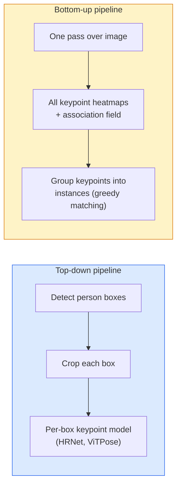

# Wykrywanie punktów charakterystycznych i estymacja pozy

> Poza to zbiór uporządkowanych punktów charakterystycznych. Detektor punktów charakterystycznych to regresor map ciepła (heatmap). Wszystko inne to księgowość.

**Typ:** Build
**Języki:** Python
**Wymagania wstępne:** Faza 4 Lekcja 06 (Detekcja), Faza 4 Lekcja 07 (U-Net)
**Czas:** ~45 minut

## Cele nauki

- Rozróżnienie podejść top-down i bottom-up w estymacji pozy oraz wskazanie, kiedy stosuje się każde z nich
- Regresja map ciepła dla K punktów charakterystycznych z celem w postaci gaussianu na każdy punkt oraz ekstrakcja współrzędnych punktów podczas inferencji
- Wyjaśnienie Part Affinity Fields (PAF) i sposobu, w jaki potoki bottom-up łączą punkty charakterystyczne w instancje
- Użycie MediaPipe Pose lub MMPose do produkcyjnej estymacji punktów charakterystycznych oraz zrozumienie formatu ich wyjścia

## Problem

Zadania związane z punktami charakterystycznymi kryją się pod wieloma nazwami: poza człowieka (17 stawów ciała), punkty charakterystyczne twarzy (68 lub 478 punktów), ręka (21 punktów), poza zwierzęcia, poza obiektu robotycznego, punkty anatomiczne w medycynie. Każde z tych zadań ma tę samą strukturę: wykryć K dyskretnych punktów na obiekcie i wyznaczyć ich współrzędne (x, y).

Estymacja pozy jest podstawą motion capture, aplikacji fitness, analityki sportowej, kontroli gestami, animacji, AR przymierzania ubrań oraz chwytania obiektów przez roboty. Przypadek 2D jest dojrzały; poza 3D (estymacja pozycji stawów we współrzędnych świata na podstawie pojedynczej kamery) jest aktualnym frontem badawczym.

Pytanie inżynieryjne dotyczy skali. Poza jednej osoby na jednym obrazie to problem na poziomie 20ms. Poza wielu osób w tłumie przy 30 fps to zupełnie inny problem, wymagający innych architektur.

## Koncepcja

### Top-down a bottom-up



- **Top-down** — najpierw wykrywane są osoby, a następnie na każdym wycinku obrazu uruchamiany jest model punktów charakterystycznych dla jednej osoby. Najwyższa dokładność; czas skaluje się liniowo z liczbą osób.
- **Bottom-up** — jeden przebieg sieci przewiduje wszystkie punkty charakterystyczne wraz z polem asocjacji; następnie są one grupowane. Czas działania jest stały niezależnie od liczby osób w tłumie.

Top-down (HRNet, ViTPose) prowadzi pod względem dokładności; bottom-up (OpenPose, HigherHRNet) prowadzi pod względem przepustowości w scenach z dużym tłumem.

### Regresja map ciepła

Zamiast bezpośrednio regresować `(x, y)`, dla każdego punktu charakterystycznego przewidywana jest mapa ciepła o rozmiarze `H x W` z plamą gaussowską wycentrowaną w prawdziwej lokalizacji.

```
target[k, y, x] = exp(-((x - cx_k)^2 + (y - cy_k)^2) / (2 sigma^2))
```

Podczas inferencji argmax każdej mapy ciepła jest przewidywaną lokalizacją punktu charakterystycznego.

Dlaczego mapy ciepła działają lepiej niż bezpośrednia regresja: struktura przestrzenna sieci (mapa cech konwolucyjnych) naturalnie odpowiada przestrzennemu wyjściu. Cele gaussowskie wprowadzają również regularyzację — mały błąd lokalizacji generuje mały koszt (loss), a nie zero.

### Lokalizacja subpikselowa

Argmax daje współrzędne całkowite. Aby uzyskać precyzję subpikselową, można dopracować wynik, dopasowując parabolę do argmax i jego sąsiadów, lub wykorzystać dobrze znane przesunięcie `(dx, dy) = 0.25 * (heatmap[y, x+1] - heatmap[y, x-1], ...)`.

### Part Affinity Fields (PAF)

Sztuczka OpenPose dla asocjacji w podejściu bottom-up. Dla każdej pary połączonych punktów charakterystycznych (np. lewe ramię i lewy łokieć) przewidywane jest 2-kanałowe pole, które koduje wektor jednostkowy wskazujący od jednego punktu do drugiego. Aby przypisać ramię do jego łokcia, oblicza się całkę PAF wzdłuż linii łączącej kandydujące pary; para o najwyższej wartości całki zostaje dopasowana.

```
For each connection (limb):
  PAF channels: 2 (unit vector x, y)
  Line integral: sum over sample points of (PAF . line_direction)
  Higher integral = stronger match
```

Eleganckie podejście, skalujące się do dowolnej liczby osób w tłumie bez konieczności wycinania obrazu dla każdej osoby.

### Punkty charakterystyczne COCO

Standardowy zbiór danych dla pozy ciała: 17 punktów charakterystycznych na osobę, z metrykami PCK (Percentage of Correct Keypoints) oraz OKS (Object Keypoint Similarity). OKS jest odpowiednikiem IoU dla punktów charakterystycznych i to właśnie tę miarę raportuje COCO mAP@OKS.

### 2D a 3D

- **Poza 2D** — współrzędne obrazu; rozwiązane na poziomie produkcyjnym (MediaPipe, HRNet, ViTPose).
- **Poza 3D** — współrzędne świata / kamery; wciąż aktywny obszar badań. Typowe podejścia:
  - Podniesienie predykcji 2D do 3D za pomocą małego MLP (VideoPose3D).
  - Bezpośrednia regresja 3D z obrazu (PyMAF, MHFormer).
  - Konfiguracje wielu kamer (CMU Panoptic) jako prawda referencyjna (ground truth).

## Zbuduj to

### Krok 1: Cel w postaci gaussowskiej mapy ciepła

```python
import numpy as np
import torch

def gaussian_heatmap(size, cx, cy, sigma=2.0):
    yy, xx = np.meshgrid(np.arange(size), np.arange(size), indexing="ij")
    return np.exp(-((xx - cx) ** 2 + (yy - cy) ** 2) / (2 * sigma ** 2)).astype(np.float32)

hm = gaussian_heatmap(64, 32, 32, sigma=2.0)
print(f"peak: {hm.max():.3f} at ({hm.argmax() % 64}, {hm.argmax() // 64})")
```

Mapy ciepła dla poszczególnych punktów charakterystycznych, ułożone wzdłuż osi kanałów, dają pełny tensor celu.

### Krok 2: Mała głowica punktów charakterystycznych

Model w stylu U-Net, który zwraca K kanałów map ciepła.

```python
import torch.nn as nn
import torch.nn.functional as F

class TinyKeypointNet(nn.Module):
    def __init__(self, num_keypoints=4, base=16):
        super().__init__()
        self.down1 = nn.Sequential(nn.Conv2d(3, base, 3, 2, 1), nn.ReLU(inplace=True))
        self.down2 = nn.Sequential(nn.Conv2d(base, base * 2, 3, 2, 1), nn.ReLU(inplace=True))
        self.mid = nn.Sequential(nn.Conv2d(base * 2, base * 2, 3, 1, 1), nn.ReLU(inplace=True))
        self.up1 = nn.ConvTranspose2d(base * 2, base, 2, 2)
        self.up2 = nn.ConvTranspose2d(base, num_keypoints, 2, 2)

    def forward(self, x):
        h1 = self.down1(x)
        h2 = self.down2(h1)
        h3 = self.mid(h2)
        u1 = self.up1(h3)
        return self.up2(u1)
```

Wejście `(N, 3, H, W)`, wyjście `(N, K, H, W)`. Funkcja kosztu to MSE per-piksel względem celów gaussowskich.

### Krok 3: Inferencja — ekstrakcja współrzędnych punktów charakterystycznych

```python
def heatmap_to_coords(heatmaps):
    """
    heatmaps: (N, K, H, W)
    returns:  (N, K, 2) float coordinates in image pixels
    """
    N, K, H, W = heatmaps.shape
    hm = heatmaps.reshape(N, K, -1)
    idx = hm.argmax(dim=-1)
    ys = (idx // W).float()
    xs = (idx % W).float()
    return torch.stack([xs, ys], dim=-1)

coords = heatmap_to_coords(torch.randn(2, 4, 32, 32))
print(f"coords: {coords.shape}")  # (2, 4, 2)
```

Jedna linia kodu podczas inferencji. Dla dopracowania subpikselowego należy interpolować wokół argmax.

### Krok 4: Syntetyczny zbiór danych z punktami charakterystycznymi

Prosto: narysuj cztery punkty na białym płótnie i nauczyj model je przewidywać.

```python
def make_synthetic_sample(size=64):
    img = np.ones((3, size, size), dtype=np.float32)
    rng = np.random.default_rng()
    kps = rng.integers(8, size - 8, size=(4, 2))
    for cx, cy in kps:
        img[:, cy - 2:cy + 2, cx - 2:cx + 2] = 0.0
    hms = np.stack([gaussian_heatmap(size, cx, cy) for cx, cy in kps])
    return img, hms, kps
```

Wystarczająco łatwe, aby mały model nauczył się tego w ciągu minuty.

### Krok 5: Trenowanie

```python
model = TinyKeypointNet(num_keypoints=4)
opt = torch.optim.Adam(model.parameters(), lr=3e-3)

for step in range(200):
    batch = [make_synthetic_sample() for _ in range(16)]
    imgs = torch.from_numpy(np.stack([b[0] for b in batch]))
    hms = torch.from_numpy(np.stack([b[1] for b in batch]))
    pred = model(imgs)
    # Upsample pred to full resolution
    pred = F.interpolate(pred, size=hms.shape[-2:], mode="bilinear", align_corners=False)
    loss = F.mse_loss(pred, hms)
    opt.zero_grad(); loss.backward(); opt.step()
```

## Użyj tego

- **MediaPipe Pose** — produkcyjny estymator pozy od Google; udostępnia środowiska wykonawcze WebGL oraz mobilne z latencją poniżej 10ms.
- **MMPose** (OpenMMLab) — wszechstronna baza kodu badawczego; zawiera każdą architekturę SOTA wraz z wytrenowanymi wagami.
- **YOLOv8-pose** — najszybsza realnoczasowa estymacja pozy wielu osób w jednym przebiegu sieci.
- **transformers HumanDPT / PoseAnything** — nowsze podejścia wizyjno-językowe dla estymacji pozy w otwartym słownictwie (dowolny obiekt, dowolny zbiór punktów charakterystycznych).

## Wypchnij to

Ta lekcja tworzy:

- `outputs/prompt-pose-stack-picker.md` — prompt, który wybiera MediaPipe / YOLOv8-pose / HRNet / ViTPose w oparciu o latencję, liczbę osób w tłumie oraz potrzebę 2D vs 3D.
- `outputs/skill-heatmap-to-coords.md` — skill, który zapisuje subpikselową procedurę konwersji mapy ciepła na współrzędne, używaną przez każdy produkcyjny model pozy.

## Ćwiczenia

1. **(Łatwe)** Wytrenuj mały model punktów charakterystycznych na syntetycznym zbiorze danych z 4 punktami. Podaj średni błąd L2 między przewidywanymi i prawdziwymi punktami charakterystycznymi po 200 krokach.
2. **(Średnie)** Dodaj dopracowanie subpikselowe: mając pozycję argmax, dopasuj 1D parabolę wzdłuż osi x i y na podstawie sąsiednich pikseli. Podaj zysk dokładności względem argmax na liczbach całkowitych.
3. **(Trudne)** Zbuduj syntetyczny zbiór danych z dwiema osobami, gdzie każdy obraz przedstawia dwie instancje wzorca z 4 punktami charakterystycznymi. Wytrenuj potok bottom-up z PAF, który przewiduje, do której instancji należy dany punkt charakterystyczny, i oceń wynik za pomocą OKS.

## Kluczowe terminy

| Termin | Co się mówi | Co to faktycznie znaczy |
|------|----------------|----------------------|
| Keypoint (punkt charakterystyczny) | "Punkt orientacyjny" | Konkretny, uporządkowany punkt na obiekcie (staw, narożnik, cecha charakterystyczna) |
| Pose (poza) | "Szkielet" | Uporządkowany zbiór punktów charakterystycznych należących do jednej instancji |
| Top-down | "Najpierw detekcja, potem poza" | Dwuetapowy potok: detektor osób + model punktów charakterystycznych dla każdego wycinka; najwyższa dokładność |
| Bottom-up | "Najpierw poza, grupowanie później" | Jednoprzebiegowa predykcja wszystkich punktów charakterystycznych + grupowanie; czas stały niezależnie od liczby osób w tłumie |
| Heatmap (mapa ciepła) | "Cel gaussowski" | Tensor H x W dla każdego punktu charakterystycznego z maksimum w prawdziwej lokalizacji; preferowany cel regresji |
| PAF | "Part Affinity Field" | 2-kanałowe pole wektorów jednostkowych kodujące kierunki kończyn; używane do grupowania punktów charakterystycznych w instancje |
| OKS | "IoU dla punktów charakterystycznych" | Object Keypoint Similarity; metryka COCO dla pozy |
| HRNet | "High-Resolution Net" | Dominująca architektura punktów charakterystycznych typu top-down; zachowuje cechy o wysokiej rozdzielczości na każdym etapie |

## Dalsze materiały

- [OpenPose (Cao et al., 2017)](https://arxiv.org/abs/1812.08008) — podejście bottom-up z PAF; wciąż najlepszy opis tej metody
- [HRNet (Sun et al., 2019)](https://arxiv.org/abs/1902.09212) — referencyjna architektura top-down
- [ViTPose (Xu et al., 2022)](https://arxiv.org/abs/2204.12484) — zwykły ViT jako backbone dla pozy; aktualny SOTA w wielu benchmarkach
- [MediaPipe Pose](https://developers.google.com/mediapipe/solutions/vision/pose_landmarker) — produkcyjna estymacja pozy w czasie rzeczywistym; najszybszy wdrożony stos w 2026 roku
