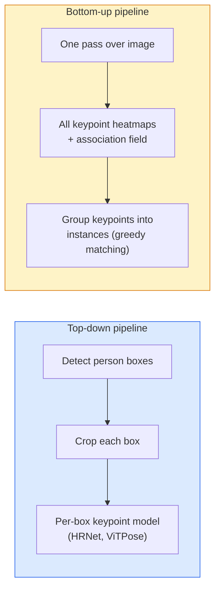

# Wykrywanie kluczowych punktów i szacowanie pozycji

> Poza to zbiór uporządkowanych punktów kluczowych. Detektorem punktu kluczowego jest regresor mapy cieplnej. Cała reszta to księgowość.

**Typ:** Kompilacja
**Języki:** Python
**Wymagania wstępne:** Faza 4 Lekcja 06 (Wykrywanie), Faza 4 Lekcja 07 (U-Net)
**Czas:** ~45 minut

## Cele nauczania

- Rozróżnij ocenę pozycji od góry do dołu i od dołu do góry oraz określ, kiedy każda z nich jest używana
- Regresuj mapy cieplne dla K punktów kluczowych z docelowym współczynnikiem Gaussa na punkt kluczowy i wyodrębniaj współrzędne punktu kluczowego podczas wnioskowania
- Wyjaśnij pola powinowactwa części (PAF) i sposób, w jaki potoki oddolne łączą punkty kluczowe z instancjami
- Użyj MediaPipe Pose lub MMPose do oszacowania kluczowych punktów produkcyjnych i poznaj ich format wyjściowy

## Problem

Zadania z punktami kluczowymi kryją się pod wieloma nazwami: pozycja człowieka (17 stawów ciała), punkty orientacyjne twarzy (68 lub 478 punktów), ręka (21 punktów), pozycja zwierzęcia, pozycja obiektu robota, punkty orientacyjne anatomii medycznej. Każdy z nich ma tę samą strukturę: wykrywa K dyskretnych punktów na obiekcie i wyprowadza ich współrzędne (x, y).

Oszacowanie pozycji to podstawa przechwytywania ruchu, aplikacji fitness, analityki sportowej, kontroli gestów, animacji, próbowania AR i chwytania robotycznego. Sprawa 2D jest dojrzała; Pozycja 3D (szacowanie wspólnych pozycji we współrzędnych świata za pomocą jednej kamery) to obecna granica badań.

Kwestią inżynierską jest skala. Pojedynczy obraz i poza jednej osoby to problem 20 ms. Pozycja wielu osób w tłumie przy 30 klatkach na sekundę to inny problem w przypadku różnych architektur.

## Koncepcja

### Od góry do dołu vs od dołu do góry



- **Z góry na dół** — najpierw wykryj ludzi, a następnie uruchom model kluczowych punktów dla każdej osoby w przypadku każdej uprawy. Najwyższa dokładność; skaluje się liniowo wraz z liczbą osób.
- **Od dołu do góry** — jedno podanie w przód przewiduje wszystkie kluczowe punkty plus pole skojarzenia; pogrupuj je. Stały czas niezależnie od wielkości tłumu.

Top-down (HRNet, ViTPose) jest liderem dokładności; oddolne (OpenPose, HigherHRNet) jest liderem przepustowości w przypadku zatłoczonych scen.

### Regresja mapy cieplnej

Zamiast bezpośrednio regresować `(x, y)`, przewiduj mapę cieplną `H x W` na każdy punkt kluczowy z plamą Gaussa wyśrodkowaną w prawdziwej lokalizacji.

```
target[k, y, x] = exp(-((x - cx_k)^2 + (y - cy_k)^2) / (2 sigma^2))
```

Podsumowując, argmax każdej mapy cieplnej jest przewidywaną lokalizacją punktu kluczowego.

Dlaczego mapy cieplne działają lepiej niż regresja bezpośrednia: struktura przestrzenna sieci (mapa funkcji konw.) w naturalny sposób dopasowuje się do wyników przestrzennych. Cele Gaussa również ulegają regularyzacji — mały błąd lokalizacji powoduje niewielką stratę, a nie zero.

### Lokalizacja subpikselowa

Argmax podaje współrzędne całkowite. Aby uzyskać precyzję subpikselową, dopracuj parabolę do argmax i jej sąsiadów lub użyj dobrze znanego kierunku przesunięcia `(dx, dy) = 0.25 * (heatmap[y, x+1] - heatmap[y, x-1], ...)`.

### Pola powinowactwa części (PAF)

Sztuczka OpenPose polegająca na skojarzeniu oddolnym. Dla każdej pary połączonych punktów kluczowych (np. od lewego ramienia do lewego łokcia) przewiduj pole 2-kanałowe, które koduje wektor jednostkowy skierowany od jednego do drugiego. Aby powiązać ramię z łokciem, zintegruj PAF wzdłuż linii łączącej pary kandydatów; dopasowywana jest para z najwyższą całką.

```
For each connection (limb):
  PAF channels: 2 (unit vector x, y)
  Line integral: sum over sample points of (PAF . line_direction)
  Higher integral = stronger match
```

Eleganckie i skalowane do dowolnej wielkości tłumu bez upraw na osobę.

### Kluczowe punkty COCO

Standardowy zestaw danych o pozycjach ciała: 17 kluczowych punktów na osobę, PCK (procent prawidłowych punktów kluczowych) i OKS (podobieństwo kluczowych punktów obiektu) jako metryki. OKS jest kluczowym odpowiednikiem IoU i to właśnie raportuje COCO mAP@OKS.

### 2D kontra 3D

- **Poza 2D** — współrzędne obrazu; rozwiązane przy jakości produkcyjnej (MediaPipe, HRNet, ViTPose).
- **Poza 3D** — współrzędne świata/kamery; nadal aktywne badania. Typowe podejścia:
  - Podnieś prognozy 2D do 3D za pomocą małego MLP (VideoPose3D).
  - Bezpośrednia regresja 3D z obrazu (PyMAF, MHFormer).
  - Konfiguracje z wieloma widokami (CMU Panoptic) dla uzyskania prawdy o ziemi.

## Zbuduj to

### Krok 1: Docelowa mapa cieplna Gaussa

```python
import numpy as np
import torch

def gaussian_heatmap(size, cx, cy, sigma=2.0):
    yy, xx = np.meshgrid(np.arange(size), np.arange(size), indexing="ij")
    return np.exp(-((xx - cx) ** 2 + (yy - cy) ** 2) / (2 * sigma ** 2)).astype(np.float32)

hm = gaussian_heatmap(64, 32, 32, sigma=2.0)
print(f"peak: {hm.max():.3f} at ({hm.argmax() % 64}, {hm.argmax() // 64})")
```

Mapy cieplne poszczególnych punktów kluczowych ułożone wzdłuż osi kanału dają pełny tensor docelowy.

### Krok 2: Mała głowa typu keypoint

Model w stylu U-Net, który generuje K kanałów mapy cieplnej.

```python
import torch.nn as nn
import torch.nn.functional as F

class TinyKeypointNet(nn.Module):
    def __init__(self, num_keypoints=4, base=16):
        super().__init__()
        self.down1 = nn.Sequential(nn.Conv2d(3, base, 3, 2, 1), nn.ReLU(inplace=True))
        self.down2 = nn.Sequential(nn.Conv2d(base, base * 2, 3, 2, 1), nn.ReLU(inplace=True))
        self.mid = nn.Sequential(nn.Conv2d(base * 2, base * 2, 3, 1, 1), nn.ReLU(inplace=True))
        self.up1 = nn.ConvTranspose2d(base * 2, base, 2, 2)
        self.up2 = nn.ConvTranspose2d(base, num_keypoints, 2, 2)

    def forward(self, x):
        h1 = self.down1(x)
        h2 = self.down2(h1)
        h3 = self.mid(h2)
        u1 = self.up1(h3)
        return self.up2(u1)
```

Wejście `(N, 3, H, W)`, wyjście `(N, K, H, W)`. Strata to MSE na piksel w stosunku do celów Gaussa.

### Krok 3: Wnioskowanie — wyodrębnij współrzędne punktu kluczowego

```python
def heatmap_to_coords(heatmaps):
    """
    heatmaps: (N, K, H, W)
    returns:  (N, K, 2) float coordinates in image pixels
    """
    N, K, H, W = heatmaps.shape
    hm = heatmaps.reshape(N, K, -1)
    idx = hm.argmax(dim=-1)
    ys = (idx // W).float()
    xs = (idx % W).float()
    return torch.stack([xs, ys], dim=-1)

coords = heatmap_to_coords(torch.randn(2, 4, 32, 32))
print(f"coords: {coords.shape}")  # (2, 4, 2)
```

Jedna linia przy wnioskowaniu. Aby uzyskać udoskonalenie subpikseli, interpoluj wokół argmax.

### Krok 4: Syntetyczny zbiór danych kluczowych punktów

Proste: narysuj cztery punkty na białym płótnie i naucz się je przewidywać.

```python
def make_synthetic_sample(size=64):
    img = np.ones((3, size, size), dtype=np.float32)
    rng = np.random.default_rng()
    kps = rng.integers(8, size - 8, size=(4, 2))
    for cx, cy in kps:
        img[:, cy - 2:cy + 2, cx - 2:cx + 2] = 0.0
    hms = np.stack([gaussian_heatmap(size, cx, cy) for cx, cy in kps])
    return img, hms, kps
```

Wystarczająco łatwe, aby mały model mógł się tego nauczyć w ciągu minuty.

### Krok 5: Trening

```python
model = TinyKeypointNet(num_keypoints=4)
opt = torch.optim.Adam(model.parameters(), lr=3e-3)

for step in range(200):
    batch = [make_synthetic_sample() for _ in range(16)]
    imgs = torch.from_numpy(np.stack([b[0] for b in batch]))
    hms = torch.from_numpy(np.stack([b[1] for b in batch]))
    pred = model(imgs)
    # Upsample pred to full resolution
    pred = F.interpolate(pred, size=hms.shape[-2:], mode="bilinear", align_corners=False)
    loss = F.mse_loss(pred, hms)
    opt.zero_grad(); loss.backward(); opt.step()
```

## Użyj tego

- **MediaPipe Pose** — narzędzie Google do szacowania pozycji produkcyjnych; udostępnia środowiska wykonawcze WebGL + dla urządzeń mobilnych z opóźnieniami poniżej 10 ms.
- **MMPose** (OpenMMLab) — kompleksowa baza kodów badawczych; każda architektura SOTA z wstępnie wyszkolonymi wagami.
- **YOLOv8-pose** — najszybsza pozycja wieloosobowa w czasie rzeczywistym z jednym podaniem do przodu.
- **transformers HumanDPT / PoseAnything** — nowsze podejście do języka wizyjnego dla pozycji z otwartym słownictwem (dowolny obiekt, dowolny zestaw punktów kluczowych).

## Wyślij to

Ta lekcja daje:

- `outputs/prompt-pose-stack-picker.md` — monit, który wybiera MediaPipe / YOLOv8-pose / HRNet / ViTPose, biorąc pod uwagę opóźnienie, wielkość tłumu oraz potrzeby 2D i 3D.
- `outputs/skill-heatmap-to-coords.md` — umiejętność polegająca na pisaniu subpikselowej procedury przekształcania mapy cieplnej w współrzędne używanej przez każdy model pozycji produkcyjnej.

## Ćwiczenia

1. **(Łatwy)** Wytrenuj mały model punktów kluczowych na syntetycznym 4-punktowym zestawie danych. Zgłoś średni błąd L2 między przewidywanymi i prawdziwymi punktami kluczowymi po 200 krokach.
2. **(Średni)** Dodaj udoskonalenie subpikseli: biorąc pod uwagę pozycję argmax, dopasuj parabolę 1D wzdłuż x i y od sąsiednich pikseli. Zgłoś wzrost dokładności w funkcji całkowitej argmax.
3. **(Trudny)** Zbuduj 2-osobowy syntetyczny zbiór danych, w którym każdy obraz przedstawia dwa wystąpienia wzoru składającego się z 4 kluczowych punktów. Trenuj potok oddolny za pomocą PAF, które przewidują, który punkt kluczowy należy do której instancji, i oceniaj OKS.

## Kluczowe terminy

| Termin | Co ludzie mówią | Co to właściwie oznacza |
|------|----------------|----------------------|
| Kluczowy punkt | „Punkt orientacyjny” | Określony uporządkowany punkt obiektu (połączenie, narożnik, element) |
| Poza | „Szkielet” | Uporządkowany zbiór punktów kluczowych należących do jednej instancji |
| Z góry na dół | „Wykryj, a następnie ułóż” | Dwuetapowy rurociąg: wykrywacz osób + model punktu kluczowego dla poszczególnych upraw; najwyższa dokładność |
| Od dołu do góry | „Najpierw pozuj, później grupuj” | Jednoprzebiegowe przewidywanie wszystkich punktów kluczowych + grupowanie; stały czas wielkości tłumu |
| Mapa cieplna | „Cel Gaussa” | Tensor wys. x szer. na punkt kluczowy ze szczytem w prawdziwym miejscu; preferowany cel regresji |
| PAF | „Pole powinowactwa części” | 2-kanałowe pole wektora jednostkowego kodujące kierunki kończyn; używany do grupowania punktów kluczowych w instancje |
| OK | „Kluczowy IoU” | Podobieństwo punktów kluczowych obiektu; metryka COCO dla pozy |
| HRNet | „Sieć wysokiej rozdzielczości” | Dominująca architektura punktów kluczowych typu top-down; zachowuje funkcje wysokiej rozdzielczości przez cały czas |

## Dalsze czytanie

- [OpenPose (Cao et al., 2017)](https://arxiv.org/abs/1812.08008) — oddolne z PAF; wciąż najlepszy opis podejścia
- [HRNet (Sun et al., 2019)](https://arxiv.org/abs/1902.09212) — architektura referencyjna typu top-down
- [ViTPose (Xu et al., 2022)](https://arxiv.org/abs/2204.12484) — zwykły ViT jako szkielet pozy; obecna SOTA w wielu benchmarkach
- [MediaPipe Pose](https://developers.google.com/mediapipe/solutions/vision/pose_landmarker) — pozycja produkcyjna w czasie rzeczywistym; najszybciej wdrożony stos w 2026 r