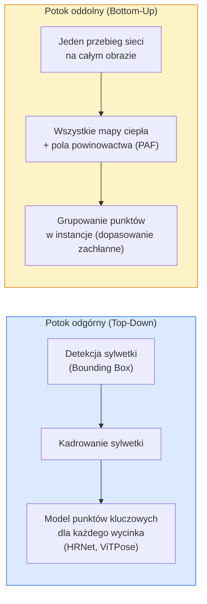

# Detekcja punktów kluczowych i szacowanie pozycji (Keypoint Detection & Pose Estimation)

> Poza (pose) to uporządkowany zbiór punktów kluczowych (keypoints). Detektor punktów kluczowych działa w oparciu o regresję mapy ciepła (heatmap). Reszta procesu to optymalne dopasowanie i porządkowanie danych.

**Typ lekcji:** Teoria + Praktyka
**Język:** Python
**Wymagania wstępne:** Faza 4, Lekcja 06 (Detekcja obiektów); Faza 4, Lekcja 07 (U-Net)
**Czas wykonania:** ~45 minut

## Cele lekcji

- Zrozumiesz różnice między podejściem odgórnym (top-down) a oddolnym (bottom-up) w szacowaniu pozycji i nauczysz się dobierać właściwe rozwiązanie.
- Zaimplementujesz regresję map ciepła dla K punktów kluczowych z użyciem rozkładu Gaussa oraz nauczysz się wyodrębniać współrzędne punktów podczas wnioskowania (inference).
- Poznasz zasadę działania pól powinowactwa części (PAF – Part Affinity Fields) oraz dowiesz się, jak potoki oddolne przyporządkowują punkty kluczowe do poszczególnych obiektów.
- Wykorzystasz biblioteki MediaPipe Pose oraz MMPose do produkcyjnej detekcji punktów kluczowych i poznasz strukturę ich danych wyjściowych.

## Opis problemu

Detekcja punktów kluczowych występuje w wielu kluczowych zastosowaniach: od szacowania pozycji ciała człowieka (np. 17 głównych stawów), przez punkty charakterystyczne twarzy (landmarki, 68 lub 478 punktów) i dłoni (21 punktów), po pozycjonowanie ciał zwierząt, chwytaków robotów czy punktów anatomicznych w obrazowaniu medycznym. Wszystkie te zadania opierają się na tym samym schemacie: wykryciu K charakterystycznych punktów na obiekcie i określeniu ich współrzędnych `(x, y)`.

Szacowanie pozycji stanowi fundament systemów przechwytywania ruchu (motion capture), aplikacji fitness, zaawansowanej analityki sportowej, sterowania gestami, animacji komputerowej, wirtualnych przymierzalni AR oraz systemów chwytakowych w robotyce. O ile detekcja w przestrzeni 2D jest technologią dojrzałą i powszechnie stosowaną, to szacowanie pozycji w 3D (określanie współrzędnych przestrzennych stawów za pomocą pojedynczej kamery) wciąż stanowi jeden z głównych kierunków badań.

Kluczowym wyzwaniem inżynieryjnym jest skalowalność. Analiza pojedynczej osoby na obrazie to zadanie zajmujące około 20 ms. Jednak szacowanie pozycji wielu osób w tłumie przy zachowaniu płynności 30 FPS wymaga zastosowania zupełnie innych architektur.

## Koncepcje teoretyczne

### Podejście odgórne (Top-Down) a oddolne (Bottom-Up)



- **Podejście odgórne (Top-Down)**: najpierw detektor lokalizuje sylwetki osób na obrazie, a następnie dla każdego wykadrowanego obszaru (crop) uruchamiany jest model punktów kluczowych (np. HRNet, ViTPose). Oferuje najwyższą precyzję, jednak czas obliczeń skaluje się liniowo wraz z liczbą wykrytych osób.
- **Podejście oddolne (Bottom-Up)**: sieć w pojedynczym kroku przetwarzania (single pass) przewiduje mapy ciepła dla wszystkich punktów kluczowych na całym obrazie oraz pola powiązań (PAF), a następnie algorytm grupuje je w poszczególne sylwetki. Czas wykonania jest stały i niezależny od liczby osób na scenie.

Modele odgórne (Top-Down, np. HRNet, ViTPose) dominują pod względem precyzji, natomiast modele oddolne (Bottom-Up, np. OpenPose, HigherHRNet) są bezkonkurencyjne pod względem przepustowości i wydajności w zatłoczonych scenach.

### Regresja mapy ciepła (Heatmap Regression)

Zamiast bezpośredniego przewidywania surowych współrzędnych `(x, y)` (regresja współrzędnych), model przewiduje dla każdego punktu kluczowego mapę ciepła o wymiarach `H x W`. Na mapie tej nakładany jest rozkład Gaussa, którego maksimum przypada na rzeczywistą lokalizację punktu.

```
target[k, y, x] = exp(-((x - cx_k)^2 + (y - cy_k)^2) / (2 sigma^2))
```

Pozycję punktu kluczowego wyznacza się, szukając współrzędnych o najwyższej wartości na mapie (operacja `argmax`).

Dlaczego mapy ciepła dają lepsze rezultaty niż bezpośrednia regresja współrzędnych? W pełni splotowe sieci neuronowe naturalnie zachowują strukturę przestrzenną obrazu, co ułatwia mapowanie cech na wymiar wyjściowy. Ponadto zastosowanie rozkładu Gaussa działa jako regularyzacja – niewielkie przesunięcie przewidywanego punktu skutkuje małą wartością funkcji straty, zamiast gwałtownego skoku (jak w przypadku błędu bezwzględnego dla współrzędnych).

### Uściślanie współrzędnych na poziomie subpikselowym

Operacja `argmax` zwraca współrzędne w liczbach całkowitych. Aby uzyskać dokładność subpikselową, stosuje się dopasowanie paraboli do punktu maksymalnego i jego sąsiadów lub popularne przesunięcie analityczne Taylora: `(dx, dy) = 0.25 * (heatmap[y, x+1] - heatmap[y, x-1], ...)`.

### Pola powinowactwa części ciała (PAF – Part Affinity Fields)

Kluczowa technika w modelu OpenPose ułatwiająca grupowanie punktów w podejściu oddolnym. Dla każdej pary powiązanych stawów (np. lewe ramię i lewy łokieć) sieć przewiduje 2-kanałowe pole wektorowe reprezentujące wektory jednostkowe skierowane od jednego stawu do drugiego. W celu połączenia ramienia z łokciem oblicza się całkę wzdłuż odcinka łączącego wykryte punkty kandydackie – połączenie o najwyższej wartości całki (największej spójności z polem wektorowym) jest uznawane za właściwe.

```
Dla każdego połączenia (kończyny):
  Kanały PAF: 2 (wektor jednostkowy x, y)
  Całka krzywoliniowa: suma po próbkach z (iloczyn skalarny PAF i kierunku linii)
  Wyższa wartość całki = silniejsze dopasowanie
```

Jest to rozwiązanie eleganckie i skalowalne do dowolnej liczby sylwetek na obrazie, bez konieczności kosztownego kadrowania.

### Zbiór danych COCO Keypoints i metryki

Standardowy zbiór danych COCO definiuje 17 kluczowych punktów dla sylwetki człowieka. Najpopularniejsze metryki to PCK (Percentage of Correct Keypoints) oraz OKS (Object Keypoint Similarity). Metryka OKS pełni rolę zbliżoną do IoU (Intersection over Union) w detekcji obiektów – to na jej podstawie wyznacza się oficjalną metrykę COCO mAP@OKS.

### Szacowanie pozycji w 2D a 3D

- **Pozycja 2D**: wyznaczanie współrzędnych bezpośrednio na płaszczyźnie obrazu; technologia bardzo dobrze dopracowana i gotowa do wdrożeń produkcyjnych (np. MediaPipe, HRNet, ViTPose).
- **Pozycja 3D**: określanie współrzędnych stawów w przestrzeni trójwymiarowej względem kamery lub układu globalnego; wciąż stanowi obszar intensywnego rozwoju. Główne techniki obejmują:
  - Rzutowanie (podnoszenie) współrzędnych 2D do 3D za pomocą sieci MLP (np. VideoPose3D).
  - Bezpośrednią regresję współrzędnych 3D bezpośrednio z obrazu wejściowego (np. PyMAF, MHFormer).
  - Wykorzystanie systemów wielokamerowych (np. CMU Panoptic) do generowania precyzyjnych etykiet referencyjnych (ground truth).

## Implementacja krok po kroku

### Krok 1: Generowanie mapy ciepła z rozkładem Gaussa

```python
import numpy as np
import torch

def gaussian_heatmap(size, cx, cy, sigma=2.0):
    yy, xx = np.meshgrid(np.arange(size), np.arange(size), indexing="ij")
    return np.exp(-((xx - cx) ** 2 + (yy - cy) ** 2) / (2 * sigma ** 2)).astype(np.float32)

hm = gaussian_heatmap(64, 32, 32, sigma=2.0)
print(f"peak: {hm.max():.3f} at ({hm.argmax() % 64}, {hm.argmax() // 64})")
```

Mapy ciepła dla poszczególnych punktów kluczowych nakładane są jako kolejne kanały wyjściowe, tworząc pełny tensor docelowy (target tensor).

### Krok 2: Uproszczona sieć neuronowa do detekcji punktów kluczowych

Model oparty na architekturze typu U-Net, generujący K kanałów mapy ciepła.

```python
import torch.nn as nn
import torch.nn.functional as F

class TinyKeypointNet(nn.Module):
    def __init__(self, num_keypoints=4, base=16):
        super().__init__()
        self.down1 = nn.Sequential(nn.Conv2d(3, base, 3, 2, 1), nn.ReLU(inplace=True))
        self.down2 = nn.Sequential(nn.Conv2d(base, base * 2, 3, 2, 1), nn.ReLU(inplace=True))
        self.mid = nn.Sequential(nn.Conv2d(base * 2, base * 2, 3, 1, 1), nn.ReLU(inplace=True))
        self.up1 = nn.ConvTranspose2d(base * 2, base, 2, 2)
        self.up2 = nn.ConvTranspose2d(base, num_keypoints, 2, 2)

    def forward(self, x):
        h1 = self.down1(x)
        h2 = self.down2(h1)
        h3 = self.mid(h2)
        u1 = self.up1(h3)
        return self.up2(u1)
```

Dane wejściowe mają wymiary `(N, 3, H, W)`, a dane wyjściowe – `(N, K, H, W)`. Jako funkcję straty stosuje się błąd średniokwadratowy (MSE) liczony na poziomie pojedynczych pikseli.

### Krok 3: Ekstrakcja współrzędnych z mapy ciepła (Wnioskowanie)

```python
def heatmap_to_coords(heatmaps):
    """
    heatmaps: (N, K, H, W)
    Zwraca:  (N, K, 2) współrzędne typu float w pikselach obrazu
    """
    N, K, H, W = heatmaps.shape
    hm = heatmaps.reshape(N, K, -1)
    idx = hm.argmax(dim=-1)
    ys = (idx // W).float()
    xs = (idx % W).float()
    return torch.stack([xs, ys], dim=-1)

coords = heatmap_to_coords(torch.randn(2, 4, 32, 32))
print(f"coords: {coords.shape}")  # (2, 4, 2)
```

Prosta operacja podczas wnioskowania. W celu uzyskania dokładności subpikselowej należy zastosować interpolację wokół wyznaczonego punktu `argmax`.

### Krok 4: Generowanie syntetycznego zbioru danych

Prosty generator: nanoszenie czterech czarnych punktów na białe tło i nauka przewidywania ich położeń.

```python
def make_synthetic_sample(size=64):
    img = np.ones((3, size, size), dtype=np.float32)
    rng = np.random.default_rng()
    kps = rng.integers(8, size - 8, size=(4, 2))
    for cx, cy in kps:
        img[:, cy - 2:cy + 2, cx - 2:cx + 2] = 0.0
    hms = np.stack([gaussian_heatmap(size, cx, cy) for cx, cy in kps])
    return img, hms, kps
```

Zadanie jest na tyle proste, że niewielki model uczy się go w niecałą minutę.

### Krok 5: Pętla szkoleniowa

```python
model = TinyKeypointNet(num_keypoints=4)
opt = torch.optim.Adam(model.parameters(), lr=3e-3)

for step in range(200):
    batch = [make_synthetic_sample() for _ in range(16)]
    imgs = torch.from_numpy(np.stack([b[0] for b in batch]))
    hms = torch.from_numpy(np.stack([b[1] for b in batch]))
    pred = model(imgs)
    # Zmiana rozmiaru predykcji do pełnej rozdzielczości
    pred = F.interpolate(pred, size=hms.shape[-2:], mode="bilinear", align_corners=False)
    loss = F.mse_loss(pred, hms)
    opt.zero_grad(); loss.backward(); opt.step()
```

## Zastosowanie w praktyce

- **MediaPipe Pose** – biblioteka firmy Google dedykowana do wdrożeń produkcyjnych; oferuje silniki uruchomieniowe (np. WebGL, mobilne) pozwalające uzyskać opóźnienia poniżej 10 ms.
- **MMPose (OpenMMLab)** – niezwykle bogaty framework badawczo-wdrożeniowy; zawiera niemal wszystkie modele klasy SOTA wraz z gotowymi wagami.
- **YOLOv8-pose** – najszybszy model do szacowania pozycji wielu osób w czasie rzeczywistym, działający w jednym przebiegu sieci.
- **HumanDPT / PoseAnything (z biblioteki `transformers`)** – nowoczesne podejście typu Vision-Language, pozwalające na detekcję punktów kluczowych w trybie open-vocabulary (dla dowolnych obiektów i zdefiniowanych w locie punktów kluczowych).

## Materiały i pliki wyjściowe

W ramach tej lekcji przygotowano:

- `outputs/prompt-pose-stack-picker.md` – szablon promptu ułatwiający dobór optymalnego rozwiązania (MediaPipe / YOLOv8-pose / HRNet / ViTPose) na podstawie ograniczeń czasowych, liczby osób na scenie oraz wymagań wymiarowości (2D/3D).
- `outputs/skill-heatmap-to-coords.md` – kod realizujący uściślanie subpikselowe przy przekształcaniu map ciepła na współrzędne, stosowany w profesjonalnych modelach detekcji pozycji.

## Ćwiczenia praktyczne

1. **(Łatwe)** Przetrenuj prosty model detekcji punktów kluczowych na syntetycznym zbiorze 4-punktowym. Oblicz średni błąd odległości L2 pomiędzy współrzędnymi rzeczywistymi a przewidywanymi po 200 krokach uczenia.
2. **(Średnie)** Add uściślanie subpikselowe: na podstawie pozycji `argmax` dopasuj analitycznie parabolę 1D wzdłuż osi X i Y przy użyciu sąsiednich pikseli. Porównaj uzyskaną precyzję z podstawową wersją całkowitoliczbową.
3. **(Trudne)** Stwórz syntetyczny zbiór danych zawierający po dwie postacie (dwa wzory 4-punktowe) na obrazie. Przetrenuj model oddolny (bottom-up) z użyciem pól PAF (Part Affinity Fields) do przypisywania punktów do właściwych instancji, a następnie oceń jakość dopasowania za pomocą metryki OKS.

## Słownik pojęć

| Pojęcie | Obiegowe rozumienie | Definicja techniczna |
|------|----------------|----------------------|
| Punkt kluczowy (Keypoint) | „Punkt charakterystyczny / landmark” | Ściśle zdefiniowany i ponumerowany punkt na obiekcie (np. staw, narożnik, charakterystyczna część anatomiczna) |
| Poza (Pose) | „Szkielet anatomii” | Uporządkowany zbiór współrzędnych punktów kluczowych przypisanych do jednej konkretnej instancji obiektu |
| Podejście odgórne (Top-Down) | „Detekcja, a potem analiza stawów” | Dwuetapowy proces: najpierw detektor lokalizuje obiekty (np. ludzi), a następnie model punktów kluczowych analizuje każdy wykadrowany obszar osobno; zapewnia najwyższą precyzję |
| Podejście oddolne (Bottom-Up) | „Jedna detekcja, potem grupowanie” | Jednoprzebiegowa predykcja wszystkich punktów na obrazie połączona z algorytmem grupowania; czas działania nie zależy od liczby osób na obrazie |
| Mapa ciepła (Heatmap) | „Rozkład Gaussa” | Dwuwymiarowa macierz (dla każdego punktu kluczowego) z nałożonym rozkładem normalnym, którego szczyt reprezentuje najbardziej prawdopodobną pozycję stawu |
| PAF (Part Affinity Fields) | „Wektory powiązań segmentów” | Dwukanałowe pole wektorów jednostkowych kodujące kierunek i orientację połączeń między stawami; służy do grupowania punktów kluczowych w całościowe sylwetki |
| OKS (Object Keypoint Similarity) | „Wskaźnik IoU dla punktów” | Miara oceny poprawności dopasowania punktów kluczowych; odpowiednik metryki IoU stosowany w zadaniach szacowania pozycji |
| HRNet | „Sieć wysokiej rozdzielczości” | Architektura sieci neuronowej utrzymująca reprezentacje o wysokiej rozdzielczości przestrzennej przez cały proces przetwarzania; standard w zadaniach top-down |

## Literatura i materiały uzupełniające

- [OpenPose (Cao et al., 2017)](https://arxiv.org/abs/1812.08008) – przełomowy artykuł opisujący podejście bottom-up z użyciem pól PAF.
- [HRNet (Sun et al., 2019)](https://arxiv.org/abs/1902.09212) – praca wprowadzająca architekturę HRNet do zadań szacowania pozycji.
- [ViTPose (Xu et al., 2022)](https://arxiv.org/abs/2204.12484) – wykorzystanie standardowych Vision Transformers (ViT) jako silnego modelu bazowego dla szacowania pozycji.
- [MediaPipe Pose Landmarker](https://developers.google.com/mediapipe/solutions/vision/pose_landmarker) – dokumentacja produkcyjnego, niskolatencyjnego systemu szacowania pozycji od firmy Google.
