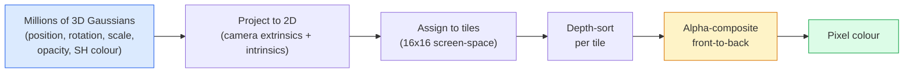

# Rozpryski gaussowskie 3D od podstaw

> Scena to chmura milionów trójwymiarowych Gaussów. Każdy z nich ma położenie, orientację, skalę, nieprzezroczystość i kolor zależny od kierunku patrzenia. Zrasteryzuj je, podeprzyj rasteryzację i gotowe.

**Typ:** Kompilacja
**Języki:** Python
**Wymagania wstępne:** Faza 4 Lekcja 13 (Wizja 3D i NeRF), Faza 1 Lekcja 12 (Operacje tensorowe), Faza 4 Lekcja 10 (opcjonalnie podstawy dyfuzji)
**Czas:** ~90 minut

## Cele nauczania

- Wyjaśnij, dlaczego 3D Gaussian Splatting zastąpiło NeRF jako domyślną produkcyjną metodę fotorealistycznej rekonstrukcji 3D w 2026 roku
- Podaj sześć parametrów gaussowskich (położenie, kwaternion obrotu, skala, nieprzezroczystość, kolor harmoniki sferycznej, cecha opcjonalna) i ile elementów pływających ma każdy udział
- Zaimplementuj od podstaw rasteryzator rozpryskowy 2D Gaussa, używając kompozycji `alpha`, a następnie pokaż, jak przypadek 3D rzutuje na tę samą pętlę
- Użyj `nerfstudio`, `gsplat` lub `SuperSplat`, aby zrekonstruować scenę z 20–50 zdjęć i wyeksportować do rozszerzenia `KHR_gaussian_splatting` glTF lub OpenUSD 26.03 `UsdVolParticleField3DGaussianSplat` schemat

## Problem

NeRF przechowuje scenę jako wagi MLP. Każdy wyrenderowany piksel to setki zapytań MLP wzdłuż promienia. Trenowanie zajmuje godziny, renderowanie zajmuje kilka sekund, a wag nie można edytować — jeśli chcesz przesunąć krzesło w scenie, musisz przeszkolić się ponownie.

Wszystko to zastąpiło 3D Gaussian Splatting (Kerbl, Kopanas, Leimkühler, Drettakis, SIGGRAPH 2023). Scena jest wyraźnym zbiorem trójwymiarowych Gaussów. Renderowanie to rasteryzacja GPU przy ponad 100 fps. Trening trwa kilka minut. Edycja jest bezpośrednia: przetłumacz podzbiór Gaussa i przesuń krzesło. Do 2026 roku Grupa Khronos ratyfikowała rozszerzenie glTF dla ikon Gaussa, OpenUSD 26.03 dostarcza schemat ikon Gaussa, Zillow i Apartments.com renderują za ich pomocą nieruchomości, a większość nowych artykułów naukowych na temat rekonstrukcji 3D to warianty podstawowej idei 3DGS.

Model mentalny jest prosty, matematyka zawiera wystarczająco dużo ruchomych części, że większość wstępów zaczyna się od rasteryzacji i pomija projekcje i harmonie sferyczne. W tej lekcji omówiono całość — najpierw wersję 2D, a następnie rozszerzenie 3D.

## Koncepcja

### Co niesie Gauss

Jeden Gaussian 3D to parametryczna plama w przestrzeni posiadająca następujące atrybuty:

```
position         mu         (3,)    centre in world coordinates
rotation         q          (4,)    unit quaternion encoding orientation
scale            s          (3,)    log-scales per axis (exponentiated at render time)
opacity          alpha      (1,)    post-sigmoid opacity [0, 1]
SH coefficients  c_lm       (3 * (L+1)^2,)   view-dependent colour
```

Obrót + skala tworzą kowariancję 3x3: `Sigma = R S S^T R^T`. To jest kształt Gaussa w 3D. Sferyczne harmonie umożliwiają zmianę koloru w zależności od kierunku patrzenia — odbicia lustrzane, subtelny połysk, poświata zależna od widoku — bez zapisywania tekstur poszczególnych widoków. Przy stopniu SH 3 otrzymujesz 16 współczynników na kanał koloru, 48 współczynników pływających na Gaussa dla samego koloru.

Scena ma zazwyczaj 1–5 milionów Gaussów. Każdy przechowuje około 60 pływaków (3 + 4 + 3 + 1 + 48 + różne). To 240 MB dla sceny o rozdzielczości pięciu milionów Gaussa — znacznie mniej niż równoważna chmura punktów z teksturą punktową i o rząd wielkości mniej niż wagi MLP NeRF ponownie renderowane w wysokiej rozdzielczości.

### Rasteryzacja, a nie marsz promieni



Pięć kroków, wszystkie przyjazne dla GPU. Brak zapytań MLP na piksel. Pojedynczy RTX 3080 Ti renderuje 6 milionów ikon przy 147 fps.

### Krok projekcji

Gauss 3D w pozycji światowej `mu` z kowariancją 3D `Sigma` rzutuje na gaussian 2D w pozycji na ekranie `mu'` z kowariancją 2D `Sigma'`:

```
mu' = project(mu)
Sigma' = J W Sigma W^T J^T          (2 x 2)

W = viewing transform (rotation + translation of camera)
J = Jacobian of the perspective projection at mu'
```

Ślad Gaussa 2D to elipsa, której osie są wektorami własnymi `Sigma'`. Każdy piksel wewnątrz tej elipsy otrzymuje udział Gaussa ważony przez `exp(-0.5 * (p - mu')^T Sigma'^-1 (p - mu'))`.

### Reguła komponowania alfa

W przypadku jednego piksela pokrywające go Gaussa są sortowane od tyłu do przodu (lub równoważnie od przodu do tyłu w przypadku odwróconej formuły). Kolor składa się z tego samego równania, co każdy półprzezroczysty rasteryzator od lat 80. XX wieku:

```
C_pixel = sum_i alpha_i * T_i * c_i

T_i = prod_{j < i} (1 - alpha_j)       transmittance up to i
alpha_i = opacity_i * exp(-0.5 * d^T Sigma'^-1 d)   local contribution
c_i = eval_SH(SH_i, view_direction)    view-dependent colour
```

Jest to **to samo równanie, co renderowanie wolumetryczne NeRF**, tuż nad wyraźnym, rzadkim zestawem Gaussa zamiast gęstych próbek wzdłuż promienia. Ta tożsamość sprawia, że ​​renderowana jakość odpowiada NeRF — oba integrują to samo równanie pola promieniowania.

### Dlaczego to jest różniczkowalne

Każdy krok — projekcja, przydzielanie płytek, komponowanie alfa, ocena SH — jest różniczkowy w odniesieniu do parametrów Gaussa. Biorąc pod uwagę prawdziwy obraz, oblicz utratę wyrenderowanych pikseli, podparcie tła przez rasteryzator, zaktualizuj wszystkie `(mu, q, s, alpha, c_lm)` poprzez opadanie gradientu. W ponad 30 000 iteracjach Gaussa znajdują właściwe pozycje, skale i kolory.

### Zagęszczanie i przycinanie

Ustalony zestaw Gaussów nie może pokryć złożonej sceny. Trening obejmuje dwa mechanizmy adaptacyjne:

- **Klonuj** Gaussa w jego obecnym położeniu, gdy jego wielkość gradientu jest duża, ale jego skala jest mała — rekonstrukcja wymaga tutaj więcej szczegółów.
- **Podziel** wielkoskalowy Gauss na dwa mniejsze, gdy jego gradient jest duży — jeden duży Gauss jest zbyt gładki, aby zmieścił się w regionie.
- **Przytnij** Gaussa, którego nieprzezroczystość spada poniżej progu — nie wnoszą żadnego wkładu.

Zagęszczanie odbywa się co N iteracji. Scena zazwyczaj rozrasta się od ~100 tys. początkowych Gaussów (rozstawionych z punktów SfM) do 1-5 mln na koniec treningu.

### Harmoniczne sferyczne w jednym akapicie

Kolor zależny od widoku to funkcja `c(direction)` na sferze jednostkowej. Harmoniczne sferyczne są podstawą Fouriera kuli. Obetnij na stopniu `L`, a otrzymasz funkcje podstawowe `(L+1)^2` na kanał. Ocena koloru dla nowego widoku jest iloczynem skalarnym pomiędzy wyuczonymi współczynnikami SH i podstawą oszacowaną w kierunku patrzenia. Stopień 0 = jeden współczynnik = stały kolor. Stopień 3 = 16 współczynników = wystarczających do uchwycenia cieniowania Lamberta, odbicia lustrzanego i łagodnego odbicia. Papiery SD Gaussian Splatting domyślnie używają stopnia 3.

### Stos produkcyjny na rok 2026

```
1. Capture         smartphone / DJI drone / handheld scanner
2. SfM / MVS       COLMAP or GLOMAP derives camera poses + sparse points
3. Train 3DGS      nerfstudio / gsplat / inria official / PostShot (~10-30 min on RTX 4090)
4. Edit            SuperSplat / SplatForge (clean floaters, segment)
5. Export          .ply -> glTF KHR_gaussian_splatting or .usd (OpenUSD 26.03)
6. View            Cesium / Unreal / Babylon.js / Three.js / Vision Pro
```

### Warianty 4D i generatywne

- **Rozpryski gaussowskie 4D** — Gaussa są funkcjami czasu; wykorzystany w wolumetrycznym wideo (Superman 2026, „Helicopter” A$AP Rocky’ego).
- **Ikony generatywne** — modele zamiany tekstu na ikonę (Marble firmy World Labs), które wywołują halucynacje całych scen.
- **Bezzapachowa transformacja 3D Gaussa** — wariant NVIDIA NuRec do symulacji autonomicznej jazdy.

## Zbuduj to

### Krok 1: Gauss 2D

Najpierw budujemy rasteryzator 2D. Obudowa 3D sprowadza się do niej po projekcji.

```python
import torch
import torch.nn as nn
import torch.nn.functional as F

def eval_2d_gaussian(means, covs, points):
    """
    means:  (G, 2)      centres
    covs:   (G, 2, 2)   covariance matrices
    points: (H, W, 2)   pixel coordinates
    returns: (G, H, W)  density at every pixel for every Gaussian
    """
    G = means.size(0)
    H, W, _ = points.shape
    flat = points.view(-1, 2)
    inv = torch.linalg.inv(covs)
    diff = flat[None, :, :] - means[:, None, :]
    d = torch.einsum("gpi,gij,gpj->gp", diff, inv, diff)
    density = torch.exp(-0.5 * d)
    return density.view(G, H, W)
```

`einsum` wykonuje postać kwadratową `diff^T Sigma^-1 diff` dla każdej pary (Gaussa, piksela).

### Krok 2: Rasteryzator rozpryskowy 2D

Komponowanie alfa od przodu do tyłu. Głębokość w 2D nie ma znaczenia, dlatego dla uporządkowania używamy wyuczonego skalara Gaussa.

```python
def rasterise_2d(means, covs, colours, opacities, depths, image_size):
    """
    means:     (G, 2)
    covs:      (G, 2, 2)
    colours:   (G, 3)
    opacities: (G,)     in [0, 1]
    depths:    (G,)     per-Gaussian scalar used for ordering
    image_size: (H, W)
    returns:   (H, W, 3) rendered image
    """
    H, W = image_size
    yy, xx = torch.meshgrid(
        torch.arange(H, dtype=torch.float32, device=means.device),
        torch.arange(W, dtype=torch.float32, device=means.device),
        indexing="ij",
    )
    points = torch.stack([xx, yy], dim=-1)

    densities = eval_2d_gaussian(means, covs, points)
    alphas = opacities[:, None, None] * densities
    alphas = alphas.clamp(0.0, 0.99)

    order = torch.argsort(depths)
    alphas = alphas[order]
    colours_sorted = colours[order]

    T = torch.ones(H, W, device=means.device)
    out = torch.zeros(H, W, 3, device=means.device)
    for i in range(means.size(0)):
        a = alphas[i]
        out += (T * a)[..., None] * colours_sorted[i][None, None, :]
        T = T * (1.0 - a)
    return out
```

Nie szybko — prawdziwa implementacja wykorzystuje jądra CUDA oparte na kafelkach — ale dokładnie właściwa matematyka i w pełni różniczkowalna.

### Krok 3: możliwa do wyszkolenia scena 2D

```python
class Splats2D(nn.Module):
    def __init__(self, num_splats=128, image_size=64, seed=0):
        super().__init__()
        g = torch.Generator().manual_seed(seed)
        H, W = image_size, image_size
        self.means = nn.Parameter(torch.rand(num_splats, 2, generator=g) * torch.tensor([W, H]))
        self.log_scale = nn.Parameter(torch.ones(num_splats, 2) * math.log(2.0))
        self.rot = nn.Parameter(torch.zeros(num_splats))  # single angle in 2D
        self.colour_logits = nn.Parameter(torch.randn(num_splats, 3, generator=g) * 0.5)
        self.opacity_logit = nn.Parameter(torch.zeros(num_splats))
        self.depth = nn.Parameter(torch.rand(num_splats, generator=g))

    def covs(self):
        s = torch.exp(self.log_scale)
        c, si = torch.cos(self.rot), torch.sin(self.rot)
        R = torch.stack([
            torch.stack([c, -si], dim=-1),
            torch.stack([si, c], dim=-1),
        ], dim=-2)
        S = torch.diag_embed(s ** 2)
        return R @ S @ R.transpose(-1, -2)

    def forward(self, image_size):
        covs = self.covs()
        colours = torch.sigmoid(self.colour_logits)
        opacities = torch.sigmoid(self.opacity_logit)
        return rasterise_2d(self.means, covs, colours, opacities, self.depth, image_size)
```

`log_scale`, `opacity_logit` i `colour_logits` to nieograniczone parametry mapowane poprzez odpowiednią aktywację w czasie renderowania. Jest to standardowy wzór dla każdej implementacji 3DGS.

### Krok 4: Dopasuj Gaussa 2D do obrazu docelowego

```python
import math
import numpy as np

def make_target(size=64):
    yy, xx = np.meshgrid(np.arange(size), np.arange(size), indexing="ij")
    img = np.zeros((size, size, 3), dtype=np.float32)
    # Red circle
    mask = (xx - 20) ** 2 + (yy - 20) ** 2 < 10 ** 2
    img[mask] = [1.0, 0.2, 0.2]
    # Blue square
    mask = (np.abs(xx - 45) < 8) & (np.abs(yy - 40) < 8)
    img[mask] = [0.2, 0.3, 1.0]
    return torch.from_numpy(img)

target = make_target(64)
model = Splats2D(num_splats=64, image_size=64)
opt = torch.optim.Adam(model.parameters(), lr=0.05)

for step in range(200):
    pred = model((64, 64))
    loss = F.mse_loss(pred, target)
    opt.zero_grad(); loss.backward(); opt.step()
    if step % 40 == 0:
        print(f"step {step:3d}  mse {loss.item():.4f}")
```

Po ponad 200 krokach 64 Gaussów układa się w dwa kształty. Oto cały pomysł — zejście gradientowe na wyraźnych elementach geometrycznych.

### Krok 5: Od 2D do 3D

Rozszerzenie 3D utrzymuje tę samą pętlę. Dodatki:

1. Rotacja per-Gaussa to kwaternion, a nie pojedynczy kąt.
2. Kowariancja jest `R S S^T R^T` z `R` zbudowaną z kwaternionu i `S = diag(exp(log_scale))`.
3. Projekcja `(mu, Sigma) -> (mu', Sigma')` wykorzystuje zewnętrzne elementy kamery i jakobian rzutu perspektywicznego w `mu`.
4. Kolor staje się rozwinięciem sferyczno-harmonicznej; oceń to w kierunku patrzenia.
5. Sortowanie według głębi odbywa się na podstawie rzeczywistej przestrzeni kamery z, a nie wyuczonego skalara.

Każda implementacja produkcyjna (`gsplat`, `inria/gaussian-splatting`, `nerfstudio`) robi dokładnie to samo na GPU z jądrami CUDA opartymi na kafelkach.

### Krok 6: Ocena harmonicznych sferycznych

Baza SH do stopnia 3 ma 16 członów na kanał. Ocena:

```python
def eval_sh_degree_3(sh_coeffs, dirs):
    """
    sh_coeffs: (..., 16, 3)   last dim is RGB channels
    dirs:      (..., 3)       unit vectors
    returns:   (..., 3)
    """
    C0 = 0.282094791773878
    C1 = 0.488602511902920
    C2 = [1.092548430592079, 1.092548430592079,
          0.315391565252520, 1.092548430592079,
          0.546274215296039]
    x, y, z = dirs[..., 0], dirs[..., 1], dirs[..., 2]
    x2, y2, z2 = x * x, y * y, z * z
    xy, yz, xz = x * y, y * z, x * z

    result = C0 * sh_coeffs[..., 0, :]
    result = result - C1 * y[..., None] * sh_coeffs[..., 1, :]
    result = result + C1 * z[..., None] * sh_coeffs[..., 2, :]
    result = result - C1 * x[..., None] * sh_coeffs[..., 3, :]

    result = result + C2[0] * xy[..., None] * sh_coeffs[..., 4, :]
    result = result + C2[1] * yz[..., None] * sh_coeffs[..., 5, :]
    result = result + C2[2] * (2.0 * z2 - x2 - y2)[..., None] * sh_coeffs[..., 6, :]
    result = result + C2[3] * xz[..., None] * sh_coeffs[..., 7, :]
    result = result + C2[4] * (x2 - y2)[..., None] * sh_coeffs[..., 8, :]

    # degree 3 terms omitted here for brevity; full 16-coefficient version in the code file
    return result
```

Nauczyłem się, że `sh_coeffs` przechowuje „kolor w każdym kierunku” dla tego Gaussa. W czasie renderowania oceniasz bieżący kierunek widoku i otrzymujesz 3-wektorowy RGB.

## Użyj tego

Do prawdziwej pracy 3DGS użyj `gsplat` (Meta) lub `nerfstudio`:

```bash
pip install nerfstudio gsplat
ns-download-data example
ns-train splatfacto --data path/to/data
```

`splatfacto` jest trenerem 3DGS firmy Nerfstudio. W przypadku typowej sceny przebieg na RTX 4090 zajmuje 10–30 minut.

Opcje eksportu, które mają znaczenie w 2026 roku:

- `.ply` — surowa chmura Gaussa (przenośna, największy plik).
- `.splat` — skwantowany format PlayCanvas / SuperSplat.
- glTF `KHR_gaussian_splatting` — standard Khronos, przenośny dla różnych przeglądarek (luty 2026 RC).
- OpenUSD `UsdVolParticleField3DGaussianSplat` — w wersji natywnej dla USD, dla potoków NVIDIA Omniverse i Vision Pro.

W przypadku scen 4D/dynamicznych `4DGS` i `Deformable-3DGS` rozszerzają tę samą maszynerię za pomocą zmiennych w czasie środków i nieprzezroczystości.

## Wyślij to

Ta lekcja daje:

- `outputs/prompt-3dgs-capture-planner.md` — monit planujący sesję przechwytywania (liczba zdjęć, droga kamery, oświetlenie) dla danego typu sceny.
- `outputs/skill-3dgs-export-router.md` — umiejętność wyboru odpowiedniego formatu eksportu (`.ply` / `.splat` / glTF / USD) biorąc pod uwagę przeglądarkę lub silnik.

## Ćwiczenia

1. **(Łatwe)** Uruchom trenera ikon 2D powyżej na innym obrazie syntetycznym. Zmień `num_splats` w `[16, 64, 256]` i wykreśl MSE vs krok dla każdego. Zidentyfikuj punkt malejących zysków.
2. **(Średni)** Rozszerz rasteryzator 2D, aby obsługiwał kolory RGB per Gaussa, które zależą od skalarnego „kąta widzenia” poprzez harmoniczną stopnia 2. Trenuj na parze obrazów docelowych i sprawdź, czy model rekonstruuje oba.
3. **(Trudny)** Sklonuj `nerfstudio` i przeszkol `splatfacto` w zakresie 20 zdjęć dowolnej sceny, którą posiadasz (biurko, roślina, twarz, pokój). Eksportuj do glTF `KHR_gaussian_splatting` i otwórz go w przeglądarce (Three.js `GaussianSplats3D`, SuperSplat, Babylon.js V9). Raportuj czas szkolenia, liczbę Gaussów i renderowane fps.

## Kluczowe terminy

| Termin | Co ludzie mówią | Co to właściwie oznacza |
|------|----------------|----------------------|
| 3DGS | „Plamy Gaussa” | Wyraźna reprezentacja sceny jako miliony Gaussów 3D z pozycją per Gaussa, obrotem, skalą, nieprzezroczystością, kolorem SH |
| Kowariancja | „Kształt Gaussa” | `Sigma = R S S^T R^T`; orientacja i skala anizotropowa jednego Gaussa |
| Komponowanie alfa | „Mieszanie od tyłu do przodu” | To samo równanie, co renderowanie wolumetryczne NeRF, teraz na jawnym, rzadkim zestawie |
| Zagęszczenie | „Klonuj i dziel” | Adaptacyjne dodanie nowych Gaussów tam, gdzie rekonstrukcja jest niewystarczająca |
| Przycinanie | „Usuń małe krycie” | Usuń Gaussa, który podczas treningu zapadł się do poziomu krycia bliskiego zeru |
| Harmoniczne sferyczne | „Kolor zależny od widoku” | podstawa Fouriera na kuli; przechowuje kolor jako funkcję kierunku patrzenia |
| Splatfacto | „3DGS Nerfstudio” | Najprostsza droga do szkolenia 3DGS w 2026 roku |
| `KHR_gaussian_splatting` | „standard glTF” | Rozszerzenie Khronos 2026, które umożliwia przenośność 3DGS w różnych przeglądarkach i silnikach |

## Dalsze czytanie

- [3D Gaussian Splatting for Real-Time Radiance Field Rendering (Kerbl et al., SIGGRAPH 2023)](https://repo-sam.inria.fr/fungraph/3d-gaussian-splatting/) — artykuł oryginalny
- [gsplat (Meta/nerfstudio)](https://github.com/nerfstudio-project/gsplat) — rasteryzator CUDA o jakości produkcyjnej
- [nerfstudio Splatfacto](https://docs.nerf.studio/nerfology/methods/splat.html) — referencyjny przepis na trening
– [rozszerzenie Khronos KHR_gaussian_splatting](https://github.com/KhronosGroup/glTF/blob/main/extensions/2.0/Khronos/KHR_gaussian_splatting/README.md) — format przenośny na rok 2026
– [Informacje o wersji OpenUSD 26.03](https://openusd.org/release/) — schemat `UsdVolParticleField3DGaussianSplat`
- [THE FUTURE 3D State of Gaussian Splatting 2026](https://www.thefuture3d.com/blog-0/2026/4/4/state-of-gaussian-splatting-2026) — przegląd branży